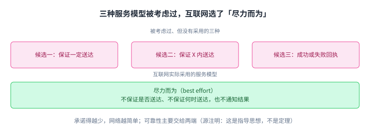
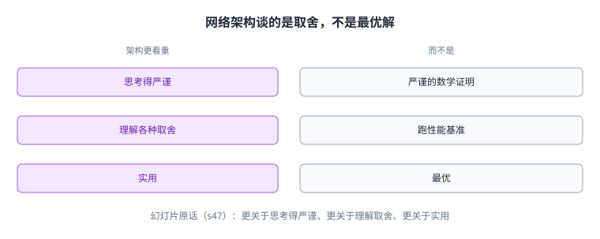

+++
title = "互联网是怎么连起来的：分层与协议"
lecture = 1
slug = "internet-architecture-and-protocols"
status = "draft"
source_kind = "textbook"
source_url = "https://textbook.cs168.io/intro/intro.html"
source_title = "Introduction to the Internet"
output_mode = "explanation"
+++

> 来源课程：UC Berkeley CS 168 Introduction to the Internet（授课：Ion Stoica、Sylvia Ratnasamy）
> 对应内容：第 1 讲 Intro 1「Architecture and Protocols」（官方幻灯片 52 页）；教材 Introduction / Layers / Headers / Network Architecture 四章
> 官方链接：<https://cs168.io/> · 教材 <https://textbook.cs168.io/>
> 授权依据：教材为 CC BY-SA 4.0（已核实）；课程站的讲义、幻灯片与项目未声明许可，因此本站只做原创讲解
> 本文为 CourseLingo 原创讲解，非官方材料，与原课程方无隶属关系。
> 化简声明：文中的两列对照、类比与「为什么走不通」的推演，有一部分是我们的教学化简，不是源里的原话；凡属此类都在当句写明「我们的化简」或「我们的理解」。数字与引用一律标出处。

## 一、「互联网」有两个含义

这一讲要解决三个问题：互联网到底指什么，它为什么会长成今天这样，以及后面要学的那些协议究竟在解决同一件事的哪一部分。

先从一个容易踩空的地方开始。幻灯片给 [[term:internet]] 这个词列了两个含义：第一义是把计算设备连起来的那套基础设施，由 TCP、IP、BGP、DNS、OSPF 这些协议和设备组成；第二义是建立在它上面的一整片应用生态，比如 amazon、twitter、chatGPT。幻灯片还专门加了一句：本课程用的是第一义。

下面这张图把两个含义摆在一起。

分清这两层之后，一个老问题就好办了。[[term:world-wide-web]]只是第二义里的一部分，也就是浏览器里访问的那部分应用；教材特意提醒，互联网与万维网不是同一个东西。音视频通话、在线游戏、冰箱和汽车里的传感器，用到的都是第一义那条基础设施。

后面要反复用的几个词，先在这里立起来。真正收发数据的机器叫[[term:end-host]]；两台机器之间的一条直接连接叫[[term:link]]；自己不收发数据、只为别人转发的机器叫[[term:switch]]；而拥有并运营这些设施的机构叫[[term:isp]]。

## 二、它不是又一种网络技术

第二件事最容易想歪。直觉上，要连通全世界，似乎该设计一套更好的网络技术，让所有人搬过来。幻灯片的说法正好相反：网络技术早就有很多种，以太网、光纤、Wi-Fi 接入点、DSL、Infiniband 交换机都算；互联网并不是其中新的一种，它是把不同的网络连起来。

「再造一套」走不通的原因很直接：现成的网络已经在那里了。幻灯片给了一个数量级：互联网互连了十万多个独立运营的网络，它们分属不同公司、不同国家，谁都不归谁管。

图里把这条对比摊开。这个两列对照是我们的化简：源只说了「互联网不是又一种网络技术，而是把不同的网络连起来」，并没有把「另建一张网」写成一个被考虑过、又被否决的方案。

这张图想说的是一件事：源的重点不在「造一套更好的技术」，而在「让十万多个各自为政的网络互通」。

## 三、核心思路：用一层「窄腰」把不同的网络缝起来

既然换不掉现成的网络，那就让它们各自保留。每片网络内部爱怎么传就怎么传，跨出这片网络时，大家遵守同一套约定。

这套约定该放在哪一层，教材给了明确答案：看分层图你会发现，第三层只有一个协议，这就是让互联网连成一片的「[[term:narrow-waist]]」，最终所有人都必须会说 IP，分组才能跨越整个互联网。幻灯片的设计原则清单里也有同一条，写作 federation via a narrow waist interface。

窄腰这个词值得记住，它本身是一句取舍：上层可以有很多种应用协议，下层可以有很多种链路技术，中间只留一个大家都会说的协议。缝的过程靠[[term:layering]]：数据往下一层走，就被包上那一层的[[term:header]]，往下走几层，外面就多几层信封。

首部里至少要放目的地址。教材说通常还会放源地址（好让对方回信）、校验和（发现传输途中被损坏）和分组长度。它还有一件常被忽略的用处：解复用，也就是每层的首部里留一个字段，说明载荷接下来该交给上层的哪个协议处理。

图里把「每跳都换的部分」和「一路不换的部分」对齐排开。

这里要纠正一个容易想反的地方：读首部、做转发决定的是沿途的[[term:switch]]与[[term:router]]，不是接收方。教材的比喻很准：邮局不该拆开你的信，它只看信封上的地址，网络设施同样只读首部来决定怎么把数据送出去。

顺便交代一个用词。教材描述这个机制时用的是「一层层包起来」，并没有用「封装」这个词；「封装」是我们为了行文方便沿用的一般叫法，对应 [[term:encapsulation]]。

## 四、协议：报文长什么样，收到之后做什么

前面反复说的「共同约定」，课程里叫[[term:protocol]]。幻灯片的定义是：协议规定了通信双方交换哪些报文，以及这些报文的[[term:syntax]]与[[term:semantics]]；它很像人与人之间的交谈惯例，决定了谁先开口、对方该怎么接。

以 Alice 向 Bob 要一个文件为例，一套约定可以长这样：Alice 先说 hello，Bob 回一个 hello，Alice 再说「请给我这个文件」，Bob 把文件内容回过来。

图里按时间顺序画了这四条报文。

四条报文的顺序本身就是约定的一部分。教材对「去掉 hello 会怎样」只给了一句：如果只求最快拿到文件，可以不发开头的问候。至于「省掉问候就失去了确认对方在线的机会」，那是我们的推论，教材里没有这句。幻灯片上另有一页把 hello 之后同样的请求连发了很多次，但那一页没有配文字（s24）。

选哪种约定取决于你在乎什么，而设计协议比看上去难，教材和幻灯片都把这句话单独强调了一遍。

标准写在哪里也有讲究。互联网的协议通常发布成 [[term:rfc]] 文档，用编号引用，例如 RFC 1918 地址；不是每份 RFC 最后都被广泛采用。负责互联网这一侧标准化的是[[term:ietf]]；[[term:ieee]]更多管底层电气工程那一侧。

## 五、联邦：互操作是最重要的目标

协议之所以难谈，是因为互联网是一个[[term:federation]]：每个[[term:isp]]自己运营自己的网络，可要连通全世界，大家必须遵守同一套协议。幻灯片把这一点写成了最重要的一句：互操作是互联网的目标。

随之而来的是三个后果，幻灯片逐条列了。第一，互相竞争的网络提供者必须合作才能服务各自的客户，于是商业因素与技术因素长期拉扯，现实里的利益决定了拓扑、选路与诊断怎么做。

第二，创新变得麻烦。幻灯片在这里问了一句：当互操作要求大家都支持同一个协议时，你靠什么做出区别。教材把其中一半说得更直白：在互联网上，一个只有你有的功能，你也没法用。源把问题留在这里，没有给出答案。

第三，升级「互联网」不是一个选项，这是幻灯片原话。它出现在讲联邦的那一页，是联邦的后果，不是某个备选方案的代价。图里画的是联邦这一串后果。

这句话里的「升级」是一个具体动作：换掉大家共用的那套共同协议。教材把这一步写得更具体：共同协议一旦设计好、部署到互联网上，就很难再改，因为必须让所有人都同意改（headers 章）；所有人都得说同一种共同语言，所以任何一次升级都必须把互操作放在心上（intro 章）。互联网又互连了十万多个互不隶属的网络，设计上还是去中心化的（s41/s43 的设计原则清单），没有中央调度者能下令让它们一起换，所以任何一方都无法单方面升级。

回环上的「创新被拖慢」是源里的结论（原话是 complicates innovation）；至于「先动手的人付出成本」这半句，是我们补上的。

## 六、规模与异步

联邦带来一个好处：规模。源里的说法是，联邦让互联网可以做到极大的规模。幻灯片给了几个具体数字：用户超过 50 亿，网页地址 1.24 万亿个；每一秒里，世界上产生一万多条推文、十万多次 Google 查询、三百多万封邮件。

规模之外还有一个物理约束：数据跑不过光速。幻灯片算过一笔账：伯克利到纽约 4,125 公里，按每秒 30 万公里算往返要 27.5 毫秒；一颗 3 GHz 的 CPU 在这段时间里能执行 8,400 万个周期。这个 8,400 万是幻灯片给的数：按往返 27.5 毫秒现算应该是 8,250 万，源自己算不拢，我们照搬并说明。图里把同一段时间里的两件事画在一起。

所以幻灯片才说，通信的反馈永远是过期的：你收到的那条消息描述的是 27.5 毫秒之前的世界，而本机已经往前走了 8,400 万个周期。至于这件事为什么会让可靠传输变难，那是后面几讲的内容，本讲没有展开。

## 七、故障与多样性

故障是互联网的另一个定义性特征，源把它与联邦、规模、异步并列，而不是当成联邦的后果。幻灯片列出一条路径上的部件：软件、交换机、链路、网卡、无线接入点、调制解调器。然后给了一个很能说明问题的算法：一条路径上有 50 个部件，每个部件 99% 的时候是好的，那么整条路径通信失败的概率是 39.5%。

图里把这条算术画成了三条长度不同的条形。

这就是「容易坏」背后的算术支撑：0.99 连乘 50 次约等于 0.605。再叠加刚才的异步，坏消息也要过很久才传得回来。

多样性同样夸张。幻灯片列了操作范围：时延从微秒到秒，跨越 10 的 6 次方；[[term:bandwidth]]从每秒 1 千比特到每秒 1 太比特，跨越 10 的 8 次方；可靠性从 0 到 90%；设备从传感器一直到[[term:data-center]]；用户里既有普通人和政府，也有故意捣乱的人；应用从 WhatsApp 这样的即时消息，一直到直播视频、在线游戏和远程医疗。

而这一切还在变。幻灯片的对比是：1970 年代链路速率是每秒 10 的 4 次方比特、全美不到 100 台计算机；今天是每秒 10 的 14 次方比特、全球上百亿台设备。幻灯片在讲持续演化的那一页还写了一句硬约束：变化必须是向后兼容的、增量的、并且就地完成（页面上用的词是 backward compatible、incremental、in place）。

## 八、服务模型：为什么选「尽力而为」

前面讲了协议长什么样，还有一个问题没回答：网络到底向使用它的人承诺什么。幻灯片把它叫做网络与端主机之间的「合同」，并列出三个候选：保证数据一定送达；保证在某个时间内送达；送达成功或失败都给一个回执。

三个候选都没有被采用。互联网实际提供的是「[[term:best-effort]]」：不保证是否送达，不保证何时送达，也不通知结果。图里把三个候选和最终选择放在一起。

能这么「不负责」是有理由的，教材在讲端到端原则时说：可靠性最终只能由两端自己实现才靠得住，网络就算多做一层保证，端主机照样得自己校验一遍；既然如此，网络里那一层就只是额外的复杂度与成本。这里的端主机，就是真正收发数据的机器。

但这条原则的分量要说准。教材明确写着：端到端原则不是一条定理，它只是一条指导性的、带有哲学论证味道的原则。教材自己就给了反例：10 条链路各 10% 的失败率，丢包率会到 65%；如果每一跳都多发一份，丢包率能降到 1%；无线链路也有时会在网内做一层可靠性，用来降低错误率、改善端主机的体验。所以「网内多做一层只是额外成本」不能读成定论。

## 九、代价与边界：架构谈的是取舍

这一讲的代价已经在前面几节摊开了：拢不住的利益拉扯、被拖慢的创新、注定会坏的路径。到了收尾，幻灯片交代的是这门课怎么看待这些取舍：网络架构更关于思考得严谨，而不是做严谨的数学；更关于理解取舍，而不是跑性能基准；更关于实用，而不是最优。图里把这三条对照摆开。

这三条解释了为什么这门课少有定理和公式。幻灯片的说法更直白：没有理论模型可套，「代码能跑」说明不了什么，性能基准又太窄。取而代之的是一串问题：目标怎么排序、约束是什么、问题怎么拆分、要哪些抽象、[[term:trade-off]]怎么定。幻灯片把这串问题收成一句：这是一堂如何设计网络化系统的课。

边界也要说清楚。这一讲只解释了「为什么要这么设计」，每一层具体怎么运转要看后面几讲。幻灯片自己也强调，这套设计只是众多可能之一，而且一直在被质疑（s44）：集中控制的 SDN、给 AI 集群做的无损网络都是这一路上被质疑的方向，同一页还列了边缘计算、低轨卫星网络的网内存储、跨层优化这几项；源把它们写成开放的问句，而不是已经成立的反驳。另外教材标着 beta，明说没有校对、可能有错，遇到争议以课堂为准。所以本文是二手讲解。

## 十、脉络回顾：这一讲在整门课的位置

回到开头那三个问题。互联网是那套搬数据的[[term:infrastructure]]；它长成今天这样，是因为真正的难题是「把已有的网络连起来」；后面所有协议都在处理这件事的不同侧面。

幻灯片把整套主张收成一张清单，这是本课的设计原则，也是这门课的[[term:architecture]]：

| 设计原则 | 一句话 |
| --- | --- |
| 去中心化控制 | 没有中央调度者 |
| 尽力而为的服务模型 | 不承诺，也不通知结果 |
| 绕开故障 | 坏了就换一条路走 |
| 笨基础设施加聪明端点 | 网络只管转发，智能放在两端 |
| 端到端原则 | 能在两端做的事就不要放进网络 |
| 分层 | 每一层只解决一类问题 |
| 靠「窄腰」实现联邦 | 全世界都得会说 IP |

幻灯片还把整门课放进互联网演化的三个阶段里。第一阶段是把全球数据通信网建起来，留下分组交换、分层、命名（DNS）、路由（IP）、可靠传输（TCP）与拥塞控制；第二阶段从 1995 年前后开始，是规模化与商业生态的兴起：CDN、BGP 策略、NAT、防火墙、HTTP；第三阶段从 2005 年延续到今天，数据中心与云、SDN、fat-tree、RDMA，以及为 AI 而建的网络都在这一段里。界线按各阶段要解决的核心问题与代表技术来切：1995 年是互联网商业化，2005 年是数据中心与云的兴起。后面每一讲基本都落在这三个阶段之中。

接下来这门课会依次走到这些地方。[[term:local-area-network]]与[[term:link]]讲一片网络内部怎么把[[term:packet]]送到对端；[[term:network-layer]]讲跨网络的[[term:ip-address]]怎么分配、[[term:routing]]与[[term:forwarding]]怎么分工；[[term:transport-layer]]讲丢了怎么办、发送速率怎么由[[term:congestion-control]]决定；[[term:application-layer]]讲 DNS 与 HTTP 这类直接面向用户的东西；再往后是[[term:data-center]]里的网络。[[term:physical-layer]]、[[term:link-layer]]、[[term:router]]、[[term:switch]]、[[term:asynchronous]]这些词，也会在这些章节里逐个展开。

## 读完应该能回答

- 本课程说的「互联网」是哪一个含义，另一个含义又指什么？
- 为什么互联网的难题不是造一套更好的网络技术，而是让十万多个网络互通？
- 50 个部件各自 99% 可靠，为什么整条路径的失败率会接近四成？

## 溯源

- 官方幻灯片 Lec01（52 页）页码：s14（两个含义）、s25（协议定义）、s31（不是又一种网络技术）、s32（互操作与十万多个网络）、s33（联邦的后果与「升级不是一个选项」）、s34（规模数字）、s35（8,400 万个周期）、s36（39.5%）、s37（操作范围）、s38（1970 年代对比，以及该页那句「change must be backward compatible, incremental, and in place」）、s39（互联网的六个定义性特征）、s40（复杂到没有理论模型、代码能跑说明不了什么、性能基准太窄）、s41/s43/s44（设计原则清单；s44 另有被质疑的方向）、s42（服务模型）、s45（五个问题）、s47（三条对照）、s48–s51（演化三阶段）
- 教材 Introduction 一章：<https://textbook.cs168.io/intro/intro.html>（互联网与万维网的区别、RFC 与标准组织、升级必须顾及互操作）
- 教材 Network Architecture 一章：<https://textbook.cs168.io/intro/architecture.html>（窄腰、端到端原则、解复用与设计主张；Lecture 4 的 Reading，本讲参考）
- 教材 Headers 一章：<https://textbook.cs168.io/intro/headers.html>（首部与载荷、只读首部转发、一层层包起来、首部里放什么、多层首部、首部部署后极难更改；第 3 讲的 Reading，本讲参考）
- 教材 Layers 一章：<https://textbook.cs168.io/intro/layers.html>（分层与服务模型；layers 与 headers 是第 3 讲的 Reading，本讲参考）
- 课程与阅读安排：<https://fa26.cs168.io/>（讲次表在首页；`/calendar/` 只是日历挂件，静态正文无此表）
- 授权依据：教材 CC BY-SA 4.0；本文原创，不含原文段落，不复制教材与幻灯片插图。
