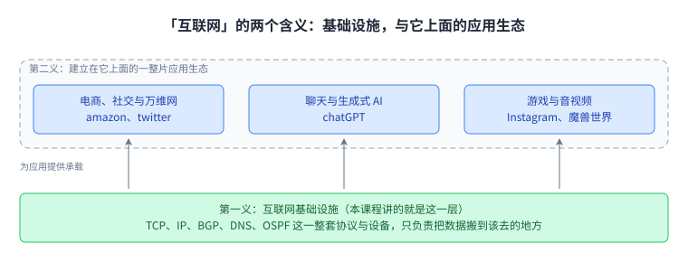
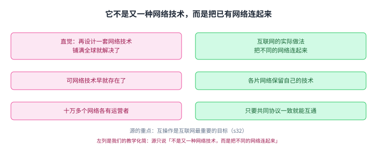
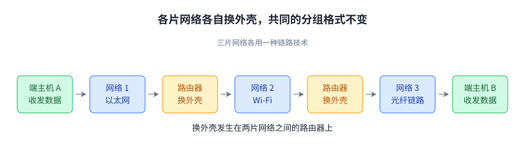
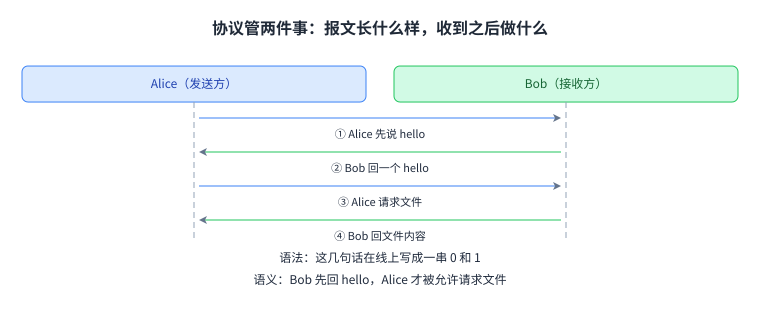
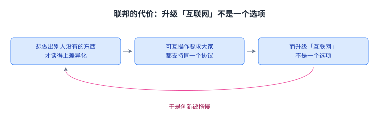
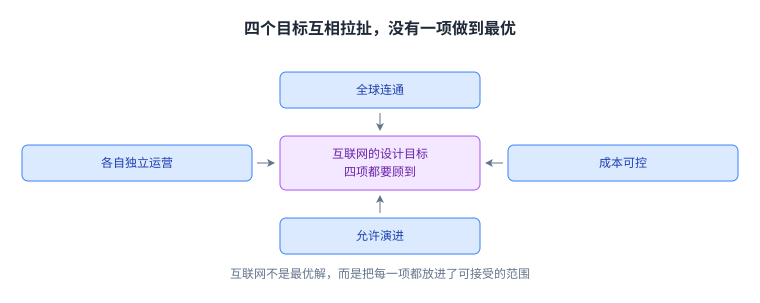

+++
title = "互联网是怎么连起来的：分层与协议"
lecture = 1
slug = "internet-architecture-and-protocols"
status = "draft"
source_kind = "textbook"
source_url = "https://textbook.cs168.io/intro/intro.html"
source_title = "Introduction to the Internet"
output_mode = "explanation"
+++

> 来源课程：UC Berkeley CS 168 Introduction to the Internet（授课：Ion Stoica、Sylvia Ratnasamy）
> 对应内容：第 1 讲 Intro 1「Architecture and Protocols」；教材《Introduction to the Internet: Architecture and Protocols》的 Introduction 一章
> 官方链接：<https://cs168.io/> · 教材 <https://textbook.cs168.io/intro/intro.html>
> 授权依据：教材为 CC BY-SA 4.0（已核实）；课程站的讲义、幻灯片与项目未声明许可，因此本站只做原创讲解
> 本文为 CourseLingo 原创讲解，非官方材料，与原课程方无隶属关系。

## 一、先把两件事分开：互联网不是网站

这一讲要解决三个问题：互联网到底指什么，它为什么会长成今天这样，以及后面要学的那些协议，究竟在解决同一件事的哪一部分。

先分清最容易被混为一谈的两个词。[[term:internet]]指把数据在全世界搬来搬去的那套[[term:infrastructure]]：光缆、无线基站、交换机、路由器，加上跑在它们上面的软件。[[term:world-wide-web]]只是跑在它上面的一个应用，也就是你在浏览器里打开的那部分。

下面这张图把这两层的上下关系摊开了。

所以「能上网」和「能看网页」不是一回事。音视频通话、在线游戏、冰箱与汽车里的传感器，用的都是同一条基础设施。教材特意点明：互联网与万维网不是同一个东西。

一个具体的对照能说明差别有多大：Zoom 通话和网页浏览走的是同一批海底光缆，可两者对时间的要求完全不同。网页慢一点没人察觉，通话慢一点就会打断对话节奏。教材没有展开这一点，这是我们的理解。

## 二、最省事的做法，为什么走不通

面对「把不同网络连起来」这件事，最直觉的方案是再建一张更大的网，让所有人搬过来。可电线与光缆这类技术早就有了，互联网带来的新难题不是再造一种网络技术，而是把已经存在、彼此不同的网络拼在一起。

图里把两种做法的账并排列出。

一句话总结这张图：新建方案要求所有人先让步，互连方案只要求所有人说同一种话。

最后一条代价最容易被低估。升级要等唯一的老板点头，等于把创新的速度绑在单点决策上。而现实中这些网络分属不同公司、不同国家，本来就不存在这样一个老板。

## 三、核心思路：不造新网络，只造互连的规矩

既然换不掉现成的网络，那就让它们各自保留。每一片网络内部爱怎么传就怎么传，跨出这片网络时，大家遵守同一套约定。这是整套设计的起点。

关键在于这个约定放在什么位置。以太网的帧格式、无线链路的编码方式、光纤上的信号，三者毫无共同点；但只要在每个分组前面加一段共同格式的说明，接收方就能知道这包数据该往哪儿去。

图里把「每跳都换的部分」和「一路不换的部分」对齐排开。

这张图的重点在那条对齐线：变的是外壳，不变的是中间那份共同约定。

这套想法正式的名字叫[[term:layering]]，它靠[[term:encapsulation]]落地：上层的一整块数据被放进下层的载荷里，下层再补上自己的[[term:header]]。层层往下，最里面是用户的数据，最外面是能在光缆上跑的比特。

## 四、协议：报文长什么样，收到之后做什么

前面反复说的「共同约定」，课程里叫[[term:protocol]]。它管两件事：报文长什么样，以及收到报文之后该做什么。

以 Alice 向 Bob 要一个文件为例，一套约定可以长这样：Alice 先说 hello，Bob 回一个 hello，Alice 再说「请给我这个文件」，Bob 把文件内容回过来。

图里按时间顺序画了这四条报文。

四条报文的顺序本身就是约定的一部分。省掉开头那两句问候，双方就失去了一次确认对方在线、并且听懂了自己话的机会。

这条约定里其实藏着两件不同的事。[[term:syntax]]管「这几句话怎么写成一串 0 和 1」；[[term:semantics]]管「在什么条件下才允许说哪一句」。上图那四条报文，语法上是四串比特，语义上则规定了 Bob 没回 hello 之前，Alice 不许请求文件。

协议不止一种。如果 Alice 只求最快拿到文件，完全可以省掉问候直接请求。省掉问候赚到了一次往返的时间，代价是丢掉一次确认机会。选哪一种，取决于你到底在乎什么。

设计协议比看上去难。教材举了一个很能说明问题的边界情况：Alice 请求文件，Bob 却回了一个 hello，这时 Alice 该如何应对并没有标准答案，只能写进协议。此外还要考虑程序缺陷，以及故意捣乱的一方。

标准写在哪里也有讲究。互联网的协议通常发布成 [[term:rfc]] 文档，并且用编号来引用，例如 RFC 1918 地址。不是每一份 RFC 最后都被广泛采用。负责互联网这一侧标准化的组织是[[term:ietf]]；[[term:ieee]]更多管底层电气与链路那一侧。

## 五、联邦：竞争对手也必须说同一种话

协议之所以难谈，是因为互联网是一个[[term:federation]]：每个[[term:isp]]自己运营自己的网络，可要连通全世界，大家必须遵守同一套协议。

第一个后果是竞争者被迫合作。两家互相竞争的公司，谁也不愿意把内部情况交给对方，但接口必须对齐。所以设计协议时不能只看技术，还要看现实里的商业动机，否则对方根本不会答应运行你的代码。

第二个后果更要命：创新的门槛被抬高了。别的行业里，你做出一个别人没有的功能就能领先；在互联网上，只有你有的功能基本等于没有。图里那条回环说的就是这件事。

回环上那句「可没人愿意先改」是关键：先动手的人付出成本，收益却要等所有人跟上才出现。所以任何协议升级都必须把[[term:interoperability]]放在第一位。

## 六、规模：为什么异步、会坏、差异巨大

联邦还带来一个好处：规模。全世界不需要一家人去管理几十亿用户，只需要把各家运营商的网络互连起来。

规模又带来三个必须接受的事实。

第一个是硬件的差异与持续演化。接入技术从家用链路一直到海底光缆，[[term:bandwidth]]差着好几个数量级，而且一直在换代。这意味着设计时根本没有一个固定的靶子可以瞄准。

第二个是必须异步。数据跑不过光速，跨半个地球走一趟，单程至少是几十毫秒，这还只是物理下限。图里把同一段时间里的两件事画在了一起。

所以发出去的那条消息，描述的是一个已经开始过期的世界。等它到达，本机早就往前走了很远，消息里的判断可能已经不成立。这是后面讲可靠传输时绕不开的根源。

第三个是故障。一条消息要走完很多部件，交换机、链路、软件，任何一个都可能坏，而且我们可能根本不知道它坏了。教材提醒：坏消息也许要过很久才传回来。互联网是第一个必须为大规模故障做设计的系统。

## 七、代价与边界：它不是最优解

到这里可以回答「代价是什么」了。同时满足所有目标是不可能的。

图里把压在同一个设计上的四项要求摆在一起。

这张图想说的是：任何一项被推到极致，都会挤掉另一项。成本压到最低，演进就慢；让每家完全自主，全球连通就难保证。

教材的结论很直接：互联网不是最优解，但它平衡了一大堆互相冲突的目标。这也是[[term:architecture]]这个词在本课程里的含义，谈的是目标、约束与[[term:trade-off]]，而不是定理和最优解。

边界也要说清楚。这一讲只解释了「为什么要这么设计」。每一层具体怎么运转，要看后面几讲。另外教材自己标着 beta，明说没有校对、可能有错，遇到争议以课堂为准。所以本文是二手讲解，与教材不一致时请以教材和课堂为准。

## 八、脉络回顾：这一讲在整门课的位置

回到开头那三个问题。互联网是一套搬数据的[[term:infrastructure]]；它长成今天这样，是因为真正的难题是「把已有的网络连起来」；后面所有协议，都在处理这件事的不同侧面。

串起来是这样一条链：换不掉现成的网络，所以要共同协议；要共同协议，所以要[[term:layering]]与封装；参与者是各自独立的[[term:isp]]，所以升级必须考虑[[term:interoperability]]；规模大到跨半个地球，所以必须异步，也必须为故障做设计。

接下来这门课会依次走到这些地方。[[term:local-area-network]]与[[term:link]]讲一片网络内部怎么把[[term:packet]]送到对端；[[term:network-layer]]讲跨网络的[[term:ip-address]]怎么分配、[[term:routing]]与[[term:forwarding]]怎么分工；[[term:transport-layer]]讲丢包了怎么办、发送速率怎么由[[term:congestion-control]]决定；[[term:application-layer]]讲 DNS 与 HTTP 这类直接面向用户的东西；再往后是[[term:data-center]]里的网络。[[term:physical-layer]]、[[term:link-layer]]、[[term:router]]、[[term:switch]]这些词，都会在这些章节里逐个展开。

## 读完应该能回答

- 为什么互联网的难题不是造一种新网络技术，而是把已有的网络连起来？
- 一个协议至少要写清哪两件事，各自对应本文的哪个例子？
- 联邦为什么会拖慢新功能上线，先动手的人亏在哪里？

## 溯源

- 教材 Introduction 一章：<https://textbook.cs168.io/intro/intro.html>（本文主要依据）
- 同章的分层一节：<https://textbook.cs168.io/intro/layers.html>（第 3 节分层与封装的依据）
- 课程第 1 讲：<https://cs168.io/> → 当学期 calendar 的 Lecture 1「Intro 1: Architecture and Protocols」
- 授权依据：教材 CC BY-SA 4.0；本文为原创中文讲解，不含原文段落，也不复制教材插图。
