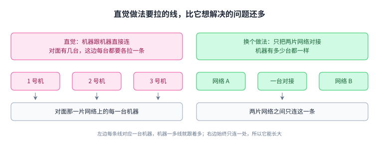
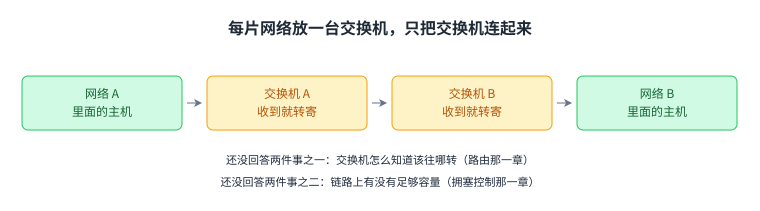
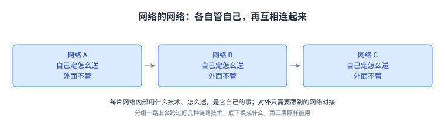
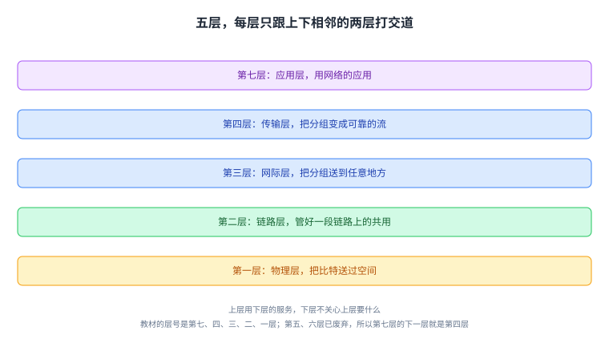
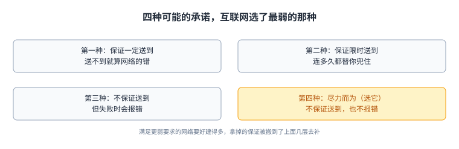
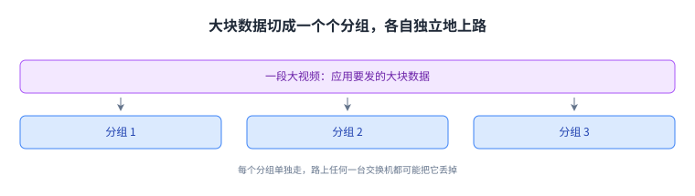

+++
title = "互联网是分层搭起来的"
lecture = 2
slug = "layers-of-the-internet"
status = "draft"
source_kind = "textbook"
source_url = "https://textbook.cs168.io/intro/layers.html"
source_title = "Layers of the Internet"
output_mode = "explanation"
+++

> 来源课程：UC Berkeley CS168 Computer Networks（教材 CS 168 Textbook）；
> 对应内容：Introduction 之 Layers of the Internet（<https://textbook.cs168.io/intro/layers.html>）；
> 上游许可：教材站在站根页声明 CC BY-SA 4.0（第二人复核见 `docs/audit/license-cs168-second-review.md`）；
> 本文由 CourseLingo 原创撰写：**按该节的推进顺序**重新讲解，关键句给出英文原文与中译，**不逐句全译**，配图全部自绘、不转载原图；
> 本文非官方材料，CourseLingo 与 UC Berkeley 及课程教学团队无隶属关系；如与原文有出入，以原文为准。

## 一、起点：先得有一条能把比特送出去的线

教材这一节是从最底下往上搭的，并且用邮政系统做贯穿的类比：寄信这件事，人和人早就做熟了，网络要解决的是同一类问题。

先说清楚这一页要讲的是什么：[[term:internet]]（Internet）这个名字，指的是一整套把网络连起来的做法。

搭任何网络，第一步都一样：得先有办法把一个信号送过空间。邮政里这一步是邮差、驿马快递（Pony Express）、卡车或信鸽；互联网里要送的是比特（bit），也就是 1 和 0，能用的技术有电线上的电压、无线电台的电磁波、光纤里的光脉冲。教材在这里划了一条明确的边界：

> "There are entire fields of electrical engineering dedicated to sending signals across space, but we won't go into detail in this class."
> （把信号送过空间，是有整个电气工程学科在研究的事；这门课不细讲。）

这就是第一层，[[term:physical-layer]]（physical layer）。它不关心送的是什么内容，只负责把一个个比特变成能在介质上传播的物理量，再在另一头还原出来。

三种技术差别很大，可它们要完成的任务完全一样。正因为它一样，上面才可能不去管底下用的是哪一种。

## 二、把两台机器连起来，再把一个院子连起来

有了能送信号的线，就能干第二件事：把两台机器连起来。教材的类比是从「连起两个家庭」开始的，再扩到「连起镇上所有家庭」。

互联网里，连接两台机器的这条线叫[[term:link]]（link）。链路可以用任何技术：有线、无线、光纤都行。如果拿链路把一片离得很近的计算机连起来，比如把加州大学伯克利分校校区里的机器连起来，就得到一片[[term:local-area-network]]（local area network，简称 LAN）。

这一层要解决的不止是「有根线」。教材点出了两件具体的事：

> "At Layer 2, we can also group bits into units of data called packets (sometimes called frames at this layer), and define where a packet starts and ends in the physical signal."
> （在第二层，我们可以把比特组织成叫分组的数据单位，物理信号里还要定义出分组的起止位置。）

先看「起止」。物理层送过去的是一串连续的比特，谁也不知道哪里是一段的开头、哪里是结尾，第二层要负责在里面标出边界。再看「共用」。一根线上不只一台机器要发数据，几台同时发就会撞在一起，这件事也要在这一层处理。这两件事合起来，就是[[term:link-layer]]（link layer）的活。

链路可以用有线、无线、光纤等任何技术；把一片院子里离得近的机器连起来，就得到一片局域网。

## 三、直觉做法为什么不行：把两个局域网连起来

到这一步，一片院子里的机器能互相通信了。接下来自然会问：两个不同地方的人要通信怎么办。

最直接的想法是拉线。在这两个局域网之间加一堆链路，把里面的机器两两接上。

> "One possible approach is to add a bunch of links between different local networks, but this doesn't seem very efficient. (What if the two local networks were in different continents?)"
> （一种可能的做法是在两个局域网之间加一堆链路，可这看起来不太高效。要是这两片网络在不同的洲呢。）

教材的反问点到了要害。机器数一多，需要拉的线会按平方级长；而距离一远，单独拉一条长线就更不划算。更要紧的是，这么连出来的东西没法长大：每加一片网络，就要跟已有的每一片都连一遍。（**「平方级」「长不大」「每加一片就要跟每一片连一遍」这三步是我们的推理**：源文在这里只说了「不太高效」，并反问了「要是这两片网络在不同的洲呢」。）

左边每条线对应一台本机，右边只连一处：能不能随机器数长大，差别就在这里。

## 四、核心思路：在每个网络里放一个邮局

换一个想法。不连机器，改连网络：在每片网络里放一台专门负责转发的设备，两片网络之间只把这两台设备接起来。

> "Instead, a smarter approach would be to introduce a post office in each network, and just connect the two post offices together."
> （更聪明的做法是在每片网络里设一个邮局，然后只把这两个邮局连起来。）

这样一来，网络 A 里的人要跟网络 B 里的人通信，只要把东西交给 A 的邮局；A 的邮局转给 B 的邮局，B 的邮局再送到收件人手上。互联网里这个「收信再转寄」的角色叫[[term:switch]]（switch），也叫[[term:router]]（router）。用交换机把局域网一片片接起来，接得足够多，就能把全世界连上，这就是互联网。

教材在同一节里立刻点出两个还没解决的问题，它们后来各成一章：

> "One question we'll need to answer is how to find paths across a network."
> （有个问题必须回答：在一片网络里怎么找到路。）

交换机收到一个[[term:packet]]（packet）时，怎么知道该往哪个口转发，才能让它更靠近目的地。这是[[term:routing]]（routing）那一章的主题。

> "We'll also need to make sure that there's enough capacity on these links to carry our data."
> （还要保证这些链路上有足够的容量把数据送过去。）

链路够不够宽、堵住了怎么办，这是[[term:congestion-control]]（congestion control）那一章的主题。教材还补了一句容易被忽略的话：除了设备，这门课也要研究**运营这些设备的人**。互联网的运营者是[[term:isp]]，比如 AT&T、亚马逊云，甚至伯克利自己。他们会按自己的商业与政治考量做决定，例如 AT&T 修了一条海底光缆，别的 ISP 想借道，就可能要被它收费。

交换机自己不收不发，只把分组往目的地推近；教材在同一节就点出了路由与拥塞控制两个待解问题。

## 五、网络的网络：家里的信与邮局的信

有了交换机，互联网就有了「网络的网络」这个形状：一片片小网络各自管自己的事，再互相连起来。教材特别提醒，不同链路可以用完全不同的第二层技术，有线以太网、光纤、无线蜂窝都行。在这一片网络内部怎么送，是第二层的事；而把「能在一段链路上送」当作积木、拼出「能送到互联网上任何地方」，是第三层的事。一个分组一路上会跨过很多种链路。

类比里有一个区分值得单独记：家庭是在**寄信和收信**的，邮局自己不寄也不收，它的存在只是为了帮别的家庭把信送到。

> "In the Internet, end hosts are machines (e.g. servers, laptops, phones) communicating over the Internet. By contrast, a switch (also called a router) is a machine that isn't sending or receiving its own data, but exists to help the end hosts communicate with each other."
> （互联网里，端主机是那些在通信的机器，服务器、笔记本、手机都算；交换机（也叫路由器）自己不发也不收数据，它存在只是为了帮端主机互相通信。）

教材顺便定了本书的画法：[[term:end-host]]（end host）画成圆，交换机画成方。这条约定在后面的图里会一直用。

每片网络内部怎么送是它自己的事，对外只需要跟别的网络对接。

## 六、抽象的层次：为什么全世界能一起工作

回头看前面几步，会发现一件事：我们一直在把一个大问题切成小块。教材在这里引了一句话来说明这不是巧合。

> "Modularity based on abstraction is the way things are done." (Barbara Liskov, Turing lecture)
> （以抽象为基础的模块化，就是做事的方式。这是 Barbara Liskov 在图灵讲座里的话。）

为什么要专门强调这一点。因为互联网不只是很多台机器，还是很多人和很多公司在共用。芯片设计者、写软件的、拉网线的、卖带宽的，各自关心的东西不一样。要让大家能一起工作，只有一条路：把任务切开，约定好每一块对外提供什么，然后各自去改自己那一块。

这就是[[term:layering]]（layering）带来的两样东西。一是每一片网络可以自己决定怎么送数据。你的分组一路上可能先走无线、再走有线，底下换了好几种技术，第三层的协议却照样能用。二是创新可以并行。做硬件的人和写软件的人可以在各自的层上往前推，不用等对方。

上层用下层的服务、下层不问上层要什么，这一层一层正是模块化的由来。

## 七、第三层的服务模型：尽力而为

到这里，似乎已经能往全世界送数据了，为什么不停下。教材说第三层（[[term:network-layer]]，教材叫 Internet Layer）还剩两个问题，先看第一个：服务模型。

同一层除了[[term:protocol]]（protocol）本身，还要说清它对上面承诺什么。这就是服务模型：网络与用户之间的一份约定，写明网络支持什么、不支持什么。教材把服务模型说成网络与用户之间的合同，写明网络支持什么、不支持什么。可以想象的合同有好几种。

> "The network guarantees that data is delivered. Or, the network guarantees that data is delivered within some time limit. Or, the network doesn't guarantee delivery, but promises to report an error on failure."
> （网络保证数据送达；或者保证在某个时限内送达；再或者不保证送达，但承诺失败时报错。）

互联网的设计者一种都没选。它采用的是[[term:best-effort]]（best-effort delivery）：网络会尽力把数据送到，但不保证一定送到，也不告诉你到底送没送到。

为什么选这么弱的承诺。教材给的理由只有一句。

> "One major reason is, it is much easier to build networks that satisfy these weaker demands."
> （一个主要原因是，满足这些更弱要求的网络要好建得多。）

承诺越弱，要对付的情况越少，网络就越容易做大、做便宜。这一层拿掉的那些保证并没有消失，上面几层要自己把它们补回来。（**这半句是我们的推论**：源文在解释「为什么选最弱的承诺」时只给了一条理由，重发与排序是到传输层才展开的。）

承诺越弱、网络越好建，所以互联网选了最弱的尽力而为，把保证挪到上面几层。

## 八、分组：为什么大东西必须切成小份

第三个问题出在第三层传送的单位上。第三层传的东西叫分组，它是一小段字节，在网络里跳来跳去，一直是作为一个整体在移动的。而分组的大小有上限：应用要发一段大东西，比如一段视频，就必须先把它切开，再一个个单独送出去。

> "If the application has some large data to send (e.g. a video), we need to somehow split up that data into packets, and send each packet through the network independently."
> （应用要发大数据时，得先把它切成一个个分组，再让每个分组各自独立地在网络里走。）

分组的一生大致是这样的：发送方把数据切成一个个分组；分组沿一条链路走到一台交换机；交换机把它转给目的地，或者转给一台离目的地更近的交换机；这样一跳一跳往前挪，直到抵达目的地。教材在这里提醒了一句：因为服务模型是尽力而为，路上任何一台交换机都可能把这个分组丢掉，谁也不能保证它真的到达。

切成小份是为了让任何一条链路都搬得动它，代价是每一份都要自己找路。

## 九、第四层：让应用不必再想分组

两个问题到齐了：大东西要切开，而切开之后的每一份都可能丢。教材的解法是再加一层。

[[term:transport-layer]]（transport layer）把第三层当作积木，在上面另做一个协议，负责把丢掉的分组重发、把数据切成合适的大小、把到达顺序乱掉的分组重新排好。这一层的意义可以用一句话概括：

> "The transport layer protocol allows us to stop thinking in terms of packets, and start thinking in terms of flows, streams of packets that are exchanged between two endpoints."
> （传输层让我们不必再按分组思考，而可以按「流」来思考，也就是两个端点之间交换的一串分组。）

这就是分层的实际收益：上面写程序的人不用管分组会不会丢，那是这一层的事。后面讲[[term:transport-layer]]的那一章，会把「怎么知道丢了」「重发多少次」「发快了会怎样」这些问题逐个展开。

把可靠性交给第四层之后，写应用的人就可以按「流」思考，不必盯着单个分组。

## 十、第七层与「不许跳层」，以及这两条规矩的代价

最上面是[[term:application-layer]]（application layer）。教材选了一个很实在的例子来说明这一层的价值：如果底下几层是专门为传视频造的，那么写邮件客户端的人就得自己另造一套传邮件的基础设施；而互联网被设计成一个通用的通信网络，任何类型应用的数据都能跑。

教材也说了这门课的重心：更关心支撑应用的基础设施，也就是邮差和邮局，而不是信里写了什么；常见的应用协议会放到课程后段去讲。

到这里，分层的两条规矩可以完整说出来了。第一，每一层只依赖它下面那一层提供的服务，只为它上面那一层提供服务。写第七层协议的人可以假设第四层会可靠地送数据，不必操心分组丢没丢。第二，两层之间只能通过它们之间的**接口**打交道，**没有实用的办法跳过中间层**，比如在第三层之上直接搭第七层。

> "There's no practical way to skip layers and build Layer 7 on top of Layer 3, for example."
> （比如，没有实用的办法跳过中间几层，直接在第三层上搭第七层。）

教材还顺手交代了一个常见疑问：第五层和第六层去哪了。答案是它们在 1970 年代标准化时被认为有用，如今已经过时：第五层本该把不同的流攒成一次会话，第六层本该帮用户把数据呈现出来，今天这两件事基本都在第七层里做。

分层不是不要代价。第一条代价是每一层都要自己的一份[[term:header]]（header），真正要送的数据外面会套上好几层壳，链路上跑的字节比原始数据多。第二条是接口把上下两层的约定固化了，跳层不被允许，于是「明明知道底下在做什么、想为它做点优化」这种想法会被结构挡住。第三条是看不见就管不着：上层拿到的服务越干净，它对底下的情况知道得就越少，出问题时也更难判断是哪一层的问题。这些账会在讲架构那一节里再算一遍。

三笔账分别落在体积、结构与可观测性上；它们不是实现缺陷，而是分层这套做法的前提。

## 读完应该能回答

1. 物理层、链路层、网际层各自解决什么问题，为什么上一层可以不关心下一层用的是什么技术。
2. 为什么「在两个局域网之间多拉几条线」长不大，而「每片网络放一个交换机、只连交换机」能长大。
3. 互联网的服务模型为什么选尽力而为，这一选择把哪些负担推给了上面的层。

## 脉络回顾

这一讲把互联网从一个很低的起点搭了上来：先有把比特送过空间的物理层，再有把机器连起来的链路层，然后引入交换机把一片片网络接成网络的网络，最后用服务模型、分组和传输层补上剩下几个缺口。它没有给出任何协议的具体做法，给出的是形状：一个分层的、每层只跟邻居打交道的结构。

后面每一讲都在这个结构里找一个格子往下钻。路由那一章回答「交换机怎么知道往哪转」，拥塞控制那一章回答「链路堵住了怎么办」，传输层那一章回答「怎么让流变得可靠」，架构那一节再回来算分层本身的账。看这一讲留下的那个习惯最有用：任何一个设计，先问它把哪一样牺牲掉了。

## 溯源

- 对应：UC Berkeley CS168 Computer Networks，教材 Introduction 之 Layers of the Internet（<https://textbook.cs168.io/intro/layers.html>）
- 教材：CS 168 Textbook（UC Berkeley CS168 课程教材），原文链接同上
- 授权依据：教材站根页声明 CC BY-SA 4.0；本文为本仓库原创中文讲解，按该节顺序重讲，关键句给出英文原文与中译，**未逐句全译**，配图自绘
- 结构说明：本讲的章节顺序**跟随教材该节的推进顺序**（物理层 → 链路层 → 网际层 → 网络的网络 → 抽象的层次 → 服务模型 → 分组 → 传输层 → 应用层）；
  第十节末段那笔「分层不是不要代价」的账是我们的归纳（**页面里没有单列「代价与边界」小节**），教材该节也没有这一节
- 相关：第 1 讲（`/intro/intro.html`）是总览，本讲把「分层」这一条线单独讲透；第 3 讲讲首部、第 4 讲讲架构
