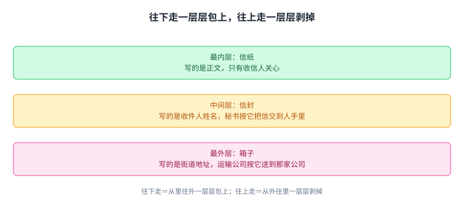
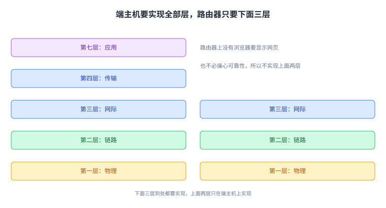

+++
title = "首部：网络只看信封，不看信"
lecture = 3
slug = "headers"
status = "draft"
source_kind = "textbook"
source_url = "https://textbook.cs168.io/intro/headers.html"
source_title = "Headers"
output_mode = "explanation"
+++

> 来源课程：UC Berkeley CS168 Computer Networks（教材 CS 168 Textbook）；
> 对应内容：Introduction 之 Headers（<https://textbook.cs168.io/intro/headers.html>）；
> 上游许可：教材站在站根页声明 CC BY-SA 4.0（第二人复核见 `docs/audit/license-cs168-second-review.md`）；
> 本文由 CourseLingo 原创撰写：**按该节的推进顺序**重新讲解，关键句给出英文原文与中译，**不逐句全译**，配图全部自绘、不转载原图；
> 本文非官方材料，CourseLingo 与 UC Berkeley 及课程教学团队无隶属关系；如与原文有出入，以原文为准。

## 一、起点：一串 0 和 1 到了交换机手里，它不知道该干什么

先把上一讲留下的场景接上。这一讲要解决的是一个很具体的缺口：网络凭什么知道该拿这些比特怎么办。第三层送的是[[term:packet]]（packet），应用要发一个文件，我们就把它切成一个个分组发出去。问题是：[[term:switch]]（switch）收到这一串 0 和 1 之后，它能拿它做什么。

> "When a switch receives this sequence of 1s and 0s, it has no idea what to do with these bits."
> （交换机收到这一串 1 和 0 时，完全不知道拿这些比特怎么办。）

教材的类比很直接：你把一封没装信封的信直接塞给邮局，邮局也不知道该怎么办。要让邮局能办事，得把信装进信封，再在信封上写上收件人地址。

网络里的做法一模一样：发分组的时候，要额外挂上一段元数据，告诉承载数据的[[term:infrastructure]]（infrastructure）该怎么处理这个分组。这段元数据叫[[term:header]]（header，首部），剩下那部分才是一封信的内容，叫载荷（payload）。教材把两边的分工说得很清楚。

> "In the analogy, the post office shouldn't be reading the contents of my letter. It should only read what's on the envelope to decide how to send my letter."
> （类比里，邮局不该去读我信里的内容，它只该看信封上写了什么，据此决定怎么送。）

反过来，收信人关心的是信里的内容，不是信封。对应到网络：端主机上的应用关心载荷，不关心首部。不过有一处不能想当然：端主机**自己必须懂首部**，因为首部是它加上去的。

网络只读首部、不读载荷：这条分工是后面许多取舍的起点。

## 二、首部是端主机与网络之间的接口

换个角度看首部，它其实是两端之间的一份接口约定。教材用的词是 API。

> "You can also think of headers as the API between the end hosts sending/receiving data, and the network infrastructure carrying the data."
> （也可以把首部看成一份接口：一边是收发数据的端主机，另一边是搬运数据的网络设施。）

写程序时我们总要定下别人怎么调用自己的代码，能调哪些函数、要传什么参数。首部就是同一件事：它规定了用户怎么使用网络提供的功能、怎么把参数递给网络。

接口一旦定下来，就必须大家一起遵守。教材举了一个具体的后果：如果微软把 Windows 的代码改成发另一种结构的首部，别人就都看不懂它发的包了。这也意味着设计首部要格外小心。

> "Once we design a header and deploy it on the Internet, it's very hard to change the design (we'd have to get everybody to agree to change it)."
> （首部一旦设计完成并部署到互联网上，之后想改设计就非常困难，因为必须让所有人都同意改。）

注意这句话的方向：是**很难改**，不是「改起来麻烦一点」。正因为它这么难改，标准组织会花好几年去设计和标准化一套首部。

接口一旦定下要所有人一致，就很难再改，这正是标准组织要花好几年设计它的原因。

## 三、首部里应该放什么

先放最要紧的那一项：目的地址，它告诉网络这个分组该往哪里送。

> "The header should definitely contain the destination address, which tells us where to send the packet."
> （首部里必须要有目的地址，它告诉我们要把这个分组送到哪里。）

剩下的几项属于「不是必需，但带着很有用」。教材按这个口径列了三样。

源地址严格说不是送达所必需的。

> "Technically, the source address is not required to deliver the packet, but in practice, we almost always include the source address in the header. This allows the recipient to send replies back to the sender."
> （严格来说，源地址并不是送达分组所必需的；但实践中我们几乎总是把它放进首部，这样收件人才能回信给发件人。）

然后是校验和，用来确认分组在路上有没有被改坏。最后是分组的长度：分组大小并不固定，用户可能只需要发几个字节，所以长度也得写进去，接收方才知道该读多少。

四项里只有目的地址是必需的，其余三项属于「不必须但很有用」。

## 四、一层一层包上去：多层首部

一个分组要跨好几层，首部也就不止一层，而是好几层叠在一起。教材用一个公司之间的通信把这件事讲了一遍。

A 公司的老板要写信给 B 公司的老板。他先把信折好交给秘书；秘书把信装进信封，写上 B 公司老板的全名；秘书再把信交给收发室；收发室的人把它装进一个箱子，写上 B 公司的街道地址，然后交给运输公司。到这一步，信本身已经被好几层信息包住了，信封一层、箱子一层。

信送到 B 公司之后，顺序反过来：收发室拆掉箱子，把信封交给秘书；秘书看到信封上写的是自己老板的名字，拆掉信封，把信递上去。

这个来回就是分层的核心动作，教材用一句话总结了方向。

> "Notice that as we moved to lower abstraction layers, we wrapped more headers around the data. Then, as we moved to higher abstraction layers, we peeled layers off the data."
> （注意：往更低的抽象层走时，我们给数据包上更多首部；往更高的抽象层走时，我们把这些层一层层剥掉。）

**往下走是包上，往上走是剥掉**，这两个方向不能反过来。还有一件事值得单独记住：每一层只需要看懂自己那一层的首部，它实际上是在跟**同一层的对端**说话。秘书在信封上写名字，那是写给对方的秘书看的，不是给邮差看的，也不是给老板看的。

教材把它说成协议：同一层的对端之间，靠这一层的[[term:protocol]]（protocol）沟通，而这个协议只对这一层的实体有意义。有些层还提供了多种协议可选，比如第二层可以走无线也可以走有线；这种时候，通信的双方必须选同一个。

> "A wired sender can't talk to a wireless recipient."
> （用有线协议的发送方，没法跟用无线协议的接收方对话。）

发送时从里往外一层层包上，接收时从外往里一层层剥掉，两个方向不能反过来。

## 五、地址与名字：不同层用不同的地址

前面说首部里要有收件人的地址，那地址究竟是什么。教材给的定义很朴素：网络地址是一个值，用来说明一台主机在网络里的位置。

有意思的是，每一层的地址写法都不一样，而且各自适合自己那一层。教材用的类比是校内的信和寄到外地的信：在 Soda Hall 楼里送信，写「Soda Hall 413 室」就够了，楼里的人一看就知道送哪；可要是寄到纽约，就得写完整的街道地址。

同一台主机在互联网上也有好几种叫法，各自服务不同的层：

- 给人看的名字，比如 `www.google.com`；
- 给机器看的[[term:ip-address]]（IP address），比如 `74.124.56.2`，这个数字多少编码了服务器所在的位置。

> "...where this number somehow encodes something about the server's location (and could change if the server moves)."
> （这个数字多少编码了服务器位置的信息，而且服务器一旦搬家，它就可能变。）

- 还有硬件地址，也就是 MAC 地址，它从不改变。

同一台主机在不同层有不同的名字，而每个名字的稳定性、含义都不一样。后面讲寻址那一章会把 IP 地址拆开细讲。

域名、IP 地址、硬件地址各服务一层，稳定性与用途都不一样。

## 六、主机与路由器各自实现哪几层

[[term:internet]]（Internet）上不只有发送方和接收方，中间还有一台台[[term:router]]（router）在转发。这些机器上各自要实现哪些层。

[[term:end-host]]（end host）要实现**所有**的层。你的电脑要有第七层才能跑浏览器，要有第一层才能把比特送上线路，中间每一层也都要有，这样应用层的数据才能一路传到底下的物理层。

路由器不一样。它需要第一层来从线路上收比特，需要第二层来把分组送上线，需要第三层来在全局网络里转发分组。但它**不需要**第四层和第七层：路由器上没有浏览器要显示网页，也不必操心可靠性，因为服务模型本来就是尽力而为。教材的总结是一句包含关系。

> "In summary: The lower 3 layers are implemented everywhere, but the top 2 layers are only implemented at the end hosts."
> （总结一下：下面三层到处都要实现，上面两层只在端主机上实现。）

注意这里是「到处」与「只在」的对比：路由器属于「到处」那一边，它包含的是下面三层，不包含上面两层。

下面三层到处都要实现、上面两层只在端主机，所以路由器只解析到第三层。

## 七、路由器每一跳都要换一次外壳

回到邮局的类比。箱子不会自己飞到 B 公司，它可能经过好几个邮局。每到一处，邮差打开箱子、分拣邮件，看到信封上写的是 B 公司；然后他换一个新箱子，把这个信封装进去，发往下一站。整个过程里，没有一个邮局会去拆开信封看信里写了什么，因为他们不需要读。

网络里的路由器做的事完全对应。主机 A 把消息一层层往下走，依次加上第七、四、三、二、一层的首部，得到一个层层包住的分组；第一层协议把这些比特沿着线路送出去，到达路径上的第一台路由器。

路由器要把这个分组转发给下一跳，而这件事属于第三层的职责，所以它得把分组解析到第三层。具体动作是：拆掉第一层和第二层的首部，露出下面的第三层首部；读第三层首部，决定下一跳往哪送。然后再往下走一遍，为下一跳重新包上第二层和第一层首部，把比特送出去。

> "This pattern repeats at every router: Layers 1 and 2 are unwrapped to reveal the Layer 3 header, and then new Layer 2 and Layer 1 headers are wrapped before sending the packet to the next hop."
> （这个模式在每一台路由器上重复：先拆掉第一、二层的首部露出第三层首部，再包上新的第二、一层首部，然后把分组发往下一跳。）

有两处方向容易记混，值得单独标出来。第一，路由器是**先拆再包**：拆的是上一跳带来的第一、二层首部，包的是给下一跳用的新的第一、二层首部。第二，**没有一台路由器会看到第三层以上的东西**，因为上面的层只有端主机才解析。

分组最后到达主机 B，它从第一层开始一层层剥掉：第一、二、三、四、七层，消息到手。

这套做法带来一个直接好处：每一跳可以使用不同的第一、二层协议。第一跳走有线，那么主机 A 和第一台路由器用的就是有线协议的头部；后面某一跳走无线，那一跳两端的路由器就用无线协议的头部。这也解释了「同层对端」到底是谁：在第四、七层，对端是另一台主机；在第一、二层，对端是路径上相邻的那台路由器。总结起来就是一句话：路由器解析第一到第三层，端主机解析第一到第七层。

每一跳换掉的是第一、二层的外壳，第三层首部一路被带到目的地。

## 八、代价与边界

首部这套做法解决了很多问题，也带来了几笔账。

第一笔是开销。每一层都要挂自己的首部，而且每经过一跳，第一、二层的首部还要换掉重写。链路上真正跑的字节，比应用要送的数据多，多出来的部分全是这些元数据。

第二笔是格式改不动。首部是一份所有人都要遵守的接口，所以它天然走向固化：教材明确说了部署之后极难更改，标准组织为此要花好几年。这意味着一套设计得不理想的字段，可能要跟着互联网走很多年。

第三笔藏在分工里。网络设施只读首部、不读载荷，这是设计上的克制，好处是应用的内容对网络是透明的；代价是想做跨层优化会更难，因为中间设备按约定不该去看上面几层的事。

还有一点是这套设计的必然结果：首部是公开约定的，任何设备都要能读懂它，中间设备也就能看到源地址、目的地址这些信息。「谁能看到什么」这件事在后面的章节里会反复出现，比如网络地址转换与加密这两条路线，走的就是相反的方向。

这几笔账里最直接的两笔，一笔来自体积，一笔来自时间。体积那笔每传一次就要付一次；时间那笔决定了这套格式会跟着互联网走很多年。

## 九、脉络回顾

这一讲把首部讲成了一件事：给数据装上一个网络读得懂的封皮。首部是端主机与网络之间的接口，它必须所有人一致，所以很难改；它至少要有目的地址，通常还带源地址、校验和与长度。首部是一层层套上去的，往下走时一层层包上，往上走时一层层剥掉；每一层只跟同层的对端说话。

这套分层也划出了机器之间的边界：下面三层到处都有，上面两层只在端主机上，所以路由器只看得到第三层，它每一跳都换掉第一、二层的封皮。下一讲会接着讲架构，把「为什么这么分层」这件事本身拿出来算账。

## 读完应该能回答

1. 为什么交换机不能直接处理裸的比特流，首部替它补上了哪一类信息。
2. 为什么首部一旦部署就很难更改，这件事对设计者意味着什么。
3. 为什么路由器只需要实现下面三层，而端主机必须实现全部层。

## 溯源

- 对应：UC Berkeley CS168 Computer Networks，教材 Introduction 之 Headers（<https://textbook.cs168.io/intro/headers.html>）
- 教材：CS 168 Textbook（UC Berkeley CS168 课程教材），原文链接同上
- 授权依据：教材站根页声明 CC BY-SA 4.0；本文为本仓库原创中文讲解，按该节顺序重讲，关键句给出英文原文与中译，**未逐句全译**，配图自绘
- 结构说明：本讲的章节顺序**跟随教材该节的推进顺序**（为什么需要首部 → 首部是标准 → 首部放什么 → 多层首部 → 地址与名字 → 主机与路由器各实现哪几层 → 路由器换壳 → 逐跳细节）；
  「代价与边界」一段的**归并与框架**是我们的归纳，教材该节没有单列这一节；但其中**第二笔「格式改不动」的事实依据直接来自源文**（部署之后极难更改、标准组织会花好几年）
- 我们的补白（源文没有明说，记在这里以免被当成原文）：分组长度字段那一句里「接收方才知道该读多少」；以及「后面讲寻址那一章会把 IP 地址拆开细讲」这个指针（教材目录确有 Addressing 一节，但该节内容不在本讲的核对范围内）
- 补充与层号：`headers-5` 里「域名／IP 地址／MAC 地址」各对应哪一层是我们的补充（源文只说不同层有不同寻址方式，未逐一点名）；层号沿用教材的第七、四、三、二、一层，**第五、六层已废弃**（源文有专段说明）
- 相关：第 2 讲讲分层与各层的职责，本讲讲首部与逐跳封装；第 4 讲讲网络架构
