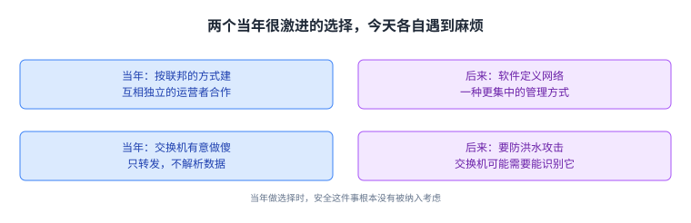
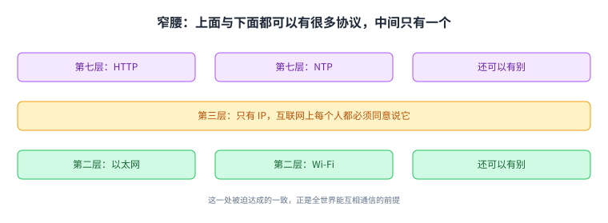
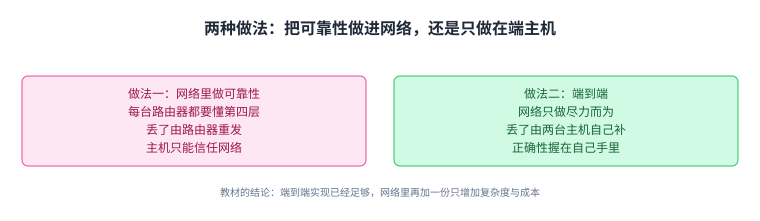
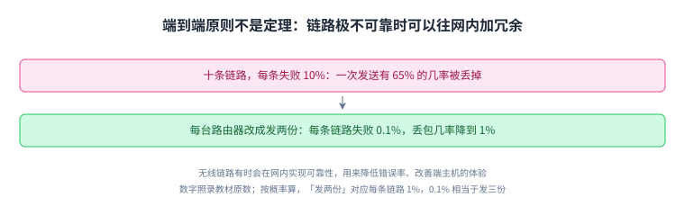

+++
title = "网络架构：为什么是窄腰、一层一层、端到端"
lecture = 4
slug = "network-architecture"
status = "draft"
source_kind = "textbook"
source_url = "https://textbook.cs168.io/intro/architecture.html"
source_title = "Network Architecture"
output_mode = "explanation"
+++

> 来源课程：UC Berkeley CS168 Computer Networks（教材 CS 168 Textbook）；
> 对应内容：Introduction 之 Network Architecture（<https://textbook.cs168.io/intro/architecture.html>）；
> 上游许可：教材站在站根页声明 CC BY-SA 4.0（第二人复核见 `docs/audit/license-cs168-second-review.md`）；
> 本文由 CourseLingo 原创撰写：**按该节的推进顺序**重新讲解，关键句给出英文原文与中译，**不逐句全译**，配图全部自绘、不转载原图；
> 本文非官方材料，CourseLingo 与 UC Berkeley 及课程教学团队无隶属关系；如与原文有出入，以原文为准。

## 一、换个方向看：架构是一组选择，不是唯一解

前三讲都是从下往上搭：先有物理层，再有链路层，然后加上首部、一层层封装。这一讲换个方向，从上往下看，问的是那几个贯穿全局的选择：[[term:internet]]（Internet）为什么长成这个样子。这一讲要解决的就是这个问题。

教材先给了一个态度上的提醒：这些设计只是众多可能中的一种。

> "These designs are just one of many possible designs, and many design choices were made years ago, before the Internet grew to its current scale. Other designs exist, and debates still exist about what the best design is."
> （这些设计只是众多可能设计中的一种；很多选择是很多年前做的，那时互联网还没有长到今天的规模。别的设计也存在，关于什么是最好的设计，争论至今还在。）

按这个态度看，[[term:architecture]]（architecture，架构）不是一份标准答案，而是一组取舍。教材说，这些设计取向既决定了互联网为什么这样运转，也决定了能在它上面造出什么样的应用；而在当年，它们与既有系统的做法相去甚远。

前面几讲从下往上拼零件，这一讲换方向，从上往下问那几个贯穿全局的选择。

## 二、两个当年很激进的选择，今天各自遇到麻烦

教材举了两个例子，说明「当年的选择」和「今天的现实」之间的落差。这两个例子放在一起看，能看出一件事：架构的选择会带着它的时代一起变旧。

第一个例子关于谁在管网络。互联网当初的设计是联邦式的，也就是一批互相独立的运营者合作把网络连起来。

> "For example, the Internet was built to be federated (independent operators cooperating), but in recent years, software-defined networking (SDN) emerged as a more centralized approach to managing a network."
> （互联网当初是按联邦的方式建的，也就是互相独立的运营者合作；但近几年出现了软件定义网络，那是一种更集中的网络管理方式。）

联邦与合作是这一讲之前的讲法，而集中管理是后来才出现的另一条路。两者并存，说明「谁来管」这件事并没有一个终局答案。

第二个例子关于[[term:switch]]（switch）该多聪明。互联网当初有意把交换机做傻：只负责转发，不去解析数据。

> "In the original Internet, switches were intentionally designed to be dumb and forward data without parsing it."
> （在早期的互联网里，交换机被有意设计得很笨：只转发数据，不解析它。）

麻烦在于，这个选择是在没有考虑攻击者的年代做的。今天有人可以用大量无用的数据把交换机淹没，而交换机可能需要有能力识别这种事。

> "Early Internet designers who came up with the dumb infrastructure paradigm did not consider this security implication."
> （提出「基础设施要笨」这个主张的早期设计者，并没有考虑这个安全上的含义。）

注意这里的方向：**不是设计者考虑过之后认为不重要，而是当年根本没有把这件事纳入考虑**。这正是架构选择的常态：它在自己的时代里是合理的，而它没算进去的东西，很多年后会找上门来。

两个选择在自己的时代里都合理，而它们没算进去的东西，很多年后会找上门来。

## 三、窄腰：为什么第三层只留一个协议

第二讲说过分层，那里讲的是每一层干什么。这一节要讲的是各层的**可选数量**，而答案在每层并不一样。

先看两头。同一层完全可以有多种[[term:protocol]]（protocol）并存。第七层可以是用 HTTP 提供网页，也可以是用 NTP 同步系统时钟，两者都跑在同一套互联网[[term:infrastructure]]（infrastructure）上；第二层可以走有线以太网，也可以走无线 Wi-Fi。选定之后，你可以只挑其中一条栈，比如 HTTP 走 TCP 再走 IP，并且不必理会别的第七层或第四层协议；而用你这个应用的人，都跟你用同一条栈。

再看中间。教材让你注意一件事：第三层只有一个协议。

> "If you look at this diagram, you'll notice there's only one protocol at Layer 3. This is the 'narrow waist' that enables Internet connectivity."
> （如果你看这张图，会注意到第三层只有一个协议。这就是让互联网能连起来的「窄腰」。）

原因是连通性本身的要求：要让[[term:packet]]（packet）能跨过整张互联网，**所有人都必须同意说 IP**。

> "Ultimately, everybody on the Internet must agree to speak IP so that packets can be sent across the Internet."
> （归根到底，互联网上的每个人都必须同意说 IP，分组才可能跨过互联网。）

两头宽、中间窄，形状像一个沙漏。[[term:narrow-waist]]（narrow waist，窄腰）这个名字就是从这里来的：它是一处被迫达成的一致，也正是这一处一致，换来了全世界能互相通信。

上面的应用与下面的链路都可以有很多种，唯独第三层只有一个协议。

## 四、解复用：分组到了主机，该交给谁

窄腰保证了分组能跨过互联网，可它到了主机之后还有一段路要走：主机得判断这个分组属于哪个上层协议、哪个应用。这件事有一个专门的名字，叫解复用（demultiplexing）。

它的机制很朴素：每一层的[[term:header]]（header）里都留了一个字段，说明载荷接下来该由谁处理。

> "Each layer includes a field in its header that identifies what protocol should process the payload next."
> （每一层的首部里都有一个字段，用来说明载荷下一步该由哪个协议处理。）

具体到协议：IP 首部会说明它装的载荷是 TCP 还是 UDP；TCP 或 UDP 的首部里有一个目的端口号，用来说明这份数据该交给哪个应用。

分组到达主机之后，网络栈会**反复**做这件事，一层交给上一层。

> "...the Layer 2 header determines which Layer 3 protocol should handle the packet, the Layer 3 header determines which Layer 4 protocol should handle it, and the Layer 4 destination port helps the OS determine which application socket should receive the data."
> （第二层首部决定哪个第三层协议来处理这个分组；第三层首部决定哪个第四层协议来处理；第四层的端口号帮操作系统决定该由哪个应用套接字接收数据。）

注意这段话的方向：每一层都是**向上**交出处理权，从第二层一路交到应用，而不是反过来。这里也顺便回答了第三讲留下的一个疑问：[[term:router]]（router）只解析到第三层，所以它做的解复用也只到第三层为止，不会再往上交。

每一步都是向上交出处理权：第二层交给第三层，第三层交给第四层，端口号再交给应用。

## 五、一个词两种意思：端口与套接字

解复用这一节有一个用词上的坑，教材专门提醒了一句：网络里有两个不同的东西都叫端口。

> "A physical port is the actual physical place where you plug a link into a switch. A logical port is a number in the Layer 4 header to disambiguate which application a packet belongs to."
> （物理端口是交换机上真正插[[term:link]]（link）的地方；逻辑端口是第四层首部里的一个数字，用来区分这个分组属于哪个应用。）

前者是硬件位置，后者是数据里的编号。它们共用一个名字，但一个是「插在哪」，一个是「交给谁」。

还有一个词也在这条链上：套接字（socket）。它是操作系统提供的一种机制，把应用接到系统里的网络栈上。应用打开一个套接字时，这个套接字就与一个逻辑端口号绑定；操作系统收到分组后，就用端口号把数据送到对应的套接字上。

同名的两个词分别指「插在哪」和「交给谁」，读到端口时要先分清是哪一个。

## 六、端到端原则：可靠性到底该做在哪一层

前三节回答了「互联网长什么样」，这一节回答「为什么长成这样」。教材的问题很具体：为什么只有主机懂第四层和第七层，路由器不用懂。

端到端原则给出的是一套判断依据。它由 MIT 的 David D. Clark 等人提出，他同时是互联网架构委员会的成员；教材点名了两篇影响很大的文章：1981 年的《End-to-End Arguments in System Design》与 1988 年的《The Design Philosophy of the DARPA Internet Protocols》。

这条原则管的问题很宽，教材把焦点收在一个具体问题上：可靠性到底该做在网络里，还是只做在端主机上。

先看第一种做法，把可靠性做进网络。这时每一台路由器都必须额外懂第四层，因为可靠地送到下一跳变成了它的责任。

> "With this new picture, an intermediate router must reliably send a packet to its next hop. It must guarantee that the next hop received all the packets, and if not, the router must re-send any lost packets."
> （在这幅新图景里，中间的路由器必须可靠地把分组送到下一跳，必须保证下一跳收到了所有分组；如果没有，它得重发丢掉的那些。）

这种情况下，主机不再自己检查，而是把这件事托付给网络。代价立刻出现：如果某台路由器有 bug 把分组丢了，主机其实无能为力。

> "In this approach, the hosts have to trust the network. If one of the routers is buggy, and drops a packet, there's nothing the hosts can really do about it."
> （这种做法里，主机必须信任网络。要是有一台路由器有 bug 丢了分组，主机其实拿它没办法。）

第二种做法就是端到端：网络里不做可靠性，把这件事交给两端的主机去做。路由器可以丢分组，检查有没有收齐由主机负责。教材给的理由不是性能，而是控制权。

> "The hosts could still be buggy and drop packets, but this time, the hosts have the power to fix the bug themselves."
> （主机自己也可能有 bug、也会丢分组；但这一回，主机有能力自己把这个 bug 修掉。）

同一个道理被教材推广到写代码这件事上：让自己掌握把功能做正确的控制权，好过去依赖别人，因为别人的错你修不了。它还补了一句更硬的话：如果网络本身有 bug，靠网络保证可靠性其实保证不了，主机最后还是要自己端到端检查一遍，那么网络里那份可靠性就白做了。

历史也走了这条路：**早期的互联网每条链路都做可靠性，而现代互联网在网络里只做[[term:best-effort]]（best-effort，尽力而为），把可靠性交给端主机**，这正是端到端原则的体现。教材的总结是两步推理：有些应用要求必须在端到端实现才能保证正确；而端到端实现本身已经足够，所以网络里再加一份功能只会带来不必要的复杂度与成本，却帮不上达成要求。

一个把正确性托付给网络，一个握在自己手里，教材选了后者。

## 七、端到端为什么能赢

把两种做法放在一起，胜负的关键可以压成一句：出了错，谁能修。

选择网络做可靠性，相当于把正确性托付给一条你控制不了的链路，链路上的每一台路由器都是别人的机器。选择端到端，正确性的责任落在你自己的代码里：你可能有 bug，但你能改。教材还指出这种托付会自我否定：既然主机最终出于正确性考虑仍然要自己做一遍检查，网络里那份努力就没有真正省掉什么。

顺带一提，这条推理也解释了第三讲里那个看起来有点奇怪的安排：路由器只解析到第三层。它不是在偷懒，而是端到端原则的直接后果：上面两层的正确性由两端负责，中间设备按约定不去插手。

出错时能不能自己修，是这场比较的分水岭。

## 八、它不是定理：什么时候该在网络里加东西

教材在这里踩了一脚刹车，这一句必须原样记住：端到端原则不是一条永远成立的定理。

> "Note that the end-to-end principle is not a proof or a theorem that's always true. It's a guiding principle and a philosophical argument, and different designers might make different arguments for or against the principle."
> （注意，端到端原则并不是一个证明，也不是一条永远成立的定理。它是一条指导原则、一种哲学论证，不同的设计者可能给出支持或反对它的不同论证。）

教材给了一个具体的反例：链路非常不可靠的时候，网络里加一点可靠性反而有用。假设 A 与 B 之间有 10 条链路，每条失败的几率是 10%，那么发一次分组，它有 65% 的几率被丢掉。如果每台路由器都改成发两份，每条链路的失败几率降到 0.1%，分组的丢失几率就降到 1%。

> "Wireless links will sometimes implement reliability to reduce error rates and improve performance for the end hosts."
> （无线链路有时会在网内实现可靠性，用来降低错误率、改善端主机的体验。）

注意这个例子的方向：加的是**网内**的冗余，换来的是丢包率**下降**。它并不推翻端到端原则，而是说明这条原则要配合场景使用。教材还把这条原则推广到了别的领域，比如安全：端到端原则会说，通信的两台主机应当在主机上加密消息，而不是在网络中间的某一点加密。最后是 Clark 本人的原话。

> "The function in question can completely and correctly be implemented only with the knowledge and help of the application at the end points. Therefore, providing that function as a feature of the communication system itself is not possible. Sometimes an incomplete version of the function provided by the communication system may be useful as a performance enhancement."
> （某个功能只有在端点的应用知情并配合时，才可能被完整且正确地实现；因此，把它做成通信系统自身的一项功能是不可能的。有时，通信系统提供这个功能的一个不完整版本，可以作为性能上的辅助。）

链路极不可靠时，网内加一点冗余反而有用，这正是「指导原则」与「定理」的区别。

## 九、代价与边界

这一讲给出的三个选择，每一个都带着代价，值得并排记住。

第一笔账关于谁来承担复杂度。端到端把可靠性推给了两端，好处是控制权在自己手里，代价是每个写应用的人都要自己把这件事做对，或者依赖一个库替自己做对。网络这边则轻装上阵，只做尽力而为。

第二笔账关于窄腰的两面性。所有人在第三层统一说 IP，才换来了互联互通；但同一个事实也意味着 IP 极难被替换，任何改进都得在它之上叠加。窄腰既是互联网最大的力量，也是一个被锁死的单点。

第三笔账关于「傻交换机」这个选择。它让中间设备保持简单便宜，可它是在不考虑攻击者的年代做出的，于是当年没算进去的安全问题，今天要用别的办法补回来：要么让交换机多一些识别能力，要么在两端加密、让中间设备根本读不到内容。

这三笔账合起来就是这一讲的结论：架构不是选一个正确答案，而是**选定一组取舍，并接受它们各自的后果**。

三笔账的落点各不相同：一笔落在写应用的人身上，一笔落在协议本身，一笔落在安全上。它们都不是缺陷，而是当初选定取舍时就已经接受的后果。

## 十、脉络回顾

这一讲从上往下看了一遍互联网。它的架构是一组选择：分层、窄腰、端到端。窄腰把第三层收成只有一个协议，换来全世界能互通；解复用让分组到达主机后能一层层交给正确的应用，也顺带解释了物理端口与逻辑端口这两个同名不同物的词；端到端原则把可靠性的责任放在两端，理由是控制权和正确性，而它本身只是一条指导原则，链路极不可靠时反而应该在网内加一点冗余。

这一讲算是把总论部分收住了。下一讲讲链路与共享，题目会落到更具体的地方：一条线路上多台机器同时想发数据时，该怎么办。

## 读完应该能回答

1. 窄腰指的是哪一层只有一个协议，为什么这一处的一致是互通的前提。
2. 解复用在一层里靠什么字段推进，为什么路由器只解复用到第三层。
3. 端到端原则把可靠性放在哪一端、理由是什么，以及它为什么不是定理。

## 溯源

- 对应：UC Berkeley CS168 Computer Networks，教材 Introduction 之 Network Architecture（<https://textbook.cs168.io/intro/architecture.html>）
- 教材：CS 168 Textbook（UC Berkeley CS168 课程教材），原文链接同上
- 授权依据：教材站在站根页声明 CC BY-SA 4.0；本文为本仓库原创中文讲解，按该节顺序重讲，关键句给出英文原文与中译，**未逐句全译**，配图自绘
- 结构说明：本讲的章节顺序**跟随教材该节的推进顺序**（Design Paradigms 设计取向 → 窄腰 → 解复用 → 端到端原则）；
  「两个当年很激进的选择」一节把教材 Design Paradigms 里举的两个例子并成一段，「端到端为什么能赢」与「代价与边界」两段是我们的归纳
- 相关：第 1 讲与第 4 讲都取材于教材同一部分，第 1 讲是总览、点到架构的取舍，本讲把这几个选择本身讲透
- 术语说明：「解复用（demultiplexing）」「端到端原则（end-to-end principle）」「套接字（socket）」目前不在本仓 `glossary.toml` 里，本页按中英对照写出，未打术语标记
