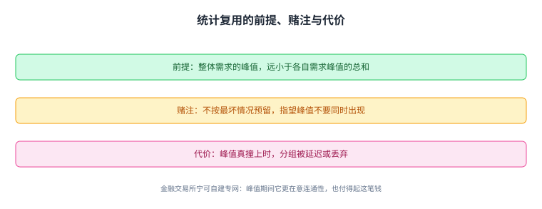
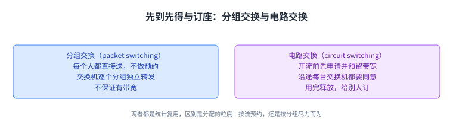
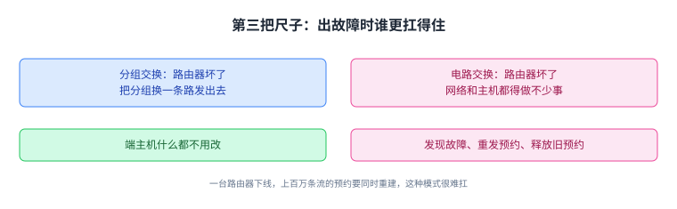
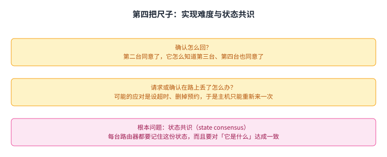

+++
title = "容量怎么分：统计复用、分组交换与电路交换"
lecture = 5
slug = "designing-resource-sharing"
status = "draft"
source_kind = "textbook"
source_url = "https://textbook.cs168.io/intro/sharing-resources.html"
source_title = "Designing Resource Sharing"
output_mode = "explanation"
+++

> 来源课程：UC Berkeley CS168 Computer Networks（教材 CS 168 Textbook）；
> 对应内容：Introduction 之 Designing Resource Sharing（<https://textbook.cs168.io/intro/sharing-resources.html>）；
> 上游许可：教材站在站根页声明 CC BY-SA 4.0（第二人复核见 `docs/audit/license-cs168-second-review.md`）；
> 本文由 CourseLingo 原创撰写：**按该节的推进顺序**重新讲解，关键句给出英文原文与中译，**不逐句全译**，配图全部自绘、不转载原图；
> 本文非官方材料，CourseLingo 与 UC Berkeley 及课程教学团队无隶属关系；如与原文有出入，以原文为准。

## 一、容量有限，可同时在线的人很多

[[term:link]]和[[term:switch]]的容量都是有限的。这一讲要解决的就是由此而来的那个设计问题：这些资源该怎么在许多使用者之间分配。

先把要分配的东西说清楚。一条流（flow）是两台[[term:end-host]]之间交换的一串[[term:packet]]，比如你和朋友的一次视频通话。[[term:internet]]（Internet）要同时支撑很多条流，而容量是有限的。

教材给出的做法是统计复用（statistical multiplexing）：按需求动态分配资源，而不是给每个人切一块固定的份额。

> "We often say that the network resources are statistically multiplexed, which means that we'll dynamically allocate resources to users based on their demand, instead of partitioning a fixed share of resources to users."
> （我们常说网络资源是统计复用的，意思是按用户的需求动态分配资源，而不是把资源切成固定份额分给用户。）

教材用的类比是你自己的电脑：它不会预先切一半 CPU 给 Firefox、一半给 Zoom，然后各自只准用自己的那一半，而是按各程序当下的需要动态分配。统计复用在今天的计算机领域几乎到处都是，比如云计算里，不同公司动态共享同一个[[term:data-center]]的资源。

一个是先切好份额，一个是按需动态给；网络与操作系统用的是后者。

## 二、直觉做法：把每个人的峰值加起来

统计复用为什么好用，理由很朴素：需求随时间变化。你不会一天 24 小时都稳定地用掉 10 Mbps，醒着的时候需求多一些，睡着的时候少一些。

这里有一个前提，教材用一句话写得很紧凑，读的时候要格外小心它的方向。

> "The premise that makes statistical multiplexing work is: In practice, the peak of aggregate demand is much less than the aggregate of peak demands."
> （统计复用能成立的前提是：实际中，**整体需求的峰值**远小于**各自需求峰值的总和**。）

这句话左右两边都带「峰值」，很容易看反，拆开算一遍就清楚了。假设有两个用户 A 和 B，把各自的需求画成随时间变化的曲线。

- 笨办法：先求各自峰值，再加起来。算出 A 的峰值是 X、B 的峰值是 Y，就分配 X + Y 的容量。这样当然能满足两个人，可它浪费：A 的峰值和 B 的峰值并不是同时出现的，按峰值之和分配，就等于在最坏情况下都留足了余量。
- 更好的办法：先把两条曲线**逐点相加**得到整体需求曲线，例如上午 10 点的整体需求就是 A 的 10 点需求加 B 的 10 点需求，然后再取这条新曲线的峰值。

按整体峰值分配容量之后，就不能再给每个用户静态划一块了；但只要随时间动态调整给每个人的份额，用更少的容量也能满足他们的需求。教材还给了一句更进一步的结论。

> "For many distributions, we can show that the peak of the aggregate is actually closer to the sum of the average demands, which is much less than the sum of the peak demands."
> （对很多分布可以证明：整体峰值其实更接近平均需求之和，而平均需求之和远小于峰值之和。）

峰值相加得到的是最坏情况，逐点相加再取峰得到的才是真正需要的容量。

## 三、这个选择的前提与代价

统计复用省容量，但它不是免费的，它建立在两个明确的取舍上。

第一个取舍是**不为最坏情况预留**。教材说得很直白：实际部署里，我们不会按「所有峰值同时出现」这种绝对最坏情况去准备容量。

> "In practice, in the network, we don't provision for the absolute worst case, when everything peaks at the same time. Instead, we share resources dynamically and hope that peaks don't occur at the same time."
> （实际中，网络不会按「所有东西同时达到峰值」这种绝对最坏情况来配置容量，而是动态共享资源，并且指望峰值不要同时出现。）

第二个取舍是接受后果。峰值真的撞在一起，容量就不够用，此时分组会被延迟或丢掉，这正好接上前面讲过的链路排队。教材把账算得很清楚：我们选择统计复用、把资源用得更有效率，同时接受偶发的峰值重合。

不过这个取舍不是所有人都愿意接受。金融交易所有时会选择自建专用网络来扛峰值需求。

> "For example, financial exchanges sometimes decide to build their own dedicated networks to support peak demand, because they care more about ensuring network connectivity during peak periods, and they can afford the extra cost."
> （例如金融交易所有时会决定自建专用网络来支撑峰值需求，因为它们在峰值期间更在意网络的连通性，而且付得起这笔额外成本。）

同一道题，两种答案都对，取决于你更怕浪费还是更怕峰值时掉线。

省容量的前提是峰值不同时出现，代价就是它们偶尔真的会同时出现。

## 四、怎么真的动态分配：两种做法

容量该按多少来建，上面已经回答了。接下来的问题是：动态分配到底怎么实现。

教材换了一个日常的类比：一家生意很好的餐厅，桌子有限，客人很多。有两种分桌子的办法，一种是让客人预订，另一种是先到先得。网络里的两种做法正好对应这两种。

先说先到先得。它的正式名字叫 [[term:best-effort]]：每个人把数据直接送进网络，不做任何预约，然后听天由命，网络不保证有足够的[[term:bandwidth]]满足你的需求。它的代表设计是分组交换（packet switching）。

> "The canonical design for best-effort is called packet switching. The switch looks at each packet independently and forwards the packet closer to its destination. The switches don't think about flows or reservations."
> （尽力而为的代表设计叫分组交换：交换机独立地看每一个分组，把它转发到离目的地更近的地方，交换机不考虑流，也不考虑预约。）

这里还有一层独立性：分组之间互不相关，交换机之间也互不相关。一个分组跳过多台交换机时，每一台都是独立判断的，它们之间不协调。

再说预约。在一条流开始时，使用者明确申请并预留自己需要的带宽；数据发完之后，资源可以被释放出来给别人预约。它的代表设计是电路交换（circuit switching）。

最后教材补了一句容易被忽略的话：这两种做法其实**都在做统计复用**，差别只在**分配资源的粒度**：电路交换是按流预约，分组交换是按分组尽力而为。即便是电路交换，也是根据预约动态分配，而**不是**把所有可能出现的流都预先占住。

先到先得与订座，对应按分组尽力而为与按流预约。

## 五、电路交换的一生：请求、确认、传数据、拆除

分组交换的做法前面几讲已经讲透了，电路交换则需要看一遍它完整的流程。教材把它拆成四步。

第一步是选路。流开始时，两端主机要先确定一条穿过网络的路径，也就是一串交换机和链路的序列。这里教材让你先放一放细节：找路径要靠某种[[term:routing]]算法，而路由算法还没讲，所以这一步暂时当作魔法。

第二步是预约。源主机沿着这条路径，向目的地发一条专门的预约请求消息；一路上每台交换机都会知道这件事。如果每台交换机都同意，预约就成立了，一条由交换机组成的电路就在源和目的地之间建立起来。

第三步才轮到数据。等到每台交换机都确认之后，数据才能开始发送。

第四步是拆除。流结束时，源主机发一条拆除消息给接收方，沿途每台交换机看到这条消息，就把自己的容量释放掉。

顺带说一句命名的来历：之所以叫「电路」，是因为这个想法来自电话网络，电话网就是用同一套办法让两个人互相通话的。

选路、预约、传数据、拆除：四步都走完，这条电路才算用完并释放。

## 六、第一把尺子：抽象好不好用，生意好不好做

两种做法都摆出来了，接下来要比出高低。教材先给了一个态度：哪个更好，取决于你拿什么标准去量，然后列了四把尺子。第一把尺子问的是：这是不是一个好的抽象（也可以说好的 API）。

在这一点上，电路交换对开发者更友好，因为它保证了预留的带宽。

> "Circuit switching offers a more useful abstraction to developers, because there's a guarantee of reserved bandwidth. This gives the developer more predictable and understandable behavior (assuming all goes well)."
> （电路交换给开发者提供了一个更有用的抽象，因为它保证预留的带宽，从而带来更可预测、更容易理解的行为，前提是一切顺利。）

教材的类比是租一台云上的机器来跑任务：如果知道这台机器的规格，性能就好推理；如果完全不知道自己在用什么机器，任务也许照样能跑，但性能就没那么可预期了。

同一条理由还有第二个受众：网络运营者。电路交换让他们知道每个用户到底要多少带宽，于是可以按量收费；而如果对客户什么都保证不了，想讲清一套直观的商业模式就更难。

有保证的行为更好推理，所以这一项上电路交换占优。

## 七、第二把尺子：谁更省带宽，以及什么叫突发度

第二把尺子问效率：这套做法会不会用光链路上所有可用带宽，还是有一部分被浪费掉。这一项上，**分组交换通常更高效**，领先多少取决于流量的突发程度。

先看两种情况。如果每个发送方都按恒定速率发数据，那么电路交换和分组交换都能把容量用满；一旦每个发送方的速率随时间变化，分组交换对带宽的利用就更好。

教材给了一个具体例子。三条流分别要预留 12、11、13 Mbps，而链路总共只能分配 30 Mbps，于是必然有一条预约被拒绝。这种做法的浪费出现在两处：那个订了 12 Mbps 的流，绝大多数时间并没有真的用到这么多；而如果 12 和 11 两条流抢到了预约，还会剩下 7 Mbps 谁也没订。反过来，用分组交换的办法，来多少发多少，任何时刻占用的总带宽都不会超过 30 Mbps，于是每一条流都能被支持。

衡量突发程度有一个正式定义：一条流的突发度（burstiness）是它的峰值速率与平均速率之比。这个比值没有明确的分界，它更像一个描述性的说法。教材给了两个典型量级：

> "Voice calls usually have smoother ratios like 3:1, while web browsing usually has burstier ratios like 100:1. (Voice calls having a smooth ratio is also why the phone network used reservations!)"
> （语音通话的比值通常比较平滑，大约 3:1；网页浏览通常更突发，大约 100:1。语音通话比值平滑，也正是电话网采用预约做法的原因。）

分组交换更省带宽还有一个原因：电路交换要额外花时间建立和拆除电路，对非常短的流（比如下载一个小文件）尤其不划算。

突发度决定了预约会浪费多少：语音约 3:1，网页约 100:1。

## 八、第三把尺子：出故障时谁更扛得住

第三把尺子问的是规模变大之后，两种做法各自怎么应对故障。这一项上，**分组交换更好**。

如果一台[[term:router]]坏了，分组换一条路走就行，端主机什么都不用改。教材在这里也留了一句将来的伏笔：具体怎么绕路还没讲，但路由算法确实很擅长对故障做出调整。

电路交换这边，事情就多了。路径上的路由器坏了，网络固然也要找一条新路径，但端主机还有不少活要干：它得想办法发现故障，得重发一条预约请求，还得把旧路径上的预约释放掉。而且还有一个躲不开的问题：如果这条新的预约请求被拒绝了呢。

这种故障模式在规模上很难扛。一台路由器下线，如果此前有上百万条流经过它，那就意味着上百万条预约要同时被重建。教材没有在这里给出解法，只让你感受到一件事：电路交换里处理故障是个相当难的问题。

路由器坏了，分组交换让主机什么都不用改，电路交换则要主机自己重来一遍。

## 九、第四把尺子：实现难度与「状态共识」

第四把尺子问实现复杂度，这项上差距最大。教材摆出了一连串必须回答、但都不好回答的设计问题。

- 路由器怎么知道预约成功了。当第二台交换机看到请求并同意时，它怎么知道第三台、第四台也同意了。
- 预约请求在路上丢了怎么办。一和二同意了，可请求分组在到达三和四之前被丢了。
- 请求送出去、所有人都同意了，但返回途中的确认丢了怎么办。四和三看到了确认，确认分组却在到达二和一之前丢了。
- 预约被拒绝怎么办。端主机该重试并少要一点吗，该等一会儿再用同样的请求试一次吗，还是路由器应该在拒绝里写明「10 Mbps 不行，8 Mbps 可以」。

教材对每一种都提了可能的应对（比如确认反向回传、超时后删除预约），但它的重点不在于给出答案，而在于让你注意到：电路交换实现起来比一开始看起来难得多。

所有这些麻烦背后是同一个根本问题，教材点了名：**状态共识（state consensus）**。每台路由器都要额外记住一份状态，而且它们必须对「这份状态是什么」达成一致。

> "The fundamental problem that makes circuit switching complicated is state consensus. All the routers have to keep track of extra state, and they all have to agree on what that state is."
> （让电路交换变得复杂的根本问题是状态共识：所有路由器都要额外跟踪一份状态，而且它们都得对这份状态是什么达成一致。）

教材拿 Paxos 做了对比：为了让多个处理器就状态达成一致，人们发明了极其复杂的[[term:protocol]]；而在实践中，这类算法通常只跑在四五台服务器上。电路交换相当于要求互联网在互联网的规模上跑这件事，涉及上百万台路由器和上百万条流。

最后把两个总结并排放在一起：电路交换用预留带宽给应用带来更好的性能，也给开发者更可预测的行为；分组交换则更高效地共享带宽，没有启动时间，故障恢复更容易，实现上也更简单，因为路由器要操心的事更少。

表面是几个设计问题，根子是所有路由器都要对同一份状态达成一致。

## 十、现实里怎么用，以及那段失败的历史

在现代互联网上，分组交换是默认做法。电路交换只留在少数几个场景里，而且都不是全互联网规模。

第一个是 RSVP（Resource Reservation Protocol，资源预留协议），它可以用在一个小范围的局域网里，而且是让路由器（不是端主机）在彼此之间预留带宽。

第二个是专用电路，比如 MPLS 电路和租用线路。作为一家公司，你可以专门买一段互联网带宽，甚至包含物理基础设施，专门给你的业务用。这比普通互联网接入贵得多。教材特别说明了这类专线为什么「不那么激进」：预约通常由人手工配置，预约是长期有效的（比如以年计），而且粒度是公司，不是单条流。

说完现状，教材给了一段简短的历史，它比结论更有意思。

> "Brief history: When the Internet was first designed in the 1970s-1980s as a smaller-scale, government-funded research project, it was packet switched."
> （简短的历史：互联网最初是在 1970 到 1980 年代作为一个小规模、政府出资的研究项目设计的，那时它用的是分组交换。）

到了 1990 年代，政府不再出资，控制权转移到商业公司手里，研究和产业界以为接下来需要转向电路交换。他们的预测是：语音和电视直播会成为互联网的重头应用，而这两者的带宽需求都很平滑，正适合电路交换；再加上[[term:isp]]（ISP）必须靠新商业化的互联网赚钱，他们认为电路交换能提供更直观的商业模式。研究界和标准组织为此做了大量工作，但这个愿景最终失败了，原因正是前面几节讨论过的那些。教材还补了另一个原因：真正推动互联网增长的应用是邮件和网页，不是语音通话和电视。

这段历史留下了一个有意思的后果：用户和开发者已经适应了分组交换的现实。看视频时如果网络不好，你会习惯应用自动调整、画质降下来；而传统的广播电视不会这么做。教材把它总结成一条更普遍的规律：技术会反过来改变用户的行为。

今天还用电路交换的场合都缩小了范围：要么只在一小片局域网内，要么把粒度放到公司、把期限拉到以年计。

## 十一、脉络回顾

这一讲回答的是「容量有限时怎么分」这个很朴素的问题。答案是统计复用：按需求动态分配，而不是切成固定份额；它成立的前提是整体需求的峰值远小于各自峰值之和，代价是不为最坏情况预留，峰值撞上时分组会被延迟或丢弃。

动态分配有两种实现：分组交换把每个分组独立转发、不预约、尽力而为；电路交换在开流前沿途预约，用完拆除。两种做法其实都是统计复用，区别在粒度。教材用四把尺子做了比较：抽象与生意上电路交换更好讲，效率、故障恢复、实现复杂度上分组交换明显占优，而实现难度的根子在状态共识。今天默认是分组交换，电路交换只留在 RSVP 与专线这类小范围场景里。

下一讲讲「链路」本身：一条线路上多台机器同时想发数据时，具体该怎么协调。

## 读完应该能回答

1. 统计复用与「把各自峰值加起来」的区别在哪，前者成立的前提是什么。
2. 分组交换与电路交换分别在哪一层粒度上分配资源，为什么说两者都是统计复用。
3. 四把尺子里电路交换赢在哪一项，分组交换赢在哪几项，以及状态共识为什么是电路交换最难的地方。

## 溯源

- 对应：UC Berkeley CS168 Computer Networks，教材 Introduction 之 Designing Resource Sharing（<https://textbook.cs168.io/intro/sharing-resources.html>）
- 教材：CS 168 Textbook（UC Berkeley CS168 课程教材），原文链接同上
- 授权依据：教材站在站根页声明 CC BY-SA 4.0；本文为本仓库原创中文讲解，按该节顺序重讲，关键句给出英文原文与中译，**未逐句全译**，配图自绘
- 结构说明：本讲的章节顺序跟随教材该节的推进顺序（统计复用 → 分组交换与电路交换 → 四把尺子的取舍 → 现实用法与历史）；
  教材把四把尺子放在同一节里，我们拆成了四节以便配图；「这个选择的前提与代价」一节把教材散在统计复用段里的前提与代价并到一起
- 我们的归纳（源文没有明说，记在这里以免被当成原文）：把「不为最坏情况预留」与「接受峰值撞上的后果」并称为两个取舍；把金融交易所自建专线放进「代价与边界」的语境里；把第二、三、四把尺子的结论并成一句对照
- 术语说明：「统计复用（statistical multiplexing）」「流（flow）」「分组交换（packet switching）」「电路交换（circuit switching）」「突发度（burstiness）」「状态共识（state consensus）」目前不在本仓 `glossary.toml` 里，本页按中英对照写出，未打术语标记
- 相关：第 4 讲讲窄腰与端到端原则，本讲讲容量怎么分；第 6 讲讲链路本身与多台机器共享一条线的问题
