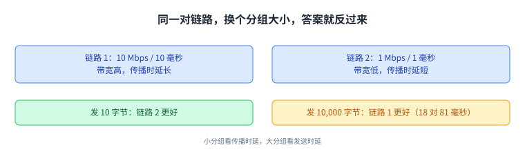

+++
title = "一条链路的三个数：带宽、传播时延、队列"
lecture = 6
slug = "links"
status = "draft"
source_kind = "textbook"
source_url = "https://textbook.cs168.io/intro/links.html"
source_title = "Links"
output_mode = "explanation"
+++

> 来源课程：UC Berkeley CS168 Computer Networks（教材 CS 168 Textbook）；
> 对应内容：Introduction 之 Links（<https://textbook.cs168.io/intro/links.html>）；
> 上游许可：教材站在站根页声明 CC BY-SA 4.0（第二人复核见 `docs/audit/license-cs168-second-review.md`）；
> 本文由 CourseLingo 原创撰写：**按该节的推进顺序**重新讲解，关键句给出英文原文与中译，**不逐句全译**，配图全部自绘、不转载原图；
> 本文非官方材料，CourseLingo 与 UC Berkeley 及课程教学团队无隶属关系；如与原文有出入，以原文为准。

## 一、一条链路的三个属性

分层的图景已经有了，这一讲把镜头推近到一条[[term:link]]上，看一个[[term:packet]]是怎么被送上这条线、又花多久到达对面。这一讲要解决的是这样一个问题：怎么用几个数字把一条链路的性能说清楚。链路的另一头是[[term:end-host]]，中间串着的则是交换机与路由器。

教材给出三个属性。第一个是[[term:bandwidth]]。

> "The bandwidth of a link tells us how many bits we can send on the link per unit time. Intuitively, this is the speed of the link."
> （链路的带宽告诉我们单位时间内能在这条链路上送多少位；直觉上它就是这条链路的速度。）

带宽的单位是每秒多少位，比如 5 Gbps 就是每秒 50 亿位。教材把它类比成水管的粗细：管子越粗，每秒能灌进去的水越多。

第二个是传播时延（propagation delay），它说的是一个位走完整条链路要多久。在水管类比里，它对应管子的长短：管子越短，水在里面待的时间越短。它用时间来量，比如纳秒、毫秒。

第三个是两个数相乘得到的带宽时延积（bandwidth-delay product，BDP）。

> "If we multiply the bandwidth and the propagation delay, we get the bandwidth-delay product (BDP). Intuitively, this is the capacity of the link, or the number of bits that exist on the link at any given instant."
> （把带宽和传播时延相乘，就得到带宽时延积；直觉上它是这条链路的容量，也就是任意一个瞬间链路上一共有多少位。）

用管子的说法：灌满管子然后让时间停住，此刻管子里的水量就是容量。教材还顺手交代了一个常见词：延迟（latency）。在链路的语境下，延迟就是传播时延；但这个词也用在别的地方，比如端主机到端主机、跨过好几条链路的延迟，`ping` 量出来的就是这一种。它本身没有正式定义，要看上下文。

带宽、传播时延、带宽时延积：三个数字就把一条链路的性能说清楚了。

## 二、算一次发送要多久：时序图

属性说完了，接下来算一个具体例子。链路带宽 1 Mbps，也就是每秒一百万位；传播时延 1 毫秒，也就是 0.001 秒。要发一个 100 字节的分组，也就是 800 位。问题是从第一位上线，到最后一位被收到，一共花多久。

教材的办法是画一张时序图（timing diagram）：左边一根竖条是发送方，右边一根是接收方，时间从 0 开始，越往下越晚。（本页配图把这三个时刻按先后排成一列；教材那张图是两条竖线加斜线，而本仓配图规范不允许斜线段，所以我们用先后顺序表达同一组时刻。）

先盯住第一位。每秒能放一百万位上线，所以放一位要 1 ÷ 1,000,000 = 0.000001 秒。在这个时刻，链路上有一位，位置在发送端。这位再花 0.001 秒走完全程（传播时延），所以第一位的到达时刻是 0.000001 + 0.001 秒。

再盯住最后一位。放一位要 0.000001 秒，而我们有 800 位，所以最后一位是在 800 × 0.000001 = 0.0008 秒上线的。它再花 0.001 秒走完全程，于是最后一位的到达时刻是 0.0008 + 0.001 = **1.8 毫秒**。这个时刻，才算整个分组到达。

把这两个时刻对起来看，能看出一条容易忽略的规律：第一位上线与最后一位上线之间隔着的，正好是把整个分组放上线所需的 0.8 毫秒，也就是后面要单独命名的发送时延。换句话说，时序图上发送方那一侧竖条的跨度本身就等于发送时延；而第一位从上线到到达所花的那 1 毫秒属于另一项，与带宽无关。

① 上线、② 第一位到达、③ 最后一位到达——只有第三个时刻才算整个分组到了。

## 三、分组时延：两部分之和

把上面的算法规整一下，就得到了分组时延（packet delay）：从第一位上线，到最后一位被对面收到，整段时间。

> "This delay is the sum of the transmission delay and the propagation delay."
> （这段时延是发送时延与传播时延之和。）

发送时延（transmission delay）是把这些位放上线要花的时间。在上面的例子里它是 800 × (1/1,000,000)。一般化成一句话：**分组大小除以链路带宽**。

传播时延与带宽无关，它由链路的物理长度和介质决定。所以分组时延可以完全用带宽和传播时延这两个链路属性算出来。这一节先给出这两项之和；到这一讲最后，还要再加进来第三项。

发送时延看带宽，传播时延看距离，两者相加才是分组时延。

## 四、两条链路谁更好：取决于你要发多大的包

有了公式就能比较了。教材摆出两条链路：链路 1 的带宽是 10 Mbps、传播时延 10 毫秒；链路 2 的带宽是 1 Mbps、传播时延 1 毫秒。问哪条更好。

> "Which link is better? It depends on the packets you're sending."
> （哪条链路更好？这取决于你要发什么样的分组。）

先发一个 10 字节的小分组。两条链路把它放上线的时间都可以忽略，真正决定快慢的是传播时延，而链路 2 的传播时延更短，所以这次链路 2 更好。

再发一个 10,000 字节的大分组，情况反过来：发送时延成了主导项，而链路 1 的带宽更高，把字节放上线更快，所以这次链路 1 更好。教材给了这两个数：链路 1 发这个大分组大约 18 毫秒，链路 2 大约 81 毫秒。这两个数可以自己验一遍：链路 1 的发送时延是 80,000 ÷ 10,000,000 = 8 毫秒，加上 10 毫秒传播时延，正是 18 毫秒；链路 2 是 80,000 ÷ 1,000,000 = 80 毫秒，加上 1 毫秒，正是 81 毫秒。

同一对链路，发小分组选链路 2、发大分组选链路 1，答案随分组大小翻转。

## 五、现实里的两个症状，对应两个不同的原因

这套算法不是纸上的练习，教材用它解释了两个日常现象。

> "For a real-world example, consider a video call. If the video quality is poor, you probably have insufficient bandwidth (and shortening propagation delay won't help). By contrast, if there's a delay between the time you speak and the time the other person answers, the propagation delay is probably too long (and more bandwidth won't help)."
> （举个现实例子：视频通话里画质差，多半是带宽不够，此时缩短传播时延没有用；反过来，如果你说完话对方过一会儿才回应，那多半是传播时延太长，此时把带宽加大也没有用。）

这句话值得逐字记住，因为它把**症状与病因的对应方向**钉死了：在 Zoom 这类视频通话里，画质差对应带宽不足，回话慢对应传播时延过长；而两个补救办法各自治不了对方的病。

先分清是带宽不够还是传播太慢，再决定往哪里使劲。

## 六、另一种画法：把链路画成一根管子

前面一直用时序图表示事件发生的时刻。教材给了另一种视角：让时间停住，把此刻链路上所有的位画出来。两种画法表达的信息一样，只是不同场合各有好用之处。

具体做法是把链路想成一根管子，画成一个矩形：宽是传播时延，高是带宽，面积就是这条链路的容量。前面讲的带宽时延积，在这里就是这个矩形的面积。

把链路画成管子，宽是高、高是带宽、面积是容量，一个瞬间就看清楚了。

## 七、管子里的分组：宽度就是发送时延

时间停住之后，正在被发送的分组也能画出来：它也是一个矩形，高表示每个时间步放上线多少位，宽表示发送时延。

教材把两者对齐之后给了一个不那么直观的结论：**时序图里的发送时延，就是管道图里那个矩形的宽度**。它的推演是这样的：假设链路每秒能送 5 位，要发一个 20 位的分组，那么每一秒有一列 5 位进入管子，要 4 列才装得完，所以这个分组在管子里的宽度是 4 秒，也就是它的发送时延。教材在同一段里先写了一句「时序图上第一位与最后一位之间有 11 秒」，紧接着又用管道图算出 4 列 = 4 秒；**按 20 位 ÷ 5 位每秒 = 4 秒来算，4 秒是对的，11 秒那个数字与这段推演不符**（我们照录教材这句话，并把按公式算出的数写在这里）。

管道图的好处，是它把发送时延和传播时延放在了同一根时间轴上，于是两者可以直接比大小。

把两种画法对起来看会更清楚：时序图的横轴是时间，管道图的横轴是位置。管道图把「同一段时间里一共有多少位在路上」压缩成一个瞬间，于是发送时延（分组的宽）与传播时延（管子的宽）落在同一根轴上，谁大谁小一眼可见。这也是教材说两种画法信息相同、但在不同问题上各有好用之处的原因。

分组的宽度就是发送时延，于是它能与传播时延放在同一根轴上比大小。

## 八、改一个参数，管子会怎么变

教材用同一批分组穿过三条不同的链路，让你看清两个参数各自的作用。

把传播时延缩短，管子就变窄。管子的高度不变，每个矩形分组的形状也不变，也就是说发送时延没有变；而管子的面积变小了，这意味着这条链路的容量变小了。这里的方向要分清：**传播时延影响的是管子的宽（也就是容量里的那一维），不影响发送时延。**

把带宽调高，管子就变高，每个时间步能塞进去的位更多了。这一回分组的形状也变了：分组变高，同时变窄，因为把整个分组喂进管子更快了，发送时延随之变小。

传播时延管的是宽，带宽管的是高，两者互不替代。

## 九、过载：瞬时过载与队列

前面算的都是理想情况。真实交换机会遇到一种常见局面：这一刻有两个分组同时到达，可出口链路一次只能发出一个。

> "This is called transient overload, and it's extremely common at switches in the Internet."
> （这叫做瞬时过载，在互联网的交换机上极其常见。）

应对的办法是[[term:switch]]维护一个队列：两个分组同时到了，就把其中一个放进队列，另一个先发出去。任何时刻，交换机可以选发一个刚到的分组，也可以选发队列里的一个，这个选择由分组调度算法决定，而调度算法有很多种设计，后面会看。没有新分组进来的时候，交换机就把队列排空。队列的价值就在于吸收这种瞬时突发。

一个进队列、一个先发出去，队列的作用就是吸收这种瞬时突发。

## 十、持续过载：只能丢包，以及为什么只承诺尽力而为

如果进来的一直比出去的多，那就是持续过载：出口链路的容量根本撑不住这个进入速率。这时候把队列填满也没用，交换机只能把[[term:forwarding]]不出去的分组丢掉。

教材给了运营者能做的两件事。一是按需扩容：如果发现某台交换机经常过载，就升级链路，而这可能需要人工操作。二是让发送方放慢，也就是后面的[[term:congestion-control]]要讲的内容，而真正动手的是 TCP。但教材也说了实话：**过载没有根治办法**，这正是[[term:internet]]（Internet）只承诺[[term:best-effort]]的原因，第三层的 IP 就是这么定的。

有了队列这个概念，分组时延的公式要补上第三项。

> "Now, packet delay is the sum of transmission delay, propagation delay, and queuing delay."
> （现在，分组时延是发送时延、传播时延与排队时延三者之和。）

扩容与让发送方放慢这两条都只能缓解，教材的结论是过载没有根治办法。

## 读完应该能回答

1. 带宽、传播时延、带宽时延积各自是什么，在管子类比里分别对应什么。
2. 分组时延由哪几项组成，为什么「哪条链路更好」取决于分组大小。
3. 瞬时过载与持续过载分别会发生什么，队列在其中起什么作用。

## 脉络回顾

这一讲把一条链路拆成了三个数：带宽（每秒能送多少位）、传播时延（一位走完全程要多久）、以及两者相乘得到的带宽时延积，也就是链路的容量。分组时延是发送时延（分组大小 ÷ 带宽）与传播时延之和；发小分组时传播时延主导，发大分组时发送时延主导，所以「哪条链路更好」没有统一答案。教材给了两种画法：时序图看事件发生的时刻，管道图看某一瞬间链路上有什么，而管道图里分组的宽度就是发送时延。

最后补上了第三项：排队时延。交换机的队列能吸收瞬时过载，但持续过载只能丢包，运营者可以扩容，也可以让发送方放慢，却没有根治办法。下一讲会沿着「多台机器共享一条链路」这条线往下去，看链路层怎么协调大家。

## 溯源

- 对应：UC Berkeley CS168 Computer Networks，教材 Introduction 之 Links（<https://textbook.cs168.io/intro/links.html>）
- 教材：CS 168 Textbook（UC Berkeley CS168 课程教材），原文链接同上
- 授权依据：教材站在站根页声明 CC BY-SA 4.0；本文为本仓库原创中文讲解，按该节顺序重讲，关键句给出英文原文与中译，**未逐句全译**，配图自绘
- 结构说明：本讲章节顺序跟随教材该节的推进顺序（链路三属性 → 时序图 → 分组时延 → 两条链路的取舍 → 管道图 → 管道里的分组 → 改参数 → 过载）；「现实里的两个症状」与「持续过载」两节是我们的归并
- 我们的计算与补白：把教材给的 18 毫秒 / 81 毫秒回代验算了一遍（80,000 ÷ 10 Mbps + 10 毫秒 = 18 毫秒；80,000 ÷ 1 Mbps + 1 毫秒 = 81 毫秒）；「缩短传播时延影响容量那一维、不影响发送时延」这句归类是我们的表述
- 源文内部数字不符（照录并说明）：管道图那一节的例子（5 位每秒、20 位分组）里，源文先写「时序图上首位与末位之间 11 秒」，紧接着用管道图推出 4 列 = 4 秒；按 20 ÷ 5 = 4 秒正确，本页按 4 秒叙述并标出这处不符
