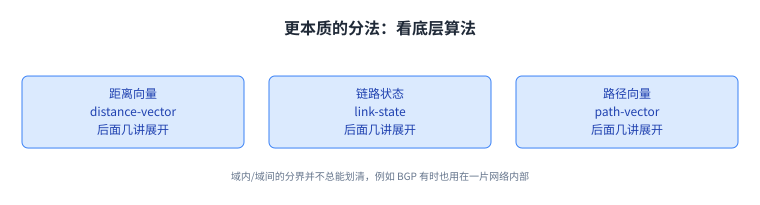

+++
title = "路由导论：谁来决定下一步往哪走"
lecture = 7
slug = "introduction-to-routing"
status = "draft"
source_kind = "textbook"
source_url = "https://textbook.cs168.io/routing/intro.html"
source_title = "Introduction to Routing"
output_mode = "explanation"
+++

> 来源课程：UC Berkeley CS168 Computer Networks（教材 CS 168 Textbook）；
> 对应内容：Routing 之 Introduction to Routing（<https://textbook.cs168.io/routing/intro.html>）；
> 上游许可：教材站在站根页声明 CC BY-SA 4.0（第二人复核见 `docs/audit/license-cs168-second-review.md`）；
> 本文由 CourseLingo 原创撰写：**按该节的推进顺序**重新讲解，关键句给出英文原文与中译，**不逐句全译**，配图全部自绘、不转载原图；
> 本文非官方材料，CourseLingo 与 UC Berkeley 及课程教学团队无隶属关系；如与原文有出入，以原文为准。

## 一、问题：两台机器并不直连，消息怎么找到路

前面几讲把分层、首部、[[term:link]]（link，链路）都讲过了，可一直回避了第三讲留下的那个问题：交换机收到一个[[term:packet]]（packet，分组）之后，怎么知道该往哪个口[[term:forwarding]]（forwarding，转发），才能让它更靠近目的地。这一讲要解决的就是这个问题，它是 Routing 这一部分的入口。

教材把问题摆得很直白：机器 A 和机器 B 都连着[[term:internet]]（Internet，互联网），可它们之间并没有直接连着。A 要把消息发给 B，它怎么知道该往哪里发，消息才会最终抵达 B；而这个消息在[[term:routing]]（routing，路由）的意义上究竟会走出一条什么路径。

> "How does machine A know where to send the message, so that the message will eventually reach machine B? What path will the message take through the network to reach its destination of machine B? In this unit, we'll be studying routing to answer these questions."
> （机器 A 怎么知道该把消息发到哪里，消息才会最终到达机器 B？消息在网络里会走出一条什么路径，才到达目的地 B？这一部分就是研究路由来回答这些问题的。）

这一部分会按四步推进：先给互联网建一个够用的模型，好把路由变成一个定义清楚的问题；再看路由问题的答案长什么样，什么样的答案算合法、算好；然后看几类[[term:protocol]]（protocol，协议）路由协议，它们用来生成这些答案；最后看寻址怎么让协议扩展到整个互联网，以及真实世界里用的硬件。

这一部分的全部内容，都是为了回答这个「该往哪里发」的问题。

建模型、看答案、看协议、看寻址与硬件：这就是 Routing 部分的路线。

## 二、直觉做法：给全世界建一张路由表

既然要为路由找一个答案，最直接的思路是：给互联网建一个包含全世界每一台机器的模型，再设计一个巨型路由协议，让它能把分组送到世界上的任何地方。

这条路的问题是规模。教材说得很干脆。

> "However, this is infeasible in practice because of the scale of the Internet."
> （然而，由于互联网的规模，这在实践中是不可行的。）

不是这个想法不好，而是它太大了：一台[[term:router]]（router，路由器）不可能知道全世界每一台机器的路由信息，也不可能在每台机器变动时同步一遍。这一点后面还会反复出现，它是整门课的一条主线。

具体地说，一台路由器要存下全世界每一台机器的可达信息，还要在每次有人接入或断开时把变化同步一遍；这两件事的代价都随机器数量增长，而互联网的机器数量是全世界级的。规模问题在这里第一次出现，后面每一讲都会以不同形式回来找它：路由表有多大、协议报文发多少、故障时要收敛多久。

不是这个想法不好，而是它太大了：一份路由表装不下全世界。

## 三、核心思路：利用「网络的网络」

换一个思路，利用一件早就成立的事实：互联网是网络的网络，它由许多本地网络组成。教材给出的做法是分两层来设计。

> "Each local network implements its own routing protocol that specifies how to send packets within just that local network. Then, we can connect up all those local networks and implement a routing protocol across all the local networks, specifying how to send packets between different local networks."
> （每片本地网络各自实现一套路由协议，规定怎么在这片网络**内部**送分组；然后把这些本地网络连起来，再实现一套跨网络的协议，规定怎么在不同的本地网络**之间**送分组。）

于是路由被切成两半：域内的路由协议，和域间的路由协议。这个切法不是官僚式的分工，它解决的是规模问题：任何一片网络只需要管好自己那一摊，全世界的路由信息不需要塞进同一台机器，这就是可扩展性（[[term:scalability]]，scalability）的来源。

域内各管各的、域间共享规则，规模问题就被切开了。

## 四、域内：每片网络都不一样，所以可以各选各的

为什么域内协议可以各选各的，教材给的理由是：本地网络之间确实不一样。它列了一串差异来源，这份清单比结论更有意思。

> "For example, they might differ in size: Some networks might have more machines than others. Or, the machines might be spread out over a wider physical area (e.g. the entire UC Berkeley campus), or a smaller area (e.g. your home). Networks can also differ in the bandwidth they need to support, the allowable failure rate, the number of support staff available, the age of the infrastructure, the amount of money available to build and support it, and so on."
> （比如规模不同：有的网络机器多，有的少；覆盖的物理范围也不同，可能是一整个校园，也可能是你家。网络还可能在需要支撑的[[term:bandwidth]]（bandwidth，带宽）、允许的故障率、能投入的运维人手、[[term:infrastructure]]（infrastructure，基础设施）的新旧、能拿到的预算等方面各不相同。）

规模、范围、带宽、容错要求、人手、设备新旧、预算，这些差异决定了同一套策略在一张网络里好用、换一张就未必。所以教材的结论是让每片网络自己选。

> "Each operator can choose the protocol that works best for them."
> （每个运营者（比如一家 [[term:isp]]，ISP）都可以选最适合自己的那套协议。）

在本地网络**内部**用的路由协议叫域内路由协议（intra-domain routing protocol），也叫内部网关协议（[[term:interior-gateway-protocol]]，IGP）。教材点了两个真实世界的例子：OSPF（Open Shortest Path First）和 IS-IS（Intermediate System to Intermediate System）。

规模、范围、预算都不一样，所以域内协议允许各选各的。

## 五、域间：必须所有人一致，所以只剩一个 BGP

域内可以百花齐放，域间不行。跨不同网络送分组，需要所有网络同意用同一套协议。教材把「不一致会怎样」讲得很具体：如果一片网络只实现了协议 X，另一片只实现了协议 Y，那它们之间怎么交换消息就没人说得清了。

> "In order to support sending packets across different local networks, every network needs to agree to use the same protocol for routing packets between each other. If different networks used different inter-domain protocols, there's no guarantee that the entire Internet could be connected in a consistent way."
> （要支持跨不同本地网络送分组，每片网络都必须同意：彼此之间用同一套协议。如果各用各的域间协议，就无法保证整个互联网能以一致的方式连起来。）

于是结论顺理成章：正因为必须一致，全球规模上**只有一个**域间协议在跑。

> "Because every network must agree to use the same inter-domain protocol, there is only one protocol implemented at scale on the Internet, namely BGP ([[term:border-gateway-protocol]])."
> （因为每片网络都必须同意使用同一个域间协议，所以互联网上大规模实现的协议只有一个，就是 BGP，边界网关协议。）

这类协议叫域间路由协议（inter-domain routing protocol），也叫外部网关协议（exterior gateway protocol，EGP）。注意这里的方向：**域内是「可以不同」，域间是「必须相同」**，两个方向的理由正好相反，一个是差异太多，一个是差异太大而不能容忍。

正因为必须一致，全互联网规模上只剩 BGP 一个。

## 六、这条分界线并不总是清楚，以及按算法分三类

教材在收尾处踩了一脚刹车：域内与域间这套分法方便建立直觉，但实践中两者的界限并不总是清楚。它给的例子是 BGP 自己：BGP 除了用在网络之间，有时也用在某一片网络的内部。

> "This model of interior and exterior gateway protocols is convenient for intuition, but in practice, there is not always a clear distinction between them. For example, BGP is sometimes also used inside a local network, in addition to between different networks."
> （内部网关协议与外部网关协议这套模型便于建立直觉，但实践中两者并不总有清楚的区分。比如 BGP 除了用在网络之间，有时也用在某一片网络内部。）

教材于是给了另一种更本质的分类方式：不管一套协议是部署在网络内部还是网络之间，都可以看它底层算法在做什么。按这个标准分成三类，也是后面几讲要逐个展开的：距离向量（distance-vector）、链路状态（link-state）、路径向量（path-vector）。

这三类算法的名字在教材这一节里只是点名，具体怎么做会留到后面几讲；它们真正的差别在「谁告诉谁什么信息」上，这也是判断一套路由协议属于哪一类的线索。

## 七、脉络回顾

这一讲把整条路线铺开了。问题是「A 并不直连 B，消息怎么找到路」；答案是别指望一个巨型协议，而是利用互联网是网络的网络，把路由切成域内与域间两层。域内因为每片网络在规模、范围、带宽、容错、人手、预算上都不一样，所以允许各选各的协议，代表是 OSPF 与 IS-IS；域间因为必须所有网络一致，所以全球规模上只剩 BGP 一个。这条分界线在实践中并不总能划清，所以更本质的分类是看底层算法：距离向量、链路状态、路径向量。

后面几讲会先把这个「够用的模型」正式建起来，再逐个讲这三类算法，然后讲寻址怎么让它们扩展到整个互联网规模。

## 读完应该能回答

1. 路由要回答的两个问题分别是什么，为什么一个巨型协议在实践中不可行。
2. 域内与域间在「可不可以各选各的」上方向为什么相反，各自的代表协议是什么。
3. 除了域内/域间，教材给出的另一种更本质的分类是什么，分成哪三类。

## 溯源

- 对应：UC Berkeley CS168 Computer Networks，教材 Routing 之 Introduction to Routing（<https://textbook.cs168.io/routing/intro.html>）
- 教材：CS 168 Textbook（UC Berkeley CS168 课程教材），原文链接同上
- 授权依据：教材站在站根页声明 CC BY-SA 4.0；本文为本仓库原创中文讲解，按该节顺序重讲，关键句给出英文原文与中译，**未逐句全译**，配图自绘
- 结构说明：本讲章节顺序跟随教材该节的推进顺序（什么是路由 → 域内与域间）；教材把「这一部分的四步」写在第一节里，我们把它抽成一张配图
- 我们的归纳（源文没有明说，记在这里以免被当成原文）：把「域内可以不同、域间必须相同」并成一句对照，并指出两个方向的理由相反（差异太多 vs 差异不能容忍）；把 IGP/EGP 的中文名与缩写并列写出
