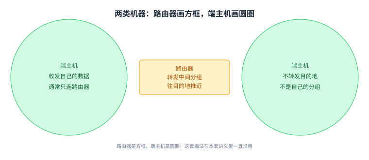
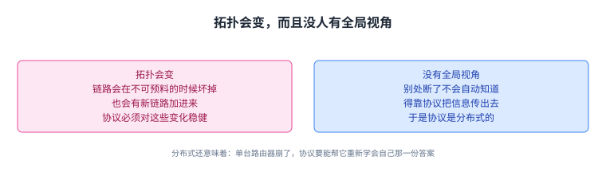

+++
title = "路由的模型：把网络画成一张图"
lecture = 8
slug = "model-for-intra-domain-routing"
status = "draft"
source_kind = "textbook"
source_url = "https://textbook.cs168.io/routing/model.html"
source_title = "Model for Intra-Domain Routing"
output_mode = "explanation"
+++

> 来源课程：UC Berkeley CS168 Computer Networks（教材 CS 168 Textbook）；
> 对应内容：Routing 之 Model for Intra-Domain Routing（<https://textbook.cs168.io/routing/model.html>）；
> 上游许可：教材站在站根页声明 CC BY-SA 4.0（第二人复核见 `docs/audit/license-cs168-second-review.md`）；
> 本文由 CourseLingo 原创撰写：**按该节的推进顺序**重新讲解，关键句给出英文原文与中译，**不逐句全译**，配图全部自绘、不转载原图；
> 本文非官方材料，CourseLingo 与 UC Berkeley 及课程教学团队无隶属关系；如与原文有出入，以原文为准。

## 一、先把网络画成一张图

上一讲把问题提出来了，可要正式回答它，得先有一个够用的模型。这一讲要解决的就是这件事：把互联网抽象成一张图，让路由（[[term:routing]]，routing）变成一个能写下来、能判断对错的问题。

教材的做法很朴素：把互联网看成一堆机器，加上一堆[[term:link]]（link，链路），每条链路连接其中两台机器。

> "We can represent the network topology as a graph, where each node represents a machine, and each edge between two nodes represents a link between two machines."
> （我们可以把网络拓扑表示成一张图：每个节点代表一台机器，两个节点之间的每条边代表两台机器之间的一条链路。）

教材补了一句历史注脚：早期确实存在一条链路连多于两台机器的情况，但在现代网络里，链路基本上总是恰好连接两台机器。这条约定后面会用到，它让「边」这个概念保持干净。

## 二、两种最朴素的连法，各自卡在哪

有了图，就可以试着连了。教材先摆出两种极端连法，让它们的毛病自己暴露出来。

第一种是全互联（full mesh）：在每一对机器之间都拉一条链路，于是每台机器都直连其他所有机器。它的毛病是长不大。

> "If we tried to scale this to the size of the modern Internet, we'd need a wire connecting every pair of computers in the world."
> （要是想把它扩大到现代[[term:internet]]（Internet，互联网）的规模，我们就需要一根线连接世界上每一对电脑。）

更麻烦的是变化：新来一台电脑，就得在它和全世界其他每台电脑之间新建链路。不过教材也说了它在小场合的好处：每台机器都有到其他所有机器的专用链路，一对机器之间可以把这个[[term:bandwidth]]（bandwidth，带宽）用满，所以小规模下带宽很富裕。另外还有一句提醒：一般并不保证图是全连通的，也就是说，不能默认每台机器都有一条直连到其他所有机器的链路。

第二种是单链路（single link）：拿一条链路把所有机器都挂上去。这里教材临时破了自己刚立的规矩，允许一条链路连多于两台机器。它的好处是扩展容易：新来一台电脑，把线延长过去就行，不必新建一堆链路。代价是带宽。

> "In particular, there is only a single link, and all five machines need to share the bandwidth on this link."
> （因为只有一条链路，五台机器都得抢这一条链路的带宽。）

## 三、引入路由器：把机器分成两类

两种极端都不合适，教材于是引入一个新的角色，并顺势给模型加了一条分类规则：每台机器要么是端主机，要么是路由器。

[[term:end-host]]（end host，端主机）是接入互联网收发数据的机器。你电脑上跑着的浏览器算，谷歌那种收发搜索请求的服务器也算。它们会发出自己的[[term:packet]]（packet，分组），也可能成为别人分组的最终目的地，但通常不接收并转发那些「目的地不是自己」的中间分组。

[[term:router]]（router，路由器）正好相反：它的职责就是接收并转发中间分组，把它们往最终目的地推近。

> "Routers, by contrast, are machines connected to the Internet responsible for receiving and forwarding intermediate packets closer to their final destination."
> （路由器相反，是接入互联网、负责接收中间分组并把它们转发到离最终目的地更近的机器。）

你家里的那台路由器是路由器，数据中心里的路由器也是路由器。教材提醒：这些机器通常不自己造分组，也通常不是分组的最终目的地。你上网是想把分组发给谷歌的服务器，而不是发给家里那台路由器。

教材顺手交代了两件容易混的事。第一，路由器可以是合法的目的地，但这一部分里我们忽略这种情况；不过路由器自己可以作为发送方发出新分组。第二，路由器有时也被叫[[term:switch]]（switch，交换机）；两者历史上有区别，如今基本混用，本套讲义尽量统一用「路由器」。

最后是一条画法约定，非常有用：**路由器画成方框，端主机画成圆圈**。在这张图里，路由器表现为通常连着好几个邻居的中间节点，端主机表现为通常只连一个或几个路由器的节点。教材也承认，现实里这两条都不总成立。

## 四、有了路由器，拓扑就能两头取中

有了这两类机器，就能造出更好的拓扑了。教材给的这张图，同时拿到了全互联和单链路的好处。

> "In particular, this topology uses fewer links than the full mesh topology from earlier. Also, this topology has more bandwidth than the single link topology from earlier."
> （具体来说，这个拓扑用的链路比前面的全互联少，带宽又比前面的单链路多。）

它还多了一样前两种都没有的东西：**抗故障**。某条链路断了，分组可以换一条路走，照样能到目的地。

> "This topology is also more robust to failure. If a link goes down, the packet can take a different path through the network and still reach its destination."
> （这个拓扑对故障也更稳健：某条链路断了，分组可以走另一条路径，仍然到达目的地。）

这一讲后面几节要处理的那几个现实问题，正是从这里长出来的：路径不止一条，路由器怎么知道该走哪条。

## 五、端主机不参与路由：默认路由

模型里有了两类机器，接下来的问题是：端主机在路由里扮演什么角色。教材的回答是几乎不参与。

> "Note that end hosts generally do not participate in routing protocols, since they don't forward intermediate packets."
> （端主机通常不参与路由协议，因为它们不转发中间分组。）

它们通常只用一条链路连着一台路由器，然后**把出站消息统统交给这台路由器**，由路由器去想怎么送到最终目的地。这个办法有个名字。

> "This strategy of sending everything to the router is sometimes called the default route of the end host."
> （这种把一切都交给路由器的做法，有时叫端主机的默认路由。）

这条约定还有一个后果：设计路由协议时，我们通常忽略端主机，只把它们当作目的地看待，因为路由器要解决的正是「怎么到达各个目的地」这件事。

## 六、模型里的分组：只看首部里的目的地址

机器分好类了，接下来规定「在图上跑的东西」长什么样。教材在这里做了一个刻意的简化：每个分组就是一段[[term:header]]（header，首部）加一段载荷，暂时不管多层嵌套的首部。

> "In the routing unit, we'll consider a simplified model where each packet has a header with metadata, and a payload with the application-level data. We'll ignore nested headers and multiple layers for now."
> （在路由这一部分，我们用一个简化的模型：每个分组有一段带元数据的首部，和一段装着应用数据的载荷；暂时忽略嵌套的首部和多层结构。）

路由不关心应用层的数据是什么。用户发的是图片、网页还是音频，对路由来说都一样：它面对的是一串 1 和 0，需要一套协议把这串比特送到目的地。首部里真正要紧的字段只有一个。

> "In the header, the main metadata field we're concerned with is the destination address."
> （首部里我们最关心的元数据字段是目的地址。）

路由器收到分组后，读首部里的这个字段，据此决定把分组往哪送。这个动作在第七讲出现过，就是[[term:forwarding]]（forwarding，转发）；而「到底该往哪送」这件事，就是路由要解决的核心问题。

## 七、地址与「路由问题」的正式定义

首部里要写目的地址，那地址从哪来。教材说得直白：我们需要某种给机器编址的办法，也就是一套给网络里每台机器分配地址的协议。

可扩展的编址方案留到这一部分后面讲。眼下，教材让你先给每台机器发一个**唯一标签**，比如把三台路由器叫 X、Y、Z，然后把这些标签当作它们的地址。这样做有一个明确的好处：把路由问题和编址问题分开想，一次只想一件。

有了地址，教材终于把这一讲的核心问题写成了一句话。

> "When a router receives a packet, how does the router know where to forward the packet such that it will eventually arrive at the final destination?"
> （当一台路由器收到一个分组时，它怎么知道该往哪里转发，才能让这个分组最终到达目的地？）

注意这句话的形状：主语是「路由器」，动作是「转发」，目标是「最终到达目的地」。它要的是一个局部决策——每台路由器只决定自己这一步；而这些局部决策合起来，必须能让分组走完全程。

## 八、三件让问题变难的事（上）：拓扑会变、协议必须分布式

问题写清楚了，可是它并不好解。教材列了三件现实里躲不开的事，前两件关系紧密，放在一起看。

第一件是拓扑会变。如果互联网是一张永不改变的固定图，那我们大可以盯着这张图算路径，事情就结束了。可现实里链路会在不可预料的时候坏掉，也会有新链路加进来，路由协议必须对这些变化保持稳健。

> "The routing protocols we design need to be robust to these changing network topologies."
> （我们设计的路由协议必须能应对这些不断变化的网络拓扑。）

第二件是没有人有全局视角。既然图会变，那能不能每次变化就重算一遍。问题在于：路由器并不天然拥有俯瞰整个网络的视角，网络别处断了一条链路，其他路由器不会自动知道这件事，得靠协议把这条信息传播出去。

于是路由协议往往是一套**分布式**协议。

> "Instead of a single central mastermind computing all the answers, each router must compute its own part of the answer (possibly without full knowledge of the network topology)."
> （不是一个中心大脑算出所有答案，而是每台路由器各自算出答案的一部分，而且可能是在并不掌握完整拓扑的情况下算出来的。）

分布式还带来一个具体的麻烦：单台路由器会坏。如果答案由一台中心计算机算，它崩了忘掉答案，重算一遍就行；可分布式里每台路由器只记得自己那一份，一台崩了，协议得有办法让**它**重新学会自己那份答案。

## 九、三件让问题变难的事（下）：链路只是尽力而为

第三件事在前面的单元里出现过：第三层及以下都是尽力而为。

> "In other words, when a packet is sent over a link, there is no guarantee that the packet reaches the destination. The link might drop the packet."
> （换句话说，分组在一条链路上发出之后，并不保证它到达对面；链路可能把分组丢掉。）

于是路由协议不能假设「我发出去它就一定到」。它得在会丢包、会变图、每台路由器只知道一小块的情况下，仍然让分组走到目的地。这一讲把模型搭完了，后面几讲就开始在这套模型上设计具体的协议。

三件事合起来，正好说明这一讲为什么要把模型搭得这么细：拓扑会变、没人有全局视角、链路还可能丢包，其中任何一个假设放宽，协议就要多应付一种情况。

## 十、脉络回顾

这一讲把互联网抽象成一张图：节点是机器，边是链路。机器分成两类，路由器画成方框、端主机画成圆圈；路由器负责转发中间分组，端主机只收发自己的数据，把出站消息统统交给默认路由的那台路由器，因此设计协议时可以只把端主机当目的地。分组被简化成「首部加载荷」，首部里真正要紧的是目的地址；地址先用 X、Y、Z 这样的标签代替，好把编址问题留到后面。

有了这些，路由问题被写成一句话：**路由器收到分组后，怎么知道该往哪转发，才能让它最终到达目的地**。而三件现实的事让它变难：拓扑会变、没有全局视角（于是协议是分布式的，还要能帮单台故障路由器恢复）、链路只是尽力而为。下一讲开始介绍第一类具体协议。

## 读完应该能回答

1. 图模型里的节点与边分别对应什么，为什么现代网络可以假定一条链路只连两台机器。
2. 全互联与单链路各自的毛病是什么，加上路由器之后为什么能两头取中。
3. 路由问题的正式表述是什么，以及哪三件事让它变得困难。

## 溯源

- 对应：UC Berkeley CS168 Computer Networks，教材 Routing 之 Model for Intra-Domain Routing（<https://textbook.cs168.io/routing/model.html>）
- 教材：CS 168 Textbook（UC Berkeley CS168 课程教材），原文链接同上
- 授权依据：教材站在站根页声明 CC BY-SA 4.0；本文为本仓库原创中文讲解，按该节顺序重讲，关键句给出英文原文与中译，**未逐句全译**，配图自绘
- 结构说明：本讲章节顺序**跟随教材该节的推进顺序**（图模型 → 全互联 → 单链路 → 路由器与端主机 → 带路由器的拓扑 → 端主机与默认路由 → 分组 → 地址与路由问题 → 拓扑会变 → 协议是分布式的 → 链路尽力而为）；我们把「全互联」与「单链路」并成一节，「拓扑会变」与「协议是分布式的」并成一节
- 我们的归纳（源文没有明说）：把三件难事按「拓扑会变 + 没有全局视角 ⇒ 分布式」「链路会丢」分成上、下两节；把「局部决策合起来必须能走完全程」这句写进路由问题的解读