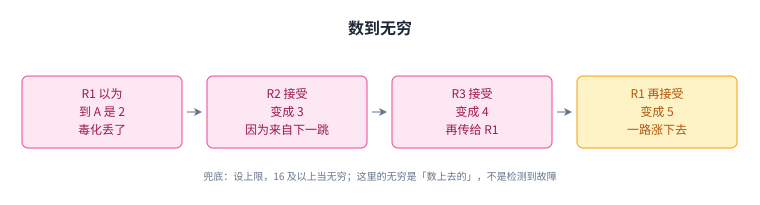

+++
title = "距离向量：从一条宣告长出来的协议"
lecture = 10
slug = "distance-vector-protocols"
status = "draft"
source_kind = "textbook"
source_url = "https://textbook.cs168.io/routing/distance-vector.html"
source_title = "Distance-Vector Protocols"
output_mode = "explanation"
+++

> 来源课程：UC Berkeley CS168 Computer Networks（教材 CS 168 Textbook）；
> 对应内容：Routing 之 Distance-Vector Protocols（<https://textbook.cs168.io/routing/distance-vector.html>）；
> 上游许可：教材站在站根页声明 CC BY-SA 4.0（第二人复核见 `docs/audit/license-cs168-second-review.md`）；
> 本文由 CourseLingo 原创撰写：**按该节的推进顺序**重新讲解，关键句给出英文原文与中译，**不逐句全译**，配图全部自绘、不转载原图；
> 本文非官方材料，CourseLingo 与 UC Berkeley 及课程教学团队无隶属关系；如与原文有出入，以原文为准。

## 一、起点：从一条最简单的宣告开始

前面几讲把判据立好了，这一讲要解决的是：把那些判据变成一套真正能跑的协议。。距离向量（distance-vector）是三类[[term:routing]]算法之一，另外两类是链路状态与路径向量。它有着很长的历史，在[[term:internet]]与它的前身 ARPANET 上用了很多年，原型[[term:protocol]]是 RIP（Routing Information Protocol），它跑在 UDP 的 520 端口上；今天域内网络的主力是 OSPF，RIP 这一套多半只留在很小的网络里。

教材从一个空网络开始推：每台[[term:router]]的转发表都是空的，目标是把它们填好，让任何地方都能把[[term:packet]]送到目的地 A（一台[[term:end-host]]，end host）。第一步很朴素。

> "To start, A can tell R1: 'I am A.' Now, R1 knows how to forward packets to A."
> （一开始，A 可以告诉 R1：「我是 A。」于是 R1 就知道该怎么把分组[[term:forwarding]]给 A 了。）

R1 有了通往 A 的路，就转告邻居 R2 和 R3：「我是 R1，我能到 A。」于是 R2、R3 知道了把分组交给 R1 就能到 A。它们再往下传，一层层铺开，直到所有人的表都填满。教材把这个过程总结成两条动作：听到有人宣称能到 A，就记下是谁说的；一旦自己有了路，就转告所有邻居。

整个协议只有两条动作，其余所有规则都是在给这两条打补丁。

## 二、最容易搞混的一点：宣告的方向与消息的方向相反

协议一共只有两条动作，但教材专门用一整节来提醒一个坑。

> "In this protocol, it's easy to confuse the the direction in which announcements and messages are sent."
> （在这个协议里，很容易把宣告的方向与实际消息的方向搞混。）

宣告是从目的地向外扩散的：A 告诉别人「我是 A」，R1 再告诉它的邻居。而真正的消息是向内走的：从远处的 D 出发，一路朝着 A 的方向送。

> "The direction of announcements is exactly the opposite of the direction of the messages themselves."
> （宣告的方向与消息本身的传送方向完全相反。）

这一条要背下来：**宣告向外、消息向内**。

记住这一条：宣告往外走，消息往里走。

## 三、有多条路时：把代价放进宣告

上面那个网络里每个目的地只有一条路，一旦有多条路可走，就需要比较。教材的场景是 R3 和 R4 都能到 A，R5 该选谁。选最便宜的那条，就得在宣告里带上代价。

宣告于是变成三个值：目的地、你自己的身份、以及从你到目的地的总代价。R3 说「我能到 A，代价 3」，R4 说「我能到 A，代价 2」，R5 就选 R4。转发表的每条条目也相应记三样东西：目的地、下一跳、经由这个下一跳的代价。

听到一条路时有三种情况：表里没有这个目的地，就接受；新路比已知的更好，就替换；新路比已知的更差，就忽略。这里有一个极易算错的地方：比较的不能只是宣告里的那个数。

> "When someone advertises a path, the cost via that path is actually the sum of two numbers: The link cost from you to the neighbor, plus the cost from the neighbor to the destination (as advertised by the neighbor)."
> （别人宣告一条路径时，经由这条路径的代价其实是两个数之和：你到那个邻居的[[term:link]]代价，加上邻居到目的地的代价。）

教材给了具体例子：听到「我是 R1，A 离我 5」，这条路对你来说是 1（你到 R1 的链路代价）加 5，等于 6。后来又听到「我是 R2，A 离我 3」，看起来 3 更小，但对你来说是 10 加 3 等于 13，比 6 差，所以不更新，分组继续发给 R1。

算路径代价时，永远把「到邻居的链路代价」加上去，不能只看宣告里的数。

## 四、这其实就是分布式的 Bellman-Ford

上面那个「拿新代价和已知代价比，小的就替换」的动作，教材让你认一认。

> "Does this operation look familiar? It turns out, this is exactly the relaxation operation from Dijkstra's shortest paths algorithm!"
> （这个操作看着眼熟吗？它正是 Dijkstra 最短路算法里的松弛操作。）

Bellman-Ford 是另一个依赖松弛的最短路算法，而且比 Dijkstra 更简单：反复遍历所有边、对每条边做松弛，直到所有最短路都出来。但教材提醒，你在数据结构课上学过的那份代码，直接拿来当路由协议并不好用，因为路由协议必须是分布式的，而且是异步的。

- 分布式：没有一台中心机器跑整个算法，每台路由器在看不到整张图的情况下，只算出自己那一份答案，也就是把自己的表填好。
- 异步：整个协议是[[term:asynchronous]]的：所有路由器可以同时跑，没有谁规定松弛的顺序，也没有谁规定宣告发出的顺序。

所以这一讲设计的，是一个分布式、异步版本的 Bellman-Ford。教材还交代了一个术语：把「我是 R1，我能以代价 5 到 A」这样的消息发出去，叫宣告或广告一条路由（announcing / advertising a route），这条广告包含三个值：目的地、你的身份、从你到目的地的总代价。

分布式与异步这两条，正是它和你在数据结构课上写的那份代码最大的差别。

## 五、把例子跑一遍

教材用一个全是代价 1 的网络走了一遍完整过程。起点是用静态路由硬编码一条：R1 的表里写上「到 A，下一跳是 A，代价 1」。R1 的表变了，于是它发一条广告（目的地 A、身份 R1、代价 1）给唯一的邻居 R2。

R2 查表，没有 A 的条目，于是装上「A，下一跳 R1，代价 2」（宣告里的 1 加上链路的 1）。R2 的表也变了，于是它把广告发给 R3 和 R1——包括发回给 R1，教材特意在这里插了一句「如果这让你觉得别扭，先记着，后面会回来处理」。

R1 收到后一算：经由 R2 是 2 加 1 等于 3，比自己的 1 差，忽略。R3 收到后装上「A，下一跳 R2，代价 3」，并继续宣告给 R2。R2 一算 3 加 1 等于 4，比自己已知的 2 差，忽略，于是不再宣告，整个过程停下来。此时每个人的表都填好了，而且合起来正好是一棵有效的、最小代价的投递树。

注意 R2 也把广告发回了 R1——这是协议当前的样子，后面会回来处理。

## 六、拓扑会变：来自下一跳的更新，再差也得接受

前面那条「新路更差就忽略」的规则，遇到拓扑变化就会出事。教材的例子是：R2 原来宣告「A 离我 3」，我们记下 4；后来 R2 宣告「A 离我 8」，按老规则该忽略，因为 9 比 4 差。可这次不能忽略。

> "The router making the announcement (R2), was the same as the next hop router we were using. R2 is trying to say: 'If you're using me as a next hop, my distance to A is no longer 3, it's 8.'"
> （发这条宣告的路由器 R2，正是我们正在用的那个下一跳。R2 是在说：「如果你把我当下一跳，那我到 A 的距离已经不是 3，而是 8 了。」）

于是规则要补一条：**如果宣告来自当前的下一跳，就把它当成更新接受，哪怕结果更差**。注意这种更新只改距离，不改目的地和下一跳。

补上这条之后，协议就可以一直跑下去。教材顺手解释了「稳态」：没有拓扑变化时，一开始有些松弛会成功、表会变；最终所有最短路都被找到，继续松弛也不会再改动表，这个状态叫稳态。拓扑一变（比如路由器坏了），一些松弛又会成功，过一阵子投递树会在新的最短路重新收敛。教材用一池水打比方：稳态时水面纹丝不动，扔块石头会起涟漪，过一会儿又恢复平静。

补上这一条之后，协议就得一直跑下去，也因此有了「稳态」这个概念。

## 七、会丢包：周期重发与触发更新

分组会丢，所以广告可能到不了对面。教材选了一个简单办法，而不是去设计确认机制：有广告要发，就每隔几秒重发一次。

协议为此定义一个广告间隔（advertisement interval），实践中常用 30 秒。只要链路还有成功的可能，重发足够多次，广告最终会送到；如果链路一个包都送不过去，那这条链路本来也不该出现在图里。

除了定期重发，还有一条：表变了就立刻发。这两者配合起来有两个名字。表变化后立刻发的叫触发更新（triggered updates），定期发的就是间隔更新。教材强调触发更新只是优化：只在间隔到了才发，协议依然正确，只是收敛慢一些。

重发解决丢包，触发更新只负责更快，两者不要与正确性混为一谈。

## 八、链路会坏：TTL 与过期

路由器坏掉时，它不会来通知你，于是你手里可能留着一条已经作废的路。教材的解法是给每条路由一个有限的存活时间（TTL），也就是一个倒计时，告诉你这条表项还能留多久（它和 IP 首部里那个每跳减一的 TTL 不是一回事）。收到下一跳的定期广告，就把 TTL 重置回原值；如果一直收不到，TTL 归零，就删掉这条表项。

教材的例子是：t=0 收到「我是 R2，A 离我 5」，装表并把 TTL 设为 11；t=5 收到 R2 的定期重发，TTL 重置回 11；t=6 链路断了，R2 不再发；到 t=16，TTL 减到 0，删掉条目。

这里有两个计时器，很容易混：广告间隔是「什么时候向邻居发广告」，通常是整张表一个计时器；TTL 是「什么时候删掉某条表项」，每条表项各自独立倒计时。

一个管「什么时候发」，一个管「什么时候删」，混起来就会把超时算错。

## 九、别傻等过期：毒化

等 TTL 归零太慢。教材把上一节的例子重放了一遍，让你看清代价：t=6 链路就断了，可我们还得用这条作废的路再撑 10 秒；这期间发给 A 的分组全丢（真机上用 traceroute 看，路径走到 R2 就断了），我们还可能把这条作废的路广告给别人，甚至因为「表里已经有 A」而拒绝掉新的、正确的路。

问题的根子是：故障没人上报，只能靠超时。解法是主动上报，也就是毒化（poison）。

> "In the protocol, we encode this message by advertising a path with cost infinity: 'I'm R2, and A is infinity away from me.' This infinite-cost path represents a busted path."
> （在协议里，我们用宣告一条代价为无穷的路径来编码这条消息：「我是 R2，A 离我无穷远。」这条无穷代价的路径就代表一条作废的路。）

毒化路径像普通路径一样传播。如果我们正把分组发给 R2，而收到 R2 的毒化消息，就按「来自下一跳」那条规则更新表，把代价换成无穷，并可以继续毒化给邻居。重放例子里改用的效果很清楚：t=6 一收到毒化就立刻作废那条路，于是同在这一刻到达的新广告（经由 R1，代价 2）马上被接受，分组从此改走 R1，而不是白等 10 秒。

还有一处必须补：既然表里会出现无穷代价，就不能沿着毒化路径转发。表里写「经 R1 到 A，代价无穷」，意思其实是「经 R1 到不了 A」。

毒化把「等超时」换成「主动上报」，代价这一栏于是多了一个无穷。

## 十、两个方向的环路：水平分割与毒性反转

教材接着演示另一种环路。稳态之后 R1-R2 链路断了，R2 的表过期清空；此时 R3 照常宣告「我能到 A，代价 3」，R2 表是空的，就装上了「经由 R3 到 A」，于是 R2 发给 R3、R3 发给 R2，环路形成。

教材把它换成一个更容易看穿的问法：我从 Alice 那里接受了一条路由，意味着我会把分组发给 Alice；那么我再把这条路由卖回给 Alice 会怎样。如果她接受了，她就成了把分组发给我、我再发回给她。

> "This leads us to a solution called split horizon, where we never advertise a route back to the person who gave us that route."
> （这就引出水平分割：永远不要把一条路由广告回给把它给你的人。）

另一种做法叫毒性反转（poison reverse）：不是不说，而是明确回告一条毒化，等于告诉对方「别往我这儿发」。教材特别点明：两者选一个用，不能同时用。

两者还有一处区别值得记住。如果环路已经形成，水平分割什么也不会发，于是大家只能等表项过期，期间分组可能在环里丢光；毒性反转会立刻发回一条无穷，把环路当场拆掉。所以毒性反转能更快地消灭环路。

两者选一个，而且都只对长度为 2 的环有效——下一节就来看它防不住的情形。

## 十一、数到无穷：前几条都救不了的那种环路

水平分割和毒性反转防住了两个路由器之间的环，也就是长度为 2 的环。可当环路涉及三台或更多路由器时，它们就不够用了。教材的演示如下。

A-R3 的链路断了，R3 按毒化规则把自己到 A 的代价改成无穷，并把毒化发给 R2 和 R1。发给 R2 的到了，R2 更新完毕；发给 R1 的那条毒化丢了。于是 R1 仍然以为自己能经 R3 到 A。

接下来就是教材那段逐跳爬升：R1 对 R2 宣告「A 离我 2」；R2 表里已经没有 A，接受了，于是以为自己代价是 3；R2 对 R3 宣告 3，R3 接受，代价 4；R3 对 R1 宣告 4，R1 按「来自下一跳」接受，代价 5；如此循环下去，代价一路涨，而分组也在这几台路由器之间打转。

为什么水平分割没救回来。

> "Remember, split horizon only stops a router from advertising back to its next-hop. But in this case, the loop is of length 3, and we were never advertising back to the next-hop."
> （注意，水平分割只阻止一台路由器把路由广告回自己的下一跳；而这里的环路长度是 3，我们自始至终都没有广告回下一跳。）

教材还补了一句：毒性反转同样救不了——如果 R3 把毒化回告给 R2，R2 会因为「我的下一跳是 R1 而不是 R3」而忽略它。这就是**数到无穷（count-to-infinity）**问题。

解法是给代价设一个上限。RIP 里的上限是 15，**16 及以上一律当作无穷**。加上这条之后，环路还会存在一阵子，代价继续涨；涨到 R1 宣告 14、R2 接受成 15 之后，R3 收到 15 就不再更新成 16，而是直接更新成无穷；接着 R3 宣告无穷，R1 接受；R1 再宣告无穷，R2 接受。所有路由器都变成无穷，协议又进入稳态。教材还提醒了一个细节：这条无穷看起来和毒化一模一样，但它的来源是「数上去的」，而不是「检测到故障」。

上限只是兜底：环路仍然存在一阵子，只是代价不会无限涨下去。

## 十二、把规则列成一张清单

一路加下来，规则已经攒了不少，教材在每一节末尾都会重列一遍，最后形成完整清单：表里没有这个目的地就接受；「宣告里的代价 + 到你邻居的链路代价」比已知更好就接受；来自当前下一跳的宣告也要接受（包括毒化宣告）；表变了就宣告给所有邻居，同时按广告间隔定期宣告，但不要广告回给下一跳（或者改成回告一条毒化，二选一）；任何大于等于 16 的代价都按无穷宣告；表项过期就把它变成毒化并宣告出去。

最后教材把「什么时候发广告」归成三类场合，也就是 Eventful Updates：表发生变化时（触发更新，可能因为接受了新广告、加了新链路、或者链路坏掉导致路由被毒化）、每隔一个广告间隔时（定期更新）、以及表项过期被毒化时。触发更新依然是优化：省掉它协议仍然正确，只是收敛更慢。

三类场合合起来，就是这套协议「什么时候说话」的全部规定。

## 读完应该能回答

1. 一次宣告里含哪三个值，比较新路与旧路时到底比较的是哪两个数之和。
2. 「来自下一跳的宣告」为什么即使更差也必须接受，它和拓扑变化有什么关系。
3. TTL 与广告间隔这两个计时器分别管什么，为什么一个每表项一个、一个整表一个。
4. 水平分割与毒性反转的区别，以及它们为什么防不住数到无穷。

## 脉络回顾

这一讲从一个空网络起步，用「听到谁能到某地就记下他、自己有路就转告邻居」这两条动作，长出了一整套距离向量协议。宣告向外、消息向内，两者方向相反。多条路时把代价放进宣告，比较的是「宣告里的代价 + 到邻居的链路代价」，这个动作就是松弛，整个协议是分布式、异步的 Bellman-Ford。

接着是四条补丁，每一条都在补上一讲提出的一个现实难题：来自下一跳的宣告再差也要接受（拓扑会变）；周期性重发 + 触发更新（会丢包）；TTL 过期（链路会坏，路由器不会来通知）；毒化（别傻等过期）。然后再补两条防环路：水平分割或毒性反转，二选一，但只防得住长度为 2 的环。最后是数到无穷与它的兜底办法：设一个最大值，16 及以上当无穷。下一讲换一个思路，讲链路状态协议；而距离向量这一支也没断，域间的 BGP 就是它的加强版（路径向量），宣告里直接带上整条路径，环一眼可见。

## 溯源

- 对应：UC Berkeley CS168 Computer Networks，教材 Routing 之 Distance-Vector Protocols（<https://textbook.cs168.io/routing/distance-vector.html>）
- 教材：CS 168 Textbook（UC Berkeley CS168 课程教材），原文链接同上
- 授权依据：教材站在站根页声明 CC BY-SA 4.0；本文为本仓库原创中文讲解，按该节顺序重讲，关键句给出英文原文与中译，**未逐句全译**，配图自绘
- 结构说明：本讲章节顺序**跟随教材该节的推进顺序**（算法草图 → 宣告方向 → 规则 1 至规则 7 → 事件式更新）；教材每节末尾都重列一遍协议清单，我们只在最后一节列一次完整清单，中间不再重复
- 我们的归纳（源文没有明说）：把「来自下一跳的宣告」解释为「协议一直在跑、收敛后进入稳态」的前置条件；把四条补丁与上一讲提出的三类现实难题一一对上；把水平分割与毒性反转的对比收成「谁更快拆掉已经形成的环」