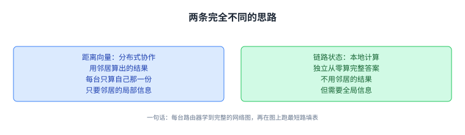
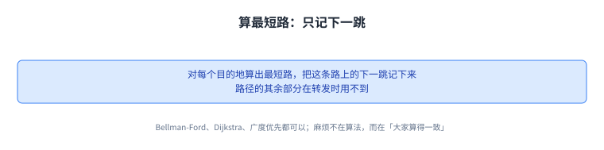
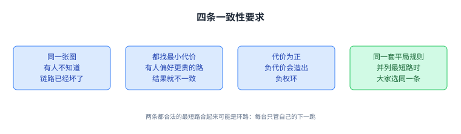
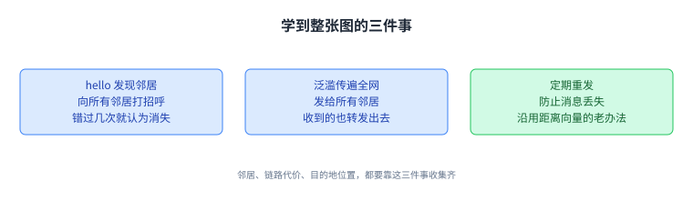
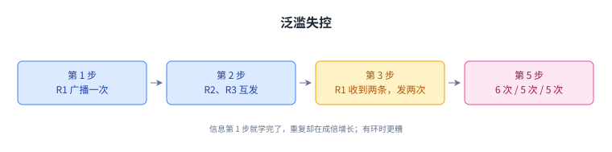
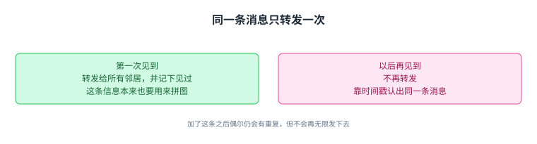
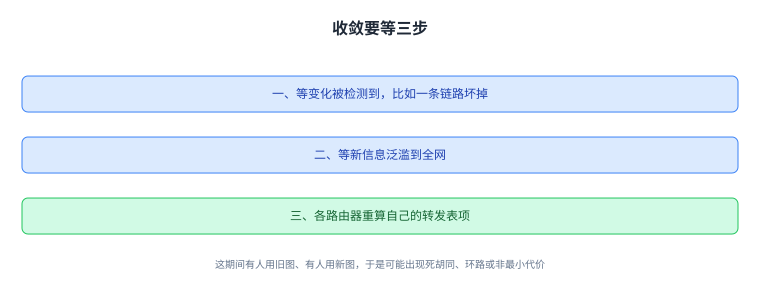
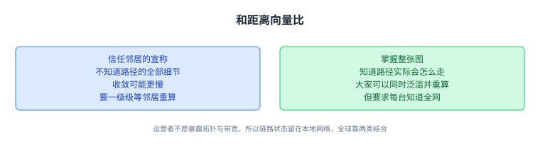

+++
title = "链路状态：每个人都拿到整张图"
lecture = 11
slug = "link-state-protocols"
status = "draft"
source_kind = "textbook"
source_url = "https://textbook.cs168.io/routing/link-state.html"
source_title = "Link-State Protocols"
output_mode = "explanation"
+++

> 来源课程：UC Berkeley CS168 Computer Networks（教材 CS 168 Textbook）；
> 对应内容：Routing 之 Link-State Protocols（<https://textbook.cs168.io/routing/link-state.html>）；
> 上游许可：教材站在站根页声明 CC BY-SA 4.0（第二人复核见 `docs/audit/license-cs168-second-review.md`）；
> 本文由 CourseLingo 原创撰写：**按该节的推进顺序**重新讲解，关键句给出英文原文与中译，**不逐句全译**，配图全部自绘、不转载原图；
> 本文非官方材料，CourseLingo 与 UC Berkeley 及课程教学团队无隶属关系；如与原文有出入，以原文为准。

## 一、换一条完全不同的思路

上一讲的距离向量让每台路由器只跟邻居交换消息。这一讲要解决的正是它的反面：如果让**每台[[term:router]]都拿到整张网络的图**，[[term:routing]]会变成什么样。这就是链路状态（link-state）这一类协议。

教材先把两类做法的分工说清楚。距离向量是分布式协作计算：每台节点根据邻居算出的结果，只算自己那一份，合起来才是完整答案，而且它只需要邻居给的局部信息，看不到整张图。链路状态正好相反。

> "By contrast, link-state protocols perform a local computation. Each node computes the full solution independently and from scratch, without using any computation results from neighbors. However, to do this, each node needs global information from all parts of the network."
> （链路状态做的是本地计算：每个节点独立地、从零开始算出完整答案，完全不用邻居的计算结果；但要做到这一点，它需要来自网络各处的全局信息。）

教材还给了一句话的概括。

> "Link-state protocols in one sentence: Every router learns the full network graph, and then runs shortest-paths on the graph to populate the forwarding table."
> （一句话概括：每台路由器学到完整的网络图，然后在图上跑最短路，据此把[[term:forwarding]]表填起来。）

这条路要分两步走：先学到整张图（每条[[term:link]]的状态、代价，以及每个目的地的位置），再在图上跑算法算出怎么把[[term:packet]]送到每个目的地。教材先讲第二步，再讲第一步。

链路状态[[term:protocol]]通常是域内协议，真实世界里两个主要的例子是 IS-IS（Intermediate System to Intermediate System）与 OSPF（Open Shortest Path First），今天都在广泛部署。

这句话值得记牢：链路状态把「分布式协作」换成了「每个人自己算一遍」。

## 二、第一步：有了全图，算最短路

有了全局视野，找路就变成一道熟悉的最短路径题：算出到每个目的地的最短路，然后把这条路上的下一跳记下来。后面的路径在转发时用不到。

> "Then, for each destination, the router records the next hop along the shortest path, just like in distance-vector protocols. The rest of the path is not needed during forwarding."
> （然后对每个目的地，路由器记下最短路上的下一跳，和距离向量协议一样；路径的其余部分在转发时并不需要。）

用什么算法都行：教材点名了 Bellman-Ford（串行版，不带距离向量那些改动）、Dijkstra，也提到广度优先搜索、或者可以并行跑的算法。算法可以换，但每台路由器必须算出一致的结果，麻烦就出在这里。

算法可以换，麻烦不在算法本身，而在「大家要算得一致」。

## 三、各自算各自的，会算出环路

教材给了一个很干净的坏例子：R3 算出的最短路让它把分组发给 R2，而 R2 算出的最短路让它把分组发给 R3。两条都是合法的最短路，合起来却是一个环路。

> "Both routers computed valid shortest paths, but their decisions resulted in a routing loop."
> （两台路由器算出的都是有效的最短路，可它们的决定合起来形成了环路。）

问题在于每台路由器只控制自己的下一跳，管不了别人怎么选。要让所有路由器的决定互相兼容，教材给出四条要求：所有路由器对拓扑有一致的认识（比如一条链路坏了，只有一台知道，那大家就是在不同的图上算路径）；都在找最小代价路径；所有代价为正（否则会出现负权环）；用同一套打破平局的规则（如果最短路唯一，前三条就够了；这一条是为了在并列最短路时大家选同一条）。

有意思的是，满足这四条之后，路由器们哪怕用不同的算法，也会算出相同的路径、给出兼容的决定；实践中为了省事，通常还是统一用同一种算法。

这四条合起来，是为了让各自算出的下一跳彼此兼容。

## 四、第二步：怎么学到整张图

回到第一步：路由器怎么知道整张网络图。教材把它拆成三件事：先弄清谁是自己的邻居（包括路由器与目的地），再把这些信息散布到全网，最后把收到的信息拼成一张图。

发现邻居靠问候消息（hello）：每台路由器向所有邻居发一句「你好，我是 R2」。R1 收到就知道自己连着 R2，R3 收到也知道自己连着 R2；R1 与 R3 互相并不相邻，所以彼此并不知道对方。

要知道链路什么时候断，就得定期重发问候：如果某个邻居不再打招呼（比如连续错过几次），就认为它消失了。邻居信息有了，接下来把它宣告给所有人：把宣告发给所有邻居，而且收到别人的宣告也要转发给所有邻居，这样每条消息都会传遍全网，这种办法叫泛滥（flooding）。信息一变（比如某个邻居消失），就再泛滥一次。

消息还会丢，所以沿用距离向量里的老办法：定期重发，只要链路还能用，重发足够多次总能送到。

三件事做完，每台路由器手里才有一张完整的图。

## 五、泛滥会自己转起来

泛滥有一个必须当心的地方。R2 把某条消息告诉 R3，R3 收到后又告诉 R2，R2 再告诉 R3，两台路由器就这样互相发个不停，明明没有任何新信息。

> "Note that this is not the same as periodically re-sending messages for reliability. For reliability, we might re-send a message once every 5 seconds. In this infinite loop, the routers are receiving and re-sending duplicate announcements at maximum rate (e.g. millions of times per second)."
> （注意这和为了可靠而定期重发不是一回事：为了可靠，我们可能每 5 秒重发一次；而这个无限循环里，路由器以最高速率反复接收并转发重复的宣告，比如每秒几百万次。）

如果网络里有环，情况更糟。教材把时间一步步展开：第 1 步 R1 广播给 R2、R3；第 2 步 R2、R3 各自广播；第 3 步 R1 收到两条消息，就发出两次广播；到第 5 步，三台路由器分别发出 6 次、5 次、5 次广播。信息其实在第 1 步就学完了，可重复消息成倍增长，最终会把网络压垮。

关键区别：这是以最高速率反复转发，而不是每隔几秒重发一次。

## 六、解法：同一条消息只转发一次

修法很直接：**不要重复转发同一条信息**。第一次看到某条消息，就把它转发给所有邻居，并记下「这条我见过了」；以后再看到同样的消息，就不再转发。

为了让路由器能认出「同一条消息」，教材给消息加一个时间戳，或者任何对每条消息唯一的计数。

对照上面的时间线：第 1 步 R1 广播；第 2 步 R2、R3 各自广播；到第 3 步，三台路由器都已经见过这条消息，于是都不再发，重复消息就此止住。教材也诚实地说，加了这条之后偶尔还会有重复消息，但不会再无限发下去。

第一次转发并记下、之后不再转发，重复消息就此止住。

## 七、收敛：收敛过程中可能正处于无效状态

链路状态会在每台路由器学到完整拓扑、并据此算好转发表之后，收敛到一份有效的最小代价路由状态。它依赖一件事：每台节点用的是同一张图。收敛之后，只要拓扑不变，这份路由状态就一直有效。

拓扑一变就没那么快了。要先等变化被检测到（比如链路坏掉），再等信息传遍全网，然后各路由器重算表项。在这段时间里，路由状态可能是无效的。

> "While the network is converging, we might be in an invalid routing state, because some routers are using the old graph, while others are using the updated graph. The routing state could have dead-ends, loops, or paths that are not least-cost."
> （在收敛期间，我们可能处在一份无效的路由状态里：有些路由器还在用旧图，有些已经用了新图，于是可能出现死胡同、环路，或者并非最小代价的路径。）

教材的例子很贴：R3-A 的链路坏了，R3 知道、别人还不知道；R3 于是把分组发给 R1，而 R1 还在把分组发给 R3。教材还提醒，链路状态协议的复杂度大多藏在这些细节里，想收敛更快、少出现无效状态，就得在细节上做优化。

所以「收敛中」这段时间，是链路状态协议最脆弱的窗口。

## 八、和距离向量比：各自的优劣

教材最后把两类做法摆在一起比。

第一，你信邻居的话，还是自己看全图。距离向量里，收到宣告时我们并不清楚这条路径的全部细节，只能相信邻居宣称的东西；链路状态里我们知道整张图的拓扑，于是对分组实际会走的路径知道得更多。

第二，收敛的快慢。按实现不同，距离向量可能更慢：网络一变，得等邻居重算并重新宣告，我们才能更新自己的表；然后我们的邻居又要等我们，如此一级级往外。链路状态里，所有人都可以迅速泛滥新信息、同时重算。

第三，也是决定性的：[[term:scalability]]。链路状态适合小的本地网络，却**不适合全球[[term:internet]]**，因为它要求每台路由器都了解整个网络。

> "On the global Internet, operators might not want to reveal their network topology (e.g. where their routers are located, the bandwidth of their links) to competitors."
> （在全球互联网上，运营者可能并不愿意向竞争对手暴露自己的网络拓扑，比如路由器在哪里、链路的[[term:bandwidth]]是多少。）

所以实践中，大多数网络把距离向量与链路状态结合起来用。

这条取舍解释了为什么全球互联网没有只用链路状态。

## 九、脉络回顾

这一讲换了思路：不再让路由器互相交换「我到某地多远」，而是让每台路由器都学会整张图，然后在图上自己跑最短路、只记下一跳。教材把这条路拆成两步：先算路径，再学拓扑。

算路径这一步看似简单，但每台路由器只控制自己的下一跳，所以必须满足四条一致性要求（同一张图、都找最小代价、代价为正、同一套打破平局规则），否则两台都合法的最短路合起来就是环路。学拓扑靠三件事：hello 发现邻居、泛滥把信息传遍全网、定期重发防丢包。泛滥必须先解决「同一条消息被反复转发」的问题，办法是只转发第一次见到的消息，并用时间戳区分。收敛需要所有人用同一张图，收敛期间可能短暂处于无效状态。最后，链路状态能掌握全图、收敛更快，但要每台知道全网、运营者又不愿暴露拓扑，所以它留在了本地网络里，全球范围靠两类协议结合。

下一讲从「算路径」这一步往深里走，看路由器具体用什么算法算出最短路。

## 读完应该能回答

1. 距离向量的「分布式协作计算」与链路状态的「本地计算」差别在哪，后者为什么需要全局信息。
2. 四条一致性要求分别防住什么，为什么满足它们之后用不同算法也能算出相同路径。
3. 泛滥为什么会自我循环，加时间戳为什么能止住它，以及收敛期间为什么可能出现无效状态。

## 溯源

- 对应：UC Berkeley CS168 Computer Networks，教材 Routing 之 Link-State Protocols（<https://textbook.cs168.io/routing/link-state.html>）
- 教材：CS 168 Textbook（UC Berkeley CS168 课程教材），原文链接同上
- 授权依据：教材站在站根页声明 CC BY-SA 4.0；本文为本仓库原创中文讲解，按该节顺序重讲，关键句给出英文原文与中译，**未逐句全译**，配图自绘
- 结构说明：本讲章节顺序**跟随教材该节的推进顺序**（链路状态简介 → 总览 → 算路径 → 四条一致性要求 → 学拓扑 → 泛滥与失控 → 收敛 → 与距离向量对比）；教材把「四条一致性要求」写在「算路径」一节里，我们把它单列一节以便配图
- 我们的归纳（源文没有明说）：把两类协议的分工收成一句「一个靠信任邻居的宣称，一个靠掌握全图」；把「学会整张图」拆成 hello、泛滥、定期重发三件事来叙述