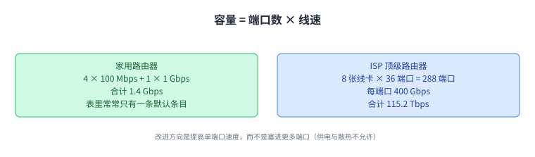
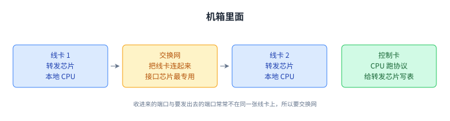

+++
title = "路由器硬件：一台为转发而生的计算机"
lecture = 13
slug = "router-hardware"
status = "draft"
source_kind = "textbook"
source_url = "https://textbook.cs168.io/routing/router.html"
source_title = "Router Hardware"
output_mode = "explanation"
+++

> 来源课程：UC Berkeley CS168 Computer Networks（教材 CS 168 Textbook）；
> 对应内容：Routing 之 Router Hardware（<https://textbook.cs168.io/routing/router.html>）；
> 上游许可：教材站在站根页声明 CC BY-SA 4.0（第二人复核见 `docs/audit/license-cs168-second-review.md`）；
> 本文由 CourseLingo 原创撰写：**按该节的推进顺序**重新讲解，关键句给出英文原文与中译，**不逐句全译**，配图全部自绘、不转载原图；
> 本文非官方材料，CourseLingo 与 UC Berkeley 及课程教学团队无隶属关系；如与原文有出入，以原文为准。

## 一、路由器到底在做什么

前面几讲把路由器画成图上的一个方框。这一讲要解决的是方框里面到底装了什么，以及**[[term:routing]]（routing，路由）**与转发为什么必须是那个样子。

先回到职责本身：路由器跑某种路由[[term:protocol]]（protocol，协议）把转发表填起来；[[term:packet]]（packet，分组）进来之后，它看目的 [[term:ip-address]]（IP address，IP 地址），用转发表在表里挑一条[[term:link]]（link，链路）把分组送出去。这里要记得上一讲留下的一个事实，表项里可以有地址范围，不只是一个具体的地址。

现实中，[[term:router]]（router，路由器）就是一台专门为路由与转发任务优化过的计算机。教材在这一节先立下这个说法，后面几节就一层层把这台计算机拆开看。

职责少不等于结构简单：正因为这件事每秒要做几十亿次，它才被做成了后面的样子。

## 二、路由器都在哪里

家用与办公环境里都有小路由器，把主机接进[[term:internet]]（Internet，互联网）。那这些路由器彼此在哪里碰头？

教材的答案是托管机房或运营商酒店（colocation facility / carrier hotel）：一栋专门设计过供电与散热的楼，多家 [[term:isp]]（ISP，互联网服务提供商）把自己路由器装进去，与楼里其他路由器互联。机房内部，路由器被叠进机架，机架大约 6 到 7 英尺高、19 英寸宽。

这里的每个细节都不是装饰：专用楼保证供电散热，机架尺寸决定了设备能有多大，而设备多大又反过来限制了它能装下多少端口。

## 三、尺寸与容量

路由器大小差别极大。家用路由器只服务几个用户，转发表里通常只有一条默认条目；工业级路由器可能要转发成千上万客户的数据，表的规模也大得多。

衡量大小有几种办法：物理尺寸、物理端口数量、[[term:bandwidth]]（bandwidth，带宽）。容量可以算成端口数乘以每个端口的带宽，而一个物理端口的速度常被称为它的线速（line rate）。端口之间不必同速：一台现代家用路由器可能有 4 个 100 Mbps 端口加 1 个 1 Gbps 端口，总容量 1.4 Gbps。

教材接着给了一个 ISP 用的当代顶级路由器：每个物理端口线速可达 400 Gbps，机内有 8 张可插拔线卡，每张 36 个端口，共 288 个端口，于是总容量是 288 × 400 Gbps = 115.2 Tbps，价格可能超过一百万美元。做成线卡的好处是：容量不够时再插一张就行。教材还提到未来的端口会是 800 Gbps，而且由于物理空间受限（塞更多端口还受供电与散热限制），改进方向是提升单个端口的速度，而不是增加端口数。

容量增长也有一段历史：2010 年顶级路由器是 1.7 Tbps，十年后涨了约 100 倍，而其中大部分来自链路速度从 10 Gbps 到 2016 年前后的 100 Gbps、再到今天的 400 Gbps。这些提升正在放缓，摩尔定律变慢，高速发送信号也有物理上的难处，所以下一步到 800 Gbps 只是 2 倍，而之前几步分别是 10 倍与 4 倍。

## 四、三个平面：数据、控制、管理

路由器的软硬件可以拆成三个平面，教材对每一个都给了职责与时间尺度。

**数据平面**负责转发分组：每来一个分组都要用一次，而且是局部运行的，不需要与其他路由器协调。**控制平面**负责与其他路由器通信、运行路由协议，它算出来的结果（比如转发表）供数据平面使用；它只在网络拓扑变化时（加链路、断链路）才忙起来。

因为两者的时间尺度与所跑的协议都不同，硬件与软件被分别优化：分组到达远比拓扑变化频繁，所以数据平面被优化成「把极简单的任务（查表与转发）做得极快」，控制平面则被优化去处理更复杂的任务（重新算路径）。

**管理平面**用来告诉路由器做什么、以及看它在做什么：运营者在这里配置功能（每条链路给多少代价、跑哪个协议，都得人工决定），也在这里监控（每条链路的流量、有没有硬件坏掉）。它也是运营者从设备外部接入路由器的主要入口。三个平面的时间尺度差别很大：数据平面在纳秒级、控制平面在秒级、管理平面在几十到几百秒级，因为配置要经过校验与处理才会生效。运营者用来与路由器交互的软件叫网络管理系统（NMS）：它计算出配置并下发，也用来读取遥测数据（统计与运行状态）。

最后教材强调三个平面缺一不可：只有数据平面而没有控制平面，我们能把分组转发出去，却不知道往哪里转。

## 五、内部结构：机箱、线卡、交换网、控制卡

工业级路由器的物理外壳叫机箱（chassis）；里面插很多线卡，每张线卡上有若干物理端口，每个端口既可作输入也可作输出。

一个关键约束是：任意端口都可能要把分组送到任意其他端口，你可能从一个端口收进来，却要从另一张线卡上的端口发出去。把每个端口都与其他端口直接连线显然太低效，于是教材说机内有一张交换网（fabric）把线卡连起来，每张线卡还有专门与交换网对接的芯片。除了线卡，还有一张控制卡，带自己的 CPU，负责与其他路由器通信、跑路由协议；算出路径之后，它把正确的转发表项写进转发芯片。

每张线卡也有自己的本地 CPU 来管本卡事务（比如填表），还有做基础分组的硬件（比如发送前把 TTL 减一），以及一块或多块专为转发优化的芯片。按平面归类的话：数据平面由线卡上的转发芯片、连接线卡的交换网、以及线卡到交换网的接口芯片支撑；控制平面与管理平面由控制卡支撑。

教材还给了一个具体的机型：6 个插槽，其中 4 个插线卡、2 个插控制卡，另有一个风扇托盘散热，连接线卡的交换网在后面（图上没画）。

## 六、三种分组

教材把进来的流量分三类，它们的处理路径不同。

最常见的是用户分组：承载端主机的数据。[[term:forwarding]]（forwarding，转发）芯片先读首部里的目的地址字段，查出该用哪个端口；如果那个端口在另一张线卡上，分组就经交换网送到那张线卡，再从对应端口发出去。

第二类是控制平面流量：目的地就是路由器自己，比如路由协议发来的宣告。转发芯片会把它往上送给控制卡，由控制卡的 CPU 处理。

第三类是punt 流量：它们本身是用户分组，但需要额外的特殊处理。比如收到 TTL 为 1 的分组，说明它已经过期、不该再转发，也可能还要回一条错误消息给发送方。这种分组会被转发芯片「踢」（punt）给控制卡专门处理。

三类合起来解释了一件事：绝大多数分组走的是同一条又快又简单的路，而需要「想一想」的分组被集中送到控制卡，代价是慢。

## 七、为什么不用通用 CPU：先算一下规模

既然都是计算机，为什么不干脆用通用 CPU 跑软件？教材用算术回答了这个问题。以 400 Gbps 的端口、64 字节的分组估算，每个端口每秒要处理 7.81 亿个分组；乘以 36 个端口，整台路由器每秒要处理 560 亿个分组（分组大一些时数字会略低）。

作为对照：如果写一个转发程序在 CPU 上跑，能做到每 10 微秒处理一个分组就已经很了不起；而顶级路由器需要大约每 10 纳秒处理一个，相差三个数量级。所以路由器功能必须直接做在硬件上。

拆成数据平面线卡与控制平面控制卡，就得到一快一慢两条路：**快路径**只涉及转发硬件，为极高速转发而优化；**慢路径**用控制 CPU，只在必要时才走，绝大多数分组走快路径。专用部件让路由器整体更高效：更省电、更便宜、占更小的地方。

也就是说，前面那些「为什么要拆成这么多部件」的疑问，答案不在设计风格上，而在数量级上。

## 八、线卡要做的四件事

线卡收到分组后要依次做几件事，而且都压在纳秒级里。

第一件，把信号（光、电）解码成一串 0 和 1，这部分叫 PHY，对应第一层（[[term:physical-layer]]，physical layer）。第二件，读出这些比特并解析（比如找出哪些比特是 IP 首部），还可能要做其他链路层操作（例如一条链路上挂了两台以上机器时），这部分叫 MAC，对应第二层（[[term:link-layer]]，link layer）。第三件，解析 IP 分组本身：判断是 IPv4 还是 IPv6，读出目的地址，做转发表查找（或者发现这个分组需要 punt）。第四件，更新首部字段：把 TTL 减一，因为改了首部所以还要更新校验和，可能还要处理 options 与分片（教材说这两项会在 IP 首部那一节细讲）。

教材算了一下时间压力：这些操作都得在几纳秒内完成，哪怕全部在一个时钟周期里做完，线卡也得跑到 0.2 GHz；而实际上不可能一个周期做完，而且一块转发芯片要同时服务这张线卡上的所有端口。所以转发芯片被做成只干少数几件事的专用硬件，你没法在它上面跑通用程序。遇到它支持不了的功能，就把分组 punt 给控制卡的通用 CPU。简单操作（如 TTL 减一）容易用硬件实现；复杂操作（如特殊选项）通常要 punt。而在现代互联网里，大家尽量避免特殊选项，就是为了始终留在快路径上，否则控制卡会被压垮。交换网的接口芯片同样专用，而且往往是整台路由器里最专用、性能最高的芯片。

顺带记一条原文的空缺：教材的「Packet Queuing（包排队）」一节目前只写了一行 `TODO`，正文尚未写成；我们照实说明它空缺，不代教材补内容。

## 九、查表为什么难：范围不能展开

前面已经知道，查表要以极高的速率进行。难点在于表项里既有单个 IP 地址，也有地址范围（如 `192.0.1.0/24`），而且范围之间可能重叠，一个目的地可能同时匹配多条。

最理想的情况是表里「一个目的地一条、没有范围」，那么拿目的地址做精确匹配就能得到下一跳。教材顺着这个想法试了一下：把每个范围展开成单个地址，比如 `192.0.1.0/24` 展开成 256 条。教材随即否掉它：这太浪费空间（别忘了这是在硬件里做的），而且一条路由变化就要改掉大量条目。

于是只能与范围共处，用上一讲的长前缀匹配：多条匹配时取前缀最具体的那条；一条都不匹配时取默认路由；连默认路由都没有，就丢弃这个分组。

教材还给了一次逐位扫描的例子：转发表里有四行范围，目的地址与它们逐位比对，前 21 位四行都匹配，所以四行都还在；第 22 位是 1，第一行这一位是 0，被淘汰；第 23 位也是 1，第二、三行这一位是 0，也被淘汰；第四行是 23 位前缀且 23 位全部匹配，于是被确认。

教材在这里反问了一句：如果朴素地做，每一位都要与表里每一条比对，运行时间会随表项数增长，能不能做得更好？

原文的一处自相矛盾（照录）：这一节原文写「默认路由（`.`，`0.0.0.0/32`，匹配所有目的地）」，而上一讲同一本教材写的是「默认路由 `.` 可以写成 `0.0.0.0/0`」。两处不一致；按前缀长度的定义，通配符应当是 0 位前缀，即 `0.0.0.0/0`。我们照录原写法并在此说明，供平台判据留存。

## 十、用 Trie 做高效查找

教材的答案是数据结构课里的 Trie（前缀树）：它把「键是字符串（这里是比特串）」的映射存成一棵按字符逐层展开的树，从而高效支持最长前缀匹配。

先看一个存单词到数字的 Trie：要找最长前缀，就一个字母一个字母地读，沿着树从根走到叶；沿途找出表里存在的那些前缀（图上有颜色的节点），取最长的那个。

转发表可以照搬这个做法：Trie 的每一层代表地址里的一位，第零层是根（空串），第一层代表第一位，第二层代表第二位，依此类推。每个节点代表一个前缀，比如 2 位前缀 `11*` 在第二层，3 位前缀 `100` 在第三层；如果某个前缀在转发表里，就在对应节点写上下一跳，不在就什么都不写（图里画成白色）。教材说这个 Trie 里包含所有可能的 3 位前缀。

关键在于沿树下走是常数时间：目的地址多少位就走多少个节点，而 IP 地址永远是 32 位（常数）。哪怕转发表有几百万条，我们也不过是挑出 32 个节点。 如果范围不重叠，每个有效前缀都对应一个叶节点；如果有重叠，非叶节点也可能是有效前缀。走的过程中如果掉出树外，就提前停下，在走过的节点里取最长的那个前缀。

教材还给了一个小优化：边走边记下「到目前为止见过的最长前缀匹配」，它总是最近一次匹配，因为越往下走前缀越长；掉出树外时就用它。

最后，默认路由存在根节点（0 位前缀）里，而这个「一路往下走」的算法恰好保证了只有在其他前缀都不匹配时才会用到它。教材在结尾也说明：所有路由器都实现了某种形式的最长前缀匹配，只是有的用了更高级的方案，比如按现实互联网的假设加启发式与优化（某些目的地更热门，可以查得更快；某些端口承载更多范围；现代互联网对前缀长度也有一些约定，例如通往其他网络的 IPv4 路由最长是 24 位），还可以针对「更新转发表」做优化。

## 十一、脉络回顾

这一讲把「图上的一个方框」拆成了真实设备：它是一台专门为路由与转发优化的计算机。它装在托管机房里、叠进机架；容量按端口数乘线速算，家用 1.4 Gbps、顶级 115.2 Tbps，而增长正在放缓。

内部按三个平面理解：数据平面每来一个分组就用一次、局部且纳秒级；控制平面只在拓扑变化时忙、秒级；管理平面给运营者配置与监控、几十秒级，运营者通过 NMS 与它交互。硬件上分为机箱、线卡、连接线卡的交换网与控制卡：转发芯片只干少数几件事，遇到支持不了的就 punt 给控制卡。之所以非得分专用硬件，是因为规模相差三个数量级，软件每 10 微秒一个，硬件要每 10 纳秒一个。线卡做的事是 PHY、MAC、解析与查表、改首部，全部压在纳秒里。最后是查表本身：范围不能展开，只能做最长前缀匹配，而 Trie 让这件事变成常数时间。

下一讲走出单个路由器，看域间路由：自治系统与 BGP。

## 读完应该能回答

1. 三个平面各负责什么、时间尺度差多少，为什么它们要分开优化。
2. 机箱里有哪些部件，为什么需要交换网，转发芯片与控制卡的分工是什么。
3. 为什么路由器不用通用 CPU 跑软件；punt 是什么，以及为什么要尽量避免它。
4. 为什么地址范围不能展开成单条，Trie 凭什么把查表做成常数时间。

## 溯源

- 对应：UC Berkeley CS168 Computer Networks，教材 Routing 之 Router Hardware（<https://textbook.cs168.io/routing/router.html>）
- 教材：CS 168 Textbook（UC Berkeley CS168 课程教材），原文链接同上
- 授权依据：教材站在站根页声明 CC BY-SA 4.0；本文为本仓库原创中文讲解，按该节顺序重讲，关键句给出英文原文与中译，**未逐句全译**，配图自绘
- 结构说明：本讲章节顺序**跟随教材该节的推进顺序**（路由器做什么 → 在哪里 → 尺寸容量 → 三个平面 → 内部结构 → 三种分组 → 规模算术 → 线卡功能 → 查表 → Trie）；教材「Packet Queuing」一节原文只有一行 `TODO`，我们把它并入「线卡要做的四件事」末尾照实说明，不另立空节
- 照录：原文在「查表」一节把默认路由写成 `0.0.0.0/32`，与上一讲「Addressing」里的 `0.0.0.0/0` 不一致；按 0 位前缀的定义应为 `/0`；我们照录原写法并在正文就地说明
- 我们的归纳（源文没有明说）：把「容量 = 端口数 × 线速」与「改进方向是提高单端口速度而非加端口」并成一句结论；把「三个平面缺一不可」放在本节收尾