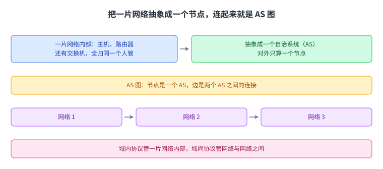
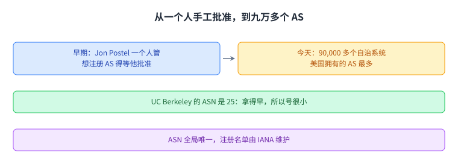
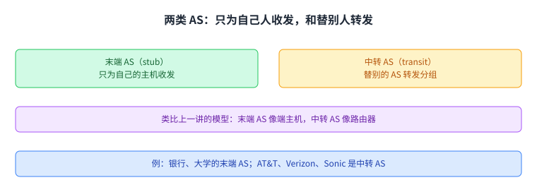
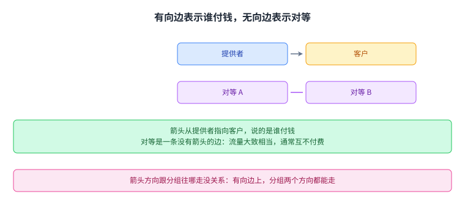
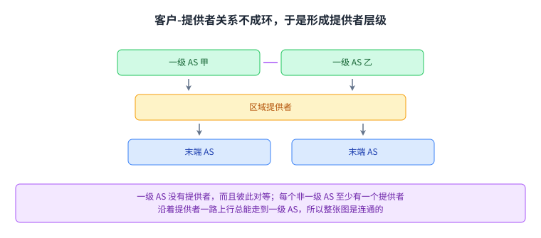
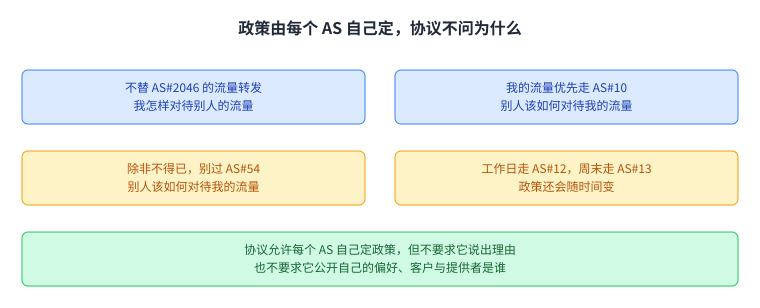
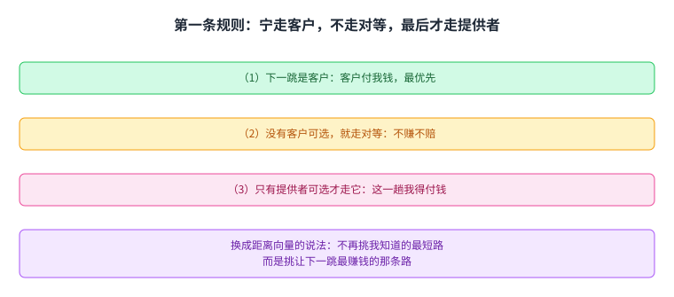
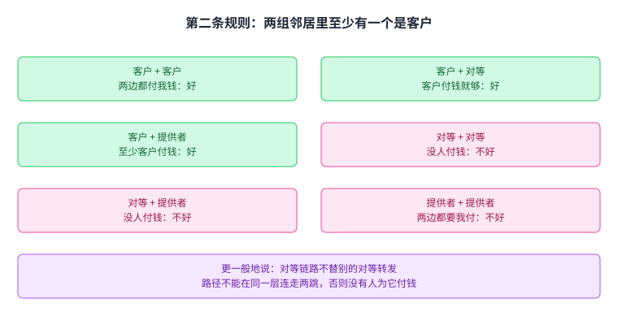
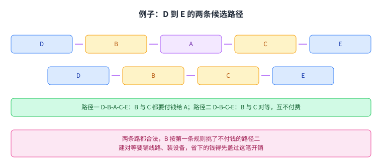
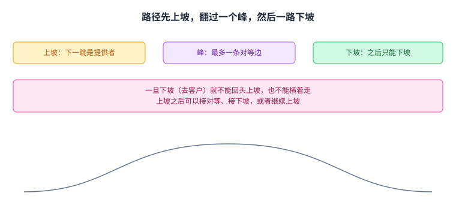

+++
title = "域间路由的模型：把网络之网画成一张 AS 图"
lecture = 14
slug = "model-for-inter-domain-routing"
status = "draft"
source_kind = "textbook"
source_url = "https://textbook.cs168.io/routing/autonomous-systems.html"
source_title = "Model for Inter-Domain Routing"
output_mode = "explanation"
+++

> 来源课程：UC Berkeley CS168 Computer Networks（教材 CS 168 Textbook）；
> 对应内容：Routing 之 Model for Inter-Domain Routing（<https://textbook.cs168.io/routing/autonomous-systems.html>）；
> 上游许可：教材站在站根页声明 CC BY-SA 4.0（第二人复核见 `docs/audit/license-cs168-second-review.md`）；
> 本文由 CourseLingo 原创撰写：**按该节的推进顺序**重新讲解，关键句给出英文原文与中译，**不逐句全译**，配图全部自绘、不转载原图；
> 本文非官方材料，CourseLingo 与 UC Berkeley 及课程教学团队无隶属关系；如与原文有出入，以原文为准。

## 一、域内已经解决，域间要的是一个模型

前面几讲把域内路由讲完了：距离向量与链路状态协议（比如 OSPF、IS-IS）都能在一片本地网络内部，把分组送到任何一台主机。而互联网是网络之网，分组要跨越的是网络与网络之间那一段——那一段上跑的就是 BGP。

> "Recall from earlier that routing is performed in a network of networks. We've seen distance-vector and link-state protocols that can be used to implement intra-domain routing, which allows packets to be sent within a local network."
> （回顾一下：路由是在网络之网里进行的。我们已经见过距离向量与链路状态协议，它们能做域内路由，让分组在一片本地网络内送达。）

教材把这件事分成两个词：**域内**（intra-domain）说的是网络内部，**域间**（inter-domain）说的是网络与网络之间。这一讲要解决的就是后者，而解决之前先得有个模型，能把「一片网络」和「网络之间怎么连」说清楚。

> "In this section, we'll build a model that will allow us to define inter-domain routing protocols, which can send packets between different local networks."
> （这一节要建一个模型，用来定义域间路由[[term:protocol]]；这些协议把分组送到不同的本地网络之间。）

模型的第一步，是给「一片网络」一个正式名字：[[term:autonomous-system]]，也就是由一个运营者统一管理的一片或多片本地网络。Google 就是一个例子：员工电脑在一张本地网络里，数据中心在另一张本地网络里，但两张都归同一家公司控制，只部署一套域内协议就够。

第二步是抽象：把 AS 内部的路由器与主机统统藏起来，把整个 AS 当成一个实体。

> "we can abstract away all of the individual routers and hosts within the AS, and treat the AS as a single entity"
> （我们可以把 AS 内部那一台台路由器和主机抽象掉，把整个 AS 当成一个实体。）

抽象之后画出来的图，节点是一个 AS，边是两个 AS 之间的连接。教材给了它两个名字：域间拓扑（inter-domain topology），或者 **AS 图**（AS graph）。[[term:routing]]这件事在这里也被切成两半：域内协议在节点内部找路，域间协议在节点之间找路，算出来的是通往目的 [[term:ip-address]]前缀的下一跳。

这张图是这一讲的骨架，后面所有讨论都发生在它上面。

## 二、ASN 与九万多个自治系统

要成为 AS 得先注册。现实里有一家叫 IANA（Internet Assigned Numbers Authority）的机构，维护着全球 AS 的名单；注册之后会拿到一个全局唯一的编号，叫[[term:asn]]（autonomous system number，自治系统编号）。

教材讲了一段历史：早年 IANA 由一个人手工管理，这个人是 Jon Postel；世界上任何人想注册一个新的 AS，都得先过他那关。今天这份名单上有九万多个自治系统，其中美国拥有的 AS 最多。

> "Today, there are over 90,000 autonomous systems, with the United States having the most ASes of any country."
> （今天有超过 90,000 个自治系统，其中美国拥有的 AS 数量是所有国家里最多的。）

教材还顺手给了 UC Berkeley 的例子：它的 ASN 是 25，在这么多 ASN 里显得特别小，因为学校在上世纪 80 年代就拿到了，那时候互联网才刚起步。

编号的大小正好是一把尺子：号越小，说明注册得越早。

## 三、两类 AS：只为自己人收发，和替别人转发

域内模型里我们分过端主机与路由器。域间模型做类似的事：把 AS 分成两类。

[[term:stub-autonomous-system]]（stub AS，末端自治系统）只为本地网络里的主机提供连通性。它只替 AS 内部的主机收发[[term:packet]]，不替别的 AS 转发。

> "A stub AS only sends and receives packets on behalf of hosts that are inside the AS, and does not forward packets between different ASes."
> （末端 AS 只替 AS 内部的主机收发分组，不在不同的 AS 之间转发分组。）

现实里的例子，是那些不做互联网生意的机构：只给员工上网的银行，只给师生上网的大学，UC Berkeley 也算。它们不负责承载别家的流量，世界上绝大多数 AS 都是末端 AS。

另一类是[[term:transit-autonomous-system]]（transit AS，中转自治系统）：它替别的 AS 转发分组，可以在两个不同的 AS 之间把分组带过去。这类对应的就是靠卖连通性赚钱的公司，教材点名的是 AT&T 和 Verizon，还举了一家只服务加州的 [[term:isp]]：Sonic。

这个分法和前面域内路由的模型对得上：末端 AS 相当于[[term:end-host]]，中转 AS 相当于[[term:router]]。教材也留了一个边界情况：Google、Microsoft、Amazon 这类公司手里的 AS，承载量与中转 AS 一样大甚至更大，但它们的主要角色是给自家服务收发流量，按定义更像末端 AS；近几年它们也开始替别家承载流量，于是又可以被算成中转 AS。

分类只是模型，真实世界的边界没有那么干脆。

## 四、图上的边由商业关系决定

AS 图里的边不是随便连的。两家现实中的组织之所以同意交换流量，是因为中间有商业关系。教材说，一对 AS 之间的关系只有两种可能。

第一种是[[term:customer-provider-relationship]]。客户出钱，提供者提供连通性。那家本地银行是客户，它付钱给 Verizon，换来上网的能力。

第二种是[[term:peering]]。两个对等的 AS 互相送的流量大致相当。现实中它们会签一份法律合同，通常约定：只要两个方向上的流量大致均衡，就不互相付钱。

关系画进图里是这样的：箭头从提供者指向客户，对等则是一条没有箭头的边。所以一张 AS 图里可以同时有带箭头的边和不带箭头的边。于是末端 AS 在图上只剩入边，别人给它连通性，它不替别人提供连通性；中转 AS 则是提供者，出边的箭头表示它在卖连通性。

这里有一个很容易搞混的点，教材专门说了：箭头的方向说的是谁付钱，不是分组往哪走。就算是一条有向边，分组也能两个方向都走，客户付的正是「能往[[term:internet]]其它地方收发分组」这件事。

> "Note that the direction of the arrow does not tell us anything about what direction the packets are being sent."
> （注意，箭头的方向并不能告诉我们分组在往哪个方向送。）

把这条记住，后面看路径时就不会把付费方向和分组方向搞反。

## 五、不成环，于是有了提供者层级与一级 AS

客户-提供者关系有一个很强的性质：把这些有向边单独拿出来看，它们构成一张**无环图**。

无环是必然的，教材用钱来解释。如果 A 付钱给 B、B 付钱给 C、C 又付钱给 A，那钱就绕回了自己手里；换成连通性也一样，等于 A 给 C 提供服务、C 给 B 提供服务、B 又给 A 提供服务，没人会给自己提供服务。

> "In real life, a cycle would mean that A pays B, B pays C, and then C pays A, and it doesn't make sense for money to flow from somebody back to themselves."
> （现实中成环意味着 A 付钱给 B、B 付钱给 C、C 付钱给 A；钱绕一圈回到自己手里，这说不通。）

教材还给了一个学费的类比：你交学费给 UC Berkeley，学校交钱给 UC 系统，系统再把钱交给你，这笔生意没人看得懂。

无环有一个直接后果：可以按提供者排出**层级**，让所有箭头都朝下。末端 AS 在最底下，提供者在最上面；服务从高处往低处流，钱从低处往高处付。层级的顶端是[[term:tier-1]]（Tier 1 AS，一级 AS）：它们没有提供者，也就是没有入边，而且彼此之间两两对等。

由此还能推出两件事。第一，任何一个非一级 AS 都至少有一个提供者，现实中你总得付钱给谁才能上网。第二，从任何一个 AS 出发，沿着提供者一路上行，最后总能走到某个一级 AS；正因为所有一级 AS 彼此对等，整张 AS 图才是连通的，而不是断成两张互不相通的网。现实里一级 AS 大约有 20 个，它们的基础设施常常横跨几个大洲，比如海底光缆。

教材还补了一句：层级长成这样，是现实中的商业与政治动机决定的。理论上可以画成一棵树，只有唯一一个一级 AS 在根上给全世界提供服务；但那样全世界的上网入口就握在一个实体手里，政治上很难接受。

无环不是几何上的巧合，而是「钱不能绕回自己」这条商业常识的直接后果。

## 六、政策：每个 AS 自己定，协议不逼你说出口

域内的目标是找到又有效又好的路：有效指没有环路、没有死胡同，好指代价最小。域间依然要求有效，但「好」得重新定义。

原因在于，每个 AS 都有自己的商业目标和商业关系，彼此情况不同。域内模型里，一台路由器和另一台路由器没有本质区别；域间模型里，一个 AS 和另一个 AS 差别很大。于是协议的做法是：让每个 AS 自己定[[term:policy-based-routing]]，协议算出来的路径要尊重这些政策。教材举了四条政策例子。

- 「我不想让 AS#2046 的流量穿我的网。」说的是我怎样对待别人的流量。
- 「我的流量，我希望由 AS#10 来带，而不是 AS#4。」说的是别人该如何对待我的流量。
- 「除非实在不得已，别让我的流量走 AS#54。」
- 「工作日我希望走 AS#12，周末走 AS#13。」政策还会随时间变。

协议不关心你为什么这么定：你可以因为对方是竞争对手而拒绝承载它的流量，协议不需要知道这个理由。这和前面几讲的最小代价路由是两回事。那是一个全局最小化问题，所有路由器在解同一道题；而基于政策的路由里，每个 AS 只关心自己的政策，没有一个大家合作求解的全局问题。

> "Least-cost was a global minimization problem, where every router was trying to solve the same problem."
> （最小代价是一个全局最小化问题，每台[[term:router]]都在解同一道题。）

政策这件事还有另一面，教材放在末尾讲：AS 想要**自主**（autonomy），也就是自己随便定政策，不用跟别人协调，也不用担心协议允不允许；AS 也想要**隐私**（privacy），不愿意把自己的偏好和关系明确告诉别人。比如一个 AS 不应该需要告诉所有人，自己的哪些邻居是客户、哪些是提供者、哪些是对等。

> "As a company, you might not want to reveal information about your customers and providers to your rivals."
> （作为一家公司，你可能并不想让竞争对手知道你的客户和提供者是谁。）

教材也承认隐私只能做到这个程度：为了就路径达成一致，AS 之间总得交换一些信息，泄漏在所难免。现实里也确实有反向推断的技术，比如用 traceroute 这类工具就能看出分组实际走的是哪条路。协议不该做的，是逼一个 AS 说出「我更偏好这条路径」，或者逼它公开自己的客户、提供者与对等方。

协议把决定权留给 AS，同时也不去追问理由。

## 七、Gao-Rexford 第一条规则：优先最赚钱的下一跳

协议允许任意政策，但现实中大多数 AS 的定法有章可循，教材把它们叫做 Gao-Rexford 规则。这套约定建立在一个假设上：现实中的组织喜欢赚钱，不喜欢赔钱。教材说有两条大规则，第一条管的是**我怎么选路**。

如果有多条路可选，就优先转发给最赚钱的下一跳。顺序是：下一跳是客户的路最好；没有客户可选，就选下一跳是对等的路；只有在没有更好选择时，才会选下一跳是提供者的路。

> "the AS prefers a route with a next hop that is a customer. If there are no such routes, the AS prefers a route with a next hop that is a peer."
> （这个 AS 优先选下一跳是客户的路；如果这样的路一条都没有，它就优先选下一跳是对等的路。）

教材还补了后半句：只有被迫的时候，也就是一条更好的路都没有的时候，它才会选下一跳是提供者的路。随后教材把它和距离向量做了对照：这是带偏好版本的最短路选择。不再是挑我知道的最短的路，而是挑让下一跳最赚钱的那条，客户最好；没有客户就找不赚不赔的对等；都没有才用会让自己赔钱的提供者。

三档从上到下的顺序，就是选路时依次尝试的顺序。

## 八、第二条规则：至少有一个邻居是客户

第二条大规则管的是**我愿意参与哪些路径**。在距离向量里，我们把路由向每个邻居宣告，等于允许任何人借道；在这里要收紧成，只宣告那些我收了钱的路径。

> "Second, ASes only carry traffic if they're getting paid for it. There's no incentive for ASes to perform free labor."
> （第二，AS 只在有人付钱时才承载流量。没有谁有动力做白工。）

这条规则有一个直接推论：我承载的流量，要么来自客户，要么去往客户。换句话说，任何一条穿过我的路径，我的两个邻居里至少得有一个是客户。把邻居的类型两两组合，一共六种情况，教材逐条数了一遍。

1. 两个邻居都是客户：好，两边都付我钱。
2. 一个客户、一个对等：好，对等不付钱，客户付。
3. 一个客户、一个提供者：好。这一趟我可能不赚甚至赔，但如果不参与，我就成了一个没有客户的 AS；AS 的本职是给用户连通性，参与这类路径能解锁通往互联网其它地方的更多路由。
4. 两个邻居都是对等：不好，两边都不付我钱。
5. 一个对等、一个提供者：不好。
6. 两个邻居都是提供者：不好，两边都要我付钱。

第 4 种情况还能推出一句更一般的说法：对等链路不替别的对等转发，也就是对等不为对等提供过境。放到层级结构里看，路径不该在同一层连走两跳。

配成一对比一对比，就能看出「谁付钱」这条线是怎么决定结论的。

## 九、把规则套到一条具体路径上

教材给了一个例子。D 和 E 都是末端 AS，D 里的一台电脑想跟 E 里的一台电脑通信，B 和 C 是中转 AS。这里的边表示的仍是客户与提供者的关系。

一条可能的路径是 D-B-A-C-E。先看谁付谁。分组走在 D-B 那条边上，客户 D 要付给提供者 B；同理 E 要付给 C；B 和 C 都要付给 A。

沿途的中转 AS 会不会同意宣告并参与这条路径？逐个看。A 的两个邻居都是客户，它在赚钱，觉得这条路好。B 的邻居一个是客户 D、一个是提供者 A，B 从客户 D 那里赚到钱，也觉得这条路好；教材特意说明，一个客户加一个提供者的路径是好的，哪怕净赚是零，因为它能带来更大的连通性。C 有客户邻居 E，结论同样是好。

现在换个场景：B 和 C 决定建立对等关系，AS 图就变了，于是多出一条路径 D-B-C-E。D 仍然付给 B，E 仍然付给 C，但 B 和 C 不用再付给 A，彼此之间也不付钱。这条新路径同样能被 B 和 C 接受：B 的邻居是客户 D 和对等 C，B 从客户那里赚钱；C 有客户邻居 E。

两条路都成立，B 该走哪条？按第一条规则，B 偏好最赚钱的路，而不是最短的路。走 B-A-C-E 时下一跳是提供者 A，得付钱；走 B-C-E 时下一跳是对等 C，不用付钱。所以 B 选了后者，最终路径是 D-B-C-E。

教材最后补了一句很实在的话：既然对等能省钱，为什么不是每个 AS 都去建对等？因为建一条[[term:link]]要铺物理设施，比如往地下埋线，省下的钱得先盖过这笔开销。

两条路径并排看，就明白 B 为什么不选那条更短的。

## 十、单峰路径：路不会走进山谷

把所有 AS 的选择放在一起看，会得到一个整体形状。教材的说法是：AS 图里的路径永远是[[term:valley-free]]的。在层级结构里逐条数，能推出三条规则。

- 上坡之后，可以接对等、接下坡，或者继续上坡。上一跳是付我钱的客户，我乐意把分组转给谁都行。
- 对等边之后，只能接下坡。上一跳没付我钱，我就需要下一跳是付我钱的客户。
- 下坡之后，只能继续下坡。上一跳是我付钱的提供者，我就需要下一跳是付我钱的客户。

三条合起来，路径就是单峰的：开头可以有若干段上坡，然后经过唯一的一个峰，峰上最多跨一条对等边，接着一路下坡到目的地。所谓山谷，是先下坡又掉头走上坡，这种形状不允许出现；横向的对等边也只能出现在峰上，一旦横着走一步，后面就必须接着往下走，不能继续横着走，也不能再往上走。

> "Paths cannot have valleys (going downhill and then turning to go back uphill). Also, paths cannot have lateral moves anywhere except the peak."
> （路径不能有山谷，也就是先下坡又掉头走上坡；除了峰上，路径任何地方都不能横向移动。）

教材自己也说，这三条规则与其背下来，不如理解成「尊重 AS 对钱的偏好」的推论，那样更好记。

记住「无山谷」这三个字，很多看起来奇怪的路径都会变得有道理。

## 读完应该能回答

1. 自治系统的定义是什么，把它抽象成节点之后，AS 图的节点和边分别代表什么。
2. 为什么要区分末端 AS 与中转 AS，客户-提供者关系为什么不成环，一级 AS 在其中起什么作用。
3. 基于政策的路由与最小代价路由差在哪里，AS 想要的自主和隐私各指什么。
4. 两条 Gao-Rexford 规则分别管「选路」还是「宣告」，六种邻居组合里哪三种是好的，路径为什么无山谷。

## 脉络回顾

这一讲的核心动作是抽象：把一片网络内部的路由器与主机藏起来，让整个 AS 退化成 AS 图上的一个节点。节点有两类，只为自己的主机收发的末端 AS，和替别人转发的中转 AS。边由商业关系决定，客户付钱、提供者给连通性，箭头从提供者指向客户，两个对等 AS 之间是一条没有箭头的边。

客户-提供者关系不能成环，否则钱会绕回自己手里；于是 AS 图可以按提供者排出层级，服务往下走、钱往上走，顶端是没有提供者、彼此两两对等的一级 AS。到了算路这一步，「好」不再是全局的最小代价：每个 AS 各定政策，协议尊重它们，也不追问理由、不要求你公开偏好，这就是 AS 想要的自主与隐私。现实中大多数 AS 按 Gao-Rexford 规则定政策，一条管选路，优先客户、其次对等、最后提供者；另一条管宣告，只在有人付钱时才参与，于是穿过我的路径必须有一个客户邻居。六种邻居组合数完，就得到无山谷这条性质：先上坡、过峰、一路下坡。

下一讲要讲的域间协议（BGP）就是按这套政策算路的。

## 溯源

- 对应：UC Berkeley CS168 Computer Networks，教材 Routing 之 Model for Inter-Domain Routing（<https://textbook.cs168.io/routing/autonomous-systems.html>）
- 教材：CS 168 Textbook（UC Berkeley CS168 课程教材），原文链接同上
- 授权依据：教材站在站根页声明 CC BY-SA 4.0；本文为本仓库原创中文讲解，按该节顺序重讲，关键句给出英文原文与中译，**未逐句全译**，配图自绘
- 结构说明：本讲章节顺序**跟随教材该节的推进顺序**（域间路由 → 定义 AS → AS 简史 → 两类 AS → 商业关系 → 有向边与无向边 → 不成环 → 层级与一级 AS → 政策 → Gao-Rexford 规则 → 例子 → 无山谷 → 自主与隐私）；只做两处合并，把「定义 AS」并入开场的「域间路由」，把「自主与隐私」提前并入「政策」（两者是同一件事的两面），其余顺序未动
- 照录：教材该节在「提供者层级」一段里留了一句 `TODO-diagram`，我们未据此改动内容，仅在此登记
- 我们的归纳（源文没有明说）：把「无山谷」收成一句「上坡、过峰、下坡」的单峰形状；把第一条规则讲成一张三档偏好清单
- 我们的补充（源文没有明说）：`traceroute` 是给教材「存在反向推断技术、能查出分组走的路径」这句话举的例子；「域间协议算出来的是通往目的 IP 地址前缀的下一跳」承接上一讲（Addressing）的编址模型；开场点名的 `OSPF`、`IS-IS` 来自上一讲（Link-State Protocols）；「编号越小说明注册得越早」是对教材 UC Berkeley ASN 25 那段话的直白改写；结尾的 `BGP` 指向教材下一节 [[term:border-gateway-protocol]] (BGP)，本讲未展开
