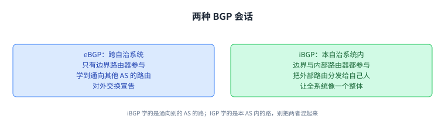
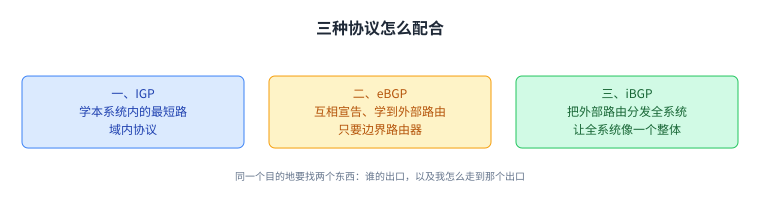
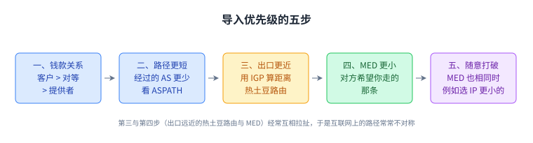
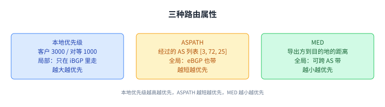

+++
title = "BGP 的实现与它的问题"
lecture = 16
slug = "bgp-implementation-and-issues"
status = "draft"
source_kind = "textbook"
source_url = "https://textbook.cs168.io/routing/bgp-implementation.html"
source_title = "BGP Implementation and Issues"
output_mode = "explanation"
+++

> 来源课程：UC Berkeley CS168 Computer Networks（教材 CS 168 Textbook）；
> 对应内容：Routing 之 BGP Implementation and Issues（<https://textbook.cs168.io/routing/bgp-implementation.html>）；
> 上游许可：教材站在站根页声明 CC BY-SA 4.0（第二人复核见 `docs/audit/license-cs168-second-review.md`）；
> 本文由 CourseLingo 原创撰写：**按该节的推进顺序**重新讲解，关键句给出英文原文与中译，**不逐句全译**，配图全部自绘、不转载原图；
> 本文非官方材料，CourseLingo 与 UC Berkeley 及课程教学团队无隶属关系；如与原文有出入，以原文为准。

## 一、把一个自治系统当成一台机器来实现

上一讲把整个 AS 当成一个节点来导入导出路径。这一讲要解决的是：真实的 AS 里有很多台[[term:router]]与[[term:end-host]]，它们怎么协作得像一台机器。

AS 内部的路由器分两类：[[term:border-router]]至少有一条链路通向别的 AS；[[term:interior-router]]只有通向本 AS 内其他路由器的链路。只有边界路由器需要向别的 AS 宣告路由，有时我们把宣告 BGP 路由的路由器叫作 [[term:bgp-speaker]]。它们必须懂 [[term:border-gateway-protocol]]（BGP）的语法与语义：怎么读、怎么造一条宣告，收到宣告之后该做什么。

换句话说，「一个 AS 是一台机器」这句话是实现出来的：靠的是内部这些路由器之间的协议配合。

## 二、两种 BGP 会话：eBGP 与 iBGP

一条 BGP 会话就是两台路由器互相对话。教材按「对方是不是同一个 AS」分成两种。

[[term:external-bgp]]会话（简称 eBGP）发生在不同 AS 的两台路由器之间，用来在不同 AS 之间交换宣告、学到通向其他 AS 的路由。由于必须与别的 AS 通话，只有边界路由器参与 eBGP。

[[term:internal-bgp]]会话（简称 iBGP）发生在同一个 AS 的两台路由器之间（不要求它们直接相邻）。它的作用是：边界路由器学到一条新路由后，用 iBGP 把这条路由分发给本 AS 的其他路由器，于是整个 AS 能像一个整体那样协调。边界路由器与内部路由器都参与 iBGP。

这里有一处教材专门提醒的混淆：iBGP 与 [[term:interior-gateway-protocol]]（IGP）容易混。两者都在同一个 AS 内部交换消息，但 iBGP 属于域间协议，帮路由器了解通向其他 AS 的路径；IGP 是域内协议，帮路由器了解通向本 AS 内目的地的路径。顺带说一句（这句是我们的评述，源文没有）：这几个缩写里 iBGP 与 IGP 都带「I」和「GP」，eBGP 与 iBGP 又只差一个字母，名字长得像，更容易混。

把 eBGP 与 iBGP 分开，是为了让「对外只有一个声音」这件事在实现上成立：对外由边界路由器统一宣告，对内由 iBGP 把结果同步给所有人。

## 三、三种协议怎么配合：两张转发表与出口路由器

教材把三者的配合顺序讲得很清楚：先由每个 AS 运行 IGP，学到本 AS 内任意两台路由器之间的最小代价路径；再由各 AS 运行 eBGP，互相宣告路由、学到通向其他 AS 的路由；最后由 iBGP 把某台路由器学到的外部路由分发给同一 AS 内的所有路由器。

转发时怎么用这三份结果？如果目的地在本 AS 内（同一个 IP 前缀），就用 IGP 学到的路由转发；如果目的地在别的 AS（不同前缀），就回想 iBGP 告诉我们的那条外部路由，据此确定哪台边界路由器在那条路上，再用 IGP 把[[term:packet]]送到那台边界路由器，由它转交给下一个 AS。

教材的例子是 E 要给 Z 发分组：E 所在 AS 先跑 IGP 学到所有内部路由；AS#5 里某台路由器用 eBGP 宣告了到 Z 的路由，此时只有 G 知道能到 Z；G 再用 iBGP 告诉本 AS 所有路由器「我能到 Z」。E 从 iBGP 得知同 AS 的 G 能到 Z，于是用 IGP 路由把分组送到 G（先经过 F），G 再用 eBGP 学到的路由把分组送给 Z。

那台对外宣告路由的边界路由器，叫某个目的地的[[term:egress-router]]，它能帮你把分组送出自己的网络、进入更靠近目的地的其他网络。

这一套的结果是每台路由器有两张[[term:forwarding]]表：一张把本 AS 内的目的地映射到下一跳（由 IGP 填充），另一张把所有外部目的地映射到某台出口路由器（由 eBGP 填充）。要注意外部表里的出口路由器不一定是下一跳，它可能离你好几跳，你是用 IGP 走到它那里的。

至于 iBGP 本身怎么实现，教材给了最简单的方案：边界路由器装上一条新路由后，直接告诉本 AS 内每一台其他路由器。代价是每台边界路由器都要与所有其他路由器建立 iBGP 会话，若有 B 台边界路由器、总共 N 台路由器，就需要 B×N 条 iBGP 连接，本地网络一大就不好扩展。教材在这一节末尾注明，现实中还有别的组合方式（比如[[term:route-reflector]]，本课不展开）。

这张图值得记住：同一个目的地要找两个东西，先问「谁的出口」，再问「我怎么走到那个出口」。

## 四、AS 之间的多条链路：**热土豆路由**

之前的 AS 图里，两个 AS 相连就画一条边。但一个 AS 其实有很多路由器，所以两个 AS 之间可以有多条链路。

多条链路在现实中很有用。教材举的例子是 Verizon 与 AT&T 这样横跨全美的大 AS：如果两家只在西海岸有一条链路，那么东海岸的 Verizon 路由器要与东海岸的 AT&T 路由器通信，分组就得先横穿全国、挤过那条链路、再横穿回来。

多条链路也意味着：两个路由器之间可能存在经过同一批 AS 的多条路径。在 AS 层面这两条路径看起来一样，但在细一点的模型里，两条都要被导出，而导入方要挑一条。

挑哪条？教材的理由很直白：[[term:bandwidth]]要花钱，所以希望流量尽量走在别人付钱的基础设施上，尽量少走自己的。于是，以路由器 E 为例：它用 IGP 算出到西边出口路由器 F 的距离、以及到东边出口路由器 I 的距离；既然 F 更近，走 F 就更少消耗本 AS 的带宽，于是 E 导入经由 F 的那条。而靠近 I 的另一台路由器可能做出相反的选择。

> "This strategy of selecting the nearest egress router is sometimes called hot potato routing. We want the packet to leave our AS as soon as possible, and start traveling over somebody else's links as soon as possible."
> （这种「选最近的出口路由器」的策略有时叫热土豆路由：我们希望分组尽快离开自己的 AS，尽快开始走别人的链路。）

[[term:hot-potato-routing]]这个名字很形象：烫手的东西要尽快扔出去，扔出去之后，这段路程的带宽就由别人付钱了。

## 五、路由器之间势均力敌时：MED

如果一台路由器到两个可能的出口一样近怎么办。这时可以由导出方来表态：它在宣告里给其中一条路加上偏好。

导出方偏好哪条？同样出于钱：它希望分组尽量少占自己的带宽，于是偏好那条更省自己带宽的路。做法是在「粉色路径」的宣告里加上一句「我希望你走这条」，在「橙色路径」的宣告里加上一句「我希望你避开这条」。于是那台势均力敌的路由器在 iBGP 宣告里看到这个额外信息，就按导出方的偏好选择。

这个额外信息叫 [[term:multi-exit-discriminator]]（简称 MED）。从导出方的视角，它表示「我希望你从这个路由器进我的网络」；从导入方的视角，它表示「对方 AS 希望我从这个路由器出去、进入对方网络」。

教材还给了 MED 的另一种理解：它就是经由这个路由器到目的地的距离。导出方可以说「西海岸那台路由器离目的地 3 跳」「东海岸那台离目的地 12 跳」，而MED 数值越小越优先，因为导出方希望少用自己的链路，它宁愿用自己的 3 条链路，也不愿用 12 条。

注意这里的两种「距离」方向相反：热土豆路由算的是「我到你有多远」，MED 说的是「你从我这里到目的地有多远」。

## 六、导入策略的优先级

细化的模型带来了额外的导入规则。收到同一目的地的多条宣告时，按这个顺序打破平局：

| 顺序 | 规则 | 依据 |
| --- | --- | --- |
| 1 | 先用 Gao-Rexford：客户 > 对等体 > 提供者 | 钱款关系 |
| 2 | 优先级相同（比如都来自客户）⇒ 选更短的路由 | 经过更少的 AS |
| 3 | 长度也相同 ⇒ 选出口路由器更近的那条 | 用 IGP 算到各出口的距离 |
| 4 | 到出口的距离也相同 ⇒ 选 MED 更小的那条 | MED 在宣告里带着 |
| 5 | MED 也相同 ⇒ 随意打破（比如选 [[term:ip-address]]更小的） | 无差别 |

教材特别点出：最近的出口路由器（热土豆）与 MED 经常互相矛盾。每个 AS 都想少用自己的带宽、让分组走别人的带宽。作为导出方，我希望分组尽量靠近目的地再进入我的网络，也就是说希望导入方把分组扛得越远越好；作为导入方，我希望自己扛得越少越好，也就是说希望分组尽量远离目的地就进入对方网络，让对方去干活。

这个矛盾的后果之一，是[[term:internet]]上的路径常常是不对称的：两台主机互相发包时，两个方向的路径可能不同。教材的例子是：东向的分组由 A 选西边出口、逼着 B 扛大部分路；西向的分组则由 B 选东边出口、逼着 A 扛大部分路。根本上说，BGP 允许这种行为，是因为每个 AS 都被授予了自定策略的自主权，这里的策略就是热土豆路由。实践中，有的 AS 会想出更巧妙的办法把分组「骗」到别人网络上跑得更远；也有的 AS 带宽更好，只要你付溢价，就愿意替你多扛一段。

这张表是这一讲最实用的一张：前面讲的所有策略，最终都落成这五条可执行的比较。

## 七、BGP 报文类型与路由属性

[[term:protocol]]必须规定语法与语义，BGP 也一样：它要规定报文的结构，以及路由器收到报文之后该做什么。BGP 有四种报文类型：Open 用来在两台路由器之间开启会话；KeepAlive 用来确认会话还开着（哪怕最近没有别的消息）；Notification 用来处理错误，这三种教材不再展开。第四种、也是最有意思的是 Update：用来宣告新路由、修改已有路由、或删除不再有效的路由。

一条 Update 里含一个目的地（用 IP 前缀表示），以及一组[[term:route-attribute]]。属性是名值对：名字表示属性类型，值表示它的取值，教材给的非网络例子是 `color=red`、`shape=triangle`。有些属性是本 AS 局部的，只在 iBGP 消息里传递；另一些是全局的，可以出现在 eBGP 宣告里。属性很多，教材聚焦三个，正好对应前面那几种打破平局的依据。

[[term:local-preference]]把 Gao-Rexford 导入规则编码在一个 AS 内部：AS 给更偏好的路由（比如来自客户）设更高的值，给不太偏好的（比如来自提供者）设更低的值。它是局部属性，只在 iBGP 消息里携带，不会通过 eBGP 发给别的 AS，因为别人不需要知道你的偏好。教材的例子是：路由器 E 收到来自 AS#7 的 eBGP 宣告，而 AS#7 是客户，那么 E 在 iBGP 消息里设一个高值 3000；若路由器 D 收到来自 AS#79（对等体）的宣告，就设一个较低的值 1000。这些数字是任意的，只有相对大小有意义，用 300 和 100 代替 3000 和 1000，行为完全一样；数值通常由运营者手工设定。

[[term:as-path]]装着这条路由经过的 AS 列表（按反向顺序），它是全局属性，可以出现在 eBGP 宣告里。教材的例子是一条宣告：目的地前缀 `128.112.0.0/16`，ASPATH 属性为 `[3, 72, 25]`。它对应第二优先级：如果两条宣告的本地优先级相同（比如都来自客户），就选更短的那条，而 ASPATH 给出的正是路径长度（按经过的 AS 数衡量）。

第三优先级是到出口路由器的 IGP 代价，它存在路由器本地的转发表里（比如本地跑的距离向量协议会存下到同 AS 内每台路由器的代价）。

MED 编码导出方的偏好，等价地说，它表示从导出路由器到目的地的距离，数值越小越优先。教材的例子是：两个 AS 之间有两条链路时，导出方的两台边界路由器都会宣告一条路径；因为到目的地的 AS 路径相同，ASPATH 与目的地的前缀也相同，区别在于西边那台会带上更小的 MED，意思是「请尽量从我的西边路由器进来，因为它离目的地更近」。它对应第四优先级。

一句话记住方向：本地优先级越高越优先，ASPATH 越短越优先，MED 越小越优先。

## 八、BGP 的问题

教材最后列了四类问题，讲得很坦白。

第一，没有内建的安全保证。 一个恶意的 AS 可以撒谎：宣告一条自己根本到不了的路由，或者宣告一条非常便宜、但其实不存在的路由，诱导其他 AS 把分组送经自己，然后在途中删除或修改分组。这类攻击叫[[term:prefix-hijacking]]。用密码学来保护 BGP 的研究一直在进行，但这类协议还没有被广泛部署。

第二，它优先策略而不是最小代价。 又因为 BGP 用 AS 数来衡量路径长度，这个长度可能有误导性，一个 AS 里可能只有 2 台路由器，也可能有 200 台。于是分组不一定走最小代价的路，互联网上的性能也很难推理。教材在这里加了一句很重要的限定：有人会把这两条算作问题，但它们更像是有意的设计取舍，BGP 的设计者是有意识地选择优先策略、并隐藏 AS 内部拓扑，代价就是性能。

第三，实现起来很复杂。 教材说自己没覆盖的细节还有很多；即使在覆盖到的部分，本地优先级、MED 这类配置也得运营者手工设置，配错了就可能让错误路径在网络里扩散。BGP 的配置错误经常导致互联网大范围中断，所以也有研究在做「验证配置是否正确」的工具。

第四，它依赖若干假设。 要保证可达性与收敛，需要所有人都遵守 Gao-Rexford 规则、AS 图构成层次、并且没有「提供者—客户」的环。如果这些假设不成立（比如某个 AS 自定了一套违反 Gao-Rexford 的策略），BGP 就可能表现出不稳定：路由永远不收敛，或者出现环路与死胡同。

这四条合起来解释了教材为什么反复说 BGP「不完美但有效」：它的每一条毛病，几乎都能追溯到「把策略放在第一位、把拓扑藏起来」这个最初的选择。

## 九、脉络回顾

这一讲把上一讲的 AS 级模型落到路由器级。AS 内部靠两种会话配合：eBGP 只发生在边界路由器与别的 AS 之间，负责学到外部路由；iBGP 在同一 AS 内分发这些路由，让整个 AS 像一台机器。它们与域内的 IGP 是三种不同的东西，iBGP 学的是通向其他 AS 的路，IGP 学的是本 AS 内的路。三者配合的结果是每台路由器有两张表：内部目的地走 IGP，外部目的地映射到某台出口路由器，再用 IGP 走到它。

AS 之间有多条链路时，导入方按五条规则打破平局：先按钱款关系（Gao-Rexford），再按 ASPATH 长度，再按到出口路由器的 IGP 距离（热土豆路由），再按对方的 MED，MED 也相同时就随意打破（例如选 IP 地址更小的）。第三条（出口远近，也就是热土豆路由）与第四条（MED）经常互相拉扯：导出方希望你把分组送得离目的地很近再进门，导入方希望自己少扛一段，于是互联网上的路径常常不对称。报文层面，一种 Update 带着目的地前缀与属性；本地优先级是局部属性（只在 iBGP 里走）；ASPATH 是全局属性（源文在这里明写了 global）；MED 我们也按「可以跨 AS 带」来理解，但源文没有这样明说，见溯源。最后，BGP 有四类问题：可被前缀劫持、策略优先于性能、实现复杂易配错、依赖 Gao-Rexford 那一套假设。

这一部分（[[term:routing]]，routing）到此结束；下一讲进入传输层。

## 读完应该能回答

1. eBGP、iBGP 与 IGP 三者的分工，为什么 iBGP 与 IGP 容易混，以及一台路由器为什么有两张转发表。
2. 热土豆路由与 MED 各自代表谁的立场，它们为什么会互相矛盾、并导致路径不对称。
3. 导入时的五条优先级顺序，以及本地优先级、ASPATH、MED 三个属性分别对应哪一步。
4. BGP 的四类问题，以及哪些属于设计取舍、哪些是真的缺陷。

## 溯源

- 对应：UC Berkeley CS168 Computer Networks，教材 Routing 之 BGP Implementation and Issues（<https://textbook.cs168.io/routing/bgp-implementation.html>）
- 教材：CS 168 Textbook（UC Berkeley CS168 课程教材），原文链接同上
- 授权依据：教材站在站根页声明 CC BY-SA 4.0；本文为本仓库原创中文讲解，按该节顺序重讲，关键句给出英文原文与中译，**未逐句全译**，配图自绘
- 结构说明：本讲章节顺序**跟随教材该节的推进顺序**（边界/内部路由器 → eBGP 与 iBGP → 三者配合 → 热土豆路由 → MED → 导入优先级 → 报文与属性 → 问题）；教材的导入优先级原文是一个项目符号列表、共 **5 条**（第 5 条是 MED 也相同时任意打破，例如选 IP 地址更小的），我们原样整理成 5 行表格；三种属性原文分三段，我们按「局部/全局」与「第几优先级」重新组织并保持原意
- 我们的归纳（源文没有明说）：把「同一目的地要找两个东西：谁的出口、我怎么走到那个出口」写成两张转发表的记忆点；把四类问题归到「把策略放在第一位、把拓扑藏起来」这个最初选择上；「iBGP 与 IGP 这两个缩写长得像」这句补充（源文只有 It's easy to confuse iBGP and IGP.，没有任何关于名字相似的评述）；把 MED 也按「可以跨 AS 带」来讲（源文只在 ASPATH 那段明写 This attribute is global, and can be sent in eBGP announcements.，MED 那段没有点名；源文另有一句泛指的 Other attributes are global, and can be sent in eBGP advertisements.）
- 术语取舍：`egress router` 译作「出口路由器」，`BGP speaker` 译作「BGP 发声者」，`hot potato routing` 译作「热土豆路由」（保留原比喻），`prefix hijacking` 译作「前缀劫持」；本讲核心词已登记进 `glossary.toml`（border-gateway-protocol / external-bgp / internal-bgp / interior-gateway-protocol / multi-exit-discriminator / local-preference / as-path / border-router / interior-router / egress-router / hot-potato-routing / prefix-hijacking / bgp-speaker / route-reflector / route-attribute，共 15 条）；源文把属性名写作全大写的 `LOCAL PREFERENCE`、`ASPATH`、`MED`，本页正文用常规大小写，「AS 路径」按源文拼写收作 `ASPATH`