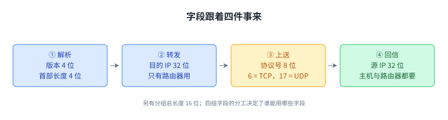
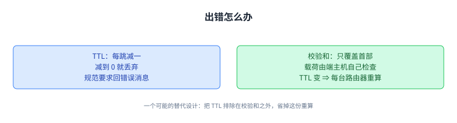
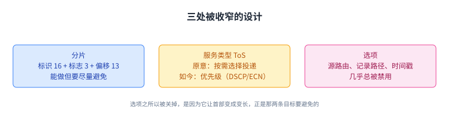
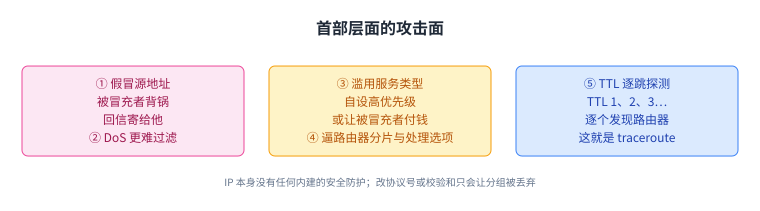
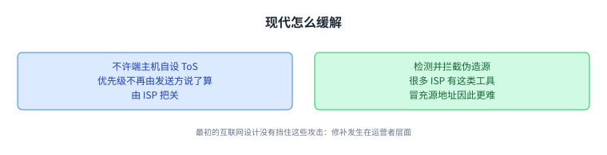

+++
title = "IP 首部：每个分组都要背的那几十个字节"
lecture = 17
slug = "ip-header"
status = "draft"
source_kind = "textbook"
source_url = "https://textbook.cs168.io/routing/ip-header.html"
source_title = "IP Header"
output_mode = "explanation"
+++

> 来源课程：UC Berkeley CS168 Computer Networks（教材 CS 168 Textbook）；
> 对应内容：Routing 之 IP Header（<https://textbook.cs168.io/routing/ip-header.html>）；
> 上游许可：教材站在站根页声明 CC BY-SA 4.0（第二人复核见 `docs/audit/license-cs168-second-review.md`）；
> 本文由 CourseLingo 原创撰写：**按该节的推进顺序**重新讲解，关键句给出英文原文与中译，**不逐句全译**，配图全部自绘、不转载原图；
> 本文非官方材料，CourseLingo 与 UC Berkeley 及课程教学团队无隶属关系；如与原文有出入，以原文为准。

## 一、首部的两条设计目标

前面几讲一直在说「路由器读首部、不读载荷」。这一讲要解决的是：那个首部里到底放了什么，为什么只放这些。

先复习两个词：像 IP 这样的[[term:protocol]]由语法与语义组成，语法决定首部里有哪些字段，语义决定这些字段怎么被处理。[[term:packet]]由[[term:header]]与载荷组成：首部是 IP 协议能处理的元数据，载荷是要交给上层协议的数据，IP 自己不解析它。首部在往下走时被逐层加上、往上走时被逐层剥掉，而 IP 首部在两端主机与每一台中间路由器上都会被处理。

接着是两条目标。第一，**尽可能小**。

> "Every packet sent across the Internet need the IP header attached, so increasing the IP header size, even by one byte, would significantly increase the total amount of bandwidth across the Internet."
> （互联网上发出的每一个分组都要带上 IP 首部，所以哪怕只增加一个字节的首部，也会显著增加全网的[[term:bandwidth]]消耗。）

第二，**尽可能简单**。每台[[term:router]]与主机都要处理它，处理起来复杂就会拖慢整个[[term:internet]]；而且理想情况下首部要能纯硬件处理，所以不能假设你能用通用 CPU 的各种操作。

这两条目标后面会反复出现：凡是让首部变大或变复杂的设计，教材都会解释它为什么被砍掉。

## 二、字段跟着「四件事」来

IP 协议要做四件事，字段就是为这四件事配的。

第一，所有人都要能解析分组、看懂每一位是什么意思。为此首部里有：版本（4 位）、首部长度（4 位，以 4 字节为单位，之所以需要它是因为 IP 首部长度不固定）、分组总长度（16 位，以字节为单位）。

第二，路由器（不是端主机）要把它转发给下一台路由器。为此有目的 [[term:ip-address]]（IP address，IP 地址，32 位）。

第三，[[term:end-host]]（不是路由器）要把它交给上层。为此有协议号（8 位），它说明载荷该由哪个第四层协议处理：比如协议号 6 表示用 TCP 读剩下的载荷（把载荷开头的比特当作 TCP 首部读下去），协议号 17 对应 UDP。

第四，端主机与路由器都要能回消息给源。为此有源 IP 地址（32 位）。

这四类字段的分工值得留意：只有目的地址是转发必需的，而协议号只有端主机关心。

## 三、出错怎么办：TTL 与**校验和**

分组可能在环里打转（比如[[term:routing]]协议还没收敛）。教材算了一下：[[term:forwarding]]是纳秒级的，而路由收敛是毫秒到秒级的，如果就让分组一直转到收敛，既慢又浪费带宽。所以首部里有 **TTL（存活时间，8 位）**，每经过一跳减一；减到 0 就丢弃分组，并回一条错误消息给源。（教材注明：这条错误消息是 IP 规范要求的，但实践中并不总会发出。）

分组也可能被损坏（比如线上比特受电气过程影响），所以首部里有校验和（16 位），校验不对就丢弃分组。这里有一处很关键的限定：

> "Note that the IP [[term:checksum]] is only computed over the IP header. The checksum can only detect errors in the IP header, not errors in the IP payload. This reflects the end-to-end principle, where we enforce that the payload is checked by the end host, not the intermediate routers."
> （注意 IP 校验和只覆盖 IP 首部：它只能发现首部里的错误，发现不了载荷里的错误。这正体现了端到端原则，载荷由端主机检查，而不是中间路由器。）

还有一个实现上的连带后果：因为 TTL 每一跳都在变，校验和必须在每一台路由器上重算。教材提了一句可能的替代设计：把 TTL 排除在校验和之外，省掉路由器这份额外工作。

教材把「把 TTL 排除在校验和之外」写成一种可能的替代设计，并没有采用；现实里的做法仍是每跳重算。

## 四、分片、服务类型与选项

分组可能对某条链路来说太大。每条[[term:link]]**都有一个 MTU（最大传输单元）**，即这条链路能作为一个整体承载的最大分组字节数（比如链路用来暂存分组的存储有限）。

端主机并不知道分组会走哪些链路，所以它可能发出一个对某条链路过大的分组。办法是路由器做**分片（fragmentation）**：把分组切成多个片段，链路另一端的路由器再重组回原分组。首部里用标识（16 位）、标志（3 位）与偏移（13 位）三个字段实现它。

分片可以在硬件里做（不需要 punt 给控制卡），但它带来额外开销，所以现代互联网尽量避免：比如把 MTU 尽量标准化，当代标准是 1500 字节。

早期设计者没有完全接受尽力而为的思路，觉得让应用按需选择不同类型的投递可能有用，于是有了 ToS（服务类型，8 位），用来请求不同的投递形式，比如标记某些分组时延敏感或高优先级。这些年这些比特被重新定义：ToS 已不是原来的形态，现在表示某种优先级概念，用这些比特的协议例子有 DSCP（区分服务代码点，定义若干流量类别）与 ECN（显式拥塞通知，后面会讲）。

最后是选项（options）：原始设计允许在首部里附加选项比特来要求更高级的处理，比如让路由器记录分组走过的路径（用于诊断）、在首部里放源路由强制分组走指定路线、或者放时间戳。现代实现里这些选项几乎总是被禁用，因为它们让实现不必要地复杂：它们迫使 IP 首部变成变长，而变长比定长难处理得多。

这一段把前面两条目标又用了一遍：凡是让首部变长、变复杂的（选项），现代互联网的选择都是关掉它。

## 五、IPv6 改了什么：一次「春季大扫除」

IPv6 的动机是担心 32 位地址迟早不够用，于是把地址扩展到 128 位，这个空间大到几乎不可能用完（教材的说法是「想想宇宙里有多少原子」）。设计者顺便做了一次清理，把过时的字段去掉或更新。教材也交代了一句：IPv6 最初想做的是一个更有野心的协议，带很多新的寻址特性，但多数特性从未实现；实践上除了这次清理，相对 IPv4 并没有很多重大变化，结果是一个更优雅、但没有多少野心的 IP 协议。

（教材附注：IPv5 发表于 1990 年，早于 1998 年的 IPv6；它是一个实验性协议，从未被广泛实现。）

IPv6 取消了首部校验和。支持保留它的理由曾经是：如果分组损坏而没被发现，这个坏分组会一直传下去、浪费带宽；有了校验和就能把它丢掉。而教材的判断是：如今带宽不再是瓶颈，所以校验和不再必要，就算有些坏分组一路传到终点，性能影响也不大。

IPv6 取消了路由器上的分片：如果 IPv6 分组对某条链路太大，路由器直接丢弃并回一条错误消息给源，消息里带上这条链路允许的最大分组大小（MTU）；由源主机负责把数据拆成更小的分组重发。教材给出了这么改的理由：端主机（比如你的电脑）处理的分组数远少于路由器（比如数据中心里的），把分片这份工作从路由器挪到端主机，提升了整个互联网的可扩展性。

IPv6 用「下一个首部」取代了变长的选项段。IPv4 的选项之所以成问题，是因为它造成变长首部、更难解析；IPv6 首部是定长的，于是连首部长度字段也可以省掉。为了继续支持「在第四层之前先做点额外处理」，IPv6 把协议字段一般化成下一个首部：如果要让另一个协议先处理这个分组，就把那个协议的编号写进下一个首部字段；这些编号由标准组织统一管理。没有额外选项时，下一个首部字段的作用与旧的协议字段相同，分组直接上送第四层。

这个机制还可以串起来：那个额外协议的首部里也可以有下一个首部字段，于是可以连续多个协议在 IPv6 与第四层之间依次处理。教材说这种设计面向未来：将来发明的协议可以按这套办法加进来，既不破坏 IPv6，也不需要修改 IPv6 本身。

IPv6 还新增了流标签（flow label）字段。第三层本来是独立地发送每个分组（一个分组怎么发不影响别的分组），但实践中很多分组是彼此相关的，比如两台主机之间的一段视频流会发出大量分组。第三层本该把它们分开看，可现实中路由器上加了许多叫中间盒（middlebox）的高级系统（比如防火墙、入侵检测系统），它们恰恰关心这些分组是否属于同一条流或连接，防火墙可能要看一条连接里的多个分组才能判断该不该放行。在所有分组都被独立发送时，这些中间盒只能靠猜（比如注意到源/目的 IP 相同）；IPv6 提供了一种显式标明「这些分组是相关的」的方式。

有些字段其实是改名不改功能：版本号不变；分组长度不变，只是从「总长度」改叫「载荷长度」；TTL 改叫跳数限制（Hop Limit），功能一样；ToS 比特改叫「流量类别」，仍可用来实现某种分组优先级概念。

教材把 IPv6 的取向总结成一句话：总体上它拥抱端到端原则，尽可能把工作交给端主机（分片、校验和验证与重传损坏分组）。但有些字段，比如跳数限制（TTL），本质上就是 IP 层面的问题，端主机做不了，分组在网里绕圈，端主机怎么帮得上忙。

这一页的取舍很清楚：凡是端主机能做的就交出去，TTL 这种只有在网内才能判断的事留在 IP 层。

## 六、首部层面的安全问题

教材最后列了一串攻击面，并反复强调 IP 本身没有任何内建的安全防护。

第一，假冒源地址（**IP spoofing**）。 攻击者可以发出源 IP 地址错误的分组，冒充别人。后果一是被冒充的主机会被错误地归咎于这个分组；二是如果攻击者发出的是伪造请求，回信会被送到被冒充的主机那里。

第二，用它做拒绝服务（DoS）。 DoS 攻击用海量分组压垮服务器；如果所有分组都来自同一个发送方，服务器只要忽略那个 IP 地址就能止住。可一旦攻击者对源 IP 撒谎，服务器就更难区分攻击流量与正常流量了。教材说还有更复杂的冒充攻击，本课不展开（可看 CS 161 的讲义）。

第三，滥用 ToS。 ToS 允许发送方给自己的分组设优先级；如果每个人都能自设，恶意用户就能设高优先级、骗网络优先转发攻击流量。如果网络对高优先级流量额外收费，攻击者还可以发伪造的高优先级分组，让被冒充的主机替他的流量付钱。

第四，让路由器做额外工作。 IPv4 里攻击者可以故意发大分组，逼路由器花力气分片；也可以故意加一堆选项，逼路由器处理这些选项，两者都能用来耗尽路由器的处理能力，从而形成 DoS。

第五，用 TTL 探测拓扑。 发一个 TTL 为 1 的分组，它会在第一跳过期，第一台路由器会回一条错误消息给你，于是你知道了第一台路由器的身份；再用 TTL 2，就知道第二台；如此 TTL 3、4 一路上推，就能把路径上的路由器逐个发现。这一招叫 **traceroute**，教材也补了一句，有人认为它不算攻击，而是有用的诊断工具。换不同的源与目的重复这套动作，就能了解更多网络拓扑；不过有些路由器在 TTL 超限时不发错误消息，这会限制这一招的效果。

第六，改协议号或校验和字段。 理论上攻击者可以篡改这两个字段，但那多半只会让分组因为协议号非法或校验和不对而被丢弃，所以实践中针对这两个字段的攻击并不存在。

对这些，教材也给了现代的缓解办法：如今的 [[term:isp]]不允许端主机自行设置 ToS 字段，很多 ISP 还有工具来检测并拦截伪造源地址的分组，也就是说，这些修补发生在运营者的层面，而不是 IP 协议本身。

所以安全这一节的落点不在协议上，而在运营者的部署上：协议本身没变，环境变了。

## 读完应该能回答

1. IP 首部的两条设计目标，以及它们各自约束了哪些设计决定。
2. 四类字段分别服务于哪件事，为什么说只有目的地址是转发必需的。
3. 校验和为什么只覆盖首部，TTL 为什么逼着每台路由器重算校验和。
4. IPv6 做了哪四项改动、各自理由是什么，以及哪些字段只是改名。
5. IP 层有哪些典型攻击面，现代的缓解发生在哪一层。

## 脉络回顾

这一讲把「路由器读的那几十个字节」拆开看了一遍。首部有两条目标：尽可能小（每增加一个字节都会放大成全网的带宽开销）、尽可能简单（每台设备都要处理它，理想情况要能纯硬件处理）。字段按四件事来配：解析需要版本、首部长度、总长度；转发需要目的 IP；上送需要协议号；回信需要源 IP。

出错与特殊情况带来 TTL、校验和、MTU 与分片、ToS、选项。其中校验和只覆盖首部，这是端到端原则的落点；而选项之所以被禁用，是因为它让首部变成变长，正好违反那两条目标。

IPv6 做的是清理而不是革命：地址扩到 128 位，砍掉首部校验和（带宽不再是瓶颈），取消路由器分片（把它推给端主机以提升可扩展性），用「下一个首部」取代变长选项（首部因此定长、连长度字段都能省），并新增流标签让中间盒不必再猜分组之间的关联。总体上它把能交给端主机的工作交出去，只把真正属于 IP 层的问题（如 TTL）留在原处。

最后是安全问题：IP 没有内建防护，可以被冒充源地址、被用来做 DoS、被滥用优先级字段、被逼着做额外工作，也能被 TTL 一步步探测出拓扑（traceroute），而现代的缓解主要发生在 ISP 的运营层面。

这一讲把 Routing 部分收尾；下一讲进入传输层。

## 溯源

- 对应：UC Berkeley CS168 Computer Networks，教材 Routing 之 IP Header（<https://textbook.cs168.io/routing/ip-header.html>）
- 教材：CS 168 Textbook（UC Berkeley CS168 课程教材），原文链接同上
- 授权依据：教材站在站根页声明 CC BY-SA 4.0；本文为本仓库原创中文讲解，按该节顺序重讲，关键句给出英文原文与中译，**未逐句全译**，配图自绘
- 结构说明：本讲章节顺序**跟随教材该节的推进顺序**（设计目标 → 字段 → 错误处理 → IPv6 变化 → 安全）；教材这三节各自的篇幅较长，我们按主题拆成八节（错误处理拆成 TTL/校验和 与 分片/ToS/选项 两节，IPv6 拆成两项改动与取向两节，安全拆成攻击面与缓解两节），内容与顺序不变
- 照录：原文「IPv6 变化」一节写「IPv4 的协议首部被设成 7 或 19，用来表示哪个第四层协议接下去处理」，而同一篇的「字段」一节写的是协议号 6 表示 TCP、17 表示 UDP；两处数字不一致。按 IP 协议号的实际定义应为 6（TCP）与 17（UDP），我们照录原写法并在正文说明，供平台判据留存
- 我们的归纳（源文没有明说）：把「凡是让首部变大或变复杂的设计都被砍掉」作为贯穿全讲的线索；把安全一节收成「攻击面在 IP、缓解在 ISP 层面」