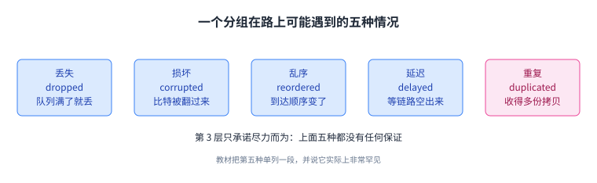
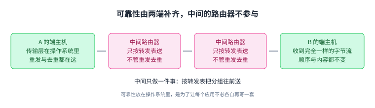
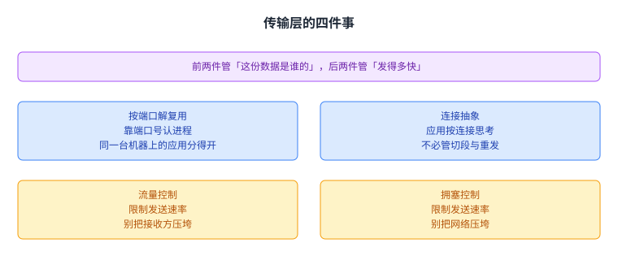
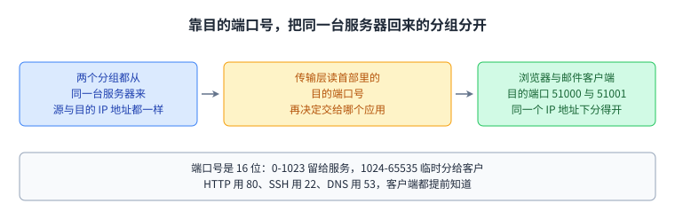
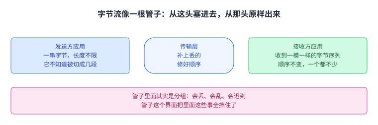
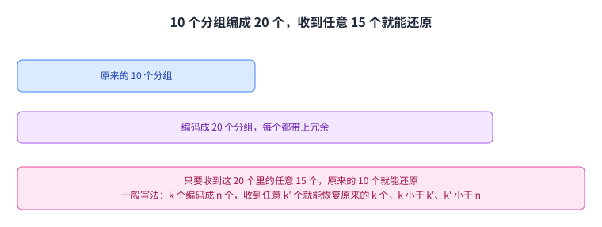

+++
title = "传输层：把尽力而为的分组网络补成可靠的数据通道"
lecture = 18
slug = "transport-layer-principles"
status = "draft"
source_kind = "textbook"
source_url = "https://textbook.cs168.io/transport/reliability.html"
source_title = "Transport Layer Principles"
output_mode = "explanation"
+++

> 来源课程：UC Berkeley CS168 Computer Networks（教材 CS 168 Textbook）；
> 对应内容：Transport 之 Transport Layer Principles（<https://textbook.cs168.io/transport/reliability.html>）；
> 上游许可：教材站在站根页声明 CC BY-SA 4.0（第二人复核见 `docs/audit/license-cs168-second-review.md`）；
> 本文由 CourseLingo 原创撰写：**按该节的推进顺序**重新讲解，关键句给出英文原文与中译，**不逐句全译**，配图全部自绘、不转载原图；
> 本文非官方材料，CourseLingo 与 UC Berkeley 及课程教学团队无隶属关系；如与原文有出入，以原文为准。

## 一、第 3 层只答应尽力而为，五种情况都可能发生

前十七讲都在解决「怎么把[[term:packet]]送到目的地」。这一讲要解决的是另一个问题：送到之后，能不能保证它完好、齐全、按原顺序到达。第 3 层的答案是不能。它只答应[[term:best-effort]]，而很多应用要的是「字节一个不少、顺序一点不乱」，中间差的这一段，由[[term:transport-layer]]补上。

教材把这份「尽力」到底有多弱列得很清楚，一共点了五种。丢失：某台路由器的队列满了就把分组丢掉，英文是 dropped。损坏：分组里的比特在路上被翻转，英文是 corrupted。乱序：发出的顺序与收到的顺序对不上。延迟：分组卡在某个队列里，等一条链路空出来。前四种之外，教材还专门留了一段给第五种：重复，发送方只发了一个分组，接收方却收到多份拷贝，通常来自路径上某台路由器的某种错误。

> "In rare cases, packets can even be duplicated, where the sender sends one packet but the recipient receives multiple copies of that packet."
> （极少见的情况下，分组甚至会重复：发送方只发了一个分组，接收方却收到多份拷贝。）

教材在这一节插了一个旁注：加州大学伯克利分校的 Vern Paxson，是最早发现并报告链路层分组重复的人之一。

五种里前四种是常态，第五种教材自己说「实际上非常罕见」。

## 二、可靠性放在两端，不放在中间的路由器上

补缺口的活由谁做？教材给了一条实现上的取舍，也顺手把两个「不做」说清楚了。

可靠性实现在[[term:end-host]]上，不放在中间的[[term:router]]上。教材在这里只给了结论，理由写在别处。第二句是：可靠性实现在操作系统里。这么做的理由是方便，应用不必各自再实现一套自己的可靠性。

> "For practical reasons (discussed elsewhere), reliability is implemented at the end hosts, not at intermediate routers."
> （出于实际原因（教材在别处讨论过），可靠性实现在端主机上，而不在中间的路由器上。）

把这两句放在一起看，第 4 层补齐缺口的方式就定了：中间那些机器照旧只干它们原来干的事，补缺口的设备与代码都在两端。

中间的路由器不认识「重发」这个概念，也不会记住哪个分组已经来过。

## 三、至少一次：先定义「不丢」，再把重复去掉

「可靠」这个词太含混，教材把它换成一个能逐条检查的说法：[[term:at-least-once-delivery]]。

规矩是这样：目的地必须至少收到每一个分组一次，收到的那一份不能是损坏的；同时允许它收到多份重复的拷贝。为什么这样定义，教材没有明说，但从它的推进可以看出来：这份保证刚好落在于尽力而为的网络的能力之内。网络已经能把一个分组送出去，传输层在这个底子上把丢了的分组再发一遍，就把「可能丢」变成「至少到一次」。

拿到至少一次之后还有一步：在接收端把重复的去掉。去掉之后交给应用的效果，就是[[term:exactly-once-delivery]]。

这里有一条很容易读漏的限定：可靠交付并不保证分组一定会被发出去。一台没连上网络的电脑，用任何可靠性协议都送不出数据。教材允许协议放弃某个分组并报告失败，但失败必须报给应用；协议不能谎称已经把它送到了。

从下往上一级一级看：每往上一级，就多花一次重发或一次去重的工夫。

## 四、可靠也要讲效率：快、省带宽、不白发

补上可靠性还不够。教材紧接着给这一层加了效率要求，并且拆成了三句：尽快把数据送到；尽量少用[[term:bandwidth]]；不发送没必要发的分组。

它给了一个很直白的反例：如果每个分组都重发几百次，到达确实有保证，但带宽几乎全花在重发上，第二句就违反了。

> "we could guarantee that packets arrive by re-sending every packet hundreds of times, but this would violate our requirement of using bandwidth efficiently."
> （我们确实可以靠把每个分组重发几百次来保证它们到达，但那样会违反「高效使用带宽」这条要求。）

教材把这个反例摆在这里，是为了说明「可靠」不是一个能单独达成的目标。

同一个承诺，用不同办法拿到，代价可以差很远，这才是这段要讲的。

## 五、传输层的四件事：先完整，再归属，最后是速率

补缺口只是传输层的一件事。教材说，这一层的目标是给应用一个方便的抽象，让写程序的人按「连接」思考，而不必按一个个正在网络里跑的分组思考。理想情况下，开发者不用操心把长数据切成多少段、丢了怎么补发、超时要等多久这些细节。

教材随后数了另外几件事。传输层在端主机的不同进程之间做[[term:demultiplexing]]，做法是引入端口号，把每一条流（也就是一条连接）对应到端主机上的一个进程；它还做[[term:flow-control]]与[[term:congestion-control]]，分别用来避免压垮接收方、避免压垮网络。加上前面讲过的可靠性，传输层一共有四件事：可靠性、按端口解复用、流量控制、拥塞控制。

前两件管「这份数据是谁的」，后两件管「发得多快」。

## 六、端口号：同一台电脑上，这一包该交给谁

教材在端口这一节先设了一个场景：我的电脑上有两个应用，同时在跟同一台服务器说话。分组到了我的电脑，它们的源[[term:ip-address]]都是那台服务器，目的 IP 地址都是我这台电脑。只看 IP 地址，分不出哪一包该给哪个应用。

区分的办法是在传输层[[term:header]]里再放一个[[term:port-number]]，用它指认端主机上的某个具体应用。传输层收到分组，就用这个号决定把载荷交给上面哪个应用。因为传输层跑在操作系统里，这些端口（教材也叫逻辑端口）就是应用接到操作系统网络栈上的那个接头：应用知道自己的号，操作系统知道所有应用的号，两边对上号，数据才不会串到别的应用那里去。

端口号是 16 位。教材说现代互联网普遍是客户-服务器（client-server）的结构：客户端来访问服务，服务器提供服务。服务器通常在一批[[term:well-known-port]]（编号 0-1023）上监听请求，客户端知道这些号，直接去访问；比如 HTTP 用 80 号端口，SSH 用 22 号，DNS 用 53 号。客户端则自己随便挑一个号，通常是 1024-65535：因为发起连接的是它，没有人指望它固定在某个号上。客户端的号是[[term:ephemeral-port]]，连接结束就可以丢掉，不需要长期占着。

两段区间记住就够用：0-1023 是「你来找我」的号，1024-65535 是「我临时借用」的号。

## 七、字节流：应用看到的是一根管子

可靠性做到传输层之后，写应用的人可以换一种想法：不再想一个个大小有限的分组，而想一条[[term:reliable-in-order-bytestream]]。发送方手里有一串字节，长度不限，把它整串交给传输层；接收方收到的就是同一串字节，顺序一样，一个字节也不少。

教材给了一个很好用的比方：字节流像一根管子。发送方一个字节一个字节地从这头塞进去，那些字节就一个字节一个字节地从那头冒出来。发送方和接收方都不需要操心重发与乱序，那是传输层[[term:protocol]]替他们做的。

管子这个比方只说了一半：管子里面其实是分组，会丢、会乱、会迟到，是那个界面把里面这些事全挡住了。

## 八、UDP：不需要可靠性，就别付那份钱

并不是每个应用都需要可靠。教材举的例子是家里水管上的一个压力传感器：它每一分钟把一次读数发给自来水公司，读数是一条很小的固定大小消息，带着时间与压力值。这个系统不需要分组按顺序到达，因为读数里已经带了时间戳；也不需要把长消息切开，因为每次读数都很小；甚至不需要保证每次都到，只要大部分读数到了公司就行。

这样的应用可以在传输层改用 UDP（User Datagram Protocol，用户数据报协议）。UDP 不给任何可靠性保证：应用要是需要某个分组一定到，就得自己负责重发，传输层不会替你重发。UDP 里的一条消息，也就是一个[[term:datagram]]，只能装进一个分组，想发更大的消息，拆开与拼回都由应用自己干。不过 UDP 仍然有端口号，仍然能做解复用。

在传输层，你可以按需要选 UDP 或者 TCP，但不能两个都用。这两个就是现代[[term:internet]]上的标准传输层协议。

选了 UDP，等于把重发与排序的活揽回应用自己身上，教材的意思是这笔钱只在真的需要时才付。

## 九、另一条路：用冗余换「不必等人来要」

教材最后回头讲了 TCP 的来历，以及一种完全不同的可靠做法。

TCP 最早由 Vint Cerf 与 Bob Kahn 实现，当时他们还是 UCLA 的学生。两人后来因为这项工作拿了图灵奖与总统自由勋章。教材感叹了一句：最初的设计与今天在用的相当接近，经受住了时间的检验。核心想法很简单，设计也算优雅（虽然不完美），难的是实现：几乎整个现代互联网都跑在 TCP 上，做错的代价很高。这么多年里 TCP 的许多零件都换过，比如更好的计时器估计算法、更聪明的确认、更聪明的初始序号选择、拥塞控制，但底层的架构决定与抽象，也就是面向连接的字节流与窗口，没有变。

另一种做法是让发送方主动用冗余换可靠，思路来自纠错码与 RAID 那一类技术。发送方不直接发用户数据，而是把数据编码进更多分组，让每个分组都带上冗余。教材给的例子是：手上有 10 个分组，算法把它编成 20 个，并保证只要收到这 20 个里的任意 15 个，原来的 10 个就能还原出来。

更一般的写法是：取 k 个分组，编码成 n 个，n 大于 k；只要收到其中任意 k′ 个就能把原来的 k 个恢复出来，而 k′ 大于 k、小于 n。

教材说这类编码方案是个很深的题目，比如喷泉码、raptor 码，它不打算展开，只提了一句：视频流平台就在用。

这条路的取舍和重发相反：不靠对方来要，靠多发的分组自带修复能力，代价是平时多占带宽。

## 读完应该能回答

1. 第 3 层的尽力而为会出哪五种状况，传输层为什么把可靠性放在两端主机与操作系统里，而不放进中间路由器。
2. 至少一次交付与恰好一次交付差在哪里，「可靠交付不保证分组一定发得出去」这句话是什么意思。
3. 传输层的四件事分别是什么，端口号为什么是 16 位，两段区间各留给谁。
4. 字节流这个抽象替应用挡掉了哪些事，UDP 与 TCP 各在什么场景下用，为什么不能同时用。
5. 用冗余换可靠的做法：10 个分组编成 20 个、收到任意 15 个就能还原，这条路的代价是什么。

## 脉络回顾

这一讲做的事是把第 4 层补到第 3 层上面。底子是尽力而为：分组会丢、会坏、会乱序、会延迟，极少数还会重复。传输层不改变底子，它在两端的主机上，而不在中间路由器上，用重发与去重把这份底子换成更强的承诺：先是至少一次交付，再在接收端去掉重复，交给应用的就是恰好一次交付。这条路上有两个边界必须守住：网络断了就发不出去，协议可以失败但失败必须上报，不能谎称送达；以及效率，靠每个分组重发几百次换来的可靠算不合格。往上一层，传输层给应用的是一根字节流管子，长度不限、顺序不变、不丢字节，里面那些重发与重排都由协议做掉。为了知道一份数据属于哪个进程，它引入了 16 位的端口号：0-1023 留给服务，1024-65535 临时分给客户，两段拼满整个端口空间。需要可靠性就用 TCP，不需要就用 UDP，两个不能同时用。最后一条路是用冗余换可靠：把 10 个分组编成 20 个，收到任意 15 个就能还原。

## 溯源

- 对应：UC Berkeley CS168 Computer Networks，教材 Transport 之 Transport Layer Principles（<https://textbook.cs168.io/transport/reliability.html>）

- 教材：CS 168 Textbook（UC Berkeley CS168 课程教材），原文链接同上

- 授权依据：教材站在站根页声明 CC BY-SA 4.0；本文为本仓库原创中文讲解，按该节顺序重讲，关键句给出英文原文与中译，**未逐句全译**，配图自绘

- 结构说明：本讲章节顺序**跟随教材该节的推进顺序**（可靠性缺口 → 端主机与操作系统 → 至少一次与恰好一次 → 效率 → 传输层目标 → 端口与解复用 → 字节流 → UDP → 别的可靠做法）。教材该节是六个小节，我们拆成九节：把「可靠性缺口」拆成「五种状况」与「放在两端」两节，把「至少一次」与「效率」从同一小节里拆开，其余顺序未动

- 照录与算术核对（源里的数字一个没改，下面两条是我们按它给的数算的）：
  - 端口空间：教材给的两段是 0-1023（熟知端口）与 1024-65535（客户端）。两段正好拼满 0-65535，一个 16 位字段共 65536 个号；熟知端口占 1024 个，正好是全部端口号的 1/64；客户端可用的有 64512 个。教材原文没有写出 65536、64512 与 1/64 这三个数，本讲写出来是为了让两段区间的边界有量感。
  - 冗余例子：10 个编成 20 个，等于多发一倍；收到任意 15 个就能还原，也就是能容忍 20 − 15 = 5 个丢失，占这 20 个的 25%。教材给的一般式是 k < k′ < n，与这个例子相符（10 < 15 < 20）。
  - 源文一处笔误照录：教材写的是 "you can choose to use either UDP and TCP"，按英语习惯本该是 either ... or，本讲按它的意思写成「二选一」，未改源。

- 照录的空缺（教材自己没写理由，我们也不代它补）：可靠性为什么放在端主机上，教材原文只有 "For practical reasons (discussed elsewhere)" 这一句，把理由指到了别处；本讲照实登记这个空缺，只重述结论。

- 我们的补充（源文没有明说）：把「丢失、损坏、乱序、延迟、重复」数成并列的五种（教材原文分三句写出，没有编号）；「都落在于尽力而为的网络能力之内」是对教材「用尽力而为交付提供至少一次」的直白改写；「每往上一级就多花一次重发或一次去重的工夫」是对那两级承诺的解读；管子「只说了一半」是我们对教材管子比方的补注，源文只给了这个比方、没有说管子里面是分组；「前两件管归属、后两件管速率」是对四个目标的归类，源文按顺序列出、没有这样分组；「队列满了就丢」与「比特被翻转」是对 dropped 与 corrupted 的直白解释，源文只在括号里给了这两个英文词、没有写原因；DNS 的 53 号端口是给教材「熟知端口的例子包括 HTTP 与 SSH」这句话补的第三个例子，源文只点了那两个。

- 照录但本讲未独立核实的（只重述教材的说法）：可靠性为什么放在端主机上（教材把它指到了别处）；Vint Cerf 与 Bob Kahn 当时是 UCLA 的学生、后来拿了图灵奖与总统自由勋章这一段来历；现代互联网普遍采用客户-服务器结构这一句结论；TCP 的许多零件换过、底层抽象没变这一句总结。

- 术语取舍：`at-least-once delivery` 译作「至少一次交付」，`exactly-once delivery` 译作「恰好一次交付」，`demultiplexing` 译作「解复用」（沿用第 4 讲的写法），`well-known port` 译作「熟知端口」，`ephemeral port` 译作「临时端口」，`reliable in-order bytestream` 译作「可靠有序字节流」，`datagram` 译作「数据报」，`flow control` 译作「流量控制」

- 术语表的写法：本页的 `[[term:...]]` 只在每个词首次出现处打一次，渲染出来的效果就是「中文（English）」加悬停对照，因此正文里不再另附英文括注（第 13、15、16、17 讲的 `[[term:x]]（English，中文）` 写法会把术语名渲染两遍）
