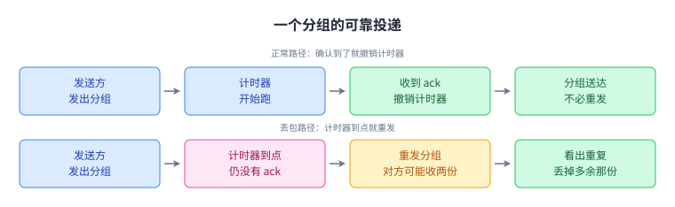
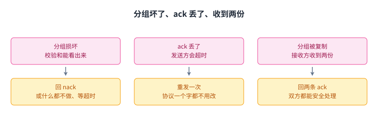
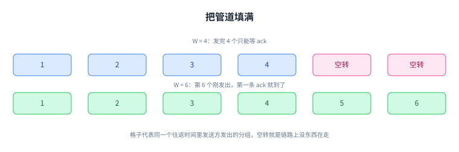
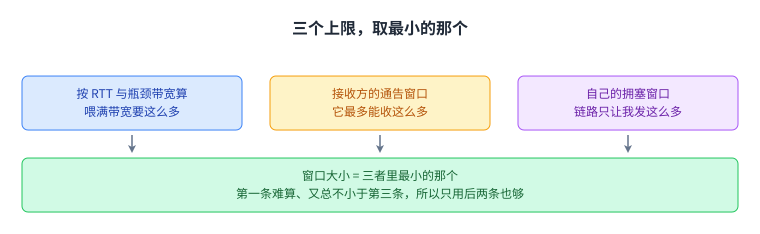
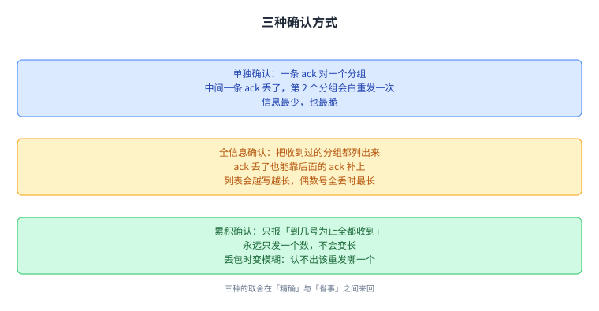
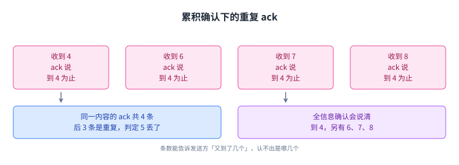

+++
title = "TCP 设计：确认、窗口与更早发现丢包"
lecture = 19
slug = "tcp-design"
status = "draft"
source_kind = "textbook"
source_url = "https://textbook.cs168.io/transport/tcp-design.html"
source_title = "TCP Design"
output_mode = "explanation"
+++

> 来源课程：UC Berkeley CS168 Computer Networks（教材 CS 168 Textbook）；
> 对应内容：Transport 之 TCP Design（<https://textbook.cs168.io/transport/tcp-design.html>）；
> 上游许可：教材站在站根页声明 CC BY-SA 4.0（第二人复核见 `docs/audit/license-cs168-second-review.md`）；
> 本文由 CourseLingo 原创撰写：**按该节的推进顺序**重新讲解，关键句给出英文原文与中译，**不逐句全译**，配图全部自绘、不转载原图；
> 本文非官方材料，CourseLingo 与 UC Berkeley 及课程教学团队无隶属关系；如与原文有出入，以原文为准。

## 一、只管一个分组：确认、计时器与 RTT

上一讲说了传输层要给应用一根「字节一个不少、顺序一点不乱」的管子。这一讲要解决的是这根管子怎么造出来，而教材的讲法是从最小的零件开始：先只保证一个分组。

两个时间概念要先分清。一个分组从发送方走到接收方所花的时间叫[[term:one-way-delay]]（one-way delay，单向时延）；发送方到接收方、再加上回程的时间，叫[[term:round-trip-time]]（round-trip time，往返时间，常缩写为 RTT）。RTT 是这一讲后面反复要用的尺子。

发送方把一个分组发出去之后，得先有办法知道对方是否收到。接收方收到就回一条[[term:acknowledgment]]（acknowledgment，确认，通常写作 ack）。那分组丢了呢，就重发。重发的时机靠发送方开的一个[[term:timer]]（timer，计时器）：到点还没等到 ack，就重发并重置计时器；收到 ack，就撤销计时器，不必再发。

> "The protocol still works without modification. The sender will time out (no ack received) and re-send the packet until the ack is successfully sent."
> （ack 自己丢了的话，协议一个字都不用改：发送方会超时、重发，直到某一次 ack 真的送到。）

接收方这时可能收到两份一样的分组，它能看出重复、丢掉多余的那份。教材就此点出一个性质：这个协议保证的是[[term:at-least-once-delivery]]（at-least-once delivery，至少一次交付），重复可能存在。

计时器该设多长是一个取舍。设太长会白白拖时间，设太短则会把不用重发的也重发一遍。教材说合理的值就是 RTT 本身：发送方本来就预期在这时收到 ack，过了这个点还没来，就该重发。

RTT 在实践中很难估准。它取决于分组走哪条路，同一条路上的负载与拥塞也会改变它。常见的做法是从每个分组身上量一次「发出到收到 ack」的时间，再用一种算法（比如指数移动平均）把这些测量合成一个估计值；重发会污染测量，也要一并处理。教材还给了运营者的经验：宁可把计时器设长一点。设短了、超时不断，连接的表现就是一直在重发，很难看。

这一节留下的最小构件是「确认 + 计时器」：确认取消计时器，超时触发重发。

## 二、分组坏了、迟到了、被复制了

比特可能在路上损坏（比如线上发生的电气过程）。所以传输层首部里放一个[[term:checksum]]（checksum，校验和），它和 IP 层的校验和是两回事。接收方发现分组坏了，有两条路：回一条[[term:negative-acknowledgement]]（negative acknowledgement，否定确认，常写作 nack）明确要求重发，或者什么都不做、让发送方自己[[term:timeout]]（timeout，超时）。两条路都能用，而 TCP 选的是后者，它没有实现 nack。

顺带说一句范围：TCP 与 UDP 的首部里都有校验和，这一节只说 TCP（源文这一节没有提 UDP）。

迟到的分组不用改协议。如果延迟很长，发送方可能在 ack 到之前就超时、重发一次，于是接收方拿到两份、发送方可能收到两条 ack，这些都在协议能处理的范围内。分组在网络里被复制成两份也一样：接收方会回两条 ack，双方都能安全处理重复。

教材在这里补了一条实现层面的提醒。如果某条链路自己实现了可靠性协议，链路接收端就可能收到重复；通常重复那份会被丢掉、只把一份转发给目的地。但如果路由器在这两份到达之间崩溃又重启，它可能把两份都转发出去。

把上面这些收成[[term:protocol]]（protocol，协议）本体，只有两句话。发送方：发出分组并设计时器；计时器响之前没等到 ack，就重发并重置计时器；收到 ack 就停下并撤销计时器。接收方：收到没损坏的分组就回 ack。教材从这个例子里点出四件后面会反复用到的东西：校验和（管损坏）、确认、重发、超时。

这一节只处理一个分组；真要发的是一串分组，而「一串」立刻带出新的问题。

## 三、从停等到「在途」

把单分组协议扩成一串分组，第一件事是给每个分组挂一个[[term:sequence-number]]（sequence number，序列号）。ack 能对上具体是哪个分组，接收方也能靠它把乱序到达的[[term:packet]]排回顺序。

第二件事是决定什么时候发下一个。最稳的办法是[[term:stop-and-wait]]（stop and wait，停等协议）：分组 i 的 ack 到了才发分组 i+1。它确实可靠，但很慢，每个分组至少要花一个 RTT，丢包或损坏还要更久。

快一点的办法是同时发多个：在等 ack 的时候接着发。一个分组发出去了、它的 ack 还没回来，这个状态叫[[term:in-flight]]（in flight，在途）。最极端的做法是一次把要发的全发出去，那会把网络压垮，你自己那条[[term:link]]（link，链路）的带宽就那么多。

于是剩下唯一的设计问题是：允许有多少个分组同时在途。

## 四、窗口：给「在途」加上限 W

给在途分组数设一个上限 W，任何时刻最多 W 个在途。这就是[[term:window]]（window，窗口）机制，W 是窗口大小。发送方一开始连发 W 个；之后每收到一条 ack，就补发下一个分组。

W 该取多大，教材列了三条互相拉扯的考虑。W 太小，带宽没用满；W 太大，会给链路上的其他人添堵，也会压垮接收方，它要收下这些分组还要处理它们。后两件事后来各自长成一整套机制：[[term:congestion-control]]（congestion control，拥塞控制）管链路，[[term:flow-control]]（flow control，流量控制）管接收方。

接下来的三节，就是把这三个「多大」分别算一遍。

## 五、窗口多大（一）：把管道填满

教材的例子：从第一个分组发出到第一条 ack 回来这段时间（也就是第一个 RTT）设成 5 秒（不真实，只为举例），出方向的链路允许每秒发 10 个分组（同样不真实）。5 秒里能发 50 个分组，所以 50 是个合理的窗口大小，发送方一直在发、不会空转。

W 小于 50，发送方把一开始那批发完就得干等 ack，链路白白空着。W 调到那个数量级，第一条 ack 回来时正好接近在途上限，于是能接着往下发。

目的地这条路上可能有多条链路，带宽各不相同。设 B 为路径上最小的那条链路带宽，教材叫它[[term:bottleneck-link]]（bottleneck link，瓶颈链路），R 为往返时间，那么 R 乘 B 就是一个 RTT 里能送出去的数据量：每秒能送 B，送 R 秒。写成等式是 W 乘分组大小 = R 乘 B。左边是窗口里能装的字节数，右边是 RTT 里能送出去的字节数。

教材给的算例是：RTT = 1 秒，B = 8 Mbits/秒，于是 R 乘 B 是 8 Mbits，也就是 1 MB、1,000,000 字节。如果分组大小是 100 字节，W 就该取 10,000 个分组。这里有一处口径要说明：教材按 M 等于 10 的 6 次方来写，8 Mbits 除以 8 正好是 1,000,000 字节；换成二进制的 M，同一个数会是 1,048,576 字节。我们照录教材的写法。

窗口也能直接从链路上读出来。教材那张图里，发送方以最大能力往链路上推分组，第 6 个分组刚发出去，第一条 ack 就到了，所以窗口该是 6。它不是 3：第 6 个分组发出时，有 3 个正在链路上传，还有 3 个的 ack 没回来，一共 6 个在途。窗口要是设成 3，1、2、3 的 ack 还在路上那段时间，出方向这条链路就闲着。教材还注明，ack 不会把入方向那条管道填满，因为 ack 不带数据，只是说「收到了」。

这一节的公式把窗口和两个能直接量到的量绑在一起，也顺手说清一件容易混的事：窗口不是「一次能发几个」，而是「允许有几个还没被确认」。

## 六、窗口多大（二）：接收方说多大就多大

接收方操作系统（比如 Linux 的内核）里的传输层实现有个麻烦。分组可能[[term:reordering]]（reordering，乱序）到达，而字节流的抽象要求按顺序交给应用（应用通过 socket 拿到的是一个字节流），所以乱序的那几个必须先放进[[term:buffer]]（buffer，缓冲区），等缺的那个到了再一起交上去。已经处理完 1 和 2，接着来了 4 和 5，那 4 和 5 就只能先在缓冲区里等着 3。

内存不是无限的，接收方为乱序分组留的缓冲区大小有限。丢包与乱序一多，它可能把内存用光。流量控制要保证这件事不发生：接收方在 ack 里说「我已经收到哪些、缓冲区还剩 X 字节」。剩下的这块空间叫[[term:advertised-window]]（advertised window，通告窗口）。

发送方看到通告窗口就照它调：在途分组数不能超过对方通告的窗口。对方说「缓冲区还能放 5 个分组」，窗口最多就是 5 个，带宽再宽也不行。

所以第二个上限不是发送方算出来的，是接收方报出来的。

## 七、窗口多大（三）：拥塞窗口

按第一条目标，发送方会把窗口设成能吃掉瓶颈链路带宽的大小。瓶颈链路是 1 Gbps，就让发送方在整个 RTT 里一直以 1 Gbps 在发，一刻不停。

但那条 1 Gbps 的链路很少只服务一条连接，别人的连接也在用。发送方不该把整条链路的带宽全吃掉，只该吃自己那一份。

难处在于「自己那一份」是多少。教材举的例子是：两条连接分别用 400MBps 和 250MBps，第三条连接想插进来。一种说法是它拿剩下的 350MBps；另一种说法是带宽本来就分得不公平，大家都该调成 333MBps。这三个数能对上：400 加 250 等于 650，1000 减 650 正好是 350，而 1000 除以 3 是 333.33，教材写成 333。要留意单位：教材把链路写成 1 Gbps、把份额写成 MBps，比特与字节混着用，我们照录原写法。

每条连接到底能拿多少，是拥塞控制要解决的问题，它本身是后面一整节的内容。这里先把它当黑盒：发送方在传输层跑一个拥塞控制算法，由它动态算出这条连接应得的那份瓶颈带宽，算法的输出叫[[term:congestion-window]]（congestion window，拥塞窗口，常缩写为 cwnd）。

三个上限这就凑齐了。喂满带宽，按 RTT 与瓶颈带宽算；不压垮接收方，按对方通告窗口算；不压垮链路，按自己的拥塞窗口算。三条都要满足，就取三者里最小的那个。

教材接着做了一个很实用的简化。拥塞窗口几乎总是小于等于「按瓶颈带宽算出来的窗口」：没有拥塞时两者相等，有拥塞时后者更小，而拥塞窗口不可能超过瓶颈带宽。偏偏瓶颈带宽在实践中很难知道，发送方得摸清整条路径上每条链路的带宽；既然它难算、又总不小于拥塞窗口，干脆不算它。窗口大小就是拥塞窗口与通告窗口里更小的那个。

这一节把三个上限收成一次取最小值，真正会动的只有拥塞窗口。

## 八、更聪明的确认

到这里的确认都是一条 ack 对一个分组。这样做的代价可以看教材的例子：4 个分组都成功到达，中间一条 ack 丢了，发送方就会超时重发第 2 个分组，这次重发完全是白干的。

一个改法是：每条 ack 不只说「我收到了第几号」，而是把它收到过的分组全列出来，这叫[[term:full-information-ack]]（full information ack，全信息确认）。例子里四条 ack 依次说「我收到 1」「我收到 1 和 2」「我收到 1、2、3」「我收到 1、2、3、4」。第二条丢了不要紧，第三、第四条能替它证明第 2 个分组已经收到，不用重发。

全信息确认会越写越长，所以要缩写：「到 #12 为止的全都收到了，另外还收到 #14 和 #15」。正式写法是给一个最高累积确认（所有小于等于这个号的分组都收到了），再加一个额外收到的列表。即便缩写了它也可能很长：如果所有偶数号的分组都被丢掉，最高累积确认永远是 1，其余收到的分组只能写成 [1, 3, 5, 7, 9, …] 这样的列表，可以长到没法看。

第三种做法只留那个最高累积确认、把额外列表砍掉，叫[[term:cumulative-ack]]（cumulative ack，累积确认）：ack 只编码「到这个号为止、连同它前面的都收到了」的最大号。它不再有变长的问题，永远只发一个数；代价是信息变模糊。例子还是偶数号全丢：每条累积确认都只会说「到 1 为止、包含 1 都收到了」。3 和 5 明明收到了，累积确认不会提。

模糊到什么程度，看一个例子就够了。发送方看到三条都说「到 1 为止」的确认，能推出有三个分组被收到了（1 自己，加上另外两个），但推不出那另外两个是哪两个。

三种确认摆在一起，是从「精确但脆」滑向「省事但模糊」的一条尺子，下一节会看到它们在丢包检测上的表现各不相同。

## 九、用后面的 ack 更早发现丢包

超时要等一个 RTT，太慢。还有别的信息能更早判断丢包、更早重发，最早的线索来自「后面的分组被确认了」。用单独 ack 的模型：收到 1、3、4、5、6 的 ack，第 2 个一直没动静，那多半是它丢了，不用等它的计时器到点。正式一点的说法是设一个 K（与窗口无关）：某个分组之后有 K 个分组被确认了，就认定它丢了。K = 3 时，如果我们在等 5 的 ack，却收到了 6、7、8 的 ack，就可以判定 5 丢了。

这条捷径省下的时间很可观：超时是按 RTT 算的，可能在秒这个量级；而现代带宽下 ack 可以几微秒就来一条。两者差了五六个数量级。

三种确认模型下，这条路线的样子不一样。全信息确认最清楚：5 丢了的话，ack 会说「到 4」「到 4，另有 6」「到 4，另有 6、7」「到 4，另有 6、7、8」，K = 3 时就知道 5 丢了。

累积确认就模糊得多。5 丢了，ack 依次是「到 4」（在确认 4）、「到 4」（在确认 6）、「到 4」（在确认 7）、「到 4」（在确认 8）。四条 ack 内容一模一样，发送方只能靠「重复」这个现象看出中间有个洞。K = 3 时，收到 3 条[[term:duplicate-ack]]（duplicate ack，重复确认）就可以判定 5 丢了。教材这里有一处措辞要留意：它先写「收到 3 个重复 ack」，紧接着写「一共 4 个重复」；按它自己给的例子，正确的是「同一内容的 ack 一共 4 条，其中后 3 条是重复」。我们照录原写法，并在此说明。

单独 ack 与全信息确认都能直接指认是哪个分组缺了确认；累积确认只能靠「重复」本身，而接下来这个例子会看到它到底有多模糊。

## 十、模糊在哪：一个 W = 6、K = 3 的完整走查

教材最后一个例子。窗口 W = 6，K = 3，1 和 2 已经确认，3 到 8 在途，3 和 5 都丢了。先走单独 ack 那条线：4 到，接收方回 4 的 ack，发送方补发 9；6 到，回 6，补发 10；7 到，回 7，补发 11。此时发送方发现第 3 个分组后面已经有 3 个分组（4、6、7）被确认，判定 3 丢了，重发 3。

重发不会撑破窗口：3 本来就在途，重发之后在途数还是 6。接着 8 到，回 8，补发 12；同时 5 后面也有 3 个（6、7、8）被确认，重发 5。然后 9 到，回 9，补发 13。

换成累积确认再走一遍。4 到，接收方回的 ack 说「到 2 为止」；发送方据此知道「有个分组到了」却不知道是 4，照样可以补发 9，这也不违反窗口，因为那条重复的「到 2 为止」确实确认掉了它手上 7 个未确认分组里的一个，在途其实还是 6 个。6 到，ack 仍说「到 2 为止」，再补发 10。7 到，ack 还是「到 2 为止」，发送方再推一个分组到达，补发 11。教材这一行写的是「补发 10」，与它前一句重复了；按同一段前两步的推进、以及上面单独 ack 版从 9、10、11 往下的走法，这里应当是 11。我们照录原写法，并在溯源登记。

此时「到 2 为止」已经重复到 3 次，再加上最初为 2 发的那条，下一个没被确认的是 3，于是重发 3。接下来就到了模糊的地方。8、9、10 到达接收方（假设它还没收到重发的 3，因为 3 是在 9 和 10 之后才重发的），发送方又会收到三条「到 2 为止」。它知道又到了三个分组、可以补发 12、13、14，但下一个该重发谁，是 3、4、5，还是别的，它不知道。

这个例子说明累积确认不能精确指出收到了哪些分组。ack 的条数仍然能告诉发送方「到了几个」，所以窗口还能照常推进；模糊的只是「该重发哪一个」，而重复 ack 一多，这一点就越来越难判断。

## 十一、脉络回顾

这一讲把「可靠」拆成零件造了一遍。起点是只管一个分组的协议：发送方发出分组并开计时器，收到 ack 就撤销，超时就重发；接收方收到没坏的分组就回 ack，重复的丢掉。它保证至少一次交付。损坏由首部里的校验和发现，处置有两条路，TCP 选了等超时、不做 nack。

要发的是一串分组，于是有了序列号，也有了「在途」这个概念。停等太慢，一次全发又会压垮网络，所以给在途数设上限 W，这就是窗口。W 要同时满足三个上限：按 RTT 与瓶颈带宽算出的那个（把管道填满，教材的算例是 1 秒乘 8 Mbits/秒得到 1,000,000 字节，100 字节的分组对应 W = 10,000）、接收方的通告窗口、发送方自己的拥塞窗口。三者取最小，而第一个既难算又总不小于第三个，所以实际上取后两个里更小的那个。

确认方式有三种：单独确认、全信息确认、累积确认，取舍在精确与省事之间。最后是更早发现丢包：某个分组之后有 K 个分组被确认，就认定它丢了；累积确认下同一内容的 ack 重复到 3 次也能判定，但重复一多就认不出该重发哪一个。

下一讲把这一讲的骨架落成真实的 TCP 实现，也就是教材的 TCP Implementation。

## 读完应该能回答

1. 一个分组的可靠投递由哪几个零件组成，为什么它只能保证至少一次交付。
2. 窗口为什么是「允许几个还没被确认」，以及 W 乘分组大小 = R 乘 B 里每个字母指什么。
3. 三个窗口上限各自防的是什么，为什么最后只取后两个里更小的那个。
4. 三种确认方式各自的代价，以及累积确认在丢包时为什么会变模糊。
5. K 怎么用，三种确认模型下分别怎么更早判定丢包，累积确认还多出哪个问题。

## 溯源

- 对应：UC Berkeley CS168 Computer Networks，教材 Transport 之 TCP Design（<https://textbook.cs168.io/transport/tcp-design.html>）
- 教材：CS 168 Textbook（UC Berkeley CS168 课程教材），原文链接同上
- 授权依据：教材站在站根页声明 CC BY-SA 4.0；本文为本仓库原创中文讲解，按该节顺序重讲，关键句给出英文原文与中译，未逐句全译，配图自绘

- 结构说明：本讲章节顺序跟随教材该节的推进顺序。教材这一节是 8 个小节，我们按主题拆成 10 节：「Reliably Delivering a Single Packet」拆成「确认、计时器与 RTT」与「分组坏了、迟到了、被复制了」两节；「Detecting Loss Early」拆成「用后面的 ack 更早发现丢包」与「W = 6、K = 3 的完整走查」两节。其余 6 节一一对应（多分组 → 窗口 → 填满管道 → 流量控制 → 拥塞控制 → 更聪明的确认），顺序不变
- 照录（源自身数字或措辞冲突，照录并在正文就地说明）：
  1. 拥塞控制一节把瓶颈链路写成 1 Gbps，把各连接的份额写成 400MBps / 250MBps / 350MBps / 333MBps，比特与字节混用；数字本身自洽（400 + 250 = 650，1000 减 650 = 350，1000 除以 3 = 333.33，源写成 333）
  2. 累积确认一段先写「收到 3 个重复 ack」，紧接着写「一共 4 个重复」；按它自己给的例子应为「同一内容的 ack 共 4 条、其中 3 条是重复」
  3. 累积确认例题的第三步写「可以补发 10」，与前一步重复；按上下文（单独 ack 版为 9、10、11，随后接 12、13、14）应为 11
  4. 8 Mbits = 1 MB = 1,000,000 字节：源按 M = 10 的 6 次方书写；二进制口径下同一个数是 1,048,576 字节

- 我们的归纳（源文没有明说）：把「窗口不是一次能发几个，而是允许有几个还没被确认」写成记忆点；把三个上限收成一次取最小值；把三种确认说成一条从「精确但脆」滑向「省事但模糊」的尺子；把整讲的推进说成「先把一个分组做可靠，再给一串分组加上限」
- 我们的补注（源文没有的内容，已在正文标明是我们的话）：TCP 与 UDP 的首部里都有校验和（源文只说传输层首部有校验和、且与 IP 层的是两回事）；「接收方的操作系统」举例为 Linux 内核、应用通过 socket 拿到字节流，这两处也是我们的补注
- 术语取舍：`one-way delay` 译作「单向时延」，`round-trip time` 译作「往返时间」，`acknowledgment` 译作「确认」，`negative acknowledgement` 译作「否定确认」，`stop and wait` 译作「停等协议」，`in flight` 译作「在途」，`advertised window` 译作「通告窗口」，`congestion window` 译作「拥塞窗口」，`full information ack` 译作「全信息确认」，`cumulative ack` 译作「累积确认」，`duplicate ack` 译作「重复确认」
