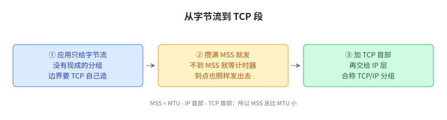
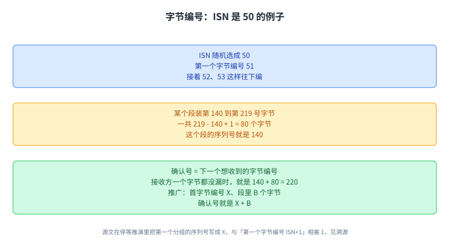
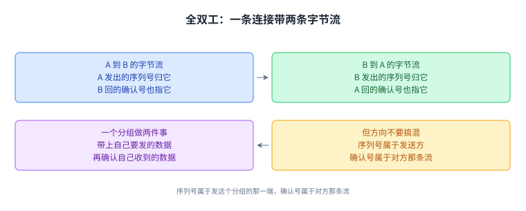
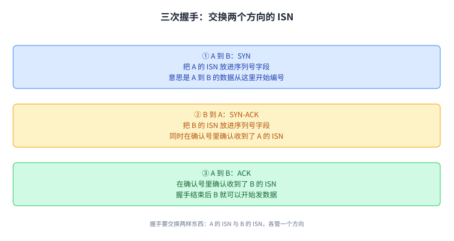
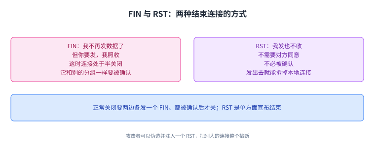
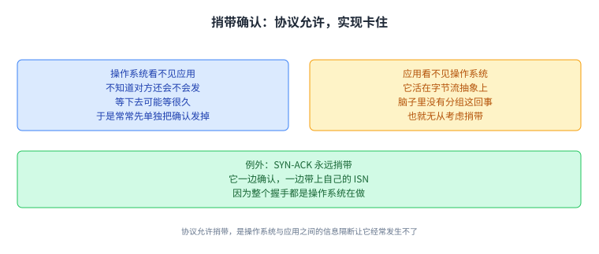
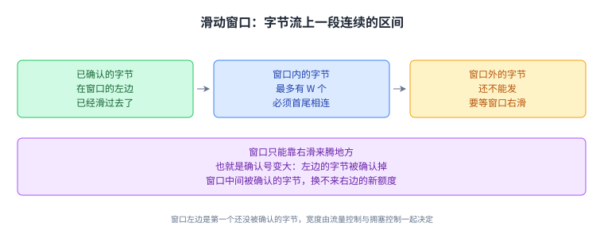
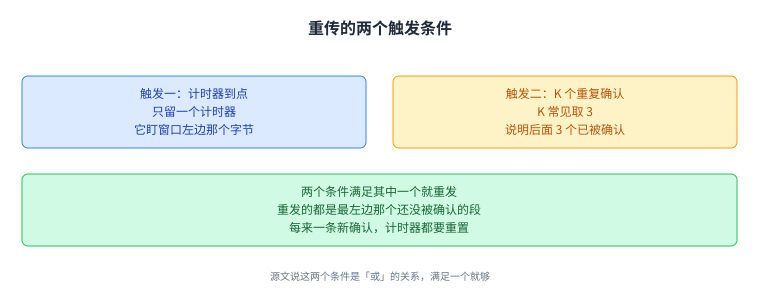
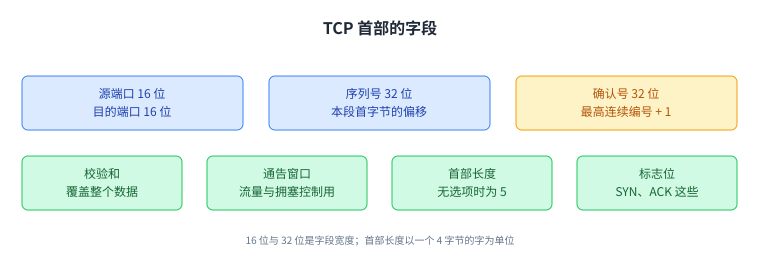

+++
title = "TCP 的实现：字节、状态与首部"
lecture = 20
slug = "tcp-implementation"
status = "draft"
source_kind = "textbook"
source_url = "https://textbook.cs168.io/transport/tcp-implementation.html"
source_title = "TCP Implementation"
output_mode = "explanation"
+++

> 来源课程：UC Berkeley CS168 Computer Networks（教材 CS 168 Textbook）；
> 对应内容：Transport 之 TCP Implementation（<https://textbook.cs168.io/transport/tcp-implementation.html>）；
> 上游许可：教材站在站根页声明 CC BY-SA 4.0（第二人复核见 `docs/audit/license-cs168-second-review.md`）；
> 本文由 CourseLingo 原创撰写：**按该节的推进顺序**重新讲解，关键句给出英文原文与中译，**不逐句全译**，配图全部自绘、不转载原图；
> 本文非官方材料，CourseLingo 与 UC Berkeley 及课程教学团队无隶属关系；如与原文有出入，以原文为准。

## 一、从字节流到 TCP 段

上一讲把 TCP 当成一套设计来谈：确认、计时器与往返时间怎么配合，窗口怎么给在途数据加上限，流量控制与拥塞控制各管什么，都讲过一遍了。这一讲要解决的是把这套设计落到代码里时冒出来的问题：应用交给 TCP 的是一串没有边界的字节，里面并没有一个现成的[[term:packet]]。

> "In order to form packets out of bytes in the bytestream, we'll introduce a unit of data called a TCP segment."
> （为了把字节流变成一个个分组，我们引入一个数据单位，叫 TCP 段。）

先给一个直觉的比方：发送方的 TCP 实现拿一个桶，应用每交来一个字节就往里放一个；桶装到某个固定上限，就把这桶封成一个 [[term:tcp-segment]]发出去，再换一个空桶等着。源文把那个上限叫固定最大段长度。

桶有可能填不满。应用写完一句话就停手，剩下的字节永远等不来。所以源文给的第二个机制是[[term:timer]]：每开始填一个新的空段就启动一个计时器，到点还没填满也照样把这段发出去。

发之前，发送方的 TCP 实现给这段数据加上 TCP [[term:header]]，里面放序列号、端口号这类元数据；加完交给 IP 层，IP 层再补上自己的首部。段加上这两层首部之后，有时被叫作 TCP/IP 分组，也可以等价地说：这是一个载荷为「TCP 首部加数据」的 IP 分组。

**MSS 该定多大**？源文把它和 [[term:link]]上的 MTU 挂钩：IP 分组的大小受链路的[[term:maximum-transmission-unit]]限制，而 IP 分组里还得装下 IP 首部与 TCP 首部，所以[[term:maximum-segment-size]]（maximum segment size，最大段长度，源文简称 MSS）比 MTU 小一点点。照录源文的式子：

MSS (TCP segment limit) = MTU (IP packet limit) - IP header size - TCP header size

把式子读一遍就明白了：MSS 总是比 MTU 小一点，而小掉的那块正是两层首部。

这张图就是这一节的顺序：字节进桶、桶满或者到点就封装、加首部后交给 IP 层。值得记住的是分组边界由 TCP 自己造，应用从头到尾不知道有「段」这个单位。

## 二、每个字节都有一个编号

上一节把字节攒成了段，接着要回答的是这些段怎么编号。源文在这里改了一个关键约定：编号的单位从分组换成了字节。

> "In practice, instead of numbering individual segments, we assign a number to every byte in the bytestream."
> （实践中，我们不给一个个段编号，改成给字节流里的每一个字节编号。）

于是每个段的[[term:header]]里放的是本段第一个字节的编号，这个编号就是[[term:sequence-number]]。接收方靠它把段排回字节流里的位置。

字节流要有起点，这个起点叫[[term:initial-sequence-number]]（initial sequence number，初始序列号，源文简称 ISN）。源文的规则是：第一个字节编号 ISN+1，第二个 ISN+2，第三个 ISN+3。

确认也跟着换成字节。[[term:acknowledgment]]号的含义，源文给了两个等价的说法：一是「到这个编号为止（不含它）的字节我都收到了」，二是「这是我最想收到的下一个字节」。

> "I have received all bytes up to, but not including, this number."
> （到这个编号为止的字节我都收到了，但不包括这个编号本身。）

源文举的例子：ISN 随机选成 50，那么头几个字节编 51、52、53；某个段装的是第 140 到第 219 号字节（含两端），这个段的序列号就是 140；如果接收方此前没漏过任何一个字节，它可以回一个确认号 220。

这个例子的算术值得动手验一遍：第 140 到第 219 号字节一共 219 - 140 + 1 = 80 个，而 140 + 80 = 220，正好是那个确认号。源文把它推广成：首字节编号 X、段里 B 个字节，则这个段盖住 X 到 X+B-1 号，确认号回 X+B。

源文还顺带走了一遍窗口为 1 的[[term:stop-and-wait]]：ISN 是 X，第一个分组序列号 X，第一条确认号 X+B，第二个分组序列号 X+B，第二条确认号 X+2B，第三个分组序列号 X+2B。注意这里和上面「第一个字节编号 ISN+1」差了 1，见溯源。

ISN 为什么随机选？源文给了两层理由。历史上，设计者担心所有字节流都从 0 开始编号会撞车：一条连接从 0 开始发，发送方崩溃重启后又从 0 开始，接收方就分不清手里这个 0 号分组是崩溃前那条连接留下的，还是新连接发来的。实践中，随机的理由换成了安全：编号如果可预测，攻击者能推出来，进而伪造看起来来自发送方的分组。

这一节的落点是编号单位变了：段的序列号就是段里第一个字节的编号，确认号是「下一个想收到的字节编号」。后面讲滑动窗口和重传都是在算同一个数。

## 三、状态放在两端

TCP 也不是「每个分组自己管自己」那一套。源文说，TCP 需要发送方和接收方都维护状态，而且状态存在实现 TCP 的两端主机上（[[term:end-host]]，end host，端主机），网络里不存。

发送方要记住哪些字节已经发出、还没被确认，还要维护一堆计时器，比如「不满的段什么时候发」那个、以及「什么时候重发」那个。接收方要记住那些乱序到达、还不能交给应用的字节。

有了状态，每一条字节流就叫一条连接（源文里 connection 与 session 两个词并用），TCP 因此是[[term:connection-oriented]]的协议。第三层可以把每个分组单独拿出来看，TCP 不行：两端得先把连接建起来、把状态初始化好，才能开始送数据；用完还得有个拆除动作，把两端为状态占的内存还回去。

这一节记住一句话就够：TCP 的开销里有一块是内存，两端各存一份，所以连接要有头（握手）也要有尾（拆除）。

## 四、全双工

两个方向上常常都有话要说。源文把这件事说得很直接：

> "both end hosts in the connection can send and receive data simultaneously, in the same connection"
> （同一条连接里，两端主机可以同时发送和接收数据。）

这就是[[term:full-duplex]]。做法是不再指定一个发送方和一个接收方，而是让一条连接带两条字节流：A 到 B 一条，B 到 A 一条。每个分组的首部里既有序列号也有确认号，两者各归各的方向：序列号说的是「我这条流上的字节」，确认号说的是「我从你那收到的字节」。

于是「这个分组的序列号是谁的」有了明确答案：属于发这个分组的那一端的字节流。分不清方向的时候，回到这一句就能分清。

## 五、三次握手

连接要建起来，就得让两端在两个方向各自的起始编号上取得一致。

> "the two hosts perform a three-way handshake to agree on the ISNs in each direction."
> （两台主机做一次三次握手，就两个方向各自的 ISN 达成一致。）

这个[[term:three-way-handshake]]由三个报文组成。第一个从 A 到 B，叫 SYN，把 A 的 ISN 放进序列号字段，意思是「A 到 B 的数据从这里开始编号」。第二个从 B 到 A，叫 SYN-ACK，把 B 的 ISN 放进序列号字段，同时在确认号里确认它收到了 A 的 ISN。第三个又从 A 到 B，叫 ACK，在确认号里确认它收到了 B 的 ISN。

看完这三个报文，上一节那条「第一个字节编号 ISN+1」就有出处了：我发出一个 ISN，你回我的确认号是 ISN+1，意思是「这个 ISN 我收到了，接下来等你编号 ISN+1 的第一个字节」。

源文在这一节末尾写了一句握手结束之后 B 就可以开始发数据，它只写了 B，见溯源。

三次握手的账可以这么算：SYN 花掉一个编号位（ISN 本身），ACK 里的 ISN+1 是这次握手的收据，也正好是第一条数据字节的编号。

## 六、两种结束方式

源文说结束连接有两条路。

正常的一条是 FIN。我做完了发送，就发一个 FIN，含义是：

> "I will not send any more data, but I will continue to receive data if you have any more to send."
> （我不再发数据了，但你如果还有数据要发，我照收。）

这时连接处于[[term:half-closed]]状态。这个 FIN 和别的分组一样要被确认。等对面也把数据发完、也发一个 FIN，这个 FIN 被确认之后，连接就关掉了。

另一条路是 RST，用来单方面、不经对方同意就断：

> "I will not send or receive any more data."
> （我不再发也不再收任何数据。）

RST 不需要被确认，发出去就可以把本地连接拆掉。源文说它通常在主机遇到错误、没法继续收发时使用，并提醒：如果 RST 发生时那台主机崩溃、状态丢了，所有在途数据都会丢。还有一种情形，我已经发了 RST，对方还在给我发数据，那么只要我还有能力，就会不断回 RST，反复试着把这条连接终结掉。

RST 也能被拿来干坏事：攻击者伪造并注入一个 RST，就能把一条连接整个掐断，源文把这叫用它来审查连接。

完整的 TCP 状态图很复杂，中间态很多，源文举了两个例子：发了 SYN 正等 SYN-ACK；收到了 FIN、也发了自己的 FIN、正等自己的 FIN 被确认。源文明确说这些笔记不需要读者读懂完整状态图，也给了简化版：从关闭态开始，发 SYN，收到 SYN-ACK 回一个 ACK，进入已建立；发完数据发 FIN 并收到 ACK；最终收到对方的 FIN，连接又回到关闭。

两条路的差别在「要不要对方同意」：FIN 是商量出来的半关闭，可以一边关一边继续收；RST 是单方面宣布结束，连在途数据一起放弃。

## 七、捎带确认

全双工带来一个顺水推舟的机会：一个分组既能确认对方的数据，又能带上自己要发的新数据。

接收方拿到一个分组、自己暂时没有数据要发时，有两个选择。一是立刻单独发一条确认；二是压着不发，等自己有数据要发的时候，再把确认和新数据一起发出去。后一种就叫[[term:piggybacking]]。

源文紧接着解释了为什么实践中经常不捎带，理由藏在 TCP 的实现位置里：TCP 在操作系统里，跟应用是分开的。

从操作系统这边看，它不知道应用在干什么。收到一个分组时，它判断不了应用什么时候才会有新数据要发，甚至不知道应用到底还会不会有数据要发；等下去就可能等很久，捎带于是变成了拖延。

从应用这边看，它不知道操作系统在干什么。应用活在字节流的抽象上，脑子里没有分组这回事，也就无从考虑要不要捎带。

还有一层：操作系统并不是让所有程序同时跑，CPU 在不断切换进程（源文在这里让读者回想计算机体系结构课，比如 UC Berkeley 的 CS 61C）。要是每到一个 TCP 分组就把 CPU 从当前工作里打断，去把分组交给应用、再给应用一点时间回应，那就太傻了。所以常见的结果是：操作系统在应用有机会捎带之前，已经先把确认单独发出去了。

源文给了一个永远会捎带的例外：握手里的 SYN-ACK。它一边确认，一边捎带上自己的 ISN。这里没有上面那个问题，因为整个握手都是操作系统在做，应用根本没在想 SYN、SYN-ACK 这些事。

这一节的分界不在协议设计上，而在实现的分工上：协议允许捎带，操作系统与应用之间的信息隔断让它经常发生不了。

## 八、滑动窗口

之前讲分组的时候，[[term:window]]指的是同一时刻最多多少个分组在途。换成字节之后，源文重新定义了它：

> "we'll define the sliding window as the maximum number of contiguous bytes that can be in flight at any given time."
> （我们把滑动窗口定义成同一时刻允许在途的最大连续字节数。）

这里的 contiguous（连续的）是这次改动真正带来的新限制。按分组算的时候，[[term:in-flight]]的可以是 5、7、8 这种不连续的分组；按字节算，在途的字节必须首尾相连、中间不留空洞，于是在字节流上圈出一段区间，也就是[[term:sliding-window]]。

窗口的左边是第一个还没被确认的字节，由接收方给出的确认号决定。从这个字节起，往后 W 个字节一直到窗口右边，都可以在途。就算窗口里靠中间的一些字节已经被确认，也不能把窗口右边往外挪去发更多字节。源文说得明确：唯一的办法是窗口向右滑，也就是确认号变大。

窗口有多宽，由[[term:flow-control]]与[[term:congestion-control]]一起限制。就流量控制而言，宽度取自接收方通告的[[term:advertised-window]]，而接收方是照自己那端还有多少[[term:buffer]]空间来决定通告多少的。

「连续」这两个字是这一节最容易被略过的地方：它把窗口从一个数字变成了字节流上的一段区间，也解释了为什么中间被确认的字节换不来右边的新额度。

## 九、重传的两个触发条件

源文说，[[term:retransmission]]有两个触发条件，只要满足一个就要重发。

第一个是计时器：数据过了一段时间还没被确认。按分组算的时候，每个分组都自带一个计时器，到点还没被确认就把那个分组重发。换成字节之后，源文改了做法：不再每个字节一个、也不再每个分组一个，而是只留一个计时器，它盯的是第一个还没被确认的字节，也就是窗口的左边。

> "instead of one timer per byte or per packet, we will only have a single timer, corresponding to the first unacknowledged byte (left side of the window)"
> （不再每个字节或每个分组一个计时器，我们只留一个计时器，对应第一个还没被确认的字节，也就是窗口左边那个。）

这个计时器到点，重发的是最左边那个还没被确认的段。计时器有多长跟[[term:round-trip-time]]有关，而往返时间是用「发出数据到收到确认」之间的时间量出来估的。源文还提醒：每来一条新的确认，窗口跟着变，这个计时器就要重置。

第二个条件来自一条推断：如果我已经开始收到后面分组的确认，那说明中间那段多半丢了。这条思路上一讲已经用过，也就是用后面的确认更早发现丢包，这一讲只是把它换到字节上。用累积确认时，判据是收到 K 个[[term:duplicate-ack]]，K 常见取 3。源文说这 3 个重复确认意味着后面 3 个分组已经被确认了。换成字节之后做法不变：收到 K 个重复确认，就重发最左边那个还没被确认的段。

两个条件一个看时间、一个看确认的样子，满足任一就重发；而且重发的都是同一个东西，也就是窗口左边那个还没被确认的段。

## 十、TCP 首部

最后把首部字段过一遍，顺序照源文。

源端口与目的端口各 16 位，用来指认两端分别是哪个应用（[[term:port-number]]，port number，端口号；第 18 讲讲它的分工）。

序列号 32 位，源文说它是「本分组的第一个字节的字节偏移」；确认号也是 32 位，源文说它是「收到过的最高连续序列号加一」。这两个说法和第二节的字节编号是一回事：最高连续字节编号加一，正是「下一个想收到的字节编号」。

[[term:checksum]]覆盖的是整个数据，不只是首部，用来发现数据被损坏。这一点和 IP 首部不同，第 17 讲说过 IP 的校验和只覆盖首部。

通告窗口也在这里，用来支撑流量控制与拥塞控制。

首部长度字段的单位是 4 字节的字，源文说没有额外选项时它是 5。算一下就是 5 × 4 = 20 字节，这正好能填进第一节那条 MSS 式子里的 TCP 首部大小。

然后是[[term:flag]]。源文先说了一句这些笔记里有四个相关标志位，但接着只解释了其中两个，另外两个（FIN 与 RST）是第六节讲的，见溯源。

SYN 标志在主机发送自己的 ISN 时打开，源文说它通常只在三次握手的前两个报文里被打开。ACK 标志在确认号有意义、真的用来确认数据时打开；如果我只想发数据、没有要确认的东西，就可以把它关掉，等于告诉对面别看确认号。

剩下几个本课不展开的字段也点一下。首部长度之后有 6 个保留位，永远是 0，可以放心忽略。紧急指针可以把某些字节标记为紧急，让接收方尽快把数据交给应用，源文说这是个历史字段，不再往下讲。首部末尾还可以附加选项，那会让首部变长，本课忽略；源文举了一个例子：想实现全信息确认的话，有一个叫选择性确认（SACK）的选项可以加进首部。

首部这一节最好连回前面：序列号与确认号是第二节的字节编号落到字段上，通告窗口是第八节的窗口落到字段上，而校验和覆盖整个数据这一点，是这个首部与 IP 首部最容易记混的差别。

## 十一、脉络回顾

这一讲把上一讲的 TCP 设计落到了字节上。分组边界由 TCP 自己造：发送方把字节攒成段，攒满固定的最大段长度就发，或者等那个「开始填新段就启动」的计时器到点也发；最大段长度等于链路的 MTU 减掉 IP 首部与 TCP 首部。

编号的单位从分组换成字节。字节流有随机选的初始序列号，第一个字节编 ISN+1；确认号是「下一个想收到的字节编号」，用的是累积确认。有了字节编号，例子里的数就能一眼验算：第 140 到第 219 号共 80 个字节，加起来正好是确认号 220。

状态放在两端：发送方记住哪些字节发了还没被确认，还要维护计时器；接收方记住乱序到达、还不能交付的字节。所以每条字节流是一条连接，TCP 是面向连接的，连接要建（三次握手，就两个方向的 ISN 达成一致）也要拆（FIN 商量着半关闭，RST 单方面掐断）。

全双工让一条连接带两条字节流，一个分组可以同时带数据和确认，这就是捎带确认。滑动窗口把「在途多少个分组」换成了「在途多少连续字节」，窗口只能靠确认号变大而右滑，宽度由流量控制与拥塞控制一起定，其中流量控制看接收方通告的窗口。重传有两个触发条件，满足一个就够：盯住窗口左边那个字节的单个计时器到点，或者收到 K 个重复确认。首部层面则是 16 位端口、32 位序列号与确认号、覆盖整个数据的校验和、通告窗口、以 4 字节为单位的首部长度（无选项时为 5）、标志位，以及本课不展开的保留位、紧急指针和选项。

## 读完应该能回答

1. TCP 段是怎么从字节流里攒出来的，最大段长度与 MTU、两层首部是什么关系。
2. 字节编号与确认号怎么对应，ISN 为什么随机选，ISN+1 又是从哪来的。
3. 三次握手交换的是哪两样东西，FIN 与 RST 结束连接的差别在哪。
4. 滑动窗口里的「连续」限制了谁，窗口为什么只能靠确认号变大而右滑。
5. 重传的两个触发条件，以及它们各自盯着窗口的哪个位置。

## 溯源

- 对应：UC Berkeley CS168 Computer Networks，教材 Transport 之 TCP Implementation（<https://textbook.cs168.io/transport/tcp-implementation.html>）
- 教材：CS 168 Textbook（UC Berkeley CS168 课程教材），原文链接同上
- 授权依据：教材站在站根页声明 CC BY-SA 4.0；本文为本仓库原创中文讲解，按该节顺序重讲，关键句给出英文原文与中译，**未逐句全译**，配图自绘
- 结构说明：本讲章节顺序**跟随教材该节的推进顺序**（TCP 段 → 序列号 → 状态 → 全双工 → 握手 → 结束连接 → 捎带 → 滑动窗口 → 重传 → 首部），教材这 10 个小节与本页 10 个正文章节一一对应，每节配 1 张自绘图。教材另有明确划掉的三块内容：完整 TCP 状态图（源文写这些笔记不需要读者读懂它）、首部选项、紧急指针，我们照实按不展开处理，没有替它补内容
- **照录（源文自身的算术不一致，已就地说明）**：源文「序列号」一节先写发送方把第一个字节编号为 ISN+1，同一节后面又写 ISN 是 X、窗口为 1 时第一个分组的序列号是 X，两处相差 1。我们两处都照录，并在第二节说明；按源文自己的确认规则（确认号等于首字节编号加该段字节数）以及握手一节「确认号是 ISN+1」这条，这段停等推演都应写作 X+1、X+B+1、X+2B+1。源文那段的相对关系（X、X+B、X+2B 逐个递增 B）自洽，错的只是起点
- **照录（源文自身措辞与计数上的三处小疵，均已就地说明）**：握手一节把 SYN-ACK 写成 acknowledges that B has received of A's ISN，多一个 of，我们引用时按原样保留、中译按语义补足；同节末尾只写握手结束后 B 可以开始发数据，没有提 A；首部一节写这些笔记里有四个相关标志位（There are four relevant flags for these notes），但该节只解释了 SYN 与 ACK，FIN 与 RST 出现在更早的「结束连接」一节，我们照录这句话并指出另两个在哪一节（把这四个理解成 SYN、ACK、FIN、RST 是我们的读法，源文没有把这四个名字并列写出来）
- **我们补的（源文没有写）**：MSS 的算术示例（无选项时 TCP 首部 20 字节，等于 5 个 4 字节的字；配上 20 字节的 IPv4 首部与 1500 字节的 MTU 得到 1460），源文只给公式、没有出现任何数字；「早发一点首部开销占比更高、晚发一点交互式应用等得久」这个取舍，源文只给计时器机制、没有谈代价；把「连续」单列为滑动窗口一节的新限制并说明中间字节被确认也换不来右边额度，是把源文的 contiguous 与 slides to the right 两句合并陈述；「分组边界由 TCP 自己造，应用不知道有段这个单位」这句总结
- 术语取舍：`TCP segment` 译作「TCP 段」，`maximum segment size` 译作「最大段长度」，`piggybacking` 译作「捎带确认」，`half-closed` 译作「半关闭」；本讲核心词已登记进 `glossary.toml`（tcp-segment / maximum-segment-size / maximum-transmission-unit / initial-sequence-number / connection-oriented / full-duplex / three-way-handshake / sliding-window / piggybacking / half-closed / retransmission / flag，共 12 条）
