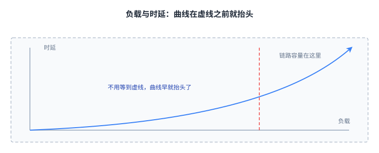
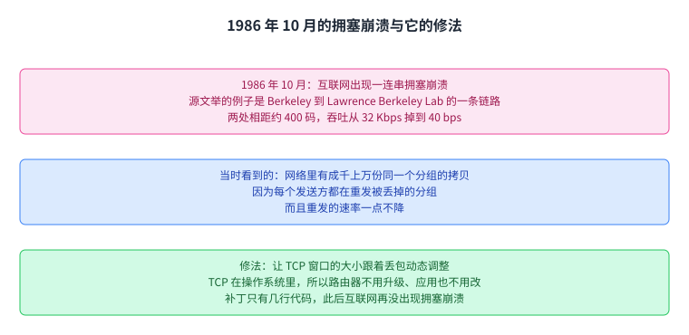
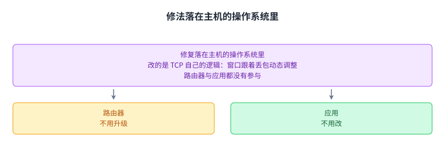
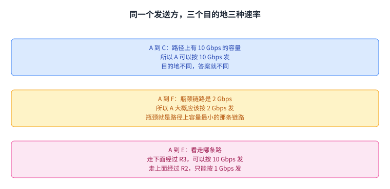
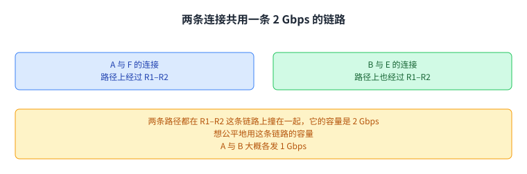
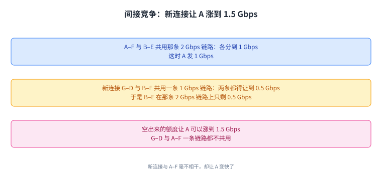
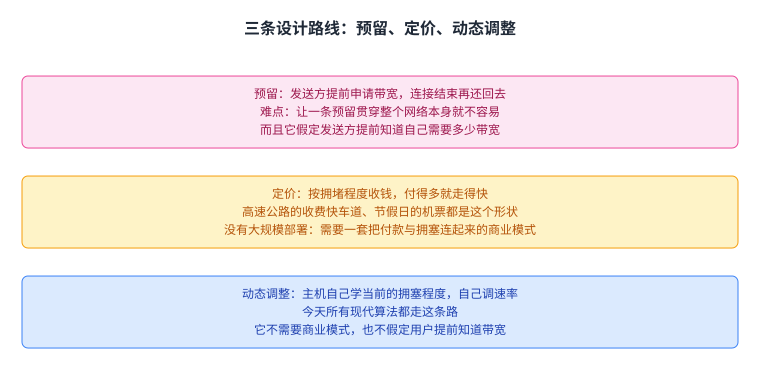

+++
title = "拥塞控制原理：发送速率该由谁说了算"
lecture = 21
slug = "congestion-control-principles"
status = "draft"
source_kind = "textbook"
source_url = "https://textbook.cs168.io/transport/cc-principles.html"
source_title = "Congestion Control Principles"
output_mode = "explanation"
+++

> 来源课程：UC Berkeley CS168 Computer Networks（教材 CS 168 Textbook）；
> 对应内容：Transport 之 Congestion Control Principles（<https://textbook.cs168.io/transport/cc-principles.html>）；
> 上游许可：教材站在站根页声明 CC BY-SA 4.0（第二人复核见 `docs/audit/license-cs168-second-review.md`）；
> 本文由 CourseLingo 原创撰写：**按该节的推进顺序**重新讲解，关键句给出英文原文与中译，**不逐句全译**，配图全部自绘、不转载原图；
> 本文非官方材料，CourseLingo 与 UC Berkeley 及课程教学团队无隶属关系；如与原文有出入，以原文为准。

## 一、拥塞为什么有害

上一讲把 TCP 落到了字节上，还剩一个问题没答：发送方一次能发多快。这一讲要解决的就是这个速率由谁定、怎么定，围绕它的机制后来被叫作[[term:congestion-control]]。故事从最基础的一步讲起：速率要是不对，网络里会发生什么。

第 1 讲讲过的情形可以直接拿来用。很多[[term:packet]]同一时间到了某个[[term:router]]，而它们又都要走同一条[[term:link]]，路由器只能先发一个，把其余的放进队列里等着。

这还不只是「同一个瞬间」的问题。只要分组的输入速率长期超过这条链路能维持的输出速率，路由器就跟不上来货的节奏。这样的路由器就是拥塞的，它得把分组存进队列里排队；排队会带来时延。队列本身要是也满了，而分组还在进来，分组就会被丢掉，也就是发生[[term:packet-loss]]。

源文配了一张图来讲这件事：横轴是负载，纵轴是时延，虚线画的是这条链路的容量，也就是它最大的负载。

> "The dotted line represents the link's capacity (maximum load). As we increase the load, packets get more delayed."
> （虚线代表链路的容量，也就是最大负载。负载越加越重，分组的时延就越大。）

从那张图里能读出两件事。一件是当到达是突发的，我们实际上用不满链路的容量，只能在负载与时延之间找一个合适的[[term:trade-off]]。另一件更要紧：曲线在到达那条虚线之前就已经往上走了。

源文把第二件事说得很直白：即使什么都没被丢掉，排队已经在拖慢分组了；等到我们真的用满容量、开始丢包的时候，队列早就造成了非常大的时延。

于是这一节的账可以这么记：拥塞的代价不是从丢包那一刻才开始收的。链路还没满，时延的账单就已经在涨了。

## 二、1986 年那次拥塞崩溃

对「该发多快」这个问题，早期 TCP 的态度是基本不管。源文说，1980 年代的 TCP 没有实现任何拥塞控制，发送速率只被[[term:flow-control]]限制，而流量控制看的是接收方[[term:buffer]]还有多大地方。

反应的方向也反了。分组被丢掉之后，发送方会把同一份拷贝一遍又一遍地重发，速率一点不降。源文说更聪明的做法是慢下来，既避免继续丢包，也别让这些多余的拷贝继续堵住网络，可是早期的实现不这么做。

事情在 1986 年 10 月闹到了明处。[[term:internet]]开始出现一连串[[term:congestion-collapse]]，容量大幅下降。源文举的例子是 UC Berkeley 到 Lawrence Berkeley Lab 之间的一条链路，两处相距约 400 码，吞吐量从 32 Kbps（源文自己写明等于每秒 32,000 比特）掉到 40 bps。

当时 Michael Karels（UC Berkeley 的本科生）与 Van Jacobson（Lawrence Berkeley Lab 的研究者）正在做 Berkeley Unix 的网络栈。他们看出网络里存在成千上万份同一个分组的拷贝，原因是每个发送方都在重发被丢掉的分组。

他们的修法是对 TCP 本身动刀：让[[term:window]]的大小跟着丢包动态调整，而窗口管的就是发包的速率。

> "Their fix was a modification to TCP itself, where the window size (which dictates the rate of sending packets) is dynamically adjusted in response to packet loss."
> （他们的修法是修改 TCP 自身：窗口大小决定发包的速率，它现在会跟着丢包动态调整。）

由于改的是 TCP 的逻辑，而 TCP 的实现就在操作系统里，所以路由器不用升级，应用也不用改。源文把这件事当作互联网设计「临时凑数」的一例：补丁只是 BSD 的 TCP 实现里多出来的几行代码，它管用，于是很快被采用。此后拥塞控制被大量研究、也有了不少改进，但当年那个补丁里的核心想法一直留到今天；而互联网从那以后没有再出现过拥塞崩溃。

这一节的账也很直白。一边是一条 400 码长的链路把吞吐掉到 40 bps，另一边是操作系统实现里的几行代码。能在主机这一侧解决，是因为拥塞的源头本来就在主机身上：是它发得太快了。

## 三、拥塞控制为什么难

回到那个看似可以查表的问题：发送方到底该发多快。源文用一个网络图说明它查不了。

> "At what rate should host A send traffic?"
> （主机 A 应该以多快的速率发送流量？）

第一个变量是目的地，速率跟着它变。A 与 C 通信时，路径上有 10 Gbps 的容量，A 就可以按 10 Gbps 发。

A 与 F 通信就不一样了。这条路上容量最小的那一条是[[term:bottleneck-link]]，它是 2 Gbps，所以 A 大概应该按 2 Gbps 发。

A 与 E 通信则取决于走哪条路。如果流量走下面那条、经过 R3，A 可以按 10 Gbps 发；如果走上面那条、经过 R2，A 就只能按 1 Gbps 发。

第一层结论是：拥塞控制算法得想办法知道这条路上各条链路的带宽、瓶颈在哪。这还不够。网络图会随时间变，链路会加进来，也会下线；所以只学一次不行，算法要能适应拓扑的变化。

第二个变量是别人。前面一直假设 A 是网上唯一在发流量的主机，可以吃满每条链路的容量。要是别的连接也在用带宽呢。

源文给的例子是：A 与 F 有一条连接，B 与 E 有一条连接。发送方不同、接收方不同，看着毫无关系，可它们的路径在网络里共用了一条链路，那条链路的容量是 2 Gbps（源文的图在 R1–R2 这条边上标着 2）。想让两条连接公平地用这条链路的容量，A 与 B 大概应该各发 1 Gbps。

再插进一条新连接麻烦就来了。源文先指出 G-D 与 B-E 也共用一条链路，那条链路的容量是 1 Gbps（图上 R2–R4 这条边标着 1），于是这两条连接都得把速率降下来，各 0.5 Gbps。

接着回看 A-F 与 B-E 共用的那条 2 Gbps 链路：B-E 在这里只用到 0.5 Gbps，空出来的额度让 A 可以把速率提到 1.5 Gbps。

这里发生的事值得停一下。G-D 这条新连接与 A-F 没有共用任何一条链路，A-F 的速率却因为它涨了。连接之间会间接地互相影响，哪怕两条连接一条链路都不共用。

源文的收束是：发送方要定速率，得考虑目的地、到目的地的路径、路径上共用链路的那些连接、与那些连接共用链路的连接（也就是间接竞争），如此继续下去。网上所有连接的速率互相依赖，这就是它难的地方。

再往根上说，拥塞控制是一个资源分配问题。带宽是有限资源，每条连接都想要一份，我们要决定给哪条连接分多少。资源分配在计算机科学里是老问题，CPU 调度、内存分配都算。但它与那些问题有两处不同：一是一条连接分到多少会波及全局，别的连接都会被牵动；二是每当有连接建立或拆除，分配就得跟着重算。所以它比传统的资源分配问题更复杂，源文甚至直说，我们连一个能把它定义清楚的形式化模型都还没有。

还有一处更根本的差别。传统资源分配里，算法提前知道资源是什么（比如 CPU 时间）、任务有哪些（比如进程）；而全网没有一个总控能看见整个网络来分配资源。解法必须是去中心化的，每个发送方自己决定自己那份，尽管所有人的决定高度互相依赖。

这一节把难处数了一遍：目的地、路径、别人、别人的别人，再加上拓扑会动、没有总控。任何一个发送方要做的选择，都落在一张会动、又互相牵连的网里。

## 四、一个好算法要什么

从资源分配的角度看，源文说一个好的拥塞控制算法要满足三个目标。

头一个是效率。链路不该被压垮，时延与丢包要尽量小；反过来，链路也不该闲着，能用上的容量要尽量用上。

第二个是[[term:fairness]]。源文说公平的正式定义后面再给，先粗略地说：每条连接分到的可用容量应该一样多。

第三个目标是在前两个之间取得好的权衡。只优化一个、牺牲另一个，得到的都是糟糕的解法。源文举了两个极端：想让链路利用率最大化，可以让所有人拼命快发，结果是拥塞；想要丢包最少，可以让所有人拼命慢发，结果是容量闲置。

从系统实现的角度看，还有几条要求。算法要有[[term:scalability]]：连接数、流量涨上去之后它还得成立。

它还得是去中心化的，并且能适应网络的变化，比如拓扑变了、连接被建起来又被拆掉。

所以「好」在这里是几件事叠在一起：分得有效率，分得公平，两者之间拿得住平衡，而且要在没有总控、节点还在动的网络上做到。第五节列的几条路线，就是在这些条件下挑出来的不同答案。

## 五、解法的空间

一开始提到的那次修复，用的是给操作系统里的 TCP 打补丁。如果能把互联网推倒重来，还有别的设计吗。源文列了两条备选路线，再说明为什么今天所有现代算法走的是第三条。

头一条是预留（reservations）。发送方提前申请带宽，连接结束再把它还回去。源文提到，维持一条贯穿全网的预留本身就有许多技术难关；它还有一个毛病：假定发送方提前就知道自己需要多少带宽，而这件事不一定成立。

第二条是[[term:pricing]]。源文拿高速公路的收费快车道打比方：那条道只给愿意付钱的车走，价格随高速拥堵程度变，车少的时候很便宜，堵起来就贵。机票也是同一个形状，节假日比平时贵。

搬到互联网上，就是[[term:isp]]可以在你的浏览器里加一个按钮，多付钱就换来更快的速度，价格随网络拥堵程度浮动；路由器则优先转发付钱多的用户的[[term:packet]]，丢掉不付钱的。源文说关于互联网拥塞定价是有研究的，也有经济学家主张：既然[[term:bandwidth]]是稀缺品，让市场结构来决定会得到最优解。它至今没有大规模部署，原因是要有一套商业模式，把「付了钱」和「拥塞」连起来。

第三条就是今天所有现代算法走的路：[[term:dynamic-adjustment]]。主机动态地学当前的拥塞程度，再据此调整自己的发送速率。源文认为它实用是因为它容易推广：既不需要定价那一套商业模式，也不需要预留那条「用户提前知道自己要多少带宽」的假定。

动态调整要成立，得靠所有主机守规矩。TCP 需要网上每个人配合，才能把资源公平地分下去；比如一条新连接开始用这些链路时，别的连接要慢下来，让出带宽。

在动态调整这一类里，源文又分了两大类。一类是[[term:host-based-congestion-control]]：发送方自己盯着表现、自己调速率。这类算法完全在发送方实现，路由器不提供任何特殊支持。当年对 TCP 的那次修改就属于这一类，今天仍被广泛部署。

另一类是[[term:router-assisted-congestion-control]]：路由器把拥塞信息明确地送回发送方，帮它调速率。拥塞本来发生在路由器上，所以路由器有条件提供这类信息。这几年路由器协助的算法有部署，[[term:data-center]]里尤其多。送多少信息各家不一：有的只送一个比特表示「拥塞了」，有的送得很细，比如直接告诉发送方该用哪个速率。

两类有一个共同点：拥塞信号都来自路由器那边，差别在形式。路由器协助是路由器主动发一条关于自己拥塞程度的消息；主机侧收不到这种明确反馈，只能从隐含的线索里推断路由器拥塞了，比如分组被丢掉，或者被拖慢了。

源文在这一节的结尾交代了站位：在这张解法分类里，本课程聚焦动态调整；在动态调整里，再聚焦主机侧。下一讲要把主机侧算法的设计铺开，这一讲先把「为什么需要它、它难在哪、有哪几条路」讲完。

## 读完应该能回答

1. 拥塞为什么在丢包之前就已经有害，链路容量的虚线与曲线是什么关系。
2. 1986 年那次拥塞崩溃发生了什么，修法为什么可以只落在主机一侧。
3. 定发送速率时为什么要看目的地、路径与共用链路的连接，间接竞争指的是什么。
4. 好的拥塞控制算法要满足哪几个目标，两个极端反例分别是什么。
5. 预留、定价、动态调整三条路的差别，动态调整为什么被采用。
6. 主机侧与路由器协助的区别，拥塞信号各自以什么形式到达发送方。

## 脉络回顾

这一讲先算了拥塞的代价。输入速率超过链路能维持的输出速率，路由器就只能排队，时延跟着涨；队列满了再进来的分组被丢掉。源文那张图的关键在虚线的左边：曲线在到达链路的容量之前就开始抬头，所以丢包还没发生，时延的账单已经在涨了。

接着讲了这段历史。1980 年代的 TCP 没有拥塞控制，速率只受流量控制约束；丢包之后发送方还在原速重发拷贝，于是 1986 年 10 月出现了拥塞崩溃，Berkeley 到 Lawrence Berkeley Lab 的那条链路吞吐从 32 Kbps 掉到 40 bps。Karels 与 Jacobson 的修法是让窗口跟着丢包动态调整，因为改的是操作系统里的 TCP，路由器和应用都不用动。

然后是难处。速率取决于目的地、路径、路径上共用链路的连接，还取决于与那些连接共用链路的连接，也就是间接竞争；再加上拓扑会变、没有总控，所有连接的速率互相依赖，这本质是一个去中心化的资源分配问题。

最后是目标与解法空间。好算法要在效率与公平之间取得平衡，还要可扩展、去中心、能适应变化。备选路线有预留与定价，它们分别卡在「贯穿全网的预留太难」与「需要一套商业模式」上；今天用的是动态调整，而本课程聚焦其中的主机侧算法。

## 溯源

- 对应：UC Berkeley CS168 Computer Networks，教材 Transport 之 Congestion Control Principles（<https://textbook.cs168.io/transport/cc-principles.html>）；教材为 CS 168 Textbook，抓取时间 2026 年，原始 HTML 35,312 字节
- 授权依据：教材站在站根页声明 CC BY-SA 4.0；本文为本仓库原创中文讲解，按该节顺序重讲，关键句给出英文原文与中译，**未逐句全译**，配图自绘
- 结构说明：本讲章节顺序**跟随教材该节的推进顺序**（拥塞为何有害 → 拥塞简史 → 为何难 → 好算法的目标 → 解法的空间），教材这 5 个小节与本页 5 个正文章节一一对应，每节配 1 到 3 张自绘图。教材该节共 8 张插图（`/assets/transport/3-051-congestion1.png` 起），页面里**没有 alt 文本**；我们没有转载任何一张，图全部自绘
- **照录（源文的数字与图上标注不在同一处）**：源文正文说 G-D 与 B-E 共用的那条链路让两条连接各降到 0.5 Gbps，但没有在正文里写出那条链路的容量；这个数只出现在教材的图里（`3-057-congestion7.png` 把 R2–R4 这条边标成 1）。我们照录 0.5 这个结果，并就地标出 1 Gbps 的来源是图，不是正文。同理，2 Gbps 那条共用链路（R1–R2）与 10 Gbps 的 A–C 路径也只有一个在正文、一个在图里
- **我们算过的数（源文的数逐个验算，未发现对不上的）**：32 Kbps 写成 32,000 bps 与 K=1000 一致；32,000 ÷ 40 = 800，也就是那条链路慢到原来的 1/800（这个倍数源文没有写，是我们算的）；共用 2 Gbps 的 A-F 与 B-E 各 1 Gbps，2 − 0.5 = 1.5 与源文给出的 1.5 Gbps 相符；G-D 与 B-E 各 0.5 反推出那条链路是 1 Gbps，与图上的「1」相符；A–C 的 10 Gbps、A–F 的 2 Gbps 瓶颈、A–E 走 R2 时的 1 Gbps，都能在图上的边标注里找到对应（R1–R3 是 10，R1–R2 是 2 且 R2–R5 是 4，R2–R4 是 1）。另有一处巧合源文没有指出：在 G-D 出现之前，B-E 除了受 R1–R2 那条 2 Gbps 链路的均分约束，还被 R2–R4 那条 1 Gbps 链路卡在 1 Gbps 上，两个理由给出同一个数 1；G-D 出现后 R2–R4 上的均分变成 0.5，B-E 在新瓶颈下只能发 0.5，那句「A 可以涨到 1.5 Gbps」才成立
- **照录（源文自身的措辞）**：源文把 TCP 拥塞控制称作互联网设计 ad-hoc 的一例（Karels 与 Jacobson 的补丁只是 BSD 操作系统 TCP 实现里多出的几行代码），本页按原意译作「临时凑数」，没有把 ad-hoc 拔高成一种设计方法；源文说 1980 年代的 TCP「没有实现任何拥塞控制」，指的是当年那批实现，本页没有推广到今天的 TCP
- **我们补的（源文没有写）**：第一节末尾「拥塞的代价不是从丢包那一刻才开始收」这句总结；第二节末尾「能在主机一侧解决，是因为源头就在主机身上」这句总结（源文只说这个补丁不需要升级路由器与应用）；第一节因果链那张图把「输入速率超过输出速率 → 排队 → 时延 → 队满丢包」画成四格，源文是用一段话讲这四件事的；负载与时延那张曲线图是按源文的文字描述重画的（我们看不到原图的数据，只画了「虚线之前已经抬头」这个形状特征），图上不带任何刻度数字；「下一讲要把主机侧算法的设计铺开」是按教材导航里下一节的标题（Congestion Control Design，`/transport/cc-design.html`）说的
- 术语取舍：`congestion collapse` 译作「拥塞崩溃」，`dynamic adjustment` 译作「动态调整」，`host-based congestion control` 译作「主机侧拥塞控制」，`router-assisted congestion control` 译作「路由器协助拥塞控制」，`fairness` 译作「公平」，`pricing` 译作「定价」；这 6 条本讲核心词已登记进 `glossary.toml`。`reservation` 译作「预留」，**没有**登记术语：英文原词已在第 5 讲（`05-designing-resource-sharing`）里出现过，登记会让那一页报术语漂移，本讲按规矩不动别人的目录，留给后续统一处理
