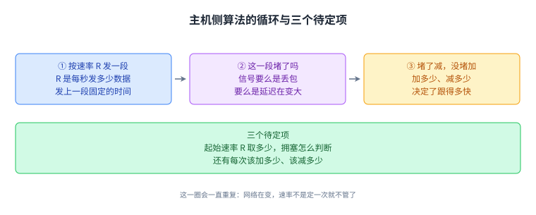
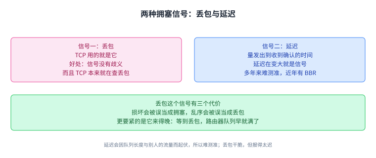
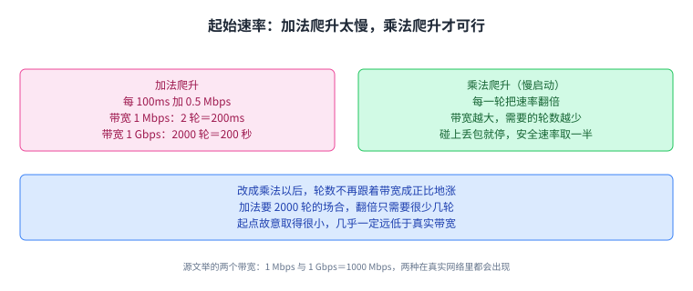
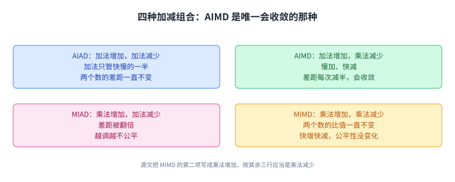
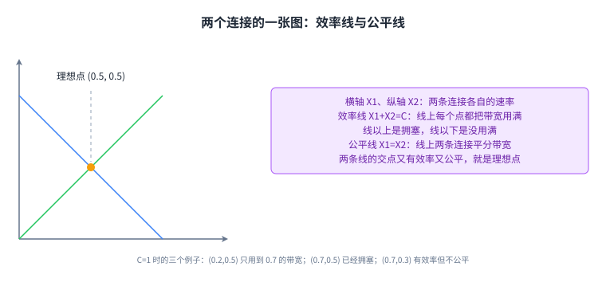
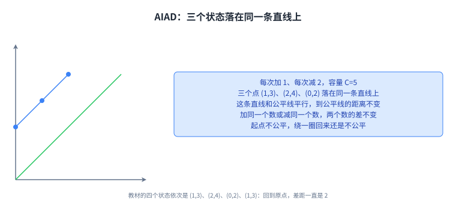
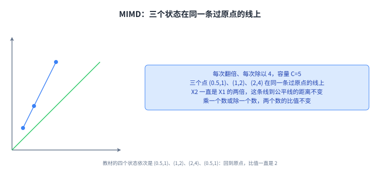
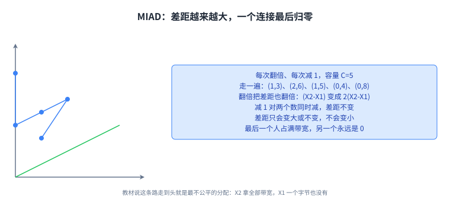
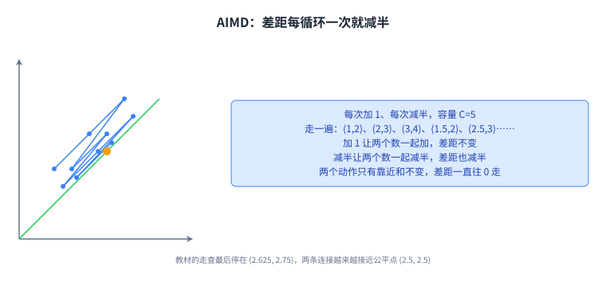

+++
title = "拥塞控制设计：起始速率与 AIMD 的收敛"
lecture = 22
slug = "congestion-control-design"
status = "draft"
source_kind = "textbook"
source_url = "https://textbook.cs168.io/transport/cc-design.html"
source_title = "Congestion Control Design"
output_mode = "explanation"
+++

> 来源课程：UC Berkeley CS168 Computer Networks（教材 CS 168 Textbook）；
> 对应内容：Transport 之 Congestion Control Design（<https://textbook.cs168.io/transport/cc-design.html>）；
> 上游许可：教材站在站根页声明 CC BY-SA 4.0（第二人复核见 `docs/audit/license-cs168-second-review.md`）；
> 本文由 CourseLingo 原创撰写：**按该节的推进顺序**重新讲解，关键句给出英文原文与中译，**不逐句全译**，配图全部自绘、不转载原图；
> 本文非官方材料，CourseLingo 与 UC Berkeley 及课程教学团队无隶属关系；如与原文有出入，以原文为准。

## 一、一条连接自己试出一个速率

上一讲（拥塞控制原理）说了拥塞是怎么回事、两条连接该怎么分带宽才算公平。这一讲要解决的是把[[term:congestion-control]]交到发送方手里之后的具体做法：网络里没有人告诉它该发多快，它只能自己试。

教材说，主机侧的算法几乎都是同一个套路，差别只落在三个地方。

> "Most host-based algorithms follow the same general approach, and the differences arise in three key choice points."
> （大多数主机侧算法遵循同一个大体套路，差别出现在三个关键的选择点上。）

套路是一个循环。每个发送方独立地、反复地跑同一段逻辑：先用某个速率 R 发一段时间，然后问自己这一段时间里有没有遇到拥塞；遇到了就降低 R，没遇到就提高 R。

> "Try sending at a rate R for some period of time. Then, ask: Did I experience congestion in this time period? If yes, then reduce R. If no, then increase R."
> （用速率 R 发一段时间，然后问：这段时间里我遇到拥塞了吗。遇到了就降低 R，没遇到就提高 R。）

这里立刻缺一块东西：R 从哪个值开始。教材把它和另外两件事并称为三个选择点，也就是起始速率怎么定、拥塞怎么判断、每次该加多少减多少。

三个选择点定了，这个循环才算一个确定的算法。下面三节分别处理它们。

## 二、两种判断拥塞的信号

网络层给的是尽力而为，堵了就把分组丢掉，所以判断依据只能从发送方自己看得到的东西里找。教材给了两条常见做法。

第一条是[[term:packet-loss]]，也就是 TCP 用的那种。

> "The sender could check for packet loss. This is the approach commonly used by TCP."
> （发送方可以去查丢包。这是 TCP 常用的做法。）

它的好处是信号没有歧义：每个[[term:packet]]要么被判成丢了，要么没丢。判丢的方式是[[term:timeout]]或者收到[[term:duplicate-ack]]；而且 TCP 为了重发本来就在检测丢包，不用再实现一遍。

代价有三条。丢包的原因不一定是拥塞，也可能是数据在路上损坏，[[term:checksum]]不过关；教材说，当一条[[term:link]]并不拥塞却频繁损坏分组时，TCP 会被这件事搞糊涂。[[term:reordering]]也会骗到它：一个到得晚的分组会被误判成丢的。第三条更要紧，是这个信号来得晚。

> "Another key downside to this approach is, we detect congestion late. By the time packets are being dropped, router queues are already full and packets are being delayed."
> （另一个要紧的代价是，我们发现拥塞太迟了。等到分组开始被丢的时候，[[term:router]]的队列早就满了，分组也已经在被延迟。）

第二条依据是延迟。发送方量一个分组从发出到收到它[[term:acknowledgment]]的时间，如果发现延迟在变大，那可能就是拥塞的迹象。教材说精确测量延迟历来很难，延迟会因队列长度和别的流量而变，所以很多年没被广泛部署；近年 Google 的[[term:bbr]]（2016）说明基于延迟的算法是可行的，一些服务（比如 Google 自己的）已经用上。源文这一句的主谓有点小疵（delay-based algorithms is possible），见溯源。

把两条信号摆在一起，取舍是一次[[term:trade-off]]：丢包是个干脆的开关，但报得迟，还容易被损坏和乱序污染；延迟报得早，但它本身在不断变化，测量不干净。顺带说一句范围：这一节讲的是 TCP 这一侧的判断（源文这一节没有提 UDP，UDP 不在传输层做拥塞控制）。

## 三、起始速率：从加法爬升到慢启动

连接刚建立时，得先定一个起始速率。教材把这件事说成一个发现过程：试几个不同的速率，估计出可用的[[term:bandwidth]]。这些算法跑在操作系统的传输层里，比如 Linux 内核的 TCP 实现，起点定得快不快，直接决定连接刚开局那段时间的带宽利用率。

发现过程要安全，所以从慢的速率开始，不能一上来就把网络灌满。它同时又要快，所以每试一次就把速率往上提。教材举了一个加法爬升的例子：每 100ms 往速率上加 0.5 Mbps，直到检测到丢包。如果可用带宽是 1 Mbps，发现阶段花 2 轮，也就是 200ms；如果可用带宽是 1 Gbps，也就是 1000 Mbps，那就要 2000 轮、200 秒才爬到合适的速率，太久了。

这几个数可以自己验一遍：1 Mbps 除以每轮 0.5 Mbps 得 2 轮，2 乘 100ms 是 200ms；1000 Mbps 除以 0.5 Mbps 得 2000 轮，2000 乘 100ms 是 200000ms，也就是 200 秒。两者相差一千倍，正好等于两个带宽相差的倍数。教材补了一句，互联网上链路速率千差万别，家里的 Wi-Fi 与骨干链路能差出好几个数量级，所以这两种情形在现实里都会出现。

于是把加法换成乘法：每轮把速率乘一个因子，而不是加一个常数。这个做法叫[[term:slow-start]]。

> "In order to support a slow start but a fast ramp-up, we'll increase the bandwidth by a multiplicative factor each time (instead of an additive factor). This solution is called slow start, though this is arguably an unintuitive name."
> （为了既慢起步又能快爬升，我们每次把速率乘一个因子，而不是加一个因子。这个做法叫慢启动，不过这个名字可以说并不直观。）

慢启动的起点故意取得很小，几乎一定远低于真实带宽，然后一轮一轮翻倍，直到碰上丢包。安全速率取碰壁前的那个值；教材写成，如果丢包发生在速率 R，那么安全速率是 R/2。这两句话在翻倍的前提下是同一件事：碰壁前的那一档正好是碰到丢包时速率的一半。

这一节的落点是名字骗人：慢启动的起点慢，爬升一点不慢。轮数不再随带宽成比例地涨，而是按每轮翻倍的节奏涨，所以加法要 2000 轮的那种场合，翻倍的次数少得多。

## 四、加与减：四种组合，AIMD 胜出

发现阶段结束，调整并不会停。教材提醒，网络在变，可用带宽不是常数，所以发送方要一直调下去。剩下那个选择点就是每次加多少、每次减多少。

这个决定影响两件事。调得快，就能迅速跟上带宽的变化，带宽的利用率高；调得慢，就会长时间停在次优速率上。教材还点出慢适应会带来[[term:fairness]]问题：如果我正占着整条链路的带宽，另一个人开了新连接，我必须很快把速率降下来，才能让出一份。上一讲讲过的两个目标在这里要一起满足：效率（把可用带宽都用上）与公平（各连接平分带宽）。

可选规则按快慢分：快的变化是乘法，比如每轮翻倍或减半；慢的变化是加法，比如每轮加 1 或减 1。两两组合出四种，教材把它们列成四行：

> "AIAD: additive increase, additive decrease
> AIMD: additive increase, multiplicative decrease
> MIAD: multiplicative increase, additive decrease
> MIMD: multiplicative increase, multiplicative increase"

中文依次是：加法增加配加法减少、加法增加配乘法减少、乘法增加配加法减少、乘法增加配乘法增加。其中有两种动作，[[term:additive-increase]]就是每轮加上一个固定的数，[[term:multiplicative-decrease]]就是每轮乘上一个固定的因子；缩写里的四个字母，前两个说增加怎么变，后两个说减少怎么变。

这里有一处对不上：第四行写的是 multiplicative increase, multiplicative increase，而 MIMD 这个名字的末位是 D，也就是 decrease。教材这一行的列举与它自己的命名不一致，我们照录，见溯源。

教材的判断是，四种里[[term:aimd]]最好，也就是慢加、快减那一种。

直觉是：发多了比发少了更糟。速率太高会造成拥塞、分组被丢；速率太低只是没用满带宽，至少没给网络添麻烦。AIMD 的行为因此是：没有拥塞时慢慢往上爬，一旦超过最大带宽、发现拥塞就迅速降下来。这样大部分时间速率偏低，偏高的时候则很快收回来。

四种组合的差别可以先记成一句话：加法动的是两个数的差，乘法动的是两个数的比；要让不公平的分配变公平，必须有一个动作能压缩差或者比。

上面那句直觉值得单独看一遍，因为它决定了 AIMD 是慢加、快减，而不是快加、慢减。

两边的代价不对称：往上加可以慢一点，因为慢的代价只是自己少用一点带宽；往回收必须快，因为慢的代价是把网络推进拥塞，连带别人的连接一起遭殃。这一讲后半段那四次走查，就是要看这四种规则各自把差和比怎么办。

## 五、把两个连接画到一张图上

现在回答更细的问题：为什么四种里只有 AIMD 能让不公平的分配慢慢变公平。教材先指出，四种在效率上都不差：速率低于最优点时加、高于最优点时减，长期看速率会一直在最优点附近晃。差别在公平上。

模型是两条连接共享一条容量为 C 的链路，速率分别是 X1 与 X2。X1+X2 大于 C 就是拥塞，小于 C 就是没用满。效率要对齐 X1+X2=C，公平要对齐 X1=X2。

这里有一个边界值得记下来：教材的判据是「大于 C 才算拥塞」，所以 X1+X2 正好等于 C 时算作不拥塞。后面 AIMD 的走查正好会撞上这个边界（2+3 正好是 5），那时它是继续往上加的。

用一张二维图来看：横轴是 X1，纵轴是 X2，图上一个点代表一段两个速率都定下来的场景。取 C=1，效率线就是 X1+X2=1，线上的点都把带宽用满，线以上是拥塞，线以下是没用满；公平线是 X1=X2，线上的点两条连接平分带宽，不在线上的都不公平；两条线交在 X1=X2=0.5，那个点既有效率又公平。

教材给了三个例子：点 (0.2, 0.5) 不有效率，因为它只用到 0.2+0.5=0.7 的带宽，图上落在效率线下方；点 (0.7, 0.5) 是拥塞的，因为 0.7+0.5=1.2 大于 1；点 (0.7, 0.3) 落在效率线上（0.7+0.3=1），有效率但不公平。

两个发送方跑同一套算法，这决定了点往哪儿动：都发现有富余就一起加，都发现拥塞就一起减。加法变化的写法是 (x1+b, x2+b) 与 (x1-a, x2-a)，在图上沿着斜率 1 的线走；乘法变化的写法是 (c·x1, c·x2) 与 (x1/d, x2/d)，在图上沿着过原点的线走，那条线的斜率是 x2/x1。教材说，判断一种规则好不好，就看这个点会不会越来越靠近公平线。

这张图是后面四节的尺子：效率线管用满没有，公平线管分得公不公平，四种规则的区别只在于点在这张图上怎么跳。

## 六、AIAD：差距一步没变

教材的走查从 AIAD 开始：每次加 1、每次减 2，容量 C=5。

- X1=1, X2=3（起点，和是 4，小于 5，加）
- X1=2, X2=4（和是 6，大于 5，减 2）
- X1=0, X2=2（和是 2，小于 5，加）
- X1=1, X2=3（回到起点）

第二步到第三步值得核一下：从 (2,4) 各减 2 得到 (0,2)，两个数都减 2，差没变。第四步从 (0,2) 各加 1 回到 (1,3)。绕一圈，回到出发点。差是 2，这四步里一直是 2。

教材给的解释是代数上的：给 X1 和 X2 加同一个数，两个数还是差同一个数；减也同理。所以这条路没法把差距变小，一开始不公平，就一直不公平。

教材还堵掉了一个念头：那让 X1 多加一点（比如 +2）、X2 少加一点（比如 +1）行不行。答案是不行，因为两个发送方各自独立地跑同一套算法，谁也不知道自己该比别人多加多少。

这一节的结论只有一句：加法增加配加法减少时，两个数总是同加同减，差一直是那个差。出发时不公平，绕多少圈还是不公平。

## 七、MIMD：比值一步没变

教材接着看 MIMD：每次翻倍、每次除以 4，容量还是 C=5。

- X1=0.5, X2=1（和是 1.5，小于 5，翻倍）
- X1=1, X2=2（和是 3，小于 5，翻倍）
- X1=2, X2=4（和是 6，大于 5，除以 4）
- X1=0.5, X2=1（回到起点）

核对最后一步：2 除以 4 得 0.5，4 除以 4 得 1，正好回到第一步的 (0.5,1)。比值 X2/X1 在这四步里一直是 2；教材说这是乘法变化的一般性质，两个数同时乘或同时除，比值不变。所以这条路也到不了公平线，公平的比值是 1。

这一节和上一节合起来是同一个道理的两个版本：加法动不了差，乘法动不了比。AIAD 与 MIMD 因此都保留不公平。

## 八、MIAD：越调越不公

第三种是 MIAD：每次翻倍、每次减 1，容量 C=5。

- X1=1, X2=3（和是 4，小于 5，翻倍）
- X1=2, X2=6（和是 8，大于 5，各减 1）
- X1=1, X2=5（和是 6，大于 5，再各减 1）
- X1=0, X2=4（和是 4，小于 5，翻倍）
- X1=0, X2=8（翻倍之后 X1 还是 0）

第三步和第二步连起来看：从 (2,6) 各减 1 到 (1,5)，再各减 1 到 (0,4)，X1 落到了 0。之后每一步都是翻倍，而 0 翻倍还是 0，所以 X1 永远留在 0，X2 一个人把带宽全占了。

教材说这不只是这个例子的巧合：只要起点不公平，MIAD 会让它更不公平，最后走到一个人拿全部带宽、另一个人拿 0。代数上的理由是，翻倍会把两个数的差也翻倍（(X2-X1) 变成 2(X2-X1)），而各减 1 对差没有影响，所以差只会变大或者不变。

核对一下这个例子里的差：2、4、4、4、8，确实只有变大和不变两种走向。

四种规则到这里已经有三种不能改善公平：AIAD 与 MIMD 原地踏步，MIAD 反过来把不公平放大。剩下一种就是答案。

## 九、AIMD：差距每一步都在减半

最后是 AIMD：每次加 1、每次减半，容量 C=5。

- X1=1, X2=2（和是 3，小于 5，各加 1）
- X1=2, X2=3（和是 5，不算拥塞，各加 1）
- X1=3, X2=4（和是 7，大于 5，各减半）
- X1=1.5, X2=2（和是 3.5，小于 5，各加 1）
- X1=2.5, X2=3（和是 5.5，大于 5，各减半）
- X1=1.25, X2=1.5（和是 2.75，小于 5，各加 1）
- X1=2.25, X2=2.5（和是 4.75，小于 5，各加 1）
- X1=3.25, X2=3.5（和是 6.75，大于 5，各减半）
- X1=1.625, X2=1.75（和是 3.375，小于 5，各加 1）
- X1=2.625, X2=2.75（教材这一行两处都写成 X2，见溯源）

第二步是个边界情形：2+3 正好等于 5，教材按「大于才算拥塞」判成不拥塞，于是继续各加 1，走到 (3,4) 才撞上拥塞。

减半那几步可以逐个验：3 和 4 各减半是 1.5 和 2；2.5 和 3 各减半是 1.25 和 1.5；3.25 和 3.5 各减半是 1.625 和 1.75。差距从 1 变成 0.5、0.25、0.125，每循环一次减半。

教材的结论是差距一直往 0 走，点会慢慢靠近公平线；容量 5 两条连接平分正好是 2.5，例子最后那一步已经离它很近了。代数上还是两条：各加 1 对差没有影响，各减半会把差也减半；两个动作加起来，差只会变小或者原地不动，所以每一轮循环都在往 0 挪。

把四种摆在一起，教材的总结是：AIAD 与 MIMD 保留不公平、一点都不改善，MIAD 放大不公平，只有 AIMD 会收敛到公平。这一讲后半段那四次走查，量的都是同一个东西：不公平有多大。

## 十、脉络回顾

这一讲把拥塞控制落到发送方的动作上。主机侧算法是同一个循环：按速率 R 发一段，判断有没有拥塞，拥塞就减、没拥塞就加；循环之外有三个待定项，起始速率、判断依据、每次的加减幅度。

判断依据有两条。丢包干脆、没有歧义，TCP 本来就在查它，但它会被损坏与乱序污染，来得也晚；延迟报得早，却难测准，直到近年才有 BBR（2016）这样的做法把它用起来。

起始速率靠一次发现过程。加法爬升每 100ms 加 0.5 Mbps，碰上 1 Mbps 只要 2 轮、200ms，碰上 1 Gbps 却要 2000 轮、200 秒；改成每轮翻倍，轮数就不再随带宽成比例地涨。这个做法叫慢启动，安全速率取丢包发生时速率的一半。

加减的幅度决定公平能不能改善。教材用两条连接、容量 C 的模型，把速率画成二维平面上的一个点：效率线是 X1+X2=C，公平线是 X1=X2，理想点在两条线的交点。加法变化沿斜率 1 的线走，乘法变化沿过原点的线走。四次走查给出四种命运：AIAD 的差一直不变，MIMD 的比一直不变，MIAD 的差被翻倍直到一个人拿满带宽，只有 AIMD 的差每循环一次减半，慢慢走到公平线。

下一讲把这几条规则落成真实的实现，也就是教材的 Congestion Control Implementation。

## 读完应该能回答

1. 主机侧算法的循环里，发送方每一步在做什么，三个待定项分别是什么。
2. 丢包与延迟这两种信号各自的代价，丢包这个信号为什么来得晚。
3. 加法爬升在 1 Mbps 与 1 Gbps 下分别是几轮、多久，为什么换成每轮翻倍。
4. 四种加减组合各自动的是差还是比，为什么只有 AIMD 会收敛。
5. 效率线与公平线分别对齐什么，理想点是哪个点。
6. 四次走查里差（或比）分别怎么变，AIMD 的循环为什么让差距减半。

## 溯源

- 对应：UC Berkeley CS168 Computer Networks，教材 Transport 之 Congestion Control Design（<https://textbook.cs168.io/transport/cc-design.html>）
- 教材：CS 168 Textbook（UC Berkeley CS168 课程教材），原文链接同上
- 授权依据：教材站在站根页声明 CC BY-SA 4.0；本文为本仓库原创中文讲解，按该节顺序重讲，关键句给出英文原文与中译，未逐句全译，配图自绘
- 抓取范围与体积：抓的是渲染后的 HTML（`https://textbook.cs168.io/transport/cc-design.html`，40,145 字节）。切出 `#main-content`、剥掉 `script/style/svg/nav/footer` 后取到一个 H1（Congestion Control Design）与 9 个 H2；页内 12 张插图都没有 `alt`，也没有图注；全文检索 `TODO`、`TBD` 均为 0 处，源文没有待补标记
- 结构说明：本讲章节顺序跟随教材该节的推进顺序，教材这 9 个小节与本页 9 个正文章节一一对应（Host-Based Algorithm Sketch → 一，Detecting Congestion → 二，Discovering Initial Rate → 三，Adjustments: Reacting to Congestion → 四，Adjustments: Model → 五，Adjustments: AIAD/MIMD/MIAD/AIMD Dynamics → 六至九）。教材这一节没有小结，我们按本仓库模板补了「脉络回顾」与「读完应该能回答」两节。教材的四节 Dynamics 里 AIAD、MIMD、AIMD 各配一张插图（3-067-aiad、3-068-mimd、3-069-aimd，另有 3-070-aimd-sawtooth），MIAD 没有配图；这些插图既无 `alt` 也无图注，我们不从图里读内容，只按正文重画

## 溯源：照录、复核与登记

- 照录（源文自身的问题，均在正文就地说明）：
  1. 列举四种组合时，MIMD 那一行写成 `multiplicative increase, multiplicative increase`，与它自己的命名（MIMD 末位是 D，decrease）以及上文「乘法用来快速调整」的说法都对不上；按其余三行的写法，第二项应是 `multiplicative decrease`。我们照录原列举并就地说明
  2. AIMD 走查的最后一行写作 `X2 = 2.625, X2 = 2.75`，第一个 X2 应为 X1；按同一段前几行每一步都同时写出 X1 与 X2 的写法，以及它自称已接近 2.5，这一行应是 X1 = 2.625、X2 = 2.75
  3. AIMD 的代数段落把差距写成 (X1 - X2)，而 MIAD 段落写的是 (X2 - X1)；两处都叫差距，符号相反、绝对值相同。我们按差距的大小讲，两处都照录
  4. 源文把拥塞判据写成「大于 C」（greater than），于是 X1+X2 正好等于 C 时不算拥塞；AIMD 走查的第二步（2+3=5=C）正是这一情形，源文在那里继续加了 1。我们照录该判据，并在第五、第九节说明这个边界
  5. 延迟那一节的句子 `Google's BBR protocol (2016) has shown that delay-based algorithms is possible` 主谓不一致（algorithms 配 is），我们引用时只译不改
- 数字复核（源文给的每个数都算过一遍，结果与源文一致）：0.5 Mbps/100ms 下 1 Mbps 对应 2 轮＝200ms、1000 Mbps 对应 2000 轮＝200 秒；四条走查每一步的和值（AIAD 4/6/2，MIMD 1.5/3/6，MIAD 4/8/6/4，AIMD 3/5/7/3.5/5.5/2.75/4.75/6.75/3.375）与减半结果（3→1.5、4→2、2.5→1.25、3→1.5、3.25→1.625、3.5→1.75）；模型一节的 0.2+0.5=0.7、0.7+0.5=1.2、0.7+0.3=1、理想点 0.5；AIAD 的差四步都是 2、MIMD 的比始终是 2、MIAD 的差 2→4→4→4→8、AIMD 的差 1→0.5→0.25→0.125。源文这一节的算术没有自身冲突，冲突只在上面第 1、2 两条笔误

- 我们补的（源文没有写）：
  1. AIAD 的三个状态落在同一条斜率 1 的直线上：源文只说「总是沿斜率 1 的线移动」，我们按它给的数算出 (0,2)、(1,3)、(2,4) 都在 X2=X1+2 上
  2. 把「发多了比发少了更糟」说成两边的代价不对称，并用它解释 AIMD 为什么是慢加、快减；源文只给了那句直觉
  3. 把慢启动的效果说成轮数不再随带宽成比例地涨；源文只给了加法爬升的算例，没有给乘法爬升的轮数
  4. 把四种组合的差别概括成加法动差、乘法动比；源文分别讲了这两种变化怎么移动，没有并列成这样一句
  5. 「这些算法跑在操作系统的传输层里，比如 Linux 内核的 TCP 实现」，以及「家里的 Wi-Fi 与骨干链路能差出好几个数量级」；源文只写互联网上链路速率千差万别
  6. UDP 不在传输层做拥塞控制这一句；源文这一节没有提 UDP
  7. 源文的配图文件名里带 sawtooth（3-061-sawtooth.png），但正文没有给这个现象起名；本页也没有用锯齿这个名字，只按正文写慢慢往上爬、发现拥塞就迅速降下来

- 术语取舍与登记：`packet loss` 译作丢包，`slow start` 译作慢启动，`additive increase` 译作加法增加，`multiplicative decrease` 译作乘法减少，`fairness` 译作公平。本讲新登记 5 条（packet-loss、additive-increase、multiplicative-decrease、aimd、bbr）；`slow start` 与 `fairness` 在落盘时已在 glossary.toml 里（另一条并行流登记的第 21 讲术语），本讲直接复用，没有重复登记
