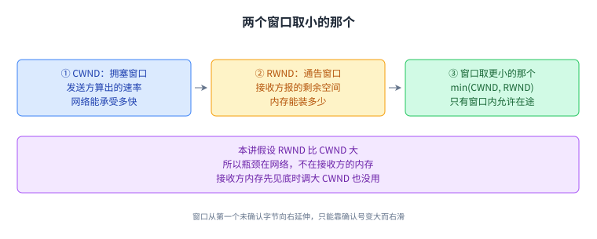
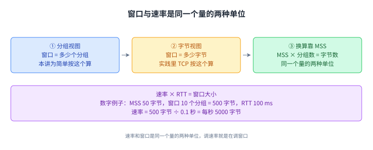
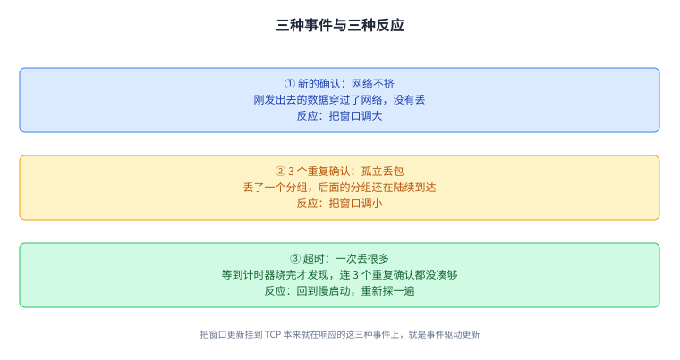
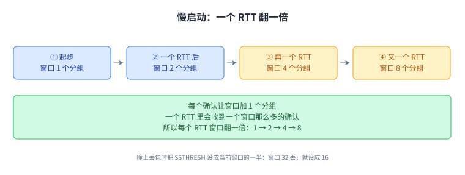
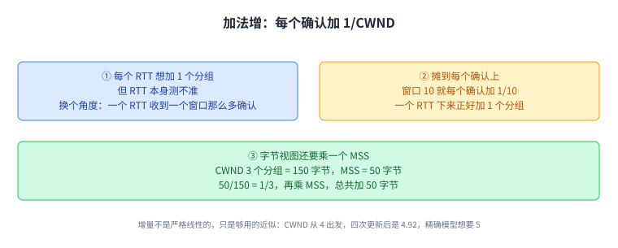
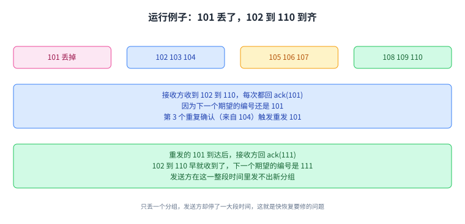
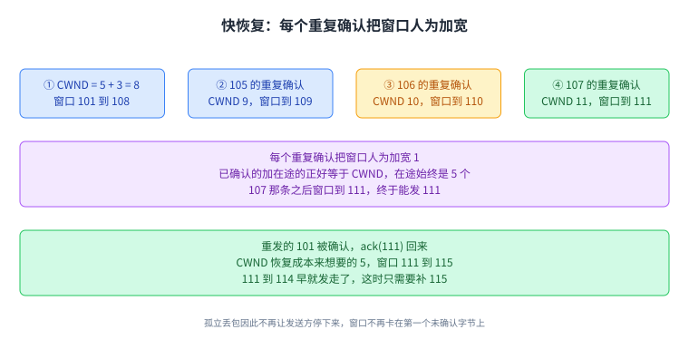
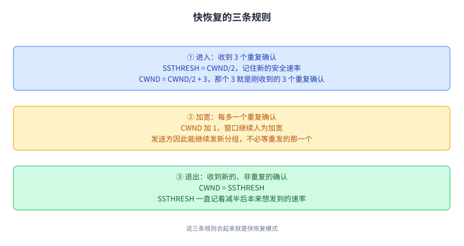
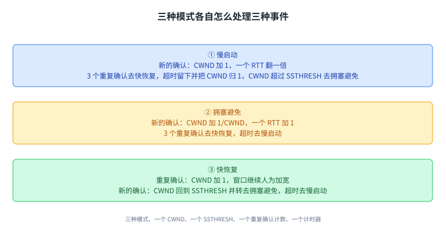
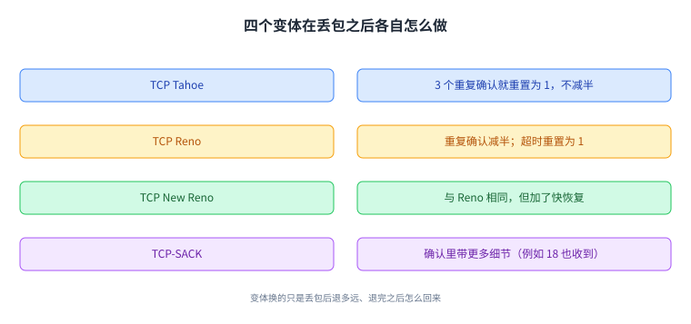

+++
title = "拥塞控制的实现：慢启动、加法增与快恢复"
lecture = 23
slug = "congestion-control-implementation"
status = "draft"
source_kind = "textbook"
source_url = "https://textbook.cs168.io/transport/cc-implementation.html"
source_title = "Congestion Control Implementation"
output_mode = "explanation"
+++

> 来源课程：UC Berkeley CS168 Computer Networks（教材 CS 168 Textbook）；
> 对应内容：Transport 之 Congestion Control Implementation（<https://textbook.cs168.io/transport/cc-implementation.html>）；
> 上游许可：教材站在站根页声明 CC BY-SA 4.0（第二人复核见 `docs/audit/license-cs168-second-review.md`）；
> 本文由 CourseLingo 原创撰写：**按该节的推进顺序**重新讲解，关键句给出英文原文与中译，**不逐句全译**，配图全部自绘、不转载原图；
> 本文非官方材料，CourseLingo 与 UC Berkeley 及课程教学团队无隶属关系；如与原文有出入，以原文为准。

## 一、回顾：两个窗口取小的那个

上一讲把 TCP 的滑动窗口落到了字节上。这一讲要解决的是把「丢包就减、没丢包就加」这套设计写成代码时会冒出来的问题：究竟在哪个时刻动窗口，每次动多少，遇到不同的坏消息又该退多远。

源文先把之前的草图复述了一遍。每个发送方独立跑同一个算法，各自收敛到一份效率不错、也还算公平的带宽份额。开场用慢启动：从一个很低的速率起步，指数增长，先探出一个能用的初始速率。之后每一轮，检测到拥塞（也就是检测到丢包）就把速率乘性地减小，没检测到就加法地增大。这两个动作合起来，就是[[term:additive-increase-multiplicative-decrease]]，通常缩写成 AIMD。

源文特别提醒，TCP 的拥塞控制与它的可靠性机制缠得很紧，这是历史留下的结果。TCP 最初没打算做拥塞控制，是后来打补丁加上去的。记住这一点，后面很多做法会显得没那么「设计感」。

发送方维护一个[[term:window]]，也就是[[term:sliding-window]]，里面是已经发出、还没被确认的连续字节。窗口有多宽，由两件事一起定：流量控制看接收方的缓冲区，拥塞控制看发送方算出来的速率。

流量控制这边，接收方会通告一个[[term:advertised-window]]，源文有时缩写成 RWND，意思是「你还能再给我发多少字节，不会撑爆我的内存」。拥塞控制这边，发送方自己维护一个[[term:congestion-window]]，源文缩写成 CWND，表示以多快的速率发分组才不会压垮链路。这个值由拥塞控制算法动态设定和调整。

> "The sender's window is computed as the minimum of CWND and RWND."
> （发送方的窗口取 CWND 与 RWND 里更小的那个。）

本讲假定 RWND 比 CWND 大，于是瓶颈落在网络，不在接收方的内存。源文说这在实践中通常成立，但并非总是成立。

窗口本身的用法和上一讲一样，左边是第一个还没被确认的字节，右边由窗口宽度决定，只有窗口里的字节允许[[term:in-flight]]。左边的字节被确认，窗口就向右滑，新的字节才允许发出去。检测丢包有两套：窗口最左边那个分组配一个[[term:timer]]，到点还没被确认就重发它；另外数[[term:duplicate-ack]]，收到 3 个就重发窗口最左边那个分组，源文把这个做法叫[[term:fast-retransmit]]。

取小这一步值得多想一层，它意味着拥塞控制想放宽也放宽不了。接收方的内存如果先见底，把 CWND 调大不会让连接变快，因为窗口根本不看它。

这一节的落点是：一条连接能发多少，由 CWND 与 RWND 里更小的那个说了算，而本讲接下来只动 CWND。

## 二、窗口就是速率

按速率调整，和按窗口调整，看着是两件事。源文说它们其实是同一个量：

> "rate times RTT = window size"
> （速率乘以往返时间，等于窗口大小。）

直觉上，把窗口和速率想成同一个东西用两种单位表达就行。窗口变大就意味着发得更快，反过来也一样。

为什么这个等式成立，源文给的是「看第一个往返」这条推理。在第一个 RTT 里，还没有任何确认回来，我们能发出去的正好是「一个窗口那么多」个分组，所以速率就是窗口大小除以 RTT。

本讲为了简单，按分组算窗口。实践中 TCP 按字节算，两者靠[[term:maximum-segment-size]]换算，源文简称 MSS：MSS 乘分组数等于字节数。源文在这里又用了一次单位换算的比喻，字节和分组也是同一个量的两种单位。

把数字带进去感受一下。假设 MSS 是 50 字节，窗口是 10 个分组，那么这个窗口就是 500 字节。如果这一路的[[term:round-trip-time]]是 100 ms，速率就是 500 字节除以 0.1 秒，也就是每秒 5000 字节。

这一节很实用：后面口口声声要调速率，其实就是在调窗口，两个词可以换着用。

## 三、三种事件各改什么

概念模型里我们想「每轮」调一次窗口，问题是「一轮」没有定义。粗略地说一轮就是一个 RTT，而 RTT 本身一直在变，测不准。

源文的解法是把更新挂到 TCP 本来就在响应的事件上，来一个事件就更新一次窗口。这叫[[term:event-driven-update]]。要挂的事件一共 3 个：新的确认、3 个重复确认、超时。

新的[[term:acknowledgment]]到来，说明刚发出去的数据穿过了网络、没有丢。本讲判断拥塞的方式就是看有没有丢包，所以新确认等于「网络不挤」。这时把窗口调大，慢启动阶段和[[term:aimd]]阶段都这么做。

3 个重复确认到来，按上一讲的规则，我们会把一个分组标记成丢了。这是孤立丢包的信号，属于轻微拥塞：丢了一个，后面的分组还在陆续到达。这时的反应是把窗口调小。

[[term:timeout]]是另一种坏消息。它也意味着把一个分组标记成丢了，区别在于它是等到计时器烧完才发现的。源文的推理值得跟着走一遍。假设窗口是 100 个分组，超时意味着我们没等到窗口最左边那个分组的确认，而且在整整一个计时器的时间里，连 3 个重复确认都没凑够。这说明几乎没有分组在到达，网络那头出的事不小。源文把超时读成「很多分组一起丢了」。

遇到超时，源文建议回到慢启动，重新探一遍合适的窗口。理由是探测到的网络状况已经变了，当前这个窗口值不再可信。源文也承认这不是唯一的应对方式，这只是 TCP 选的那一种。

把这三个事件记住，后面每个机制的实现都只是在回答同一个问题：这三个事件里，各自要动多少。

## 四、事件驱动的慢启动

概念模型里的[[term:slow-start]]是：挑一个慢速率，每个迭代把它翻一倍，直到第一次丢包。现在要把它改成事件驱动的说法，靠收到确认来让窗口每个 RTT 翻一倍。

TCP 从 1 个分组的窗口起步。规则只有一条：每收到一个确认，窗口加 1 个分组。

源文先给了一幅理想的画面。窗口是 1，发 1 个分组，一个 RTT 后回来 1 个确认，窗口变成 2。接着发 2 个，一个 RTT 后回来 2 个确认，窗口变成 4。再发 4 个，回来 4 个确认，窗口变成 8。

这幅画面其实假设了 4 个分组同时发出去、4 个确认同时回来。源文说实践中不是这样，滑动窗口会让窗口每收到一个确认就加 1，但最后的效果一样，仍是每个 RTT 翻一倍。

滑动窗口版本长这样。窗口是 1，发 1 个，一个 RTT 后拿到它的确认，窗口变 2，此时在途 0 个。接着发 2 个。收到第 1 个的确认，窗口变 3，还有 1 个在途，于是可以再发 2 个。收到第 2 个的确认，窗口变 4，还有 2 个在途，于是再发 2 个。

源文把这条规律讲成一句话：每个确认让滑动窗口多允许发一个分组，同时变大的窗口又允许再发一个，所以每个确认带动 2 个分组被发出去。一个 RTT 里收到 16 个确认，就会发出 32 个分组；下一个 RTT 这 32 个分组被确认，触发 64 个。

加倍迟早会撞上丢包。撞上的那一刻，我们也顺便学到了这条连接不丢包的最大安全速率。源文把它记在一个新参数里，叫[[term:slow-start-threshold]]，源文缩写成 SSTHRESH。规则是：一遇到丢包，就把 SSTHRESH 设成当前窗口的一半。窗口 16 个分组不丢、窗口 32 个丢，就设成 16。

SSTHRESH 的用处在于「记住」。慢启动之后窗口还会一直变，没有这个数，前面探出来的安全速率就丢了。

这一节的收尾是把两个数字连起来：窗口从 1 起步，每个 RTT 乘以 2；撞上丢包时取当前窗口的一半当 SSTHRESH。

## 五、加法增怎么写

慢启动之后，没丢包时要把速率慢慢加上去。事件驱动的说法是：每个 RTT 让窗口加 1 个分组。

难点还是 RTT 测不准。源文换了个角度。虽然不知道 RTT 的确切数值，但一个 RTT 之内预期会有「一个窗口那么多」个分组被确认，窗口是 10 就大约收到 10 个确认。那么每个确认加 1/10 个分组，一个 RTT 下来正好加了 1 个分组。

写成代码是一行：每收到一个确认，把 CWND 重新赋成 CWND 加上 1/CWND。

字节版本要绕一下，因为 TCP 实际按字节算窗口。源文的换算是：字节视图里每次要加的是 MSS 乘以 MSS/CWND。分母里的 CWND 此时按字节算，分子里的 MSS 是「一个 RTT 总共想加多少」。这个分数本身仍然是个比例，没有单位，代表每个确认要加的比例；再乘上 MSS 字节，就得到要加的量。

源文给了个数字例子。CWND 是 3 个分组，也就是 150 字节，MSS 是 50 字节。分组视图里每次加 1/3 个分组，一个 RTT 共加 1 个分组。字节视图里 MSS 除以 CWND 是 50/150，还是 1/3，这就是每个确认要加的比例；再乘上 MSS，得到的是每次确认加 16.67 字节。一个 RTT 里有 3 个确认，三次加起来正好是 50 字节，也就是 1 个分组。

源文同时提醒这个增加不是严格线性的，只是个够用的近似。从 CWND 等于 4 出发，第一次是 4 + 1/4 = 4.25，第二次是 4.25 + 1/4.25 = 4.49，照同样算法走四次，最后落在 4.92，而精确模型想要的是 5。

这一节的落点：加法增是把「每个 RTT 加 1 个分组」摊到每个确认上，摊的量就是当前窗口的倒数。

## 六、乘法减与锯齿

3 个重复确认意味着孤立丢包，反应是把窗口除以 2。

超时意味着多个分组一起丢了，反应要重得多。源文的说法是：当前的窗口可能离得离谱，为了稳妥，干脆从头重新探一遍好速率。这分两步。

先把「现在太快了」这件事记下来。按乘法减的原则，已知的安全速率是当前的一半，于是把 SSTHRESH 设成当前窗口的一半。

再把窗口设回 1 个分组，重新跑一遍慢启动。

重试慢启动时要防着一个坑：别再一路涨回刚才超时那个危险速率。好在 SSTHRESH 就设在危险速率的下面一点。所以后续的慢启动里，窗口一旦超过 SSTHRESH，就切换成加法增。第一次慢启动时 SSTHRESH 还没有值，源文说可以当成无穷大。

源文在这一节末尾做了一次小结，把四条规则收在一起：慢启动里每个确认加 1 个分组，效果是每个 RTT 翻倍；AIMD 里每个确认加窗口的一个分数，效果是每发完「一个窗口那么多」数据加 1；收到 3 个重复确认就把窗口减半；遇到超时就把窗口设成 1。

减法有一个下限：窗口不会降到 1 个分组以下。最坏的情况下也得允许 1 个分组在途。

把速率画成时间的函数，形状就出来了。开头是慢启动的指数上升。一遇到丢包，速率砍半，同时切到 AIMD。之后是线性地涨，每次丢包砍一半。源文把这个反复上下、下边平缓上边陡峭的形状叫[[term:sawtooth]]，那一节的小节标题就是它。

这一节把两件事合到了一起：重复确认和超时都做乘法减，重的那个退得更远；而反复的乘法减配上加法增，画出来就是锯齿。

## 七、快恢复：一次孤立丢包会把发送方卡住

到这儿还剩最后一个要处理的问题。孤立丢包时窗口按预期减了半，副作用是发送方会停住一段时间，什么也发不出去。

源文的例子是发 101 到 110 这 10 个分组，其中 101 丢了。

其余 9 个分组（102 到 110）回来时都确认成 ack(101)，因为接收方下一个期望的编号还是 101。收到第 3 个重复的 ack(101)（由 102、103、104 产生）时，发送方重发 101。重发的那份最终被确认，回来的是 ack(111)：102 到 110 早就收到了，加上 101，下一个期望的编号就是 111。

源文还从接收方那一侧把同一件事复述了一遍。接收方依次收到 102 到 110，每次都回 ack(101)，因为下一个没收到的还是 101；最后收到重发的 101，于是回 ack(111)。

这段时间里 CWND 在干什么，值得单独看一眼。窗口从第一个未确认字节开始，向后延伸 CWND 个连续字节。要让窗口往前挪，唯一的办法是第一个未确认的字节被确认掉。窗口内部其他字节被确认，窗口原地不动，右边一格也不放。

假设 CWND 起始是 10，101 到 110 都可以在途，发送方把它们全发出去，101 在半路丢了。

收到 102 产生的 ack(101)，第一个未确认字节还是 101，窗口不变，还是 101 到 110，发送方发不出新的东西，111 也发不了。收到 103 产生的 ack(101)，同样如此。

收到 104 产生的 ack(101) 时，这是第 3 个重复确认，CWND 减到 5，窗口变成 101 到 105。发送方还是发不出新的，同时按规则重发 101。

接下来收到 105、106 产生的 ack(101)，窗口还是 101 到 105，发不了。收到 107、108、109、110 产生的 ack(101)，一样发不了。

只丢了一个分组，发送方却彻底停了下来。原因是窗口由第一个未确认字节定义，101 不被重发并确认，窗口就不肯往前挪。后面 9 个分组都到了也没用，111 及之后的字节被窗口挡在外面。

等重发的 101 被确认、ack(111) 回来，窗口一下跳到 111。CWND 还是 5，于是能发 111 到 115。

第二个毛病紧接着来。发送方停了很久什么也没发，现在又要赶着把 111 到 115 一起发出去，还得再等一个完整往返，才能发 116 及之后。

源文对这一节补了三点。这个毛病主要来自滑动窗口，跟拥塞控制关系不大；窗口就算没缩小，101 不被收到、窗口不往前跳，发送方照样得停。

第二点是画法的建议。想的时候可以画出发送方的窗口，把已被确认的字节划掉。三连重复确认之后划掉 102、103、104，窗口允许 101 到 105 在途。但发送方自己看不到这幅画，它只拿到累积确认，能推断窗口里有 3 个不是 101 的分组到了，却不知道是哪 3 个。

第三点是重发规则。收到 3 个重复 ack(101) 之后重发一次 101，之后再来的重复 ack(101) 不会再触发重发。

这一节的落点是：窗口只认第一个未确认字节，所以一次孤立丢包能把整条流水线掐停，停多久取决于那个字节什么时候被补上。

## 八、快恢复：拿重复确认当信用

思路是让发送方别停，即使 101 丢了，111 及之后也要继续发。

发送方确实不知道具体哪些分组到了，但它能推断出「有某个不是 101 的分组到了」。每收到一个 ack(101)，在途的分组就少一个。

从 102 到 110 依次到齐，在途的分组数分别是 9、8、7、6、5、4、3、2、1。等 9 个 ack(101) 都收齐，就知道只剩 1 个在途，也就是 101。

孤立丢包之后，我们真正想要的 CWND 是 5，也就是任何时刻有 5 个分组在途。收到 107 产生的那条 ack(101) 时，能推断只剩 4 个在途（实际在途的是 101、108、109、110，但发送方不知道）。

这时想发 111，凑够 5 个在途，可窗口不答应，它还卡在 101 到 105。

源文的关键想法是给发送方发临时信用。每个重复确认到达，就说明在途少了一个，虽然不知道少的是哪个。那就在账面上把窗口人为加宽 1 个分组，允许再发一个。

把这条想法用进例子。窗口起初是 101 到 110，10 个分组都发出去。收到 102、103、104 产生的 ack(101)，窗口不动，发不了新东西。第 3 个重复确认让 CWND 减到 5，窗口变成 101 到 105；但既然已经收到了 3 个确认，就按 3 个确认人为加宽 3，于是 CWND 实际设成 5 + 3 = 8。

接着收到 105 产生的 ack(101)，再加宽 1，CWND 变 9，窗口是 101 到 109，还是发不了。收到 106 产生的 ack(101)，CWND 变 10，窗口 101 到 110，仍然发不了。

收到 107 产生的 ack(101)，CWND 变 11，窗口 101 到 111，终于可以发 111。之后每来一条 ack(101)，窗口就再宽一格：108 让它到 112，可以发 112；109 到 113，发 113；110 到 114，发 114。

重发的 101 最终被确认，ack(111) 回来。这时把 CWND 恢复成本来想要的 5，窗口变成 111 到 115，于是发 115。

换个角度看这个账，会更顺。看人为加宽后的窗口里装了什么：第 3 个重复确认时 CWND 是 8，里面 3 个已经被确认（102、103、104，虽然发送方不知道是它们），另外 5 个在途，正好是我们想要的 5 个在途。收到 105 那条之后窗口是 9，4 个已确认加 5 个在途。收到 106 那条之后窗口是 10，5 个已确认加 5 个在途。每一步把已确认的减掉，窗口里恰好剩 5 个在途。收到 107 那条之后窗口是 11，6 个已确认加 5 个在途；而原来发了 10 个、收到 6 个重复确认，说明只剩 4 个在途，正好够发 111。

这个修法同时解决了两件事。原来要等重发的 101 被确认才能发新数据，现在不用等了。原来窗口跳过去之后要赶着把 111 到 115 一整串发出去，现在 111 到 114 早就发走了，窗口跳过去时只需要补一个 115。

源文把上面的做法整理成了[[term:fast-recovery]]模式的三条规则，触发条件是收到 3 个重复确认。

进入时，CWND 不再只是减半，而是设成 CWND/2 + 3，那个 3 就是刚收到的 3 个重复确认换来的加宽；同时把 SSTHRESH 设成 CWND/2，记住新的安全速率。

在快恢复模式里，每多收到一个重复确认，CWND 加 1，窗口继续人为加宽。

退出发生在收到新的、非重复的确认时，把 CWND 设成 SSTHRESH。源文点出这条规则的意义：加宽窗口的整个过程里，SSTHRESH 一直替我们记着减半之后本来想发到的那个速率。

这一节把窗口从一个死数变成了一个可以临时借账的数，借的依据是重复确认：每来一个，就说明在途少了一个。

## 九、TCP 状态机

零件齐了，可以把它们拼成一份完整实现。源文先列出发送方要维护的 5 个值。

重复确认计数，用来比超时更早发现丢包，初始是 0。计时器只有一个，用来发现丢包。RWND 服务于[[term:flow-control]]，防止撑爆接收方的缓冲区。CWND 服务于[[term:congestion-control]]，初始是 1 个分组。SSTHRESH 帮拥塞控制记住最近的安全速率，初始是无穷大。

接收方维护一个[[term:buffer]]，放那些乱序到达、还不能交付的分组。发送方要响应 3 个事件，接收方每收到一个分组就回一条确认，外加一个 RWND 值。

先看收到一条新数据的确认时怎么办。如果当前在慢启动模式，CWND 加 1，效果是一个 RTT 翻一倍。如果当前在快恢复模式，把 CWND 设成 SSTHRESH，等于退出快恢复。如果当前在[[term:congestion-avoidance]]模式，给 CWND 加上 1/CWND，效果是一个 RTT 加 1。三种模式之外还要做三件杂事：重置计时器、把重复确认计数清零、窗口允许的话就发新数据。

再看收到重复确认时怎么办。计数加 1。计数到 3，就重发窗口最左边那个分组，也就是前面说过的快速重传；同时把 SSTHRESH 设成 CWND/2，把 CWND 设成 CWND/2 + 3，进入快恢复模式。计数超过 3，就留在快恢复模式里，之后每个重复确认把 CWND 加 1，窗口继续人为加宽。

最后看计时器到点时怎么办。重发窗口最左边那个分组，然后回到慢启动模式，把 SSTHRESH 设成 CWND/2 记住最后的安全速率，把 CWND 设回 1 个分组。

三种模式怎么互相走，源文逐条讲了。收到 3 个重复确认就进快恢复，进去之后再来重复确认都留在里面继续加宽；要出去只有两条路，超时把人踢回慢启动，或者一条新确认把人送回拥塞避免。

超时会把发送方踢进慢启动。在里面，后续任何确认（重复的还是新的）都留在慢启动。等 CWND 超过 SSTHRESH 这个安全速率，就进拥塞避免；如果这时候检测到丢包，就把速率减半、去快恢复里待一会儿，然后转到拥塞避免。

在拥塞避免模式里，新确认留下来做加法增，重复确认送去快恢复，超时送去慢启动。

这一节把全篇收在一处：一个变量（CWND）、一个记忆（SSTHRESH）、一个计数器和一个计时器，配上三种模式，就是 TCP 的拥塞控制。

## 十、几个变体

这套算法有好几个变体，都实现在端主机的操作系统里。源文提了一句好玩的事：这些名字与 BSD 操作系统有关。

[[term:tcp-tahoe]]这个早期变体遇到 3 个重复确认时，把 CWND 重置为 1，而不是减半。[[term:tcp-reno]]遇到 3 个重复确认时把 CWND 减半，遇到超时则把 CWND 重置为 1。[[term:tcp-new-reno]]与 Reno 相同，但加了快恢复，也就是本讲实现的这一套。TCP-SACK 用上[[term:selective-acknowledgment]]，在确认里带上更多细节，源文举的例子是「13 之前的都收到了，另外 18 也收到了」。

这几个变体为什么能共存，源文给的理由很干脆：拥塞控制在端主机实现，发送方想怎么调速率都行。网络和对端只看到 TCP 分组以（希望是合理的）速率发过来，不关心这个速率是怎么算出来的，TCP 分组的格式也不随算法改。换句话说，一条连接上跑的是网页还是别的应用，与选了哪个拥塞控制变体没有关系。

不兼容的情形也是有的。源文的例子是：我用带选择性确认的变体，你用 TCP Tahoe，那就出问题，我期待选择性确认，你只给累积确认。

这一节的落点是：变体换的是「丢包之后退多远、退完之后怎么回来」，而分组格式和网络这边完全不知情。

## 十一、脉络回顾

这一讲把上一讲的拥塞控制设计落成了代码。发送方能发多少，由 CWND 与 RWND 里更小的那个决定，本讲只动 CWND。窗口和速率是同一个量的两种单位，等式是速率乘 RTT 等于窗口，分组与字节之间靠 MSS 换算。

更新窗口的时机挂到了 TCP 已有的三个事件上。新确认说明网络不挤，加窗口；3 个重复确认说明孤立丢包，减窗口；超时说明丢得多，回到慢启动重新探。

慢启动从 1 个分组起步，每收到一个确认加 1，效果是每个 RTT 翻倍，撞上丢包时把 SSTHRESH 记成当前窗口的一半。加法增把「每个 RTT 加 1」摊成每个确认加 1/CWND，字节视图里这个量等于 MSS 乘以 MSS/CWND。乘法减里，重复确认把窗口减半，超时把窗口设回 1 并把 SSTHRESH 记成一半。两者交替，画出来就是锯齿。

锯齿里藏着那个卡住发送方的毛病：窗口由第一个未确认字节定义，一次孤立丢包就让窗口停在原地。快恢复的修法是拿重复确认当信用，每来一个就人为加宽一格，进入时 CWND 设成 CWND/2 + 3，之后每个重复确认加 1，收到新确认时回到 SSTHRESH。

最后是那份状态机：发送方维护重复确认计数、计时器、RWND、CWND、SSTHRESH 共 5 个值，响应 3 个事件，在慢启动、拥塞避免、快恢复三种模式之间来回走。变体换的只是丢包后退多远，分组格式与网络都不知情。

## 读完应该能回答

1. 为什么发送方的窗口取 CWND 与 RWND 里更小的那个，本讲为什么只看 CWND。
2. 速率与窗口之间那条等式怎么来的，MSS 在分组与字节之间起什么作用。
3. 三个事件各自告诉发送方什么，为什么超时比 3 个重复确认更严重。
4. 慢启动怎么做到每个 RTT 翻一倍，SSTHRESH 存在是为了记住什么。
5. 加法增为什么写成每个确认加 1/CWND，为什么它只是近似。
6. 一次孤立丢包为什么会让发送方彻底停下来。
7. 快恢复怎么用重复确认把窗口人为加宽，进入、加宽、退出三条规则各是什么。
8. TCP Tahoe、Reno、New Reno、TCP-SACK 在丢包后的做法差在哪。

## 溯源

- 对应：UC Berkeley CS168 Computer Networks，教材 Transport 之 Congestion Control Implementation（<https://textbook.cs168.io/transport/cc-implementation.html>）
- 教材：CS 168 Textbook（UC Berkeley CS168 课程教材），原文链接同上
- 授权依据：教材站在站根页声明 CC BY-SA 4.0；本文为本仓库原创中文讲解，按该节顺序重讲，关键句给出英文原文与中译，**未逐句全译**，配图自绘
- 源文件与范围：2026 年抓取的该页 HTML 共 58,154 字节；正文 `#main-content` 内共 14 个二级小节，依次为 Recap: TCP Windows / Windows and Rates / Event-Driven Updates / Event-Driven Slow Start / Implementing Additive Increasing / Implementing Multiplicative Decrease / TCP Sawtooth / Fast Recovery: Running Example / Fast Recovery: The Problem / Fast Recovery: The Idea / Fast Recovery: The Solution / Fast Recovery: Implementation / TCP State Machine / TCP Congestion Control Variants
- 源里 `TODO` 标记实测 **0 处**（全文检索 "TODO" 无命中），因此本讲没有任何「待补」项被代补
- 结构说明：本页 10 个正文章节与源文 14 个小节的对应关系是：源文前 6 节各成一章；TCP Sawtooth 一节源文只有一段，并入第六章「乘法减与锯齿」；快恢复的 Running Example 与 The Problem 合成第七章；The Idea、The Solution、Implementation 三节合成第八章；TCP State Machine 与 TCP Congestion Control Variants 各成一章。合并的只是切分方式，源文的推进顺序没有改动

## 溯源：照录、存疑与登记

- **照录（源文自身的笔误，已就地按上下文读）**：源文慢启动一节写 "each ack triggers to packets being sent"（`to` 应为 `two`），我们在正文里按 2 个分组理解并写作「每个确认带动 2 个分组被发出去」；同一句前后的 16 → 32 → 64 这组数支持这个读法。同节还有一处 `artifically`（应为 `artificially`），出现在状态机一节的重复确认条目里，我们未在正文引用该拼写
- **存疑（已就地核对，报给 Lead）**：源文把本讲实现的机制（CWND/2 + 3、每个重复确认加 1、收到新确认时回到 SSTHRESH）归为 TCP New Reno，并把「加上快恢复」当作 New Reno 相对 Reno 的差别。我们照录源文的归法，未在正文里改写；但源文通篇没有提到部分确认（partial ack），而按常见的 TCP 文献，上述机制通常被归给 Reno。这一条我们核不到源文的依据，只作登记，不替它下判断
- **我们核过的算术（源文数字均已逐条验算，无冲突）**：3 个分组 × 50 字节 = 150 字节；50/150 = 1/3；4 + 1/4 = 4.25；4.25 + 1/4.25 ≈ 4.49；从 4 出发迭代四次得 4.92（精确模型为 5）；窗口 10 减半为 5，5 + 3 = 8，8 → 9 → 10 → 11 时窗口右端分别到 108、109、110、111；窗口 14 对应 101 到 114；恢复 CWND = 5 对应 111 到 115；9 个重复确认对应在途 9 → 1 个分组；10 减 6 等于 4 个在途
- **我们补的（源文没有写）**：把「速率乘 RTT 等于窗口」带进一个数字例子（MSS 50 字节、窗口 10 个分组 = 500 字节、RTT 100 ms ⇒ 每秒 5000 字节），源文只给等式没有任何数字；加法增迭代序列里的第三个值 4.71（源文只给 4.25、4.49 与最终 4.92）；「AIMD」这个缩写的展开写法；把「端主机的操作系统」补成可指认的例子（BSD，以及 Linux 这类系统）与观察建议（用 Wireshark 抓一次慢启动的锯齿），源文只写「实现在端主机的操作系统里」；「一条连接上跑的是网页还是别的应用，与选了哪个拥塞控制变体无关」这句总结
- 术语取舍：`slow start` 译作「慢启动」，`slow start threshold` 译作「慢启动阈值」，`additive increase multiplicative decrease` 译作「加法增乘法减」，`fast retransmit` 译作「快速重传」，`fast recovery` 译作「快恢复」，`sawtooth` 译作「锯齿」；本讲新增术语已登记进 `glossary.toml`（slow-start / slow-start-threshold / congestion-avoidance / additive-increase-multiplicative-decrease / event-driven-update / fast-retransmit / fast-recovery / sawtooth / tcp-tahoe / tcp-reno / tcp-new-reno / selective-acknowledgment，共 12 条）
