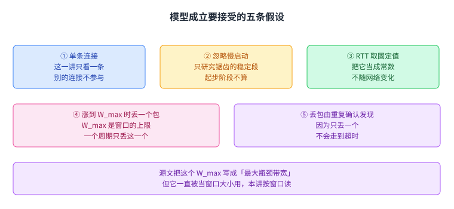
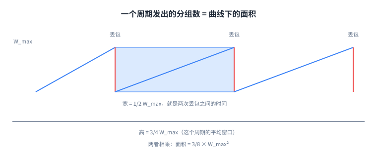
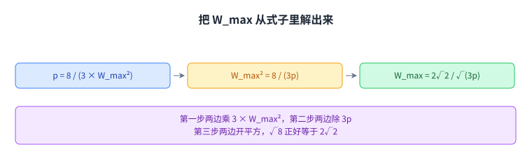
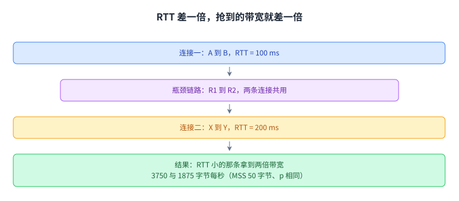
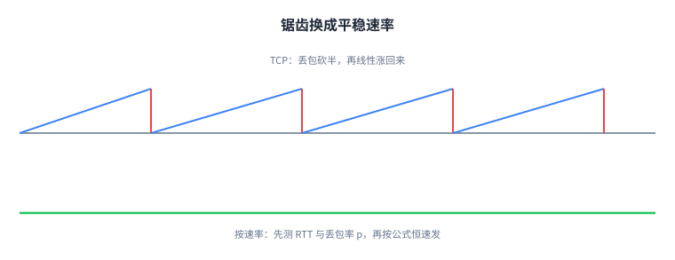

+++
title = "TCP 吞吐量模型：把速率写成 RTT 与丢包率的公式"
lecture = 24
slug = "tcp-throughput-model"
status = "draft"
source_kind = "textbook"
source_url = "https://textbook.cs168.io/transport/throughput-model.html"
source_title = "TCP Throughput Model"
output_mode = "explanation"
+++

> 来源课程：UC Berkeley CS168 Computer Networks（教材 CS 168 Textbook）；
> 对应内容：Transport 之 TCP Throughput Model（<https://textbook.cs168.io/transport/throughput-model.html>）；
> 上游许可：教材站在站根页声明 CC BY-SA 4.0（第二人复核见 `docs/audit/license-cs168-second-review.md`）；
> 本文由 CourseLingo 原创撰写：**按该节的推进顺序**重新讲解，关键句给出英文原文与中译，**不逐句全译**，配图全部自绘、不转载原图；
> 本文非官方材料，CourseLingo 与 UC Berkeley 及课程教学团队无隶属关系；如与原文有出入，以原文为准。

## 一、算法只说了怎么动，没说动到多少

前三讲把[[term:congestion-control]]的动作讲完了：没丢包就加窗口，丢了包就减，减多少也有定数。可这套规则从头到尾没有回答一个更基本的问题：一条连接实际能跑多快。

源文把这件事说得很直白。

> "This algorithm told us how to adjust rate in response to congestion, but it didn't actually tell us what that rate is."
> （这个算法只讲了怎么根据拥塞调整速率，没说那个速率究竟是多少。）

这一讲要解决的就是这个缺口。目标是一条简单公式，把[[term:throughput]]写成路径的[[term:round-trip-time]]与[[term:loss-rate]]的函数。源文说，有了它，运营商与用户都能估出一条 TCP 连接的速率。

为了让公式推得下去，源文给模型配了假设。第一句列了三条：只有一条 TCP 连接；忽略慢启动阶段；RTT 是某个固定值。紧跟的一段又补了两条：窗口涨到 W_max 的那一刻正好丢一个包；既然只丢这一个，丢包会被[[term:duplicate-ack]]发现，不会出现[[term:timeout]]。

这五条把网络简化成一道能动手算的算术题：丢包按次数发生，一次只丢一个[[term:packet]]，发生的位置固定在窗口的上限。

有一处措辞要当场说清。源文把 W_max 写成 "the maximum bottleneck bandwidth"，字面是「最大瓶颈带宽」。可从下一节起，它一直当窗口大小用，单位是分组，源文的图里也把它画在纵轴上。本讲按「窗口大小的上限」来读它，这个出入原样留在溯源里。这一节的落点是：后面每一步推导都只在这一组假设下成立，换掉任何一条，公式就得重来。

## 二、先用窗口把吞吐量写出来

模型里的[[term:window]]只有两个动作。涨到 W_max 时丢掉一个分组，窗口立刻砍到它的一半；之后每过一个 RTT 涨 1 个分组，W_max/2 + 1、W_max/2 + 2、W_max/2 + 3，一路爬回 W_max，再砍半，如此反复。

这里的窗口就是[[term:congestion-window]]。本讲沿用上一讲的口径：它按分组算，只由拥塞控制来调。

从 W_max/2 爬回 W_max，每次加 1，所以要走 W_max/2 个 RTT。源文由此得到一句关键的话：两次丢包之间隔着 W_max/2 个 RTT。W_max 本身是某个常数，源文没有给它具体数值，它代表这条路径能承受的窗口上限，超过它就会丢包。

再看一个周期里窗口的平均值。窗口从 W_max/2 起步，线性爬到 W_max，中间不回头。源文说平均值是 3/4 W_max，理由很省：它正好落在 W_max/2 与 W_max 的中点。这条上升画在图上是一条斜线，中点的位置也就是整个周期的平均值。

这个反复上下的形状就是上一讲说的[[term:sawtooth]]。每个 RTT 加 1 个分组正是上一讲的加法增，本讲用得上它的一个副产品：窗口随时间的变化是一条直线，面积好算。窗口的单位还需要一次换算：这些数字按分组算，因为每次加的是 1 个分组。每个分组能装 [[term:maximum-segment-size]] 那么多个字节，源文简写成 MSS，所以平均窗口换成字节是 3/4 W_max × MSS。窗口还告诉我们每个 RTT 能送多少数据，拿它除以 RTT 就得到速率。

把数字代进去看一遍。设 W_max = 10 个分组，MSS = 50 字节，RTT = 100 ms。平均窗口是 3/4 × 10 = 7.5 个分组，换成字节是 7.5 × 50 = 375 字节。每个 RTT 送 375 字节，而一个 RTT 是 0.1 秒，所以速率是 375 / 0.1 = 3750 字节每秒。

这一节的落点是一个能算的式子：吞吐量 = 3/4 W_max × MSS / RTT。它唯一不好办的地方是里头还留着 W_max，而 W_max 是多大，一个发送方未必知道。

## 三、把 W_max 换成丢包率

W_max 不好测，丢包率 p 却可以直接数：发了多少分组，丢了多少个。源文接下来要做的，就是把公式里的 W_max 整个换成 p。判断有没有[[term:packet-loss]]，看的就是这两个计数。

做法是先数出两次丢包之间一共发了多少个分组。源文说，这个数量和曲线下的面积是一回事，面积等于速率乘时间。目的也很明确：吞吐量要写成 RTT 与丢包率的函数，因为这两个量测得到，而 W_max 是发送方一路探出来的，不在那条连接上就无从知道。

一个周期的时间宽度是 W_max/2 个 RTT，高度是平均窗口 3/4 W_max 个分组每 RTT。源文的配图把这两个量直接画了出来：一块矩形的宽是 0.5 × W_max 个 RTT，高是 3/4 × W_max 个分组。

两者相乘就是这一周期发出的分组数：

(1/2 W_max) × (3/4 W_max) = 3/8 W_max²。

这就是图里那块矩形的面积，也是两次丢包之间发出的分组总数。

拿到这个数，丢包率就能写出来。两次丢包之间发 N 个分组、丢了 1 个，丢包率就是 1/N。源文顺口给了个例子：两次丢包之间发 100 个分组，丢包率就大约是 1/100。把 N = 3/8 W_max² 代进去，得到 p = 1 / (3/8 W_max²) = 8 / (3 W_max²)。

到这里 W_max 和 p 有了关系，剩下的只是代数。两边同乘 3 W_max²，再两边同除 3p，得到 W_max² = 8 / (3p)，最后开平方，W_max = 2√2 / √(3p)。那个 2√2 来自 √8。

把 W_max 代回上一节的式子，化简只要两步。3/4 乘 2√2 得 3√2/2，再除以 √3，正好是 √(3/2)。

吞吐量 = 3/4 W_max × MSS / RTT = 3/4 × (2√2 / √(3p)) × MSS / RTT = √(3/2) × MSS / (RTT √p)。

最后这一行就是本讲要的那条公式，右边只剩 RTT 与 p 两个能测的量。

拿数字再走一遍这条新路，看会不会撞上上一节的答案。W_max = 10 个分组时，p = 8 / (3 × 100) = 0.0266667，开平方得 √p ≈ 0.1633。RTT 乘它得 0.01633 秒，MSS 除这个数得 3061.9 字节每秒，再乘 √(3/2) ≈ 1.2247，还是 3750 字节每秒。两条路给出同一个数。

这一节的落点是：只要知道 RTT 和丢包率，吞吐量就能算出来，不必先知道窗口一路涨到过多大。

## 四、这条公式说了什么

公式给出两条反比关系，源文逐条给了直觉。

吞吐量与丢包率的平方根成反比。丢包率越高，吞吐量越低。源文的解释很简单：丢得多，窗口被砍半的次数就多。

吞吐量与 RTT 成反比。RTT 越低，吞吐量越高。源文的解释是：窗口每收到一个确认就往上加，RTT 小意味着确认来得更勤。

第二条关系在多条连接并存时会变成一件麻烦事。源文配的图里是两条连接：A 到 B 的 RTT 是 100 ms，X 到 Y 的 RTT 是 200 ms，两条都经过中间的路由器 R1 与 R2，共用中间那一段[[term:bottleneck-link]]。源文的结论是，RTT 低的那条拿到的[[term:bandwidth]]是另一条的两倍。

这里的「两倍」值得算一下它从哪来。公式给出的是反比关系，RTT 从 100 ms 变成 200 ms，吞吐量正好减半。用上一节的数：MSS 与 p 不变时，100 ms 那条是 3750 字节每秒，200 ms 那条是 1875 字节每秒。所以倍数是两条 RTT 的比，而源文那张图给的两条连接刚好差一倍。RTT 只差三成时，倍数是 1.3，不会是 2。

源文对这个问题的态度很直白：RTT 不齐时 TCP 是不公平的，短 RTT 既缩短了传播时间，又让 TCP 更快地把速率拉起来。源文把这一点算作 TCP 的一个特性，实践中不做处理。这里说的[[term:fairness]]，指的正是多条连接分带宽时各自拿到多少。

这一节的落点：公式里的 RTT 不只是延迟，它还决定了一条连接抢带宽的能力；两条连接的 RTT 差距，会直接变成带宽差距。

## 五、把锯齿换成一条算出来的速率

前面这套协议给出的吞吐量是忽高忽低的。源文说结果是 choppy throughput：速率在 W/2 与 W 之间反复摆动。有些应用不喜欢这种节奏，做流媒体的那些更想按一个平稳的速率发数据。

源文给的办法叫 equation-based congestion control，也叫[[term:rate-based-congestion-control]]。它把动态调速率的那套规则整个放下，改成直接照公式办：测出 RTT 与丢包率，代进去，算出多少就按多少发。

公平性也照顾到了。源文说这个方案不会多占带宽，因为公式本身就保证了它吃得不会比同样情形下的 TCP 更多。源文在同一处指向 [[term:rfc]] 5348 去查细节。

想自己把公式核一遍的话，可以用 Wireshark 抓一段连接，量出 RTT、数出丢包，再把两个数代进去。这套算法跑在端主机的操作系统里（上一讲那份实现就在那里），Linux 这类系统的发送方按同一套逻辑调窗口。

源文最后给了一个更一般的说法。一个替代实现只要在与 TCP 共存时该降速就降速，就被认为是[[term:tcp-friendly]]；一条链路上有的主机跑 TCP、有的跑替代算法，带宽照样公平地分享。

这一节的落点：公式不只是个解析工具，它还能直接当发送速率用。代价是这条路不再对每一个丢包做即时反应，它要靠把 RTT 与丢包率测准来换取平稳。

## 六、脉络回顾

这一讲把前面三讲的拥塞控制接上了一个数值上的答案。算法只说丢包就减、没丢包就加，公式才回答那条连接到底能跑多快。

模型建立在五条假设上：只有一条连接，忽略慢启动，RTT 取固定值，窗口涨到 W_max 时正好丢一个包，而且这个包由重复确认发现。后两条让锯齿变成一串整齐的周期。

用窗口写吞吐量只要三步。一个周期的窗口从 W_max/2 线性涨到 W_max，平均是 3/4 W_max；乘上 MSS 换成字节；再除以 RTT 就是速率，也就是吞吐量 = 3/4 W_max × MSS / RTT。数字例子里，W_max = 10 个分组、MSS = 50 字节、RTT = 100 ms 给出 3750 字节每秒。

换成丢包率要多走几步。一个周期发 (1/2 W_max) × (3/4 W_max) = 3/8 W_max² 个分组，其中丢 1 个，于是 p = 8 / (3 W_max²)。反解出 W_max = 2√2 / √(3p)，代回去化简得吞吐量 = √(3/2) × MSS / (RTT √p)。同一个数字例子走这条路，还是 3750 字节每秒。

公式的两条反比关系带来一个后果：RTT 小的连接抢到的带宽更多。源文的图里两条连接差一倍 RTT，抢到两倍的带宽；源文认为这是 TCP 的特性，实践中不做处理。最后一种用法是干脆照公式发，也就是基于速率的拥塞控制，它换来平稳的速率，同时靠公式保证与 TCP 一样不多占带宽，这种实现被叫作 TCP 友好。

## 读完应该能回答

1. 为什么拥塞控制算法本身不能告诉你速率，还需要一条额外的公式。
2. 模型为什么可以假定「窗口涨到 W_max 时丢一个包」，这个假定省掉了哪些麻烦。
3. 两次丢包之间为什么是 W_max/2 个 RTT，这个长度是怎么数出来的。
4. 一个周期的平均窗口为什么是 3/4 W_max，3/8 W_max² 这个面积怎么来的。
5. 从 p = 8 / (3 W_max²) 到 W_max = 2√2 / √(3p)，每一步做了哪个代数操作。
6. 吞吐量 = √(3/2) × MSS / (RTT √p) 里的两条反比关系各自意味着什么。
7. 两条 RTT 相差一倍的连接，为什么抢到的带宽相差一倍，「两倍」这个数从哪来。
8. 基于速率的拥塞控制放弃了什么，TCP 友好的判据是什么。

## 溯源

- 对应：UC Berkeley CS168 Computer Networks，教材 Transport 之 TCP Throughput Model（<https://textbook.cs168.io/transport/throughput-model.html>）
- 教材：CS 168 Textbook（UC Berkeley CS168 课程教材），原文链接同上
- 授权依据：教材站在站根页声明 CC BY-SA 4.0；本文为本仓库原创中文讲解，按该节顺序重讲，关键句给出英文原文与中译，**未逐句全译**，配图自绘
- 字段核对：本讲清单 `docs/lecture-manifest.md` 第 24 行为 `tcp-throughput-model` / `TCP Throughput Model` / `/transport/throughput-model.html`；2026 年抓取该页时 `<title>` 为 `TCP Throughput Model | CS 168 Textbook`，H1 为 `TCP Throughput Model`。三处一致，派单字段与来源一致
- 源文件与范围：2026 年抓取的该页 HTML 共 28,560 字节；正文起始锚点 `#main-content` 在字符偏移 3251 处；`#main-content` 内共 **5 个二级小节**，依次为 Modeling Assumptions / Throughput in Terms of Window Size / Throughput in Terms of Loss Rate / Implications of Equation / Rate-Based Congestion Control
- 源页共 **3 张配图**，本讲逐张抓取核对过：`3-088-equation1.png`（锯齿图：三个顶点标 Loss，顶线 W_max，谷值线 0.5 × W_max，虚线标 Average: 3/4 × W_max，下方括号标 (0.5 × W_max) RTTs / Time between losses）、`3-089-equation2.png`（同一条锯齿，另加一块浅蓝矩形，标 Width = (0.5 × W_max) 与 Height = (3/4 × W_max)）、`3-090-multi-flow.png`（拓扑：A 与 B 之间 100 ms，X 与 Y 之间 200 ms，两条连接的路径都经过中间的路由器 R1 与 R2）
- 源里 `TODO` 标记实测 **0 处**（全文检索 "TODO" 无命中），因此本讲没有任何「待补」项被代补
- 结构说明：本页 5 个正文章节与源文 5 个小节**一一对应**，没有合并或重排。源文 Implications of Equation 一节的两条反比关系、多连接的不公平、以及 Rate-Based Congestion Control 一节，分别落进第四章与第五章

## 溯源：照录与存疑

- **照录（源文自身的措辞出入，已在正文就地说明）**：源文在 Modeling Assumptions 一节写 "When the window size reaches the maximum bottleneck bandwidth \(W_\text{max}\) (some constant)"，把 W_max 称作「最大瓶颈带宽」，而它随后一直以窗口大小的身份使用：下一句就是 "for each subsequent RTT, our window size will increase by 1"，同节还写 "This window size is measured in packets"。源文自己的配图也把 W_max 画在纵轴（窗口/速率的刻度）上。⇒ 我们照录这个措辞（正文引了英文原句），并在正文里按「窗口大小的上限」读它，未静默改写源文
- **存疑（已就地核对，报给 Lead）**：源文在 Implications of Equation 一节写 "it turns out the lower-RTT connection gets twice as much bandwidth as the higher-RTT connection"，句子本身没有给 RTT 的倍数。本讲能指认的倍数来源是它紧邻的那张配图 `3-090-multi-flow.png`，图上两条连接的 RTT 是 100 ms 与 200 ms，正好差一倍；而公式给出的是反比关系，倍数等于两条 RTT 之比。⇒ 我们照录「两倍」这个结论，并在正文里补一句说明：倍数来自图中 100 ms 与 200 ms 这一对取值，RTT 只差三成时倍数是 1.3
- **存疑（单位读法，已就地说明）**：源文在 Throughput in Terms of Loss Rate 一节写 "the number of packets sent is the area of this shape (rate times time), or equivalently, the area under the curve (the curve shows rate, and we want integral of rate)"。而同一张配图 `3-089-equation2.png` 把纵轴标成 W_max / 0.5 × W_max / 3/4 × W_max，也就是窗口的刻度；源文上一节才把窗口定义为「数据量」、把速率定义为窗口除以 RTT。两种读法能同时成立，是因为这里的时间以 RTT 为单位，于是「每 RTT 发多少分组」既是窗口的读数也是速率的读数。我们按源文的用法写（面积 = 宽 0.5 W_max × 高 0.75 W_max），并在正文里点明宽的单位是「个 RTT」、高的单位是「个分组每 RTT」

## 溯源：核过的算术、我们补的、术语取舍

- **我们核过的算术（源文数字均已逐条验算，无冲突）**：从 1/2 W_max 每次加 1 爬到 W_max 要走 1/2 W_max 次，即 1/2 W_max 个 RTT；1/2 W_max 与 W_max 的中点是 3/4 W_max；1/2 × 3/4 = 3/8；p = 1 ÷ (3/8 W_max²) = 8/(3 W_max²)；由 3 W_max² p = 8 得 W_max² = 8/(3p)，再得 W_max = √8/√(3p) = 2√2/√(3p)；3/4 × 2√2 = 3√2/2 ≈ 2.1213，除以 √3 ≈ 1.7321 得 1.2247，与 √(3/2) ≈ 1.2247 相符；源文那句「两次丢包之间发 100 个分组，丢包率就大约是 1/100」与 p = 1/N 的定义一致。数字例子：W_max = 10 个分组、MSS = 50 字节、RTT = 100 ms ⇒ 平均窗口 7.5 个分组 = 375 字节，375 ÷ 0.1 = 3750 字节每秒；同一例走公式 p = 8/300 = 0.0266667、√p ≈ 0.16330、RTT·√p ≈ 0.016330、50 ÷ 0.016330 ≈ 3061.9、× 1.2247 ≈ 3750.0 字节每秒；一周期长 0.5 × 10 = 5 个 RTT = 0.5 秒，发出 5 × 7.5 = 37.5 个分组，与 3/8 × 100 = 37.5 一致，也给出 p = 1/37.5 = 0.0266667
- **我们补的（源文没有写）**：五条假设的分组读法（源文第一句列三条、下一段补两条，本讲把它们并成「五条」，并补了「这五条把网络简化成一道算术题」这一句总结）；「这里的窗口是拥塞窗口、按分组算、只由拥塞控制来调」这句交代（本讲这条源文没有解释窗口指的是哪个窗口，口径取自上一讲）；「W_max 代表这条路径能承受的窗口上限」与「每 RTT 加 1 就是加法增，窗口随时间是一条直线，面积好算」这两处读法；数字例子里的 W_max = 10 个分组、MSS = 50 字节、RTT = 100 ms 这一整组取值，以及由它算出的 7.5 个分组、375 字节、3750 字节每秒、5 个 RTT、37.5 个分组、0.0266667 等数（源文全篇没有代入任何数字）；先乘 3 W_max²、再除 3p、最后开平方这三步的名字，以及「2√2 来自 √8」「3/4 乘 2√2 得 3√2/2，再除以 √3 正好是 √(3/2)」这两处化简说明；把源文配图 `3-090-multi-flow.png` 里的 R1/R2 与 100 ms/200 ms 读进正文（源文正文只写了「RTT 低的那条拿到两倍带宽」）；把源文配图 `3-089-equation2.png` 上的矩形读数（宽 0.5 × W_max、高 3/4 × W_max）写进正文；1875 字节每秒这个数（100 ms 那条 3750 除以 2 得到）；「RTT 只差三成时倍数是 1.3」这句反例说明；用 Wireshark 抓包核对与「Linux 这类系统按同一套逻辑调窗口」这两句建议（本讲这条源文没有点名任何工具或系统）；配图里把目标公式写成「吞吐量 = f(RTT, 丢包率 p)」这个记号（源文只用文字说要一条这样的公式）；第五章最后一句对代价的总结（源文只讲基于速率的方案换来平稳与公平，没写它的代价）
- 术语取舍：`throughput` 译作「吞吐量」，`loss rate` 译作「丢包率」，`rate-based congestion control` 译作「基于速率的拥塞控制」，`TCP-friendly` 译作「TCP 友好」；本讲新增术语已登记进 `glossary.toml`（throughput / loss-rate / rate-based-congestion-control / tcp-friendly，共 4 条），其余术语沿用前几讲
