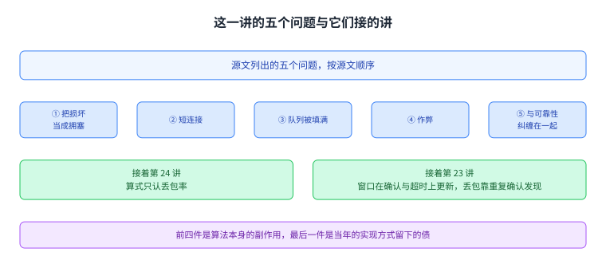
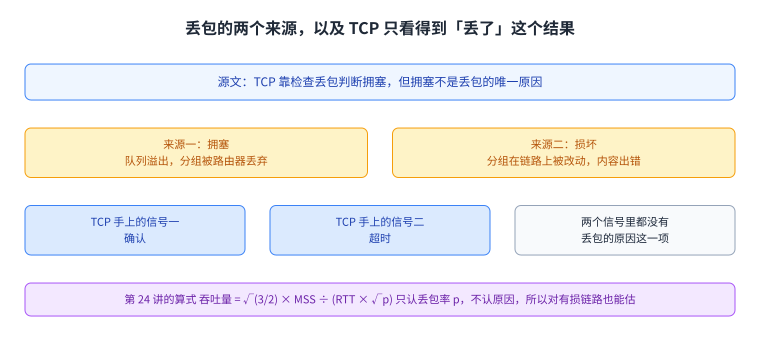
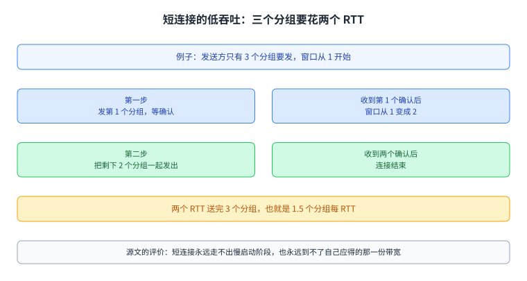
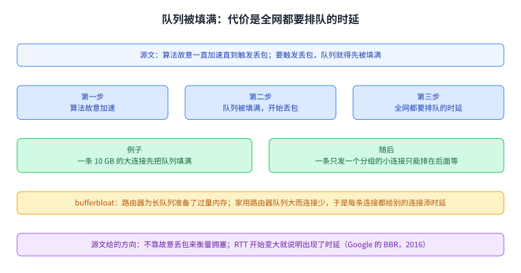
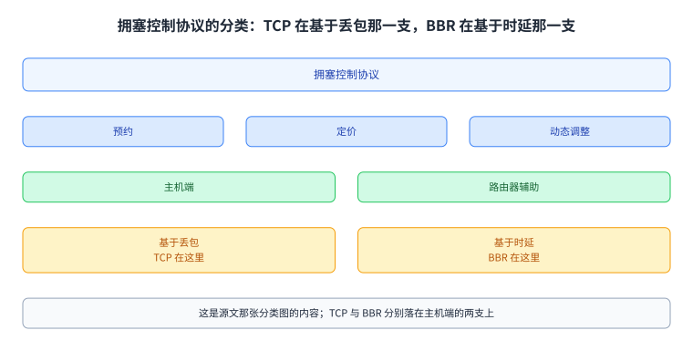
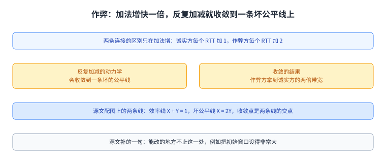
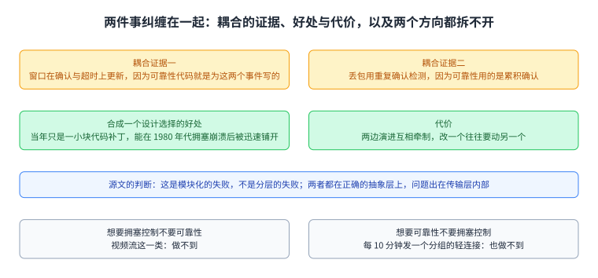

+++
title = "拥塞控制的麻烦事：五个绕不开的问题"
lecture = 25
slug = "congestion-control-issues"
status = "draft"
source_kind = "textbook"
source_url = "https://textbook.cs168.io/transport/cc-issues.html"
source_title = "Congestion Control Issues"
output_mode = "explanation"
+++

> 来源课程：UC Berkeley CS168 Computer Networks（教材 CS 168 Textbook）；
> 对应内容：Transport 之 Congestion Control Issues（<https://textbook.cs168.io/transport/cc-issues.html>）；
> 上游许可：教材站在站根页声明 CC BY-SA 4.0（第二人复核见 `docs/audit/license-cs168-second-review.md`）；
> 本文由 CourseLingo 原创撰写：按该节的推进顺序重新讲解，关键句给出英文原文与中译，不逐句全译，配图全部自绘、不转载原图；
> 本文非官方材料，CourseLingo 与 UC Berkeley 及课程教学团队无隶属关系；如与原文有出入，以原文为准。

## 一、这一讲要解决什么问题

前面四讲把 [[term:congestion-control]] 讲成了一个能跑、也能算的东西。第 21 讲给原则，第 22 讲给设计，第 23 讲把 [[term:slow-start]]、加法增与快恢复落成代码，第 24 讲给出了一条把吞吐量写成 [[term:round-trip-time]] 与 [[term:loss-rate]] 的算式。

这一讲换一个方向：这套东西会出什么问题。源文列了五件，彼此独立：把损坏当成拥塞、短连接、队列被填满、作弊，以及拥塞控制与可靠性纠缠在一起。五件里有四件是「算法本身的副作用」，最后一件是「实现方式留下的债」。

这五件里有两件直接接着前几讲。第一件用的就是第 24 讲那条算式；第五件用的是第 23 讲的实现细节，也就是窗口在哪些事件上被更新、丢包靠什么信号被识别。所以这一讲既可以当「这一章的收尾」，也可以当下一讲的起点。

图里上面一排是源文列出的五个问题，下面两格标出它们各自接着哪一讲。看这一页时可以把它当成拥塞控制这一章的「欠账清单」。

## 二、把损坏当成拥塞

源文的第一句就把矛盾摆出来了：

> TCP detects congestion by checking for packet loss, but congestion isn't the only reason packets would be lost.

中译：TCP 靠检查[[term:packet-loss]]来判断拥塞，但拥塞并不是[[term:packet]]丢失的唯一原因。

紧接着的一句有一个措辞出入，我们照录原文：

> Packets could also be lost from congestion, and TCP cannot distinguish between loss due to corruption or congestion.

按上下文，这句里前一个 congestion 应当是 corruption，因为源文下一句马上就说「如果分组被损坏，TCP 仍然会降速」。我们照录原句，不替它改字。

这个区分为什么重要，源文接着说了：

> If a packet is corrupted, TCP will still drop its rate, even if the network isn't congested.

中译：如果分组被[[term:corruption]]了，即使网络并不拥塞，TCP 仍然会降低速率。也就是说，发送方看到的是一个它无法解释的结果：丢包。它手上能用的信号只有 [[term:acknowledgment]] 与 [[term:timeout]]，这两个信号里都没有「丢的原因」这一项。TCP 把字节流交给 IP 层转发，丢包发生在下面那一层，而 TCP 只看得到自己这一层的确认与超时。

第 24 讲那条算式也认不出原因。源文说：

> The throughput and loss rate are inversely proportional, even for non-congestion losses.

中译：吞吐量与丢包率成反比，即使丢包并非来自拥塞。第 24 讲给出的式子是 吞吐量 = √(3/2) × MSS ÷ (RTT × √p)，式子里的 p 只是丢包率。于是它能被反过来用：给一条容易损坏分组的链路（源文的例子是无线链路），代入它实测的丢包率，就能估出这条链路上 TCP 的[[term:throughput]]会有多快。

图里上面是丢包的两个来源，下面是 TCP 手上的两样信号与第 24 讲那条算式。这一节的落点不是「怎么修」，而是「为什么这个问题在 TCP 的信息范围内修不了」。

## 三、短连接：还没热身就结束

源文给了一组现实里的数字：

> 50% of connections send fewer than 1.5 KB, and 80% of connections send less than 100 KB. Very few packets (maybe only one) are sent during these connections.

中译：现实中一半的连接发送不到 1.5 KB，八成不到 100 KB；这些连接里被送出的分组很少，也许只有一个。这组数字的后果与「窗口每 RTT 加一」这条规则直接冲突，因为窗口要涨起来需要好几个 RTT。

源文给了一个最小例子：假设发送方只有 3 个分组要发。窗口从 1 开始，先发第一个；等到确认之后窗口变成 2，把剩下两个一起发出；再等两个确认，结束。整个连接花了两个 RTT 送完 3 个分组，平均速率是 1.5 个分组每 RTT。源文对这个结果的评价是，短连接因此永远走不出慢启动阶段，也永远到不了自己应得的那一份带宽，于是传输时间被拖得没必要地长。

第二个问题出在丢包处理上。源文提醒，丢包是靠三个重复确认（[[term:duplicate-ack]]）发现的，而短连接里可能根本没有那么多分组去凑出三个重复确认。它举的例子是 4 个分组、丢了第 2 个：这时永远等不到三个重复确认，只能等[[term:timeout]]触发；而现实里的超时值大约是 500 毫秒。对一个只发 4 个分组的连接来说，这 500 毫秒足以把总时间拉长一个量级。

源文给的部分修复办法是把初始窗口调大，例如从一开始的 1 个分组改成 10 个分组。这样凡是数据量不超过 10 个分组的连接，都能在连接开头一次把数据发完，上面两个问题里「涨窗口太慢」这一半就被绕过去了。

图里上面一行是那个三分组例子的第一步，下面一行是第二步，最下面给出结果 1.5 个分组每 RTT。这张图对应源文配图里那张发送方与接收方之间的时序图。

图里上面是四个分组丢第二个的情形，中间是它会走上的两种等待，下面是源文给的部分修复与它的边界。注意这个修复只解决一半：初始窗口能覆盖数据量，但覆盖不了丢包。

## 四、TCP 把队列填满

源文对这件事的表述很直接：

> TCP detects congestion using loss, and the congestion control algorithm deliberately increases the rate until triggering loss. In order to trigger loss, queues need to fill up.

中译：TCP 用丢包来探测拥塞，而算法会**故意**一直加速直到触发丢包；要触发丢包，队列就得先被填满。接下来那一句是它的代价：

> This means that TCP introduces queuing delays throughout the network, and the delays affect everybody in the network.

中译：这意味着 TCP 在全网引入了排队时延，而这时延影响网络里的每一个人。源文用一条 10 GB 的大连接加一条只发一个分组的小连接来说明：两条连接共用同一条[[term:bottleneck-link]]，大连接会一路加速到把队列填满；等小连接开始时，它只能排在大连接的分组后面等。

如果路由器把队列做得特别大，这件事会更糟。源文给这种现象起了名字：

> Routers having excessive memory for long queues is called bufferbloat.

中译：路由器为长队列准备了过量内存，这种现象叫[[term:bufferbloat]]。源文举的例子是家用路由器：队列很大，而用它的连接很少（只有你自己家里的那几条），于是你建的任何一条连接都会给别的连接带来很大的排队时延。

源文给的方向是换一种拥塞信号，不要靠故意丢包：

> To avoid queues filling up, we could find a way to measure congestion that doesn't involve deliberately triggering losses. In particular, we could detect congestion when the RTT starts increasing, which indicates delay.

中译：要避免队列被填满，可以找一种不靠故意触发丢包的拥塞度量；具体地说，可以在 RTT 开始变大时判定拥塞，因为 RTT 变大说明出现了时延。源文把这条路指向 Google 在 2016 年提出的 [[term:bbr]] 算法：发送方学到自己的最小 RTT，一旦发现 RTT 超过这个最小值，就降低速率。

图里上面是「用丢包探测拥塞 ⇒ 必须填满队列」这条因果链，下面是大小连接争用同一条瓶颈链路的例子与 bufferbloat。最下面一条是源文指向的另一个方向。

图里是一棵分类树，对应源文那张分类图：最上面是拥塞控制协议，下分预约、定价与动态调整三支；动态调整再分主机端与路由器辅助；主机端再分基于丢包与基于时延，源文在图上分别标了「TCP 在这里」与「BBR 在这里」。

## 五、作弊：没人强制你守规矩

源文第一句就是结论：

> There is nothing enforcing that senders have to follow the TCP congestion control algorithm. Senders could cheat to get an unfairly large share of the bandwidth.

中译：没有任何机制强制发送方遵守 TCP 的拥塞控制算法；发送方可以作弊去拿一份不公平的大带宽。

它给的第一个例子是让窗口涨得更快，例如每个 RTT 加 2 而不是加 1。这个时候把它放进第 22 讲那张二维图里看：如果一条连接诚实、另一条作弊，[[term:aimd]] 的反复加减会收敛到一条坏的[[term:fairness]]线上，作弊的那条拿到诚实那条的两倍[[term:bandwidth]]。源文的配图上，这条坏公平线写作 X = 2Y，而效率线仍是 X + Y = 1，两条线的交点就是这套动力学收敛到的地方。源文还补了一句，能改的地方不止这一处，例如把初始窗口设得非常大。

为什么现实里没有大面积作弊，源文给了一个实现层面的理由：

> because TCP is implemented in the operating system, in order to cheat, the sender would have to modify the code in their operating system, which the vast majority of Internet users don't do.

中译：因为 TCP 实现在操作系统里，想作弊就得改自己操作系统里的代码，而绝大多数互联网用户不会这么做。Linux 这类系统里 TCP 就在内核里，所以这个门槛是真实存在的。源文接着推演了两种规模下的不同后果：少数人作弊，这些人会拿到更多带宽；但如果作弊的人很多，例如微软发布了一个滥用 TCP 的 Windows 版本，那么几百万个 Windows 用户仍然在互相竞争，最后不太可能有人真的拿到更多。

还有一条不需要改协议就能作弊的路：多开连接。源文指出，TCP 只保证每条连接拿到公平的一份；如果作弊方开 10 条连接而诚实方开 1 条，作弊方就能拿到 10 倍带宽，而许多应用正是有意多开连接来提升带宽的。

接下来是这一节最诚实的两段。第一段问：既然可以作弊，为什么 [[term:internet]] 没有再来一次拥塞崩溃。源文说，研究者其实也不知道答案。它给了一种可能：改协议的作弊者虽然多拿了一份，但如果他仍然遵守拥塞控制的原则（例如丢包就降速），他就没有把网络压垮；而 1980 年代那次[[term:congestion-collapse]]里，发送方是**不停地按高速率重发**，根本没有「降速」这个概念。第二段问作弊到底有多普遍，源文说同样不知道，而且作弊本身很难测量，因为你并不知道每一台发送方实际在用什么窗口。要看清窗口，得在发送方一侧像 Wireshark 那样抓包，而网络中间的人看不到发送方的窗口。

图里左边是两条连接的加法增差别，右边是它们收敛到的那条公平线与两条连接拿到的比例。这张图对应源文配图里那张带效率线与公平线的二维图。

图里上面是三条不需要改协议或改代码的作弊路径，下面是源文承认答不上来的两个问题与它给的一种可能解释。

## 六、拥塞控制与可靠性纠缠在一起

最后一节讲的不是算法的副作用，而是实现方式留下的债。源文开头就说：

> The mechanisms for congestion control and reliability are tightly coupled. As we saw, congestion control was implemented by taking the code for TCP reliability and tweaking a few lines of code.

中译：拥塞控制与可靠性的机制是紧耦合的；如我们所见，拥塞控制就是拿 TCP 可靠性的代码改了几行实现的。

耦合在算法本身的写法上随处可见。源文举了两处：窗口之所以在确认与超时这两个事件上更新，是因为可靠性的代码本来就是为这两个事件写的；丢包之所以用重复确认来检测，是因为可靠性的实现用的是[[term:cumulative-ack]]。换句话说，拥塞控制借用了可靠性已经搭好的脚手架。

源文把「合在一起」称为一个设计选择，并把它的两面都写了出来。好处是当年这次改动只是一小块代码补丁，因而能在 1980 年代那场拥塞崩溃之后被迅速、广泛地铺开。代价是此后两边的演进互相牵制：想改拥塞控制的某个地方，往往要连可靠性代码一起改；反过来想把可靠性实现换掉（例如把累积确认换成[[term:full-information-ack]]），也得同步改拥塞控制。这些行为都被写进 [[term:rfc]]，所以一次改动往往要连带动两份规范与两处代码。

这一节的判断值得单独记：

> From a design perspective, this is a failure of modularity, not layering.

中译：从设计角度看，这是**模块化**的失败，不是分层（[[term:layering]]）的失败。源文把理由说得很清楚：拥塞控制与可靠性都在正确的抽象层上，也就是传输层；问题出在传输层内部，我们没有把不同的功能干净地分到代码的不同部分去。

耦合还带来两处做不到。其一是「只要拥塞控制、不要可靠性」做不到：源文举了视频流这类应用，它可能并不需要可靠性，但仍然需要拥塞控制，而现在没有办法关掉可靠性只留拥塞控制。其二是反方向也做不到：一条每 10 分钟才发一个分组的轻连接大概不需要拥塞控制，但也没有办法只对某几条连接关掉它。

图里上面是耦合在算法写法上的两处证据，中间是合成一个设计选择的好处与代价，下面是源文那句「失败在模块化而不是分层」与两个方向都做不到的事。

## 读完应该能回答

1. 这一讲的五个问题分别是什么，哪两个直接接着第 23、24 讲。
2. 为什么 TCP 区分不了「丢包是因为损坏」与「丢包是因为拥塞」，它手上能用的信号有哪两个。
3. 第 24 讲那条算式为什么对非拥塞造成的丢包也成立。
4. 现实中连接的规模分布是什么，三分布两个 RTT 这个例子算出的速率是多少。
5. 短连接为什么凑不出三个重复确认，等超时要等多久，源文给的部分修复是什么。
6. TCP 为什么要先把队列填满，bufferbloat 是什么，BBR 用的信号是什么。
7. 作弊者把加法增改成加二之后，AIMD 会收敛到哪里，为什么现实里没有大面积作弊。
8. 拥塞控制与可靠性在哪两处写法上耦合，源文为什么说这是模块化的失败而不是分层的失败。

## 脉络回顾

这一讲是拥塞控制这一章的收尾，它的位置由两条线定住。往上一讲看，第 24 讲给了一条算式，把吞吐量写成 RTT 与丢包率的函数；这一讲的第一节就直接引用它，说明那条式子只认丢包率、不认丢包的原因，因此对损坏造成的丢包同样成立。往更早看，第 23 讲把慢启动、加法增与快恢复落成了代码，而这一讲最后一节讲的正是那段代码的出身：它是拿可靠性的代码改出来的。

五个问题可以按「谁的麻烦」分成两组。前四个是算法本身的副作用：它把损坏误当成拥塞，于是明明不拥塞也降速；它靠每 RTT 加一来涨窗口，于是数据量小的短连接还没热身就结束，而且凑不出三个重复确认去触发快速重传，只能等大约 500 毫秒的超时；它用丢包当作拥塞信号，于是必须先把队列填满，代价是全网的排队时延，队列做得过大时这个代价会长期化，也就是 bufferbloat；它没有任何强制力，于是多加一、多开连接这类作弊都能换来不公平的份额。

第五个问题不一样，它不是算法的副作用，而是实现方式留下的债：拥塞控制与可靠性共用同一套脚手架，窗口在确认与超时上更新、丢包用累积确认的重复确认来检测，两者因此改一个就得动另一个。源文对这一条的判断最重：它是模块化的失败，而不是分层的失败。

还有两处源文明确说「不知道」的地方值得记住：既然可以作弊，为什么互联网没有再来一次拥塞崩溃；以及作弊在实践中到底有多普遍。它给的解释只是一种可能，也就是作弊者仍然遵守了「丢包就降速」这条原则，而 1980 年代那次崩溃里没有这条原则。

## 溯源

- 字段核对：本讲清单 `docs/lecture-manifest.md` 第 25 行为 `congestion-control-issues` / `Congestion Control Issues` / `/transport/cc-issues.html`；抓取该页时 `<title>` 为 `Congestion Control Issues | CS 168 Textbook`，H1 为 `Congestion Control Issues`。三处一致，派单字段与来源一致。
- 源文件与范围：抓取的该页 HTML 共 29,576 字节，正文锚点 `#main-content` 内共 5 个二级小节，依次为 Confusing Corruption and Congestion / Short Connections / TCP Fills Up Queues / Cheating / Congestion Control and Reliability are Intertwined，与 `docs/lecture-manifest.md` 里该讲的标题一致。页内 `TODO`／`FIXME`／`TBD` 标记实测 0 处。
- 源页三张配图逐张抓取核对过：`3-091-short-flow.png`（发送方与接收方之间的时序图：先一个分组下行、一个确认上行，再两个分组下行、两个确认上行，正是正文那个三分组例子的两步）；`3-092-delay-based-taxonomy.png`（分类树：拥塞控制协议 → 预约／定价／动态调整；动态调整 → 主机端／路由器辅助；主机端 → 基于丢包与基于时延，图上分别标 TCP is here 与 BBR is here）；`3-093-cheating-aimd.png`（二维图：蓝色效率线 X + Y = 1、绿色公平线 X = 2Y，一条折线轨迹收敛到两条线的交点，从原点出发的灰色虚线标出各点的比值）。三张图的内容与它们所在小节的文字一致。
- 结构说明：本页六个正文章节与源文五个小节不是一一对应。前三节里，第二节对应源文第一节，第三节对应源文第二节；第四节对应源文第三节并把那张分类图并了进来；第五节对应源文第四节；第六节对应源文第五节。也就是说，本页把源文第二节拆成了「低吞吐」与「丢包处理」两节来写，其余按源文顺序。
- 照录与存疑：源文第一节第二句写 `Packets could also be lost from congestion, and TCP cannot distinguish between loss due to corruption or congestion.`，句中前一个 congestion 按上下文应为 corruption（下一句就写「如果分组被损坏，TCP 仍然会降速」）。本页照录原句并在正文就地说明，未静默改字。
- 我们补的（源文没有写）：把五个问题分成「算法副作用」与「实现债」两组这个读法；第三节里「涨窗口太慢这一半被绕过去了、但覆盖不了丢包」这句边界说明；第五节里对分类树四层的读法；以及第三节那两页配图里对「两个 RTT」与「大约 500 毫秒」的图注写法。源文另外提到「我们所见的算式」，本页把它明确指向第 24 讲的 `吞吐量 = √(3/2) × MSS ÷ (RTT × √p)`，这是本页的对应，不是源文原文。
- 术语取舍：`corruption` 译作「损坏」、`bufferbloat` 译作「缓冲膨胀」，两条已登记进 `glossary.toml`（本讲新增 2 条）；其余术语沿用前几讲（congestion-control、packet-loss、loss-rate、round-trip-time、congestion-window、duplicate-ack、timeout、slow-start、aimd、fairness、layering、bottleneck-link、cumulative-ack、full-information-ack、congestion-collapse）。
