+++
title = "路由器协助拥塞控制：公平排队与显式拥塞通知"
lecture = 26
slug = "router-assisted-congestion-control"
status = "draft"
source_kind = "textbook"
source_url = "https://textbook.cs168.io/transport/router-based-cc.html"
source_title = "Router-Assisted Congestion Control"
output_mode = "explanation"
+++

> 来源课程：UC Berkeley CS168 Computer Networks（教材 CS 168 Textbook）；
> 对应内容：Transport 之 Router-Assisted Congestion Control（<https://textbook.cs168.io/transport/router-based-cc.html>）；
> 上游许可：教材站在站根页声明 CC BY-SA 4.0（第二人复核见 `docs/audit/license-cs168-second-review.md`）；
> 本文由 CourseLingo 原创撰写：按该节的推进顺序重新讲解，关键句给出英文原文与中译，不逐句全译，配图全部自绘、不转载原图；
> 本文非官方材料，CourseLingo 与 UC Berkeley 及课程教学团队无隶属关系；如与原文有出入，以原文为准。

## 一、主机侧的四处麻烦，能不能请路由器帮一把

到上一讲为止，拥塞控制一直是发送方自己这一端的事。它看不到网络内部，只能靠丢包这类间接信号去猜，猜错了再退回来。这一讲要解决的是另一条路：让[[term:router]]参与进来，这条路叫[[term:router-assisted-congestion-control]]。

源文开篇说，之前看到的[[term:host-based-congestion-control]]有若干问题，其中许多可以靠路由器帮忙解决。它紧接着把问题点了四处：

> "TCP confuses congestion and corruption. TCP fills up queues, has choppy rates, and performs poorly on short flows, all because hosts need to constantly adjust their rates to detect congestion."

（TCP 把拥塞与[[term:corruption]]混在一起；TCP 会把队列填满；速率一跳一跳；短连接表现很差。这四处的共同原因是，主机必须不停地调整速率才能探出拥塞。）

这四处里有三处就是上一讲那份清单上的条目：把损坏当成拥塞、把队列填满、短连接。剩下的一处，「速率一跳一跳」，第 24 讲写过它的来源：那里把忽高忽低的吞吐量叫 choppy，速率在 W/2 与 W 之间反复摆动。

源文给的出路都在路由器这一侧。一条是让路由器把拥塞告诉发送方，另一条更直接，把理想速率告诉它。它还给了一条顺带的好处：如果公平由路由器来强制，主机想作弊就难得多。

为什么这件事该落在路由器身上，源文的理由是位置决定的。拥塞发生在路由器上，所以路由器手里的信息通常比主机多。

这里有一处措辞要当场说清。源文把那句话里的「拥塞控制」写成了「拥塞路由」。按上下文它说的应当是拥塞控制，因为整段都在讨论路由器怎么参与到[[term:congestion-control]]里。本讲照录这个写法，并按「拥塞控制」来读它，英文原句留在溯源里。

代价也在同一段里。源文说这套做法可以非常有效，结果接近最优，指的是[[term:link]]利用率高、时延低。但把这类协议铺开很难：路由器要支持额外的功能，有些功能相当复杂，有些协议甚至要求每一个路由器都同意加上它。

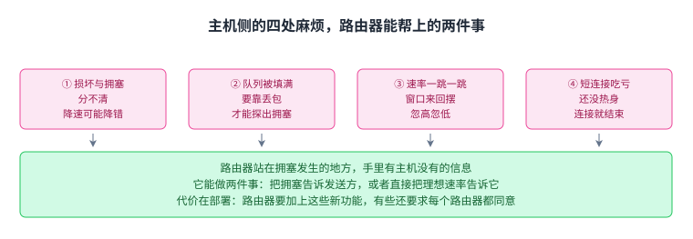

这一节的落点不是「路由器更好」，而是路由器介入换来的东西要用部署难度来付：动的是全网的路由器，不是一台主机。

## 二、公平的第一步：路由器得先看懂分组属于哪条连接

源文开头就把问题摆出来，问的是路由器怎么保证每条连接都拿到自己那一份。

在这以前，路由器做的事很简单。源文说它收下[[term:packet]]，需要就排队，然后按 [[term:first-in-first-out]] 的顺序送出去。它不关心这个分组来自哪条连接。

新模型的第一步是分类。源文说路由器要把分组归到连接上，暂时假定这些连接都是 TCP 连接。这一步意味着路由器得往分组里面看，读出源与目的 [[term:ip-address]] 和端口。

顺带一句对比，这是本页补的。第 13 讲讲线卡要做的四件事时，查表读的是目的地址；而这里要读出源与目的 IP 地址和端口，因为公平是按连接算的，得先分清这个分组是谁发的。

有分类之后，公平才写得下来。源文的形式化做法是给每条连接一个独立的队列。分组到了就放进它对应的队列。之后路由器每次只做一件事：挑一个队列，把队首那个分组送出去。只要挑队列的方式是公平的，公平就被强制在连接之间了。这一套做法就是[[term:fair-queuing]]。

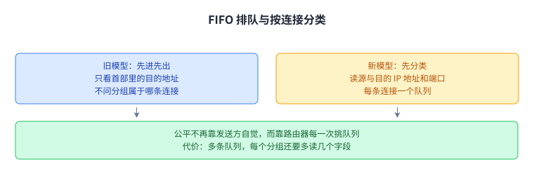

这一节的落点：[[term:fairness]]不靠发送方自觉，而靠路由器的一次挑选；代价是路由器从此要维护多条队列，每个分组还要多读几个字段。

## 三、轮询：一次挑一个队列

如果所有分组一样长，上面那次挑选可以很简单。源文说按[[term:round-robin]]来，从第一个队列拿一个，再从第二个队列拿一个，依次往下。

源文特别提了一句，即使每条连接要的带宽不一样，这个办法也能用。原因是有些连接攒分组的速度比别的慢，轮到它时未必有货。

接着要算账。对不同带宽的连接做轮询，每条连接到底分到多少。源文给的例子是：一秒能送出 10 个分组，而 A、B、C 三条连接分别每秒送来 8 个、6 个和 2 个。

源文的配图画出了这三条连接各自排着的分组：A 排了 8 个，B 排了 6 个，C 排了 2 个，一共 16 个，而这一秒只送得出 10 个。

源文说这件事可以当成一个资源分配问题来解。它的配图给出的结果就是每轮各拿一个名额：A 发出 4 个、B 发出 4 个、C 发出 2 个，加起来正好 10 个。没能发出去的是 A 的 4 个和 B 的 2 个，加起来正好 6 个，也就是 16 减 10。

C 为什么只发出 2 个。因为它这一秒一共只送来 2 个，轮到它时没货可发。

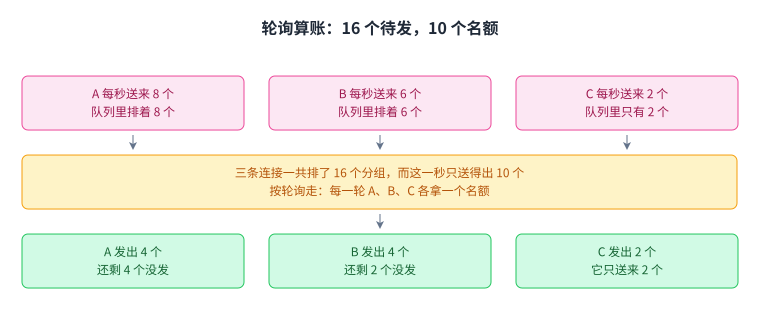

这一节的落点：等长分组下，轮询把这一秒的 10 个名额分成 4、4、2。C 在第二轮之后就取空了，后面两轮的名额由 A 与 B 各拿一个。

## 四、最大最小公平：那个「公平的一份」怎么定

源文把上一节的算术写成了一个定义。它先给例子：链路容量是 10，A 要 8，B 要 6，C 要 2。

推理照源文走一遍。如果按人头平均，每个人拿 3.33。可 C 只开了 2 的口，那就给 C 2，不多给。于是剩下 10 减 2 等于 8 个名额要分给 A 和 B。这 8 个再平均，各拿 4。这个 4 比它们要的都少，但没有别的办法满足它们，于是各给 4。

源文把上面的做法一般化，给它起名叫[[term:max-min-fairness]]。总带宽记作 C，第 i 条连接的需求记作 r_i，分给它的带宽记作 a_i。分法是

a_i = min(f, r_i)

其中 f 是一个对所有连接都相同的值，取那个唯一能让所有 a_i 加起来等于 C 的值。

逐项读这个式子。min 保证没人拿到超过自己要的，求和等于 C 保证带宽不会被剩下。源文对 f 的直觉说法是，它就是「平分给所有人的那一份」，所以对所有连接只有一个值。

拿例子验一遍。f 等于 4 时，min(4, 8) 是 4，min(4, 6) 是 4，min(4, 2) 是 2，三项加起来是 10，正好等于容量。所以这个例子里 f 就是 4。

这里有一处要当场说清。源文接着把式子换了一种读法，原文是：

> "If you requested less than the fair share, you get the fair share (no extra). If you requested more than the fair share, you are capped at the fair share, but nobody else gets more than you."

（如果你要的比公平份额少，你拿到公平份额，不多给；如果你要的比公平份额多，你被压在公平份额上，但也没有别人比你拿得多。）

前半句跟式子对不上。需求 r_i 小于 f 时，a_i 等于 r_i，拿到的是自己要的那个数，比公平份额还少。源文自己也给了反例：紧接着的下一句写 f 是 4，A 和 B 拿到 f，因为它们要得多，而 C 拿到 2，因为它要得少。所以本讲按式子与这个例子来读前半句，写法照录，出入留在溯源里。

还有一处同名要记。源文用大写 C 表示路由器可用的总带宽，可同一个例子里的第三条连接也叫 C。本讲按源文的用法写，读的时候按位置区分：出现在求和右边的 C 是容量，A、B、C 是连接。

源文随后给了这个定义的用处与边界。用处是，如果你没拿到你要的全部，那就没有别人比你拿得多。边界是，它与轮询等价这件事只在等长分组下成立。

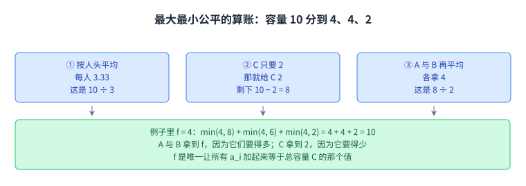

用这个式子把两个分支各读一遍，能看出 min 在做两件事。要得比 f 少的，拿到自己要的量，这是 min 选的左边；要得比 f 多的，被压在 f 上，这是 min 选的右边。

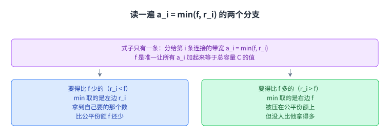

这一节的落点是一个能算的式子：分给每条连接的带宽是 min(f, r_i)，其中 f 由「所有 a_i 加起来等于总容量」这条约束唯一定出来。

## 五、分组不等长：给每个分组算一个截止时间

前面那条「轮询就是最大最小公平」挂在一个前提上，所有分组一样长。源文说现实中分组的长短差得很远，它举的例子是 40 字节与 1500 字节，后者是前者的 37.5 倍。

理想的做法是逐位轮询：轮流从每条连接的队列里送出 1 个比特。源文承认这没法真的做，我们并不按位发送。

可如果把这件事当成纸上的模型，就能给每个分组算出一个时刻，也就是它最后一个比特被送出去的时间。源文把这个时刻叫这个分组的 deadline，中文就是截止时间。

有了截止时间，近似做法就跟着来了：按截止时间的先后把分组送出去，也就是按「它最后一个比特本来应该在什么时候发完」排序。

源文在这一节末尾还给了一条花絮：把公平排队放进模拟器的那篇论文影响极大，其中有两位共同作者是 Scott Shenker（当时是 UC Berkeley 的教师）与 Srinivasan Keshav（当时是 EECS 的博士生）。

最后是一个两条连接的例子，做的是精确的逐位公平排队。源文列了一条碰撞规则：两个分组的截止时间撞在一起时，先发先到的那个。

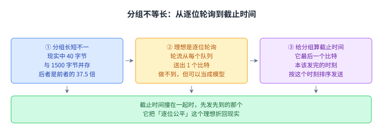

把前一张图里的截止时间当成一把尺子，就能读懂源文那个例子。源图把理想系统与实际系统并排放，理想那一行在每个分组的最后一个比特处加粗，实际那一行按这些加粗点排序发出。

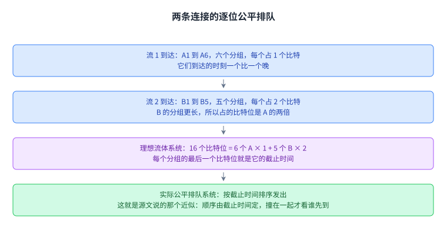

这一节的落点是把公平的单位从「一个分组」换成「一个比特」，截止时间就是把这个理想折回现实的那次换算。

## 六、公平排队好在哪，难在哪

源文把好处与代价分开写。

先看好的一面。它保证连接之间的隔离，作弊的连接拿不到更多带宽。连接也不必去实现 TCP，或者某个 TCP 友好的替代品，它可以挑自己那套算法，哪怕那套算法对别人不友好。

源文说，公平排队最根本的好处是它对外部因素不敏感，作弊与 RTT 参差都影响不了它。无论发生什么，一条链路上每个人拿到的是公平的一份。

但它只解决一半。源文紧接着说，还得靠端主机自己去发现并适应这一份，比如发现自己要多了就慢下来。

代价那一面更长。它比 FIFO 排队复杂得多。算截止时间的过程很绕，源文也承认这里没有给出算法。路由器要维护多条队列，还要对每个分组做额外的解析。

现实里的做法是折中。源文说完美的公平排队没法在路由器里实现，因为跑到高速度太复杂，但近似版本是有的，它举的例子是[[term:deficit-round-robin]]。现代路由器一般实现近似版本，而且队列开得更少。队列少意味着隔离变粗：从每条连接一个队列，退到每个客户一个队列。

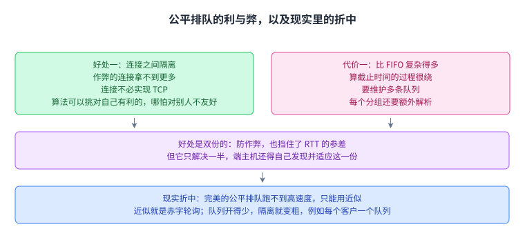

这一节的落点：公平排队买到的隔离是双份的，既防作弊也挡住了 RTT 的差异；付出的代价是路由器要从只看首部变成逐包解析加多队列调度，而现实只能退到近似。

## 七、公平排队管不了下游

源文接下来划了一条边界：公平排队消不掉拥塞，它只是管理拥塞的另一种办法。

它给的例子是一条瓶颈链路。这条链路上做了公平排队，可能给每条连接分 0.5 Gbps，作弊确实被挡住了。可如果上面那条连接真的按 0.5 Gbps 发，那么到了紧接着的下一条链路，会有 0.4 Gbps 被丢掉。更好的分法是上面那条只给 0.1 Gbps，剩下的 0.9 Gbps 全给下面那条。

这几个数自己也能对上一遍。两条连接各分 0.5 Gbps，说明这条瓶颈链路一共有 1.0 Gbps 的容量，而 0.5 减 0.4 等于 0.1，正是上面那条能穿过下一条链路的量；0.1 加 0.9 又正好是 1.0，所以更好的那种分法并没有浪费这条瓶颈链路的容量。

源文把原因说得很清楚：这条瓶颈链路不知道未来的下游链路会发生什么，它只能看见自己这一段。唯一的解法是让发送方的主机自己慢下来，路由器这边的排队帮不上忙。

源文最后留了一个更根本的问题。公平排队给的是按连接公平，可这个模型本身就值得怀疑。多开连接的发送方依然能拿到更多，这一点上一讲也讲过。源文于是把三个问题摆出来：是不是该改成按源与目的对来公平；是不是该干脆按源来公平；是不是该让占用拥塞链路更多的连接付出代价。

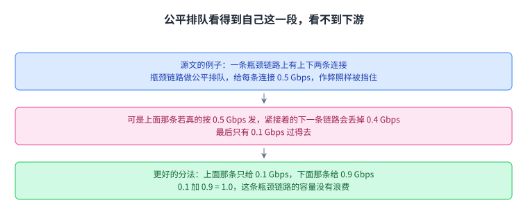

这一节的落点：公平排队是单链路的性质，它管得住这一段的分配，管不住这个分组出了这一段之后会撞上什么。

## 八、把信息带回发送方：直接给速率，或者只报拥塞

源文最后一节换了方向。公平排队管的是某一条链路上的分配，它不向发送方说任何话。源文于是问，路由器能不能把信息带回去，让发送方自己调整速率。

它给的第一条路是路由器直接告诉发送方该用什么速率。做法是在分组里加一个速率字段，路由器用这条连接的公平份额把它填上。源文说发送方读到[[term:header]]里的这个值，就把自己的速率设成路由器说的那个数。这样一来，发送方不必再靠动态调整去探一个好的速率。

这里有一处要当场说清。源文在这条路里写的是这个分组到达发送方时，发送方就能读首部。可被路由器沿路填值的是发送方发出去的数据分组，它顺着正向路径走，到达的是接收方。源文紧接着讲 ECN 的那一段才把回程说清楚：接收方拿到置位的分组，回复的确认也带这个位，发送方才学到拥塞。所以这一段里的「到达发送方」按「发送方通过回程的确认读到」来读，写法照录，出入留在溯源里。

第二条路是只报拥塞，不给具体速率。源文说这条已经在用了，形式是 IP 首部里的一个[[term:explicit-congestion-notification]]位，缩写是 ECN。分组经过拥塞的路由器时，路由器把这个位设成 1。接收方拿到置位的分组后，回的确认上也带这个位，发送方由此知道前面堵了。

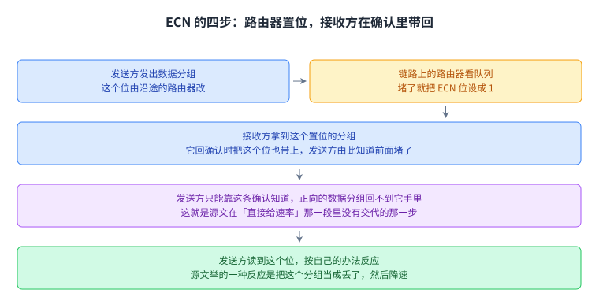

这张图要把一个来回走完，因为信号得绕回发送方。数据分组从发送方出发，路过的拥塞路由器把 ECN 位设成 1；接收方拿到它，回确认时把这个位也带上，发送方才读到。中间那一步不是多余的：正向的数据分组回不到发送方手里。

什么时候置位，源文说有很多选择。路由器可以谨慎些，经常置位，这样时延低，但链路可能被用不满。反过来，路由器也可以放任些，很少置位，这样时延高，但链路利用率高。

主机收到这个位之后怎么反应，同样有很多选择。源文举的例子是，主机可以干脆把这个分组当成丢了，然后按丢包那套规矩来。

ECN 的好处源文列了三条。它把损坏与拥塞区分开了。它让路由器能更早发出警告，比如在队列满之前，于是时延可以降下来。它实现起来很轻。

有一处细节值得顺手记住，这一句是本页补的。这个位在 IPv4 里住在 ToS 字节里，IPv6 里住在流量类别字节的同一位置，定义它的 [[term:rfc]] 是 3168 号。源文把它写成「一个位」，那是简写：按这份规范它实际占两个比特，路由器置起来的是其中表示已经拥塞的那一个，源文说的「设成 1」指的就是它。想自己看一眼的话，Linux 上有一个 `net.ipv4.tcp_ecn` 开关，或者用 Wireshark 抓一段开了 ECN 的连接，都能看到这个位被置起来。

但它的前提很硬。源文说有效的 ECN 要求大多数或者全部路由器都支持这套协议，并在需要时把位打开。在今天的[[term:internet]]里，这个位只在部分路由器上部署。不过在小型网络里它很好用，源文举的例子是数据中心内部那种所有路由器都同意打开它的网络。

这两条路的差别值得摆在一起看。第一条路给的是一个数值，发送方拿到就不用再探了，代价是路由器得知道每条连接的公平份额是多少，还要在分组里留一个字段。第二条路只报「堵了」这一件事，它不说该发多快，代价是发送方还得自己琢磨降多少。

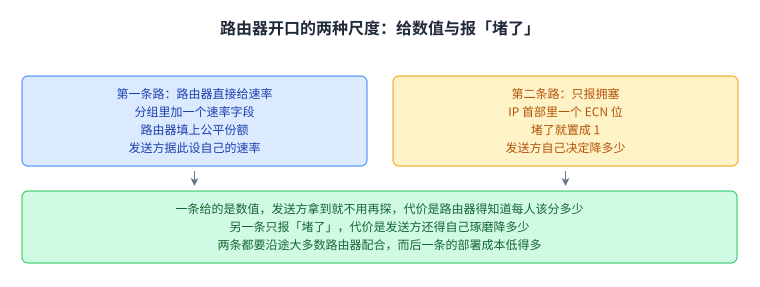

这一节的落点：路由器开口有两种尺度，一种直接给数值，一种只报「堵了」这一件事；两种都要沿途的路由器配合，而后一种的部署成本低得多。

## 读完应该能回答

1. 主机侧拥塞控制有哪四处麻烦，源文为什么认为路由器掌握的信息更多。
2. 新模型要求路由器对每个分组多做哪一步，这一步为什么必须读出源与目的 IP 地址和端口。
3. 容量 10、需求 8/6/2 这个例子里轮询送出多少个，3.33、8、4 这三个数各自怎么来的。
4. 最大最小公平的式子 a_i = min(f, r_i) 里，min 与求和各约束了什么，f 在例子里为什么是 4。
5. 源文那句话的前半句为什么跟式子对不上，本讲按什么读它。
6. 分组不等长时截止时间指的是哪个时刻，按截止时间排序为什么是逐位公平排队的近似。
7. 公平排队的利与弊各是什么，队列开得少意味着什么。
8. 0.5 Gbps 那个例子里 0.4 从哪里来，源文为什么说路由器排队帮不上忙，ECN 与「直接给速率」差在哪。

## 脉络回顾

这一讲落在传输层与网络层的接缝上。第 21 讲到第 25 讲讲的都是发送方这一端的事，这一讲第一次把拥塞控制的一部分决定权挪进网络内部的路由器。源文没有用分层的语言说这件事，这是本页的读法。

通向它的线有三条。最近的一条是上一讲那份问题清单：源文开头点的四处麻烦里，三处就在那份清单上，也就是损坏与拥塞混在一起、队列被填满、短连接。再往前一条是第 22 讲，那一讲把公平画进了效率与公平的二维图，那时公平是两条连接自己加减出来的结果，而这一讲给的是另一种做法，公平由路由器直接强制。还有一条更早的线头在第 17 讲：那一讲讲 IP 首部的 ToS 字节时说这些比特后来被重新定义，用到的协议里有 ECN，还写了「后面会讲」。那一讲说的后面，就是这一讲。第 13 讲也留过一条记录，说教材的「包排队」一节只有一行 TODO；这一讲的源文一开口就把默认队列写成 FIFO，算是把那条空缺用一句话带过。

这一讲解决的是哪一环。主机侧算法有三处修不了的毛病：分不清丢包的原因，必须靠填满队列来探测，而且没有人强制守规矩。路由器介入正好对着这三处，因为它站在拥塞发生的地方，手里有主机没有的信息，还能强制分配。

最要紧的转折在中途。公平排队看上去已经把公平做成了路由器的一个动作，可它只在自己这一段里成立。源文拿 0.5 Gbps 那个例子说明，一条链路算得再公平，也不知道下游会发生什么。方向于是从「路由器替主机做决定」转成「路由器把信息带回主机」，这才有了直接给速率与 ECN 这两条路。

后面哪里用到它。第 27 讲转去应用层的 DNS，主线继续往上走。这一讲留下的东西在整门课里还有回声：一条是「在路由器上做复杂功能」这件事本身要跟线速赛跑，第 13 讲讲线卡的纳秒级压力时已经算过这笔账，它也解释了为什么完美的公平排队只能退到近似；另一条是 ECN 这种由网络层给传输层递一个信号的做法，它属于分层接口上的一个补丁，而补这一针的代价正是本讲最后一段说的，要大多数路由器都同意。

## 溯源

- 对应：UC Berkeley CS168 Computer Networks，教材 Transport 之 Router-Assisted Congestion Control（<https://textbook.cs168.io/transport/router-based-cc.html>）
- 教材：CS 168 Textbook（UC Berkeley CS168 课程教材），原文链接同上
- 授权依据：教材站在站根页声明 CC BY-SA 4.0；本文为本仓库原创中文讲解，按该节顺序重讲，关键句给出英文原文与中译，**未逐句全译**，配图自绘
- 字段核对：本讲清单 `docs/lecture-manifest.md` 第 26 行为 `router-assisted-congestion-control` / `Router-Assisted Congestion Control` / `/transport/router-based-cc.html`；抓取该页时 `<title>` 为 `Router-Assisted Congestion Control | CS 168 Textbook`，H1 为 `Router-Assisted Congestion Control`。三处一致，派单字段与来源一致
- 源文件与范围：抓取的该页 HTML 共 31,340 字节；正文锚点 `#main-content` 内共 **4 个二级小节**，依次为 Congestion Control with Routers / Enforcing Fair Queuing / Fair Queuing in Practice / Router-Assisted Congestion Control。第四个小节的标题与页面 H1 同名，它的锚点 id 是 `router-assisted-congestion-control-1`，这也是源文自身的一处重名
- 源页共 **3 张配图**，本讲逐张抓取核对过：`3-094-fair-queuing-1.png`（三条待发队列：A 排 A1 到 A8 共 8 个，B 排 B1 到 B6 共 6 个，C 排 C1 与 C2 共 2 个）；`3-095-fair-queuing2.png`（轮询结果：发出顺序 A1 B1 C1 A2 B2 C2 A3 B3 A4 B4，图注写「发出 4 个 A、4 个 B、2 个 C」，未发出的画成 A5 到 A8 与 B5、B6）；`3-096-fair-queuing3.png`（四条泳道：流 1 到达 A1 到 A6、流 2 到达 B1 到 B5、流体系统一行用加粗标出每个分组的截止时间、公平排队系统一行按这些加粗点排序发出）。三张图的内容与它们所在小节的文字一致，文件名与内容也对得上，没有出现文件名误导的情况
- 源里 `TODO` 标记实测 **0 处**（全文检索 "TODO"／"FIXME" 无命中；唯一命中 `placeholder` 的是页面顶部的搜索框，不是正文），因此本讲没有任何「待补」项被代补
- 结构说明：本页 8 个正文章节与源文 4 个小节不是一一对应。第一章对应源文 Congestion Control with Routers。第二、三、四、五章把源文 Enforcing Fair Queuing 一节切成了四段，依次是分类与多队列、轮询算账、最大最小公平的定义、分组不等长时的截止时间。第六、七章把源文 Fair Queuing in Practice 一节切成两段，依次是利与弊、管不了下游。第八章对应源文第四节 Router-Assisted Congestion Control。切分只改了分段方式，源文的推进顺序没有改动

## 溯源：照录、存疑与登记

- **照录（源文自身的措辞出入，已在正文就地说明）**：源文第一节写 "it's a natural design choice to have routers participate in congestion routing"，字面是「参与拥塞路由」；按上下文应是 congestion control，因为整段都在讲路由器如何参与拥塞控制，源文的页面标题与第四节的标题也都是 `Router-Assisted Congestion Control`。本页照录原句并在正文就地说明，未静默改字
- **照录（已就地说明，并报给 Lead）**：源文 Enforcing Fair Queuing 一节写 "If you requested less than the fair share, you get the fair share (no extra)." 而同一段给出的式子是 a_i = min(f, r_i)，同一段紧接的例子又写 "In the previous example, f was 4. A and B received f (they wanted more), and C received 2 (it wanted less)"。需求小于 f 时式子给出 a_i = r_i，例子给出 C 拿 2 而不是 f = 4，两处都与「你要得少，就拿到公平份额」这句字面相反。我们照录原句、在正文按式子与例子读它，未静默改写源文
- **照录（已就地说明，并报给 Lead）**：源文第四节写 "We could add a rate field in packets, and have routers fill in that field with the connection's fair share. When the packet arrives at the sender, the sender can read the header and set the rate to what the routers said." 被路由器沿路填值的是正向路径上的数据分组，它到达的是接收方；发送方要读到这个值，只能靠回程的确认把它带回来，而这一点源文是在紧接着的 ECN 一段才写明的（接收方拿到置位的分组，回复的确认也带这个位，发送方才学到拥塞）。我们照录原句、在正文按回程来读它，未静默改写源文
- **存疑（已就地核对，报给 Lead）**：源文第三节写 "For example, consider this bottleneck link:"，而这句话后面**没有任何配图**，源页一共只有三张图，都在前面两节。于是 0.5 Gbps、0.4 Gbps、0.1 Gbps、0.9 Gbps 这组数的前提（瓶颈链路的总容量、下游链路的容量、两条连接各自走哪几条链路）源文都没有给出。本页在正文里把这几个数自己对了一遍，并写明「两条连接各分 0.5 Gbps 说明这条瓶颈链路一共有 1.0 Gbps 的容量」这个读法；这是我们的推算，源文没写
- **存疑（记法，已就地说明）**：源文用大写 C 表示路由器可用的总带宽（"suppose C is the total bandwidth available to the router"），而同一个例子里的第三条连接也叫 C。本页按源文的用法写，并在正文点明按位置区分
- **存疑（措辞）**：源文同一处写 "Each connection \(r_i\) has a bandwidth demand"，把 r_i 说成「每条连接」，而式子里 r_i 是那条连接的需求。本页在正文按「第 i 条连接的需求记作 r_i」写，这是措辞上的顺句，不改式子
- **存疑（源文把位宽写成一位，已就地说明）**：源文写 "an Explicit Congestion Notification (ECN) bit in the IP header" 与 "the router sets that bit to 1"，按一位来说；而 RFC 3168 定义的 ECN 占两个比特，路由器置的是其中表示已经拥塞的那一个。本页在正文按源文的口径写「一个位」，同时就地说明这是简写、规范里是两个比特，未把源文改成两位，也未把源文说成错误的
- **核不到的**：源文那条花絮里的两位作者身份（Scott Shenker 当时是 UC Berkeley 的教师、Srinivasan Keshav 当时是 EECS 的博士生），本页照录源文，没有另外去核；源文也没有给那篇论文的标题或年份。第 13 讲讲过的「教材的 Packet Queuing 一节只有一行 TODO」是那一讲的记录，本页只引用它，没有重新去核教材那一节现在的状态

## 溯源：核过的算术、我们补的、术语取舍

- **我们核过的算术（源文数字均已逐条验算，无冲突）**：源文例子里 8 + 6 + 2 = 16 个待发分组，而容量是每秒 10 个，所以有 16 − 10 = 6 个发不出去，与配图里未发出的 A5 到 A8（4 个）加 B5、B6（2 个）相符；轮询每轮 A、B、C 各一个名额，配图给出的发出顺序正好是 4 个 A、4 个 B、2 个 C，加起来 4 + 4 + 2 = 10 等于容量；源文说「如果按人头平均，每个人拿 3.33」，3.33 是 10 ÷ 3 = 3.3333…；「C 只要 2，于是剩下 8」是 10 − 2 = 8；「A 与 B 各拿 4」是 8 ÷ 2 = 4；最大最小公平的验算 min(4, 8) + min(4, 6) + min(4, 2) = 4 + 4 + 2 = 10 = C，所以这一例的 f 是 4；分组长度那处，1500 ÷ 40 = 37.5 倍；瓶颈链路那处，0.5 × 2 = 1.0 Gbps 是这条链路的总容量，0.5 − 0.4 = 0.1 Gbps，0.1 + 0.9 = 1.0 Gbps
- **我们补的（源文没有写）**：源文这四处麻烦与第 24、25 讲的对位（源文只写 "Previously, we saw some issues with host-based congestion control algorithms"，没有点名是哪几讲）；「第 13 讲查表读的是目的地址，而这里要读出源与目的 IP 地址和端口」这句对比；「顺带一句对比，这是本页补的」之后那一段的全部内容；把源文 Enforcing Fair Queuing 一节拆成四章、把 Fair Queuing in Practice 一节拆成两章的切分说明本身；源文说 "how do we compute the bandwidth allocated to each connection?" 之后只给了资源分配问题的思路与配图，本页把 4、4、2 这组结果的来历（每轮各一个名额）写成了句子；「C 为什么只发出 2 个」那一句问答式的解释；「按人头平均」与「按位置区分大小写 C」这两处读法；瓶颈链路那段「0.5 × 2 = 1.0 Gbps 总容量」的推算（源文没写总容量，见上一条存疑）；「赤字轮询」的中文译名（源文只写 Deficit Round Robin）；ECN 在 IP 首部里的具体位置与规范编号（源文只写 "an Explicit Congestion Notification (ECN) bit in the IP header"，本页在正文里写明 IPv4 的 ToS 字节、IPv6 的流量类别字节与 RFC 3168 号，并写明它实际占两个比特，这几处是我们的补充）；用 Wireshark 抓一次 ECN 置位的建议与 Linux 上 `net.ipv4.tcp_ecn` 这个开关（源文没有点名任何工具或系统）；「这一讲落在传输层与网络层的接缝上」这条分层读法（源文没有用分层的语言说这件事）；「两条路都要沿途大多数路由器配合，而后一条部署成本低得多」这句总结（源文只在第一节泛泛写 "Some protocols might even require every router to agree to add that functionality"，没有把它按两条路分开说）；「正向的数据分组回不到发送方手里」这句解释（源文在「直接给速率」那一段里没有交代这一步，见上一条照录）；配图里对「截止时间」的刻度画法，以及把源文那张四条泳道的图改写成四条横格文字说明（源图的格子是紧挨着的，本仓的配图房规要求方块之间留 25 到 30 像素，所以无法照画格子，改成文字描述）
## 溯源：术语取舍

- `fair queuing` 译作「公平排队」，`max-min fairness` 译作「最大最小公平」，`round-robin` 译作「轮询」，`first-in-first-out` 译作「先进先出」，`explicit congestion notification` 译作「显式拥塞通知」，`deficit round robin` 译作「赤字轮询」。本讲新增术语已登记进 `glossary.toml`（fair-queuing / max-min-fairness / round-robin / first-in-first-out / explicit-congestion-notification / deficit-round-robin，共 6 条）
- 其余术语沿用前几讲，本页用到的有 router-assisted-congestion-control、host-based-congestion-control、congestion-control、router、packet、header、ip-address、link、bandwidth、fairness、internet、corruption
- `显式拥塞通知` 这个译法沿用第 17 讲，那一讲写「ECN（显式拥塞通知，后面会讲）」；本讲就是它说的那个「后面」
- 本讲给 `explicit congestion notification` 的 notes 里特意留了一句「源文写作一个位而规范里是两个比特」，因为这条出入只在正文出现一次，术语表里再钉一遍，读者悬停时也能看到
