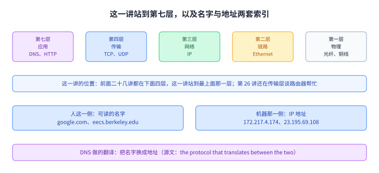
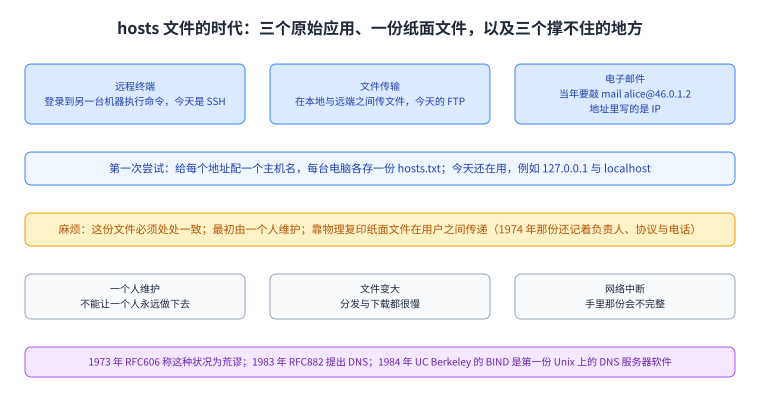
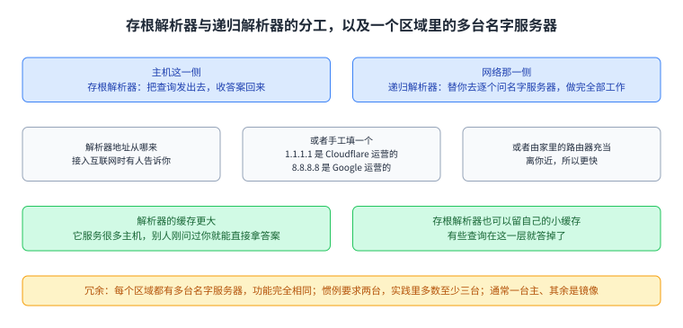
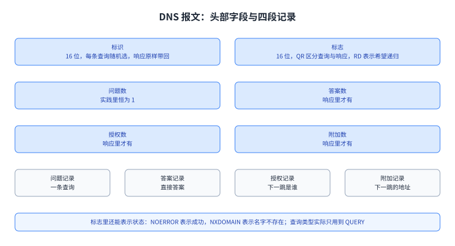
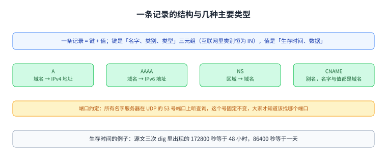
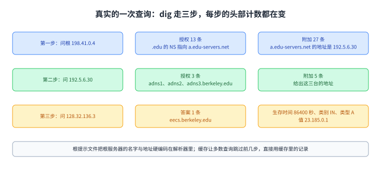
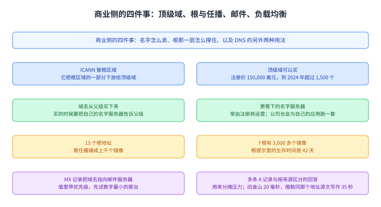

+++
title = "DNS：名字怎么变成地址"
lecture = 27
slug = "dns"
status = "draft"
source_kind = "textbook"
source_url = "https://textbook.cs168.io/applications/dns.html"
source_title = "DNS"
output_mode = "explanation"
+++

> 来源课程：UC Berkeley CS168 Computer Networks（教材 CS 168 Textbook）；
> 对应内容：Applications 之 DNS（<https://textbook.cs168.io/applications/dns.html>）；
> 上游许可：教材站在站根页声明 CC BY-SA 4.0（第二人复核见 `docs/audit/license-cs168-second-review.md`）；
> 本文由 CourseLingo 原创撰写：按该节的推进顺序重新讲解，关键句给出英文原文与中译，不逐句全译，配图全部自绘、不转载原图；
> 本文非官方材料，CourseLingo 与 UC Berkeley 及课程教学团队无隶属关系；如与原文有出入，以原文为准。

## 一、这一讲要解决什么问题

前面二十几讲是从下往上建的：物理层与链路层、网络层、传输层，最后落到 TCP 会跑多快、拥塞怎么处理。这一讲换到最上面那一层。源文开头就说了这件事：

> In this section, we'll be looking at a few common applications (Layer 7) that operate on top of the layers we've built so far. The first application we'll look at is DNS.

中译：本节看几个跑在前面已经建好的那些层之上的常见应用，也就是第七层；第一个要看的是 DNS。第 26 讲还在传输层里讨论路由器怎么帮忙做拥塞控制，这一讲把视角抬到应用层，中间隔着的正是这台机器上那一小段代码。

要解决的问题很具体。源文说：

> The Internet is commonly indexed in two different ways. Humans refer to websites using human-readable names such as google.com and eecs.berkeley.edu, while computers refer to websites using IP addresses such as 172.217.4.174 and 23.195.69.108. DNS, or the Domain Name System, is the protocol that translates between the two.

中译：互联网常用两套索引方式。人用可读的名字，例如 google.com 与 eecs.berkeley.edu；机器用 [[term:ip-address]]，例如 172.217.4.174 与 23.195.69.108。DNS 也就是 [[term:domain-name-system]]，就是在两者之间做翻译的协议。也就是说，这一讲要回答的是[[term:name-resolution]]：一个名字怎么变成地址，以及这件事为什么要分成那么多台机器来做。

图里左边是源文那张分层图（第七层应用、第四层传输、第三层网络、第二层链路、第一层物理），右边是两套索引的换算。这一讲的位置在最上面那一层。

## 二、DNS 之前：一个纸面上的 hosts 文件

源文先回看历史，因为设计是被历史逼出来的。ARPANET 时期有三个主要应用，那时没有网页也没有 [[term:world-wide-web]] 浏览器，多数应用跑在命令行上（源文原话是 before the World Wide Web and web browsers）：远程终端（远程登录到另一台机器执行命令，今天的 SSH 是它的安全版）、文件传输（今天的 FTP 是这一层的协议），以及电子邮件（当年要在终端里敲 `mail alice@46.0.1.2`，地址里写的是收件机器的 [[term:ip-address]]）。

这三件事共同的前提是：你得能指定一台远程主机。而记 IP 地址对人并不友好。第一次尝试是给每个地址配一个主机名，再让每台电脑各存一份 `hosts.txt` 把名字映射到地址。源文说这个做法今天还在：在本机起一个服务，它多半是 127.0.0.1 与 localhost 两个写法，在浏览器里输入哪一个结果都一样。

麻烦在于这份文件必须处处一致。源文写了一件很具体的事：这份主机文件最初由一个人维护，Elizabeth Feinler；它在用户之间靠物理复印纸面文件传递。源文还描述过那份纸面文件的内容：它不但把主机名映射到地址，还记了负责人的全名、他们跑的协议，甚至电话号码。第 4-03 那张配图就是 1974 年的 ARPANET 目录页，表头是 HOSTNAME、HOST ADDR (Dec)、LIAISON、STATUS 四列，行里记着人名与电话分机。

1973 年的 RFC606 把这件事称为荒谬（源文用的词是 absurd）：拿到纸面副本要手工录入，文件靠纸传递，所以手里那份可能是旧的。第一次改进是把它变成机器可读，于是至少能用 FTP 这类协议分发。但这仍然扩展不了：不能让一个人永远维护它；文件变大之后下载很慢；网络中途断掉还会得到一个不完整的文件。

DNS 在 1983 年由 RFC882 提出，用来解决这一串问题；此后有过若干修改，但基本系统沿用至今。源文还给了一条趣闻：在 Unix 上跑 DNS 服务器的第一份软件是 BIND（1984 年，出自 UC Berkeley），今天仍然常见。

图里上面是那三个应用，中间是 hosts.txt 的做法与它的三条毛病，下面是 RFC606 的评价与 DNS 的提出年份。这一节解释的是「为什么不让一台机器存所有名字」。

## 三、设计目标，以及「一台服务器装不下」

历史直接给出了设计目标，源文列了两条。第一条是可扩展（原话：DNS must be scalable）：互联网主机极多，每秒有极大量的查询，主机还在不断增删。第二条是高度可用、轻量而且快（原话：DNS must be highly-available, lightweight, and fast）：几乎每一次互联网连接都以一次 DNS 查询开始，所以它慢一点，所有连接都会跟着慢；而且不能有单点故障，否则它一挂互联网就停了。

那么为什么不放一台中央服务器？源文把话说死：没有一台服务器大到能存下互联网上每一个域名的地址，也没有一台快到能扛住全世界的查询量。DNS 用的是一组[[term:name-server]]，每一台只负责一个[[term:zone]]，这样没有哪一台需要存下所有域名。源文举的例子是：负责 .com 区域的那台只需要回答以 .com 结尾的查询，它不需要存任何与 wikipedia.org 有关的信息；同理，负责 berkeley.edu 的那台不需要存 stanford.edu 的信息。

这里有一个容易混的细节。名字服务器虽然专职回答 DNS 请求，它本身也只是互联网上一台普通主机：有自己的域名，也有自己的地址。源文的例子是 a.edu-servers.net 与 192.5.6.30，并专门提醒不要把域名与区域混为一谈：这台服务器的域名里有 .net，但它回答的是 .edu 区域的查询。

图里上面是源文列的两条设计目标，中间是集中式方案的两个不可能，下面是名字服务器与区域的区分。这一节把「为什么必须分散」讲完。

## 四、树、重定向与一次概念上的查询

把一个区域交给一台机器，问题只解决了一半。源文指出两个遗留问题：.com 比整个互联网小，但让一台服务器存下所有以 .com 结尾的域名仍然不现实；而且名字服务器一多，你的电脑怎么知道该问哪一台。

DNS 的解法是一个新的动作：查询一台名字服务器时，它不一定直接给你地址，也可以**把你转给另一台名字服务器**。源文给的例子是 .edu 那一级：它不必存 eecs.berkeley.edu 与 math.berkeley.edu 的信息，只需要存 berkeley.edu 这台名字服务器的信息，然后把这些查询转过去。要完成这个转交，父级必须给出子级的**区域、可读域名与地址**三样东西，你才能接着去问子级。

这样所有名字服务器就按区域组织成一棵[[term:root-server]]在顶端的树。顶层的根服务器拥有所有域名，它的区域通常写成一个点；越往下，区域越小、越具体。

一次概念上的查询因此总是从根开始。源文给了 eecs.berkeley.edu 的完整对话，这里摘三段：

> Root server to you: I don't know, but I can redirect you to another name server with more information. This name server is responsible for the .edu zone. It has human-readable domain name a.edu-servers.net and IP address 192.5.6.30.

中译：根服务器回答「我不知道，但可以把你转给更有信息的一台：它负责 .edu 区域，域名是 a.edu-servers.net，地址是 192.5.6.30」。接着你问 .edu 那一台，它把你转给 adns1.berkeley.edu（128.32.136.3）；最后 berkeley.edu 那一台给出答案：eecs.berkeley.edu 的地址是 23.185.0.1。拿到答案之后，把它存进[[term:cache]]，以后再要同一条记录就不必重问。

图里按四层画出那棵树，每一层的区域都比上一层小。源文那张配图用的实例是 berkeley.edu 下面分 ischool、math 与 eecs 三支。

图里上面是三轮问答的名字与地址，下面是拿到答案之后的缓存。三样东西（区域、域名、地址）在每一轮转交时都要齐。

## 五、谁替你跑这一趟：存根解析器与递归解析器

源文说，最早做这件事的就是终端主机自己，一台一台去问。今天本机通常把这件事交给[[term:recursive-resolver]]：[[term:stub-resolver]]把查询发出去，让解析器去做全部工作，再从解析器那里收答案。

那解析器的地址从哪来。源文给了三条路：第一次接入互联网时有人告诉你；也可以手工填一个你想用的；以及路由器本身可以充当解析器，物理上离你近的解析器会更快，因为你和它之间的时延更小。源文点名了两个知名解析器：1.1.1.1（Cloudflare 运营）与 8.8.8.8（Google 运营），并解释它们为什么用这种好记的地址：否则你得先为解析器做一次 DNS 查询才知道它的地址，而这些服务器存在的意义正是替你查 DNS。[[term:isp]] 也会把解析器作为所售互联网服务的一部分来运营，否则你付了网费却要在浏览器里输入 IP 地址。

交给解析器还有一个直接好处，就是缓存更大。源文说解析器服务很多终端主机，不只你一台，所以它积累的缓存大得多；如果它刚才已经替别人查过 eecs.berkeley.edu，你这次就能直接拿到答案，不必再联系任何名字服务器。存根解析器那一侧仍然可以留着属于自己的小缓存，有些查询在这一层就答掉了。

冗余这一节讲的是「一台」其实不成立。源文说，每个区域在现实中都有多台名字服务器，同一个区域的这些服务器功能上完全一样，任何一台都能回答区域里的任何查询；这样某一台挂了，其余的还能继续答。按惯例一个区域要求有两台名字服务器，实践中多数区域至少三台。通常其中一台被指定为主服务器，真正管理这个区域，其余的是只会存一份副本并对外服务的镜像。所以在一次查询里，名字服务器可能这样回答：我不知道，但你应该去问 .edu 区域，它有 13 台名字服务器，域名与地址都在这里，然后你自己挑一台接着问。

图里上面是主机侧与解析器之间的两步，中间是解析器替你去问名字服务器的六步，下面是一个区域有多台服务器的约定与主从之分。这一节解释的是「一次查询实际由谁完成」。

## 六、DNS 报文长什么样：UDP、16 位 ID 与资源记录

程序员这一侧其实看不到上面那些复杂度。源文说，查 DNS 有简单、稳定而且各语言相似的 API：标准 C 库里的 `gethostbyname("foo.com")` 只支持 IPv4，现在已经不推荐，但仍然随处可见；更新的 `getaddrinfo("example.com", NULL, NULL, &result)` 支持 IPv4 之外的协议，例如 IPv6。源文强调，作为程序员你只需要调用一个标准库函数，它会去问操作系统里的存根解析器。

那报文是怎么送的呢。源文说 DNS 从根本上是一个客户端-服务器[[term:protocol]]，并且用 UDP 而不是 TCP，理由有三条：不必等三次握手；查询与响应通常塞得进一个 UDP 包，所以不在乎乱序；服务器不必为每条连接保存状态，每个包都可以独立处理，这对收到大量请求的名字服务器尤其重要。包丢了怎么办？源文说用一个简单的重试机制：等一段时间没回应就把查询再发一遍；超时值随操作系统不同，而且可能相当慢。这也是为什么解析器要离你近而且可靠，以及为什么值得准备备用解析器。

有两处例外会走 TCP：主服务器向镜像服务器传输整个区域时响应会很大，源文说这类传输常用 TCP；另外，较新的 DNS 安全特性也可能要求从 UDP 换成 TCP。端口这一侧，按惯例所有名字服务器在 UDP 的 **53** 号端口上听查询，这个端口号是[[term:well-known-port]]，固定不变，大家才知道该找哪个端口。

报文的形状在第 4 张配图里看得很清楚，源文也逐段讲了：开头是两个 16 位字段，先是**标识**，每条查询随机选一个，响应必须原样带回，UDP 无状态，靠它把响应和查询对上；接着是**标志**，其中 QR 位区分这是查询（0）还是响应（1），RD 位表示你希不希望解析器替你递归查询。标志里理论上还能写查询类型，但 IQUERY 已废弃、STATUS 没有真正定义，所以实际上只用到 QUERY；标志里也能表示成功与否，例如 NOERROR 与表示名字不存在的 NXDOMAIN。再往后是问题数（实践里恒为 1），以及三个只出现在响应里的计数字段，分别说明答案、授权与附加三段里有几条记录。

报文的其余部分全是记录，每条都是一个带类型的键值对。源文给了形式定义：记录的键是一个三元组，名字、类别与类型，其中类别在互联网里恒为 IN；记录的值是生存时间与数据，生存时间就是这条记录可以缓存多少秒。主要类型有三种：A 把域名映射到 IPv4 地址；AAAA 把域名映射到 IPv6 地址；NS 把区域映射到域名。源文另外提到你会遇到 CNAME，它用于别名或重定向，名字与值都是域名，表示两个域名指向同一个地址。这一节的收尾几句是源文自己给的要点：每个包有一个 16 位随机标识、一些元数据与一组记录；记录分属问题、答案、授权、附加四类；每条记录都有类型、键与值；记录有 A 与 NS 两种主要类型。

图里上面三行是 16 位宽的头部字段，下面四段是问题、答案、授权与附加四段记录，段数由头部里的计数说明。这张图对应源文第 4 张配图。

图里上面是键与值的形式：键是名字、类别、类型三元组，值是生存时间与数据；下面是 A、AAAA、NS、CNAME 四种类型各自的映射方向，以及 53 号端口这个约定。

## 七、真实世界：dig 走三步

源文接着用 `dig` 把一次真实查询走了一遍，并提醒在家试的时候要加 `+norecurse`，这样递归得你自己一层层解开。每次查询都从[[term:root-server]]开始，根服务器的名字与地址通常以根提示文件的形式硬编码在解析器里。第一台根服务器的域名是 a.root-servers.net，地址是 198.41.0.4。

第一次查询的头部是 `QUERY: 1, ANSWER: 0, AUTHORITY: 13, ADDITIONAL: 27`：问题段 1 条，问的是 eecs.berkeley.edu 的 A 记录；答案段是空的，因为根服务器没有直接答案；授权段 13 条，第一条的键是 .edu、类型 NS、值是 a.edu-servers.net，也就是根服务器告诉我们下一批可以去问谁；附加段 27 条，第一条把 a.edu-servers.net 映射到 192.5.6.30，也就是给出下一跳的地址。源文解释了为什么这些信息要拆在两段里：为了保持报文本身按键值组织。它还补了一句惯例：名字排在最前的那台（这里是 a.edu-servers.net）通常是主服务器，其余是镜像；同一个名字出现多条记录是正常的，那表示有多台服务器都能回答这个区域。

第二次查询问 192.5.6.30，头部变成 `AUTHORITY: 3, ADDITIONAL: 5`，授权段给出 berkeley.edu 的三台名字服务器 adns1、adns2、adns3，附加段给出它们三个的地址。第三次查询问 128.32.136.3，这次的头部是 `ANSWER: 1`，答案段一条：eecs.berkeley.edu 的生存时间是 86400 秒、类别 IN、类型 A、值是 23.185.0.1。源文顺带交代了两个符号：记录里的 172800 是生存时间，等于 48 小时；IN 是互联网类别，基本可以忽略。最后它说，因为解析器尽量缓存，实践里多数查询能跳过前几步，直接用缓存里的记录，这既加快了 DNS，也减轻了最高层名字服务器的负担。

图里三步分别是从根提示文件里的根服务器、到 .edu 的名字服务器、再到 berkeley.edu 的名字服务器，每格标出该步的授权段与附加段条数，最后一步给出答案。这张图对应源文那三段 `dig` 输出。

## 八、三层意义：命名、基础设施与权威

接下来源文把 DNS 的层次拆成三层一起讲。名字是分层的，所以域名是多段用点分开的；基础设施是分层的，名字服务器组织成一棵树，每台只知道树里自己那部分；第三种是权威，它回答「树里这个名字由谁定义」。举例来说，运营 .edu 名字服务器的组织对 .edu 区域里的所有域名负责，它可以把其中一部分下放给下级：.edu 可以说 berkeley.edu 及其子域在我的区域里，我把这部分交给 UC Berkeley，于是产生了一个新区域，此后 berkeley.edu 区域里的更新不需要 .edu 知道。把三层合起来看，树里的每个节点代表一个区域，而区域的定义是「对层次中某一部分负责的行政权威」。

源文接着给了同一个区域的三个视角。从命名看，一个区域含有一条或多条名字与地址的映射，且这些名字是该区域的子域：eecs.berkeley.edu 区域里可以有 eecs.berkeley.edu 或 iris.eecs.berkeley.edu，但不能有 math.berkeley.edu。从基础设施看，这个区域由一台或多台名字服务器支撑。从权威看，这个区域由某个组织控制，而这个组织的权力来自它的父级，例如控制 berkeley.edu 的 UC Berkeley 可以把 eecs.berkeley.edu 下放给 EECS 系。源文第 4-09 那张配图就是把三个区域按这三个视角并排列出来的：berkeley.edu 区域由 UC Berkeley 拥有、名字服务器是 adns1.berkeley.edu、管理 www 与 calcentral 与 systemstatus；ischool.berkeley.edu 区域由信息学院拥有、名字服务器是 is-dns.berkeley.edu、管理 pink 与 blue；eecs.berkeley.edu 区域由 EECS 系拥有、名字服务器是 cs-dns.berkeley.edu、管理 repo 与 rise。

图里上面是三个视角各自回答什么，下面两格是命名视角与权威视角各自的例子。这一节把「一个区域是什么」讲完，源文那张 4-09 配图就是按这三个视角并排画出三个区域的。

## 九、商业侧：顶级域、任播、邮件与负载均衡

真实世界那一侧，源文点了几件事。根区域由 ICANN 控制，它负责把根区域的一部分下放给各个[[term:top-level-domain]]。最早的顶级域按用途分，例如 .com 商业、.gov 政府、.edu 教育、.mil 军事；后来才出现按国家分的，例如 .fr 与 .jp。顶级域过去不多，后来 ICANN 开始以 **150,000 美元**的注册价（外加持续维护费）出售新的顶级域，于是数量爆发：到 2024 年已有超过 **1,500** 个顶级域，其中包括 .google 这样的公司专属顶级域，也包括 .travel 与 .pizza 这种更古怪的。每个顶级域由某个组织运营，它自己决定怎么继续划分，例如 .uk 由 Nominet 管理，他们按用途拆出 .co.uk 与 .ac.uk。再往下的区域按深度称呼，example.com 是二级域，blog.example.com 是三级域；这些区域通常由公司或组织从父级区域买下，买下时你必须把自己在用的名字服务器告诉父级，父级才能把用户转给你。更靠下的名字服务器通常由[[term:registrar]]运营，用户向它付费把服务挂在某个域名下，它会顺手把名字到地址的映射加进自己的名字服务器；除此之外，像 Google 这样的公司也会为自己的应用跑名字服务器（例如 maps.google.com 的记录），Amazon Web Services 有一个叫 Route 53 的名字服务器，用户可以在上面加记录。

图里上面一排是名字的买卖那一侧（ICANN 与顶级域的数量、顶级域的运营与下放），下面一排是根那一层与 DNS 的另外两种用法（13 个根地址与任播镜像、MX 记录与多条 A 记录）。这一节剩下的部分逐条展开这四件事。

根服务器的可用性单独讲了一节。源文说，根服务器不可用会非常糟：缓存为空的人将无法发出任何 DNS 请求，生存时间一到期，所有人的缓存会陆续清空，[[term:internet]]就停了。为此全球有 **13** 台根服务器，它们的地址是公开的。13 这个数字看着很低，所以实际上有远多于 13 台根服务器，只是名单里只有 13 个地址，靠的是[[term:anycast]]：同一台根服务器部署很多镜像，所有镜像用同一个地址。你去联系 k.root-servers.net 或它对应的地址时，可能正在跟其中任何一个镜像说话。13 台里每一台都由一批镜像组成，源文给的例子是 f.root-servers.net 有超过 **3,000** 个实例，这些镜像可以由不同的网络运营者运行。实现方式是每个镜像在路由协议里宣告同一个地址，你会听到很多条通往 k.root-servers.net 的路由，接受哪一条都能到某一个镜像；某个镜像下线了，其它镜像还在宣告，换一条路就恢复了可用性。源文还指出，任播让根的地址很少变动，所以根提示文件里那些记录的生存时间很长，是 **42 天**。公共解析器也能用任播来提高可用性。

最后两节讲 DNS 还能干什么。源文先讲邮件：要给人发信到 evanbot@berkeley.edu，你的电脑仍然要知道把包发到哪里，于是用[[term:mx-record]]把域名映射到邮件服务器，例如把 berkeley.edu 映射到 aspmx.l.google.com；源文说邮件服务器在别的区域是允许的，伯克利的邮件服务器其实由 Google 运营。它还给了一条使用规则：MX 记录的值里带优先级，收到多条时先试优先级最高也就是数字最小的那台。接着讲[[term:load-balancing]]：一次查询可能返回多条 A 记录，把一个域名对应到多个地址，这些记录没有顺序，服务器返回前还可能打乱，客户端通常取第一条，多地址的用途就是分摊压力与冗余；服务器也可以按谁来问、从哪里问返回不同记录，例如把用户送到离他近的服务器，代价是名字服务器要多出一套逻辑，它可能去看递归解析器是谁，也可能借助一个扩展看到客户端地址，还可能去查地址到地理位置的映射，源文点名这类商业数据库里有 MaxMind。源文提醒地理位置的负载均衡并不完美：即便知道双方位置，网络意义上的远近仍然要靠猜，双方之间的可用带宽也不知道。

源文最后给了一个小实验。它在旧金山与俄勒冈各查一次，拿到了两个不同的地址（配图里两条命令分别是 `dig google.com +short`，结果一处是 142.251.46.238、另一处是 74.125.135.113）；再做一次反向查询，把地址对到服务器名，得到的是 PTR 类型记录，也就是把地址映射回名字，旧金山拿到的那个地址对应到 sfo03s25。源文说，假设 sfo 代表旧金山，这个结果相当不错。时延这一栏源文写的是：从旧金山连到发给旧金山的那个地址要 20 毫秒，连到发给俄勒冈的那个地址要 35 秒。后一个单位在源文里就是秒，我们照录不改，但从同一句话的对照关系看，它应当与前面那个 20 毫秒同量纲，这里按毫秒读更合理。

## 读完应该能回答

1. 为什么互联网需要名字与地址两套索引，DNS 在两套索引之间做的翻译具体是什么。
2. hosts.txt 时代的三条毛病分别是什么，1973 年的 RFC606 与 1983 年的 RFC882 各起了什么作用。
3. 一次查询为什么要从根开始，父级转交子级时必须给出哪三样东西。
4. 存根解析器与递归解析器各做什么，DNS 为什么用 UDP 而不用 TCP。

## 脉络回顾

这一讲是这门课的一个转弯。前面二十几讲都在讲数据怎么走：链路层怎么把比特送上一段线，网络层怎么把包从一台主机送到另一台，传输层怎么把不可靠的包拼成可靠的字节流，拥塞控制怎么让所有人共用一条瓶颈。这一讲站在最上面那一层，问的是另一件事：你要访问的那台机器，它的名字怎么变成可以路由的地址。接口就一句话——应用层拿到的还是那套第三层与第四层的能力，只是在使用它们之前，先要有一个把名字换成地址的答案。

DNS 的形状是被历史逼出来的。先是每个地址配一个主机名，再让所有机器共用一份纸面的 hosts 文件；那份文件由一个人维护、靠复印纸传递，1973 年的 RFC606 直接把这种状况称为荒谬。机器可读只是让它能靠 FTP 分发，并没有解决「一个人维护全世界」这件事。1983 年的 RFC882 给出的答案是分散：一组名字服务器，每台只管一个区域，区域按名字组织成一棵树，父级不认识具体的名字，但认识子级的区域、域名与地址，于是查询变成一条从根出发、逐级被转交、最后拿到答案的路径。缓存让这条路径在大多数时候只需要走最后一小段。

把这条路径放到现实中，就要回答三个「谁」：谁替你问（递归解析器，而你机器上那段代码叫存根解析器），谁回答（同一个区域的多台名字服务器，通常一台主、几台镜像），谁定义名字（权威，从根下放到顶级域，再下放到具体组织）。ICANN 管根，顶级域卖给组织与公司（150,000 美元一个注册价，到 2024 年超过 1,500 个），域名从父级买下来时要把自己的名字服务器告诉父级，更靠下的名字服务器常由注册商运营。根那一层用任播把 13 个地址铺成上千个镜像，于是名单很短、可用性很高、地址很少变动（根提示里的生存时间是 42 天）。再往上，DNS 还不只做名字到地址的翻译：MX 记录把邮件指到邮件服务器，多条 A 记录与按来源区分的回答则被用来做负载均衡。

## 溯源

- **字段核对**：`docs/lecture-manifest.md` 第 27 行为 `dns` / `DNS` / `/applications/dns.html`；抓页时 `<title>` 是 `DNS | CS 168 Textbook`，H1 是 `DNS`。两处一致。
- **源文件与范围**：该页 HTML 共 69,774 字节（前三次 `000`、第四次 200，按 `000 ≠ 404` 重试），正文锚点 `#main-content`，实测 17 个二级小节（What is DNS For? / Brief History / Design Goals / Name servers / Hierarchy / Lookup (Conceptual) / Stub and Recursive / Redundancy / APIs / UDP not TCP / Message Format / Lookup (Implementation) / Authority Hierarchy / Zones in Practice / Anycast / Email / Load Balancing），`TODO` 标记 0 处。
- **13 张配图逐张抓下来看过**：`4-01-layer7`（五层堆叠，7 应用含 DNS 与 HTTP）、`4-02-dns-intro`（www.google.com --DNS--> 74.125.25.99）、`4-03-paper-hostsfile`（1974 年 ARPANET 目录页，四列 HOSTNAME／HOST ADDR (Dec)／LIAISON／STATUS）、`4-04-basic-tree`（根到 .edu/.org/.com 与下层若干域名）、`4-05-basic-lookup`（You 与三台服务器之间 6 支箭头）、`4-06-stub-resolver`（存根与递归之间 1/8，解析器与服务器之间 2 到 7）、`4-07-hierarchy1`（名字层次，箭头旁写全名）、`4-08-hierarchy2`（权威下放：UC Berkeley owns… 与 gives the eecs… zone to…）、`4-09-hierarchy3`（三个区域卡片：拥有者、名字服务器、管理哪些名字）、`4-10-zones`（root／TLDs／Second-level／Third-level 四层，含 com、edu、org、uk、fr、jp）、`4-11-anycast`（k 根镜像的世界地图）、`4-12-load-balance`（加州与俄勒冈各一条 dig，142.251.46.238 与 74.125.135.113）、`dns_packet`（头部三行加四段记录）。
- **照录与存疑（源文自身两处不一致，照录并就地说）**：其一，源文写 "…to the IP address served to Oregon takes 35 seconds"，与同句的 20 ms 对照，单位应为毫秒。其二，正文写 "We looked up www.google.com in San Francisco and Oregon"，而配图里的命令是 `dig google.com +short`。该节另有一个以字面形式出现的 `\footnote{...}`，页面未渲染成脚注，其中的自检答案本页写成正文叙述。
- **我们补的（源文没有写）**：把 17 个小节归并成本页九节的结构说明；「第 26 讲还在传输层、这一讲抬到应用层」这句与仓内编号的对应（源文只说 Layer 7）；「35 秒应按毫秒读」这条判断；把 4-09 配图里三个区域卡片的拥有者、名字服务器与被管理的名字写进正文（ischool 这一支只在配图里出现）；以及把 4-11 与 4-12 的内容（镜像分布、两条 dig 的结果）写进正文。
- **术语取舍**：本讲新增 15 条（Domain Name System／name server／name resolution／zone／root server／recursive resolver／stub resolver／resource record／time-to-live／anycast／top-level domain／MX record／registrar／load balancing／cache）。`DNS` 本身没有登记：它的英文原词在更早三页（01、18、26）已出现，一旦登记那三页立刻报漂移；本页把全称登记为 `Domain Name System`（更早各页无此词组）。
