+++
title = "HTTP：请求响应、缓存与 CDN"
lecture = 28
slug = "http"
status = "draft"
source_kind = "textbook"
source_url = "https://textbook.cs168.io/applications/http.html"
source_title = "HTTP"
output_mode = "explanation"
+++

> 来源课程：UC Berkeley CS168 Computer Networks（教材 CS 168 Textbook）；
> 对应内容：Applications 之 HTTP（<https://textbook.cs168.io/applications/http.html>）；
> 上游许可：教材站在站根页声明 CC BY-SA 4.0（第二人复核见 `docs/audit/license-cs168-second-review.md`）；
> 本文由 CourseLingo 原创撰写：按该节的推进顺序重新讲解，关键句给出英文原文与中译，不逐句全译，配图全部自绘、不转载原图；
> 本文非官方材料，CourseLingo 与 UC Berkeley 及课程教学团队无隶属关系；如与原文有出入，以原文为准。

## 一、这一层要解决什么：让页面互相链接

第 27 讲把域名换成了地址。地址换完了，两台机器之间要传的东西还没有格式。这一讲要解决的就是这件事：让客户端与服务器约定一种报文，客户端问、服务器答，问什么答什么都写在明文里。这个协议叫[[term:http]]。

源文的 Brief History of HTTP 一节从 1989 年讲起。Tim Berners-Lee 当时在 CERN 工作，他要让科学家之间交换资料。那时已经有 FTP 这类换文件的协议，可一份文件里常常带着指向别处的链接。他的目标是做一个协议加一种文件格式，让页面之间能互相链接，并且能把这些页面取回来。

版本号从 0.9 开始。源文写，最初的规范编号是 HTTP/0.9，1991 年发布；1.0 在 1996 年标准化；1.1 在 1997 年标准化。除非另有说明，这一节讲的都是 1.1，因为它是当时用得最多的一版。源文还留了一句判断：这套协议的基本做法二十多年没有变过。按它给的年份算，1997 到 2022 是 25 年，这句判断说得偏保守。

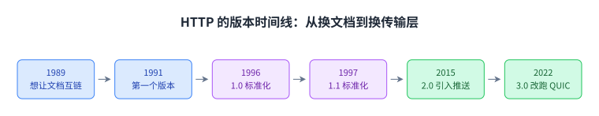

这张图把源文那几句话摆成一条链：起点是「文档之间要能互链」，后面五个点是版本号，最后两个点已经不是加功能，而是换掉了下面那一层。这一节的落点在这里：报文格式二十多年基本没动，动的是它踩在什么上面。

## 二、HTTP 踩在 TCP 上

源文的第一句是 `HTTP runs over TCP.`。两台机器先建一条 TCP 连接，再用它那个字节流抽象可靠地交换任意长度的数据。跑 HTTP 的主机不必操心分组被重排、被丢掉这类事，那些都由下面那一层处理掉了。

这一句值得停一下。第 19 讲把 TCP 的设计讲完，第 20 讲讲实现，字节流与三次握手都在那里。这一讲直接把它当基础设施用，一个字也没有再解释。这是分层最划算的一处：上面一层只说「我要一段连续的字节」，下面一层负责让它真的连续。

HTTP 是客户端-服务器协议。源文给两边分了工：一边是客户端，通常就是浏览器里跑着 HTTP，它举 Firefox 与 Chrome 当例子；另一边是服务器，比如 Google 或者一家银行。它也留了余地：HTTP 不一定跑在浏览器里，终端里直接跑也算。

端口是定死的。源文写，服务器必须在[[term:well-known-port]] 80 上听连接请求，[[term:https]] 用 443。客户端可以随便挑一个临时端口发起连接，服务器的回复就送到那个端口上。

最后一条规则最简单：HTTP 是请求-响应协议，客户端每发一个请求，服务器就回恰好一个响应。这一条在第七节会被流水线拿来做文章，规则本身没有例外。

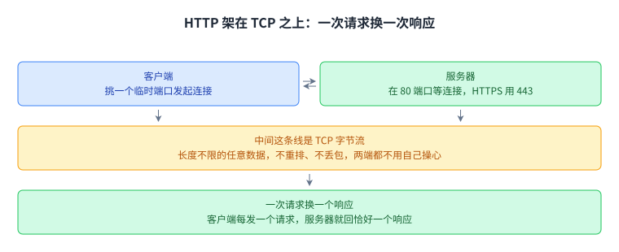

这张图的中间那条线是双向的，请求与响应都走它；而一问一答的计数是不对称的，一个请求对一个响应。这一节的落点：HTTP 省下的所有事，其实都是 TCP 替它做的。

## 三、请求报文里的四段

源文写，请求报文是人能读的纯文本，所以你可以直接在终端里敲一个 HTTP 请求进去。它给的骨架是方法、URL 与版本，后面还跟着可选的内容。报文以换行结束，源文打了个比方：就像在终端里敲完一行之后按回车。

这里有一处要当场说清。源文那一句写的是 "The request contains three parts: method, URL, version, and optional content."，前半句说三部分，后面列了四项，可选内容也在其中。按它自己的句法，前三项才是那三部分，内容另算；可源文数响应的时候把内容算作四部分之一。本讲按四项读它，出入留在溯源里。

[[term:url]] 在源文里的直觉是远端服务器上的文件路径。它举的例子是 `http://cs168.io/assets/lectures/lecture1.pdf`：要取的是 cs168.io 上 assets/lectures 目录里那个叫 lecture1.pdf 的文件。源文自己加了一句提醒：服务器不必真的这样组织，这只是个好用的直觉。

然后是[[term:http-method]]。最早只有一个 GET，用途就是把 URL 指的那份资料取回来。后来加了 POST，客户端也可以把信息送上去，填完表点提交就是一个 POST。再往后还有 PUT、CONNECT、DELETE、OPTIONS、PATCH、TRACE 这些，HEAD 只取响应的首部而不取内容，其余几个让 HTTP 从「只能取」变成「能改」。

方法换了，URL 还得给。源文那个例子说得很清楚：在银行网站上，把同一个名字发到 /send-money 与发到 /request-money，服务器要做的事多半不一样。

内容这一段是可选的。GET 请求的内容通常是空的，因为我们只是在要一份东西；POST 请求的内容就是我们要送上去的那份数据。

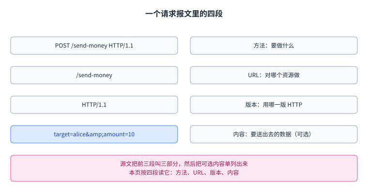

这张图的左列是终端里那几行原文，右列是每一段管什么。这一节的落点：请求的骨架是固定的四段，可变的是方法与内容，这也解释了为什么后来加方法就能扩出一批新用法。

## 四、响应：四段与五个类别

源文说，每个请求对应一个响应，响应同样是纯文本，也同样是四段：版本、状态码、可选的消息、内容。这里它数得很齐，四项对四段，与第三节那句对不上。

[[term:status-code]] 是一个数字，让服务器告诉客户端这次请求是什么结果，每个数字都配一句人能读的说明。源文把它们按数值分成了几类，各举了例子：100 开头是信息，200 开头是成功，其中 200 OK 最常见，201 Created 说明请求成功并且新建了一份资源，通常出现在 POST 或 PUT 的响应里；300 开头是重定向，告诉客户端要去别处找；400 开头是客户端这一侧的错；500 开头是服务器这一侧的错。

这一节最实用的判断是：分类比分号更重要。源文的说法是，目标是给出一个类别正确的错误，好让客户端做出正确的下一步。301 是永久搬走，客户端就不必再去原处找；302 的名字有点怪，它其实表示临时搬家，客户端可以过一会儿再回来试。

401 与 403 的分别值得记一下。源文说，401 Unauthorized 表示客户端还没有被允许访问，如果它证明身份，比如登录一下，也许就能访问；403 Forbidden 表示客户端已经通过验证、服务器也认得它是谁，但它仍然不许看。所以浏览器遇到 401 会弹登录框，遇到 403 只会报错，因为用户已经登录过了。

这一条分界可以直接画成两张牌。

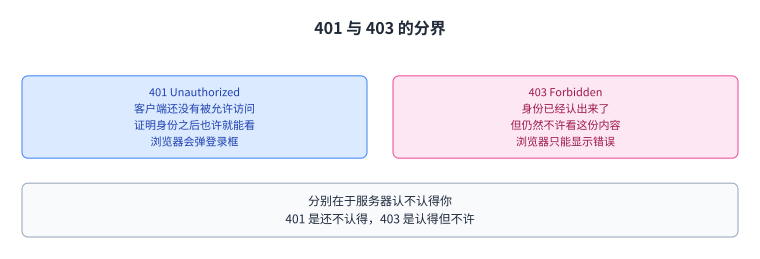

这张图左边是还不认得的那个，右边是认得了但不许的那个，浏览器对它们的反应也因此不同。

源文在结尾留了一个含糊的例子。如果用 0.9 版去请求 Google，合适的应答也许是 505（HTTP Version Not Supported），而 Google 回的是 400（Bad Request）。它的结论是不必纠结分号准不准，挑一个能从客户端那里引出正确行为的类别就够了。还有一处细节源文顺手写了：这些数字本身常常不够用，所以响应里还会带上资源搬去了哪里的信息。

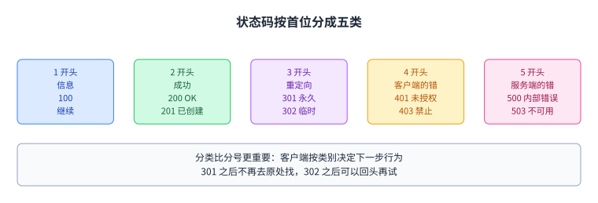

这张图把五类排成一行，每一类只留最常用的号。这一节的落点：状态码的分类不是为了归档，而是为了决定客户端下一步做什么。

## 五、首部：内容之外的那些信息

如果客户端还有别的话要说，就把它们放在[[term:header]]里。源文的第一句判断是：在 HTTP/1.1 里，没有哪个首部是必须带上的，一个都不写也算合法，虽然服务器或客户端可能因为等某个首部而报错。

首部按出现的场合分三个方向。请求首部跟着请求走：Accept 说客户端想要什么类型的内容，User-Agent 说客户端是什么程序或者浏览器，Host 说这次要访问哪个站点，一台服务器上放着多个网站时就要靠它，Referer 说这次请求是从哪里来的，比如是从某个链接点过来的。

响应首部跟着响应走：Content-Encoding 说这些比特该怎么解释，是给人读的文本还是压缩过的文件；Date 说服务器是什么时候生成这个响应的；Location 在 300 类响应里指出资源搬去了哪里。

还有一类两边都用，源文叫表示首部。[[term:content-type]] 是其中的代表，它说这份内容是什么类型，可以是 POST 请求里的，也可以是 GET 响应里的。源文对这一类给了评价：正因为首部能描述各种内容，HTTP 才能被推广到各种应用上去。

这里有一处是本页补的。源文写「没有哪个首部是必须的」，而在 HTTP/1.1 的请求里 Host 是必带的，这一条写在 `RFC 7230` 的第 5.4 节。源文自己给的例子也没有写 Host，与前面那句自洽，只是照那样敲，今天的服务器多半会回 400。本页照录源文的说法，同时把这条记在这里。

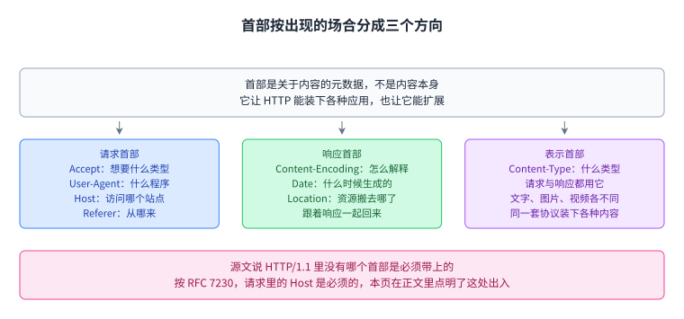

这张图的底部就是上面那处出入：源文说没有必带的首部，规范要求请求带 Host。这一节的落点：首部是这套协议留下的一扇扩展窗，最早的设计里既没有缓存也没有压缩，后来都从这扇窗里加了进来。

## 六、在终端里读一次报文

源文给了一个可以在终端里重做的实验：敲 `telnet google.com 80` 连上 Google 服务器的 80 端口，然后手敲一个 HTTP 请求。

它给的请求只有两行：

```
GET / HTTP/1.1
User-Agent: robjs
```

第一行是要这个服务器的根页面，用 1.1 版；第二行说明我们是谁。两行都是纯文本，在终端里敲进去就是原样发出去。

回来的响应也是纯文本。源文列出的响应长这样：

```
HTTP/1.1 200 OK
Date: Sat, 16 Mar 2024 18:33:08 GMT
Content-Type: text/html; charset=ISO-8859-1
<!doctype html><html lang="en">...
```

第一行交代版本与状态码，接着两行是首部，最后一段是内容，也就是这个页面的原始 HTML。源文的落点是把这段 HTML 丢进浏览器，它就是一个真的网页。这句话是这一节的意义所在：报文格式是透明的，人可以直接看、直接改。

源文还配了两张图，讲的是同一件事的两面：GET 请求的内容段是空的，而 POST 与 PUT 请求的内容段里有数据；反过来，POST 与 PUT 的响应没有内容，而 GET 的响应有。配图里那两个报文用的是 `POST /send-money HTTP/1.1` 与 `PUT /newfile.html HTTP/1.1`，两个响应都是 201 Created，一个带了 `Location: success.html`，另一个带了 `Content-Location: newfile.html`。

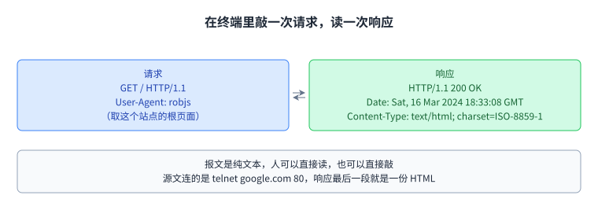

这张图把请求与响应并排摆开，中间的箭头是一问一答。

源文那两张配图讲的是内容段的对称，这一组对称值得单独画一张。

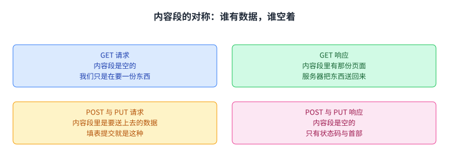

这张图四格看下来，规律是请求与响应各自让出一半：GET 把内容段让给响应，POST 与 PUT 把内容段留给请求。

这一节的落点：报文可读不是巧合，它让这套协议在调试时有一个可以直接看的中间层。

## 七、流水线：一条连接上排多个请求

打开一个网页要发好几个请求。源文的例子是 YouTube：视频本身一个请求，页面上的文字一个请求，相关视频的缩略图又是别的请求，而这些请求很可能都发到同一台服务器上。

提醒一下，HTTP 跑在 TCP 上。源文把最笨的做法写了出来：每个请求都新建一条 TCP 连接，先做三次握手，请求发完关掉连接，下一个请求再握一次手。第 20 讲讲三次握手时算过这条连接建立的开销，这里正好是它的账。

HTTP/1.1 的改法是允许把多个请求与响应排在同一条连接上，这就是[[term:pipelining]]。源文说这样一来，就不必为每个请求单独建连接、单独握手了。

这里有一处要当场说清。源文把「不必为每个请求新建连接」与流水线说成一件事，而这两件事在规范里是不同的：HTTP/1.1 默认就让连接保持复用，流水线是在这条连接上一次发出多个请求，不必等前一个的响应。本页照录源文的说法，并把它按连接复用来读，出入留在溯源里。

代价写在后面。服务器现在要维持更多同时打开的连接，还得有办法让这些连接超时。如果连接多到服务器撑不住，客户端会拿到 503 Service Unavailable，而攻击者可以利用这一点做拒绝服务。

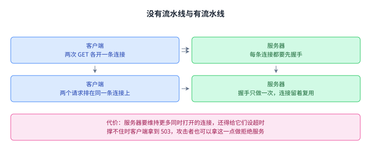

这张图用箭头的条数表示连接的条数：上排两条，下排一条。这一节的落点：省掉的握手时间是从服务器那边借来的，它换成了更多的并发连接与超时管理。

## 八、缓存：三类归属

加速的第二条路是[[term:cache]]：把响应留下来，同一个东西第二次要的时候就不必再问一遍。源文说得很直白：如果不缓存，每个请求都得走到服务器。

它把 HTTP 的缓存分成三类，区分的依据是「谁控制它」与「谁能共用」。[[term:private-cache]] 跟着某一个客户端，典型位置就是你自己浏览器里那一块。同一个人第二次要同一份资料，就可以从本地缓存里拿。代价是它不共享，别人的缓存帮不上你。

[[term:proxy-cache]] 在网络里，不在[[term:end-host]]上，由网络运营者控制，而不是应用的提供方。它可以被很多人共用，所以一个人第一次要某份资料，也可能直接从代理缓存里拿到，不必去[[term:origin-server]]。

代理缓存有两个麻烦。第一个是它得让客户端知道自己的存在：应用没在跑这个缓存，源服务器也不一定知道它，所以得由网络运营者想办法。源文给的常见做法是在 DNS 应答里说谎，前提是网络运营者同时管着代理缓存与递归解析器。客户端要查源服务器的地址，解析器就把代理缓存的地址当成答案给它，例如 `1.2.3.4`。第二个麻烦是源服务器只能信任它：代理缓存守不守规矩、有没有尊重过期时间，应用管不着。

第三类是[[term:managed-cache]]。它也在网络里，但由应用提供方控制，而且部署位置与生成内容的那台服务器是分开的。源文说，正因为应用同时控制源服务器与这些缓存，它就能把用户直接指到缓存上去。

这里有一处要当场说清。源文在受管缓存那一段举 YouTube 的例子，写的是请求视频与图片时去 `static.youtube.com` 而不是 `www.youtube.com`，可它把这个缓存写成了 "the proxy caches"。按它自己前面给的定义，代理缓存由网络运营者控制，应用指挥不了；能由应用指挥的是受管缓存。本页照录原句、按受管缓存来读，出入留在溯源里。

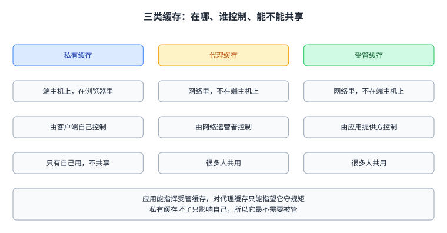

这张表里有两行是关键：控制权归谁，以及能不能共用。这一节的落点：三类缓存的差别不在技术，而在归属，归属决定了应用能对它下多硬的命令。

## 九、缓存对三方的账，以及它的边界

源文说缓存对每个人都有好处，然后分了三方。客户端更快，因为它少发了一部分重复请求，还能用近处的代理；运营网络的[[term:isp]]少建带宽，因为网上跑的请求与响应少了；服务器少处理一批请求，压力小一截。

它把这三方为什么要做这件事也说了一遍：客户端想看高画质的视频，ISP 与应用想靠好性能留住用户。缓存让请求由更近的一方应答，时延更低。源文在这里用了一条前面算过的结论：TCP 的吞吐量与往返时延成反比。第 24 讲算过这条式子，这一讲把它拿来当缓存的动机，因为搬到近处就等于把分母压小。

边界在内容会不会变。源文把资源分成静态与动态两类：Google 的图标是静态的，多次请求都一样；Google 的搜索结果是动态的，谁在什么时候问，答案就可能不一样，服务器必须为每个请求现算一份。

源文由此给出一条分法。静态的图片与视频个头大、可以放心缓存，所以放进代理缓存或者受管缓存；动态生成的那份 HTML 个头小，回到远方的源服务器去拿；而这份 HTML 里可以再带上链接，把图标这种静态资源指到近处的缓存上去。

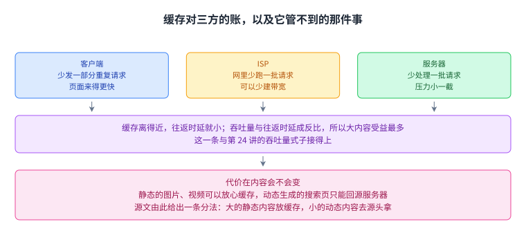

这张图把三方各占一格，底下那格是代价。这一节的落点：缓存不是无条件地好，它要求内容在一段时间里是同一个东西，判断不了这一点就只能回源服务器。

## 十、用首部来管缓存

要让缓存能用，就得有首部携带「这条数据能存多久」这类信息。源文把它当成又一次扩展：最早的协议不支持缓存，缓存是靠首部加进来的。

源文讲了两代写法。1.0 留下的那个叫 `Expires`，它给的是这份数据能缓存到什么时候。1.1 引入了[[term:cache-control]]，说法更细。为了兼容，有些服务器会两个都返回：1.0 的客户端读不懂新的那个就忽略它，1.1 的客户端会优先信新的那个。

两代并存的时候谁说了算，源文写得很清楚：老的读不懂就忽略，新的优先信新的那个。

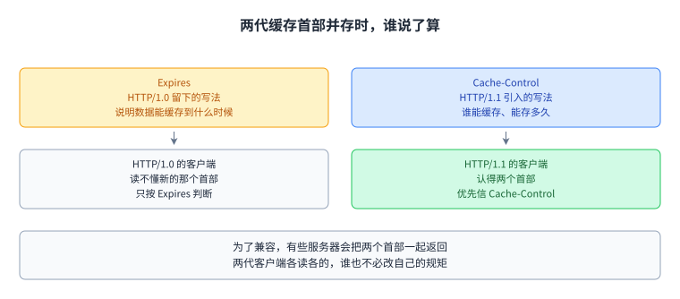

这张图上面一行是两个首部，下面一行是两种客户端，两代各读各的，谁也不必改自己的规矩。

`Cache-Control` 同时管两件事：哪些缓存可以存它，以及能存多久。源文给的例子是一份「每个人都不一样、但对同一个人在一段时间里不变」的内容，服务器可以回：

```
Cache-Control: private, max-age:86400
```

它的意思是这份内容只能存在用户本地那块缓存里，不能进共享的代理缓存或者受管缓存，存放时间是一天，也就是 86400 秒。

不允许缓存的时候，服务器写 `Cache-Control: no-store`。源文说这一项是可选首部，所以没有保证说客户端一定会读它、会尊重它。它把这件事按三类的归属又过了一遍：代理缓存不归应用管，源服务器只能指望它守规矩；私有缓存就跑在客户端自己那儿，破坏规矩只影响它自己；受管缓存与源服务器同属一个应用提供方，所以规则可以由应用强制执行。

首部还能表达更复杂的策略。源文举的例子是：可以缓存，但用之前请先发一个 HEAD 请求回头核对一遍首部，如果首部说数据变了，就把这条缓存作废。

这里有两处要当场说清。第一处，源文写的是 `max-age:86400`，用的是冒号，而这一项在规范里的写法是 `max-age=86400`，用一个等号。本页在正文与配图里都照录源文的写法，并把这一处记在这里。第二处是本页补的：源文说 `Expires` 指定的是「数据能缓存多久」，而它给的是一个绝对时刻，过了那一刻这条响应就过期。按「存到什么时候」读它更贴规范，本页这样读，源文的写法照录。

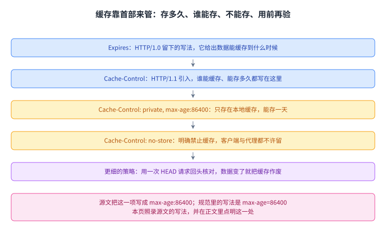

这张图把五件事排成一条线：能存到什么时候、控制权怎么写、一条完整的例子、不能存、以及用之前再核对。这一节的落点：缓存能不能起作用，取决于源服务器愿不愿意在响应里把规矩说清楚，而这条规矩从来不是强制的。

## 十一、把受管缓存铺成网：CDN

源文先回收了上一节的结论：受管缓存是个好办法，它像代理缓存一样能被很多人共用，又归应用指挥，所以应用能保证它守规矩，也能决定把用户指到哪一台去。

把这套东西铺到全网，就是[[term:content-delivery-network]]。源文的定义很短：一组放在网络里、替别人提供内容比如 HTTP 资源的服务器。它给「近」下了两个意思：地理上近，以及从网络的角度近，也就是跳数少。

CDN 换来的好处与缓存一样，只是规模更大。用户拿到的内容由更近的服务器送出，性能更好；网络里跑的带宽与要建的设施更少，因为大部分请求都落到近处的服务器上，而不是一台可能很远的源服务器上。源文在这里还给了一个数：全网流量里 Netflix 占 15%，这个是第十二节那组数字里最大的一块。

还有两条与规模有关。源文说，只有一台源服务器时，要扩容就得把它做得极强、给它极高的带宽；有 CDN 之后，扩容只要在互联网上多放几台小服务器。可靠性也更好：一台源服务器倒了，服务可能就没了；CDN 里倒了一台，用户还能被指到别的服务器上。

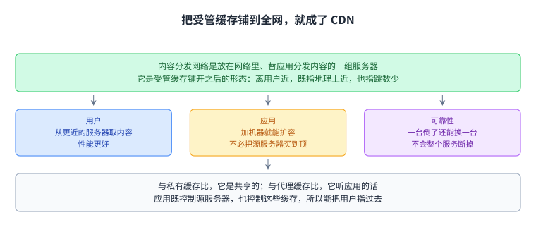

这张图上面一格是定义，下面三格是它换来的三件事。这一节的落点：CDN 不是新机制，它是受管缓存加上部署位置之后的样子，所以它继承了受管缓存那个「应用说了算」的性质。

## 十二、CDN 铺到哪一层

源文先回顾了一遍互联网的模型：客户端的请求先穿过 ISP 拥有的 WAN 路由器，到一个对等点，再进入应用提供方的网络，穿过它的 WAN，最后到达数据中心里的源服务器。

不铺 CDN 的话，每个请求都要走完这条路。源文说这条路的时延最高、性能最差，要穿过的带宽也最多，也就意味着要建更多带宽，而且源服务器得自己扛下所有请求。

好一点的做法是把缓存放在应用网络边缘的对等点上。源文举的例子是：如果 Google 的网络在纽约与 ISP 的网络对等，就把缓存放在那儿。这样一来，应用网络里跑的带宽少了很多，源服务器把视频送一次给缓存，缓存再送给很多用户，扩容也只要加缓存。

再往前一步是把缓存放进 ISP 的网络里。源文问了一句为什么 ISP 会同意让应用进来，答案是这对双方都有利：ISP 的用户性能更好，用户与缓存之间的那部分流量留在了 ISP 内部，所以 ISP 在对等连接上需要的带宽更少，因为内容只需要跨过那条连接一次。源文还写了现实里的合作方式：应用免费提供服务器，ISP 免费把服务器接上网，有时双方还要谈一笔费用，看服务器放在网络的哪个位置，以及服务器与连接的成本。

再往前就要算账了。源文举了最极端的例子：把 CDN 放进每个人家里，成本大概超过收益。它给的道理是，缓存要有很多人共用才划算，共用的人越多，这一份缓存就越值，一次部署能覆盖的人也就越多。

源文给了一组数字。2023 年 Sandvine 那份报告说，全网流量里 Netflix 占 15%，YouTube 占 11.4%，Disney+ 占 4.5%。它接着说，如果一个 ISP 只给这三家在自己的网里装上服务器，就能少建 25% 的网络容量。

这里有一处数字对不上。上面三个份额相加是 15 加 11.4 加 4.5，等于 30.9%，而源文给的容量削减是 25%，两者差 5.9 个百分点。源文说的是「可能少建」，也没有解释这个差从哪里来。本页照录这两个数，不替它补一个解释。

源文还点了名字。Google、Netflix、Amazon、Facebook 这些大应用提供方自己铺 CDN，既在自己的网里铺，也在 ISP 的网里铺。小应用铺不起，但可以付钱给 Cloudflare、Akamai、Edgio 这类公司，让自己的内容进它们已经铺好的 CDN。ISP 自己也会用 CDN，因为它可能同时提供电视服务。源文最后加了一句：CDN 里的服务器与互联网上别的服务器没有本质区别，只是往往为了存放与分发大量内容做过优化。

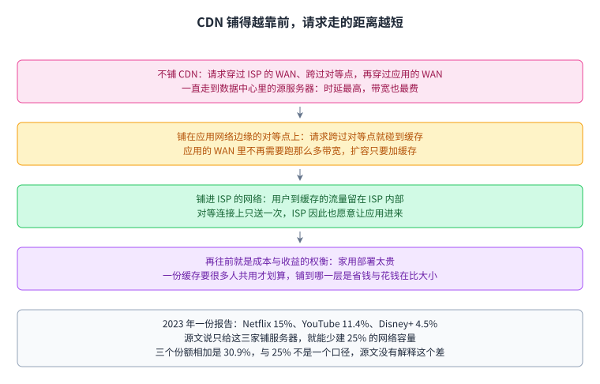

这张图从上到下是四种铺法，最后一格是那组数字与它的对不上。这一节的落点：铺到哪一层不是技术问题，是省下的带宽与新增的成本在比大小。

## 十三、怎么把客户端指到最近的缓存

同一个东西在很多台服务器上都有，客户端怎么知道该找哪一台。源文给了三条路。

第一条是[[term:anycast]]：多台服务器对外宣告同一个地址前缀，路由算法自然会把它送到最近的那一台上。麻烦出在长连接上。假设客户端与其中一台服务器已经有一条 TCP 连接，中途某条链路断了，中间的路由器看到的是一堆同地址的服务器，往上转给任何一台都算对，于是它可能开始把后续分组发给另一台。可那条 TCP 连接是跟原来那台建的，新的那台接不上。

源文顺手对比了一句它在前面的 DNS 那一节里写过的事：DNS 用任播没有这个问题，因为 DNS 的连接很短，通常只有一个 UDP 分组。第 27 讲把名字换成地址，任播是那里的做法之一，这一讲把它用到内容分发上，长连接就把这个毛病暴露出来了。

第二条是用 DNS 做[[term:load-balancing]]。这一次各台服务器的[[term:ip-address]]不同，只是共用一个域名。客户端问域名到地址的映射时，名字服务器可以按客户端的位置给不同的地址。它没有任播那个问题，因为地址确实不同，路由器不会突然改主意。

它的毛病是粒度粗。源文举了一个极端的例子：假设 Comcast 那个 ISP 里所有人都用同一台递归解析器，那么所有人的查询都由这一台转发；应用的名字服务器只看得见查询来自 Comcast，只能给回一个地址，于是全世界的用户都落到同一台服务器上。

第三条是应用层映射，源文说它比前两条都结实。源服务器收到请求时，回复里的链接可以指到不同的服务器上，比如 `static1.google.com` 与 `static2.google.com` 是两台放在不同地方的机器；它也可以用 300 级别的状态码把客户端跳转过去。这条路没有 DNS 的粒度问题，因为应用能在 HTTP 请求里看到客户端的地址；也没有任播的问题，因为各台的地址本来就不同。

它剩下的问题与前两条一样：应用仍然得想办法猜哪台离客户端最近，而「近」既可能是地理上的，也可能是网络拓扑上的。源文还补了一条好处：这一条可以按内容再细分，热门的视频多铺几台，冷门的视频少铺几台，省下来的部署成本就从这里来。


这张图把三条路与它们的毛病并排摆开。

源文对任播那条路的毛病交代得最细，因为它只在长连接上出现。


这张图左右两格是同一条链路的两种状态：左边连接稳稳停在最近那一台上，右边链路一断，路由器就换了目标，而 TCP 连接认的是原来那一台。

DNS 那条路的毛病是另一个方向：它看不见人。

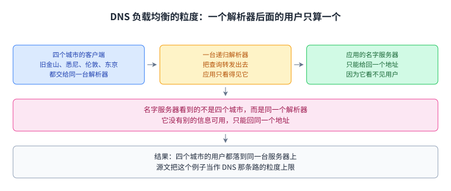

这张图上面三格是一条链，中间与底部两行说的是同一件事的两面：名字服务器能用的信息只有解析器的地址，所以它给不出更细的位置。

这一节的落点：粒度越细的路径越需要应用自己参与，而位置这件事从头到尾都只能猜。

## 十四、HTTP/2 与 HTTP/3：往上加功能，也往下换掉一层

源文最后一节讲的是这套协议后面怎么长。它先给了理由：互联网长大了，用得越来越多，因为 HTTP 是个很能推广的协议。

安全成了问题。源文说，一家跑 HTTP 的银行服务器不想让信息以人类可读的明文在网上走，中间的路由器或者攻击者都能读。[[term:https]] 是 HTTP 上加了安全的那一版：[[term:tls]] 建在 TCP 之上，双方交换密钥、把消息加密之后再送进字节流。所以 HTTPS 的底层还是那一套，只是不再直接踩在不安全的 TCP 上，而是踩在 TLS 上。源文给了一个数：到 2024 年，超过 85% 的网站默认用 HTTPS。

HTTP/2 是 2015 年引入的，源文说它是 1997 年以来第一次大改，目标就是减少时延、加快页面加载。它加了[[term:server-side-push]]：服务器可以在客户端没要的情况下先送一份东西过去。源文的例子是搜索：1.1 时代，服务器先回搜索结果那份 HTML，浏览器解析完才发现还需要那个图标，于是再发一个请求；2.0 的服务器可以先把图标推过去，不等这个请求。

2.0 还改了几处。首部可以压缩，省下空间；请求与响应可以设优先级，让搜索结果的文字先于图标送到；多个同时的请求可以更高效地复用同一条连接。源文给了一个能说明问题的例子：第一个请求的响应有 4 GB，第二个只有 1 KB，笨的做法会让第二个干等第一个传完。按这两个数算，前者是后者的四百多万倍，等下去确实很难受。源文说 2.0 在客户端与服务器两边都用开了。

3.0 是 2022 年引入的，与 2.0 隔了 7 年，而 1.1 到 2.0 隔了 18 年。它的语义与 2.0 一样，换掉的是下面的传输层：不再跑在 TCP 的字节流上，而是跑在一个新协议 QUIC 上，这个协议是专门为 3.0 配的。源文把 QUIC 展开成 Quick UDP Connections，说它是在 Google 设计的，在[[term:ietf]]标准化。通行的展开是 `Quick UDP Internet Connections`，中间多一个词，本页照录源文的写法并把它记在溯源里。

最后一句话是这一讲回头看整门课的地方。源文写，3.0 是一个**主动放弃分层**这一核心做法的例子，换的是效率：把传输层 QUIC 与应用层 HTTP/3 一起交给设计者，两层就可以互相迁就着设计。前面二十几讲讲的大多是分层的价值，这里出现了一次反例，理由很具体：一层各管一段的时候，谁也不知道对方要什么，而这两层的目标太一致了。

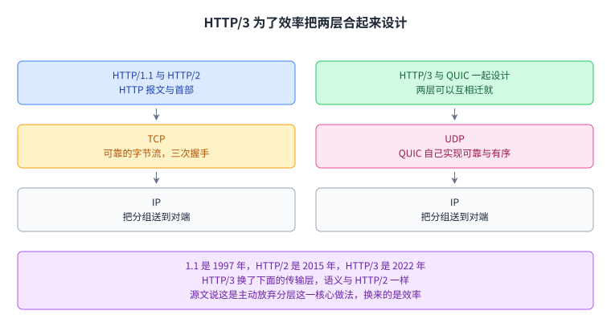

这张图左右两个堆栈的差别就在上面那一格：左边是两层各写各的，右边是两层一起写。这一讲的落点：从报文格式讲到缓存与 CDN，最后停在一处取舍上，效率有时值得拿分层去换。

## 读完应该能回答

1. HTTP 是 1989 年为了什么做出来的，它要解决的问题与 FTP 差在哪。
2. HTTP 踩在哪一层上，服务器在哪个端口听连接，客户端用什么端口发起，一问一答的规则有多严。
3. 请求报文的四段各是什么，源文那句「三部分」与它列出的四项差在哪，本页按哪一个读。
4. 状态码分几类，301 与 302 有什么分别，401 与 403 有什么分别，源文为什么说分类比分号重要。
5. 首部按场合分三个方向各是什么，源文说「没有哪个首部是必须的」与规范里 Host 必带这一条怎么并存。
6. 流水线与连接复用差在哪，流水线换来的加速用什么代价付，代价里最坏的情形是什么。
7. 三类缓存的区别落在哪两件事上，受管缓存那一节为什么会出现代理缓存这个词，本页怎么处理。
8. 缓存对客户端、ISP、服务器各有什么好处，它管不住哪一类内容。

9. `Expires` 与 `Cache-Control` 差在哪，`private, max-age:86400` 说了什么，源文的写法与规范的写法差在哪个符号上。
10. CDN 铺在三个不同的位置上各换来了什么，Sandvine 那组数字里 30.9% 与 25% 为什么不一致。
11. 把客户端指到最近服务器的三条路各有什么毛病，哪一条粒度最细。
12. HTTP/3 换掉了什么，源文说它放弃的是什么，换来的是什么。

## 脉络回顾

这一讲是应用层的第二个协议。第 27 讲把域名换成了地址，可地址换完，两台机器还要商定报文长什么样，这一讲补的就是这一环。它在源文里的位置也说明了这件事：标题叫 HTTP，可源文自己承认这一节大半篇讲的是性能与缓存，最后才回到协议本身。

通向它的线有三条。最近的一条是第 27 讲，名字到地址的映射是发请求之前必须先做完的一步，而这一讲有两条路直接踩在它上面：代理缓存要靠 DNS 应答说谎把客户端引过来，CDN 要用 DNS 做负载均衡，两者都要先有名字解析。第二条在第 19 与第 20 讲，那里讲的字节流抽象与三次握手，这一讲把它们当基础设施用，一个字也没有再解释。第三条在第 2 讲与第 3 讲，那里讲分层与首部的价值，而这一讲正是把首部当扩展窗用：缓存、压缩、优先级都是从这扇窗里加进来的。

这一讲解决的是哪一环。第 24 讲算过吞吐量与往返时延成反比，那时的结论是网络内部的排队会吃掉吞吐量。这一讲给的是另一条路：既然时延在分母上，那就把内容搬到离用户近的地方，缓存与 CDN 是这件事的两种规模。

最要紧的转折在最后。前面二十几讲的分层故事里，每一层各管一段是优点，因为换掉一层另一层照旧能跑。源文在最后一节写了 HTTP/3 这个反例：为了效率，它主动放弃分层，把 QUIC 与 HTTP/3 放在一起设计。这是全课少见的、把分层的代价明写出来的地方。

后面哪里用到它。第 29 讲到第 33 讲往下走到链路层与端到端的那几件配套，以太网、ARP、DHCP、NAT 都在那里。第 34 讲回到 TLS，也就是这一讲 HTTPS 那一段里说「建在 TCP 之上」的那个协议，这一讲只说了它存在，密钥怎么交换留给那一讲。第 35 讲讲端到端连通性，而这一讲的缓存与 CDN 是那条链路上最容易被忽略的一环：内容离得近，链路看起来就快。

## 溯源

- 对应：UC Berkeley CS168 Computer Networks，教材 Applications 之 HTTP（<https://textbook.cs168.io/applications/http.html>）
- 教材：CS 168 Textbook（UC Berkeley CS168 课程教材），原文链接同上
- 授权依据：教材站在站根页声明 CC BY-SA 4.0；本文为本仓库原创中文讲解，按该节顺序重讲，关键句给出英文原文与中译，**未逐句全译**，配图自绘
- 字段核对：本讲清单 `docs/lecture-manifest.md` 里编号 28 的那一行为 `http` / `HTTP` / `/applications/http.html`（该行在文件第 53 行）；抓取该页时 `<title>` 为 `HTTP | CS 168 Textbook`，`og:title` 为 `HTTP`，H1 为 `HTTP`。三处一致，派单字段与来源一致
- 源文件与范围：抓取的该页 HTML 共 59,233 字节；正文锚点 `#main-content` 内共 **14 个二级小节**，依次为 Brief History of HTTP、HTTP Basics、HTTP Requests、HTTP Responses、HTTP Headers、HTTP Examples、Speeding Up HTTP with Pipelining、Speeding Up HTTP with Caching: Types、Speeding Up HTTP with Caching: Benefits and Drawbacks、Speeding Up HTTP with Caching: Implementation、Content Delivery Networks (CDNs)、CDN Deployment、Directing Clients to Caches、Newer HTTP Versions
- 源页共 **16 张配图**，本讲逐张抓取核对过，文件名与内容都对得上，没有出现文件名误导的情况：`4-13-http-bytestream.png`（左右两格是 Client random port 与 Server port 80，中间一条双向箭头写 TCP bytestream）；`4-14-httpexample1.png`（请求 POST /send-money HTTP/1.1、User-Agent: robjs、内容 target=alice&amount=10，响应 201 Created 与 Location: success.html）；`4-15-httpexample2.png`（请求 PUT /newfile.html HTTP/1.1、内容 `<p>Some File</p>`，响应 201 Created 与 Content-Location: newfile.html）；`4-16-no-pipeline.png`（两台机器之间两条独立的双向箭头，分别写 GET /googlelogo.png 与 GET /googleicon.png）；`4-17-pipeline.png`（同样的两行请求画在同一条箭头上）；`4-18-nocache.png`（三个客户端各自向 Origin Server 发两次请求，蓝线是第一次、红线是第二次）；`4-19-privatecache.png`（三个客户端各自带一个缓存柱，第二次请求由自己的缓存应答）；`4-20-proxycache.png`（三个客户端共用一个 Proxy Cache 柱，柱再连 Origin Server）；`4-21-managedcache.png`（两个 Managed Cache 柱夹在客户端与 Origin Server 之间）；`4-21-cdn1.png`（不铺 CDN：四个客户端各有一条线一路走到 Datacenter 里的 Origin Server，左侧红虚线框是 ISP 的 WAN 与 Peering，右侧蓝虚线框是应用的 Peering 与 WAN）；`4-22-cdn2.png`（CDN 放在应用侧的 Peering 格里）；`4-23-cdn3.png`（CDN 移到 ISP 侧的 Peering 格里）；`4-24-cdn4.png`（CDN 再移到 ISP 侧的 WAN 格里）；`4-25-anycast1.png`（C 经 R1、R2 到 S1，S1 与 S2 都宣告 1.0.0.0/24，两条路的权值是 1 与 10）；`4-26-anycast2.png`（R1 到 R2 的链路断了，流量改走 R3 到 S2，S2 边上画了一个问号框）；`4-27-dns-loadbalance.png`（旧金山、悉尼、伦敦、东京四个客户端共用一台 Recursive Resolver，解析器再问 Name Server）
- 源里 `TODO` 标记实测 **0 处**（全文检索 `TODO` 与 `FIXME` 均无命中；唯一命中 `placeholder` 的是页面顶部的搜索框，不是正文），因此本讲没有任何「待补」项被代补
- 结构说明：本页 14 个正文章节与源文 14 个小节是一对一的，只把三个 Caching 小节标题里共同的 `Speeding Up HTTP with` 前缀省掉，其余标题与源文逐字对应；源文第 8、9、10 个小节（三个缓存小节）在本页也是第 8、9、10 节，顺序未动

## 溯源：照录与登记（源文自身的出入）

- **照录（源文自身的口径不一，已在正文就地说明）**：请求那一节写 "The request contains three parts: method, URL, version, and optional content."，前半句说三部分，后面列了四项，可选内容也在其中；而响应那一节写 "The response contains four parts: version, status code, optional message, and content."，四项对四段，内容被算作其中一部分。两处口径不同，本页按四项读请求，未静默改源文
- **照录（与同节自己的定义相反，已在正文就地说明，并报给 Lead）**：受管缓存那一段写 "The HTML might then include links to specifically fetch the video and images from the proxy caches (e.g. load from static.youtube.com instead of www.youtube.com)."，而同一节上一段刚写 "Managed caches are in the network, and are controlled by the application provider"，定义代理缓存时又写 "are controlled by the network operator, not the application provider"，后文讲 CDN 时也写 "unlike proxy caches, they're controlled by the application provider"。按这些定义，应用指挥不了代理缓存，所以那句里的 proxy caches 按受管缓存读。本页照录原句、就地说明，未静默改字
- **数字对不上（照录，并报给 Lead）**：CDN Deployment 一节先列 Sandvine 2023 的三个份额（Netflix 15%、YouTube 11.4%、Disney+ 4.5%），随后写 "they could potentially build 25% less network capacity"。三个份额相加是 30.9%，与 25% 差 5.9 个百分点，源文没有解释这个差。本页在正文与配图里把两个数都照录，只点出差异，不替源文补解释
- **照录（与规范写法不同，已在正文就地说明，并报给 Lead）**：Caching: Implementation 一节写 "the server could reply with: Cache-Control: private, max-age:86400"。这一项在规范里的写法是 `max-age=86400`，用等号而不是冒号。本页在正文与配图里都保留源文的冒号写法，并在正文点明

## 溯源：存疑、我们补的与核不到的

- **我们补的（源文没写）**：源文写 `Expires` "just specified how long the data can be cached"，而它给的是一个绝对时刻，过了那一刻响应就过期。本页在正文按「存到什么时候」读它，这是我们的读法，不是源文的说法
- **我们补的（源文没写）**：源文写 "In HTTP/1.1, no headers are mandatory"，而 Host 在 HTTP/1.1 的请求里是必带的（`RFC 7230` 第 5.4 节）。源文自己给的例子也没有写 Host，与它那句话自洽，只是照那样敲，今天的服务器多半会回 400。本页照录源文的说法，同时把这一条写进正文与配图
- **存疑（措辞，报给 Lead）**：Newer HTTP Versions 一节写 "QUIC = Quick UDP Connections"。通行的展开是 Quick UDP Internet Connections，中间多一个 Internet。本页照录源文的展开，并在正文点明通行的写法，不改源文
- **存疑（把两件事说成一件事，已在正文就地说明）**：Pipelining 一节先写 "allowing multiple HTTP requests and responses to be pipelined over the same connection"，紧接一句 "Now, we no longer need a separate TCP connection (with a separate handshake) for every request."。后半句讲的是连接复用（HTTP/1.1 默认保持连接），而流水线是在同一条连接上一次发出多个请求、不等前一个响应。本页照录，并在正文按连接复用来读
- **存疑（措辞）**：HTTP Responses 一节写 "if we sent an HTTP request to Google using version 0.9, the appropriate request might be 505"。按上下文这里说的是应答，本页在正文按「合适的应答」写，不改源文的句子
- **存疑（措辞）**：源文一律写 HTTP/2.0 与 HTTP/3.0，而这两个版本的正式名字是 HTTP/2 与 HTTP/3。本页在正文里有时沿用源文的带小数写法，配图与标题里用短写法
- **核不到的**：源文引的 2023 年 Sandvine 报告，本页没有去找原始报告；到 2024 年超过 85% 的网站默认用 HTTPS 这个数也没有另找来源，两处都按源文照录

## 溯源：核过的算术、我们补的、术语取舍

- **我们核过的算术（源文数字均已逐条验算，无冲突）**：1997 到 2022 是 25 年，源文说这套协议的基本做法「二十多年没变过」，与它给的年份相符；1991 到 1996 是 5 年，1996 到 1997 只隔 1 年；1.1 到 2.0 是 18 年，源文写 2.0 是 1997 年以来第一次大改，与年份相符；2.0 到 3.0 是 7 年；`max-age:86400` 里的 86400 秒等于 24 小时，正是源文说的「一天」；4 GB 与 1 KB 的比值是 4 × 1024 × 1024 = 4,194,304，正文写「四百多万倍」；CDN Deployment 里的 15 + 11.4 + 4.5 = 30.9，与源文给的 25% 不符，已在正文与上一条里点明
- **我们补的（源文没有写）**：第 24 讲那条「吞吐量与往返时延成反比」与缓存的接法（源文只写 "recall that TCP throughput and RTT are inversely proportional"，没有点名哪一讲）；第 19、20 讲与字节流、三次握手的对位；第 27 讲与 DNS 的对位；80 与 443 属于熟知端口这层解释（源文只写 "the well-known, constant port number 80"）；「源文自己的例子没有 Host，照那样敲今天的服务器多半会回 400」这句推断；4 GB 与 1 KB 相差四百多万倍这个换算；把源文三个 Caching 小节的标题前缀省掉这件事本身；本页 14 张配图对源文 16 张图的改写与重画；脉络回顾里那三条「哪一讲通向它」的线
- **术语取舍**：本讲新增 15 条术语（http、https、url、http-method、status-code、content-type、cache-control、pipelining、private-cache、proxy-cache、managed-cache、content-delivery-network、origin-server、server-side-push、tls）。`HTTP` 第一次出现时写成「超文本传输协议」，之后一律直接用 HTTP，因为它是这一页最高频的词；`status code` 译作「状态码」；`managed cache` 译作「受管缓存」而不是「托管缓存」，因为源文强调的是它由应用提供方控制，重点落在「谁管」；`server-side pushing` 译作「服务器推送」
- 其余术语沿用前几讲，本页用到的有 header（首部）、well-known port（熟知端口）、end host（端主机）、ip-address（IP 地址）、anycast（任播）、load balancing（负载均衡）、layering（分层）、internet（互联网）、cache（缓存）。其中 anycast 与 load balancing 两条是第 27 讲留下的，本页直接复用；`cache` 那条的 notes 写的是名字解析那种缓存，本页大量用到中文「缓存」，没有改它的 notes，以免与正在写第 27 讲的另一条流冲突，这一处留给 Lead 决定要不要扩写
