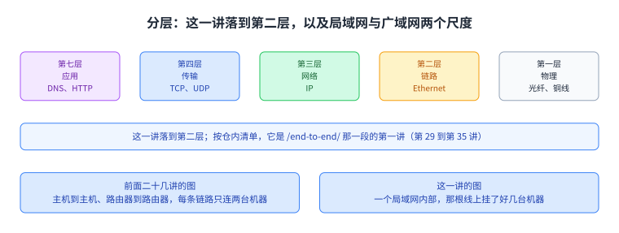
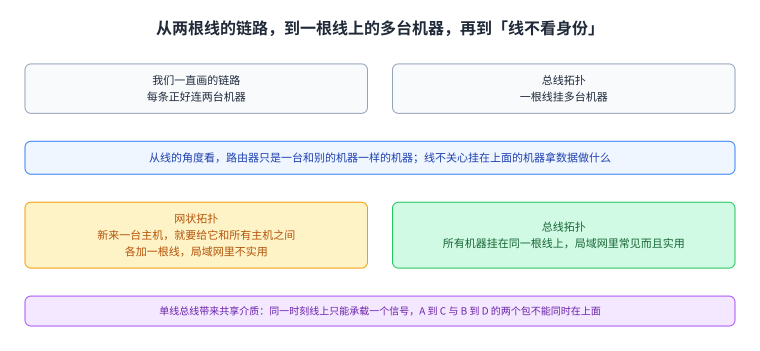
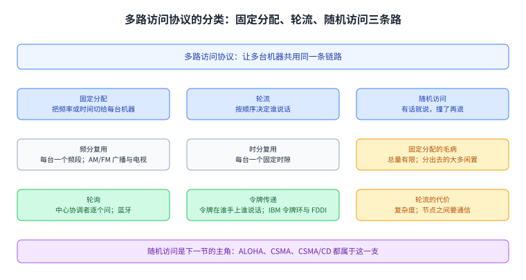
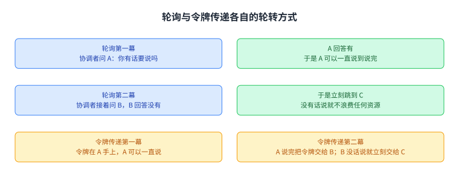
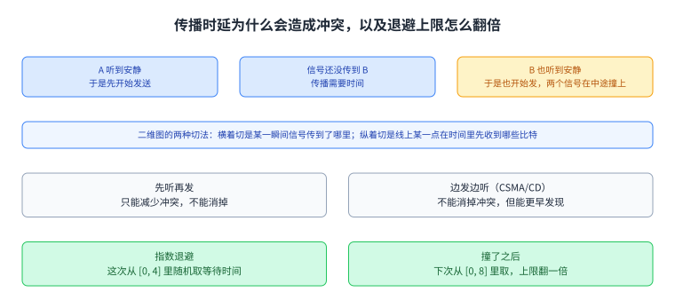
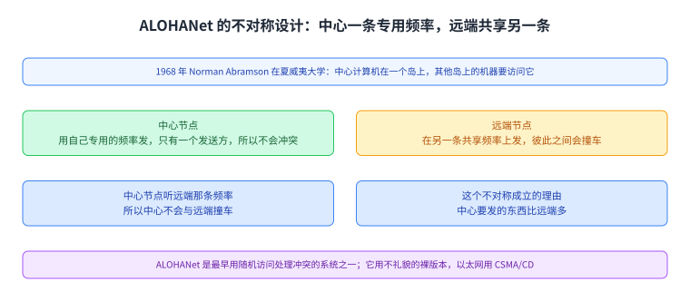
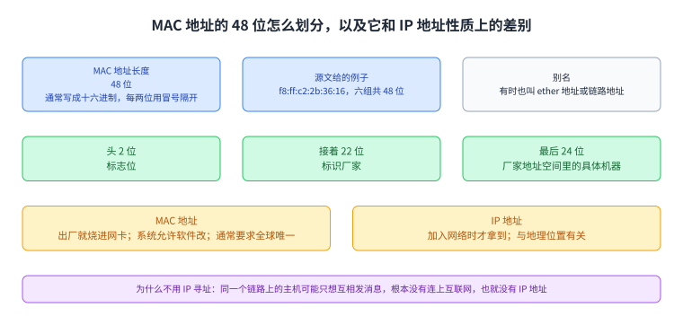
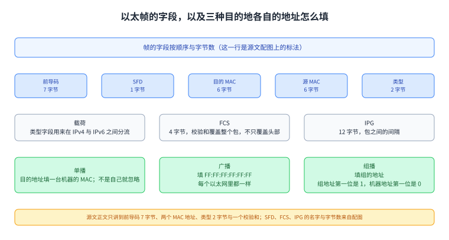
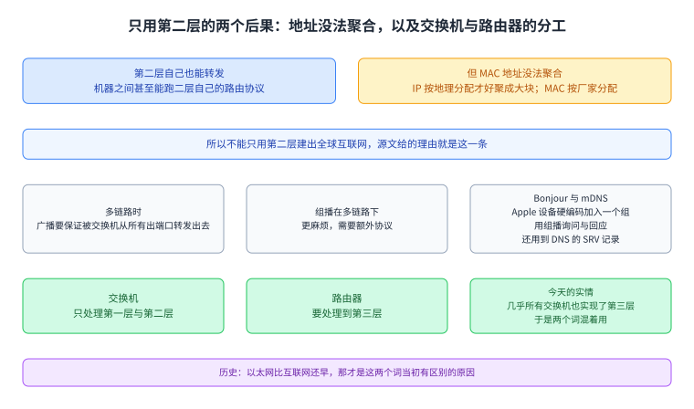

+++
title = "以太网：一根线上怎么容下多台机器"
lecture = 29
slug = "ethernet"
status = "draft"
source_kind = "textbook"
source_url = "https://textbook.cs168.io/end-to-end/ethernet.html"
source_title = "Ethernet"
output_mode = "explanation"
+++

> 来源课程：UC Berkeley CS168 Computer Networks（教材 CS 168 Textbook）；
> 对应内容：End-to-End 之 Ethernet（<https://textbook.cs168.io/end-to-end/ethernet.html>）；
> 上游许可：教材站在站根页声明 CC BY-SA 4.0（第二人复核见 `docs/audit/license-cs168-second-review.md`）；
> 本文由 CourseLingo 原创撰写：**按该节的推进顺序**重新讲解，关键句给出英文原文与中译，**不逐句全译**，配图全部自绘、不转载原图；
> 本文非官方材料，CourseLingo 与 UC Berkeley 及课程教学团队无隶属关系；如与原文有出入，以原文为准。

## 一、这一讲要解决什么问题

前面二十几讲画图时，每一条链路都只连两台机器。这一讲把镜头收进一个局域网内部，看那根线上到底发生了什么。源文开头就把尺度换了：

> In particular, we'll look at forwarding and addressing at Layer 2.
>
> 中译：具体地说，本节要看的是第二层的[[term:forwarding]]与寻址。这一段要放进上下文中读：前面二十几讲画的是跨长距离的[[term:wide-area-network]]，每条链路只连两台机器；本节换到另一个尺度，也就是一个[[term:local-area-network]]内部，例如你家里那台电脑与家用[[term:router]]组成的网络。

要解决的是两件事。第一件是转发：一个[[term:packet]]怎么从局域网里的主机送到路由器，而这里要看的是[[term:link-layer]]的转发与寻址，不是第三层那一套。第二件更特别：同一个局域网里的主机之间，能不能完全不经过路由器就互相发消息。源文对这一层的判断很直接：

> The predominant protocol at Layer 2 is Ethernet.

中译：第二层最主要的协议就是以太网。按仓内清单，这一讲属于 `/end-to-end/` 那一段的第一讲，而那一整段（第 29 到第 35 讲）要一路讲到二层路由、ARP、DHCP、NAT、TLS，最后收在端到端连通性上。

图里左边是源文那张分层图（第七层应用、第四层传输、第三层网络、第二层链路、第一层物理），第二层那一栏标的是以太网；右边是这一讲换的两个尺度。看这一页时记住：前面讲的是从一台主机到另一台主机，这一讲讲的是一个屋子内部。

## 二、把多台机器接到同一根线上

源文先回头看我们画过的图：以前假设每条链路正好连两台机器；现实里一根线可以挂很多台机器。它用三张图把这层意思递进地摆出来，第三张是把路由器也看成线上的普通一员：

> Ultimately, the wire doesn't really care what the connected machines are doing with the data they exchange.

中译：说到底，线并不关心挂在上面的机器拿这些数据做什么。源文在紧邻的几句里把这一层再抽象了一步：在第二层看来，[[term:router]]真的只是一台和别的机器一样的机器，只不过它恰好在更高的层上跑[[term:routing]]协议。

那局域网该怎么布线。源文把前面讲全局网络时考虑过的两种拓扑又拿出来比：网状拓扑（每两台之间都拉一根线）仍然很不实用，新来一台主机就要给它和所有主机之间各加一根线；而总线拓扑，也就是所有机器挂在同一根线上，在局域网里相当常见而且实用。

总线拓扑带来一个新概念。源文写：

> The single-wire bus topology introduces the notion of a shared media.

中译：单线总线拓扑引入了[[term:shared-media]]这个概念。共享的意思很具体：源文说，A 发给 C 的包与 B 发给 D 的包可能同时出现在线上，而线上的电信号没办法同时承载这两个包。源文用的类比是一通多人共享的电话会议：任何两个人都能说话，但不能同时进行两场对话，否则谁说的话都听不清。它还提醒介质不止铜线一种，无线链路里所有主机共享的是同一段电磁频谱。

图里三行对应源文三张递进的图：我们一直画的链路只连两台机器；现实里一根线挂多台机器；从线的角度看路由器也是普通机器。第二行那个总线画法就是共享介质的样子。

## 三、谁先说话：三种多路访问思路

一根线上多台机器，就会有信号互相干扰的问题，也就是[[term:collision]]。源文把冲突的后果说得很清楚：两个信号叠加之后接收方解不出来，而且认不出这条信号是谁发的。所以需要一个[[term:multiple-access]]协议。源文把可选的[[term:protocol]]思路分成三类，源文第 5 张配图就是这棵分类树。

第一类是固定分配。两种分法：[[term:frequency-division-multiplexing]]把不同的频段分给不同的机器，源文举的现实例子是 AM/FM 广播与电视，它们就是把频率切成频道；[[term:time-division-multiplexing]]把时间切成固定时隙，每台机器分到一个时隙。源文指出这类做法的毛病：频率与时间的总量有限，而且并不是每个人都有话要说，分出去的那一份大部分时间会闲着，这是浪费。

第二类是轮流。这一类的思路是不做固定分配，改成动态地按时间划分，轮到谁谁就用自己需要的那段时间。两种做法：[[term:polling]]让一个中心协调者按顺序逐个问「你有话要说吗」，有就说，没有就立刻问下一个，所以不浪费资源，源文点名的现实协议是蓝牙；令牌传递不发中心角色，而是[[term:token-passing]]，在节点之间传一个虚拟令牌，只有拿令牌的节点能说话，有话说就拿着令牌说完再传下去，没话说就立刻传给下一个，源文点名的现实协议是 IBM 令牌环与 FDDI。

源文对轮流这一类的评价是复杂度：要实现节点之间的通信本身就可能很麻烦。令牌传递可能得专门留一个频段来可靠地传令牌，还要处理两个节点都以为令牌在自己手上、于是撞车这种麻烦；轮询要指定一个中心协调者，还要实现协调者与节点之间的通信，源文说在蓝牙里你的手机可以是那个协调者，但在别的网络里，谁是那个协调者并不总是说得清。

图里是源文那张分类树：最上面是多路访问协议，下面分固定分配（频分与时分）、轮流（轮询与令牌）与随机访问（ALOHA、CSMA、CSMA/CD）三支。前两支是这一节讲的，第三支是下一节的主角。

图里上半是轮询：协调者问 A，A 有话就说，问 B，B 没有就立刻跳到 C；下半是令牌传递：令牌在 A 手上时 A 说，A 说完把令牌交给 B，B 没话说就立刻交给 C。源文配图里那两句原话分别是「A can speak for as long as it needs」与「B has nothing to say. It can immediately pass the token to C」。

## 四、随机访问：先说，撞了再退

第三类是随机访问，也是以太网走的那条路。源文的原则很简单：让节点有话就说，撞了再来处理；节点之间不做协调。它给的好处是简单，因为不需要实现节点之间的通信。

撞了怎么处理，源文的机制是这样：接收方收到包之后回一个确认；如果两台同时发，冲突会把两个包都弄坏，于是没有任何确认回来；发送方等不到确认，就等一段随机的时间再发一次。等待时间取随机值是有意的，为的是让重发时刻错开，不要让两台机器再同时发。源文把这种「有话就大声说」的做法形容为不礼貌，而更礼貌的版本叫[[term:carrier-sense-multiple-access]]：先听一下线上有没有人在说，安静了才开始说。这里的「听」就是感测线上的信号。

源文接着指出，这种做法并不能消掉所有冲突，原因是传播时延。它给的例子是：一端的节点 A 听到安静，开始发送；此时 A 的信号可能还没传到另一端的节点 B；B 也听到安静，于是也开始发送，两个信号就撞上了。源文配图是一张二维图：横向切一刀看到的是某一瞬间线上信号传到了哪里，纵向切一刀看到的是线上某一个位置在时间里先收到哪些比特。图上四个位置标的是 A、B、C、D。同一段文字里还有一句值得单独拿出来说，见下面的照录。

由此有了[[term:csma-with-collision-detection]]版本：除了说话前听，说话的时候也一直听；如果发着发着自己听到了别的信号，就立刻停下。源文说这仍然不能消除冲突，但能更早发现冲突，从而少浪费线上时间。

人少的时候上面这些就够了；人多的时候会出现反复冲撞，单纯随机等待解决不了。源文给的机制是[[term:binary-exponential-backoff]]：每重传一次又撞上，就把下一次随机等待的上限翻一倍。它举的例子是：这次从 [0, 4] 里随机取一个等待时间，撞了之后下次就从 [0, 8] 里取。这个机制在两种情况下都好用：说话的人少时反复冲突不常见，等一小会儿就能重发；说话的人多时反复冲突多，上限指数增长，直到一部分节点被推到很远的未来、当下竞争的人变少、冲突消失。也就是说，它的代价只在人多时才涨起来。

图里把一轮随机访问拆成四步：先把包发出去；接收方收到就回确认；收不到确认说明撞了，两个包都坏了；于是等一段随机时间再发。最下面一条是等待取随机值的用意。

图里上面是那个时延场景：A 听到安静先发，信号还没传到 B，B 也听到安静就发，两个信号在中途撞上；中间是二维图两种切法的读法；下面是指数退避的上限从 [0, 4] 翻到 [0, 8]。

## 五、历史：ALOHANet 与它的不对称设计

源文用一节讲这套机制的来历。1968 年，Norman Abramson 在夏威夷大学遇到一个问题：中心计算机在那里，而其他岛上的计算机要访问它。由此得到的协议叫 ALOHANet，全称是 Additive Links On-line Hawaii Area，做法是无线通信，也就是所有节点共享同一段介质。

它的设计有意思的地方是不对称，因为场景本身不对称。源文说它**同时用了固定分配与随机访问**：中心节点用自己的专用频率发消息，远端节点都听这个频率收，因为这条频率上只有一个发送方，不会有冲突；反过来，所有远端节点在另一条共享频率上发，中心节点听这条频率，于是中心节点不会与远端节点撞车，但远端节点之间会互相撞。

源文给了这个设计成立的理由：中心节点要发的东西大概比远端节点多，所以给它一条专用频率是划算的。ALOHANet 也是最早用随机访问协议处理冲突的系统之一，源文说这套思路后来被以太网继承；不过 ALOHANet 用的是那个不礼貌的裸版本，以太网用的是更礼貌的版本，也就是说话前后都听、撞了就指数退避。

图里中心节点 H 用红色箭头在专用频率上发，远端节点 A 与 C 用蓝色箭头在共享频率上发给 H。源文配图画的就是这个不对称结构，而它恰好说明为什么系统要同时用上两种思路。

## 六、第二层地址：MAC 地址

有了共享介质，就能让同一个链路上的主机互相发消息，完全不经过第三层，源文用的类比是同一个房间里的人互相递信，不必把信送到邮局。但共享介质带来一个新问题：你发出去的消息，链路上所有人都收到了，不只是你想给的那个人。所以第二层需要一个自己的寻址系统。

源文给的定义是，第二层上每台计算机有一个 [[term:mac-address]]，也就是媒体访问控制地址。它有 48 位，通常写成十六进制、每两位用冒号隔开，源文给的例子是 `f8:ff:c2:2b:36:16`。它有时也被叫作 ether 地址或链路地址。

源文接着讲了它的三个性质。第一，它通常被永久烧进硬件，例如你机器里的[[term:network-interface-card]]，所以每台设备出厂就带着一个 MAC 地址；大多数操作系统允许你在软件里改掉它，但硬件上那个一直在。第二，它的分配按厂家走：头两位是标志位，接着 22 位标识厂家，最后 24 位标识这台厂家地址空间里的具体机器。第三，它通常要求全球唯一，因为你的电脑可能插进任何一个局域网，同一个链路上有两台机器撞了 MAC 地址会很糟。

那为什么不直接用 IP 地址。源文给的理由是：同一个链路上的主机可能只想互相发消息，而它们可能**根本没有连上互联网**，于是压根没有 IP 地址。它还把两套地址的性质对起来讲：IP 地址是你加入网络时才拿到的，而且与地理位置有关；MAC 地址是出厂就固定的，与地理位置无关。

图里上面把 48 位拆成 2 位标志、22 位厂家与 24 位机器三截，并给出 `f8:ff:c2:2b:36:16` 这个写法；下面把 MAC 与 IP 三种性质并排：谁分配、什么时候拿到、与地理位置有没有关系。

## 七、以太帧与三种目的地

源文这一节先分目的地类型。[[term:unicast]]是发给一台指定的机器；[[term:broadcast]]是发给本地网络上的所有机器；[[term:multicast]]是发给本地网络里属于某个组的所有机器，机器可以主动加入某个组来收发给那个组的包。源文说以太网三种都支持，并且广播有时被看成组播的特例，因为所有人都自动属于广播这个组。它还指出这套模型不限于第二层：第三层的任播就是「发给一个组里的任意一个成员」，也就是同一个地址背后那一批服务器里的任意一台。

以太网的数据单元叫[[term:ethernet-frame]]。源文提醒它的很多字段看起来和 IP 头部相似，但是有几处不同。它逐段讲了这几个字段：帧开头是 7 字节的[[term:preamble]]，用来标出一个包的开始，也帮助把线上的包彼此分开；接着是目的 MAC 地址与源 MAC 地址，作用与 IP 头部里的目的与源字段相似；接着是 2 字节的类型字段，用来在 IPv4 与 IPv6 之间[[term:demultiplexing]]，把载荷交给正确的下一个协议，作用与 IP 头部的协议字段或 TCP/UDP 头部的端口字段相似；帧里还有一个校验和，与 IP 不同的是它覆盖整个包，这样就不必依赖上层来保证完整性，因为载荷里装的**未必是 TCP/IP**。

三种目的地怎么落实，源文讲了三条规则。单播就是把目的 MAC 设成某台机器的地址；共享介质上所有人都会收到这个帧，所以每个人都要检查目的 MAC 是不是自己，不是就忽略。广播就是把目的 MAC 设成全 1 的地址 `FF:FF:FF:FF:FF:FF`，同样所有人都收到，但这次所有人都知道该读它，而且这个全 1 地址在每个以太网里都一样。组播就是把目的 MAC 设成那个组的地址，这里用上了前面说的标志位：分给具体机器的地址第一位总是 0，分给组的地址第一位总是 1；同样所有人都收到帧，属于这个组的机器要确保自己在听这个组地址才能收到。源文最后说，谁属于哪个组要靠另外的协议来管，它不再展开。

图里上面按顺序排出帧的字段与字节数：前导码 7、SFD 1、目的 MAC 6、源 MAC 6、类型 2、载荷、FCS 4、IPG 12；下面三格是单播、广播与组播各自把目的地址填成什么。这里要说明一句：SFD、FCS 与 IPG 这三个字段名与它们的字节数是源文配图上标的，源文正文只讲到前导码 7 字节、两个 MAC 地址、类型 2 字节与「一个校验和」。

## 八、只用第二层，能不能建出整个互联网

源文的最后一节把这个假设推到底：既然第二层能寻址、能转发，那能不能只用第二层搭一个网络，机器之间跑二层自己的路由协议，全程只用 MAC 地址。源文的结论是不行，理由很具体：MAC 地址**没法聚合**。IP 地址按地理分配，所以可以把一大片地址聚合成一条路由；MAC 地址按厂家分配，于是没有清晰的办法把它们聚起来。源文说这就是为什么不能只用第二层建出全球互联网。

它另外交代了两件工程上的事。一个局域网里如果有多条链路，那么广播要保证被第二层的交换机从所有出端口转发出去；组播在多链路的情况下更麻烦，同样需要额外协议。源文举了一个组播在局域网里真正有用的例子，是 Apple 的 Bonjour／mDNS：所有 Apple 设备（iPhone、iPad、Apple TV 之类）被硬编码成加入局域网里一个特殊的组；你的 iPhone 想找附近能放音乐的设备时，就向这个组组播一条询问，组里的设备也可以组播回应「我是 Apple TV，我能放音乐」；源文还提到这个协议实际上也用了 DNS，在组播组里发 SRV 记录，把每台机器映射到它的能力。

最后是那段历史注脚。源文说我们此前讲「路由器」与「交换机」时可以互换着说；有了第二层网络这个概念之后可以说得更准：交换机只处理第一层与第二层，路由器处理第一层、第二层与第三层。按包与解包那套图来说，路由器要把包解析到第三层再按 IP 转发给下一个路由器，而交换机只需要把包处理到第二层，再按以太网转发给下一台交换机。源文说今天几乎所有交换机也实现了第三层，所以两个词才混着用；而上古时期的以太网比互联网还早，那才是这两个词有区别的原因。

图里上面的两格是只建第二层网络的正反两面：二层自己也能转发与跑路由，但 MAC 地址按厂家分配、没法聚合成大块；下面的三格是交换机、路由器与今天的实情。源文那句话说得很直：MAC 地址没法聚合，所以全球互联网不能只建在第二层上。

## 读完应该能回答

1. 为什么共享介质上同一时刻只能有一个信号，两根线的链路与一根线的总线在这一点上差在哪里？
2. 固定分配、轮流与随机访问这三类思路各靠什么避免或处理冲突，各自的代价是什么？
3. 为什么先听再发仍然会撞车，加上边发边听与指数退避之后解决的是哪一半问题？
4. MAC 地址为什么不能像 IP 地址那样聚合，而这一条为什么决定了全球互联网不能只建在第二层上？

## 脉络回顾

这一讲把镜头从最大缩到最小。前面二十几讲画的是主机到主机、路由器到路由器：第 7 讲开始讲路由，第 12 讲讲地址怎么分配，第 18 到 26 讲把传输层与拥塞控制讲完，第 27 与 28 讲抬到应用层。那些图里每条链路都只连两台机器，链路本身从来没有成为问题。这一讲第一次让一根线挂上多台机器，于是问题变成：这条线在同一时刻只承载得下一个信号，那么谁先说话。

这一讲解决的正是这一环。它先给出三类思路，固定分配把频率或时间切给每台机器，轮流靠协调者或令牌决定谁说话，随机访问干脆让大家随便说、撞了再退。以太网走的是第三条，并且在这条路上把机制一层层加上去：先听再发减少了撞车，边发边听让撞车更早被发现，指数退避让人多时才把等待拉长。最要紧的转折在于，这一讲的答案不是「怎么让信号不撞」，而是「撞了之后怎么办」，并且把代价设计成只在竞争激烈时才上升。

源文还给了这一讲一个历史纵深：1968 年的 ALOHANet 用一条专用频率加一条共享频率的不对称设计，把固定分配与随机访问合在一起用，而这套随机访问的思路后来被以太网继承。地址与帧那一半则交代了第二层自己的身份体系：48 位的 MAC 地址按厂家分配、按硬件固定，而 IP 地址按地理分配、入网才有；正因为 MAC 没法聚合，全球互联网只能建在第三层上。这一段还补了一个此前混着用的说法：交换机停在第二层，路由器要上到第三层，而今天两者已经混同。

后面几讲会继续用这一讲的词汇。按仓内清单，第 30 讲讲第二层的路由与生成树，第 31 讲的 ARP 正是把这一讲的 MAC 地址与下一讲的 IP 地址对起来的那座桥，再往后 DHCP、NAT、TLS 一路走到端到端连通性。所以这一讲既是往下走到链路的尽头，也是那一整段的开头。

## 溯源

- **字段核对**：`docs/lecture-manifest.md` 第 29 行为 `ethernet` / `Ethernet` / `/end-to-end/ethernet.html`；抓页时 `<title>` 是 `Ethernet | CS 168 Textbook`，H1 是 `Ethernet`。两处一致。
- **源文件与范围**：该页 HTML 共 43,934 字节（首次即 200），正文锚点 `#main-content`，实测 9 个二级小节（Local Networks / Connecting Local Hosts / Shared Media: Coordinated Approaches / Shared Media: Random Access Approaches / Brief History of Layer 2: ALOHANet / MAC Addresses / LAN Communication Types, Ethernet Packet Structure / Ethernet Packet Structure / Layer 2 Networks with Ethernet），`TODO` 标记 0 处。
- 10 张配图逐张抓下来看过：`5-001-layer2`（分层图，第二层那栏标 Ethernet）、`5-002-linking-machines`（三行：只连两台机器／一根线挂多台／从线的角度看路由器也是普通机器）、`5-003-mesh-bus`（左网状右总线，五台 A 到 E）、`5-004-collision`（A 与 E 同时说话，B 与 C 与 D 头上是看不懂的记号）、`5-005-multiple-access-taxonomy`（分类树：多路访问协议 → 固定分配（频率、时间）／轮流（轮询、令牌）／随机访问（ALOHA、CSMA、CSMA/CD））、`5-006-polling`（协调者问 A 得到 yes 与问 B 得到 no 两幕）、`5-007-token`（令牌在 A 手上时 A 说话；令牌到 B 而 B 没话说就交给 C）、`5-008-propagation`（横轴空间、纵轴时间的二维图，四个位置标 A、B、C、D）、`5-009-alohanet`（中心 H 用红色箭头发，远端 A 与 C 用蓝色箭头发给 H）、`5-010-ethernet-packet`（帧字段与字节数：Preamble 7、SFD 1、Destination MAC 6、Source MAC 6、Type 2、Payload、FCS 4、IPG 12，并标注 Demultiplex 与 Checksum）。
- **照录与存疑（源文自身两处出入，本页照录并就地说）**：其一，源文在随机访问那一节写 `Both H2 and H4 hear silence before they start transmitting, but their signals still collide.`，而同一段的前两句把它们叫 node A 与 node B，对应的配图 `5-008-propagation` 上标的又是 A、B、C、D。三套称呼指同一件事，本页照录原句并在正文里说明「同一段文字里还有一句值得单独拿出来说」。其二，帧那张配图上有 SFD、FCS 与 IPG 三个字段名与字节数，而源文正文只讲前导码、两个 MAC 地址、类型与「一个校验和」；本页把图上信息写进正文时显式标出它们来自配图，没有把它们说成正文的内容。
- **引文归位（本页自我修正）**：第二层那句「[[term:router]]只是和别的机器一样的机器」在源文里有两种写法，正文里是 `We can abstract even further and note that at Layer 2, the router is really just a machine like any other`，而配图 `5-002-linking-machines` 上写的是更短的 `From the wire's perspective, the router is just a machine like any other`。本页正文引的是前者，并在同一段说明配图那句的意思相同。
- **我们补的（源文没有写）**：把 9 个小节归并成本页八节的结构说明；「按仓内清单，这一讲属于 `/end-to-end/` 那一段的第一讲，该段到第 35 讲」这句与仓内编号的对应（源文只说 Layer 2 与局域网，没有提课程编号）；「A 的等待取随机值是为了让重发错开」这句因果说明（源文只说等随机时间、并说随机有助于避免重发时再撞）；把 `5-006`、`5-007`、`5-009`、`5-010` 四张配图的内容写进正文；以及把 MAC 与 IP 的性质对比整理成三行（源文用两段散文写的）；还有「这一讲的答案不是怎么让信号不撞、而是撞了之后怎么办」这句总结，以及把正文原句与配图那句更短的写法并列交代（源文正文与配图各说了一句）。
- **术语取舍**：本讲新增 18 条（Ethernet frame／MAC address／shared media／multiple access／collision／Carrier Sense Multiple Access／CSMA with Collision Detection／binary exponential backoff／frequency-division multiplexing／time-division multiplexing／polling／token passing／unicast／broadcast／multicast／preamble／network interface card／wide-area network）。`Ethernet` 本身没有登记：它的英文原词在更早四页（02、03、08、09）已出现，一旦登记那四页立刻报漂移；本页把数据单元登记为 `Ethernet frame`（更早各页无此词组）。
