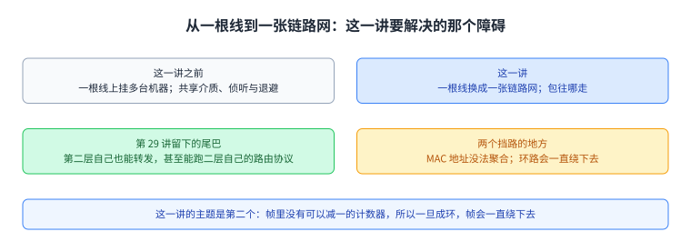
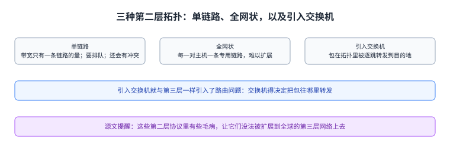
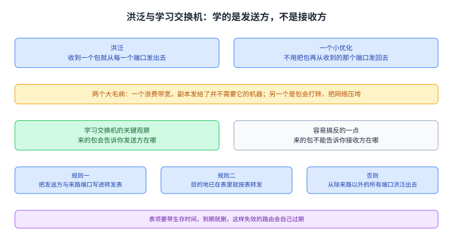
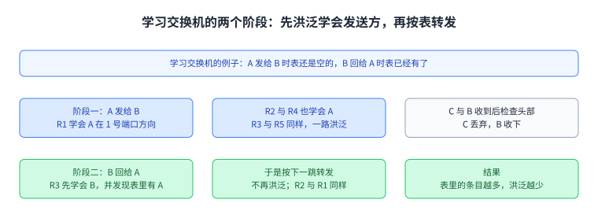
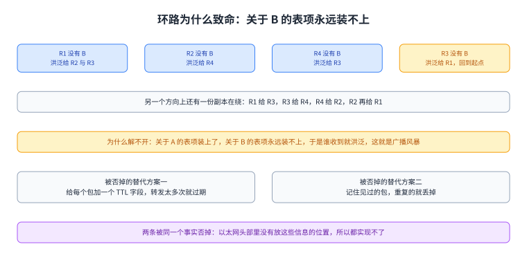
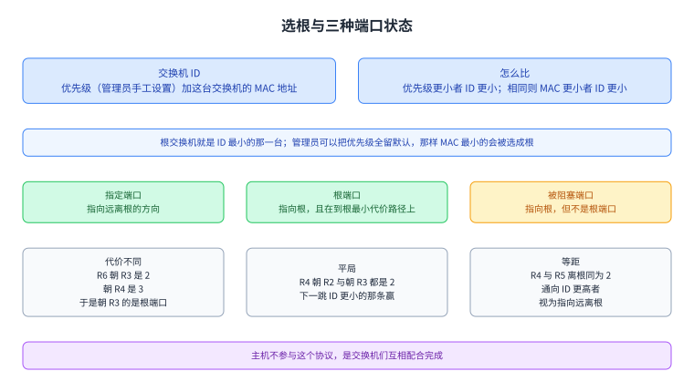
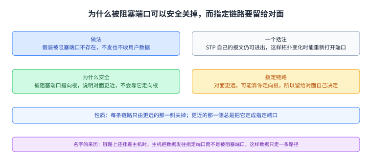
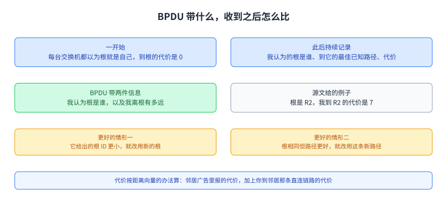
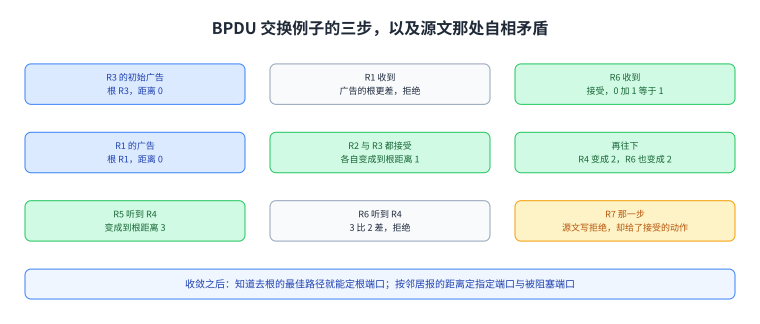

+++
title = "第二层路由与生成树：让一张有环的链路网变成一棵树"
lecture = 30
slug = "layer-2-routing-stp"
status = "draft"
source_kind = "textbook"
source_url = "https://textbook.cs168.io/end-to-end/l2-routing.html"
source_title = "Layer 2 Routing (STP)"
output_mode = "explanation"
+++

> 来源课程：UC Berkeley CS168 Computer Networks（教材 CS 168 Textbook）；
> 对应内容：End-to-End 之 Layer 2 Routing (STP)（<https://textbook.cs168.io/end-to-end/l2-routing.html>）；
> 上游许可：教材站在站根页声明 CC BY-SA 4.0（第二人复核见 `docs/audit/license-cs168-second-review.md`）；
> 本文由 CourseLingo 原创撰写：**按该节的推进顺序**重新讲解，关键句给出英文原文与中译，**不逐句全译**，配图全部自绘、不转载原图；
> 本文非官方材料，CourseLingo 与 UC Berkeley 及课程教学团队无隶属关系；如与原文有出入，以原文为准。

## 一、这一讲要解决什么问题

第 29 讲讲的是一根线上挂多台机器，这一讲把一根线换成一张链路网。源文第一句就跨了这一步：

> So far, we've shown Layer 2 protocols as operating on a single link with multiple computers attached to it, but we could introduce multiple links and build a network entirely using Layer 2.
>
> 中译：此前我们画的第二层协议都跑在一条挂了多台机器的 [[term:link]] 上；但我们可以引入多条链路，完全用第二层搭出一个网络。

第二层自己也能转发，机器之间甚至能跑第二层自己的路由协议。但它有两个挡路的地方。第一个在上一讲就交代过：第二层地址没法聚合。IP 地址按地理分配，可以把一大片合成一条路由；MAC 地址按厂家分配，没有清晰的办法聚合，所以全球互联网不能只建在第二层上。源文在这里再写了一遍这条理由，并且交代了两件工程上的事：多链路时[[term:broadcast]]要保证被交换机从所有出端口转发出去；[[term:multicast]]在多链路下更麻烦，源文说那要留到后面的专题去讲。

第二个挡路的地方就是这一讲的主题。源文在这张页面的第一节里把它留成了一句话：

> Today, pretty much all switches also implement Layer 3, which is why we use the terms interchangeably.
>
> 中译：今天几乎所有交换机也实现了第三层，所以我们才把「交换机」与「路由器」两个词混着用。源文补了一句历史注脚：以太网比互联网还早，那才是这两个词当初有区别的原因。而这一讲的落点不是这两个词的分工，而是一个第二层特有的麻烦：帧里没有可以减一的计数器，所以一旦链路成环，帧会一直绕下去。

图里左边是一张带环的链路网（A 与 B 之间有两条通路），右边是同一张网络被删掉冗余链路之后的样子。这一讲要回答的就是「怎么把左边变成右边」，以及交换机在没有全局视角时怎么一起做这件事。

## 二、第二层网络的拓扑选择

源文承认这一节的问题与前面[[term:routing]]那一段是同一个：局域网的机器也能用不同的拓扑连起来。它逐条比了三种。

只用一条链路把所有机器连起来最省事，但源文说这很低效：带宽只有一条链路的量；所有人都得排队才有机会发；两台机器同时发还会有冲突。

全网状给每一对主机一条专用链路，但源文说它难以扩展：每加一台主机，就要给它和所有已有主机之间各加一条线。

所以与第三层一样，可以引入[[term:switch]]，让包在拓扑里被逐跳转发到最终目的地。而源文说这也与第三层一样，引入了路由问题：交换机得决定把包往哪里转发。接下来的几节就是为第二层局域网专门设计的路由协议，源文同时提醒，这些协议里有些毛病让它们没法被扩展到全球的第三层网络上去。

图里三格对应源文的三种做法。上面一条说明这一节的问题与前面路由那一段相同，中间一条说明后两种做法各自的代价。

## 三、洪泛转发与学习交换机

源文从最天真的办法讲起：收到一个 [[term:packet]]，就把它从每一个端口发出去。它给了一个小优化，也就是不用把包再从收到的那个端口发回去。源文配图 5-011 画的就是这件事，图上那句原话是 Don't send packet back out of the incoming link.

这个做法有两个大毛病。一个是浪费带宽：同一个包的副本被发给了并不需要它的交换机和主机。另一个更严重：洪泛会造成包在网络里打转，把网络压垮。这一节先处理第一个。

思路是把交换机的转发表填起来，让它们能把包直接朝着目的地转发，而不是往所有方向各发一份。源文说，你可以跑一个路由算法来填表，但还有一个更简单的办法：用学习交换机。它给出的关键观察是，来的包会告诉你**发送方**在哪：

> When you receive an incoming packet, you get a clue about where the sender is. You can use that information to populate the forwarding entry for the sender.
>
> 中译：收到一个 [[term:packet]] 时，你就得到了关于发送方位置的一条线索，可以用它把发送方那一项填进 [[term:forwarding]] 转发表。它紧接着强调了一件容易搞反的事：来的包不能告诉你接收方在哪。所以收到「From A, To B」时，你要填的是 A 的条目，而不是 B 的；如果 B 还不在表里，那就把这个包从除来路以外的所有端口洪泛出去。

源文解释了为什么不必从来的那个端口再发回去：上一台交换机或主机已经拿过这个包的一份副本，否则这个包到不了你这里；你再发回去，它只会做出同一个转发决定，对把包送到目的地没有帮助。

于是学习交换机只有两条规则：收到包时，把发送方与来路端口对应起来写进转发表；要转发的包如果目的地已经在表里，就按表转发，否则从除来路以外的所有端口洪泛出去。源文接着走了一个完整的例子：A 发给 B 时，R1 学会 A 在 1 号端口方向并洪泛，R2 与 R4 各学会 A 的位置并继续洪泛，R3 与 R5 同样，C 检查头部发现不是给自己的于是丢弃，B 收下。随后 B 回给 A 时，R3 先学会 B 的位置，并且发现表里已经有 A，于是按下一跳转发而不再洪泛，R2 与 R1 同样，各自又学会 B。源文说，包发得越多，表里的条目越多，洪泛就越少。

源文还补了最后一个必需的部件：写进表里的条目要带一个生存时间，到期就删掉。这样失效的路由（链路、主机或交换机下线造成的）会自己过期；它举的例子是上面的 B 离开网络之后，指向 B 的那些表项最终都会过期。

图里上面是洪泛与那个小优化（不从来的端口发回去），中间是学习交换机的关键观察（学的是发送方，不是接收方）与两条规则，下面是源文那个例子的两个阶段，以及表项的生存时间。

图里上面是例子的设定，下面两排是 A 发给 B 与 B 回给 A 这两个阶段。它把「表里条目越多、洪泛越少」这句话拆成两张对照表来看。

## 四、环路：为什么第二层承受不起

源文说学习交换机解决了浪费带宽那一半，但没有解决环路那一半。它给了一张带环的图：所有交换机都是学习交换机，表一开始都是空的，A 要发给 B。

接下来发生的事情是这一讲最要紧的一段。R1 表里没有 B，于是把包洪泛给 R2 与 R3；R2 没有 B，洪泛给 R4；R4 没有 B，洪泛给 R3；R3 没有 B，洪泛给 R1；R1 还是没有 B，于是再洪泛给 R2，循环继续。同时另一个方向上还有一份副本在绕：R1 起初洪泛给 R3，R3 再给 R4，R4 再给 R2，R2 再给 R1。源文把关键点说在这里：在这个过程中，交换机们都装上了关于 A 的表项，但**永远装不上关于 B 的表项**，所以这个环永远解不开；谁都不知道 B 在哪，于是每个人收到就洪泛。源文给这个现象起的名字是广播风暴。

那怎么办。源文给的方向是把冗余的链路删掉，让拓扑没有环，此后学习交换机那一套就够用了。它接着否掉了两个看上去更直接的替代方案，而否掉的理由都落在同一个事实上：

> Another solution might be to add a TTL field to each packet, so that the packet expires after being forwarded too many times. Unfortunately, the Ethernet header does not have a TTL field, so this solution can't be implemented.
>
> 中译：另一个办法是给每个 [[term:packet]] 加一个 TTL 字段，让它在被转发太多次之后过期；不幸的是以太网 [[term:header]] 里没有 TTL 字段，所以这个办法实现不了。源文给的第二条是「见过的包就丢掉」，它同样需要给包带时间戳或唯一标识，以太网头部同样没有这样的字段，所以也实现不了。这段是理解 STP 为什么长成这样的入口：不是没人想过加 TTL，而是第二层的帧格式里没有这个位置。

图里上面是源文那个环：R1 与 R2 与 R4 与 R3 依次洪泛，然后回到 R1，另一个方向同时也在绕；中间说明为什么它解不开（A 的表项装上了，B 的永远装不上）；下面两条是被否掉的替代方案与它们共同的理由。

## 五、STP 第一步：选出根，给端口分类

生成树协议要做的事就是帮我们把[[term:link]]关掉，让结果里没有环，从而避免广播风暴。源文先交代了一条边界：主机不参与这个协议，是交换机们互相配合来完成这件事；所以描述这个协议时可以把主机放在一边。

第一步是选一个根交换机。规则很具体：每台交换机有一个 ID，由优先级（网络管理员手工设置）与这台交换机的 MAC 地址拼成；两台相比，优先级数值更小的 ID 更小，优先级相同就比较 MAC，MAC 更小的 ID 更小；ID 最小的那台就是根。源文说管理员想指定某一台当根，就手工调优先级；也可以全都留默认值，那样 MAC 最小的那台会被选成根；它还说这一节不讨论哪台当根最好，重要的是有一台被无歧义地选出来。

有了根，第二步是给每台交换机的每一个端口定状态，一共三种。源文的定义是：指定端口指向远离根的方向；根端口是在指向根的那些端口里，位于到根最小代价路径上的那一个；被阻塞端口是所有指向根、但不是根端口的那些端口。

源文接着用同一张图给了三组例子。R1 是根，它所有端口都指向离根更远的方向，所以全是指定端口。R2 有两个端口，只有朝上的那个指向根，于是它是根端口；朝下的那个指向远离根的方向，是指定端口。R6 有三个端口：朝下的那个远离根，是指定端口；朝 R4 与朝 R3 的两个端口都指向根，而朝 R3 的那条给出去根的代价是 2，朝 R4 的那条是 3，所以朝 R3 的是根端口，朝 R4 的是被阻塞端口。

第二组例子讲平局。在 R4 上，朝 R2 与朝 R3 的两个端口都指向根，而且都给出代价为 2 的路径。源文给的规则是：平局时下一跳 ID 更小的那条更好，于是朝 R2 的是根端口，朝 R3 的是被阻塞端口。

第三组例子讲等距的链路。R4 到根的距离是 2，它连到 R5，而 R5 到根的距离也是 2。这时还是用 ID 当裁判：链路通向 ID 更高的交换机，就说这条链路指向远离根的方向；通向 ID 更低的，就说它指向根的方向。在这个例子里，R4 朝右的那个端口通向距离相同但 ID 更高的 R5，所以它是指定端口；R5 朝左的那个端口通向距离相同但 ID 更低的 R4，所以它要么是根端口要么是被阻塞端口。

图里上面是三种状态的定义（指定端口指向远离根的方向；根端口是到根最小代价路径上的那个；被阻塞端口是其余指向根的端口），下面三组是源文给的三类判定情形：代价不同、平局用 ID 打破、等距用 ID 定向。

## 六、STP 第二步：由远的那一侧把链路关掉

端口状态定完，就可以从拓扑里去掉环了。做法简单到有点朴素：每台交换机假装自己的被阻塞端口不存在，也就是不从那个端口发用户数据，也不从它收用户数据。源文特意括注了一句：这里说的是用户数据，STP 自己的报文仍然可以从被阻塞端口发出和收到，这样拓扑变化时它才能把端口重新打开。这样做的结果是，任何一端有被阻塞端口的链路都会被停用。

为什么这样是安全的，源文给了两段推理。对自己的视角说：你的根端口是你到根的最佳路径，而被阻塞端口虽然也指向根，却不是最佳路径，也就是说它提供的是一条冗余而且更差的路径，所以该关掉。你可能会担心另一件事：万一别人在去根的路上需要用到这条被你关掉的链路呢。源文说这不会发生，因为你的被阻塞端口指向根，意味着你更远、对方更近；对方要是把包转发给你，那是在往远离根的方向走，所以你可以放心关掉它。

反方向是指定链路：它指向远离根的方向，也就是对面那台交换机比你更远，而你可能是它去根路上的必经之处，所以指定链路不能被你关掉。但源文说这也不是问题，因为对面那台更远，它会自己判断这条链路是不是它去根的最佳路径：是就留着当根端口，不是就关掉当被阻塞端口。

于是这套策略的性质是：每条链路只会被一侧关掉，而且由更远的那一侧来决定。更远的一侧问自己「我是不是拿它当去根的最佳路径」，是则是根端口，不是则是被阻塞端口；更近的一侧总是把这条链路的端口定为指定端口，把「要不要关」这个决定留给更远的一侧。源文说这样分工是对的，因为更近的一侧并不知道更远的一侧会不会把这条链路当成自己的最佳路径。

源文还单独解释了「指定端口」这个名字的来历。我们一直画的是每条链路连两台机器，但一条链路也可能挂了很多台主机。如果一条连两台交换机的链路同时还挂着一批主机，这些主机要收发数据时会发给指定端口，而不是被阻塞端口（被阻塞端口不收用户数据）。这样它们的数据只会走一条路径；如果两个端口都发，数据就会走出两条路径，那又造出一个环。源文给了一个等价的说法：从主机的角度看，把数据发往指定端口是朝根（或生成树上任何地方）靠近；从交换机的角度看，指定端口指向远离根的方向。

图里上面是那两段推理：你的被阻塞端口指向根，所以对面更近、不会需要靠它走向根；指定链路指向远离根，对面更远，所以由它自己决定关不关。下面一条是这条策略的性质：每条链路只由一侧关掉。最后一格是指定端口这个名字的来历。

## 七、STP 第三步：没有全局视角也能做到

到这里为止，协议用的都是全局信息：要认出根、要判断端口指向根还是远离根，都得先看到整张图。源文接下来解决这件事：交换机之间交换一种叫 BPDU 的报文。它对这种报文的评价是，它们差不多就是别的路由协议里的控制平面消息，只是换了个花哨的名字；并且提醒控制平面消息与数据平面的用户包是两回事。

源文描述了协议运行的样子。一开始，每台交换机都以为根就是自己，到根的代价是 0。此后每台交换机持续记录三件事：它认为的根是谁、到那个根的最佳已知路径、以及这条路径的代价。发出去的 BPDU 里带两件信息：你认为根是谁，以及你离根有多远；源文给的例子是一句「根是 R2，我到 R2 的代价是 7」。

收到 BPDU 时，你检查它有没有「更好」的信息，而更好只有两种可能。第一种是它给出的根的 ID 更小，也就是你发现了一个更好的根，那就放弃当前的根与代价，改用新的根和到新根的路径。第二种是根相同，但它给出了一条更好的到根的路径，那就改用这条新路径。到根的代价按距离向量的办法算：邻居在广告里报的代价，加上你到邻居那条直连链路的代价。每当你的状态（你认为的根，或你到根的最佳已知代价）发生变化，你就要给邻居发一个 BPDU，把新状态告诉他们。

源文说，协议收敛之后，这个状态就足以让每台交换机给自己的所有端口定状态了。你知道去根的最佳路径，于是把它对应的端口定为根端口；邻居们也已经告诉你它们离根有多远，如果某个邻居说它更远，那个端口就是指定端口，如果它更近（但它不在你去根的最佳路径上），那个端口就是被阻塞端口。BPDU 会定期重新交换，所以拓扑变化时协议能重新适应，为新拓扑重新找出一棵生成树。

图里上面是 BPDU 里的两件信息与初始状态，中间是收到广告后的两种「更好」与代价的算法（邻居报的代价加链路代价），下面一条是状态一变就通知邻居，以及收敛之后状态如何决定三种端口。

## 八、BPDU 交换的例子，以及源文里的一处自相矛盾

源文最后走了一个例子，并提醒各台交换机的收发是并行发生的，所以没有哪一台是「第一个」发 BPDU 的，它只展示其中的一部分。

R3 的初始状态是「根 R3，距离 0」，它把这条状态发给邻居。R1 收到后，广告给出的根是 R3，比 R1 现在认为的根更差（ID 更高），于是 R1 拒绝。R6 收到后，广告给出的根 R3 比 R6 现在认为的根更好，于是 R6 接受，状态更新为「根 R3，距离 1」；源文特意算了这一步：广告里是 0，加上到 R3 那条链路的 1，得到 1。

过了一段时间，R1 把「根 R1，距离 0」发给邻居。R2 收到后接受，更新为「根 R1，距离 1」；R3 收到后也接受，更新为「根 R1，距离 1」。接着 R4 听到 R2 的广告，更新为「根 R1，距离 2」（广告里的 1 加链路代价 1）；R6 听到 R3 的广告，更新为「根 R1，距离 2」——源文在这里多解释了一句：R6 原来的状态是「根 R3，距离 1」，新状态的距离更大，但它仍然更好，因为根更好。

再往后，R5 听到 R4 的广告，更新为「根 R1，距离 3」（广告里的 2 加链路代价 1）。R6 也听到了 R4 的广告：根相同，所以要比较代价，接受的话是广告里的 2 加链路代价 1 等于 3，而它当前的最佳代价是 2，于是拒绝，源文给的理由是「3 比 2 差」，这一步是自洽的。

下面这一步就是问题所在。源文写：R7 收到 R6 的广告，根相同，于是比较代价；接受的话是广告里的 2 加链路代价 1 等于 3，而当前最佳代价是 4。紧接着的原话是：

> Therefore, R7 rejects the advertisement (3 is better than 4), and updates its state to have a cost-to-root of 3 (instead of 4).
>
> 中译：因此，R7 拒绝这条广告（3 比 4 更好），并把它的状态更新为到根代价 3（原来 4）。

这句话内部是矛盾的：括号自己说了 3 比 4 更好，而「更好」在前一段被明确定义为应当接受；而且它接下来的动作（把代价改成 3）正是接受之后才会有的结果。我们照录原文不加改写，并在这里指出：按这份讲义自己在别处反复使用的判据（更好的根就接受、根相同则更好的路径就接受），这一步应当读作接受；源文那个动词与它自己的括号和随后的状态更新不一致。源文例子的收尾是：各处广告继续定期交换，协议最终收敛，所有交换机都知道根是 R1，也都知道自己到根的代价，于是可以据此把端口分成三类。

图里按源文的顺序排出三步：R3 的初始广告被 R1 拒绝、被 R6 接受（0 加 1 等于 1）；R1 的广告让 R2 与 R3 都接受 1，再让 R4 与 R6 得到 2；之后 R5 得到 3、R6 拒绝 3 比 2 差、而 R7 那一步源文写成拒绝却给了接受的动作。最下面一格是收敛之后的状态怎么用来定端口。

## 读完应该能回答

1. 学习交换机为什么只能学到发送方的位置而学不到接收方的位置，表项为什么需要生存时间？
2. 为什么第二层的帧格式决定了「加一个 TTL 字段」和「记住见过的包」这两个办法都实现不了？
3. 三种端口状态各自指向根还是远离根，平局与等距这两种情形各用什么当裁判？
4. 为什么每条链路只由更远的那一侧来关闭，而 BPDU 交换在收敛之后凭什么能给端口定状态？

## 脉络回顾

这一讲是第 29 讲的下一步。上一讲把一根线上多台机器的问题解决完：共享介质上同一时刻只能有一个信号，于是有了听、边听边发与退避。那一讲结束时留下了一个尾巴，也就是第二层自己也能转发、甚至能跑路由协议，障碍是 MAC 地址没法聚合。这一讲从那条尾巴接上去，把「一根线」换成「一张链路网」，于是问题从「谁先说话」变成「包往哪走」，而这一讲要解决的那一环就是其中的第二个障碍：二层的帧里没有可以减一的计数器，所以环路会一直绕下去。

最要紧的转折在第四节。源文在这里做了一件很像「关上门」的事：它先给出两个看上去最自然的办法（给包加 TTL、记住见过的包），再用同一个事实把它们一起否掉——以太网头部里没有可以放这些信息的字段。于是剩下的路只有一条，也就是从拓扑上把环删掉。这个转折决定了后面全部内容：生成树协议不是去改帧格式，而是让交换机们合作把一部分链路关掉，使结果是一棵树；而「谁关哪一条」被设计成只由更远的那一侧决定，因为更近的那一侧无法知道更远的那一侧是不是要用这条链路。

后面几讲会接着用这一讲的词汇。第 31 讲的 ARP 要把这一讲的 MAC 地址与第三层的 IP 地址对起来，第 32 讲的 DHCP 管主机刚接入时怎么拿到地址，而这一讲的 STP 是那一串协议里唯一一个「在拓扑层面动手」的：它改的不是包，而是网络本身的形状。想自己观察这套协议，可以在交换机之间抓包，Wireshark 这类工具能直接解出 BPDU；Linux 里的网桥实现也跑这一套；而在以太网（Ethernet）这一族链路上，它就是既有的标准做法。

## 溯源

- **字段核对**：`docs/lecture-manifest.md` 第 30 行为 `layer-2-routing-stp` / `Layer 2 Routing (STP)` / `/end-to-end/l2-routing.html`；抓页时 `<title>` 与 H1 都是 `Layer 2 Routing (STP)`。两处一致。
- **源文件与范围**：该页 HTML 共 53,236 字节（首次即 200），正文锚点 `#main-content`，实测 11 个二级小节（Layer 2 Networks with Ethernet / Network Topology / Forwarding with Flooding / Learning Switches / STP Motivation: Loops / Electing a Root / Port States / Disabling Links / Designated Ports / BPDU Exchanges / BPDU Exchanges Example），`TODO` 标记 0 处。
- **与上一讲共用一段**：源文本页第一节 `Layer 2 Networks with Ethernet` 与第 29 讲那一页的最后一节是同一段文字。本页没有重复展开，只把它的两条结论压成第一节的背景。
- **30 张配图**：全部下载成功（首轮有一次读取时它还在下载中，属读取时机，不是下载失败）。逐张看过 15 张：`5-011-flooding`、`5-012-learning-1`、`5-020-learning-9`、`5-021-loop`、`5-022-loop-fixed`、`5-023-stp-no-hosts`、`5-024-stp-root-election`、`5-025-stp-port-types`、`5-026-stp-port-types-example`、`5-029-stp-disabling-ports`、`5-030-stp-why-it-works`、`5-031-stp-designated-ports`、`5-032-bpdu-start`、`5-034-bpdu-exchanges-1`、`5-040-bpdu-exchanges-7`。未逐张看的是 15 张：`5-013` 到 `5-019`、`5-027`、`5-028`、`5-033`、`5-035` 到 `5-039`，它们是学习交换机 9 帧与 BPDU 交换 7 帧这两条序列的中间帧，以及两张平局示意图；每族的首帧与末帧我都核过。
- **照录与存疑（源文自身一处矛盾，写成「预告 → 照录 → 更正」）**：源文写 `Therefore, R7 rejects the advertisement (3 is better than 4), and updates its state to have a cost-to-root of 3 (instead of 4).`，动词是拒绝、括号说 3 比 4 更好、随后又把代价改成 3。按源文自己给的判据，这一步应当是接受；同段前面对 R6 的那一步（`3 is worse than 2` 于是拒绝）是自洽的。本页照录原句、当场说明并给出应有的读法，未改源文措辞；配图 `5-040` 上 R7 的最终代价正是 3。
- **我们补的（源文没有写）**：把 11 个小节归并成本页八节；「第 29 讲留下 MAC 不能聚合这条尾巴、本讲从它接上去」这句与仓内编号的对应；把 STP 三节串成「先有全局视角、再学去中心化的做法」这条读法；三种拓扑的取舍压成一张图；「落点是帧里没有可减一的计数器」这句总结；以及脉络回顾末尾那句可观察性建议（Wireshark 抓 BPDU、Linux 网桥也跑这一套、以太网这一族链路上的标准做法），源文没有点名任何工具或系统。
- **术语取舍**：本讲没有新增词条。`switch`／`router`／`local-area-network`／`link-layer`／`packet`／`header`／`broadcast`／`multicast`／`Ethernet` 在更早各页都出现过，登记会给那些页面添漂移警告；本讲专有的 `BPDU` 与 `spanning tree` 在更早各页均未出现、本可登记，但两者都是本页一次讲完的概念，为不给后续页面留约束，只在正文用中文与括注交代。若你要登记这两条，我可以补。
