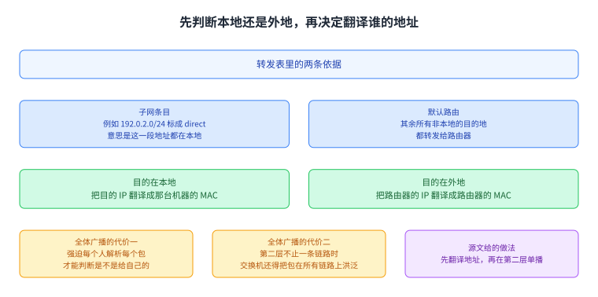
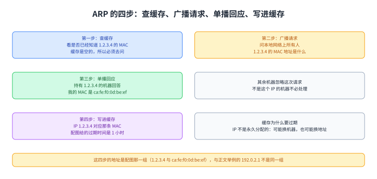
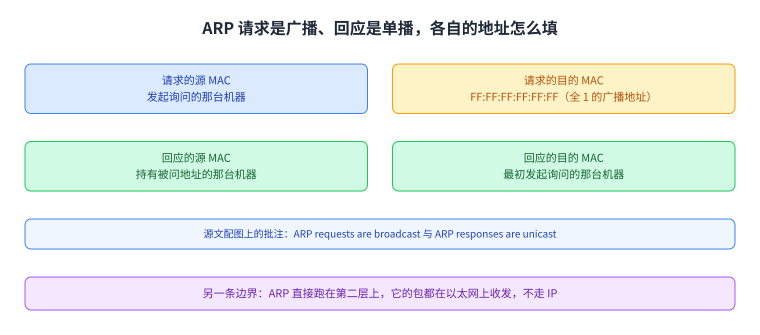
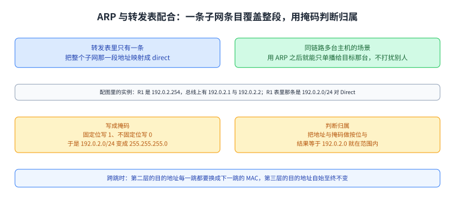
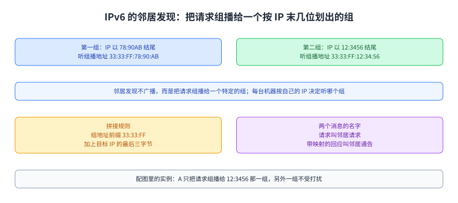

+++
title = "ARP：把第三层的地址落到第二层"
lecture = 31
slug = "arp"
status = "draft"
source_kind = "textbook"
source_url = "https://textbook.cs168.io/end-to-end/arp.html"
source_title = "ARP: Connecting Layers 2 and 3"
output_mode = "explanation"
+++

> 来源课程：UC Berkeley CS168 Computer Networks（教材 CS 168 Textbook）；
> 对应内容：End-to-End 之 ARP: Connecting Layers 2 and 3（<https://textbook.cs168.io/end-to-end/arp.html>）；
> 上游许可：教材站在站根页声明 CC BY-SA 4.0（第二人复核见 `docs/audit/license-cs168-second-review.md`）；
> 本文由 CourseLingo 原创撰写：**按该节的推进顺序**重新讲解，关键句给出英文原文与中译，**不逐句全译**，配图全部自绘、不转载原图；
> 本文非官方材料，CourseLingo 与 UC Berkeley 及课程教学团队无隶属关系；如与原文有出入，以原文为准。

## 一、这一讲要解决什么问题

源文从我们画过很多次的那张封装图讲起：包往下走一层，就被多包一层头部。要发一个 IP 包，先在第一层把目的 IP 填好；然后把包交给第二层，而第二层要求填一个 MAC 地址才能把包送出去。源文紧接着问了一句：

> To send an IP packet, we first fill in its destination IP at Layer 3. Then, we pass that packet down to Layer 2, where we have to add a MAC address to send the packet along the link.

中译：要发一个 [[term:packet]]，先在第三层把目的 IP 填好，再把包交给第二层，而第二层要求我们填一个 MAC 地址才能把包送出去，也就是要加一个 [[term:header]]；源文接着问的就是该填哪一个。这个问题的难处不在「填什么值」，而在**两套地址空间互不相干**：第三层拿的是 [[term:ip-address]]，第二层要的是[[term:mac-address]]，两者之间没有任何可以算出来的关系。源文配图 5-041 就把这个空位画了出来：帧里源 MAC 写着 My MAC，目的 MAC 是三个问号，下面源 IP 与目的 IP 都填好了，图上批注问的就是这个空位该填什么

这一讲要补的就是这个动作。它属于第二层与第三层的接缝，也接在上一讲后面：第 29 讲把一条[[term:link]]链路怎么被多台机器共用讲完，第 30 讲用生成树把多段链路的成环问题解决掉，而这一讲让第三层的分组能在那条无环的链路网上真正被送出去。

图里左边是封装后帧里各个字段的样子，目的 MAC 那个格子是空的；右边是两套地址各自的来路。看这一页时可以把它当成「这一讲要填哪一格」。

## 二、先判断是本地还是外地

填之前要先分清对象。源文说，发送方要先判断目的 IP 是自己这个局域网里的人，还是别的局域网里的人。判断的依据在发送方的转发表里：表里有一条描述本地地址范围的条目，源文把它叫作子网；例如一条写着 `192.0.2.0/24` 是 direct 的条目，意思是从 192.0.2.0 到 192.0.2.255 这些地址都在同一个局域网里。表里还有一条默认路由，说的是其余所有非本地的目的地都转发给路由器。

分清之后，要翻译的东西也就定了。如果目的 IP 在自己的子网里，我们要把目的 IP 翻译成那台机器对应的 MAC 地址；如果目的不在自己的子网里，我们要把路由器的 IP 翻译成它的 MAC 地址，这样才能把包交给路由器。

那能不能干脆每个包都广播出去，反正目的机器或者路由器一定会收到并处理它。源文说这很低效，并给了两条理由：它强迫每个人都解析每个包（例如去读第三层头部）才能判断这个包是不是给自己的；而且如果第二层网络不止一条链路，第二层的[[term:switch]]还得把这个包在所有链路上[[term:broadcast]]洪泛。所以更好的做法是先把地址翻译出来，然后在第二层[[term:unicast]]单播给那台机器或那台路由器。

图里上面是转发表里的两条依据：一条子网条目说明哪些地址在本地，一条默认路由说明其余的都交给路由器。中间两格是两种情形各自要翻译的对象，下面两格是「全体广播」的两条代价与源文给的做法。

## 三、ARP 的四步

源文给这个翻译[[term:protocol]]的名字与定义：

> ARP (Address Resolution Protocol) allows machines to translate an IP address into its corresponding MAC address.

中译：ARP（地址解析协议）让机器把一个 IP 地址翻译成它对应的 MAC 地址。请求的形态是广播一条消息，源文举的原话是「我的 MAC 地址是 f8:ff:c2:2b:36:16，IP 是 192.0.2.1 的那台机器的 MAC 地址是什么」。所有不是这个 IP 的机器都忽略这条消息；而持有这个 IP 的机器会单播一条回应给发送方的 MAC，说「我是 192.0.2.1，我的 MAC 地址是 a2:ff:28:02:f2:10」。源文还补了一条：机器也可以不等人问，就主动把自己的 IP 与 MAC 的对应关系广播给大家。

收到一条 IP 与 MAC 的对应关系之后，可以把它记进自己的**ARP 表**，把这种映射缓存下来备用。源文说这张表还给每一条记录带上过期时间，理由是 IP 地址并不是永久分配给某台机器的：同一个 IP 可能被分给另一台机器，同一台机器也可能换掉 IP。

源文在这一节里留了四个只有标签、没有正文的小标题，也就是 Step 1 到 Step 4；这四步的内容只出现在配图里。图上走的例子与正文的例子不是同一组地址：四步用的是 IP `1.2.3.4` 与 MAC `ca:fe:f0:0d:be:ef`，而正文那两句用的是 `192.0.2.1` 与 `f8:ff:c2:2b:36:16`、`a2:ff:28:02:f2:10`。我们按来源分开写，不把它们并成一组。四步的内容是：先查自己的缓存看是否已经知道 1.2.3.4 的 MAC，缓存是空的所以要问；然后问本地网络上所有人「1.2.3.4 的 MAC 地址是什么」；接着持有 1.2.3.4 的那台机器回应「我的 IP 是 1.2.3.4，我的 MAC 地址是 ca:fe:f0:0d:be:ef」，其余机器忽略这次请求；最后把这条映射写进缓存，图上给的过期时间是 1 小时。

源文这一节还有一处没写完的标记，原文写的是 `(TODO: interfaces?)`，我们在溯源里照录这是教材自己在 ARP 表那一段留下的待办，我们照实说明它空缺，不代教材补内容。

最后一句是这一节的关键边界：ARP 直接跑在第二层上，所以它的包都是在以太网（Ethernet）（Ethernet）上收发，而不是走 IP。

图里四格按源文配图的顺序走完四步，每格标出上一步留下的状态；最后一格给出缓存里的三条内容（IP、MAC 与过期时间）。四步用的地址是配图那一组，与下一张图里的地址填法对应。

图里上面是请求：源 MAC 是发起方，目的 MAC 是全 1 的广播地址；下面是回应：源 MAC 是回答方，目的 MAC 是发起方。源文配图上的批注就是 ARP requests are broadcast 与 ARP responses are unicast。

## 四、ARP 与转发表怎么配合

源文接着把 ARP 与转发表的关系讲清楚。此前我们说转发表里有时会出现一条「某台主机直连在这台路由器上」的条目；源文说现实里路由器的转发表只有一条条目，把整个子网那一段地址映射成 direct。如果路由器收到一个目的地址落在这段本地范围里的包，它就运行 ARP 找到对应的 MAC 地址，然后用第二层把包送到链路上正确的那台主机。

这样处理还有一个好处，正好解决同一链路有多台主机的场景。在我们画的概念图里，我们会说「主机 A 直连在 1 号端口上」；但一条链路上可能挂着多台主机，用 ARP 之后我们就能造出一个只单播给主机 A、而不打扰链路上其它机器的第二层包。源文配图 5-047 画的正是这件事：路由器 R1 的地址是 192.0.2.254，同一根总线上有 192.0.2.1 与 192.0.2.2 两台主机，而 [[term:router]]R1 表里那条实际条目是 `192.0.2.0/24`，下一跳写 Direct。

接下来是这段里唯一需要动笔算的地方。已知一条把 `192.0.2.0/24` 标成 direct 的转发条目，怎么判断某个 IP 地址是否落在这段范围里。源文说这时用**网络掩码**写范围比斜杠写法更好用：把固定的位全写成 1、不固定的位全写成 0，就得到 `255.255.255.0`，于是这段范围被写成 192.0.2.0 配掩码 255.255.255.0。判断的办法是把这个地址与掩码做**按位与**：它会把所有不固定的低位清零，只留下固定的高位；然后看结果是否等于 192.0.2.0，也就是这段范围里不固定位全为 0 的那个首地址。

这一节最后一句把跨跳时变与不变分开：

> Note that as packets get forwarded across hops, the Layer 2 destination will change to the MAC address of the next hop, so that packets can travel across links. However, the Layer 3 destination stays the same across each hop.

中译：包被逐跳转发时，第二层的目的地址会变成下一跳的 MAC 地址，这样包才能走过一段段链路；而第三层的目的地址在每一跳都保持不变。

图里上面是一条子网条目覆盖整段地址、以及它带来的好处（同一链路上多台主机也能只单播给目标）；中间是掩码与按位与的算法；下面一格把跨跳时「第二层目的会变、第三层目的不变」并排放出来。

## 五、IPv6 怎么办：邻居发现

源文最后一节交代另一套地址空间怎么办：ARP 翻译的是 IPv4 地址到 MAC 地址，要翻译 IPv6 地址到 MAC 地址，用的是一套类似的协议，叫邻居发现。

两者的区别在请求怎么发出去。源文说，邻居发现不再广播这个翻译请求，而是把它组播给一个特定的组，每台机器根据自己 IP 地址来听某一个组。它给的例子是：凡是 IP 地址以 12:3456 结尾的机器，可能都在听组 MAC 地址 `33:33:FF:12:34:56`；凡是 IP 地址以 78:90AB 结尾的，可能都在听组 MAC 地址 `33:33:FF:78:90:AB`。源文配图 5-049 把两组机器并排画了出来：左边一组是 IP 以 78:90AB 结尾的三台（2001:0DB8::1078:90AB、2001:0DB8::0478:90AB、2001:0DB8::2A78:90AB），右边一组是以 12:3456 结尾的三台（2001:0DB8::9212:3456、2001:0DB8::7512:3456、2001:0DB8::8312:3456），而 A 只把请求组播给右边那一组。

于是做法就是拼地址：我要找 IPv6 地址以 12:3456 结尾那台机器的 MAC，就把那几个比特填进组地址里，得到 `33:33:FF:12:34:56`，而我知道持有那个 IP 的机器一定在听这个组地址。源文最后给了这两个消息的名字：请求叫邻居请求，带映射的回应叫邻居通告。

图里上面两组是「按 IP 末尾几位分组、各组听哪个组播地址」，下面是拼接规则（组地址前缀 33:33:FF 加上目标 IP 的最后三字节）与两个消息的名字。这一节把这一讲的翻译动作从 IPv4 扩到 IPv6。

## 读完应该能回答

1. 为什么第二层要填的那个 MAC 地址不能从目的 IP 算出来，而必须先判断本地还是外地？
2. 为什么「每个包都广播」是不可取的，源文给的两条理由各是什么？
3. ARP 的四步各做什么，请求与回应的目的 MAC 各填什么，表项为什么要带过期时间？
4. `192.0.2.0/24` 这条条目怎么写成掩码，判断一个地址是否在范围内那一步做的是什么运算。

## 脉络回顾

这一讲是「两层接缝」那一讲。前面三讲连成一条线：第 29 讲把一根线怎么被多台机器共用讲完，留下的尾巴是第二层自己也能转发、甚至能跑二层路由；第 30 讲接着那条尾巴，用生成树把多段链路组成的第二层网络收拾成一棵没有环的树；而这一讲补的是最后一块拼图——第三层已经有一个目的 IP，第二层却要一个 MAC 地址，而这两套地址空间互不相干，中间缺一个「问出来」的动作，这个动作就是 ARP。

最要紧的转折在这一讲的第二节：源文没有直接给答案，而是先插了一步判断「目的在本地还是外地」。这一步决定了要翻译的是目的主机的地址还是路由器的地址，也决定了包在第二层上是单播给主机还是单播给路由器。而这一讲反复强调的边界是 ARP 跑在第二层上、不走 IP，所以它虽然为第三层服务，本身却是一个第二层的协议。

后面几讲接着处理端到端的那条链路：第 32 讲的 DHCP 管一台主机刚接入时怎么拿到 IP 地址（也就是 ARP 之前的那一步），第 33 讲的 NAT 要在转发路径上改写地址，第 34 讲的 TLS 跑到传输层之上。这一讲的问答格式由 [[term:rfc]] 826 规定，想自己看一眼可以在链路上抓包，Wireshark 会把 ARP 的请求与回应直接解出来。而这一讲留下的一个接口值得记住：跨跳时第二层的目的地址每一跳都要换，第三层的目的地址自始至终不变；后面讲 NAT 时，被改写的那一层正好就是这里说不变的那一层。

## 溯源

- **字段核对**：`docs/lecture-manifest.md` 第 31 行为 `arp` / `ARP: Connecting Layers 2 and 3` / `/end-to-end/arp.html`；抓页时 `<title>` 与 H1 都是 `ARP: Connecting Layers 2 and 3`。两处一致。
- **源文件与范围**：该页 HTML 共 27,733 字节（前三次 `000`、第四次 200，按 `000 ≠ 404` 重试），正文锚点 `#main-content`，实测 4 个二级小节（Connecting Layers 2 and 3 / ARP: Address Resolution Protocol / Connecting ARP and Forwarding Tables / Neighbor Discovery in IPv6），`TODO` 标记实测 1 处（ARP 表那一段里的 `(TODO: interfaces?)`），另有四个只有标签没有正文的小标题（Step 1 到 Step 4）。
- **9 张配图逐张看过**：`5-041-arp-blank-mac`（帧里目的 MAC 是三个问号，批注 What goes here?）、`5-042-arp1`（Alice 的缓存表：IP／MAC／TTL 三列且为空，查 1.2.3.4 未果）、`5-043-arp2`（Alice 向本地网络上所有人广播询问 1.2.3.4 的 MAC）、`5-044-arp3`（Bob 单播回应「我的 IP 是 1.2.3.4，我的 MAC 是 ca:fe:f0:0d:be:ef」，其余人忽略）、`5-045-arp4`（缓存里写上 1.2.3.4 与那条 MAC，TTL 是 1 hr）、`5-046-arp5`（请求是广播、目的 MAC 全 1；回应是单播、目的 MAC 是发起方）、`5-047-direct-route`（R1 是 192.0.2.254，总线上有 192.0.2.1 与 192.0.2.2，R1 表里那条实际条目是 192.0.2.0/24 对 Direct）、`5-048-arp-filled-in-mac`（同一个空位被填上：目的 MAC 等于本地目的主机或路由器的 MAC，批注 Learned from ARP）、`5-049-neighbor-discovery`（两组 IPv6 机器各自听 33:33:FF:78:90:AB 与 33:33:FF:12:34:56，A 只组播给后者那一组）。
- **照录与存疑（源文自身三处，本页照录并就地说明）**：其一，ARP 表那一段留着一个未完成的标记 `(TODO: interfaces?)`，本页照实说明它空缺、不代补。其二，正文与配图用的是两组不同的示例地址：正文写 `192.0.2.1`、`f8:ff:c2:2b:36:16`、`a2:ff:28:02:f2:10`，四步配图写 `1.2.3.4` 与 `ca:fe:f0:0d:be:ef`（配图里的 TTL 是 1 hr）；本页分开写，没有把它们并成一组。其三，正文写的是 `soliciation`（拼写少了一个 t），而同一页配图 5-046 上写的是正确的 `solicitations`；本页在正文里用中文「请求」并说明配图那一处写法。
- **跨讲的同一件事（主动标明）**：正文举例用的 MAC `f8:ff:c2:2b:36:16` 与第 29 讲那一页里的例子是同一个地址；另外按第 29 讲讲过的判据（分给机器的地址第一位是 0），本页三处示例地址 `f8`、`a2`、`ca` 的第一个字节最低位都是 0，与「单机地址」相符——这一层的读法（第一位指第一字节的最低有效位）是本页补的说明，源文没有指明是哪一位。
- **我们补的（源文没有写）**：把 4 个小节归并成本页六节；「第 29 讲留下转发那条尾巴、第 30 讲收拾成无环的树、本讲补上两套地址之间的翻译」这条与仓内编号的对应；把四步配图的内容写进正文（源文只留了四个空标签）；「判断本地还是外地这一步决定了翻译谁」这句总结；以及「第一个字节最低位」那处读法说明；脉络回顾末尾那句观察建议（RFC 826 与 Wireshark）也是本页补的，源文没有点名任何标准文档或工具。
- **术语取舍**：本讲没有新增词条。本讲涉及的 `ip-address`／`mac-address`／`packet`／`header`／`switch`／`router`／`broadcast`／`unicast`／`multicast`／`forwarding`／`Ethernet` 在更早各页都已登记或出现过，登记新词会给那些页面添漂移警告；本讲专有的 `ARP` 与 `neighbor discovery` 在更早各页均未出现，本可登记，但两者都在本页一次讲完，为不给后续页面留约束，只在正文用中文与括注交代。若你要登记，我可以补。
