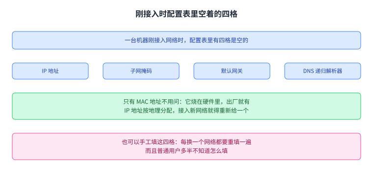
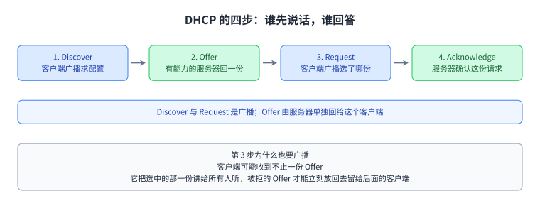
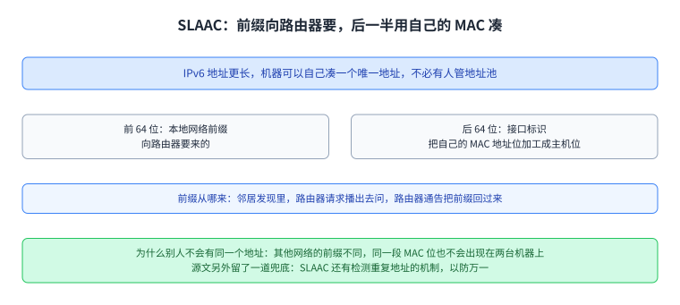

+++
title = "DHCP：一台刚接入的机器怎么拿到自己的地址"
lecture = 32
slug = "dhcp"
status = "draft"
source_kind = "textbook"
source_url = "https://textbook.cs168.io/end-to-end/dhcp.html"
source_title = "DHCP: Joining Networks"
output_mode = "explanation"
+++

> 来源课程：UC Berkeley CS168 Computer Networks（教材 CS 168 Textbook）；
> 对应内容：End-to-End 之 DHCP: Joining Networks（<https://textbook.cs168.io/end-to-end/dhcp.html>）；
> 上游许可：教材站在站根页声明 CC BY-SA 4.0（第二人复核见 `docs/audit/license-cs168-second-review.md`）；
> 本文由 CourseLingo 原创撰写：**按该节的推进顺序**重新讲解，关键句给出英文原文与中译，**不逐句全译**，配图全部自绘、不转载原图；
> 本文非官方材料，CourseLingo 与 UC Berkeley 及课程教学团队无隶属关系；如与原文有出入，以原文为准。

## 一、这一讲要解决什么：接入时缺的那几样东西

第 29 讲解决的是「一根线怎么被多台机器共用」，第 30 讲把一根线换成一张链路网并让结果不带环，第 31 讲把第三层的地址落到第二层。这三讲都默认机器已经能发包了。这一讲换一个起点：一台机器刚刚接进来，它手里有什么、缺什么。源文第一句就是这个起点：

> When a computer first joins the network, what information does it need to connect to the Internet?
>
> 中译：一台计算机第一次接入网络时，需要哪些信息才能连上 [[term:internet]]。

源文把已经有的那一样排在最前面，也说明了它为什么不用问：

> We always know our own MAC address, because it’s burned into the hardware.
>
> 中译：我们总是知道自己的 [[term:mac-address]]，因为它烧在硬件里。

剩下四样都得向网络上的别人要。第一样是本机地址，源文给的理由是地址按地理分配：

> We need to be allocated an IP address so we can send and receive packets.
>
> 中译：我们需要被分配一个 [[term:ip-address]]，这样才收发包。地址按地理分配，所以接入一个新网络时，得有人把这个地址给你。

第二样是[[term:subnet-mask]]。源文说有了它才知道本地地址的范围：固定位全 1、非固定位全 0，把掩码与本机地址按位与，就得到本地网络前缀。第三样是本地那台 [[term:router]] 是谁，因为目的地址不在本地的包都要先交给它：

> Sometimes we call this router the default gateway.
>
> 中译：我们有时把本地网络上的这台 [[term:router]] 叫做 [[term:default-gateway]]。

第四样是这一网络上 [[term:recursive-resolver]] 在哪。源文用的是 might，也就是说这一项不是每个网络都非得问。

手工填这四格也能用。源文说它费时间，而且每换一个网络都要重配一遍；普通用户多半不知道怎么配。它同时留了一句公道话：路由器这类不常移动的机器，手工配置有时确实可行。于是这一讲要的东西就是一个协议：

> We need an protocol that allows new hosts to automatically learn these values (and possibly other useful information).
>
> 中译：我们需要一个协议，让新主机自动学会这些值（以及可能还有别的有用信息）。

引文照录，包括原文里 `an protocol` 这处笔误（应为 `a protocol`）。这是措辞上的小错，不影响意思，本页不改引文，只在这里说明。

已经有的那一样与要问的那四样，可以收成一张图：

图里第一行说配置表里有四格是空的，第二行是这四格，第三行点出只有 MAC 地址不用问，最后一行是手工填这四格的代价。源文那句「需要一个让新主机自动学会这些值的协议」，指向的就是下一节的 DHCP。

## 二、DHCP 的四步

源文的第二节把这件事定成一个四步握手，每一步都写了方向。第一步是客户端先喊：

> The new client broadcasts a Discover message, asking for configuration information.
>
> 中译：新客户端广播一个 Discover 消息，问配置信息。

第二步是服务器回：

> Any DHCP server who can help will unicast an Offer to the client, with a configuration that the client can use (e.g. IP address, gateway address, DNS address).
>
> 中译：任何能帮忙的 [[term:dhcp-server]] 会向这个客户端单播一份 Offer，里面是它可以用的配置，比如地址、网关地址、DNS 地址。

第三步是客户端挑一份，再把结果广播出去，而源文把「为什么也要广播」写得很具体：

> This message is broadcast because the client might get multiple offers. By telling everybody which offer it’s accepting, the client allows the rejected offers to be freed up for future clients.
>
> 中译：这条消息之所以广播，是因为客户端可能拿到不止一份 Offer；它把选中的那一份讲给所有人听，被拒的那些 Offer 就能立刻放回去留给后面的客户端。

第四步是收尾：

> The server sends an acknowledgement to confirm that the request was granted.
>
> 中译：服务器发一个确认，表示这份请求已经准了。

四步走完，这台机器手里就有了地址、掩码、网关与解析器。这里有一处方向上的差别值得记住：第一步与第三步是 [[term:broadcast]]，中间那一步是 [[term:unicast]]；这个差别是后面两节的入口。

图里四格按箭头从左到右就是这四步，下面两行分别交代广播与单播的分工，以及第 3 步为什么也要广播。源文没有给这四步起缩写名字，本页也只用它原来的四个词。

## 三、谁在提供配置：服务器、中继与固定端口

源文第三节回答的是第二步里「谁能来提供配置」。答案是专门加进网络里的 DHCP 服务器，它给了一个从小到大的例子：小网络里通常是家用路由器兼任，大网络里可以有一台单独的机器。而服务器的位置有一个硬约束：

> DHCP servers need to be in the same local network as the client, since the protocol operates inside the local network.
>
> 中译：DHCP 服务器必须和客户端在同一个本地网络里，因为这个协议就在本地网络内部跑。

这句话有一个直接的工程后果。大网络里我们并不想在每一台路由器里都塞一份服务器代码，所以源文给的做法是让本地路由器把请求中继给远端那台真正跑协议的中心服务器。源文先说服务器必须待在同一个本地网络里，紧接着又给出中继这条出路；把两句并排看，硬约束落在「局域网上要有一个能中继的实体」上，而真正跑协议的那台机器可以远在别处。

服务器靠一个固定的端口被找到：

> DHCP servers listen on a fixed port, UDP port 67, for requests from new machines.
>
> 中译：DHCP 服务器在一个固定端口上听新机器的请求，也就是 UDP 的 67 号端口。

67 落在 0 到 1023 这一段，按端口号的通行划分就是约定端口那一段，[[term:well-known-port]] 这个说法指的就是它。客户端不用先问「服务器在哪」，因为它要去的那个 [[term:port-number]] 是事先约好的。

服务器手里有三样：它知道网关与 DNS 服务器在哪，而且有一池可用的地址，可以分给新用户。第二节给的 Offer 例子只举了三个值（地址、网关地址、DNS 地址），而第一节列的是四格，多一格掩码；那处例子用的是 e.g.，所以它不是清单的全部，而掩码在图 5-053 上是跟着地址一起给的，写成 `/24`。

图里上排两格是两种规模下服务器是谁，中间两行说明同网段那条约束与中继这条出路，最下面一行是服务器手里的三样东西与它监听的那个端口。这三样恰好对上前一节那四格里的三格，剩下那一格是掩码，它跟着地址一起给。池子里的地址是有租期的，这就是下一节要展开的部分。

## 四、地址是借来的：租约、续租与回收

源文第三节末尾给出的是这台服务器与客户端之间那份关系的性质：

> Note that IP addresses are only temporarily leased to hosts. The lease is only valid for a limited amount of time (e.g. order of hours or days).
>
> 中译：地址只是临时租给主机的；租约的有效期有限，比如几小时到几天这个量级。

想接着用就得续租，没续上就回收。而服务器一侧还有一条约束：

> If an IP address is currently leased to a host, the DHCP server cannot offer the same address to other clients.
>
> 中译：如果一个地址已经租给某台主机，DHCP 服务器就不能把同一个地址再许给别的客户端。

把这条约束与第二节那句「被拒的 Offer 立刻放回去留给后面的客户端」放在一起看，能看出一层因果：地址是有主的，同一时刻不能许给两个人；也正因为这样，客户端在第 3 步广播说「我选了哪一份」才不只是礼貌，它让没被选中的服务器立刻把那一份收回池子。源文没有把这两句连起来，这条因果是并排读出来的。

图里第一行点出租约有时限，中间三格是租约的三件事，最后一行是没续上之后会发生什么。这三件事合起来，也就解释了为什么第 3 步那一次广播是值得的。

## 五、连自己的地址都还没有，包怎么发得出去

源文第四节先给出一句把这一讲接回分层的话：

> Note that DHCP is a Layer 7 application protocol, and it runs on top of UDP, which itself runs on top of IP.
>
> 中译：DHCP 是一个应用层的 [[term:protocol]]，它跑在 UDP 之上，UDP 又跑在 IP 之上。

按第 2 讲那条分层线，这句话说的是：DHCP 这一层只管「要一份配置」这件事，往下交给 [[term:transport-layer]]，再往下交给 [[term:network-layer]]，一直落到 [[term:link-layer]]。协议就是这样一层层 [[term:encapsulation]] 出来的，而 [[term:layering]] 的好处在这一讲有一个特别清楚的例子：「广播」在每一层有自己的说法。

第一句说法在网络层。源文问的是第一步怎么在 IP 上广播：

> It sends a packet with destination IP of 255.255.255.255 (all ones), which is the IPv4 broadcast address.
>
> 中译：它发出一个目的地址是 255.255.255.255（全 1）的 [[term:packet]]，这就是 IPv4 的广播地址。

第二句说法在链路层，而这一步正好是第 31 讲 ARP 留下的接口：

> When this packet is passed down to Layer 2, instead of translating this IP address using ARP, the IPv4 broadcast address is mapped to the Ethernet broadcast address of FF:FF:FF:FF:FF:FF (all ones).
>
> 中译：这个包被送到第二层时，并不用 ARP 去翻译这个地址，而是把 IPv4 广播地址直接映射到以太网的广播地址 FF:FF:FF:FF:FF:FF（全 1）。

这里能跳过 ARP，原因在第 31 讲：问「谁拥有某个地址」这一步本来就要广播一次请求，而这里的目的写的是「所有人」，没有单独一个地址需要先问出来，直接映射过去就够了。源文没有展开这层理由，本页把它补在这里。

第三句说法在客户端自己身上。至于源地址，客户端此刻并没有：

> The client doesn’t have one at the start of the protocol, so it sets the source IP to be 0.0.0.0.
>
> 中译：客户端在协议开始时还没有地址，所以它把源地址填成 0.0.0.0。原文在这一句前面还问了一句源地址怎么办，本页的中译把它写成陈述句。

于是这个包在两层上的地址都是写死的：

> With the hard-coded source IP of 0.0.0.0 and destination IP of 255.255.255.255, the client doesn’t need to know anything about the local network to start running this protocol.
>
> 中译：源地址写死成 0.0.0.0、目的地址写死成 255.255.255.255 之后，客户端不需要知道本地网络的任何事，就能把这套协议跑起来。

源文配的图 5-054 把这个包在各层拼出来的[[term:header]]摆成一条竖列。这个包落到[[term:ethernet-frame]]里时，源 MAC 写本机 MAC，注的是「服务器可以照这个 MAC 地址把回答单播回来」；目的 MAC 写 FF:FF:FF:FF:FF:FF；源地址 0.0.0.0；目的地址 255.255.255.255；源端口是一个随机端口，图上给的例子是 50239，也就是一个 [[term:ephemeral-port]]；目的端口是 67；载荷是 Discover 本身。

图里六行是那六个字段与各自的写法，最下面一行是结论：源地址与目的地址都写死，所以客户端不需要知道本地网络的任何事。这一句是整讲的支点，下一节要处理的正是它留下的一个问题。

## 六、服务器把 Offer 送回哪里

第 2 步把 Offer 写成单播，而上一节刚说明客户端此刻没有源地址。源文在第四节回过头来自己处理这个前提：客户端在协议开始时没有源地址，所以单播得靠别的东西。

> The DHCP servers could either broadcast the offers, or use the client’s MAC address to unicast the offers.
>
> 中译：DHCP 服务器要么把 Offer 广播出去，要么用客户端的 MAC 地址把 Offer 单播回去。

两条路各有一份代价，源文没有评。广播的话，局域网里每台机器都会收到一份 Offer，虽然只有那一台会认领；照 MAC 单播的话，服务器手里必须有那个 MAC，而它确实有，因为 Discover 是从这台机器的网卡发出去的，源 MAC 就在包里。图 5-054 上那句注释说的正是这条路：「服务器可以照这个 MAC 地址把回答单播回来」。

于是源文两处的措辞可以对齐起来读：第 2 节说的是结果，也就是只回给这一台；第 4 节补的是做法，也就是广播或者照 MAC 单播。两句并不互相打脸，它们的关系是「结论」与「前提」；而能不能单播，取决于服务器手里有没有那个可用的目的 MAC。

图里第一行点出客户端没有源地址这个前提，中间两格是源文给的两种回法，最下面一行把第 2 节与第 4 节那两处措辞的关系写清楚。

## 七、IPv6 走了另一条路：SLAAC

源文最后一节讲 IPv6。DHCP 在 IPv6 里也存在，但地址更长，于是多出一种做法：

> However, because IPv6 addresses are longer, it turns out that we can give ourselves a guaranteed unique IPv6 address without anybody else managing a pool of addresses and leasing them.
>
> 中译：不过，因为 IPv6 地址更长，我们可以自己给自己一个保证唯一的 IPv6 地址，不需要有人管着一个地址池再往外租。

这个协议叫 Stateless Address Autoconfiguration，简称 SLAAC。做法是把地址拆成两半：前 64 位是本地网络前缀，向路由器要；后 64 位是接口标识，用机器自己的 MAC 地址凑：

> Then, we copy our own MAC address bits into the host bits of the IPv6 address.
>
> 中译：然后，我们把自己的 MAC 地址位抄进 IPv6 地址的主机位里。

这里正文与配图合起来才完整。正文写的是「把 MAC 地址位抄进主机位」，而源文的图 5-055 多了一句：中间要跑一个小算法，比如补几个填充位，才能从 MAC 得到主机位。MAC 是 48 位，主机位是 64 位，两者差 16 位，图上说的填充补的就是这 16 位。

前缀这一项，源文借的是第 31 讲那个协议的 IPv6 版本：

> To get the local network information, we can extend the Neighbor Discovery protocol (IPv6 version of ARP). The Router Solicitation message lets the user broadcast a request for the local network information, and the Router Advertisement message lets routers reply with that information.
>
> 中译：为了拿到本地网络的信息，我们可以扩展邻居发现协议（IPv6 版的 ARP）：路由器请求消息让用户广播出去问一次，路由器通告消息让路由器把这些信息回过来。

这也是说 SLAAC「无状态」的意思所在：地址是每台机器自己凑出来的，要向路由器问的只有前缀这一项，没有任何一台机器在维护「这个地址归谁、租到什么时候」这种状态。源文还留了一道兜底：

> SLAAC has additional mechanisms to detect duplicate addresses, just in case.
>
> 中译：SLAAC 另有检测重复地址的机制，以防万一。

这句与前一句「保证唯一」并排放着，读起来像是一对。按本页的理解，前一句是设计上推出来的唯一性，因为别人的前缀不同，同一段 MAC 位也不会出现在两台机器上；后一句是工程上留的兜底，配置出错或者 MAC 被改写这类情况仍然要能发现。两句并不冲突。

图里第一行说为什么要多出这一条路，中间两格是地址的两半，第三行是前缀怎么来，最下面一行给唯一性的理由与那道兜底。

## 读完应该能回答

1. 一台机器刚接入时，MAC 地址为什么不用问，而剩下那四样为什么不能像它一样出厂就定死？
2. 四步里哪两步是广播、哪一步是单播，而第 3 步那一次广播具体替后面的客户端省了什么事？
3. 客户端连自己的地址都还没有，它靠两个写死的字段把 Discover 发出去，而服务器又是靠什么把 Offer 送回来的？

## 脉络回顾

这一讲接在第 31 讲后面，而两者的起点正好对称。第 29 讲解决的是「一根线怎么被多台机器共用」，它的落点是共享介质上同一时刻只能有一个信号，于是有了听、边听边发与退避；第 30 讲把一根线换成一张链路网，落点是不带环，因为第二层的帧里没有可以减一的计数器；第 31 讲的 ARP 把第三层的地址对到第二层的地址上，而它成立的前提是「你已经知道自己的地址」。这一讲问的正是那个前提：刚接进来的时候，地址从哪里来。按仓内清单，这一段四讲的次序是 #29 一条链路的共用、#30 一张链路网的无环、#31 第三层地址落到第二层、#32 新机器怎么拿到第三层地址。

最要紧的转折在这一讲第五节。前面四节讲的是一套很正常的客户端与服务器交互，看起来毫无问题；到第五节才发现，这套协议的第一次发言必须由一个「连自己地址都没有」的客户端发出去。源文的处理很干脆：给源地址与目的地址各写死一个值，0.0.0.0 与 255.255.255.255，再让第二层直接映射到以太网广播地址。这个转折决定了整讲的形状：DHCP 之所以在第 1 步与第 3 步用广播、第 2 步与第 4 步才谈得上单播，全都来自这个写死的起点；而第六节处理的那处措辞关系，也是从这个起点长出来的。

后面哪里用到它。按仓内清单，第 33 讲的 NAT 要在转发路径上改写地址，而它面对的正是这一讲分出来的「这个地址是谁的、还能用多久」；第 34 讲的 TLS 与第 35 讲的端到端连通性会把这一整段串起来。想自己观察这套协议，家用路由器与 Linux 主机上都有现成的 DHCP 客户端；抓包时能直接看到那四步的顺序与方向，Wireshark 里它们就是四个单独的报文。

## 溯源

- **字段核对与源文件范围**：`docs/lecture-manifest.md` 里编号 32 的那一行（文件第 57 行）为 `dhcp` / `DHCP: Joining Networks` / `/end-to-end/dhcp.html`；抓页时 `<title>` 是 `DHCP: Joining Networks | CS 168 Textbook`，H1 是 `DHCP: Joining Networks`。三处一致。该页 HTML 共 27,397 字节（首次即 200，没有遇到 `http=000`），正文锚点 `#main-content`，实测 5 个二级小节（Joining Networks / DHCP: Dynamic Host Configuration Protocol / DHCP Servers / DHCP Implementation / Autoconfiguration in IPv6），`TODO` 标记 0 处，全页也没有出现 `DORA` 这个缩写。
- **6 张配图逐张看过**：`5-050-dhcp1`（第 1 步：A 向 B、两台服务器与 C 广播，左侧配置表四格都是问号）、`5-051-dhcp2`（第 2 步：两台服务器各回一份 Offer）、`5-052-dhcp3`（第 3 步：客户端广播说自己选了 Server 1）、`5-053-dhcp4`（第 4 步：Server 1 回确认，配置表填成掩码 `/24`、网关 `192.168.86.254`、解析器 `8.8.8.8`、本机 `192.168.86.38`）、`5-054-dhcp-over-ip`（Discover 的六个字段，每一行各带一句注释）、`5-055-slaac`（IPv6 地址两半，网络 ID 64 位与主机 ID 64 位，MAC 48 位）。六张的文件名与内容都对得上，没有出现「文件名误导」那类情况。
- **自己算过的数**：`5-053` 的掩码 `/24` 表示前 24 位固定，`192.168.86.38` 与 `255.255.255.0` 按位与得到 `192.168.86.0`，网关 `192.168.86.254` 落在同一个 `/24` 里；解析器 `8.8.8.8` 算出来是 `8.8.8.0/24`，与前者不在同一个网段，正对应源文把「本地网络信息」与「解析器在哪」分成两件事来写。`5-055` 里 MAC 是 48 位、主机 ID 是 64 位，差 16 位，这正是图上那句「补几个填充位」要补的位数。UDP 67 落在 0 到 1023 这一段，这一段就是约定端口。
- **源文两处措辞的关系，以及配图比正文多的一句（预告 → 照录 → 说明）**：其一，第 2 节写 `Any DHCP server who can help will unicast an Offer to the client`，把 Offer 定为单播；第 4 节又写 `The DHCP servers could either broadcast the offers, or use the client’s MAC address to unicast the offers`。本页第六节按预告、照录、说明三步处理：先说第 2 步写成单播而客户端此刻没有源地址，再照录第 4 节那一句，最后说明两句是「结论」与「做法」的关系，不是互相打脸。源文没有把这层关系写出来，是并排读出来的。其二，源文正文写 `we copy our own MAC address bits into the host bits of the IPv6 address`，读起来像是直接把 MAC 位抄进主机位；而它配的图 `5-055-slaac` 多了一句 `Run some algorithm (e.g. add padding bits) to derive host ID bits.`，也就是中间还有一步加工。48 位与 64 位差 16 位，按图上那句「补几个填充位」正好补上。本页第七节照录正文、补上配图这一步，并说明两者合起来才完整。
- **核过但不是矛盾的，与一处笔误**：第 2 节给的 Offer 例子只举了三个值（`IP address, gateway address, DNS address`），而第 1 节列的是四样（多一样子网掩码）。那处例子写的是 `e.g.`，不是清单的全部；而图 `5-053` 上掩码是跟着地址一起给的（`/24`），所以两处可以并存。另外第 1 节写 `We need an protocol that allows new hosts to automatically learn these values`，其中 `an protocol` 应为 `a protocol`；本页在第一节照录原句并就地说明，不改引文。
- **我们补的（源文没有写）**：把 5 个小节归并成本页七节；把「接入时要问的四样与不用问的那一样」压成一张图；第 29 到第 32 讲这条线的逐讲对应；「跳过 ARP 是因为目的写的就是所有人」这层理由；租约与「被拒的 Offer 立刻放回池子」之间那条因果；67 落在 0 到 1023 的约定端口段；SLAAC 里「无状态」指的是没有机器在维护租约状态，以及「保证唯一」与「另设重复地址检测」那两句的读法；以及脉络回顾末尾那句可观察性建议（家用路由器与 Linux 上的 DHCP 客户端、Wireshark 里的四个报文），源文没有点名任何工具或系统。
- **术语取舍**：本讲新增三个词条，都是本页第一次引入的复合技术词：`subnet mask`、`default gateway`、`DHCP server`。加之前按 `validate.py` 的漂移判据把仓内 30 页扫了一遍（跳过「读完应该能回答 / 脉络回顾 / 溯源」三段，剥掉行内代码、链接目标与出处行，并把术语标记里的键本身也算作命中），三个词在别的页里都没有命中，所以不会把别人的页打红。本讲专有的 `DHCP`、`ARP`、`SLAAC`、`Neighbor Discovery`、`Router Solicitation`、`Router Advertisement` 一律不登记：`DHCP` 与 `ARP` 在第 29、31 讲的正文里出现过，登记会立刻给那两页添漂移警告；后四个属于第 31 讲的地盘（它有一节就叫 `Neighbor Discovery in IPv6`），本页正文只写中文名，英文名留在这条里。
