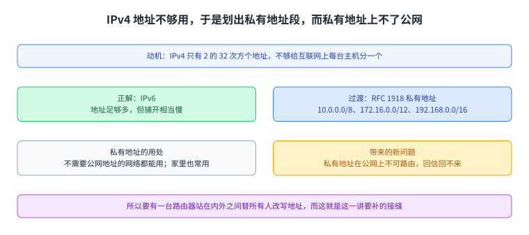
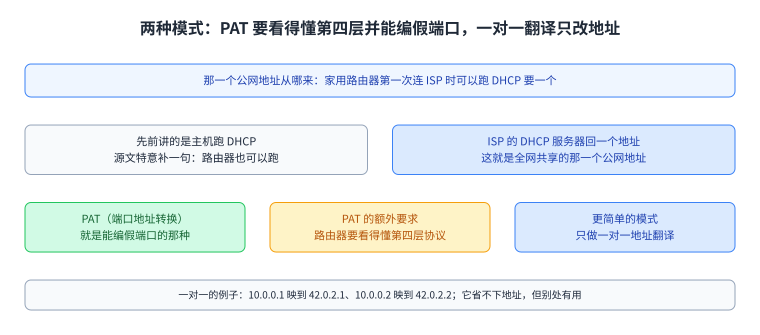
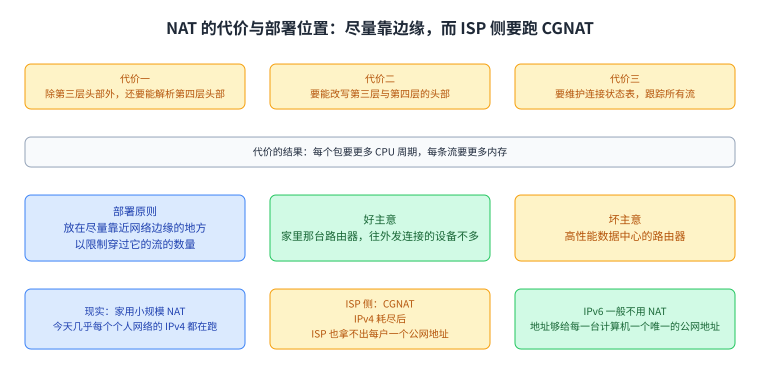
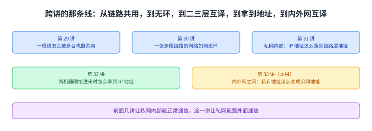

+++
title = "NAT：让很多台机器共用一个公网地址"
lecture = 33
slug = "nat"
status = "draft"
source_kind = "textbook"
source_url = "https://textbook.cs168.io/end-to-end/nat.html"
source_title = "NAT: Network Address Translation"
output_mode = "explanation"
+++

> 来源课程：UC Berkeley CS168 Computer Networks（教材 CS 168 Textbook）；
> 对应内容：End-to-End 之 NAT: Network Address Translation（<https://textbook.cs168.io/end-to-end/nat.html>）；
> 上游许可：教材站在站根页声明 CC BY-SA 4.0（第二人复核见 `docs/audit/license-cs168-second-review.md`）；
> 本文由 CourseLingo 原创撰写：**按该节的推进顺序**重新讲解，关键句给出英文原文与中译，**不逐句全译**，配图全部自绘、不转载原图；
> 本文非官方材料，CourseLingo 与 UC Berkeley 及课程教学团队无隶属关系；如与原文有出入，以原文为准。

## 一、这一讲要解决什么问题

源文开头就把账算清楚了：

> Recall that we only have \(2^{32}\) different IPv4 addresses, which is not enough to address every host on the Internet.

中译：我们只有 2 的 32 次方个 IPv4 地址，这不足以给互联网上每一台主机都分一个。源文说 IPv6 是这件事的正解，但它的铺开相当慢。在等它的过程中，IANA 划出了几段按 [[term:rfc]]RFC 1918 规定的[[term:ip-address]]私有地址，任何不需要公网地址的网络都可以用：`192.168.0.0/16`、`10.0.0.0/8` 与 `172.16.0.0/12`。源文说这些地址在你家里的网络里也常常在用，这样你自己的设备就不必占一个全球唯一的地址。

于是问题变成：私有地址在公网上不可路由，那你怎么还能上网。这一讲要补的就是这个接缝。它接在第 31 讲后面，两者都是地址翻译，只是层次不同：第 31 讲的 ARP 解决的是「私网内部，IP 地址怎么落到链路层地址」，而这一讲解决的是「私网地址怎么变成公网地址」。

图里上面是地址不够用这条动机与两句补救（IPv6 是正解但铺得慢；RFC 1918 划出三段私有地址），下面两格是私有地址的用处与它带来的新问题。看这一页时可以把它当成「为什么需要中间那一台改写地址的[[term:router]]路由器」。

## 二、NAT 的概念：一个公网地址代表很多台主机

源文给的定位很明确：

> In NAT, the goal is to use a single public IP address to represent many hosts in the local network. The trick is to have the gateway router convert private IP addresses into the single public address before sending out messages. Then, the router converts the public address back into a private address for incoming replies.

中译：NAT 的目标是用一个公网 IP 地址代表本地网络里的很多台主机；办法是让网关路由器在把消息发出去之前，把私有 IP 地址换成那一个公网地址，等回复进来时再把公网地址换回私有地址。

源文用一家轮胎店里的三个人把这个场景讲活：Alice、Bob 与 Chuck 各有私有地址 A、B、C，它们不能用在广域互联网上，因为不唯一；店里所有人共用一个公网地址，那是他们手里唯一全球唯一的、[[term:internet]]公网看得懂的地址。

接着是这一讲的核心动作。Alice 要给一台公网服务器 S 发消息，[[term:packet]]包上写的是「From: A, To: S」。源文说如果就这么发出去，S 没法回信，因为 A 是私有地址。所以包到了网关路由器时，路由器把[[term:header]]头部改写成「From: R1, To: S」，并且记一笔：如果收到来自 S 的回复，那要送给 A。S 收到的包是从 R1 来的，它回信写「From: S, To: R1」；网关路由器收到之后查自己那笔记录，把头部改写成「From: S, To: A」，再把包送给 A。

源文接着指出一个会出事的情形：如果 Alice 与 Bob 都想跟 S 说话，那么 S 的回复到了路由器时就分不清该给谁。它给的解法是从第四层借来逻辑[[term:port-number]]：Alice 的连接写成「From: A, Port 50000, To: S, Port 80」，路由器改写成「From: R1, Port 50000, To: S, Port 80」，那笔记录也就变成「如果我收到从 S 的 80 号端口发给 R1 的 50000 号端口的回复，就送给 A」；Bob 用 60000 号端口另开一条连接，记录各记各的，于是回复不再撞车。

源文把这套记录一般化成一个五元组：

> More generally, the router is now keeping track of connections using the 5-tuple of source IP, destination IP, protocol, source port, and destination port.

中译：更一般地说，路由器现在用一个五元组来跟踪连接，也就是源 IP、目的 IP、协议、源端口与目的端口。出方向的包来了，它把私有的源 IP 换成公网源 IP，并把这个五元组记下来；入方向的包来了，它先查这个包属于哪条连接，再送给对应的那台客户端。

图里上面是那家轮胎店与那个共享的公网地址，中间三格是出向改写、记一笔与入向改回来，下面两格是「两个人都找同一台服务器」引出的歧义与用端口消歧的方向。

## 三、端口撞车：连端口一起改写

源文把最后一个问题单独拿出来问：如果 Alice 与 Bob 选的是同一个端口号（例如都用 50000）怎么办。这时路由器记着两条连接，一条是（A 的 50000 到 S 的 80），另一条是（B 的 50000 到 S 的 80）；来一个「From: S, Port 80, To: R1, Port 50000」的包，就分不清它是这两条里哪一条的回复。

源文给的最后一处修补是让路由器也能改写端口号：Bob 发「From: B, Port 50000, To: S, Port 80」时，路由器发现已经有人占了「到 S 的 80 号端口」的 50000 号端口，于是给 Bob 编一个假端口（源文用的例子是 60000），把源 IP 与源端口一起改写，变成「From: R1, Port 60000, To: S, Port 80」。路由器记的连接也就多了一项：B 的 50000 被伪造为 60000。

这样一来，回到 R1 的 50000 号端口的包一定是给 Alice 的，而回到 60000 号端口的包一定是给 Bob 的。源文强调 Bob 完全不知道自己的端口被动过，所以路由器把包转回给 Bob 时必须把假端口改回原来的端口号；它的原话是：

> More generally, none of the private clients should need to know or care about their packets getting rewritten.

中译：更一般地说，所有私有客户端都不必知道、也不必关心自己的包被改写过。要的效果是让每一台客户端都以为自己在用自己的私有 IP 与自己挑的端口收发。

这里有一处必须当场说清的地方。源文紧接着给出的那句改写，写成了原样不变：

> "From: S, Port 80, To: R1, Port 60000" must be rewritten as "From: S, Port 80, To: R1, Port 60000."

中译：「From: S, Port 80, To: R1, Port 60000」必须被改写成「From: S, Port 80, To: R1, Port 60000」。我们照录原句不加改写，并在这里指出：这句与本段的目标（把假端口改回原来的端口号）以及它上一句的说法都对不上——按同一段自己的规则，右边应当是回到 Bob 原来的端口 50000，也就是把目的地址改回 B、目的端口改回 50000；源文左右两边写成了同一串地址，应当是笔误。

图里上面是撞车的情形（两条连接的端口都是 50000），中间是路由器给后来者编假端口并把源 IP 与源端口一起改写，下面是回来的包按端口分辨归属与「假端口必须改回去」。

## 四、实现与两种模式

到了实现这一节，源文交代了那一个公网地址是怎么来的：家用路由器第一次连上 [[term:isp]]ISP 时可以跑 DHCP 拿一个 IP 地址，源文特意补了一句，此前我们讲的是主机跑 DHCP，路由器也可以跑。ISP 的 DHCP 服务器回一个地址给这台家用路由器，这就是这台路由器后面的所有主机共享的那一个公网地址。

源文说 NAT 有几种模式，它前面讲的那种叫端口地址转换（PAT），也就是能编出假端口号的那种。PAT 要求路由器看得懂第四层[[term:protocol]]，因为要解析报文、跟踪连接、改写头部。它还给了更简单的模式：只做一对一翻译。如果每台主机其实都有自己的 IP 地址，只是从私有地址发包，那么路由器可以简单地一对一映射，例如把 10.0.0.1 映到 42.0.2.1、把 10.0.0.2 映到 42.0.2.2，依此类推。源文说这种简单模式没法把多台主机藏在一个公网地址后面、因而省不下地址，但在别的场合仍然有用。

图里上面是那个公网地址的来路（家用路由器跑 DHCP 向 ISP 要一个地址），下面两格是 PAT 与一对一翻译各自改什么、以及 PAT 对路由器的额外要求。

## 五、NAT 用在哪里，代价是什么

源文把代价列成三条：路由器现在除了第三层头部还要能解析第四层头部；还要能改写第三层与第四层的头部；最后还要维护一张连接状态表来跟踪穿过它的所有流。这些功能都会增加转发每个包所需的 CPU 周期，也增加路由器上每条流所需的内存。

正因为它让路由器变复杂，源文给出一条部署原则：NAT 被放在尽量靠近网络边缘的地方，以限制穿过这台路由器的流的数量。它举了两个方向相反的例子：在家里那台路由器上跑 NAT 是好主意，因为家里真正往外发连接的设备不多；而在高性能数据中心的路由器上跑 NAT 就是坏主意。

现实里的分布是：今天几乎每一个个人（家庭或办公室）网络的 IPv4 都在跑小规模 NAT。IPv4 地址耗尽之后，ISP 已经没法给每个客户（也就是每台家用路由器）一个公网地址，于是 ISP 的网络自己也得跑一个更复杂的 NAT，叫运营商级 NAT（CGNAT）；它部署在网络更深的地方，要跟踪多得多的连接。源文最后交代一句：IPv6 一般不用 NAT，因为 IPv6 地址足够给世界上每一台计算机一个唯一的公网地址。

图里上面三条是 NAT 给路由器加的三样活，中间是「放在尽量靠边缘」这条原则与两个方向相反的例子，下面两格是现实分布（家用小规模 NAT）与 ISP 侧的 CGNAT，最后一格是 IPv6 为什么不用 NAT。

## 六、入向连接与安全影响

源文说前面一直默认连接都由持有私有地址的客户端发起，也就是第一个包总是从客户端发往服务器；这与多数家庭网络的用法一致，你在浏览器里打开一个网站，是你作为客户端发起连接，一般不是别人来连你。

那如果你想在家里跑一台服务器、要让外面的人主动连进来呢。源文给出两条障碍：外面的人没法把包发给一个私有地址；他们可以把包发给路由器的地址，但路由器收到「From: outside user, To: R1, Port 28」这样的包时，不知道该转给哪一台私有客户端，因为这是新连接的第一个包，表里还没有任何关于这条连接的信息。

解法是给做 NAT 的路由器加一张端口映射表：Alice 告诉路由器「我要跑一个新服务，在 28 号端口上等请求」，此后路由器看到外面发给 R1 的 28 号端口的包，就知道要转给 Alice。源文说表里的条目可能需要手工指定（例如 Alice 手工配置路由器），而 UPnP 与 NAT-PMP 这类动态协议可以让开放端口被动态配置；在线游戏这类需要入向连接的应用有时就用它们。

最后一节讲安全。源文的判断很直接：

> NAT breaks the end-to-end principle.

中译：NAT 破坏了端到端原则。在第三层，互联网上任何人都能到达任何别人；而因为 NAT 默认不允许入向连接，只有私有地址、共享一个公网地址的家庭用户没法被自动到达，必须先配置路由器才能接受入向的包。源文说这条性质看起来像个安全功能，但它更像副作用而不是有意的设计：NAT 默认挡住入向连接，确实可能拦住想连进内网的攻击者，这种行为与防火墙（源文指向 UC Berkeley CS 161 的讲义）很像，而防火墙也常默认挡入向。不过源文提醒这只是巧合，NAT 并没有在实现一套有原则的安全策略，不该被当成万无一失的防线。

源文还补了一条隐私上的副作用：因为路由器改写了客户端的 IP 地址，服务器收到包时不知道最初的发送者是谁（可能是 Alice，也可能是 Bob 或 Chuck）；反过来如果不用 NAT，服务器就能知道发送者的确切身份。它另外指出，如果用的是 IPv6，服务器甚至可能知道发送者具体用的是哪台计算机，因为 IPv6 地址有时是用 [[term:mac-address]]MAC 地址自动配置的（把 MAC 地址的比特抄进 IP 地址）；想在 IPv6 下保留客户端隐私，也有 IPv6 临时地址或隐私地址这类替代做法。

图里上面两格是入向为什么默认走不通（私有地址不可达；新连接的第一个包在表里没有信息），中间是端口映射表与两个动态配置协议，下面是安全与隐私那三条：破坏端到端原则、默认挡入向但只是副作用、以及改写地址带来的隐私副作用。

图里把这一段的五讲按顺序排出来，每一格写明那一讲解决的问题。这一讲的位置在最后：前面几讲让私网内部能正常通信，这一讲让私网能跟外面通信。

## 读完应该能回答

1. RFC 1918 划出的三段私有地址是哪三段，它们为什么不能直接用在公网上？
2. 网关路由器改写头部时为什么要「记一笔」，这笔记录里放的是哪五样东西？
3. 两台客户端选了同一个端口号时路由器怎么办，被伪造的端口在回程上要怎么处理？
4. PAT 对路由器提出了什么额外要求，以及为什么 NAT 要尽量部署在网络边缘。

## 脉络回顾

这一讲是「地址翻译」那一段的收尾，而它前面连着四讲。第 29 讲解决一根线怎么被多台机器共用；第 30 讲把多段链路组成的第二层网络收拾成一棵没有环的树；第 31 讲补上两层之间的动作，让第三层的分组知道该填哪个链路层地址；第 32 讲（由别人撰写的那一讲）管一台新机器刚接进来时怎么拿到 IP 地址。这一讲接着最后一步往下走：机器拿到了地址，但拿到的是私有地址，而私有地址在公网上不可路由，于是需要有一台路由器站在内外之间替所有人改写地址。

最要紧的转折在第二节。源文没有一上来就讲端口，而是先把「一个公网地址代表很多台主机」这件事讲清楚，再用一个具体的歧义把它逼到端口上：Alice 与 Bob 都找同一台服务器时，回复到了路由器就分不清该给谁。端口是第四层的东西，而 NAT 是个第三层的机制，所以这一步实际上让第三层的路由器开始看第四层的字段，这也正是后面「代价」那一节的伏笔：路由器要多解析一层、多改写一层，还要为每条流维护状态。

这条线在别处也会被用到。第 12 讲讲地址分配时已经交代过 IPv4 地址空间不够用，NAT 是那些缝补办法里最出名的一个；而这一讲末尾提到 IPv6 地址有时会把 MAC 地址的比特抄进去，那个 MAC 地址正是第 29 讲与第 31 讲反复出现的东西。按仓内清单，这一段后面还有 TLS 与端到端连通性两讲，而 NAT 在这里已经留下了它最要紧的一处代价：默认不允许外面的连接主动进来，端到端原则因此打了折扣。

## 溯源

- **字段核对**：`docs/lecture-manifest.md` 第 33 行为 `nat` / `NAT: Network Address Translation` / `/end-to-end/nat.html`；抓页时 `<title>` 与 H1 都是 `NAT: Network Address Translation`。两处一致。
- **源文件与范围**：该页 HTML 共 35,035 字节（首次即 200），正文锚点 `#main-content`，实测 7 个二级小节（Motivation: IPv4 Address Exhaustion / NAT: Conceptual / Rewriting Client Port Numbers / NAT: Implementation / Where is NAT Used? / Inbound Connections / Security Implications of NAT），`TODO` 标记 0 处，因此本页没有「代补」的动作。
- **16 张配图**：全部下载成功。`5-056` 到 `5-068` 是同一套 NAT 演示的 13 帧连播（nat1 到 nat13），`5-069-nat-dhcp`、`5-070-simpler-nat`、`5-071-inbound-nat` 是三张各自成篇的图。本次逐张看过 4 张：`5-056-nat1`（左私有右公网的分区图）、`5-069-nat-dhcp`（R1 向 R0 要地址并拿到 42.40.1.32）、`5-070-simpler-nat`（一对一映射表：10.0.0.1→42.0.2.1 等三行）、`5-071-inbound-nat`（NAT 表两列 Inside／Outside 为空，S 发来的包旁写 Who is this for）。未逐张看的是 12 张（`5-057` 到 `5-068`），它们是同一段连播的中间帧。
- **照录与存疑（源文自身一处矛盾，写成「预告 → 照录 → 更正」）**：源文在改写客户端端口那一节写 `"From: S, Port 80, To: R1, Port 60000" must be rewritten as "From: S, Port 80, To: R1, Port 60000."`——等号两边是同一串地址，等于没有改写。它同一段上一句刚说「假端口必须改回原来的端口号」，而这一节的目标也正是让 Bob 拿回自己的端口。按同一段自己的规则，右边应当是把目的地址改回 B、目的端口改回 50000。本页照录原句、当场说明，并给出按上下文应当成立的读法，未改源文措辞。
- **成对的数与跨讲自查**：① 源文给的三段 RFC 1918 私有地址与 IANA 的规定一致（`10.0.0.0/8`、`172.16.0.0/12`、`192.168.0.0/16`），三段合起来是 2 的 24 次方加 2 的 20 次方加 2 的 16 次方 = 17,891,328 个地址，远小于 IPv4 的 2 的 32 次方 = 4,294,967,296 个——也就是说私有地址段并不是「够用的第二套地址」，只是省着用的一套。② 源文举例用的端口 50000 与伪造的 60000 是同一对连接里的两个不同端口，本页没有把 60000 说成 Bob 自己的端口。③ 源文说 IPv6 地址有时把 MAC 地址的比特抄进去，那个 MAC 地址与第 29 讲、第 31 讲里的 MAC 地址是同一类东西；本页主动标明这处跨讲的同一个对象（第 31 讲的例子 `f8:ff:c2:2b:36:16` 与第 29 讲是同一个地址）。
- **我们补的（源文没有写）**：把 7 个小节归并成本页七节；「#29 链路共用 → #30 无环 → #31 二三层互译 → #32 拿到地址 → #33 内外网互译」这条与仓内编号的对应（源文只讲 NAT 本身）；「NAT 是第三层机制却要看第四层字段，这正是代价那一节的伏笔」这句读法；以及三段私有地址的地址数换算。
- **术语取舍**：本讲没有新增词条。本讲涉及的 `ip-address`／`port-number`／`well-known-port`／`packet`／`header`／`rfc`／`dhcp`／`ipv4`／`ipv6`／`mac-address`／`firewall` 等词，在更早各页多已登记或出现过，登记新词会给那些页面添漂移警告；本讲专有的 `NAT`／`PAT`／`CGNAT`／`UPnP`／`NAT-PMP` 在更早各页均未出现、本可登记，但它们都在本页一次讲完，为不给后续页面留约束，只在正文用中文与括注交代。若你要登记，我可以补。
