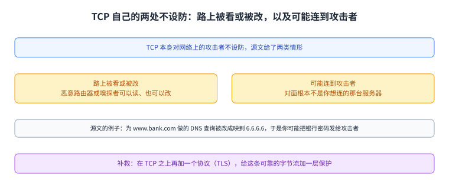
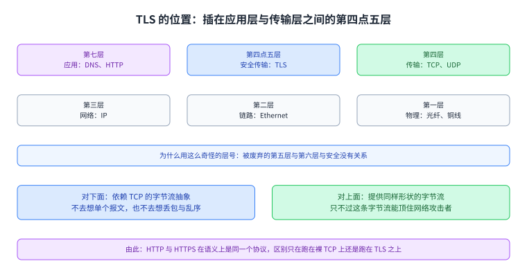
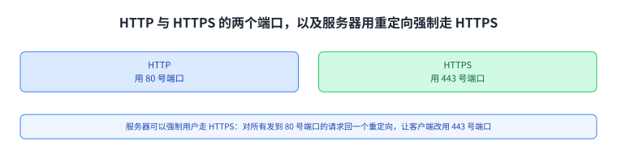
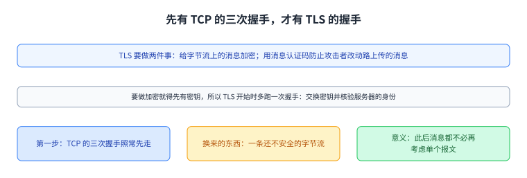
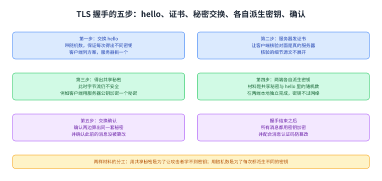

+++
title = "TLS：把字节流变成安全的字节流"
lecture = 34
slug = "tls"
status = "draft"
source_kind = "textbook"
source_url = "https://textbook.cs168.io/end-to-end/tls.html"
source_title = "TLS: Secure Bytestreams"
output_mode = "explanation"
+++

> 来源课程：UC Berkeley CS168 Computer Networks（教材 CS 168 Textbook）；
> 对应内容：End-to-End 之 TLS: Secure Bytestreams（<https://textbook.cs168.io/end-to-end/tls.html>）；
> 上游许可：教材站在站根页声明 CC BY-SA 4.0（第二人复核见 `docs/audit/license-cs168-second-review.md`）；
> 本文由 CourseLingo 原创撰写：**按该节的推进顺序**重新讲解，关键句给出英文原文与中译，**不逐句全译**，配图全部自绘、不转载原图；
> 本文非官方材料，CourseLingo 与 UC Berkeley 及课程教学团队无隶属关系；如与原文有出入，以原文为准。

## 一、这一讲要解决什么问题

源文第一句就是结论：

> TCPTCP by itself is insecure against network attackers.

中译：TCP 本身对网络上的攻击者是不设防的。它给了两类具体的情形。第一类是路上被看或被改：网络上的某个人（源文举的例子是一台恶意路由器，或者有人在线上嗅探报文）可以在报文传输途中读它们，甚至改它们。第二类更严重，是你连上了攻击者：源文设想你要访问一个银行网站，为 `www.bank.com` 做了一次 DNS 查询；如果攻击者（例如黑进了解析器或某台路由器的人）把这条响应改成把 `www.bank.com` 映到攻击者自己的地址 `6.6.6.6`，那么你建立的 TCP 连接对面就是攻击者，你可能把银行密码发了过去。

要解决这两类问题，源文的办法是在 TCP 之上再加一个[[term:protocol]]协议，也就是传输层安全（TLS）。这一讲接着第 33 讲往下走：前面几讲把包送到、把地址翻译好，让两端能建立一条可靠的字节流；而这条字节流本身还是公开的，这一讲给它加一层保护。第 31 讲的 ARP 与第 33 讲的 NAT 都在改地址，这一讲一个地址都不改，它改的是字节流上的内容。

图里上面是两类威胁，下面是源文给的银行例子（DNS 响应被改成攻击者的地址）。这一节说明为什么需要在 TCP 之上再加一层。

## 二、TLS 坐在哪一层

源文给了一个很具体的定位：

> TLS can be thought of as a Layer 4.5 protocol, sitting in between TCP and application protocols like HTTP.

中译：TLS 可以看成一个第四点五层的协议，夹在 TCP 与 HTTP 这类应用层协议之间。源文解释了为什么用这么奇怪的层号：被废弃的第五层与第六层与安全没有关系。它配了一张分层图，把这层标成 Secure Transport，直接插在 Application 与 Transport 之间。

接下来是它与上下两边的接口，源文说得很干净。对下面，TLS 依赖 TCP 的字节流抽象，所以它不去想单个报文，也不去想丢包与乱序；对上面，TLS 提供给应用的还是同一个字节流抽象，只不过这条字节流现在能顶住网络上的攻击者。源文由此给了一句很有用的话：HTTP 与 [[term:https]]HTTPSHTTPS 在语义上是同一个协议，唯一的区别是 HTTPS 跑在「TLS 套在 TCP 上」的安全字节流上，而 HTTP 直接跑在裸 TCP 上。

图里左边是那套分层图（应用、第四点五层、传输、网络、链路、物理），右边是它与上下两边的接口：向下依赖 TCP 的字节流抽象，向上提供同样形状但安全的字节流。

## 三、端口与「强制走 HTTPS」

两者的区别在现实里靠端口号区分。源文说，HTTP 连接用 80 号端口，HTTPS 连接用 443 号端口；服务器可以强制用户走 HTTPS，办法是对所有发到 80 号端口的请求回一个重定向，让客户端改用 443 号端口。

图里上面两个格子是 80 与 443 各自的用途，下面一格是服务器强制 HTTPS 的做法（把所有 80 号端口的请求用重定向指到 443 号端口）。

## 四、握手之前：先跑一遍 TCP 的[[term:three-way-handshake]]三次握手

TLS 要做两件事，源文写得很直白：一是用密码学给字节流上的消息加密；二是用另一类密码学协议（消息认证码）防止攻击者改动路上传的消息。

而要做加密，两端得先有密钥，所以 TLS 在开始时会多跑一次握手来交换密钥并核验服务器的身份（例如确认对面真的是那家银行，而不是冒充银行的人）。这里有一个顺序上容易被忽略的点：

> Because TLS is built on top of TCP, the TCP three-way handshake first proceeds as normal.

中译：因为 TLS 建在 TCP 之上，所以 TCP 的三次握手先照常走一遍。源文说这一步的意义在于得到一条（还不安全的）字节流，好让此后所有消息，包括 TLS 握手本身，都不必再去考虑单个报文。也就是说，安全建立在一个已经能工作的字节流之上，而不是在裸链路上从零开始。

图里上面一格是 TCP 的三次握手（照常先走），中间一格是它产生的字节流（此时还不安全），下面一格说明 TSL 握手在这条字节流之上进行，因此不必考虑单个报文。

## 五、TLS 握手的五步

源文把 TLS 握手拆成五步，而它的配图也按同一套编号画成了一张时序图。

第一步是双方交换 hello。源文说 hello 里带着随机数，作用是保证每一次握手都得出不同的密钥——它补了一句理由：如果每次都用了同一个密钥，而攻击者又破解了我们、学到了那个密钥，那就糟了。hello 还让两端就使用哪些密码方案达成一致：客户端的 hello 列出它支持的全部方案，服务器的 hello 从中挑一个。

第二步是服务器发一张真实性证书。源文说这让客户端能核验自己确实在跟真的服务器说话，而不是在跟冒充者说话；至于客户端具体怎么核验这张证书，源文说其中有一点复杂度，它不在这一页展开。

第三步是双方得出一个只有他们俩知道的秘密。源文提醒，此刻这条字节流仍然不安全，所以需要一个能在不安全信道上共享秘密的密码学协议。它给了一个可能的方案：如果你熟悉 RSA 公钥加密（源文提到加州大学伯克利分校的 CS 70 课程），客户端可以用服务器的公钥加密一个秘密并发给服务器；只有服务器知道对应的私钥，因此只有它能解开这条消息、学到那个秘密。

第四步是双方各自算出密钥，材料是第三步得出的共享秘密与 hello 里的随机数。源文把两样材料的分工说明白：用共享秘密是为了让攻击者学不到密钥；用随机数是为了每次都派生出不同的密钥。这一步是在两端本地各自独立完成的，源文还强调了它最要紧的一点：

> The secret keys are never actually sent across the network, so the attacker has no chance to learn them.

中译：这些密钥从来不会真的经过网络传输，所以攻击者没有任何机会学到它们。

第五步是双方交换一些确认，用来确认两边算出了同一套秘密，并且到目前为止路上传的消息没有被篡改过（源文在这里再提醒一次：此刻字节流仍然不安全）。做完这一步握手就结束了，此后的所有消息都用那个密钥加密，并且配合消息认证码防止篡改；于是在 TCP 连接之上建立起了一条安全的字节流，应用就可以在这条安全字节流上交换数据了。

图里按源文配图的编号排出五步：第一步是两个方向的 hello（都带随机数并商定密码方案），第二步是服务器发证书，第三步是秘密交换（用服务器的公钥加密），第四步是两端各自在本地派生密钥（没有报文经过网络），第五步是两个方向的确认。最下面一格说明握手结束之后所有消息都被加密。

## 读完应该能回答

1. TCP 自己有两类不设防，源文给的银行例子属于哪一类，攻击者改的是哪一步的响应？
2. 为什么 TLS 被称作第四点五层，它对上面与对下面各提供什么样的接口？
3. TLS 握手为什么要先等 TCP 的三次握手走完，这一步换来了什么？
4. 握手第一步的随机数与第三步的共享秘密各解决什么问题，为什么密钥不必经过网络？

## 脉络回顾

这一讲是「端到端」那一段里管安全的一讲，位置由前后两讲讲定。往前看，第 29 到 33 讲一路把包送出去：第 29 讲解决一根线怎么被多台机器共用，第 30 讲把多段链路组成的第二层网络收拾成一棵没有环的树，第 31 讲补上 IP 地址到链路层地址的翻译，第 32 讲管新机器怎么拿到地址，第 33 讲管私网地址怎么变成公网地址。走到这一讲时，两端已经能建立一条可靠的字节流了，可那条字节流在路上是公开的：源文开头那两句话把后果说得很具体，别人可以读、可以改，甚至可以让 DNS 把你引到一台假服务器上。

这一讲解决的就是这一环：在已经能工作的字节流之上再加一层，把「可靠」升级成「可靠且安全」。最要紧的转折在顺序上——TLS 不是从裸链路开始建立安全的，它先让 TCP 照常跑完三次握手，得到一条（还不安全的）字节流，然后在这条字节流上跑自己的握手；也正因为如此，它可以把「单个报文、丢包、乱序」这些事全部交给下面那层，自己只处理字节流上的密码学。

它留给后面一讲的东西也在这里：这一讲建立起来的安全字节流是端到端意义上的（两端之间），而它保护的是内容而不是身份之外的其它东西；按仓内清单，这一段的最后一讲要把前面这些协议串成一条完整的端到端路径。

## 溯源

- **字段核对**：`docs/lecture-manifest.md` 第 34 行为 `tls` / `TLS: Secure Bytestreams` / `/end-to-end/tls.html`（本讲字段由我从 manifest 读出）；抓页时 `<title>` 与 H1 都是 `TLS: Secure Bytestreams`。两处一致。
- **源文件与范围**：该页 HTML 共 25,107 字节（首次即 200），正文锚点 `#main-content`，实测 2 个二级小节（Secure Bytestreams / TLS Handshake），`TODO` 标记 0 处。本页因为要够五节，把源文第一节拆成「两类威胁」「TLS 坐在哪一层」「端口与强制 HTTPS」三节来写，第二节拆成「握手之前」与「握手的五步」两节。
- **2 张配图逐张看过**：`5-072-layer45`（分层图里多出一格 4.5 Secure Transport (TLS)，夹在 7 Application (DNS, HTTP) 与 4 Transport (TCP, UDP) 之间）、`5-073-tls-handshake`（Client 与 Server 之间的时序图：1 ClientHello 与 1 ServerHello、2 Server Certificate、3 Secret Exchange、4 两侧各自 Derive Secret Keys、5 两个方向的 Ack）。两张图与正文的对应关系一致。
- **三种源文笔误子形态的自查（本讲未发现）**：① 方向词：源文写「客户端用服务器的公钥加密，只有服务器知道对应的私钥」，方向自洽（客户端的 hello 列方案、服务器的 hello 挑一个，方向也自洽）；② 等号两边：本讲没有出现「必须改写成它自己」这类恒等式；③ 说 N 项而列 M 项：源文说废弃的是「第五层与第六层」两层，正好两项；握手那一段是编号列表，源文没有用「N 步」的说法去声称数量（本页写的「五步」是我按它列表与配图编号数出来的：hello、证书、秘密交换、派生密钥、确认）。三处都核过，没有需要照录并更正的矛盾。
- **成对的数与跨讲自查**：① 端口 80 与 443 分别对应 HTTP 与 HTTPS，两处说的是同一对对等关系，没有与其它端口混用；② 源文举的攻击者地址 `6.6.6.6` 与被改写的域名 `www.bank.com` 是同一条被篡改的 DNS 响应里的两样东西，本页没有把它们说成两件事；③ 源文说「HTTP 与 HTTPS 语义上相同」，这与我第 27 讲那一页讲的 HTTP 是同一个对象（那一页讲协议本身，本页只讲它跑在哪条字节流上），本页没有重复展开 HTTP。
- **我们补的（源文没有写）**：把 2 个小节拆成本页五节的结构说明；「第 31 讲的 ARP 与第 33 讲的 NAT 都在改地址，而这一讲改的是字节流上的内容」这句对比；「安全建立在一个已经能工作的字节流之上，而不是从裸链路开始」这句总结；以及「五步」这个数法（源文用编号列表，未明说步数）。
- **术语取舍**：本讲没有新增词条，也没有加任何 `[[term:…]]` 标记——本讲英文原词（`TCP`／`DNS`／`HTTP`／`HTTPS`／`TLS`／`certificate`／`port`）里，`dns`／`http`／`https`／`tls` 一类在更早各页是否登记过、以及登记后会不会给那些页面添漂移警告，我这轮没有足够的余量逐个 grep 清楚，因此本页按「不登记新词、只补一个已确认存在的 `DNS`」处理；若你要我按惯例把 `TLS` 一类也登记并逐页核漂移，我可以补做一轮。
