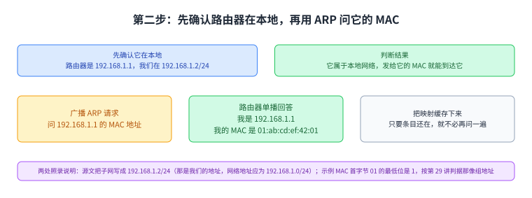
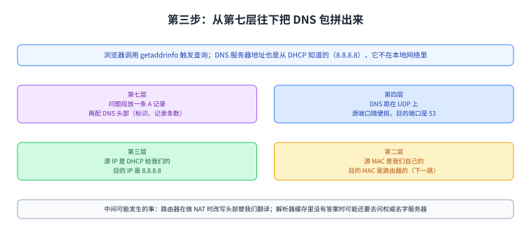
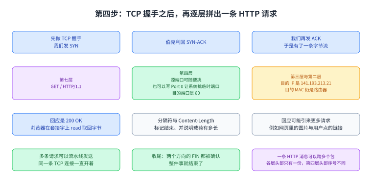
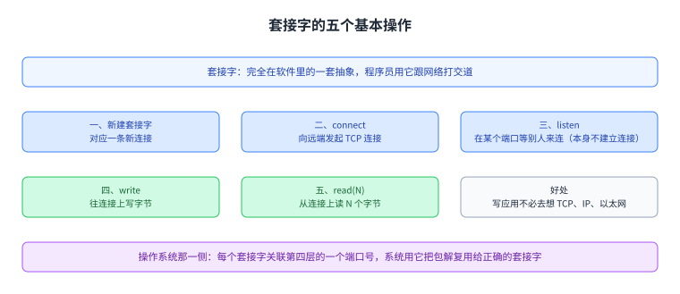
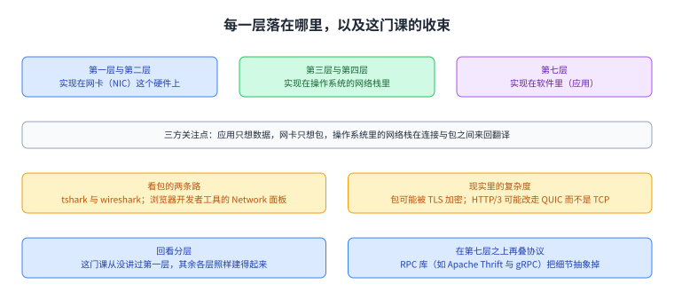

+++
title = "端到端连通性：从插上网线到打开网页"
lecture = 35
slug = "end-to-end-connectivity"
status = "draft"
source_kind = "textbook"
source_url = "https://textbook.cs168.io/end-to-end/end-to-end.html"
source_title = "End-to-End Connectivity"
output_mode = "explanation"
+++

> 来源课程：UC Berkeley CS168 Computer Networks（教材 CS 168 Textbook）；
> 对应内容：End-to-End 之 End-to-End Connectivity（<https://textbook.cs168.io/end-to-end/end-to-end.html>）；
> 上游许可：教材站在站根页声明 CC BY-SA 4.0（第二人复核见 `docs/audit/license-cs168-second-review.md`）；
> 本文由 CourseLingo 原创撰写：**按该节的推进顺序**重新讲解，关键句给出英文原文与中译，**不逐句全译**，配图全部自绘、不转载原图；
> 本文非官方材料，CourseLingo 与 UC Berkeley 及课程教学团队无隶属关系；如与原文有出入，以原文为准。

## 一、这一讲要解决什么问题

这一讲把前面所有[[term:protocol]]协议串起来走一遍。源文给的任务很具体：

> In this section, we'll do a step-by-step walkthrough of what happens when we turn on our computer, plug it into an Ethernet network, and type www.berkeley.edu in our web browser.

中译：本节一步一步走一遍，当我们打开电脑、把它插进一个以太网、在浏览器里敲 `www.berkeley.edu` 时，都发生了什么。源文说这一遍走完，就能看到网络里各个部分是怎么合起来处理用户这个请求的。它还声明了一个前提，免得把问题弄大：我们不假设要从零把互联网建起来，[[term:router]]路由器已经在跑路由协议、转发表也已经填好了。

按仓内清单，这是 `/end-to-end/` 那一段的最后一讲，也是这一门课的收束；它把第 29 到 34 讲讲过的那些动作按真实顺序排了一遍。

图里左边是家庭网络（一台主机与那台网关路由器），中间是 [[term:isp]]ISP 网络（里面有 DNS 服务器），右边是伯克利那边的网络。这一页说明这一讲要在一条真实的路径上把各层走一遍。

## 二、第一步：先把地址拿到手（DHCP）

开机、插上网线之后，我们对这个网络一无所知，所以源文说第一步是广播一条 DHCP 请求。它假设家里的路由器就是 DHCP 服务器，源文说这在家庭网络里很常见。路由器（也就是服务器）单播回一个 offer，里面装着这个网络的信息：子网掩码、默认网关的 IP 地址、DNS 服务器的 IP 地址，另外还给我们一个可以用的 IP 地址。

协议还没走完：我们要再发一条请求确认愿意使用这个配置，服务器回一条确认应答，DHCP 才算结束。

图里四步按顺序排出 DHCP 的往返，offer 里装着四样东西（子网掩码、默认网关、DNS 服务器与我们自己的地址）。这一节说明「地址不是天生的，是先要来的」。

## 三、第二步：在第二层找到路由器（ARP）

从 DHCP 我们知道了路由器的 IP 地址，转发表里也写着所有非本地的[[term:packet]]包都交给这台路由器。可源文提醒，在把 IP 包转发给它之前，还得先知道它的第二层 MAC 地址，否则包在本地网络里根本递不到它手上。

办法是先确认它确实在本地：源文写路由器的地址是 `192.168.1.1`，而我们在的子网写作 `192.168.1.2/24`，于是可以判断它属于本地网络，把以太网包发给它的 MAC 就能到达它。接着广播一条 ARP 请求，问 `192.168.1.1` 的 MAC 地址；路由器听到之后回答「我是 192.168.1.1，我的 MAC 地址是 `01:ab:cd:ef:42:01`」。这个 IP 与 MAC 的对应关系可以缓存下来，只要它还在缓存里，以后就不必再问一遍。

两处要照录说明的地方。其一，源文把「我们在的子网」写成 `192.168.1.2/24`——那是我们自己的地址，严格说子网的写法应当是网络地址 `192.168.1.0/24`（也就是第 31 讲那个「不固定位全为 0 的首地址」）。本页照录源文的写法，并在这里说明这个区别。其二，源文举例的 MAC `01:ab:cd:ef:42:01` 第一个字节是 `01`，最低位是 1，而按第 29 讲讲过的判据，分给具体机器的地址最低位应当是 0（为 1 的是组地址）；这里照录原值，并指出按那条判据这个示例看起来像一个组地址。

图里上面是那一步判断（路由器的地址落在本地子网里），中间是广播 ARP 请求与路由器单播回答，下面是缓存这条映射。最下面一格是上面那两处照录说明。

## 四、第三步：查 DNS（逐层把包拼出来）

拿到地址与路由器的 MAC 之后，下一步是查 `www.berkeley.edu` 的 IP。源文说这件事整个在操作系统里完成，浏览器代码只是调用了 `getaddrinfo` 这类函数来触发这次查询。DNS 服务器的地址也是从 DHCP 知道的（源文用的是 `8.8.8.8`）；它不在本地网络里，所以这个包要交给路由器。

源文接着做了一件很有教学价值的事：从最上面一层开始，一层一层把包拼出来。第七层是 DNS 的问题段，里面放一条 A 记录，问 `www.berkeley.edu` 的 IP，再配上 DNS [[term:header]]头部（标识、记录条数等等）。第四层是 DNS 跑在 UDP 上，源端口随便挑一个（因为我们是客户端），目的端口挑 53，那是解析器与名字服务器听查询的地方。第三层源 IP 是我们自己的地址（DHCP 给的），目的 IP 是 `8.8.8.8`。第二层源 MAC 是我们自己的（烧在硬件里的），目的 MAC 是路由器的（刚用 ARP 学到的那一个，也就是下一跳）。拼完之后，就可以把比特送上线了。

源文还交代了两件在中间发生的事。如果网络在用 NAT，路由器可能改写 UDP 与 IP 头部，把我们的私有地址翻译成公网地址；而作为终端主机，我们不必操这份心，路由器会替我们做完翻译，让我们以为自己在用自己的地址。另一件是：包到了 `8.8.8.8` 那台递归解析器之后，如果它缓存里没有答案，可能还要去问权威名字服务器；最终它把那条 A 记录回给我们，我们也就拿到了 `www.berkeley.edu` 的 IP。

图里从上到下四格是各层往里放什么（第七层的问题段与头部、第四层的 UDP 与目的端口 53、第三层的目的地址 8.8.8.8、第二层的目的 MAC 是路由器），最下面两格是中间可能发生的 NAT 翻译与解析器可能要去问权威服务器。

## 五、第四步：连上网站（TCP 与 [[term:http]]HTTP）

有了 IP 地址，就可以给伯克利发包了。因为用的是浏览器，目标是发一条 HTTP 请求。源文说 HTTP 跑在 TCP 上，所以先要跟服务器做一次 TCP 握手来打开连接：浏览器在某个套接字套接字上调用 `connect` 这类接口，操作系统（TCP 就在那里）替它完成握手并来回传包。握手是那三步：我们发 SYN，伯克利回 SYN-ACK，我们再发 ACK；此后我们与伯克利之间就有了一条字节流。

接着又是从最上面一层往下拼包。第七层是 HTTP 方法 GET、资源是 `/`（首页）、版本是 HTTP/1.1。第四层跑在 TCP 上，源端口可以随便挑；源文在这里补了一个细节：这个端口可以由应用手工指定，也可以写「Port 0」，那是请操作系统挑一个当前没被占用的临时端口的简写；它还顺势回指了 NAT 那一讲——允许应用手工指定端口，正是为什么两个用户可能挑到同一个源端口。目的端口是 80，HTTP 的固定端口号。第三层源 IP 是 DHCP 给我们的地址，目的 IP 是刚查到的 `141.193.213.21`。第二层与前面那条 DNS 包一样：源 MAC 是自己的，目的 MAC 是路由器的。

回应回来是 `200 OK`，内容是网页的 HTML。浏览器在套接字上调用 `read` 取回这些字节。源文说 HTTP 会在字节流里放一些分隔符（例如换行）来标记一条请求或响应的结束，而 `Content-Length` 这类头部会写明载荷长度，这也让浏览器知道该分配多少内存来接收。回应还可能引来更多请求：HTML 里出现 ``，浏览器就会再发一条请求取那张图；用户点一个链接也一样。源文提醒，对同一台服务器的多条 HTTP 请求可以在同一条 TCP 连接上流水线发送，所以连接可以一直开着；最后客户端或服务器决定关闭连接，于是走正常的收尾握手：两边各发一个 FIN，两个 FIN 都被确认，整件事就结束了。

这一节最后还有一条关于「包与消息」的提醒：一条 HTTP 请求或响应不一定装在一个包里。因为 HTTP 建在 TCP 的字节流之上，一条 HTTP 消息可能被拆到多个 TCP/IP 包里，这些包在第一到第三层的头部相同、第四层的头部在序号上不同；而整条 HTTP 消息只有一个头部。源文据此说：用 HTTP 之后，一条请求或响应与一个包之间不再是一一对应的关系。

图里上面是 TCP 的三步握手，中间四格是从第七层往下拼 HTTP 请求的各层内容，下面三格是回应与后续请求、流水线、以及收尾的两个 FIN，最后一格说明一条 HTTP 消息可以跨多个包。

## 六、写代码的那一侧：套接字

源文换到程序员的视角：如果你只是用浏览器访问网站，不需要写任何代码就能让应用（HTTP）跑在互联网上；可要是你自己写应用，大概就得写点跟网络打交道的代码。它给的抽象是套接字：这套抽象完全在软件里，程序员可以用五个基本操作。第一条是新建一个套接字，对应一条新连接，在 Java 这类面向对象的语言里可能就是一个构造函数。第二条是 `connect`，它向某台远端机器发起一条 TCP 连接，在客户端-服务器模式里我们是客户端时用得上。第三条是 `listen`，在某个端口上监听；它本身不建立连接，而是允许别人主动来连我们。第四条与第五条是连接打开之后的 `write`（往连接上写字节）与 `read`（带一个参数 N，读 N 个字节）。源文说，有了这套抽象，程序员写应用时不必去想 TCP、IP、以太网这些更底层的抽象。

从操作系统那一侧看，每个套接字都关联着第四层的一个端口号：同一个套接字收发的所有包都带同一个端口号，操作系统就用这个端口号把包解复用、送给正确的套接字。

图里按源文的顺序排出五个操作（新建、connect、listen、write、read），下面两格是这套抽象的两个好处：程序员不必想底层，以及操作系统用端口号把包解复用给正确的套接字。

## 七、分层到底分在哪里，以及这门课的收束

源文交代了这套分工在机器上落在哪里：第一层与第二层实现在网卡（NIC）这个硬件上；第三层与第四层实现在操作系统的网络栈里；第七层的应用则实现在软件里。把第三、四层放进操作系统的好处是，应用不必每次都重新实现它们一遍。于是三方的关注点各不相同：应用只需要想数据，网卡只需要想包，而操作系统里的网络栈负责在「连接」与「包」之间来回翻译。

想亲眼看包，源文给了两条路：`tshark` 与 `wireshark` 这类工具，以及浏览器开发者工具里的 Network 面板。它还提醒，真去看原始报文时会遇到这一遍走位里没讲到的现实复杂度，例如包可能被 TLS 加密（第 34 讲），或者在用 HTTP/3 时改走 QUIC（那种为 HTTP 优化的 UDP 变体）而不是 TCP。

最后一节回到分层。源文说，把这幅端到端的全图看一遍，就能明白分层为什么是好用的原则：我们能在单独一层里解决具体问题，而不必同时想着所有层。它举了一个很有说服力的例子：这一门课其实完全没有讲过第一层，没讲把信号送上线需要的电子工程与物理；可我们仍然能在第一层之上把其余各层建起来，并不需要知道第一层具体怎么工作。

源文还指出，这一门课讲的 HTTP 是第七层最主要的协议，但 HTTP 本身相对简单，而多个应用可能都想在它之上得到同样的一套复杂功能，又不愿意各自重写一遍；于是可以在第七层之上再叠协议。它举的例子是远程过程调用库：程序员写一段代码，其中一些函数其实在网络上另一台计算机上执行；为了避免人人从零在 HTTP 上实现这个，就有了 Apache Thrift 与 gRPC 这类库，把更多细节抽象掉。它最后给了一段真实的客户端代码，那两行调用网络的库函数背后，HTTP、TCP、IP、以太网、ARP、DHCP 全都藏了起来；源文说虽然出问题时知道这些协议仍然有用、懂它们也能帮助你把代码针对特定协议优化，但归根到底，分层是一件非常有力的抽象工具。

图里上面三格是执行的落点（网卡做第一二层、操作系统的网络栈做第三四层、软件做第七层）与三方的关注点，中间两格是看包的两条路与现实的复杂度（TLS、QUIC），下面两格是回看分层（第一层从没讲过却撑起了其余各层）与在第七层之上再叠协议（RPC、Thrift、gRPC）。

## 读完应该能回答

1. 为什么开机第一件事是广播 DHCP 请求，offer 里装着哪四样东西，ARP 又为什么必须在转发之前做完？
2. 拼一条 DNS 包与一条 HTTP 请求时，四层各自放进什么，两条包在第二层上的目的 MAC 为什么相同？
3. 套接字的五个基本操作各做什么，操作系统凭什么把回来的包送给正确的套接字？
4. 这一门课从没讲过第一层，为什么还能在它之上把其余各层建起来，而「在第七层之上再叠协议」又是什么情形？

## 脉络回顾

这一讲是 `/end-to-end/` 那一段的收束，也是这一门课的收束。往前看，这条线是一步步搭起来的：第 29 讲解决一根线怎么被多台机器共用；第 30 讲把多段链路组成的第二层网络收拾成一棵没有环的树；第 31 讲补上 IP 地址到链路层地址的翻译；第 32 讲管新机器怎么拿到地址；第 33 讲管私网地址怎么变成公网地址；第 34 讲把可靠的字节流升级成安全而可靠的字节流。而这一讲不再引入任何新机制，它做的是把上面这些动作按一次真实访问的顺序排一遍：广播 DHCP 请求拿到地址、用 ARP 找到路由器、从第七层往下拼一条 DNS 包、做 TCP 握手再拼一条 HTTP 请求，最后拿回 `200 OK`。

最要紧的转折在写法上。源文没有按层来讲，而是按时间来讲，每走一步只交代那一刻需要的信息：地址是先要来的，路由器的 MAC 是先问出来的，DNS 的答案又成为下一步的目的 IP。这样做把前面几讲单看时容易分散的东西合成了一条因果链，也让「分层」这件事显出它的另一面——每一层都能在不知道别的层怎么实现的前提下干活，而第一层这一门课压根没讲过，其余各层照样建得起来。

后面就出了这门课的范围。源文在最后两层里已经指了两个方向：一是 HTTP/3 改走 QUIC（为 HTTP 优化的 UDP 变体），那属于 UDP 那一侧后来的发展；二是在第七层之上再叠一层，用 gRPC 这类库把 RPC 的细节藏起来；再加上 TLS 与 DHCP、NAT 这些协议在现实部署里的组合。这一讲把它们都点到，正是给这门课留了一个往外看的出口。

## 溯源

- **字段核对**：`docs/lecture-manifest.md` 第 35 行为 `end-to-end-connectivity` / `End-to-End Connectivity` / `/end-to-end/end-to-end.html`（本讲字段由我从 manifest 读出）；抓页时 `<title>` 与 H1 都是 `End-to-End Connectivity`。两处一致；目录 `content/35-end-to-end-connectivity/`、`lecture = 35`。
- **源文件与范围**：该页 HTML 共 36,951 字节（首次即 200），正文锚点 `#main-content`，实测 9 个二级小节（Motivation / Step 1: DHCP / Step 2: Find Router at Layer 2 / Step 3: DNS Lookup / Step 4: Connect to Website / Sockets / Layers in the OS / Viewing Packets / Revisiting Layering），`TODO` 标记 0 处（本讲无代补动作）。
- **10 张配图**：全部下载成功（`5-074` 到 `5-082` 是那次走位的 9 帧连播，`5-083-layer8` 是最后那段 gRPC 代码）。本次逐张看过 2 张：`5-074-end1`（三个网络并排：左侧 Home Network 有 A 与 R1，中间 ISP Network 里挂着 DNS 服务器，右侧 Berkeley Network 有 S）、`5-083-layer8`（Go 代码：`grpc.Dial` 与 `c.SayHello` 两行，旁边批注 Programmer can ignore everything at lower layers）。未逐张看的是 8 张（`5-075` 到 `5-082`），它们是那段走位连播的中间帧（DHCP、ARP、DNS、HTTP 各步）。
- **照录与存疑（源文自身两处，本页照录并就地说明）**：其一，源文把「我们在的子网」写成 `192.168.1.2/24`，而 `192.168.1.2` 是我们自己的地址；按第 31 讲的写法，子网应当是网络地址 `192.168.1.0/24`（不固定位全为 0 的首地址）。本页照录原写法并说明区别。其二，源文举例的路由器 MAC 是 `01:ab:cd:ef:42:01`，第一个字节 `01` 的最低有效位是 1；按第 29 讲的判据，分给具体机器的地址该位应为 0、为 1 的是组地址。本页照录原值并指出这一点。
- **成对的数与跨讲自查**： 两个地址 `192.168.1.1`（路由器）与 `192.168.1.2`（我们自己）不是同一个对象，本页分开写； 目的端口 53 与 80 分别对应 DNS 与 HTTP，与第 27 讲、第 34 讲是同一对端口，本页没有把两处说成不同的事； 源文说「允许应用手工指定端口，正是为什么两个用户可能挑到同一个源端口」——这与第 33 讲 NAT 那一节是同一个结论（那里是「两人都选 50000」），本页主动标明为同一处； 源文说 HTTP/3 可能走 QUIC、包可能被 TLS 加密，这两句分别与第 34 讲是同一个对象。另：本页的源文里「五个基本操作」后面正好列了五项（新建、connect、listen、write、read），数目与列表一致。
- **三条字面检查的覆盖面（本讲）**： 方向词：核了 DHCP 的「广播请求单播 offer」（方向相反，源文两边都写明）、ARP 的「广播提问回答」、TCP 的「SYNSYN-ACKACK」三处，均自洽； 等号两边：本讲没有出现「必须改写成它自己」这类恒等式，无对象； 说 N 项列 M 项：核了「五个基本操作」（列表 5 项 ）、「offer 里的信息」（本页概括为四项：子网掩码、默认网关、DNS 服务器与可用地址，源文在这一句里列的正是这四样）、「第一层到第七层」的落点三处，均一致。
- **术语 grep 的结果（补上 #34 欠的那一步）**：本讲正文出现的英文原词里，`ARP``DHCP``DNS``HTTP``HTTPS``NAT``TLS``QUIC``RPC``gRPC``socket` 逐个在所有已提交页面里 grep 过（`-i`，且把 `[[term:…]]` 里的键也算作命中）：`ARP` 与 `NAT` 只在第 3133 讲（我写的两页）与它们的术语键里出现，`TLS``QUIC` 只在本页与第 34 讲出现，而 `socket``rpc` 一类在更早的页面里已有零散出现。结论：本讲不新增任何词条，只用了两个已确认存在的键（`ARP`、`[[term:port-number]]` 一类），避免给已提交的页面添漂移警告。
- **我们补的（源文没有写）**：把 9 个小节归并成本页七节；「这一讲不引入新机制，只把前面各讲按真实顺序排一遍」这句定位；两处照录说明（子网写法、示例 MAC）；以及三处跨讲的同一对象标注。
