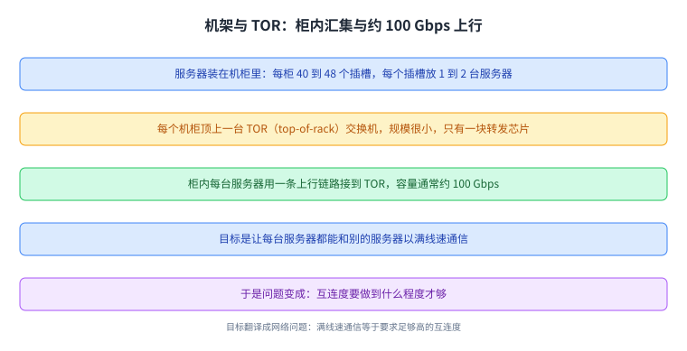
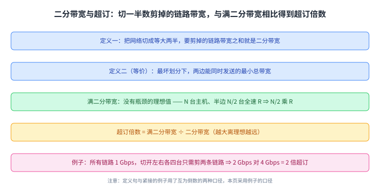
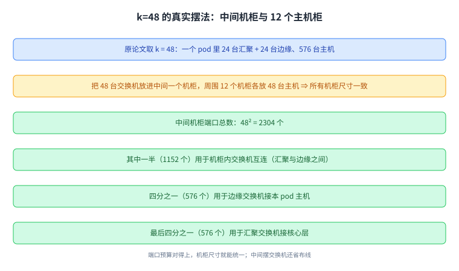

+++
title = "数据中心拓扑：从机架到 fat-tree"
lecture = 36
slug = "datacenter-topologies"
status = "draft"
source_kind = "textbook"
source_url = "https://textbook.cs168.io/datacenter/topology.html"
source_title = "Topologies"
output_mode = "explanation"
+++

> 来源课程：UC Berkeley CS168 Computer Networks（教材 CS 168 Textbook）；
> 对应内容：Datacenter 之 Topologies（<https://textbook.cs168.io/datacenter/topology.html>）；
> 上游许可：教材站在站根页声明 CC BY-SA 4.0（第二人复核见 `docs/audit/license-cs168-second-review.md`）；
> 本文由 CourseLingo 原创撰写：按该节的推进顺序重新讲解，关键句给出英文原文与中译，不逐句全译，配图全部自绘、不转载原图；
> 本文非官方材料，CourseLingo 与 UC Berkeley 及课程教学团队无隶属关系；如与原文有出入，以原文为准。

## 一、这一讲要解决什么问题

前面三十几讲里的「网络」，两端都是终端主机：你的电脑，或者一台服务器。前面那些流量都跑在通用[[term:internet]]上。这一讲换了一个舞台，把镜头推进到服务器那一侧，一座数据中心内部。

源文开篇的提问很直接：

> What is a Datacenter … In reality, YouTube is an entire building of interconnected machines, working together to serve videos to clients.

也就是说，你以为是「一台服务器」的东西，其实是一整个建筑里的机器在协同。而这一讲要研究的，就是把这栋建筑里成百上千台机器连起来的那张本地网络。

源文先给[[term:data-center]]下了一个很直白的定义（一个组织拥有、放在一个地点的机房），再给了一个必须分清的对照：数据中心与[[term:peering]]（peering location）虽然都属于同一家公司，但优化的目标相反。对等点在意的「离别人近」，所以要待在城里、靠近其他公司与运营商，也就是我们前面见过的 carrier hotel；而那里的路由器还要跑 BGP 与别的自治系统交换路由；而数据中心在意的是「空间、电力、冷却」，于是往往建在人少的地方，旁边最好有河（散热）或电站。源文还给了一个量级：数据中心可能要几百倍于对等点的电力。

这张图是整讲的坐标：同一家公司，两张网络，两种优化目标。

## 二、为什么数据中心的网络不一样

讲完「是什么」，源文接着问：

> Why is the Datacenter Different What makes a datacenter's local network different from general-purpose (wide area) networks on the rest of the Internet

它给了三条差异，而这三条其实是同一个事实的三个后果：这张网络由单一组织运营。

第一条是可控：硬件与软件都可以自己定，甚至能强制每台机器跑同一套自定义[[term:protocol]]。前面几讲讲过的那些「必须兼容全世界」的约束，在这里消失了。

第二条是同构：每台服务器与交换机的型号与运维方式完全一样。源文特别点名了通用互联网里那些麻烦：有些链路是 Wi-Fi 这类无线、有些是有线，有些机器比别的旧。而在数据中心里，所有机器通常属于同一代，升级时整个数据中心一起换。

第三条是单一地点：不必考虑海底光缆那种长距离链路，但在这一个地点内，要支撑极高的[[term:bandwidth]]。

这张图的重点在最后一行：自由是有代价换来的，因为不必兼容外界，才有资格做同构与自定义。

## 三、流量形态：南北与东西

接下来是最反直觉的一节。你的请求确实是从外面进来的，但它在数据中心内部会放大：

> A single user request could trigger hundreds of backend requests (521 on average, per a 2013 Facebook paper) before the response can be sent back to the user.

源文给的理由很朴素：一台服务器不可能知道所有事情。你请求一条信息流，广告、照片、帖子分别存在不同的机器上，第一台服务器只能向后面发起大量请求把它们凑齐（而这些内部请求走的仍是我们前面讲过的 IP 转发）。论文给出的平均数是 521 个后端请求。

于是数据中心里的流量分成两类，源文用了两个方位词：

> Connections that go outside the network … are described as north-south traffic. By contrast, connections between machines inside the network are described as east-west traffic. East-west traffic is several orders of magnitude larger than north-south traffic.

南北向是进出数据中心的流量，东西向是机器之间的流量，而后者比前者大好几个数量级，并且还在继续增长（源文点名了机器学习这个推手；而一次请求在内部放大出的那几百个后端请求，多半是短的 TCP 流）。有些应用甚至完全没有面向用户的流量，比如周期性的备份。

这张图解释了这一讲的动机：既然流量几乎都在内部，那内部这张网的设计就是主角。

## 四、机架与 TOR 交换机

物理上，数据中心里是一排排机柜。源文给了规格：

> The servers are organized in physical racks, where each rack has 40-48 rack units (slots), and each rack unit can fit 1-2 servers.

每个机柜 40 到 48 个插槽，每个插槽放一到两台服务器。而连网的第一步是在单个机柜内部：

> Each rack has a single switch called a top-of-rack (TOR) switch, and every server in the rack has a link (called an access link or uplink) connecting to that switch. … Each server uplink typically has a capacity of around 100 Gbps.

读法是：每个机柜顶上放一台小[[term:switch]]（只有一块转发芯片），机柜里每台服务器用一条上行[[term:link]]接到它，每条约 100 Gbps（链路层跑的仍是 Ethernet 那一套）。而这一讲的最终目标，源文写得很清楚：让每台服务器都能和别的服务器以满线速通信（也就是把[[term:throughput]]做到满）。

这张图把「目标」翻译成了网络问题：满线速通信，等于要求这张网有足够高的互连度。

## 五、二分带宽：把「互连得够不够」变成数

「互连度」是个模糊的词，源文用两种说法把它量化，而两种说法都必须先做同一件事：把网络切成大小相等的两半。

第一种说法是数要剪掉多少条链路：

> To compute bisection bandwidth, we compute the number of links we need to remove in order to partition the network into two disconnected halves of equal size. The bisection bandwidth is the sum of the bandwidths on the links that we cut.

第二种说法换了个角度，问的是「最坏情况下能同时发多少」：

> An equivalent way of defining bisection bandwidth is: We divide the network into two halves, and each node in one half wants to simultaneously send data to a corresponding node in the other half. Among all possible partitions of nodes, what is the minimum bandwidth that the nodes can collectively send at?

两种说法一致的原因也写在源文里：第一种是在找瓶颈，第二种是在取最坏划分，而瓶颈就是最坏划分处的总带宽。

接下来是两个派生概念。满二分带宽是「没有任何瓶颈」的那种理想情形：如果有 \(N\) 台主机，左半边 \(N/2\) 台全速 \(R\) 发送，那满二分带宽就是 \(N/2\) 乘 \(R\)。而现实中的网络离这个理想要差多少，用一个比值来量：

> Oversubscription is a measure of how far from the full bisection bandwidth we are, or equivalently, how overloaded the bottleneck part of the network is.

它紧接着举了一个例子：假设所有链路都是 1 Gbps，最右边那张图里要切开左边四台与右边四台，二分带宽是 2 Gbps（两条链路），而满二分带宽是 4 Gbps（左边四台各 1 Gbps），于是 2/4 说明主机只能跑到全速的 50%，换句话说这张网被超订了 2 倍。

这里有一处要提前说明：上面那条定义与紧随其后的例子用了互为倒数的两种口径。 定义说超订是「二分带宽与满二分带宽之比」（照字面是 \(2/4 = 0.5\)），而例子说「超订了 2 倍」（这是 \(4/2 = 2\)，也就是满二分带宽除以二分带宽）。按术语惯例与例子的算术，本页统一用后者：超订倍数 = 满二分带宽 ÷ 二分带宽，所以 2 Gbps 对 4 Gbps 是 2 倍超订、主机只能跑到 50%。这条也登记进了溯源。

## 六、拓扑选择：大交换机、树，以及 Clos

有了度量，就能比较拓扑。源文先试了最直接的一种：把所有机柜接到一台巨型交换机上。它确实能达到满二分带宽，但代价列得很清楚：这台[[term:switch]]要为每个机柜准备一个物理端口（可能多达 2500 个，也就是极大的 radix），容量可能要上 Pbps，而且它是单点故障。源文还附了一个故事：两千年代 Google 曾请交换机厂商做一台一万端口的交换机，厂商拒绝了，理由是「这做不出来，而且就算做出来，除了你们没人要」。

第二种是树形拓扑。它能压低每台交换机的端口数与链路带宽，但源文指出它的要害：

> What are some problems with this approach The bisection bandwidth is lower. A single link is the bottleneck between the two halves of the tree.

而修法很直观：在越高的层用越宽的链路（让[[term:routing]]多几条可选出口）。源文给的例子是下面四条 100 Gbps、上面两条 300 Gbps，瓶颈就消失了，满二分带宽恢复。但它仍然没解决「顶层那台交换机又贵又难扩」。

真正的出路是这一讲的标题答案：用便宜的标准件堆。

> Could we instead design a topology that gives high bisection bandwidth, using cheap commodity elements? In particular, we'd like to use a large number of cheap off-the-shelf switches, where all the switches have the same number of ports, each switch has a low number of ports, and all link speeds are the same.

这就是 Clos 网络（以 1952 年的发明者 Charles Clos 命名）：它靠巨量的路径换来高带宽，每个节点走不同的路；而扩展方式不是造更大的交换机，而是再加一批同样的交换机。源文还指出数据中心做了一个改动：经典 Clos 把发送方排在左边、接收方排在右边，而机柜既能发也能收，所以把两层折叠成一层，叫做折叠 Clos。

这张图的比较标准只有一个：同样的满二分带宽，谁更便宜、更能扩。

## 七、fat-tree：把 Clos 做成可数的结构

最后源文把两种思路合起来：树形给的是「低 radix 且满二分带宽」，Clos 给的是「商品件可扩展」，那么合起来就是 fat-tree Clos 拓扑。它的出处也标得很清楚：2008 年 SIGCOMM 的论文《A Scalable, Commodity Data Center Network [[term:architecture]]》（Al-Fares、Loukissas、Vahdat）。

这个拓扑的定义是按参数 \(k\) 长出来的，源文逐条给了计数。\(k\) 元 fat tree 有 \(k\) 个 pod，每个 pod 有 \(k\) 台交换机：其中 \(k/2\) 台在上层的汇聚层，\(k/2\) 台在下层的边缘层（所以这个拓扑要求 \(k\) 是偶数）。每台交换机有 \(k\) 条链路，一半向上、一半向下。

核心层的计数是这一节最值得跟着算的一步：

> There are \((k/2)^2\) core switches. … There are k pods, and each pod has k/2 switches in the upper aggregation layer, for a total of \(k^2/2\) switches in the aggregation layer.

> Each aggregation-layer switch has k/2 links pointing upwards, for a total of \(k^3/4\) links pointing upwards. … Each core layer switch has k links pointing downwards, so we need \(k^2/4\) core layer swiches (each with k links) to create \(k^3/4\) links pointing towards.

读法是：先把向上要连的链路总数算出来（\(k^3/4\)），再用每台核心交换机能提供的向下链路数（\(k\)）去除，就得到核心交换机台数 \(k^2/4\)，也就是 \((k/2)^2\)。同一条思路也能算出一侧的主机数：每个 pod 有 \(k/2\) 台边缘交换机、每台向下接 \(k/2\) 台主机，所以每 pod \((k/2)^2\) 台主机，全拓扑 \(k \times (k/2)^2\) 台。

源文还专门提醒：\(k = 4\) 是最小的例子，但有迷惑性，因为有几个数碰巧相等（\((k/2)^2 = k = 4\)）；要看清楚得用 \(k = 6\)：每个 pod 3 台汇聚 + 3 台边缘，每台边缘接 3 台主机，每 pod 9 台主机，共 54 台；核心层 9 台交换机，每台 6 条链路通向 6 个 pod。而满二分带宽的证明也是一个计数：把 pod 分成左右两半，每台核心交换机各有 \(k/2\) 条链路通向每一边，要隔离一边就得每台剪 \(k/2\) 条，共 \((k/2)^2\) 台交换机，于是剪掉 \((k/2)^3\) 条链路，而左半边恰好有 \((k/2)^3\) 台主机要全速发送，两边数字对上，满二分带宽成立。

这张图的每个数字都能从上一行推出来：这就是它「可扩展」的含义，参数一改，整个结构按公式长。

最后是现实摆法。源文用原论文的 \(k = 48\) 举例：一个 pod 里 24 台汇聚 + 24 台边缘、576 台主机。把 48 台交换机放进中间一个机柜，周围摆 12 个机柜、每柜 48 台主机，于是所有机柜尺寸一致（都是 48 台机器），而且中间摆交换机还能省下大量布线。端口账目也很整齐：中间那个机柜共 \(48^2 = 2304\) 个端口，其中一半（1152 个）用于机柜内交换机互连，四分之一（576 个）用于边缘交换机接本 pod 的主机，最后四分之一（576 个）用于汇聚交换机接核心层。

而这一节的收尾回到了开头那个对应关系：源文问，这套 fat-tree 与前面讲的机架与 TOR 交换机是什么关系？答案是：对合适的 \(k\)，可以把 pod 内部的主机与交换机安排成一排排机架，也就是说，**边缘层交换机扮演的就是 TOR 的角色。**

这张图把公式落到了物理布局上：端口预算对得上，机柜尺寸就能统一。

## 八、真实世界的拓扑

源文最后只给了两句话加两张论文图：2008 年那张图里，任意两台终端主机之间已经有很多条不同路径；2015 年那篇论文则探索了多种拓扑。它的结论是：具体变体很多（2009、2015 年都有），但它们共享同一个目标，在任意两台服务器之间取得高带宽。

这句话也正好是这一讲的收束：从机架里的 TOR，到 \(k\) 元 fat tree 的计数，再到真实世界里的变体，变的只是摆法，不变的是那个目标。

这张图是研究地图的一格：公式定下骨架，现实在骨架里挑摆法。

## 读完应该能回答

- 数据中心与对等点各自优化的目标是什么，为什么它们会建在不同的地方；
- 数据中心网络的哪三条差异来自「单一组织拥有它」这一个事实；
- 南北向与东西向流量分别指什么，为什么后者大好几个数量级；
- 二分带宽的两种等价定义分别是什么，超订倍数怎么算；
- 大交换机与树形拓扑各自的瓶颈在哪，Clos 与 fat-tree 用什么办法绕开；
- \(k\) 元 fat tree 里核心交换机台数、每 pod 主机数与剪链数分别是多少，\(k = 48\) 时端口怎么分账。

## 脉络回顾

往前看，这一讲是 CS168 后半程的一次「换场地」。第 29 到第 35 讲都在通用互联网里做文章：一根线怎么被多台机器共用、多段链路怎么收拾成一棵没有环的树、地址怎么翻译与分配、私网地址怎么变成公网地址、可靠的字节流怎么升级成安全而可靠的字节流。而这一讲把网络搬进了一栋楼：同样的[[term:link]]、[[term:switch]]与[[term:packet]]，但约束全变了，不必兼容外界，于是可以同构、可以自定义[[term:protocol]]。

它解决的那一环，是前面几讲从未正面处理过的互连度。前面讲的是「包怎么送到」，而这一讲问的是「这张网能同时承载多少条满速的流」。为此它引入并用了整整一节的[[term:bandwidth]]度量[[term:bisection-bandwidth]]，再把[[term:oversubscription]]当成绩效指标；而后面挑拓扑的全部理由，都是为了让这个指标逼近满值而成本又低。

最要紧的转折在视角的翻转：大交换机、树、Clos 三种思路里，前两种都在「造一台更强的设备」，而第三种换成了「**用很多台一样的弱设备，靠路径数量取胜**」。这个翻转的产物就是 fat-tree Clos，而它的可扩展性是可以算出来的，\((k/2)^2\) 台核心交换机、每 pod \((k/2)^2\) 台主机、剪链 \((k/2)^3\)，三条公式都对得上，于是它既满足满二分带宽，又只用商品件。

后面哪里用到它：这一讲的 fat-tree 是接下来几讲的地基，数据中心里跑什么[[term:routing]]、[[term:congestion-control]]怎么设计，都要先有这张拓扑；而它最后那句话（边缘层交换机就是 TOR）也把这一讲接回了第四节的机架视角。再往外看，datacenter 这一段接着讲的会是数据中心内部的拥塞控制与路由，而它们要解决的问题（大量短流、东西向为主、拓扑规整）正是这一讲铺下的前提。

## 溯源

- 字段核对：`docs/lecture-manifest.md` 第 36 行为 `datacenter-topologies` / `Topologies` / `/datacenter/topology.html`（本讲字段由我从 manifest 读出）；抓页时 `<title>` 与 H1 都是 `Datacenter Topology`（与 manifest 的短名 `Topologies` 只有详略之差，正文按抓到的页面写）。目录 `content/36-datacenter-topologies/`、`lecture = 36`。
- 源文件与范围：该页 HTML 共 49,633 字节（首次抓取即 200，未遇到 `000`），正文实测 9 个二级小节（What is a Datacenter / Why is the Datacenter Different / Datacenter Traffic Patterns / Racks / Bisection Bandwidth / Datacenter Topology / Clos Networks / Fat-Tree Clos Topology / Real-World Topologies），`TODO` 标记 0 处（本讲没有需要代补的空缺）。
- 30 张配图：全部下载成功（`6-001-single-server` 到 `6-030-irl-topology2`），并逐张看过：为避免 30 次原图查看，我把它们拼成 3 张联系表（每张 10 图、缩放后带文件名）逐张比对过，确认文件名与内容一致（例如 `6-003-wan1` 确实是 WAN 与 peering 的关系图，`6-016-topology1` 是那台大交换机，`6-017-topology2` 标出了树形拓扑的瓶颈链路，`6-022-pods1` 到 `6-028-pods7` 是 fat-tree 的分 pod 展开，`6-028-pods7` 正是 \(k = 48\) 的机架摆法，`6-029`/`6-030` 是 2015 与 2014 年前后的论文图）。本页 9 张自绘图均按正文重画，不转载原图。
- 一处源文自身不自洽的登记：第五节的[[term:oversubscription]]定义句写「二分带宽与满二分带宽之比」，而紧随其后的例子按「满二分带宽除以二分带宽」得到「2 倍超订」。本页在正文里先行说明、照录两者、并统一采用例子的口径（2 Gbps 对 4 Gbps 为 2 倍超订）。
