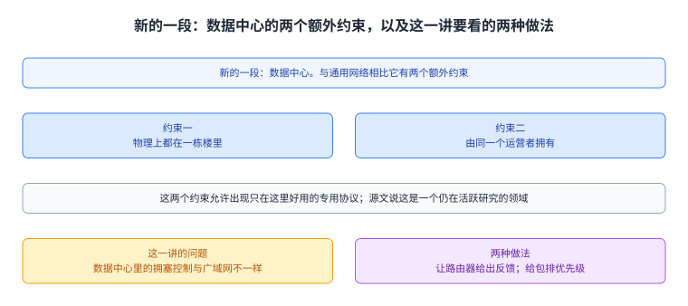
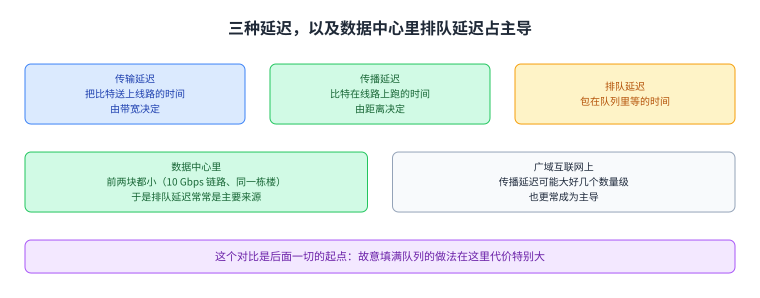
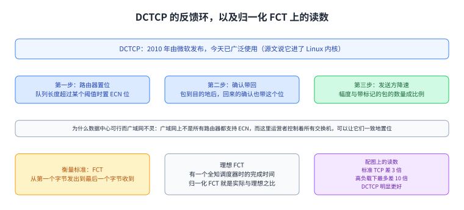
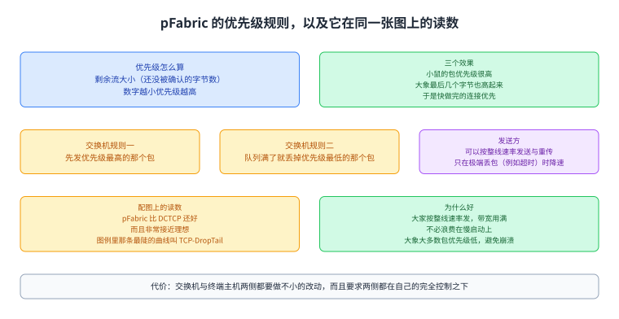
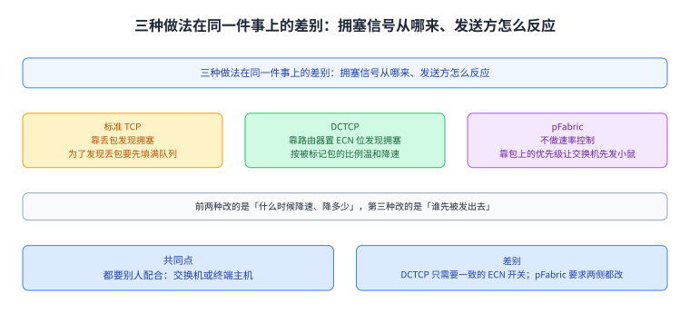

+++
title = "数据中心的[[term:congestion-control]]拥塞控制：让小鼠不被大象堵住"
lecture = 37
slug = "datacenter-congestion-control"
status = "draft"
source_kind = "textbook"
source_url = "https://textbook.cs168.io/datacenter/datacenter-cc.html"
source_title = "Congestion Control"
output_mode = "explanation"
+++

> 来源课程：UC Berkeley CS168 Computer Networks（教材 CS 168 Textbook）；
> 对应内容：Datacenters 之 Congestion Control（<https://textbook.cs168.io/datacenter/datacenter-cc.html>）；
> 上游许可：教材站在站根页声明 CC BY-SA 4.0（第二人复核见 `docs/audit/license-cs168-second-review.md`）；
> 本文由 CourseLingo 原创撰写：**按该节的推进顺序**重新讲解，关键句给出英文原文与中译，**不逐句全译**，配图全部自绘、不转载原图；
> 本文非官方材料，CourseLingo 与 UC Berkeley 及课程教学团队无隶属关系；如与原文有出入，以原文为准。

## 一、这一讲要解决什么问题

这一讲开了新的一段。前面 `/end-to-end/` 那一段在第 35 讲收官（Ethernet 到端到端连通性），这一讲属于新的 `/datacenter/` 那一段，按仓内清单它是这一段里讲拥塞控制的那一讲。源文开头交代了为什么数据中心值得单独讲：

> We've seen that datacenter networks have additional constraints (e.g. physically in one building, owned by one operator) compared to general-purpose networks. This can lead to special protocols that exploit these special characteristics of the network.

中译：我们前面见过，与通用网络相比，数据中心网络有额外的约束，例如物理上都在一栋楼里、由同一个运营者拥有；这些约束可以催生出利用这些特性的专用协议。源文说这一讲要看的正是那些在通用互联网上未必好用、但在数据中心里有效的 TCP 拥塞控制算法，并且补了一句：这是一个仍在活跃研究与开发的领域。

第 25 讲讲过拥塞控制会遇到哪些麻烦，第 26 讲讲的是让[[term:router]]路由器介入帮忙，而这一讲把场景固定在数据中心里，看两类具体做法：让路由器给出反馈的，以及给[[term:packet]]包排优先级的。

图里上面是那两个额外约束（一栋楼、一个运营者），中间是这一讲的问题（拥塞控制在这里与在广域网不一样），下面是它要看的两种做法（路由器给反馈、给包排优先级）。

## 二、延迟由哪几块组成，哪一块在这里占主导

要说明数据中心特殊在哪里，源文先把延迟拆开：

> Recall that packet delay consists of transmission delay (time to signal the bits on the wire, determined by bandwidth), propagation delay (time for bits to travel across wire), and queuing delay.

中译：包延迟由三部分构成：传输延迟（把比特送上线路的时间，由[[term:bandwidth]]带宽决定）、传播延迟（比特在线路上跑的时间）与排队延迟。接着它把三块在两种场景下的大小比了一遍：在数据中心里，传输延迟通常比较小（源文提醒我们有 10 Gbps 这种大容量链路），传播延迟也比较小（源文提醒所有服务器都在同一栋楼里），于是排队延迟常常是延迟的主要来源；反过来在广域互联网上，传播延迟可能大上好几个数量级（源文举的例子是包可能得横穿全国），也更常成为主导。

这个对比是后面一切的起点：既然排队延迟在这里最要命，那么凡是故意把队列填满的做法，在这个场景里代价就特别大。

图里上面把延迟拆成三块并写明各自由什么决定，中间两格把数据中心与广域网两块主导项对起来，下面一格说明这个对比为什么重要。

## 三、为什么 TCP 那套在这里会出事

源文把矛头直接指向 TCP 的设计取向：

> Recall that TCP congestion control deliberately fills up queues until packets get lost (we detect congestion by checking for loss). The TCP designers had not considered datacenter contexts, where queuing delay can have a much larger impact on performance.
>
> 中译：回顾一下，也就是 [[term:congestion-control]] 的做法，TCP 的拥塞控制是故意把队列填满直到丢包的（我们靠检查丢包来发现拥塞）；而 TCP 的设计者当年并没有考虑数据中心这种场景，在那里排队延迟对性能的影响要大得多。

更糟的是，数据中心的连接分布让这件事的危害放大。源文说与广域网不同，这里大多数连接落在两类里：大多数是小鼠，也就是很短、对延迟敏感的那些，例如一次搜索查询与它的结果页，数据量很小，但我们希望很快把结果还回去；另一些是大象，也就是很大、对吞吐敏感的那些，例如把数据从一台服务器备份到另一台，需要一条长时间、高吞吐的连接。

两类放在一起跑 TCP 会出现源文描述的那一幕：大象会把速率加上去，直到队列被填满；此后到来的小鼠就卡在队列里，被拖延。结论也就是这一讲的题目：数据中心的拥塞控制算法必须避免把队列填满。源文说近几年为此出现了许多专门的做法，并顺手举了第 25 讲讲过的那个例子：Google 在 2016 年发布的 [[term:bbr]]BBR 用包延迟而不是丢包来判断拥塞（第 25 讲那一页也讲过同一件事），而那条路本来就不需要把队列填满。

图里上面两格是两类连接各自的例子与关注点（小鼠短而看重延迟，大象大而看重吞吐），中间是 TCP 在这里出事的链条（大象加速直到队列满，随后到来的小鼠被卡住），下面一格给出方向：算法必须避免填满队列。

## 四、DCTCP：让路由器把拥塞说出来

源文给的第一种做法是 DCTCP，也就是数据中心 TCP：2010 年由微软发布，今天已经广泛使用（源文说它进了 Linux 内核）。它的机制建立在一个已有的[[term:header]]头部字段上：

> Recall that the IP header has an ECN bit, and the router can enable this bit to indicate that it's congested. When the packet reaches the destination, the ack will also have the ECN bit set, and this tells the sender to slow down.

中译：回顾一下，IP 头部里有一个 ECN 位，路由器可以把这一位置起来，表示自己拥塞了；包到达目的地之后，回来的确认里也会带上这个位，这就告诉发送方该降速了。DCTCP 的改动在于什么时候置位、以及发送方怎么反应：路由器在队列长度超过某个阈值时就置位，于是发送方能在队列还在填、但没填满的时候就发现并适应拥塞；而发送方降速的幅度与带标记的包的数量成比例，也就是一个温和的、非二值的反应——源文的说法是，发送方可以发现「也许有点拥塞」，然后稍微降一点来补偿。

源文还解释了为什么 ECN 在广域互联网上不太好用，而在数据中心里可行：广域网上不是所有路由器都支持它；而在数据中心里，运营者控制着所有交换机，可以让它们以一致的方式置位。源文说实际实现起来，主机与路由器两侧的改动都相对小。

这一节最后给了衡量标准。源文说可以用流完成时间（FCT）来量，也就是从第一个字节发出到最后一个字节收到之间的时间；而作为基准，理想 FCT 是「有一个全知的调度器、掌握整个网络与所有连接的信息」时的完成时间，那个调度器就能据此最优地调度与分配带宽。源文配的图画的正是归一化 FCT，也就是实际 FCT 与理想 FCT 的比值，它告诉我们比理想差了多少。源文在正文里给出的读数是：标准 TCP 的拥塞控制比理想差 3 倍，而网络负载更高时能差到 10 倍；相比之下 DCTCP 明显更好，连接完成得快得多、排队延迟也更小。

图里上面是那条反馈环：路由器在队列超阈值时置 ECN 位，确认把它带回发送方，发送方按带标记包的比例温和降速。中间一格说清为什么这套在数据中心可行而在广域网不灵。下面两格是衡量标准（FCT 与理想 FCT 的定义）与源文正文那三个读数（标准 TCP 差 3 倍、高负载下最多差 10 倍、DCTCP 明显更好）。

## 五、pFabric：给包排优先级

第二种做法换了思路。源文先复述问题：数据中心里的麻烦是小鼠被卡在大象后面；那么能不能给小鼠一条插到队首的路。它的办法是给每个包一个优先级数字：

> To prioritize mice, we will assign a priority number to every packet. The priority is computed as the remaining flow size (number of unacknowledged bytes). Lower numbers have higher priority.

中译：为了让小鼠优先，我们给每个包分配一个优先级数字；优先级按剩余的流大小算，也就是还没被确认的字节数，数字越小优先级越高。源文接着说了这条规则的三个效果：小鼠的包优先级很高（它们的流本来就很短）；大象的包优先级低，但一条大象连接最后那几个字节优先级会高起来；于是这条规则实际上在优先那些快做完的连接，哪怕它是一条很大的大象连接。

实现上，源文说要用 IP 头部里的优先级字段：在 pFabric 里每个包带一个优先级数字，交换机被改成先发优先级最高的那个包，而如果队列满了，它就丢掉优先级最低的那个包。有了这套优先级，源文说发送方就可以放心地按整条线的速率发送与重传，不必再为了拥塞控制调速率，只在极端丢包（例如超时）时才降速。

源文又给了一张同一坐标的图，读数是 pFabric 的表现比 DCTCP 还好，而且非常接近理想。它解释了为什么这套能work得这么好：大象与小鼠一起走、所有人都在按整线速率发，于是带宽被用满；不必把时间浪费在慢启动上；同时因为大 大象里大多数包的优先级都很低，也不会出现拥塞崩溃；而优先级系统保证了小鼠的包仍然能低延迟地穿过队列。

代价也写清楚了：实现这套要在交换机与终端主机两侧都做不小的改动，而且要求两侧都在自己的完全控制之下——交换机要实现优先级机制，发送方要换掉自己的 TCP 实现、改成按整线速率发。源文最后对它的评价是：pFabric 是「网络（交换机）与终端主机合作以取得好性能」的一个好例子。

图里上面是优先级怎么算（剩余流大小，越小越优先）与它带来的三个效果，中间是交换机侧的两条规则（发最高优先级、满队列丢最低优先级）与发送方可以按整线速率发，下面是它比 DCTCP 更接近理想的读数与它的代价（两侧都要改，且要求全控制）。

图里三格把标准 TCP、DCTCP 与 pFabric 放在一起比：前两种改的是什么时候降速、降多少，第三种改的是谁先被发出去；下面两格是它们的共同点与差别。

## 读完应该能回答

1. 延迟由哪三块构成，为什么排队延迟在数据中心里成为主导，而在广域网里常常不是？
2. 小鼠与大象各自的例子与关注点是什么，跑 TCP 时小鼠为什么会吃亏？
3. DCTCP 让路由器在什么时候置 ECN 位，发送方凭什么幅度降速，这套为什么在广域网不灵？
4. pFabric 的优先级按什么算，交换机对最高与最低优先级各做什么，以及代价落在哪两侧。

## 脉络回顾

这一讲开了新的一段。前面 `/end-to-end/` 那一段在第 35 讲收官：从第 29 讲的 Ethernet 一路到端到端连通性，把一台主机怎么接进网络、怎么拿到地址、怎么把名字换成地址、怎么把私网地址换成公网地址、最后怎么在一条安全的字节流上收发数据讲完。这一讲属于新的 `/datacenter/` 那一段，按仓内清单这一段从第 36 讲的拓扑开始，接着就是这一讲。所以它不是接着端到端那条线往下走的，而是换到一个受约束的场景里，把第 25 与第 26 讲讲过的拥塞控制重新看一遍。

这一讲解决的那一环可以概括成一句话：在数据中心里，排队延迟是延迟的主要来源，而 TCP 的拥塞控制恰恰是故意把队列填满来探测拥塞的，于是它在这里的代价被放大；更具体地说，数据中心的大多数连接要么是很短的小鼠、要么是很大的大象，前者的诉求是延迟、后者的诉求是吞吐，而 TCP 让大象先把队列占满，小鼠就吃亏。

最要紧的转折是反馈从哪来。第一种做法把反馈放在中间：让路由器在队列刚开始涨的时候就把 ECN 位置起来，于是发送方能在队列填满之前降速，而它降速的幅度还是连续的、与被标记的包成比例；第二种做法干脆不做速率控制，转而把优先级放进包里，让交换机按剩余流大小来决定先发谁、满队列时丢谁，于是发送方可以一直按整线速率发。两条路的共同点是都得靠别人配合：DCTCP 要求所有交换机一致地置位（这在数据中心可行，因为运营者控制全部设备），pFabric 则要求交换机与终端主机两侧都改。按仓内清单，这一段后面还有讲路由的一讲，而这一讲留下的问题（队列里的公平与延迟）在那里还会再出现。

## 溯源

- **字段核对**：`docs/lecture-manifest.md` 第 37 行为 `datacenter-congestion-control` / `Congestion Control` / `/datacenter/datacenter-cc.html`（本讲字段由我从 manifest 读出）；抓页时 `<title>` 是 `Congestion Control | CS 168 Textbook`，与 manifest 的标题一致，而 H1 是更长的 `Congestion Control in Datacenters`，也就是正文里用的那个名字。三处名字一致，只有 H1 更完整，本页按 H1 的说法称「数据中心的拥塞控制」。
- **源文件与范围**：该页 HTML 共 28,016 字节（首次即 200），正文锚点 `#main-content`，实测 3 个二级小节（Why are Datacenters Different? / DCTCP: Feedback from Routers / pFabric: Packet Priorities），`TODO` 标记 0 处（本讲无代补动作）。本页为了够节数，把第一节拆成「两个约束与这一讲的位置」「延迟由哪几块组成」「为什么 TCP 在这里出事」三节。
- **2 张配图逐张看过**：`6-031-fct-chart1`（横轴 Load 从 0.1 到 0.8，纵轴归一化 FCT 从 0 到 10；三条曲线是 Ideal 平在 1、DCTCP 从约 1.1 缓升到约 3.4、TCP-DropTail 陡升到 10 附近）、`6-032-fct-chart2`（同一坐标上加了第四条 pFabric，它几乎贴着 Ideal 那条线，DCTCP 与 TCP-DropTail 不变）。两张图与正文的说法一致。
- **成对的数与跨讲自查**：其一，源文正文给的「标准 TCP 比理想差 3 倍」与「高负载下最多差 10 倍」这两个数，对应的是配图上同一条曲线（TCP-DropTail）的低负载端与曲线顶端，也就是同一对象的不同负载点；本页把它们写成同一组读数，并在图上按图读出 DCTCP 的两端（约 1.1 与约 3.4）。其二，两张图里那条最陡的曲线在图例里叫 TCP-DropTail，而正文说的是「标准 TCP 的拥塞控制」；两者是同一个对象，只是图名更具体，本页按同一对象处理。其三，源文举的 BBR（Google 2016）与第 25 讲那一页是同一件事，本页主动标明。其四，ECN 位与第 26 讲（路由器侧介入拥塞控制）是同一族东西，本页按跨讲同一对象处理。
- **四种子形态的覆盖面（本讲）**：其一 方向词：核了三处——「路由器置位表示自己拥塞／确认带回给发送方」（方向一致）、「发送方在队列还在填时降速」（增/减方向正确）、「优先级数字越小优先级越高」与「小鼠的包优先级很高」（两条方向一致，没有自相矛盾）；其二 等号两边：本讲没有「必须改写成它自己」这类恒等式，无对象；其三 说 N 项列 M 项：核了两处——「延迟由三块组成」后面正好列了 transmission／propagation／queuing 三项，以及「大多数连接落在两类里」后面正好列了小鼠与大象两类；其四 例子是否合自己教过的判据：本讲给出的数值型例子只有「10 Gbps 链路」与那三个 FCT 倍数，10 Gbps 与大容量链路、3 倍与 10 倍的递增关系都与源文自己的说法一致，未发现不合判据的例子。
- **术语 grep 的结果**：本讲英文原词里 `DCTCP`／`pFabric`／`ECN`／`FCT`／`BBR`／`DropTail`／`mice`／`elephants` 逐个在所有已提交页面里 grep 过（`-i`，且把 `[[term:…]]` 里的键也算命中）：`BBR` 只出现在第 25 讲（我写的那一页），`ECN` 只出现在第 26 讲（另一位作者那一页），其余词此前没有出现过。结论：本讲不新增任何词条（避免给已提交的页面添漂移警告），本页只用了 3 个已确认存在的键；写完标记后按你的建议直接跑了一遍 `validate --strict`。
- **关于我没做的事**：本讲只看了源页的 2 张配图（就是全部），没有去看 DCTCP 与 pFabric 的原始论文；源文说这两套算法「实现上改动相对小」「要两侧都改」，这些评价我按源文照录，没有另找证据核对。
