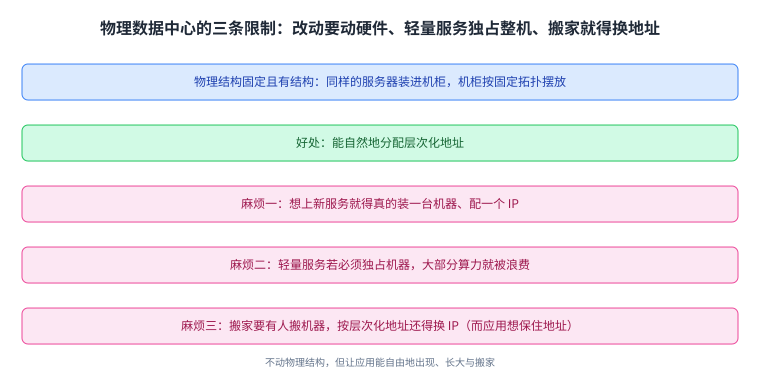
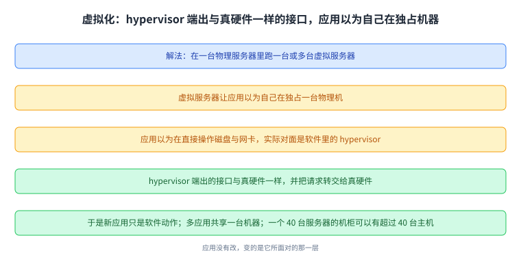
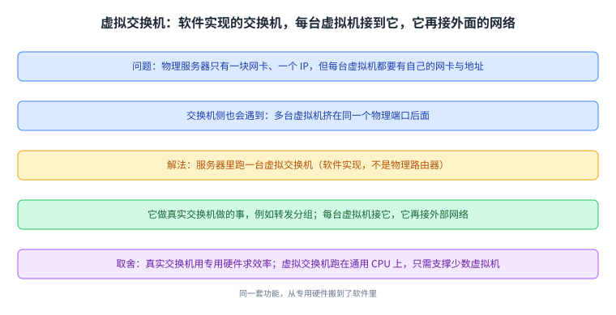
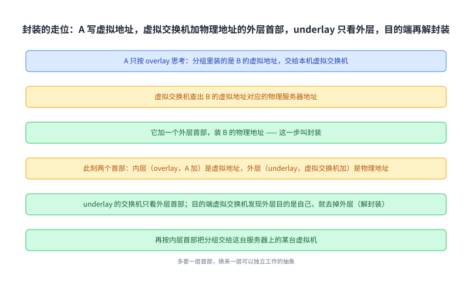
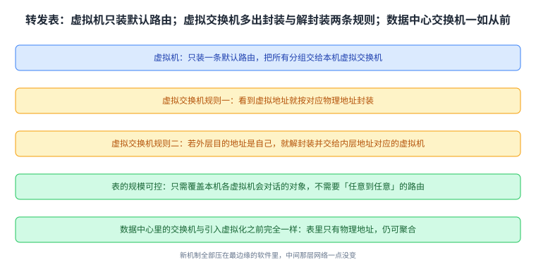
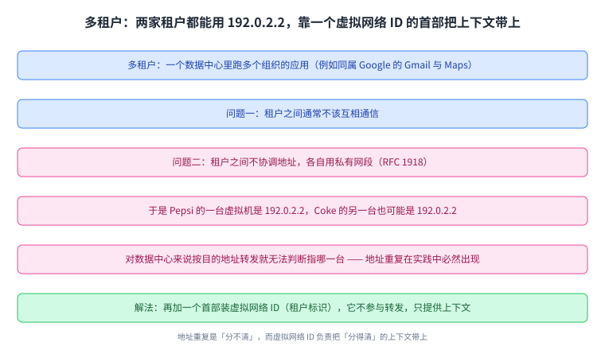
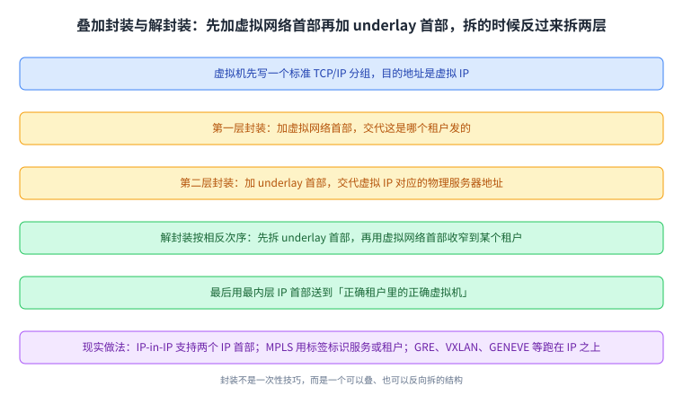
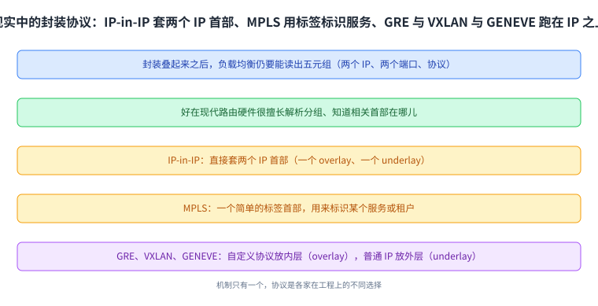

+++
title = "虚拟化与封装：把两台机器塞进一台"
lecture = 40
slug = "virtualization"
status = "draft"
source_kind = "textbook"
source_url = "https://textbook.cs168.io/datacenter/virtualization.html"
source_title = "Virtualization"
output_mode = "explanation"
+++

> 来源课程：UC Berkeley CS168 Computer Networks（教材 CS 168 Textbook）；
> 对应内容：Datacenter 之 Virtualization and Encapsulation（<https://textbook.cs168.io/datacenter/virtualization.html>）；
> 上游许可：教材站在站根页声明 CC BY-SA 4.0（第二人复核见 `docs/audit/license-cs168-second-review.md`）；
> 本文由 CourseLingo 原创撰写：按该节的推进顺序重新讲解，关键句给出英文原文与中译，不逐句全译，配图全部自绘、不转载原图；
> 本文非官方材料，CourseLingo 与 UC Berkeley 及课程教学团队无隶属关系；如与原文有出入，以原文为准。

## 一、这一讲要解决什么问题

上一讲讲的是数据中心的物理结构：机柜、TOR、pod 与 fat-tree。这一讲从物理结构的一条硬约束出发：**物理结构是固定的，而应用想变。**

源文把这条矛盾讲得很具体：数据中心的组织方式是固定且有结构的（同样的服务器装进机柜，机柜按某种固定拓扑摆放），好处是能自然地分配层次化地址。但一旦考虑「应用怎么住进来」，固定结构的坏处就出现了：

> The key problem here is that changing physical infrastructure is hard, but we often want to add new hosts, scale up existing hosts, and move hosts quickly and frequently.

它给了三种麻烦。要上一个新服务，就得有人真的去装一台服务器、给它一个 IP；服务变大还要装更多；服务器坏了要等人来修。如果某个服务很轻量但出于安全必须独占一台机器，那这台机器的大部分算力就浪费了。而如果要把服务搬到楼里另一处（比如那片区域要检修），除了要有人搬机器，按层次化地址模型还得给它换一个新 IP，而应用真正想要的是：不管搬到哪儿，地址都别变。

这张图给出了这一讲全部动机：不动物理结构，但让应用能自由地出现、长大与搬家。

## 二、[[term:virtualization]]：在物理服务器里跑虚拟服务器

源文给的解法是把应用与物理机解耦：

> Virtualization allows us to run one or more virtual servers inside a physical server. The virtual server gives applications the illusion that they are running on a dedicated physical machine.

关键在于那个「错觉」是怎么造出来的。应用以为自己在直接操作硬件（磁盘、网卡），实际上对面是一层软件：

> When the application tries to interact with hardware (e.g. disk, network card), it is actually interacting with a hypervisor in software. The hypervisor presents each virtual application with the same interface that real hardware would.

也就是说，[[term:hypervisor]]端出来的接口与真硬件一样，于是应用不需要改一行代码；而 hypervisor 自己跑在真硬件上，把应用的请求（写盘、发包）转交给硬件。

有了这一层，源文列出的三件事都变成软件动作：新应用来了，让 hypervisor 起一台新的[[term:virtual-machine]]，不必装机；要搬家，整个在软件里挪。而收益是双向的：多个应用共享一台物理服务器，彼此隔离、还能由不同的人管理，于是算力利用率上去了；同时数据中心里能容纳更多主机，源文给了一个具体的对照：一个装了 40 台服务器的机柜，可以有超过 40 台终端主机。

这张图的要点是「接口不变」：**应用没有改，变的是它所面对的那一层。**

## 三、[[term:virtual-switch]]：一台网卡要装出很多台的样子

网络这一侧立刻遇到同一类问题。物理服务器只有一块网卡、一个[[term:ip-address]]，但每台虚拟机都需要「我有自己的网卡和地址」这个错觉；而[[term:switch]]那一侧也可能出现多台虚拟机挤在同一个物理端口后面的情况。

解法还是软件：

> In order to manage multiple network connections on the same physical machine, the server needs a virtual switch. This virtual switch runs in software on the server (it's not a physical router), and performs the same operations as a real switch (e.g. forwarding packets).

每台虚拟机接到这台[[term:virtual-switch]]，虚拟交换机再接到外面的网络。源文还点了一个很实用的取舍：真实交换机通常跑在专用硬件上以求效率，而虚拟交换机可以跑在通用 CPU 上，因为它只需要支撑少数几台虚拟机。

这张图与上一节是同一个套路：同一套功能，从专用硬件搬到了软件里。

## 四、两套地址：underlay 与 overlay

虚拟化带来一个更深的麻烦，而它才是这一讲的主角。物理服务器的 IP 是由物理拓扑决定的（pod、机柜），而虚拟机的 IP 通常按现实世界的层级来定（国家、组织）：

> In particular, the virtual hosts on a single physical server don't necessarily all have the same IP prefixes, so we can't use the same aggregation tricks to scale up.

后果是聚合失效：以前可以说「蓝色 pod 里的服务器共用一个前缀，下一跳都是 R2」，现在同一个 pod 里可能住着几百台虚拟机、地址之间没有公共前缀，于是每一台虚拟机都得占一条[[term:forwarding]]表项；而虚拟机一旦搬到别的物理机（地址不变），[[term:routing]]协议还得重新发现到它的路径。源文把这件事概括成一句话：现在有两套地址系统了（一套给虚拟主机，一套给物理主机），而两套都在 IP 这一层里，于是同一层里出现了两个子层：

> The underlay network handles routing between physical machines. … The overlay network exists on top of the physical topology (underlay), and it only thinks about routing between virtual machines.

[[term:underlay]]管物理机之间的路由，成员就是数据中心的[[term:infrastructure]]（TOR 交换机、spine 交换机），它靠物理拓扑的层次化地址而扩展得很好；[[term:overlay]]建在物理拓扑之上，只考虑虚拟机之间的路由，而它之所以也能扩展，是因为每台虚拟机实际上只需要和少数几台别的虚拟机说话。

理想状态是两层互不知情。但源文立刻指出这会造成一个硬故障：如果 underlay 完全不知道虚拟地址，那当一台数据中心交换机收到目的地址是虚拟 IP 的[[term:packet]]时，它会在表里找不到，然后直接丢掉。所以两层之间必须有一座桥。

这张图解释了为什么需要新机制：同一层里塞进了两套地址，聚合这个省表的办法就不灵了。

## 五、封装：给分组套一层外套

桥的做法是把当初设计互联网时用过的招再使一遍：分层与首部。

> So far, we've treated IP as a single layer, and every packet has a single IP header … Now that we have two IP sub-layers with two different IP addressing systems, we could introduce an additional header into the packet.

源文考虑了两种形式：加两个 IP 首部（一个懂 overlay、一个懂 underlay），或者保留原来的 IP 首部给 underlay、另造一种新首部给 overlay。接着它用一次「虚拟机 A 发给虚拟机 B」的走位把机制讲完：

A 只按 overlay 思考，它写出的分组里那个 IP 首部装的是 B 的虚拟地址；它把分组交给本机上的虚拟交换机。虚拟交换机读首部、查出 B 的虚拟地址对应的物理服务器地址，然后加一个外层首部，里面装 B 的物理地址，这一步就叫[[term:encapsulation]]（封装）。此刻分组有两个首部：内层（高层、overlay，由 A 加）是虚拟地址，外层（低层、underlay，由虚拟交换机加）是物理地址。之后虚拟交换机按物理地址转发，underlay 里的每一台交换机只看外层首部。

到达目的物理服务器的虚拟交换机时，它发现外层首部的目的地址就是自己，于是把外层首部去掉（这叫解封装），露出内层首部；再按内层首部决定把分组交给这台服务器上的哪台虚拟机。

源文对这一套的总结是：虚拟交换机把「虚拟地址」翻译成「物理地址」，并负责加与拆那层额外的 underlay 首部，于是两层各自都能只想着自己的事。

这张图是这一讲的核心机制，而它与第 29 到第 35 讲那套[[term:layering]]是同一个手法：多套一层首部，换来一层可以独立工作的抽象。

## 六、加了封装之后，转发表怎么装

源文接下来问了一个非常工程化的问题：既然分组有两层地址，那表里该装什么条目。它给了三条：

虚拟机只需要装一条默认路由，把所有分组交给本机的虚拟交换机。虚拟交换机则要会两件额外的事：看到虚拟地址就按对应物理地址封装；以及一条解封装规则，如果外层目的地址是它自己，就拆掉外层、按内层地址交给虚拟机。

而这张表的规模是可控的，理由很关键：

> The forwarding table has entries for every destination VM that any of the VMs on this server might want to talk to. We can support this scale because we assume the VMs won't need to talk to every other VM in the datacenter. Unlike standard routing algorithms, we don't need any-to-any routing.

也就是说，它不需要「任意到任意」的路由，只需覆盖这台服务器上各虚拟机真正会对话的那些对象。而解封装那条规则的开销，也只与这台服务器上的虚拟机台数成正比，通常很小。

至于要不要动硬件，源文的回答很轻松：虚拟交换机是软件实现的，加功能就是写代码；不过封装实在太常见，所以现实中它也常被做进硬件。而最有意思的一句在最后：数据中心的物理[[term:router]]与交换机，与引入虚拟化之前完全一样，它们的表里只有物理地址，仍然可以靠物理拓扑做聚合。

这张图解释了为什么这套设计是可扩展的：**新机制全部压在最边缘的软件里，中间那层网络一点没变。**

## 七、[[term:multi-tenancy]]：两家公司可以都用同一个地址

最后一节回到「谁住在数据中心里」。一家公司运营的数据中心里可能跑着很多组织的应用（同一个 Google 的数据中心里既有 Gmail 的虚拟机，也有 Google Maps 的），这叫多租户；云厂商更进一步，直接让客户起一台虚拟机、随便用、用完销毁。

这带来两个问题。第一，租户之间通常不该互相通信；第二，租户之间不会协调地址。源文用了一个很好记的例子：假设数据中心里有 Pepsi 与 Coke 两家，各自搭自己的私有网络并给虚拟机分配内部地址，因为是私有网络，两家可以都用同一段保留地址（由 [[term:rfc]] 1918 规定），于是 Pepsi 的一台虚拟机是 192.0.2.2，Coke 的另一台虚拟机也可能是 192.0.2.2。

对租户来说这没问题（两边的 192.0.2.2 永远不会互相通信，也不会被公网访问）；但对数据中心来说就是灾难：按目的地址转发时，看到 192.0.2.2，根本不知道指的是哪一台虚拟机。源文还解释了地址重复为什么在实践中必然出现：数据中心管不了租户怎么分配地址，而在 IP 里使用私有网段又是标准做法。

解法还是封装，只是这次套的外套不同：

> We can add a new header that contains a virtual network ID for identifying a specific tenant (e.g. Pepsi has ID 1, Coke has ID 2). This new header doesn't contain information for forwarding and routing, but it provides additional context.

注意加粗那句的含义：这个新首部不参与转发与路由，它只提供上下文。目的端的虚拟交换机拆掉外层后，先看它决定这是哪个租户，再看 overlay 首部把分组交给该租户的某台具体虚拟机。

这张图把两个问题分开了：地址重复是「分不清」，而虚拟网络 ID 只负责把「分得清」所需的上下文带过去。

## 八、叠加封装：一次套两层

既然封装可以加一层，那就可以加两层，用来同时支持虚拟化与多租户。源文把顺序写得很清楚：

虚拟机先写一个标准的 TCP/IP 分组（首部层层相加，这是[[term:header]]的老套路），目的地址是虚拟 IP。第一层封装加虚拟网络首部，交代这是哪个租户发的（这既能区分两家用了同一地址的租户，也能防止分组被送错租户）。第二层封装加 underlay 首部，交代虚拟 IP 对应的物理服务器地址。

而抽象在做完两层封装之后仍然成立：underlay 不需要知道这个数据中心里有多个租户，它只看最外层首部的物理地址。解封装则按相反的次序来：先拆最外层的 underlay 首部（已经到达目的物理服务器，它没用了），再用虚拟网络首部把范围收窄到某一个租户，最后用最内层的 IP 首部把分组送到「正确租户里的正确虚拟机」。

源文还给了一条很容易被忽略的提醒：封装之后，做负载均衡时要小心读五元组（两个 IP、两个端口、协议），因为分组里多了些首部；好在现代路由硬件很擅长解析分组、知道相关首部在哪儿。最后它列了现实中的做法：IP-in-IP 支持两个 IP 首部；MPLS 是一个简单的标签首部，用来标识某个服务或租户，因此可以做多租户的封装；而数据中心流行之后，又出现了 GRE、VXLAN、GENEVE 等等，它们大多跑在 IP 之上，也就是自定义协议当内层 overlay 首部、普通 IP 当外层 underlay 首部。

这张图是整讲的收束：**封装不是一次性技巧，而是一个可以叠、也可以反向拆的结构。**

最后一条提醒值得单独记下：封装叠起来之后，做负载均衡时仍然要能读出**五元组**（两个 IP、两个端口、协议），而现代路由硬件对此已经很有经验。现实里的封装协议也因此分成几档：IP-in-IP 直接套两个 IP 首部；MPLS 用一个简单的标签首部标识服务或租户；而 GRE、VXLAN、GENEVE 这些较新的协议把自定义协议放在内层（overlay）、普通 IP 放在外层（underlay）。

这张图把「叠一层」这件事的机制与选型分开了：机制只有一个，而协议是各家在工程上的不同选择。

## 读完应该能回答

- 固定的物理结构给应用带来哪三种麻烦，为什么「地址随位置变」是其中最麻烦的一条；
- hypervisor 靠什么让应用以为自己在独占机器，虚拟化的两个收益分别是什么；
- 为什么需要虚拟交换机，它与真实交换机的性能取舍在哪里；
- underlay 与 overlay 各管什么，为什么它们的地址体系不能互相暴露；
- 封装与解封装各自发生在哪一跳，两个首部里分别装的是什么；
- 多租户为什么必然出现重复地址，虚拟网络首部为什么不算转发信息；
- 叠加封装加与拆的次序是什么，现实中有哪些协议在做这件事。

## 脉络回顾

往前看，这一讲接着数据中心那一段往下走。第 36 讲给的是物理骨架：机柜、TOR、pod 与 fat-tree，以及用二分带宽衡量互连度的那套语言。这一讲不动物理骨架，而是在它上面加一层：把应用从物理服务器里「摘出来」，于是机器可以软件式地出现、长大、搬家。

它解决的那一环是两套地址体系的冲突。第 36 讲的层次化地址之所以能让转发表很小，靠的是「地址跟着物理位置走」；而虚拟机的地址要跟着业务走（国家、组织），于是电子表格一样的聚合办法失效了。这一讲的办法是承认两套地址都对，然后让它们各自待在自己的层里：underlay 只看物理地址，overlay 只看虚拟地址，中间的翻译与那层额外首部由软件交换机负责。

最要紧的转折在「多套一层首部」这个动作上。第 29 到第 35 讲里，分层与封装是为了让不同的网络技术能互相承载；而这一讲把同一个动作指向了内部：不是为了连接异构网络，而是为了在同一张物理网上跑出彼此隔离的多个虚拟网。一旦这样看，多租户那一段就顺理成章了，重复地址不是故障，而是「不同虚拟网共用一套物理网」的必然结果，所以只要再套一层带租户标识的首部把上下文带上即可。

后面哪里用到它：这一讲留下的两个组件会继续被用到，虚拟交换机（软件里的转发决策点）与首部堆叠（封装可以一层层加）。把前者做成可编程的、把控制逻辑从每台交换机里抽出来集中管理，就是数据中心那一段后面要讲的软件定义网络；而首部堆叠这一手，在后面的隧道与覆盖网里还会反复出现。另外这一讲没有回答一个问题，源文自己点明了：虚拟交换机怎么知道某个虚拟 IP 对应哪台物理服务器，它写着「我们还没讲怎么做」， 这个缺口本页照实留下，不代补。

## 溯源

- 字段核对：`docs/lecture-manifest.md` 第 40 行为 `virtualization` / `Virtualization` / `/datacenter/virtualization.html`（本讲字段由我从 manifest 读出）；抓页时 `<title>` 与 H1 都是 `Virtualization and Encapsulation`（比 manifest 的短名多一个并列词，正文按页面写）。目录 `content/40-virtualization/`、`lecture = 40`。
- 源文件与范围：该页 HTML 共 42,381 字节（首次抓取即 200；我最初按「数据中心调度」猜过一个 URL，返回 404，随后按 manifest 的路径取到正确页面），正文实测 9 个二级小节（Physical Datacenter Limitations / Virtualization / Virtual Switches / Underlay and Overlay Network / Encapsulation / Forwarding Tables with Encapsulation / Multi-Tenancy and Private Networks / Encapsulation For Multi-Tenancy / Stacking Encapsulations），`TODO` 标记 0 处。源文有一处明确的空缺：讲封装走位时写着「我们还没讲怎么把虚拟地址映射到物理服务器地址」，本页如实保留这个空缺，不代补。
- 20 张配图：全部下载成功（`6-043-dc-address-scaling` 到 `6-062-stack2`），按用途分成三类：独立示意图 6 张（`6-043` 地址聚合的规模问题、`6-044` 虚拟机、`6-045` 虚拟交换机、`6-058`/`6-059`/`6-060` 多租户），以及两组连播帧：虚拟化那一组 12 帧（`6-046` 到 `6-057`，`virtual1` 到 `virtual12`，是封装走位的逐步动画）与叠加封装那一组 2 帧（`6-061`/`6-062`）。本次逐张看过：为避免 20 次原图查看，我把它们拼成 2 张联系表（每张 10 图、缩放后带文件名）逐张比对，并如实说明我用的是联系表缩放版，不是原始分辨率。核对结果：文件名与内容一致（`6-044-vm` 是虚拟机示意图，`6-045-virtual-switch` 画出虚拟机与虚拟交换机的连接，`6-046…6-057` 是同一个封装走位连续展开的 12 帧，`6-058…6-060` 是多租户与重复地址，`6-061`/`6-062` 是叠加封装的两帧）。
