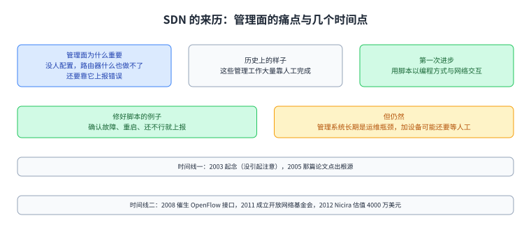
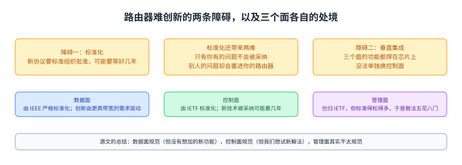
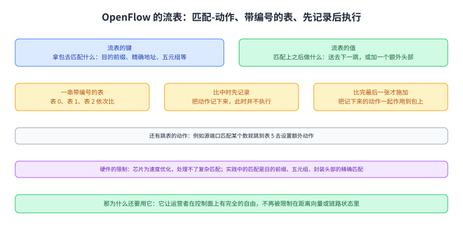
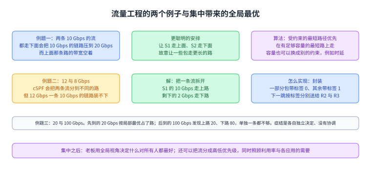
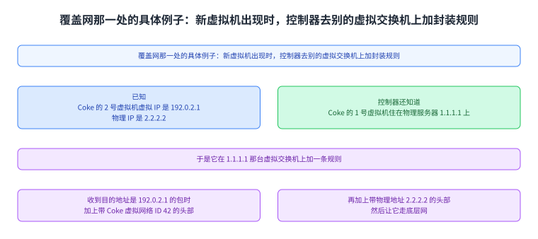
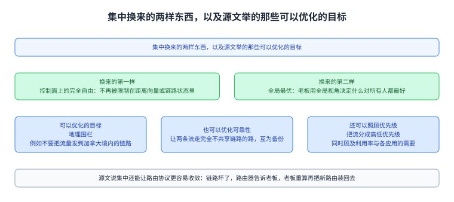
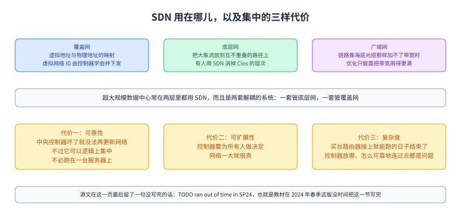

+++
title = "软件定义网络：把控制权收到一个大脑里"
lecture = 41
slug = "software-defined-networking"
status = "draft"
source_kind = "textbook"
source_url = "https://textbook.cs168.io/datacenter/sdn.html"
source_title = "Software-Defined Networking"
output_mode = "explanation"
+++

> 来源课程：UC Berkeley CS168 Computer Networks（教材 CS 168 Textbook）；
> 对应内容：Datacenters 之 Software-Defined Networking（<https://textbook.cs168.io/datacenter/sdn.html>）；
> 上游许可：教材站在站根页声明 CC BY-SA 4.0（第二人复核见 `docs/audit/license-cs168-second-review.md`）；
> 本文由 CourseLingo 原创撰写：**按该节的推进顺序**重新讲解，关键句给出英文原文与中译，**不逐句全译**，配图全部自绘、不转载原图；
> 本文非官方材料，CourseLingo 与 UC Berkeley 及课程教学团队无隶属关系；如与原文有出入，以原文为准。

## 一、这一讲要解决什么问题

源文从上一段留下的问题问起：前面我们已经把[[term:routing]]路由[[term:protocol]]协议改造得能在数据中心里用了（源文举的例子是等代价多路径），那如果还想针对自己网络特有的约束与用法继续优化呢。源文的回答是标准路由协议可能就不够用了，于是它介绍软件定义网络：

> In this section, we'll explore software-defined networking, a totally new paradigm for thinking about routing and network management. In the context of routing, the SDN architecture involves having a centralized control center compute routes and distribute them to individual routers.

中译：本节要看的是一种全新的做法，用来重新思考路由与网络管理；在路由这个语境里，SDN 的[[term:architecture]]架构是让一个集中的控制中心算出路由，再把它们分发到各台[[term:router]]路由器上。源文说它会讲 SDN 在数据中心与广域网里各是什么样子，也会讲这套新做法的好处与代价。

按仓内清单，这一讲是 `/datacenter/` 那一段里管控制与编排的那一讲，而它处理的是前面几讲共同的瓶颈：不管地址怎么分配、拓扑怎么组织，每一台路由器都得自己去算、自己去配这个事实没变过。

图里上面是前面几讲各自解决了什么，中间是这一讲要动的那个前提（每台路由器自己算、自己配），下面一格是它的做法（集中算好再分发到各台路由器）。

## 二、SDN 的来历：一开始是为了治管理面

源文交代了一件容易被忽略的事：SDN 这个做法最初并不是为了路由，而是对管理面上的麻烦做出的反应。它先说明管理面为什么重要：路由器本身什么也做不了，总得有人去配置它们（例如给[[term:link]]链路定代价）、告诉它们该跑什么路由协议，而且还需要它们上报错误，网络才能持续运行；而历史上这些管理工作大量靠人工完成。源文说，管理面这么重要，可它得到的创新关注却相对很少：控制面上我们见过很多种路由协议，而配置与控制路由器的方式演化得慢得多。

演进的方向是把人工操作写成脚本。源文说，互联网历史上出现过缓慢的转变，人们开始用脚本以编程方式与网络交互：脚本把运营者本来手工做的事写成代码（而谈不上多少智能），例如自动完成给网络新增路由器与链路的流程；一个修复脚本可能这样写，如果某台路由器出故障，先确认它真的故障了，重启它，如果还没修好就上报给运营者。但源文说，即便如此，这些管理系统长期以来仍是网络运维的瓶颈：每次新增一台路由器，我们可能还是得等人工介入。

接着是几条时间线。2005 年 Albert Greenberg 等人的一篇论文这样描述问题：

> Today's data networks are surprisingly fragile and difficult to manage. We argue that the root of these problems lies in the complexity of the control and management planes.

中译：今天的数据网络脆弱得令人意外、也难以管理；我们认为这些问题的根源在于控制面与管理面的复杂度。源文说，针对这些问题的思考最终导向更激进的提议，也就是重新设想路由器的根本设计：这些概念最早在 2003 年被考虑，当时没引起多少注意；对网络管理的沮丧加速了新做法的开发，到 2008 年势头更足，并催生了 OpenFlow [[term:switch]]交换机接口；到 2011 年，业界显然已经在往这个方向走，几家主要运营商（Google、Yahoo、Verizon、Microsoft、Facebook）与设备厂商（Cisco、Juniper、HP、Dell）共同成立了 开放网络基金会；而开发 OpenFlow 接口的那家专注 SDN 的创业公司 Nicira，在 2012 年是一家估值 4000 万美元的公司。

图里上面是管理面为什么重要与它长期靠人工这件事，中间是脚本化这一步（自动加设备、故障修复脚本），下面是源文给的那条时间线（2003 起念、2005 那篇论文、2008 催生 OpenFlow、2011 成立开放网络基金会、2012 Nicira 的估值）。

## 三、路由器为什么难创新

要重新设想路由器的设计，先得看清现实里的约束。源文说，如果你的网络需要一台路由器，你大概会从 Cisco 或 Juniper 这样的主要设备厂商那里买；而为了保证各家的路由器能互通，所有主要厂商都按某些预先定义的标准来造路由器。

这套生意模式让创新与实验变得困难。源文列了三条：想出新路由协议的人得先让标准组织批准，而那可能要好几年，批完还得等厂商把制造流程改到符合新标准；标准面向所有人，如果你有一个只有自己才有的问题，你的解法大概不会被标准组织采纳，而厂商要做满足所有人需求的路由器，不会为没人要的需求专门实现（反过来，别人的问题也可能被塞进你买的路由器里，让你并不需要的功能把你的网络搞复杂）；想做实验也没办法，因为厂商不愿意为某一个客户造可能根本不成产品的实验性设备。

除了标准化，还有一条障碍是垂直集成：你买来的那台路由器，三个面的功能都已经焊在芯片上了，没有任何模块化让你单独把控制面换掉。

图里上面两格是两条障碍（标准化让新协议要等好几年、也让定制与实验都难；垂直集成把三个面焊在芯片上），中间三格是三个面各自的标准化程度与创新速度，下面一格是源文自己给的总结。

## 四、把路由器拆开：三个层次

源文把上面那些障碍推到一个激进的想法上：把路由器拆开，也就是按抽象层次把几个面分开，于是可以分别买数据面与控制面的功能，各层就能独立变化。要拆就得有层间的接口：在垂直耦合的路由器里，我们不用关心数据面与控制面怎么对话；可一旦数据面是单独买的、而我们想在上面设计自己的控制面，就需要一个与数据面交互的接口。

更激进的一步是不再按「路由器」来想这三个面，而是设计一套天然把数据面与控制面分开的系统架构。源文把它分成三层。最底下是商品网络设备，可以理解成只买数据面：它们从控制程序那里（经由网络操作系统）接收指令，然后照指令转发；它们完全不必考虑路由协议，因此可以更便宜。中间是网络操作系统，可以理解成连接数据面路由器与控制程序的接口：它把路由器抽象出来（例如抽象成一张图）交给上面的控制程序，控制程序把路由指令发下来时不必操心怎么去编程某一台具体的路由器，而网络操作系统负责把这些指令落到各台路由器上。最上面是控制程序：可以理解成单独买或自己实现控制面，运营者从网络操作系统那里拿到网络的抽象（例如图），用它写出自己的路由协议，算出的路由再交给网络操作系统去下发。

图里从下到上是三层各自是什么、以及层间的接口关系：设备只按指令转发，网络操作系统把路由器抽象成图并负责下发，控制程序拿到图抽象、写出自己的路由协议再算路由。

## 五、OpenFlow：用流表描述转发

接下来是这套架构的具体接口。源文说 OpenFlow 是一个与路由器数据面交互的接口：运营者把自己的代码写在路由器之外，用它算出网络里的路由，然后把路由编程进转发芯片；这跟传统路由器不一样，后者的控制面就在路由器里、也没有一个清楚的接口让你把自定义路由编进芯片。

OpenFlow 定义的抽象是流表，可以理解成转发表的推广版：每张流表由键值对组成，键说明拿[[term:packet]]包去匹配什么（可以是目的前缀、精确的目的地址、一个五元组，或者别的比较简单的匹配），值说明匹配上之后要执行什么动作（可以是像转发表那样把包送去下一跳，也可以是更花哨的动作，例如加一个额外的[[term:header]]头部）。

输出格式是一串带编号的流表（表 0、表 1、表 2 等等），每张表有各自的匹配-动作条目，这些表被编程到转发芯片上。包到了之后，它按顺序被拿去与每张表比：比中时我们先把对应的动作记下来（此时并不执行）；等比完最后一张表，才把记下来的动作一起施加到包上。源文还提到一类特殊动作，可以跳到后面的表，用来写这样的规则：如果源端口匹配这个数，就跳到表 5 去设置额外的动作。

不过自由度受硬件限制。源文说运营者可以跑任何代码来生成流表，流表也可以比「目的地址加下一跳」更一般，但生成出来的匹配-动作规则仍受专用转发芯片的限制：芯片是为速度优化的，大概处理不了「如果 TCP 载荷是英文就设置这个动作」这类复杂匹配。因此实践里看到的流表与我们已经见过的那些表相当像：常见的匹配规则包括对 IP 目的地址做最长前缀匹配、用五元组识别一条流、以及对封装头部（例如 MPLS）做精确匹配。

那既然规则差别不大，为什么还要用 OpenFlow。源文的回答是：主要好处是它让运营者在控制面上有完全的自由，不再被限制在距离向量或链路状态（例如 BGP 与 OSPF）这两类协议里。

图里上面是流表的键值结构（键说明匹配什么，值说明做什么动作），中间是带编号的流表序列与「按顺序比、先记录、最后一起施加」的流程，下面是硬件限制与实践里常见的三类匹配规则，最后一格说明用它换来的自由。

## 六、流量工程，以及为什么要集中

有了灵活的控制面，就能做流量工程，也就是比标准的分布式协议更聪明地安排流量。源文用两个例子把这件事讲透。第一个例子里有两条连接，S1 到 D 是 10 Gbps、S2 到 D 也是 10 Gbps：如果只跑标准的最少代价路由，两条流都会走下面那条路，于是下路拥塞（10 Gbps 的链路要扛 20 Gbps），而上路的带宽就在那儿空着。更聪明的安排是让 S1 走上面、S2 走下面，也就是故意让一些包走更长的路，换来全网带宽更好的利用。算法上可以把最少代价路由改成「在有足够容量的最短路上走」，容量也可以换成别的约束（例如时延），源文给这个算法起的名字是受约束的最短路径优先（cSPF）。

第二个例子把数字换了：S1 需要 12 Gbps、S2 需要 8 Gbps。cSPF 会把两条流放在不同的路上，可 S1 要在一条 10 Gbps 的链路上发 12 Gbps。于是流量工程再进一层：把一条流拆到多条路上，S1 的 10 Gbps 走上路、剩下的 2 Gbps 走下路。要把拆分做出来，用前面那套接口的办法是封装：在发送端加规则给包加一个额外的头部，让一部分包带上标签 0、其余的带标签 1，这个标签就决定它走哪条路；然后在下一跳那台路由器上加简单规则，把标签 0 的包往上送给 R2、标签 1 的往下送给 R3。

接着源文解释集中到底买到了什么。集中能做出全局最优的决定：分布式协议里每台路由器都在为自己做最好的选择，而那未必对别的路由器最好；集中之后，那个「老板」能用它对全网的全局视角，决定什么对所有人都最好，再让路由器照办。源文给的例子是有两条流，S1 到 D 是 20 Gbps、S2 到 D 是 100 Gbps，并假设还不支持把一条流拆到多条路上。假设 20 Gbps 的那条先开始，用 cSPF 它可以选下面那条路，从 S1 自己的角度这是局部最优的（上下两条路一样好）；后来 100 Gbps 的那条开始了，此时它找不到任何一条路能满足需求（上路 20 Gbps、下路 80 Gbps，都不够）。源文点出关键：每台路由器都是各自独立做决定、没有协调。换成集中控制器之后，它能看着全网结构与各条流的需求，把路径分得更聪明，于是决定是全局最优的、网络效率也更高。源文还说，集中之后能优化的东西不止利用率：可以把流分成高优先级与低优先级，同时照顾网络利用率与不同应用的需要。

图里上面是第一个例子（两条 10 Gbps 的流都走下面会把 10 Gbps 的链路压到 20 Gbps），中间是第二个例子（12 与 8 Gbps 时要把一条流拆开，用标签 0 与标签 1 决定走哪条路），下面是集中之后那个 20 与 100 Gbps 的例子（先到的那条按局部最优占了路，后到的那条就没有任一条路够用），最后一格说明集中的意义是全局视角。

## 七、SDN 用在哪里，以及集中的代价

源文最后把 SDN 放到几处真实场景里，并交代了它在管理面上的位置与它的代价。

在数据中心的覆盖网里，虚拟交换机靠封装把覆盖网与底层网连起来：给一个虚拟地址，加一个带着对应物理地址的头部，包就能在底层网上走。可虚拟地址与物理地址的映射从哪来，虚拟网络 ID 又该用哪个。源文说，一个集中的 SDN 控制器可以解决这两个问题：每个租户可以有自己的控制器，一台新虚拟机被创建时 SDN 会知道它的虚拟地址与物理地址，然后去更新其它虚拟交换机上的转发表、加入带这条新映射的封装规则。它给的例子是：假设 Coke 的 2 号虚拟机被创建，虚拟 IP 是 `192.0.2.1`、物理 IP 是 `2.2.2.2`，而 SDN 知道 Coke 的 1 号虚拟机住在物理服务器 `1.1.1.1` 上，于是它可以去那台虚拟交换机上加一条封装规则，收到目的地址是 `192.0.2.1` 的包时，加上带 Coke 虚拟网络 ID `42` 的头部与对应物理地址 `2.2.2.2` 的头部，然后让它走底层网。

这样做的好处有三条：它把覆盖网与底层网干净地分成两个可独立扩展的层次，底层网因此可以保持简单、不必去想虚拟化与多租户；集中给我们一个简单的办法在终端主机上实现控制面，不必写复杂的路由协议（控制器知道有新主机就更新其他主机，否则可能需要一套复杂的分布式机制来决定该加什么头部）；它也说明了覆盖网为什么能扩展得好：某个租户的控制器只需要知道这个租户自己的虚拟机，而在传统架构里，Coke 的一台新虚拟机可能得被通告给所有其它虚拟机，连 Pepsi 的虚拟机也不例外。

在数据中心的底层网里，源文说它其实就是一张物理网络，只是拓扑特殊；像「把链路利用率做高」这类通用问题它也有，所以 SDN 同样能用在底层网上，例如让小鼠流走时延小的链路、让大象流走高带宽的链路。在底层的 Clos 网络里，按流做负载均衡（把五元组做哈希来选路）仍可能把多条大象流放到同一条路上；就算两条大象流走了不同的路，那些路也可能共用链路而造成拥塞。SDN 控制器可以通过协调、把它们放到互不重叠的路径上。源文还提到一篇 2022 年的 Google 论文：用 SDN 更聪明地转发，从而消掉 Clos 网络里的层次（更少的链路、更便宜的数据中心）。它说超大规模数据中心常常在覆盖网与底层网里都用 SDN，而且两者通常实现为解耦的两套系统：一套 SDN 想底层网的事，另一套 SDN 想覆盖网的事。

在广域网里，SDN 在带宽利用率很关键时同样有用。源文的例子是：如果前面流量工程例子里那些 10 Gbps 的链路是海底光缆，那就没有便宜的办法去加带宽，优化也就只能集中在如何把手里这些带宽用得更满。

然后是代价。源文说集中不是免费的，它列了三样。第一样是可靠性：传统网络里一台路由器坏了，路由协议会绕着故障收敛、其他路由器会把流量改走别的路；可中央控制器坏了，我们就没有办法再更新网络，路由器也不知道该怎么应变。源文在这里补了一个很重要说明：图里把控制器画成一个实体，但它不必跑在一台服务器上，控制面的计算可以分布在多台服务器上、由它们协调着做到逻辑上集中，这与原来那个「路由器之间协调但各自做分布式决定」的模型不同；这样能避免硬件上的单点故障，不过控制器作为逻辑单元仍然可能失效（例如代码里有 bug）。第二样是可扩展性：控制器要为所有人做决定，网络一大就很贵，而传统网络里每台路由器只需为自己算。第三样是不同种类的复杂度：传统网络里买台路由器接上就大致能跑，而有了中央控制器就多了基础设施上的麻烦，控制器放在哪、怎么可靠地连到各台路由器。源文说这是一个活跃的研究领域，并提到 Berkeley CS 168 的两位授课教师 Sylvia Ratnasamy 与 Rob Shakir 有一个相关项目。

最后一节回到开头。源文说，我们前面看的是把 SDN 当成实现控制面的新办法，而最初促成 SDN 的那些沮丧其实发生在管理面；结果发现，SDN 在控制面上用的许多设计思路也可以用到管理面上，例如它依赖定义良好的、可编程的接口（OpenFlow 就是一例）。这一节的正文到此为止，source 页上留下了一句没写完的话：`TODO ran out of time in SP24.` 也就是说，教材在 2024 年春季这一版里没时间把这一节写完。我们照实说明它空缺，不代教材补内容。

图里上面三格是 SDN 的三处用法。覆盖网那格是映射与虚拟网络 ID，底层网那格是把大象流放到不重叠的路上、甚至消掉 Clos 的层次，广域网那格是像海底光缆那样加不了带宽的场合。中间一格是超大规模数据中心里那两套解耦的 SDN。下面三格是集中的三样代价，以及源文那句「逻辑上集中」的说明。最后一格是源文在这页留下的那句 TODO。

## 读完应该能回答

1. 源文说数据面、控制面、管理面各自的标准化程度与创新速度是什么样，垂直集成又难在哪里？
2. 拆开路由器之后的三层各是什么，网络操作系统为什么要给上面一张图的抽象？
3. OpenFlow 的流表里键与值各放什么，包经过一串编号的表时动作是什么时候被执行的？
4. 流量工程在 12 与 8 Gbps 那个例子里为什么要拆开一条流，而集中控制为什么能给出全局最优的决定？

## 脉络回顾

这一讲是 `/datacenter/` 那一段里管控制与编排的一讲。往前看，这一段把数据中心这个场景从几个角度拆开看过：第 36 讲看拓扑与它带来的约束，第 37 讲看这个场景里的拥塞控制（排队延迟成为主导，于是小鼠会被大象堵住），第 38 讲看路由，第 39 讲看地址怎么按拓扑分配，第 40 讲（另一位作者那一讲）看虚拟化与覆盖网。而这一讲动的是前面这些讲共同的前提：不管拓扑怎么组织、地址怎么分、协议怎么改，控制面始终是每台路由器各自算、各自配的。SDN 把这一步反过来：让一个集中的控制中心算出全部路由，再分发下去。

最要紧的转折在接口。源文没有停留在「集中更好」这种说法上，而是先把路由器难创新的原因讲清楚（标准化要等好几年、垂直集成把三个面焊在芯片上），然后把「拆开」落到一个具体的抽象上：用流表这种推广版的转发表来描述转发规则，让运营者的代码可以完全写在路由器之外。这样一来，控制面从设备里被拿出来，变成了可以自己写的程序；而「集中」也就有了落点，它依赖于这个接口，因为下发路由需要路由器愿意接受外来的指令。

这一讲留下的问题正好是下一段要处理的：集中带来了可靠性、可扩展性与基础设施上的代价，源文说这是活跃的研究领域，并点了两位任课教师的项目；而它最后那节还没写完，只留了一句 `TODO ran out of time in SP24.`。按仓内清单，这一讲之后还有主机联网等几讲，而这一讲提到的那两套解耦的 SDN（一套管底层网、一套管覆盖网）已经在把「控制」这件事本身当成一个要设计的系统了。

## 溯源

- **字段核对**：`docs/lecture-manifest.md` 第 41 行为 `software-defined-networking` / `Software-Defined Networking` / `/datacenter/sdn.html`（本讲字段由我从 manifest 读出）；抓页时 `<title>` 与 H1 都是 `Software-Defined Networking`。两处一致；目录 `content/41-software-defined-networking/`、`lecture = 41`。
- **源文件与范围**：该页 HTML 共 52,985 字节（首次即 200），正文锚点 `#main-content`，实测 15 个二级小节，`TODO` 标记 1 处（正文最后一句 `TODO ran out of time in SP24.`，位于「SDN in the Management and Data Plane」一节末）。本页把它照录并说明教材没写完，没有代补。本页把 15 节归并成七节。
- **配图：独立 4 张、连播 12 帧（共 16 张），16 张全部下载成功；本次逐张看过 2 张，都是独立图，且都是原分辨率、没有用缩放版**：`6-063-vertical-integration`（垂直集成与标准化的那张）与 `6-076-sdn-overlay`（覆盖网那部分）。没看的是 14 张：另外 2 张独立图（`6-077-sdn-underlay`、`6-078-sdn-paper`）与三段连播的全部帧（`6-064`/`6-065` 是 sdn1–sdn2 两帧，`6-066` 到 `6-069` 是 openflow1–openflow4 四帧，`6-070` 到 `6-075` 是 engineering1–engineering6 六帧）。按惯例我本该看每段连播的首末帧并抽查中间帧，这一轮我没有做到：本讲源页很大（26,382 字符、15 节、16 图），而我这一轮可用的上下文余量不足以再看 12 帧而不影响正文的写作与校验。这是我这一轮明确没做完的一件事，已报给派单方。
- **成对的数与跨讲自查**：其一，流量工程那几个数互相对得上，先是两条 10 Gbps 的流都挤到一条 10 Gbps 链路上（10 + 10 = 20，源文也这么写），接着是 12 Gbps 与 8 Gbps 那一对（10 + 2 把 S1 拆开，剩下的 8 走另一条，正好把两条 10 Gbps 的链路填满），最后是 20 Gbps 与 100 Gbps 那一对（上路 20、下路 80，单独一条都装不下 100，而两条合起来正好是 100）。这三组数是同一道题在三个容量下的版本，本页按同一对象处理。其二，源文里 Coke 2 号虚拟机的虚拟地址 `192.0.2.1` 与第 31 讲、第 33 讲里出现过的 `192.0.2.x` 不是同一个对象（那两讲是举例用的主机地址，这里是虚拟机的虚拟地址），本页没有把它们当作同一台机器。其三，源文说的五元组与第 33 讲 NAT 里的五元组是同一套东西（源 IP、目的 IP、协议、源端口、目的端口），已按跨讲同一对象处理。其四，小鼠与大象与第 37 讲是同一对概念，也已标明。
- **四种子形态的覆盖面（本讲）**：其一 方向词：核了三处，「让 S1 走上面、S2 走下面」与「故意让一些包走更长的路」（方向与前面「都走下面导致拥塞」自洽）、「标签 0 的包往上送给 R2、标签 1 的往下送给 R3」、以及 OpenFlow 的「比中时先记下动作、等比完最后一张表再施加」；其二 等号两边：本讲没有「必须改写成它自己」这类恒等式，无对象；其三 说 N 项列 M 项：核了三处，「三个面」后面对应三个面，源文自己的总结句也正好三项（数据面标准化、控制面标准化、管理面其实不太标准化）；「五元组」是五个字段；「集中的三样代价」在源文里也正好列了三样（可靠性、可扩展性、复杂度）；其四 例子合不合自家判据：上面那三组容量数字我都按源文自己的规则核过（10+10=20 会压满；12 与 8 需要拆流；20 与 80 都装不下 100，而两条合起来正好 100），未发现不合判据的例子。
- **术语 grep 的结果**：本讲英文原词里 `OpenFlow`／`SDN`／`cONF` 一类（`ONF`／`Nicira`／`cSPF`／`MPLS`／`overlay`／`underlay`／`flow table`）逐个在所有已提交页面 grep 过（`-i`，含键）：这些词此前只在本页与第 40 讲一带出现，多数没有对应的键；按派单方的判据（没有键就写纯文本），本页对这些词一律用纯文本。结论：本讲不新增词条。
