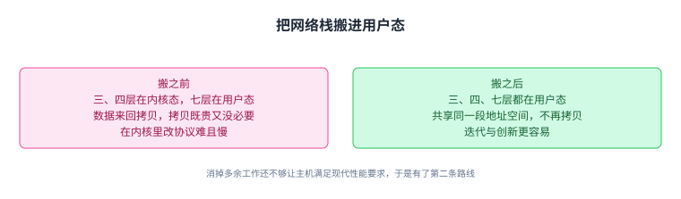
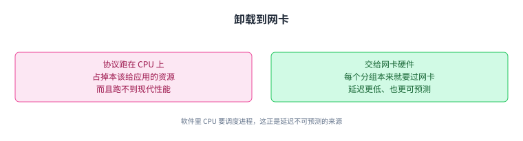
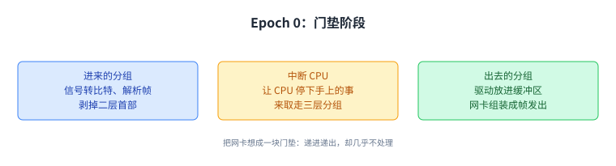
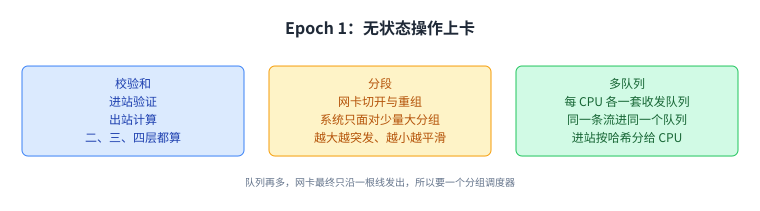
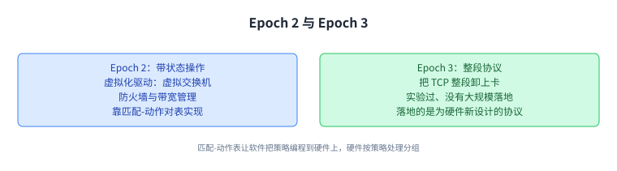
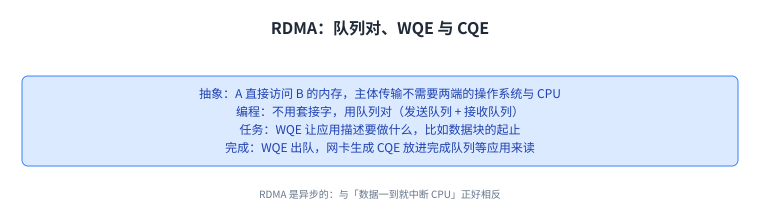
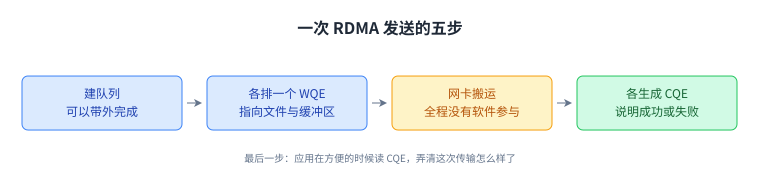

+++
title = "主机侧网络：把瓶颈从网络里挪出来"
lecture = 42
slug = "host-networking"
status = "draft"
source_kind = "textbook"
source_url = "https://textbook.cs168.io/datacenter/host-networking.html"
source_title = "Host Networking"
output_mode = "explanation"
+++

> 来源课程：UC Berkeley CS168 Computer Networks（教材 CS 168 Textbook）；
> 对应内容：Datacenters 之 Host Networking（<https://textbook.cs168.io/datacenter/host-networking.html>）；
> 上游许可：教材站在站根页声明 CC BY-SA 4.0（第二人复核见 `docs/audit/license-cs168-second-review.md`）；
> 本文由 CourseLingo 原创撰写：**按该节的推进顺序**重新讲解，关键句给出英文原文与中译，**不逐句全译**，配图全部自绘、不转载原图；
> 本文非官方材料，CourseLingo 与 UC Berkeley 及课程教学团队无隶属关系；如与原文有出入，以原文为准。

## 一、瓶颈换了个地方

前面一整段都在网络内部下功夫：拓扑、路由、拥塞控制。这一讲要解决的是另一端的问题，当网络本身够快时，卡住的会是端主机。

传统上，网络的瓶颈在网络基础设施里，而不在端主机。但在现代高性能数据中心里，性能需求一路抬高，端主机开始跟不上。

> "In particular, the CPU running network protocols like TCP is no longer able to deliver the high performance that the datacenter needs."
> （尤其是，跑 TCP 这类网络协议的 CPU 已经无法交付数据中心需要的性能。）

教材给了两条具体的难处。一是 CPU 很贵：把高性能交付出来，意味着 CPU 把所有时间都花在跑网络协议上，留给真正应用的资源变少。二是我们一直在用的那些[[term:protocol]]（比如 IP 与 TCP）本身也不再能满足现代的性能需求。

于是有了**主机侧网络（host networking）**：它指的是在[[term:end-host]]上做优化，而不是在网络内部做优化，和前面几讲的着力点正好相反。

两条路线的关系是递进而不是并列：先把多余的工作消掉，再把工作交给更合适的硬件。

## 二、优化一：让网络栈与应用共享用户态内存

要把优化落在哪里，先得看清端主机里各层都在哪。第一层与第二层由网卡（NIC）上的硬件实现；第三层与第四层由操作系统里的软件（也就是 CPU）实现；第七层就是应用自己。

接着要回忆一个来自先修课的事实：现代计算机有虚拟内存，每个应用都有自己独立的地址空间，彼此隔离，第七层的每个应用都拥有用户态里的一段独立地址空间；而操作系统本身跑在内核态，那是用户态应用碰不到的一块特殊内存。

这套内存管理模型带来两个麻烦。一是来回拷贝：把分组沿栈往下送时，数据不断从用户态拷到内核态；往上收时又不断从内核态拷回用户态。教材对它的评价很直白，拷贝比特既昂贵又没什么意义。二是内核里难编程：如果想改 TCP 来适配自己的需求，就得钻进操作系统、在很低的层面写代码，部署与测试都比用户态更麻烦、更慢。

> "To solve these two problems, we can move the networking stack (e.g. Layer 3 and 4 protocols) out of kernel space, and into user space."
> （为了解决这两个问题，我们可以把网络栈，比如第三层与第四层的协议，搬出内核态，搬进用户态。）

搬过去之后，第三、四、七层就能共用同一段地址空间，不再需要来回拷贝；在用户态里迭代与创新也容易得多。教材同时诚实地加了一句：这样做消掉了一些多余的工作（比如来回拷贝），但仍然不够让主机满足现代性能要求。

省掉拷贝解决的是「白干的活」，而没有解决「谁来干得够快」，这正是第二条路线要接手的。

## 三、优化二：把网络栈卸到网卡上

第二条路线是卸载。理由还是那两条：CPU 跑不快网络协议，而且用它跑协议会占掉本该给应用的资源。那么办法就是把网络栈从 CPU（软件）搬到网卡（硬件）上。

网卡是个自然的落点：每个[[term:packet]]都必须经过网卡，所以它可以顺手多做一点处理，从而省下 CPU 的工作。这里有一个必须记住的角色：网络驱动，操作系统里那段用来编程并管理网卡的软件，它向外提供一个 API 供上层程序与网卡交互；教材把它形容成硬件与软件之间的桥。

卸载的好处，教材列了三条。一是把 CPU 资源让给应用。二是专用硬件可以比通用 CPU 更高效，这里的效率同时指速度与功耗。三是延迟：硬件处理的延迟更低，而且更可预测、更一致；软件跑起来时 CPU 要调度不同进程，会引入不可预测的延迟（比如手上正处理的任务得先干完，才能轮到你这个分组）。

「延迟更可预测」这一条最容易被忽略，而它对需要协同的负载往往比平均延迟更要紧。

## 四、Epoch 0：卸载之前，网卡只当门垫

卸载不是一步到位的。教材把这段历史分成几个纪元，越往后卸到网卡上的操作越复杂。

Epoch 0 是「还没有卸载」时的样子。网卡上有一个中央控制器处理器负责卡上的运作。对进来的分组：收发器把电信号转成数字信号（0 与 1）放进缓冲区；网卡从缓冲区读比特、按以太网（Ethernet）帧解析、做帧处理（比如校验和验证）、剥掉第二层首部；最后网卡产生一个中断，让 CPU 停下手上的事来取走那个第三层分组继续处理。对出去的分组：网络驱动把分组放进缓冲区，网卡读比特并组装成以太网帧，交给收发器把数字比特转回电信号。

> "In the standard networking stack, you can think of the NIC as a doormat that passes incoming packets to the OS, and sends outgoing packets for the OS, but performs very minimal processing on those packets."
> （在标准网络栈里，可以把网卡想成一块门垫：把进来的分组递给操作系统、把出去的分组送出去，但对这些分组只做极少量的处理。）

「门垫」这个比喻值得记住，因为后面几个纪元讲的全是「门垫开始自己干活」。

门垫这个词把 Epoch 0 的定位说清了：它什么都能过，但几乎什么都不做。

## 五、Epoch 1：先卸**无状态**的操作

第一个纪元卸的是简单、无状态的操作：它们可以逐分组独立完成，网卡不需要跨分组记住任何状态。教材举了三类。

一，校验和计算。不只是第二层的，第三层与第四层的校验和也能交给网卡：对进来的分组做验证，对出去的分组做计算，CPU 因此不用管。

二，分段。在标准模型里，应用要发一个大文件时，由操作系统负责切成小分组；到了接收端，再由操作系统重组。改成让网卡负责切开与重组之后，操作系统面对的就是少量大分组，而不是一大堆小分组，效率更高（比如要处理的首部更少）。这里有一个取舍：应用交给网卡的分组越大，CPU 的活越少，但网卡收到的是突发的大块数据，连接更「一阵一阵」；交给网卡的分组越小，CPU 的活越多，但网卡收到的是更平稳的数据流，连接更平滑。聚合还会带来一些具体难题：中间某个分组丢了怎么办（网卡可能只能把一堆小分组原样上交，没法合成一个大分组）；某些分组带了标志（比如用于拥塞的 ECN）而另一些没带，合成之后那个标志该置还是不该置。

三，多队列支持。标准模型里网卡只有一个发送队列与一个接收队列，所有应用共用；负载均衡的活儿由软件里的网络驱动负责。卸载之后，网卡可以有多个发送队列与多个接收队列，比如在多处理器系统里，每个 CPU 拥有自己的收/发队列；网卡并行维护这些队列，保证不同 CPU 之间的隔离与负载均衡，也可以让某些队列优先于其他队列。

不过队列再多，网卡最终只能沿一根线把分组发出去，所以它需要一个分组调度器来决定下一个从哪个队列发；调度器可以被编程，以实现想要的均衡行为。多队列还有一个挑战是把分组映射到队列：某个 CPU 要发数据时该用哪个队列。这里的关键要求是同一条流的所有分组必须进同一个队列，否则它们会被打散、无法保证按序发出；而 TCP 里乱序虽然能用，却会伤性能（接收方得缓冲乱序分组）。处理进来的分组时，网卡可以哈希这个分组来决定交给哪个 CPU，然后中断那个 CPU 去处理，教材特别指出，这种按哈希的行为与 ECMP 很像（也就是第 38 讲那套等代价多路径里的做法），目的同样是让同一条流的分组被同一个 CPU 按序处理。

三类操作的共同点是逐分组独立，所以网卡不需要跨分组记忆，实现起来最轻。

## 六、Epoch 2 与 3：**有状态**操作，以及整段协议

到了 Epoch 2，卸到网卡上的操作开始变得复杂，而且带状态。这一纪元的驱动力来自数据中心的虚拟化：同一台物理服务器上跑多个虚拟机，于是需要一个虚拟[[term:switch]]把进来的分组转给对应的虚拟机，教材此前把虚拟交换机画成软件，它同样可以用硬件实现。防火墙与[[term:bandwidth]]管理是另一类有状态卸载：软件里可以写一条防火墙规则（比如丢弃来自某个恶意 IP 的所有入站分组），也可以做用户间的带宽管理（比如用户 A 每分钟只能发 100 个分组，超出的丢弃）；这些策略同样可以交给硬件检查。

实现这类有状态操作，可以用匹配-动作对表（match-action pair table），教材说它与 SDN 那一节里的 OpenFlow 表很像：这套 API 让软件把不同策略编程到硬件上，由硬件按策略处理分组。匹配的可以是五元组（与第 38 讲 ECMP 用的那个五元组是同一条）或其他首部字段，动作可以是丢弃分组、[[term:forwarding]]到某个下一跳、或者修改[[term:header]]。

Epoch 3 是我们正在经历的纪元：把整段协议（比如 TCP）从操作系统卸到网卡上。驱动力是更高的性能要求，尤其是 AI 与机器学习这类应用。理想状态是让应用直接把数据交给硬件，由硬件完成第四、三、二、一层所需的全部网络处理，操作系统整个不参与。教材如实说明：把标准协议（比如 TCP）卸到网卡上的尝试有过一些实验，但没有大规模部署；真正落地的是为硬件实现而新设计的协议，也就是 RDMA。

到了这一层，卸载已经不只是「省 CPU」，而是把策略与状态一起搬到了硬件里。

## 七、RDMA：让网卡直接读写对方的内存

RDMA（Remote Direct Memory Access，远程直接内存访问）提供的抽象是：服务器 A 可以直接访问服务器 B 的内存，两端都不需要操作系统与 CPU 参与；它可以直接用硬件实现，取代标准的 TCP/IP 软件网络栈。

教材用传一个 10 GB 文件来对比。标准网络栈下：CPU 从内存读出文件、做处理（比如 TCP/IP）、把分组交给网卡；接收端的网卡把分组交给 CPU，CPU 处理完再把文件载荷写进内存，注意这个 10 GB 文件里的每一个分组，CPU 都参与了处理。RDMA 下：网卡从内存读出文件并发出去，不涉及 CPU；接收端的网卡处理进来的字节并写进内存，同样不涉及 CPU。

（就地说明） 原文在给 RDMA 下定义时写的是「两端都不需要操作系统与 CPU 参与」，而同一节紧接着又写「开头建立传输与结尾收尾仍然需要 CPU，但 10 GB 文件的主体传输不需要」。后一句是对前一句的收窄，教材的配图也写的是「CPU 参与极少」。我们按收窄后的说法叙述，并在此说明。

用 RDMA 编程不再使用套接字抽象，主要抽象变成**队列对（queue pair）**。发送工作队列里放着所有「我要把数据发给别人」的待办任务，接收工作队列里放着所有「我要从别人那里收数据」的待办任务。一块网卡可以有多个队列对，各自提供不同的服务：比如某一对提供可靠有序的投递，另一对提供不可靠投递；其中配置为可靠有序的那一对，最接近传统的 TCP 连接。

队列里的每个元素叫**工作队列元素（WQE）**，它让应用描述要做什么工作。用大白话说，接收队列里的一个 WQE 可能写着「从远端服务器的地址 0xffff1234 取 100 MB，写到我本地内存的地址 0xffff7890」；落到代码里，WQE 就是一个装着这些指令的结构体，比如一个指向接收数据要写到哪里的指针。这个抽象给了 RDMA 一个比 TCP/IP 更高的视角：在 TCP/IP 栈里网络只看到一条字节流，而 WQE 让应用能把任务描述得更细（比如指明要传输的数据块的起止）。

任务完成时，WQE 出队，网卡另生成一个**完成队列元素（CQE）**描述这个任务的结果（成功或失败），放进完成队列里等着，直到应用有空来读。这也说明 RDMA 是异步的：应用可以随时往队列对里加任务，网卡按序处理；完成后 CQE 进完成队列，应用想什么时候读就什么时候读，与 TCP/IP 栈里「数据一到就中断 CPU 去处理」正好相反。

从「字节流」到「队列对加任务描述」，应用对网络的表达能力被抬高了一层。

## 八、一次 RDMA 发送的五步

教材拿一次 RDMA 发送操作走了一遍流程：服务器 A 从自己内存里读出文件、把数据传过去，服务器 B 把文件写进自己的内存。两端各自把自己内存的一部分划出来给网卡做 RDMA 传输用，A 把文件对应的内存标成网卡可读，B 把一块空白缓冲区标成网卡可读。

接下来是五步。第一步，两端建队列：两块网卡现在都有发送队列、接收队列与完成队列；教材注明这一步可以带外完成，也就是用 TCP 这类传统协议来协调两端。第二步，A 在发送队列里创建一个 WQE，里面是指向文件的指针；B 在接收队列里创建一个 WQE，里面是指向空白缓冲区的指针。第三步，两端都排好队之后，数据传输就可以发生，全程没有软件参与，网卡包办一切，包括可靠性与[[term:congestion-control]]。第四步，传输完成后两端的 WQE 出队，两块网卡各生成一个 CQE 说明传输完成并带上相关状态（比如错误信息）：A 的 CQE 说明发送成功，B 的 CQE 说明接收成功。第五步，应用在方便的时候读 CQE，弄清楚这次传输到底怎么样了。

五步里真正搬数据的是第三步，前后两步都是软件在准备与收尾。

## 九、RDMA 的代价、用武之地与两条实现路线

RDMA 的收益很明确：高性能数据传输（低延迟、高带宽），并把 CPU 让给应用。但它不是免费的：需要专用硬件与软件，整体比传统网络栈更复杂，别忘了 RDMA 是在取代 TCP/IP 栈，所以可靠性、拥塞控制这些功能都得在硬件里实现。

它还有一条重要的适用范围限定：RDMA 通常在两台服务器物理上离得近的数据中心里效果最好。如果两台服务器离得远，占主导的延迟来自数据穿越网络的时间，RDMA 省下的那点时间可以忽略；反过来，两台服务器离得近时，主机处理分组的时间可能才是主导，RDMA 省下的时间就很可观。

RDMA 已经用在许多需要高性能、低延迟计算的地方：科学研究、金融建模、天气预报、机器学习、搜索查询。在云计算里，它可以把一台大虚拟机从一台物理服务器迁到另一台，从而把 CPU 让给客户使用；在 AI 与机器学习训练里，RDMA 不只是省 CPU 与低延迟，还给出可预测的延迟，当多台服务器需要协同训练时，这一点很重要。

最后是它怎么实现。既然 RDMA 取代了 TCP/IP 栈，可靠性、拥塞控制这些就得由 RDMA 自己负责，而教材给出两种大致路线：一是把这些功能实现在网络里，比如把可靠性做在交换机上，这是 Nvidia 的 InfiniBand 的思路；二是把它们实现在网卡里，藏在队列对抽象之下，这是 Google 目前在做的事。两条路线下，软件侧的应用与操作系统都通过队列对得到「可靠、有序投递」的假象，区别只在于这份保证实际是怎么实现的。

两条路线都不改变软件看到的接口，改变的只是这份保证由谁兑现。

## 读完应该能回答

1. 为什么在高性能数据中心里瓶颈会从网络内部挪到端主机，教材给了哪两条难处。
2. 把网络栈搬进用户态解决了哪两个问题，为什么它自己还不够。
3. 卸载到网卡的三条好处分别是什么，其中「延迟更可预测」是怎么来的。
4. 四个纪元各卸了什么，同一条流的分组为什么必须进同一个队列；RDMA 用队列对与 WQE、CQE 取代了什么，又在什么条件下才划算。

## 脉络回顾

这一讲把视线从网络内部挪回端主机，而它是数据中心这一段里第一次不在网络里做优化。此前几讲都在网络侧使劲：第 36 讲用 Clos 与 Fat-Tree 把带宽做出来，第 38 讲用 ECMP 与多路径路由把多出来的路用起来，第 37 讲从拥塞控制的角度管理这张网；而这一讲指出，当网络足够快时，卡住的是主机，CPU 跑 TCP 跑不动，而 IP 与 TCP 本身也不再满足需求。

接着它给了两条路线，并且是层层加深的：先是把网络栈搬进用户态，消掉内核态与用户态之间的来回拷贝、让第三四七层共享地址空间，同时让迭代更容易；但教材自己承认这还不够，于是有了卸载。卸载的历史被教材拆成几个纪元：Epoch 0 只当门垫，Epoch 1 卸校验和、分段、多队列这类无状态操作，Epoch 2 卸虚拟交换机、防火墙、带宽管理这类有状态操作（靠匹配-动作表，与第 41 讲 SDN 里的 OpenFlow 表同源），Epoch 3 想卸整段协议。

最要紧的转折在 Epoch 3：把标准 TCP 卸到网卡上的尝试没有大规模落地，真正落地的是为硬件而新设计的协议，RDMA。它用队列对、WQE 与 CQE 取代套接字与字节流，把可靠性、拥塞控制这些原本属于运输层的工作搬进网卡或网络本身。这一讲里还留了两个后面能用的接口：网卡按哈希把分组分给 CPU 这件事，与第 38 讲的 ECMP 是同一套想法；而「把状态放进硬件、由软件编程策略」这件事，正是 SDN 那一讲的主题在主机侧的回响。

## 溯源

- 对应：UC Berkeley CS168 Computer Networks，教材 Datacenters 之 Host Networking（<https://textbook.cs168.io/datacenter/host-networking.html>）
- 教材：CS 168 Textbook（UC Berkeley CS168 课程教材），原文链接同上
- 授权依据：教材站在站根页声明 CC BY-SA 4.0；本文为本仓库原创中文讲解，按该节顺序重讲，关键句给出英文原文与中译，**未逐句全译**，配图自绘
- 结构说明：本讲章节顺序**跟随教材该节的推进顺序**（什么是主机侧网络 → 用户态共享内存 → 卸载到网卡 → Epoch 0 → Epoch 1 → Epoch 2 → Epoch 3 → RDMA → RDMA 例子 → RDMA 的利弊与应用 → 如何实现 RDMA）；教材的 Epoch 2 与 Epoch 3 各成一节，我们并成一节，把「一次 RDMA 发送的五步」并入 RDMA 一节；「利弊与应用」与「如何实现」并成一节，内容与顺序不变
- 照录并就地说明：原文 RDMA 定义句写「两端都不需要操作系统与 CPU 参与」，同节随后又写「开头建立传输与结尾收尾仍需要 CPU」，两者是绝对说法与收窄说法的关系；我们按收窄后的说法叙述并在正文说明
- 登记（核过但不算硬矛盾）：原文写「卸载的发展有三个纪元」，随后却用 Epoch 0、1、2、3 四节来讲。若把 Epoch 0 视为未卸载的基线，则被卸载的正好是三个纪元；原文没有点明这一点，我们照录节标题并在此登记
- 跨讲标明：本讲「网卡按哈希把分组分给某个 CPU」与第 38 讲的 ECMP 是同一套想法（原文也明确说与之相似）；「匹配-动作对表」与第 41 讲 SDN 里的 OpenFlow 表同源（原文亦如此说）
- 我们的归纳（源文没有明说）：把「网络侧优化 vs 主机侧优化」写成这一讲与前面几讲的分界；把两条优化路线收成「先消拷贝，再把工作交给硬件」这一条递进线