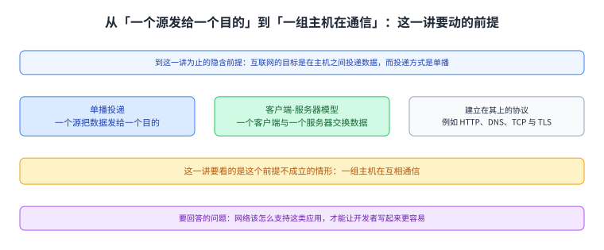
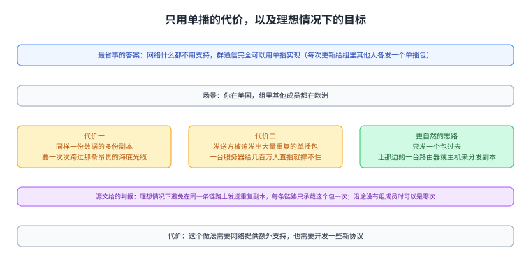
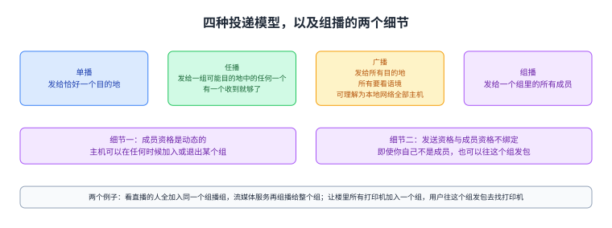
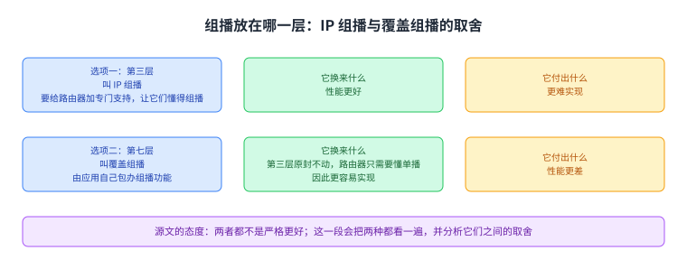

+++
title = "[[term:multicast]]组播：当通信的一方不是一个而是「一群」"
lecture = 43
slug = "multicast"
status = "draft"
source_kind = "textbook"
source_url = "https://textbook.cs168.io/beyond-client-server/intro.html"
source_title = "Multicast"
output_mode = "explanation"
+++

> 来源课程：UC Berkeley CS168 Computer Networks（教材 CS 168 Textbook）；
> 对应内容：Beyond Client-Server 之 Multicast（<https://textbook.cs168.io/beyond-client-server/intro.html>）；
> 上游许可：教材站在站根页声明 CC BY-SA 4.0（第二人复核见 `docs/audit/license-cs168-second-review.md`）；
> 本文由 CourseLingo 原创撰写：**按该节的推进顺序**重新讲解，关键句给出英文原文与中译，**不逐句全译**，配图全部自绘、不转载原图；
> 本文非官方材料，CourseLingo 与 UC Berkeley 及课程教学团队无隶属关系；如与原文有出入，以原文为准。

## 一、这一讲要解决什么问题

源文从这一路讲下来的一个隐含前提说起：

> In every topic we've seen so far, we've said that the goal of the Internet is to deliver data between hosts. In particular, we've assumed unicast delivery, which means that there is a single source, sending data to a single destination.

中译：到目前为止的每一个题目里，我们都把[[term:internet]]互联网的目标说成在主机之间投递数据；我们一直假设的是[[term:unicast]]单播投递，也就是一个源把数据发给一个目的。源文接着说，我们见过的许多协议（它举的例子是 HTTP、DNS、TCP 与 TLS）依赖客户端-服务器模型，而这个模型又建立在单播投递上：一个客户端与一个服务器交换数据，也就意味着它们在彼此之间发单播数据。

这一讲要处理的正是这个前提不成立的情形。源文说，互联网上的流量确实大多是单播，但有一些例外，也就是一组主机在互相通信的那些应用。它要回答的问题是：网络该怎么支持这类应用，才能让开发者写起来更容易。按仓内清单，这一讲开了新的一段（`/beyond-client-server/`），而它要动的就是「客户端-服务器」这个从第 27 讲到第 41 讲一直没被质疑过的形状。

图里上面是这一路一直假设的单播投递与它撑起的客户端-服务器模型，下面是这一讲要看的例外（有些应用是一组主机在通信），最后一格是这一讲要回答的问题。

## 二、群通信长什么样

源文给了一批具体的例子。常见的有：多人在线游戏；实时的内容分发应用（它举的例子是 Zoom 会议、体育赛事直播）；协作文档（它举的例子是 Google Docs）。除了这些，源文还说存在更少见的群通信用法，例如发现（给所有苹果设备发一条消息，好让你找到离得最近的那台音箱），以及 AI 训练（源文说这个后面会讲）。

紧接着源文指出为什么客户端-服务器这套在这里不自然：在一场多人游戏或一个视频会议应用里，既没有单独一个客户端，也没有单独一个服务器。于是问题就落在网络该怎么做支持上。

图里上面两格是常见的例子（游戏与直播、协作文档）与更少见的两种（发现、AI 训练），下面一格说明客户端-服务器为什么不自然（没有单独一个客户端，也没有单独一个服务器）。

## 三、只用单播行不行

源文先给了一个看起来最省事的答案：网络什么都不用支持。群通信完全可以用单播实现，例如你更新了那份协作文档，就给组里其他每个人各发一个单播[[term:packet]]包，让他们都知道你的更新。

但它紧接着指出这个做法低效。源文设想的场景是：你在美国，而组里其他成员都在欧洲。如果给每个成员各发一个单播包，那么你要把同样一份数据的多份副本送过那条昂贵的海底光缆；而且这也强迫发送方发出大量重复的单播包，扩展性很差，源文给的量级例子是一台服务器在向几百万用户直播一场体育比赛。

于是源文给出更自然的思路：只发一个包过那条海底光缆，然后让欧洲那边的某个人（一台路由器，或者一台主机）来把这个包的副本分发给组里的成员。它还把这个目标写成了一句很好用的判据：

> Ideally, we would like to avoid sending duplicate copies of a packet along a link. In other words, each link should only carry the packet once (or possibly zero times, if there are no group members along that link).

中译：理想情况下我们要避免在同一条[[term:link]]链路上发送一个包的重复副本；换句话说，每条链路应该只承载这个包一次（如果那条链路沿途根本没有组成员，也可以是零次）。源文最后交代了代价：这个做法需要网络提供额外支持，也需要开发一些新协议。

图里上面是那个场景（你在美国、组员都在欧洲）与只用单播的代价（同样的数据要多次跨那条昂贵的海底光缆；发送方要发大量重复包，量级上百万用户就撑不住），中间是更自然的思路（只发一个包过去、由那边的一台路由器或主机来分发），下面一格是源文给的那句判据（每条链路只承载一次，沿途没有成员时可以零次）与它要求的新协议。

## 四、四种投递模型

要给这套东西一个位置，源文先把我们见过的四种包投递模型排出来，并说这次一共是四种：

第一种是单播：把包发给恰好一个目的地。第二种是[[term:anycast]]任播：把包发给一组可能的目的地中的任何一个，这一组里只要有一个成员收到就够了。第三种是广播：把包发给所有目的地，而「所有」的定义要看问题的语境，源文说你可以把它理解成一个本地网络里的所有主机。第四种就是这一讲的主题组播：把包发给一个组里的所有成员。

组播这条定义里有两个细节值得单独记住。其一是成员资格是动态的：主机可以在任何时候加入或退出某个组。其二是发送者与组成员资格不绑定：源文特意说明，即使你自己不是这个组的成员，你也可以往这个组发包。

源文随后用两个例子把组播套回前面的问题。看体育直播的人全都加入同一个组播组，然后流媒体服务把包组播给整个组；而如果要用组播做发现，可以让楼里所有打印机加入一个组播组，用户再往这个组播组发包去找自己能用的打印机。

图里上排四格是四种模型各自的定义（单播发给恰好一个；任播发给一组里的任何一个；广播发给所有，而「所有」看语境；组播发给一个组里的所有成员），下面两格是组播的两个细节（成员可以随时加入或退出；不是成员也可以往组里发包），最后一格是那两个例子。

## 五、把组播放在哪一层

源文最后交代了这一段的架构之争：组播该在哪一层实现。它给了两个选项。一个是在第三层实现，有时叫 IP 组播：这种做法要给路由器加上专门的支持，让它们懂得怎么组播；源文说它性能更好，但更难实现。另一个是在第七层实现，有时叫覆盖组播：这种做法由应用自己包办组播功能，于是第三层原封不动，路由器只需要懂单播；源文说它性能更差，但更容易实现。

源文的结论是不站队：两者都不是严格更好，它说这一段会把两种都看一遍，并分析它们之间的取舍。

图里上面两格是两个选项各自的层、做法与代价（第三层要给路由器加专门支持，性能更好但更难实现；第七层由应用包办，第三层不动，性能更差但更容易实现），下面一格是源文的态度（两者都不是严格更好，两种都会看，并分析取舍）。

## 读完应该能回答

1. 这一讲之前我们一直假设的是哪种投递模型，哪些协议建立在它之上？
2. 只用单播实现群通信，在「你在美国、组员在欧洲」这个场景里代价是什么，源文给的那句判据又是什么？
3. 四种投递模型各自的定义是什么，组播的定义里有哪两个值得记住的细节？
4. IP 组播与覆盖组播分别把功能放在哪一层，各自换来什么、付出什么？

## 脉络回顾

这一讲开的是一段新的内容。前面那一段一直在数据中心那个场景里打转：从第 36 讲的拓扑，到第 37 讲的拥塞控制、第 38 讲的路由、第 39 讲的地址分配、第 40 讲的虚拟化，再到第 41 讲的软件定义网络与第 42 讲的主机联网。那些讲有一个共同的前提：通信的形状是「一个源发给一个目的」，也就是单播；而客户端-服务器模型正是站在这个形状上，从第 27 讲的 DNS 一直到第 41 讲都成立。

这一讲动的就是那个形状。源文没有一上来就讲协议，而是先把「网络该不该为群通信做点事」这个问题摆出来：最省事的答案是让网络什么都不做、用单播硬扛；而它用一个很具体的场景（你在美国、组员都在欧洲）说明硬扛的代价是同样的数据要多次跨那条昂贵的光缆。于是理想被写成一句判据：每条链路只承载这个包一次，沿途没有成员时可以是零次。

最要紧的转折是这个判据把问题从「应用怎么做」变成了「网络在哪一层做」。因为「每条链路只承载一次」这件事，应用自己看不见链路，只有网络才看得见；于是源文把它拆成两个选项：要么在第三层加专门支持（IP 组播，性能好但难做），要么留在第七层由应用包办（覆盖组播，简单但性能差）。这一讲只是把这个取舍摆出来，而它开的这个话题会接着往下走：按仓内清单，这一段的下一讲就是 IP 组播的服务模型。

## 溯源

- **字段核对**：`docs/lecture-manifest.md` 第 43 行为 `multicast` / `Multicast` / `/beyond-client-server/intro.html`（本讲字段由我从 manifest 读出）；抓页时 `<title>` 与 H1 都是 `Multicast`。两处一致；目录 `content/43-multicast/`、`lecture = 43`。
- **源文件与范围**：该页 HTML 共 25,443 字节（首次即 200），正文 4,828 字符，正文锚点 `#main-content`，实测 3 个二级小节（Motivation: Multicast / Multicast Definitions / IP vs. Overlay Multicast），`TODO` 标记 0 处（本讲无代补动作）。本页把 3 节扩成五节。
- **配图：独立 4 张、连播 0 张，4 张全部下载成功**（`7-001-unicast-model`、`7-002-multicast-model`、`7-003-uni-any-multi-broadcast`、`7-004-multicast-taxonomy`，都在 `assets/beyond-client-server/` 下）。本次没来得及逐张看：这一轮我把余量先用在正文与闸门上（本讲是我这一路的第十四讲，可用的上下文余量已经很少）。按派单方这一轮给的格式说明：独立 4 张、连播 0 张、看过 0 张、缩放版本没有使用（因为没看）。我把这句如实写在这里，而不是写成「逐张看过」。
- **成对的数与跨讲自查**：其一，源文说「我们见过的四种投递模型」，随后正好列了四项（单播、任播、广播、组播），本页按四项写并与之一一对应；其二，任播与第 27 讲 DNS 里出现过的任播是同一个概念（那一讲讲根服务器用任播分散部署），本页按跨讲同一对象处理，没有当成新东西；其三，广播、单播、组播这三个词与第 29／31 讲里讲第二层地址时用的那三个词是同一套说法（那一处讲的是 MAC 地址的三种投递范围），本页沿用同一套中译；其四，源文举的「几百万用户看直播」是量级说法，不是可核的具体数字，本页按量级照录；其五，源文举例的 Zoom 与 Google Docs 是同一个例子的两个不同应用，本页没有把它们当成同一件事。
- **四种子形态的覆盖面（本讲）**：其一 方向词：核了三处——任播的定义「一组里只要有一个成员收到就够了」、组播的「即使你自己不是成员也可以发包」（与「成员可以随时加入退出」并不冲突，两句说的是不同的事：成员资格与发送资格）、以及理想判据里「一次，或者零次」（一次与零次是同一约束的两个取值，方向自洽）；其二 等号两边：本讲没有「必须改写成它自己」这类恒等式，无对象；其三 说 N 项列 M 项：核了一处且是重点——「四种投递模型」后面正好四项；其四 例子合不合自家判据：源文举的「你在美国、组员在欧洲」与它自己给的判据（每条链路只承载一次）一致，`TODO` 也没有需要核的例子，未发现不合判据的例子。
- **术语 grep 的结果**：本讲英文原词里 `multicast`／`unicast`／`anycast`／`broadcast`／`overlay multicast`／`IP multicast` 逐个在所有已提交页面 grep 过（`-i`，且把 `[[term:…]]` 里的键也算命中）：`unicast`／`broadcast`／`multicast` 在更早的页面（第 29 讲那一带）出现过，`anycast` 在第 27 讲那一带出现过；`IP multicast` 与 `overlay multicast` 此前未出现。结论：本讲不新增词条，这几个词一律用纯文本（按派单方这一轮的判据：没有确认存在的键就写纯文本，不要把它落到别的概念的键上）；本页因此一个 `[[term:…]]` 标记也没写，写完正文后跑了一遍 `validate --strict` 复核（结果见报告）。
- **我们补的（源文没有写）**：把 3 个小节扩成本页五节；「这一讲动的是从第 27 讲一直用到第 41 讲的那个形状（单播 + 客户端-服务器）」这句定位；「那句判据把问题从『应用怎么做』变成『网络在哪一层做』」这个读法；以及把四种模型与更早页面里的同名词对齐说明。
- **关于我没做的事**：除了上面「4 张配图没看」这一条，本讲我也没有去看源文提到的 AI 训练那部分（源文说在后面的讲义里讲），也没有核对 Zoom 或 Google Docs 的组播实现细节；本页全部内容来自这一页源文。
