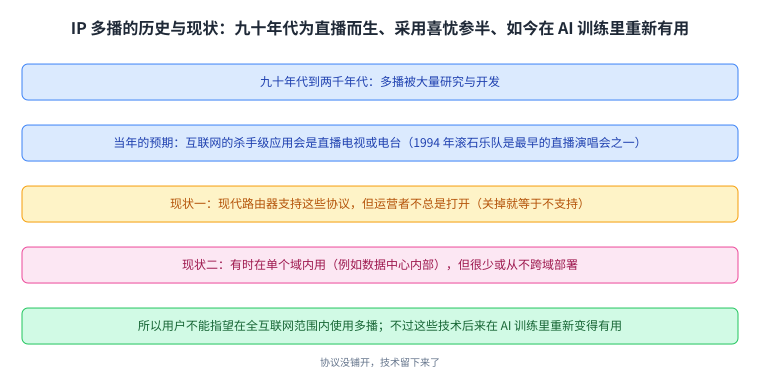
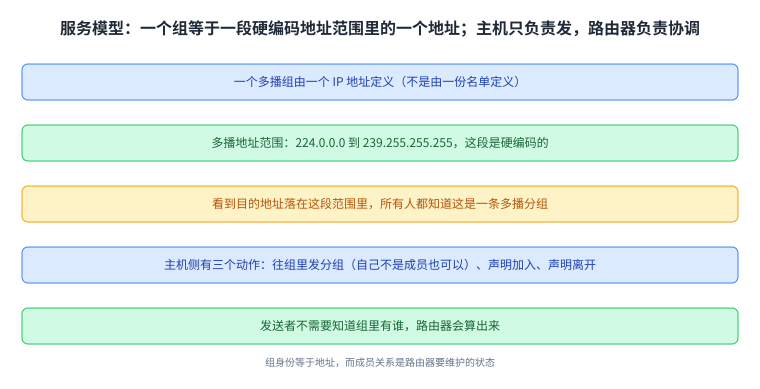
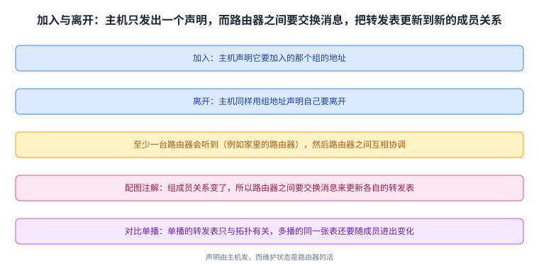
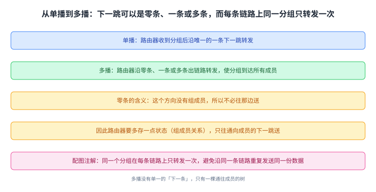
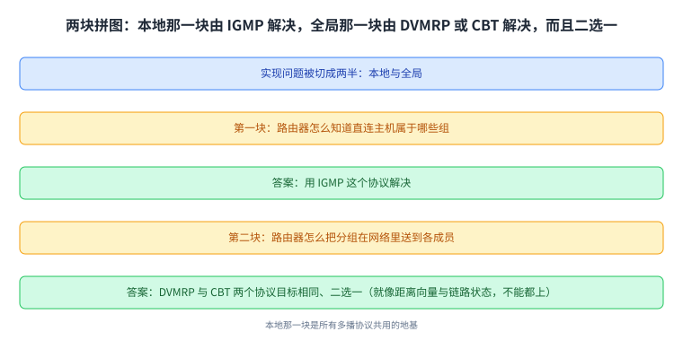
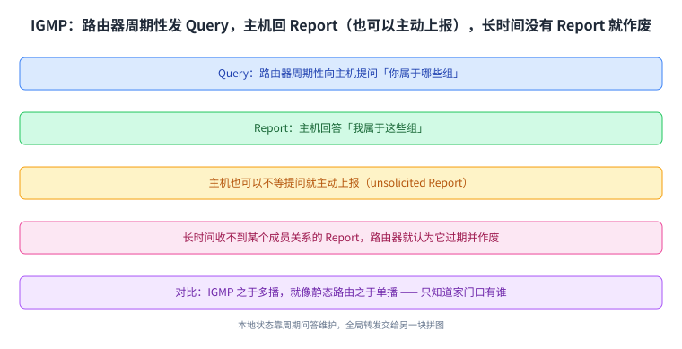
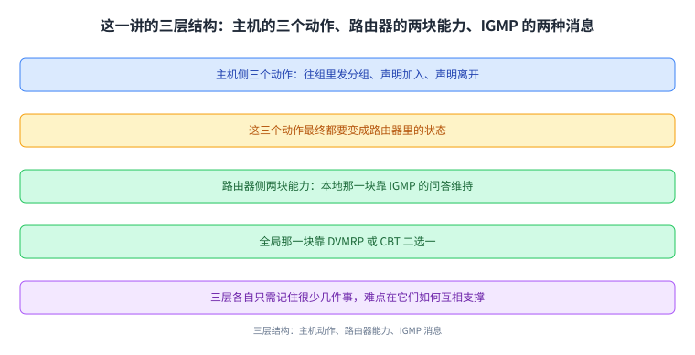

+++
title = "IP 多播：一个组就是一个地址"
lecture = 44
slug = "ip-multicast"
status = "draft"
source_kind = "textbook"
source_url = "https://textbook.cs168.io/beyond-client-server/ip-multicast-service-model.html"
source_title = "IP Multicast"
output_mode = "explanation"
+++

> 来源课程：UC Berkeley CS168 Computer Networks（教材 CS 168 Textbook）；
> 对应内容：Beyond Client-Server 之 IP Multicast（<https://textbook.cs168.io/beyond-client-server/ip-multicast-service-model.html>）；
> 上游许可：教材站在站根页声明 CC BY-SA 4.0（第二人复核见 `docs/audit/license-cs168-second-review.md`）；
> 本文由 CourseLingo 原创撰写：按该节的推进顺序重新讲解，关键句给出英文原文与中译，不逐句全译，配图全部自绘、不转载原图；
> 本文非官方材料，CourseLingo 与 UC Berkeley 及课程教学团队无隶属关系；如与原文有出入，以原文为准。

## 一、这一讲要解决什么问题：一次发给一群人

前面讲到最后一讲为止，网络服务模型一直是「客户端与服务器一对一」：一台主机发包给另一台主机。而现实中还有另一种需求：一次把同一份数据发给一群人，比如直播。这一讲要讲的 [[term:multicast]]（多播），就是为这件事设计的一整套模型与协议。

源文先给了一段历史，而且它的口气很坦率：

> IP multicast was actively researched and developed in the 1990s and 2000s. The development was motivated by the expectation that the killer application for the Internet would be live-streamed TV or radio. (Fun fact: One of the earliest live-streamed concerts was the Rolling Stones in 1994.)

也就是说，当年推动这件事的预期是「[[term:internet]]的杀手级应用会是直播电视或电台」。而结果是采用情况喜忧参半：现代路由器确实支持这些协议，但网络运营者不总是把它们打开（源文补了一句：在路由器上关掉就等于这台路由器不支持该协议）；这些[[term:protocol]]有时会在单个域内使用（比如数据中心网络内部），但很少或从不跨域部署（域间路由那套 BGP 也不承载多播组），所以用户不能指望在全互联网范围内使用多播。

不过源文马上补了一句很有分量的转场：这些协议没有被全局部署，但里面的技术可以被用到别的问题上，而且它们在 AI 训练里又变得重要起来（源文说这会在讲 collectives 时展开）。

这张图把「为什么现在还要学它」讲清了：协议没铺开，技术留下来了。

## 二、服务模型：一个组就是一个地址

多播的第一件事是定义「组」。源文的答案很直接：

> Each multicast group is defined by an IP address. The addresses from 224.0.0.0 to 239.255.255.255 are multicast addresses, and everyone knows that addresses in this hard-coded range are multicast addresses.

也就是说，**组不是由名单定义的，而是由一个** [[term:ip-address]] 定义的：224.0.0.0 到 239.255.255.255 这一段是硬编码给多播的，看到目的地址落在这个范围内，所有人都知道这是一条多播分组。

接下来的三个动作都只发生在主机侧，而且都只是「发包」：

> In summary, the IP multicast service model defines three operations for end hosts: You can send packets to a group (even if you are not a part of that group yourself). You can announce that you are joining a group. You can announce that you are leaving a group.

这三件事分别是：往一个组发分组（注意：即使你自己不是这个组的成员也可以发）、声明加入某个组、声明离开某个组。而主机发出声明之后的事情由[[term:router]]负责：主机在 Ethernet 这类链路上把声明发出去，至少有一台路由器会听到（比如你家里的路由器），然后路由器之间互相协调（例如跑某种路由协议），最终所有路由器都知道你属于这个组。

而发送侧对发送者是隐藏的：

> Then, the routers will use that group address to forward the packet to all group members. Notice that as the sender, you don't need to worry about who belongs to the group, because the routers will figure that out for you.

**发送者不需要知道组里有谁**，它只要把组地址填进 IP 目的字段，剩下的由路由器算。

这张图是这一讲的坐标系：组身份 = 地址，而成员关系 = 路由器要维护的状态。

## 三、组关系是会变的：加入与离开

源文紧接着讲了加入与离开的流程，两者用的是同一个地址：

> To join a group, you will announce the multicast address of the group you want to join. … Similarly, you can announce that you are leaving a group, and you again use the multicast address to identify which group you are talking about.

而这类消息一旦发出，网络里的状态就得跟着变。源文配图里有一句注解把这件事说得很直白（这句出现在配图上，正文没有逐字重复）：组成员关系变了，所以路由器之间要交换消息来更新各自的转发表。 这也解释了为什么多播比单播「更重」：单播里转发表只与拓扑有关，而多播里同一张表还要随成员的进出变化。

这张图把两种消息画成同一条路：声明由主机发，而维护状态是路由器的活。

## 四、路由器侧：从一条下一跳，到零条、一条或多条

主机侧的模型讲完，源文转向路由器怎么送多播[[term:packet]]。（多播分组通常直接跑在 UDP 之上）它先与[[term:unicast]]对照：

> In the unicast model, a router receives a packet and forwards the packet along a single next-hop. Now, in the IP multicast model, when a router receives a multicast packet …, the router will forward the packet along zero, one, or multiple outgoing links, so that the packet reaches all group members.

这句话里最值得注意的是那个 zero：单播里下一跳永远恰好一条，而多播里可以是零条、一条或多条。零条的情形对应「这个方向没有组成员」， 源文明确说了这个判断：

> If a next-hop doesn't lead to any group members, there's no need to send the packet along that next-hop.

于是路由器必须多存一点状态，也就是组的成员关系，才能只往通向成员的那些下一跳送；而它的下一跳集合会随成员的加入与离开改变。

配图里还有一条正文没写、但很实用的约束：同一个分组在每条[[term:link]]上只转发一次，目的是避免同一份数据沿同一条链路被重复发送。这在多播里不是小事，因为一台路由器可能有多个方向都通向同一批成员。

这张图是这一讲的机制核心：**多播没有单一的「下一条」，只有一棵通往成员的树。**

## 五、怎么实现：两块拼图

源文把实现问题干净地切成两半：

> We can divide this problem into two parts: How do routers know what groups their directly-connected hosts belong to? We'll use a protocol called IGMP to solve this. How do routers forward packets through the network to reach the destination group members? We'll look at two protocols for solving this: DVMRP and CBT.

读法是：第一块是「本地」，第二块是「全局」。 前者的答案是 [[term:igmp]]，它只解决「直连主机属于哪些组」；后者有两个协议可以选择，也就是 [[term:dvmrp]] 与 [[term:cbt]]。

源文还给了选型建议，用的是前面讲过的类比：

> Both protocols achieve the same goal, so you can pick either one for your implementation (the same way you can pick either distance-vector or link-state, but not both).

也就是说，DVMRP 与 CBT 目标相同、二选一，就像域内路由里可以选距离向量或链路状态，但不能两个都上（那一路的代表是 OSPF）。

这张图解释了这一讲为什么只细讲 IGMP：本地那一块是所有多播协议共用的地基。

## 六、IGMP：只管直连主机

最后一块是 IGMP 的交互方式。它的消息类型很少，源文列了两种：

> Queries: The router periodically sends Queries to the hosts. These messages ask: What group(s) do you belong to? Reports: In response, hosts send Reports back to the router. Reports answer the question: These are the group(s) I belong to. Hosts can also send unsolicited Reports (i.e. without waiting for a Query).

读法是：路由器主动问（Query），主机回答（Report）；而主机也可以不等提问就主动上报（unsolicited Report），这在刚加入一个组时很自然。至于状态为什么会过期，源文也交代了：

> If the router doesn't receive a Report about a membership for a long time, the router will assume that membership has expired and invalidate it.

也就是说，成员关系不是永久登记，而是靠周期性上报续期的。而 IGMP 的边界也很清楚：它只覆盖直连主机，别的网络里的主机要靠[[term:routing]]协议。源文最后给了一个很好记的判断：

> To draw a comparison to distance-vector routing, you can think of IGMP as the multicast version of static routing, where a router learns about its directly-connected hosts (but not other hosts elsewhere in the network).

IGMP 之于多播，就像静态路由之于单播：它让路由器知道自己家门口有谁，除此之外一无所知。

这张图是这一讲的收尾：**本地状态靠周期问答维护，全局转发交给另一块拼图。**

把这一讲的三层结构并排放在一起会更清楚：主机侧只有三个动作（发、加入、离开），而这三张「声明」最终都要变成路由器的状态；路由器侧要有两块能力，本地那一块靠 IGMP 的问答维持，全局那一块靠 DVMRP 或 CBT 二选一。

这张图是本讲的目录：三层各自只需要记住很少几件事，而难点在于它们之间如何互相支撑。

## 读完应该能回答

- 多播当年的推动力是什么，为什么它最终没有在全局互联网上铺开；
- 一个多播组是用什么定义的，哪些地址范围属于多播；
- 主机侧有哪三个动作，为什么发送者不需要知道组里有谁；
- 多播转发与单播转发在「下一跳」上的关键差别是什么，零条下一跳意味着什么；
- 实现多播的两块拼图分别是什么，为什么第二块要二选一；
- IGMP 用哪两种消息维护状态，成员关系为什么会过期。

## 脉络回顾

往前看，这一讲从那一段「数据中心」里出来了，进入新的部分：客户端与服务器之外的通信方式。前面那些讲的主语始终是「一台主机对一台主机」（单播），而这一讲换成了「一台主机对一群人」。它解决的那一环，是让网络替发送者去算收件人名单：发送者只填一个组地址，成员关系由路由器维护，转发由路由器决定。

最要紧的转折在「组」的定义方式上。要把同一份数据发给一群人，最直接的办法是维护一份收件人名单，再逐个单播过去；而 IP 多播换了一个办法：把这一群人的身份压成一个 IP 地址。这一步决定了后面所有事，地址范围内硬编码、主机只需声明加入与离开、路由器需要额外状态、转发可以沿多条链路分叉。换句话说，多播把「一对多」从应用的负担变成了网络的负担，代价是网络里多了一类会随成员变化的状态。

而这一讲的实现部分被干净地切成了两块：本地那一块（IGMP） 解决「家门口有谁」，全局那一块（DVMRP 或 CBT） 解决「怎么把分组送到各地」。这个切法本身就是这一讲最值得记住的结构，因为后面几讲会一块一块地接手：下一讲开始讲 DVMRP 那一路（它用距离向量那套思想来搭多播转发树），而 CBT 走的是另一条路（先选一个核心点，再让所有成员接到它上面）。

后面哪里用到它：源文在历史那一节已经指了一个方向，这些多播技术在 AI 训练里重新变得有用（讲到 collectives 时会展开）；而 IGMP 这类「让主机声明自己属于某个组」的机制，其思路在更后面的组通信与订阅式系统里还会以别的形式出现。

## 溯源

- 字段核对：`docs/lecture-manifest.md` 第 44 行为 `ip-multicast` / `IP Multicast` / `/beyond-client-server/ip-multicast-service-model.html`（本讲字段由我从 manifest 读出）；抓页时 `<title>` 与 H1 都是 `IP Multicast`（与 manifest 一致），目录 `content/44-ip-multicast/`、`lecture = 44`。
- 源文件与范围：该页 HTML 共 27,946 字节（首次抓取即 200，未遇到 `000`），正文 6,513 字符，实测 4 个二级小节（Brief History of IP Multicast / IP Multicast Service Model / Implementing Multicast / IGMP: Directly-Connected Hosts），`TODO` 标记 0 处。
- 7 张配图：全部下载成功（`7-005-multicast-addresses` 到 `7-011-igmp-queries-reports`）。这一讲图少，所以我把 7 张拼成一张联系表逐张看过（缩放版，非原始分辨率，如实报备）。核对结果：文件名与内容一致，并且从图上读到了两处正文没写的细节，都已在正文里标明出处：一是配图注解写着「组成员关系变了，所以路由器之间要交换消息来更新各自的转发表」，二是转发那张图写着「同一个分组在每条链路上只转发一次，避免沿同一条链路重复发送同一份数据」。另外三张是分类图：`7-009-igmp-taxonomy` 与 `7-010-dvmrp-cbt-taxonomy` 把问题分成 Host-to-router（IGMP）与 Routing protocol（DVMRP、CBT）两块，`7-011-igmp-queries-reports` 画出主机与路由器之间的 Queries 与 Reports 两个方向。
