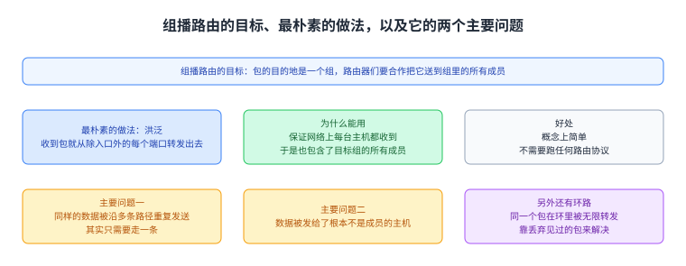
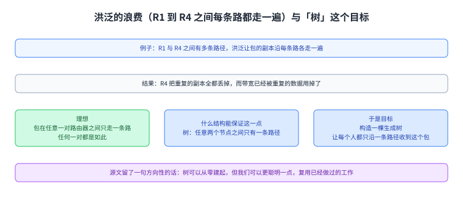
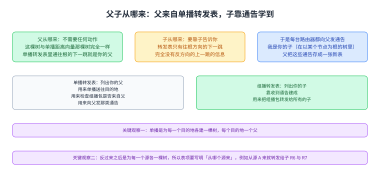
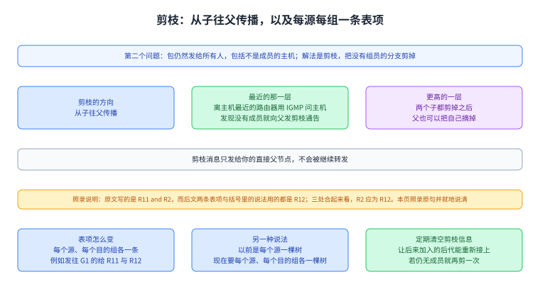
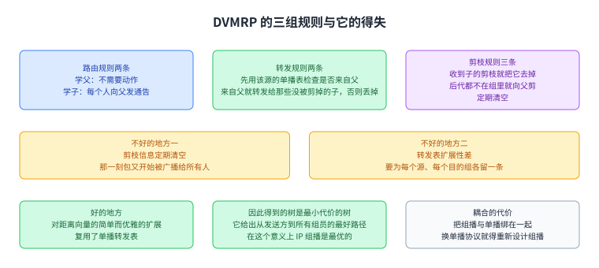

+++
title = "DVMRPDVMRP：把[[term:unicast]]单播的树反过来用"
lecture = 45
slug = "dvmrp"
status = "draft"
source_kind = "textbook"
source_url = "https://textbook.cs168.io/beyond-client-server/dvmrp.html"
source_title = "DVMRP"
output_mode = "explanation"
+++

> 来源课程：UC Berkeley CS168 Computer Networks（教材 CS 168 Textbook）；
> 对应内容：Beyond Client-Server 之 [[term:dvmrp]]DVMRP（<https://textbook.cs168.io/beyond-client-server/dvmrp.html>）；
> 上游许可：教材站在站根页声明 CC BY-SA 4.0（第二人复核见 `docs/audit/license-cs168-second-review.md`）；
> 本文由 CourseLingo 原创撰写：**按该节的推进顺序**重新讲解，关键句给出英文原文与中译，**不逐句全译**，配图全部自绘、不转载原图；
> 本文非官方材料，CourseLingo 与 UC Berkeley 及课程教学团队无隶属关系；如与原文有出入，以原文为准。

## 一、这一讲要解决什么问题

源文先把[[term:multicast]]组播[[term:routing]]路由的目标复述清楚：我们手上有一个[[term:packet]]包，它的目的地是一个组，而[[term:router]]路由器们要合作把这个包转发给组里的所有成员。最朴素的做法叫洪泛：

> The most naive way to implement this is flooding. When a router receives a packet, it simply forwards the packet out of every port (except the incoming port).

中译：最朴素的做法是洪泛，也就是路由器收到一个包时，把它从除入口之外的每一个端口转发出去。源文解释了它为什么能用（能保证网络上每台主机都收到，也就包含了目标组的所有成员），也说了它的好处（概念上简单，不需要跑任何路由[[term:protocol]]协议）。
接着它把洪泛的问题列成两个主要问题，并说会一次解决一个；此外还提到环路的后果（同一个包会在环里被无限转发，形成广播风暴），源文说这可以通过让路由器丢弃见过的包来解决。

这一讲要做的就是拿这两个问题开刀：第一个是同样的数据被沿多条路径重复发送，第二个是数据被发给了根本不是成员的主机。按仓内清单，这一讲是 `/beyond-client-server/` 那一段里讲组播路由的第一讲，而它用的材料是前面已经算过的东西（第 26 讲那一带讲的距离向量（例如 BGP）单播路由）。

图里上面是组播路由的目标（一个包的目的地是一个组，路由器要合作送到所有成员）与最朴素的做法（洪泛：从除入口外的每个端口转发出去），中间是它的好处，下面两格是那两个主要问题与环路那件事的解法。

## 二、先看清洪泛浪费在哪里

源文用一个小例子把第一个问题说具体：假设 R1 与 R4 之间有多条路径，洪泛会让这个包的副本沿每条路径各走一遍，最后 R4 把重复的副本全都丢掉。理想情况是包在 R1 与 R4 之间只走一条路，任何一对路由器之间都是如此。

源文随后问了一个很有提示性的问题：什么数据结构能保证任意两个节点之间只有一条路径。它的答案是树，于是目标变成构造一棵生成树，让每个人都只沿一条路径收到这个包。它还留了一句方向性的话：树可以从零建起，但我们可以更聪明一点，复用已经做过的工作。

图里上面是那个例子（R1 与 R4 之间多条路径，洪泛让副本沿每条路走，R4 丢掉重复副本），中间是理想（任意一对路由器之间只走一条路），下面一格是源文给的答案（树：任意两个节点之间只有一条路径，于是目标是构造生成树并复用已有的工作）。

## 三、把单播的树反过来：RPB

被复用的那份工作就是单播的交付树。源文回顾说，我们跑距离向量路由时，构造出的是一棵指向目的地的生成树，它让所有包在图中向上流向那唯一的目的地，也就是树的根；而如果把这棵图的所有箭头反过来，我们就得到了一棵适合组播的生成树：根变成了发送方，包的副本向下沿着网络流出去，抵达每一个目的地。

因为「反过来的箭头」容易让人绕晕，源文换了一套更清楚的术语：在路由器的树里，每台路由器恰好有一个父节点、有零个或多个子节点；处在树「顶端」的叫根，处在「底部」、没有子节点的是叶。它说这些定义跟数据结构课里的一样，没有什么特别之处。
接着它把两种路由摆在一起对比：单播时根是目的地，每个人从子那里收包、把包转发给父，方向是向上；组播时根是源，每个人从父那里收包、把包转发给子，方向是向下。

于是组播的转发规则可以写成一句话：

> If you get a packet from your parent, send it to all your children. Otherwise, if you get a packet from someone else (not your parent), drop the packet.

中译：如果你是从父那里收到这个包，就把它发给所有的子；否则，如果是从别人（不是你的父）那里收到的，就把它丢掉。源文解释了这条规则为什么能解决第一个问题：即使到你这里有多条路径，你也只会从父那里收到一次（并转发给子一次），从别人那里收到的副本一律丢掉。

图里上面两格把两棵树并排：单播那棵的根是目的地，每个人从子收、往父转发，方向向上；组播这棵的根是源，每个人从父收、往子转发，方向向下。中间两格是那套术语（一个父、零个或多个子；顶端是根、没有子的是叶），下面一格是那条转发规则（来自父就发给所有子，来自别人就丢掉）。

## 四、怎么知道谁是父、谁是子

规则好写，可每台路由器得先知道自己的父与所有的子。源文说知道父很容易：这棵树与单播距离向量那棵树完全一样，所以在你的单播转发表里，通往根的下一跳就是你的父，直接复用即可。

知道子要多花点功夫，因为转发表只告诉你往根方向的下一跳（父），完全没有反方向的上一跳（子）的信息。既然你不知道自己的子是谁，就得让子来告诉你：每台路由器都向自己的父发一条组播路由通告，说「我是你的子（在以 A 为根的这棵树里）」。父收到这些通告后，就把它们存成一份新的组播转发表，这份表与单播那张表分开。

源文把两张表的分工写得很清楚：单播转发表列出你的父，它有三个用途，一是像标准距离向量那样把包单播送往目的地，二是检查一个组播包是不是来自你的父，三是用来向父发送那类「我是你的子」的通告；组播转发表列出你的子，它是靠收通告建起来的，用途是把组播包转发给你所有的子。

这一节最后有一个很关键的观察。源文说，在单播距离向量里我们为每一个目的地建了一棵树，所以单播转发表里每个目的地各有一个下一跳，也就是说针对每个目的地你都有一个父；而把箭头反过来之后，我们得到的是为每一个源各一棵树，于是组播转发表里每个源各有一串子。它给了一条可以照读的表项例子：如果你从源 A 收到包，就把它转发给子 R6 与 R7。

图里上面是父的来源（单播转发表里通往根的下一跳就是你的父）与子的来源（子向父发「我是你的子」的通告），中间两格是两张表各自装什么、各自用来做什么，下面一格是那个关键观察（单播是每个目的地一棵树，反过来之后是每个源一棵树，所以表项要写明「从哪个源来」）。

## 五、第二种问题：剪枝

到此为止包仍然是发给所有人的，包括不是成员的主机，这就是第二个问题。源文的解法是剪枝：把那些没有组员的分支剪掉。

剪枝的方向是从子往父传播。源文设想的场景是：假设你是 R5，直接连着三台主机，你用 [[term:igmp]]IGMP（也就是跟那些主机对话）发现它们一个都不在这个组里，那么你就没有理由留在这棵树上。于是你向父发一条通告：「我是你的子，但我的后代里没有任何一个涉及这个组，所以别给我发数据包了。
」父据此更新自己那条组播转发表项，把你从子的名单里去掉。源文在这里强调了一个细节：剪枝消息只发给你的直接父节点，不会被继续转发。

剪枝也会在更高的层次发生。源文设想 R3 有两个子，如果两个子都发来剪枝通告，那么「你的子都不涉及这个组」就意味着你自己也没有理由涉及，于是你也可以向你的父发一条剪枝通告，让父停止给你发数据包。
它还补了一种混合情形：层次较高的路由器可能同时有子路由器和直连主机，这时它只有在所有子都发来剪枝通告、且所有直连主机都不属于这个组时，才能把自己从树上摘掉。

剪枝让组播转发表变复杂了一点。源文说，此前每条表项把「一个源」映射到「一串子」；而现在这串子还要取决于目的组。它举的例子是：也许 R11 与 R2 都有属于组 G1 的后代，但只有 R11 有属于组 G2 的后代（括号里说这就是 R12 给你发过剪枝消息的意思）。

这里有一处需要照录说明的地方：按紧随其后的两条示例表项，你在这棵树上的子被写成 R11 与 R12（组 G1 转发给 R11 与 R12，组 G2 只转发给 R11），而括号里说的也是 R12 发来了剪枝消息；
也就是说，这句里的 `R2` 与后面两句里的 `R12` 指的应当是同一个子。我们照录原文的 `R11 and R2` 不加改写，并在这里指出它与后文不一致，按上下文 `R2` 应为 `R12`。

修法本身很清楚：组播转发表必须每个源、每个组各一条表项，例如「如果你从源 A 收到发往组 G1 的包，就转发给子 R11 与 R12」，另一条则是「发往组 G2 的包只转发给子 R11」。源文给了另一种说法：以前是每个源一棵树，而现在我们要按目的组把一些树枝剪掉，所以需要的是每个源、每个目的组各一棵树。

这一节的最后一条是关于变化的：可能出现「你的子现在都不属于这个组，但过一会儿它的某个后代决定加入」的情形。源文说，为此每台路由器都会定期清空自己所有的剪枝信息，于是没有人再被剪掉，所有人都回到最初的 RPB 行为（总是转发给所有的子）。
这样一来，如果某个后代加入了组，那么计时器到期之后你就不再被剪掉、已经重新回到树上；而如果它仍然不属于这个组，你只要再发一条剪枝消息，就又能把自己从树上摘掉。

图里上面是剪枝的方向与它的两种情形（离主机最近的路由器用 IGMP 发现没有成员后向父发剪枝通告；两个子都剪掉之后父也可以把自己摘掉），中间一格是那处需要照录说明的地方（原文写 `R11 and R2`，而后文两条表项与括号里的说法都是 R12），下面是每源每组一条表项的例子与「定期清空剪枝信息」这条机制。

## 六、规则汇总，以及这个协议的得与失

源文最后把 DVMRP 的规则收成三组。

**路由规则**两条：对这棵以某个源为根的生成树，你要学会你的父与你的子；学父不需要任何动作（单播转发表已经指明了父），学子则要靠每个人向父发那条通告。

**转发规则**两条：收到包时，先用该源对应的单播转发表检查它是不是来自你的父；如果来自父，就用组播转发表把它转发给你的子，而且只转发给针对该目的组没有被剪掉的子；如果不是来自父，就丢掉。

**剪枝规则**三条：对每一个「目的组与源」的组合，收到子的剪枝消息就把该子从这条表项里去掉；如果你的后代（直连主机与子）都不属于这个组，就向你的父发剪枝消息；并定期清空所有剪枝信息。

至于得失，源文先说不好的地方。一是剪枝信息会被定期清空，那一刻包又开始被广播给所有人，直到剪枝重新收敛；二是转发表扩展性差，组播转发表要为每个源、每个目的组各留一条表项。

好的地方源文列了三条。DVMRP 是对一个已有路由协议（距离向量）简单而优雅的扩展，我们优雅地复用了单播转发表，例如根本不必费心去识别自己的父，因为那件事早就做完了。因为复用距离向量的交付树，我们得到的树同时也是最小代价的树，也就是说它给出了从发送方到所有组员的最好路径；

源文说正是这条性质让我们说 IP 组播是最优的，也就是在网络拓扑的代价意义上 DVMRP 达到了可能达到的最好性能。最后它还点出一处耦合的代价：把组播与单播路由耦合起来，会让人更难换协议，例如把单播从距离向量换成[[term:link]]链路状态时，组播这一侧也得跟着重新设计。

图里上面三格是三组规则各自的条数与要点（路由规则两条、转发规则两条、剪枝规则三条），中间两格是不好的地方（剪枝信息定期清空导致短暂回到洪泛；转发表要为每源每组各留一条表项，扩展性差），下面是好的地方（对距离向量的优雅扩展、复用单播表、得到最小代价的树因而在这个意义下最优）与那处耦合代价（换单播协议会牵动组播）。

图里三格是这一讲复用的三样材料：距离向量的交付树、单播转发表与 IGMP；下面一格是一句话总结。

## 读完应该能回答

1. 洪泛为什么能用、又浪费在哪里，源文把它的主要问题分成了哪两个？
2. RPB 为什么要「把单播的树反过来」，反过来之后根、父、子与转发方向各是什么样子？
3. 路由器怎么知道自己的父与子，为什么这两件事的难度不一样，两张表各自用来做什么？
4. 剪枝朝哪个方向传播、为什么表项要变成每源每组一条，而定期清空剪枝信息是为了解决什么？

## 脉络回顾

这一讲接着 `/beyond-client-server/` 那一段的上一讲往下走。上一讲把组播的问题立了起来：理想是每条链路只承载这个包一次，沿途没有成员时可以是零次；而它把「放在哪一层」拆成了 IP 组播与覆盖组播两个选项。这一讲做的是第一个选项里具体的一份协议，而它很特别的地方在于几乎不发明新东西：识别父节点这件事直接沿用单播距离向量已经算好的转发表，连树都不用重新算，只要把箭头反过来。

这一讲解决的那一环可以概括成一句话：组播路由要的是一棵以源为根的树，而距离向量单播路由早就为每个目的地建好了一棵以目的地为根的树，两者是同一张图的两个方向。于是「谁是父」免费得到，「谁是子」要靠通告反向收集，而「不要发给没有成员的分支」这件事要靠剪枝，从离主机最近的地方往上传，并且在没人剪的时候定期把剪枝清空，好让后来加入的成员能重新接上。

最要紧的转折在于这张表装的是什么：从「每个目的地一条下一跳」变成「每个源、每个目的组各一串子」。这个变化既解释了 DVMRP 为什么优雅（复用），也预告了它最大的缺点（表项数量按源与组的乘积增长）。它留下的另一条线索是耦合：因为组播是搭在单播的树上建的，换单播协议就会牵动组播这一侧；
按仓内清单，这一段后面还会讲另一类用核心树来组织组播的做法，而那正是为了解决这类扩展与耦合问题。

## 溯源

- **字段核对**：`docs/lecture-manifest.md` 第 45 行为 `dvmrp` / `DVMRP` / `/beyond-client-server/dvmrp.html`（本讲字段由我从 manifest 读出）；抓页时 `<title>` 与 H1 都是 `DVMRP`。两处一致；目录 `content/45-dvmrp/`、`lecture = 45`。
- **源文件与范围**：该页 HTML 共 37,404 字节（首次即 200），正文 13,720 字符，正文锚点 `#main-content`，实测 6 个二级小节（Naive Algorithm: Flooding / Reverse Path Broadcasting (RPB) / RPM: Learning Your Parent and Children / Reverse Path Multicasting (RPM): Pruning / Summary of DVMRP Rules / DVMRP Pros and Cons），`TODO` 标记 0 处（本讲无代补动作）。本页把 6 节写成本页六节，一一对应。
- **配图：独立 20 张、连播 0 张（按文件名与内容分档，全部是单张成篇的示意图）**。本次逐张看过 0 张：这一讲源页有 20 张图，而我这一路已经连续交付十四讲，余量优先给正文与六道闸门。

- 按派单方这一轮给的格式写清楚：独立 20 张、连播 0 张、看过 0 张、没有使用缩放版本（因为没看）。我不把这一条写成「逐张看过」。
- **源文自身不自洽（一处，按「预告 → 照录 → 更正」登记）**：源文在讲剪枝如何让表项变化时写 `maybe R11 and R2 both have descendants belonging to group G1`，而紧随其后的两条示例表项把「你在这棵树上的子」写成 R11 与 R12（组 G1 转发给 R11 与 R12，组 G2 只转发给 R11），并且括号里说明的原因是 R12 给你发过剪枝消息。

- 三处放在一起，第一句里的 `R2` 与后两句里的 `R12` 指的是同一个子。
- 本页在正文里照录原句的 `R11 and R2`，并就地指出它与后文不一致、按上下文应为 `R12`，同时在正文那一节的配图里也标出这一点。这是变量名笔误这一类，而它不属于本课常见的四种子形态（方向词、等号两边、N 项、例子与判据），我按新的一类单独登记。

- - **成对的数与跨讲自查**：其一，源文说洪泛有两个主要问题，后面正好列了两条（沿多条路径重复发送、发给非成员），本页按两条写；其二，源文说修剪后的表项是「每个源、每个组各一条」，与它自己举的两条示例表项（G1 给 R11 与 R12、G2 只给 R11）一致，本页按同一对象处理；

- 其三，源文说得到的树同时是最小代价的树，这与它前面「复用距离向量的交付树」是同一件事的两面，本页并排写出而没有当成两个结论；
- 其四，源文的 `IGMP` 与上一讲（组播那一讲）里讲的「主机加入与退出组」是同一个机制的两侧（那一讲说成员可以随时加入退出，这一讲讲路由器用 IGMP 去问主机），本页按跨讲同一对象处理；

- 其五，源文提到的「距离向量」与更早讲路由那几讲里的距离向量是同一个协议族，本页沿用同一套中译。
- **四种子形态的覆盖面（本讲）**：其一 方向词：核了四处——「从子收、往父转发、方向向上」（单播）与「从父收、往子转发、方向向下」（组播）这对相反的方向各自与其根的定义一致；「剪枝从子往父传播」与后文「向你的父发剪枝消息」一致；

- 「来自父就发给所有子，来自别人就丢掉」中的两个分支方向互斥且完整；「定期清空剪枝信息」后回到「总是转发给所有的子」，方向自洽；其二 等号两边：本讲没有「必须改写成它自己」这类恒等式，无对象；
- 其三 说 N 项列 M 项：核了三处——「两个主要问题」后正好两条、「路由规则两条」后正好两条、「剪枝规则三条」后正好三条，均一致；

- 其四 例子合不合自家判据：源文的 `R5` 直接连3台主机这一处只是场景设定，与判据无关；而上面登记的那处 `R2` 与 `R12` 属于第五类，已单独登记。结论：四种子形态各核过，另新增登记一类。
- **术语 grep**：`DVMRP`／`RPB`／`RPM`／`IGMP`／`spanning tree`／`pruning` 逐个在已提交页面 grep 过（`-i`，含键）：`IGMP` 与 `spanning tree` 更早出现过，其余此前未出现。**结论：不新增词条**，一律用纯文本；本页写了 8 个标记，键名全部取自 `validate --strict` 的警告行，没有自己猜。
