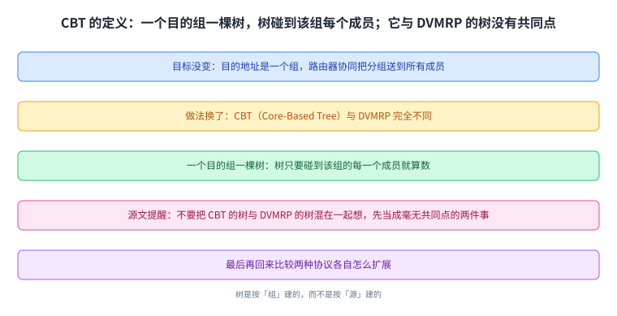
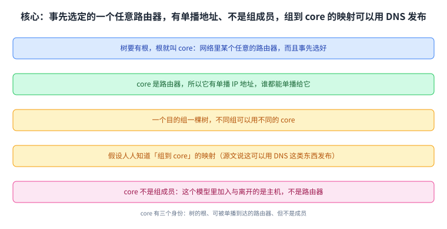
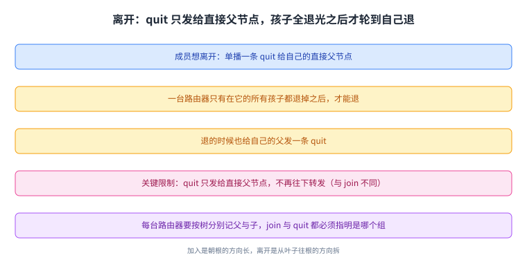
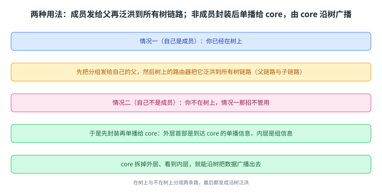
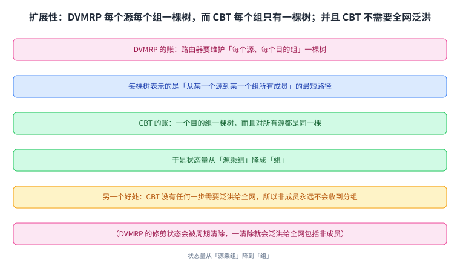
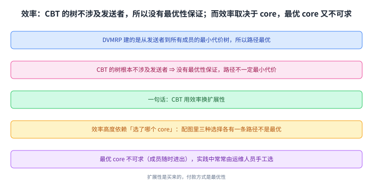
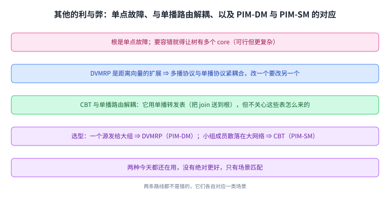

+++
title = "Core-Based Trees：一棵以核心为根的树"
lecture = 46
slug = "core-based-trees"
status = "draft"
source_kind = "textbook"
source_url = "https://textbook.cs168.io/beyond-client-server/cbt.html"
source_title = "Core-Based Trees"
output_mode = "explanation"
+++

> 来源课程：UC Berkeley CS168 Computer Networks（教材 CS 168 Textbook）；
> 对应内容：Beyond Client-Server 之 Core-Based Trees（<https://textbook.cs168.io/beyond-client-server/cbt.html>）；
> 上游许可：教材站在站根页声明 CC BY-SA 4.0（第二人复核见 `docs/audit/license-cs168-second-review.md`）；
> 本文由 CourseLingo 原创撰写：按该节的推进顺序重新讲解，关键句给出英文原文与中译，不逐句全译，配图全部自绘、不转载原图；
> 本文非官方材料，CourseLingo 与 UC Berkeley 及课程教学团队无隶属关系；如与原文有出入，以原文为准。

## 一、这一讲要解决什么问题：换一种截然不同的做法

上一讲讲的是 [[term:dvmrp]]。这一讲给出多播[[term:routing]]的第二条路，而源文第一句就强调两者完全不同：

> The goal of multicast routing is still the same: We have a packet whose destination is a group, and the routers need to work together to forward this packet to all members of the group. However, we will now try a different approach, completely different from DVMRP.

也就是说，目标没变（目的地址是一个组，路由器协同把分组送到所有成员），但做法换了，换成 [[term:cbt]]。新做法的核心只有一句：

> In the Core-Based Tree (CBT) approach, each destination group has its own tree. The CBT for a destination group is simply a tree that touches every member of that group.

**一个目的组一棵树，树只要碰到该组的每一个成员就算数。** 而源文还特意提醒读者不要把两套树混在一起想：

> It can be confusing to think about CBT trees and DVMRP trees at the same time. For now, you can think of them as totally different trees with nothing in common.

所以这一讲的做法是：先把它当作一个独立的概念学，最后再回来和 DVMRP 比。

这张图是这一讲的起点：树是按「组」建的，而不是按「源」建的（这一点会在第五节变成扩展性的关键）。

## 二、核心：先指定一个根

要建一棵 [[term:core-based-tree]]，先要有根。源文把根叫作 core：

> To build a core-based tree, the tree needs a root, which we'll call the core. The core is some arbitrary router in the network, chosen ahead of time.

注意两点：core 是网络里某个任意的路由器，而且是事先选好的（不是算出来的）。

接着源文交代了几条关于 core 的细节，它自己把它们称作 fine print：

> Since the core is a router, it has a unicast IP address, and everyone can send unicast packets to the core. We're building one tree per group. Different groups can use different cores. We'll assume that everyone knows the mapping from groups to cores, e.g.

> "Group G1 is using R2 as its core." This mapping could be published using something like DNS (recall: DNS is useful for distributing key-value pairs). The core isn't a group member. In our model, we've assumed that hosts can join/leave groups, not routers.

读法是三条：core 是一个有单播 [[term:ip-address]] 的[[term:router]]，所以谁都能单播给它；不同组可以用不同 core，而「组到 core 的映射」假设人人皆知（源文说这可以用 DNS 这类东西发布，因为 DNS 本来就适合分发键值对）；而 core 自己不是组成员，在这个模型里加入与离开是主机的事，不是路由器的事。

这张图把 core 的三种身份分清了：它是树的根、是一个可被单播到达的路由器、但它不是成员。

## 三、加入：一条 join 消息，沿途长出树枝

树的生长方式很简洁：

> If a member wants to join a group, the member unicasts a join message to the core. This packet travels through several routers to reach the core. All of these routers join the tree as well, so that the tree now has a path from the core to the new member.

也就是说：成员[[term:unicast]]一条 join 给 core，这条消息沿途经过的每一台路由器都加入这棵树，于是从 core 到新成员之间就有了一条通路。

而每台路由器怎么记住自己在树里的位置，源文给了一个非常明确的对应关系：

> More formally, if you're a router and you receive a join message for a specific group, you know that you are now part of this group's tree. The join message's incoming link is your child (link pointing away from the root). The join message's outgoing link (next-hop to root) is your parent (link pointing toward the root).

> You can write down your parent and your children to remember where you are in the tree. There's no global mastermind remembering the tree; each router on the tree is responsible for remembering its own parent and children.

读法是：收到 join 就说明你在树里了；进来那条[[term:link]]是你的孩子（它背离根的方向），出去那条（指向根的下一跳）是你的父。**每台路由器只记自己的父与子**，没有任何全局大脑在维护这棵树。配图里对这个动作有一句更直白的注解（正文没有逐字重复）：收到 join 就把收到它的那条链路打开，那条链路从此是树的一部分；而 join 消息本身继续朝根的方向转发，转发用的那条出链路也从此是树的一部分。

这张图给出了整套机制的记账方式：树是分布式记住的，每台路由器只负责自己那一格。

## 四、离开：quit 只发给直接父节点

离开的做法同样简短，而且有一个很容易记错的限制：

> If a member wants to leave a group, the member can unicast a quit message to its direct parent on the tree. If all of your children on the tree have sent a quit message, that means that you can also leave the tree, so you can send a quit message to your direct parent.

> Quit messages are sent to your direct parent, and are not forwarded any further than that.

读法是自下而上地拆：成员把 quit 单播给自己的直接父节点；而一台路由器只有在它的所有孩子都退掉之后才能退，然后它再给自己的父发一条 quit。而最关键的一句是最后那句：quit 只发给直接父节点，不再往下转发，它不像 join 那样一路走到根。

配图同样给了一句更直白的注解：收到 quit 就把它来的那条链路关掉；如果只剩一条开着的链路，那你就是叶子（那条链路通向你的父），于是给父发一条 quit，并且特意提醒：发给父，不是发给根。

还有一条与「一组一棵树」直接相关的账：

> Remember that we are building one tree per group. This means that routers must remember their parent and children for each tree that they belong to. Also, join and leave messages must be associated with specific group, e.g. "I want to join group G2."

所以每台路由器要按树分别记自己的父与子，而 join 与 quit 消息都必须指明是哪个组。

这张图与上一张成对：加入是朝根的方向长，离开是从叶子往根的方向拆。

## 五、怎么用：成员与非成员走两条路

树建好了，接下来是怎么发数据。源文分两种情况，而这两种情况的差别正好对应「你在不在树上」：

> Case 1: If you are a group member, that means you're already touching the tree. Therefore, all you need to do is broadcast the message to everybody on the tree. More specifically, you start by forwarding the packet to your parent on the tree.

> Then, every router on the tree receives the packet and floods the packet to all of its tree links (both parent links and child links).

也就是说，成员先把[[term:packet]]发给自己的父（多播数据通常直接跑在 UDP 之上），然后树上的路由器把它泛洪到所有树链路（父链路与子链路都算）。

> Case 2: If you're not a group member, you aren't touching the tree, so the Case 1 strategy won't work. Instead, you can unicast the packet to the core. Then, the core can broadcast the message to everybody on the tree. More specifically, when you unicast the packet to the core, you need to encapsulate the packet.

> The outer header has unicast information to reach the core. The inner header has the multicast information.

第二种情况是这一讲与上一讲（第 44 讲）里的[[term:encapsulation]]再次接头的地方：非成员先把分组单播给 core，但要封装，外层[[term:header]]是到达 core 所需的单播信息，内层首部是[[term:multicast]]信息；core 收到后拆掉外层，看到内层，就能把这份数据沿着树[[term:broadcast]]出去。配图里的注解把这两层写得很清楚：From: S, To: R5 (Core): Hi core, send this on the tree（外层）与 From: S, To: G1: data（内层）。

这里有一处值得点明的读法：源文说「泛洪到所有树链路（父链路与子链路都算）」。按泛洪的惯例，路由器当然不会把分组原路发回它刚来的那条链路；否则同一份数据会沿同一条链路来回跑，而第 44 讲的配图正好写着「同一个分组在每条链路上只转发一次」。本页照录源文的说法，并在这里补上这一层，读者按「除来路以外」理解即可，这条也登记进了溯源。

这张图把「在树上」与「不在树上」分成两条路，而两条路最后都变成沿树泛洪。

## 六、扩展性：一棵树对一堆树

这一节是 CBT 存在的理由。源文先把 DVMRP 的问题摆出来：

> Recall that DVMRP scales poorly because the routers must keep track of one tree per source, per destination group. Each tree shows the shortest paths from one source, to all members of one destination group.

也就是说，DVMRP 的状态量是「每个源、每个目的组」一棵树。而 CBT 换了计数方式：

> Notice that the CBT is the same for all sources. Unlike DVMRP (one tree per source, per destination group), we now only have one tree per destination group.

CBT 对所有源都是同一棵树，于是状态从「源乘组」降成「组」。这是它更省的地方。

源文还指出 DVMRP 的第二个扩展性问题，而 CBT 顺手也解决了：

> Recall that another scaling problem with DVMRP is the fact that pruning states are periodically cleared, and when that happens, packets get broadcast to everybody on the network (including non-group members). CBT also solves this problem, because there's no point in CBT operation where a packet needs to get broadcast to everybody.

> The tree itself tells us where the group members are, and therefore ensures that non-group members will never receive the packet.

读法是：DVMRP 的修剪状态会被周期清除，一清除就会把分组泛洪给全网（包括非成员）；而 CBT 没有任何一步需要泛洪给全网，树本身就指明了成员在哪，所以非成员永远不会收到。

这张图用一个除法说清了 CBT 的收益：状态量从「源×组」降到「组」。

## 七、效率：用最优化换扩展性

省下来的状态不是白来的。源文把代价说得很直接：

> Recall that DVMRP built least-cost trees from the sender to all the group members. … By contrast, CBT trees don't involve the sender at all, so there is no more guarantee of optimality. The paths from the sender to all group members are not necessarily the least-cost paths. … CBT trades scalability for efficiency.

也就是说：DVMRP 的树是从发送者出发的最小代价树，所以路径最优；而 CBT 的树根本不涉及发送者，于是没有最优性保证，**CBT 用[[term:scalability]]换扩展性。**

而效率高低几乎全看「选了哪个 core」：

> The efficiency of CBT is highly dependent on which router is chosen to be the core. … In every choice of core, at least one pair of routers are connected by a suboptimal path. We no longer have a guaranteed shortest paths tree from one source to all group members.

配图把这句话量化了（这三组数字只出现在配图里，正文没有给）：三张图分别给出 A 到 B、A 到 C、B 到 C 三条路径的代价与「是否最优」，而每一张里都恰好有一条不是最优，一张是 B 到 C 为 5 而非最优，一张是 A 到 B 为 6 而非最优，一张是 A 到 C 为 5 而非最优。源文正文举的例子则是另一个编号：如果 A 打算大量发包，R2 可能是好的 core，因为它恰好让 A 到 B、A 到 C 都走最短路；但如果换成 B 发包，去 C 的路径就不是最优的。 这两处的节点编号不同（正文说 R2，配图画的是另一组编号），本页不把它们当成同一个对象，各自照录。

而既然效率取决于 core，那能不能算出最优的 core？源文的答案是：

> Finding the optimal core is infeasible, especially since members can join and leave the group at any time. In practice, operators often manually select the core.

最优 core 不可求（成员随时进出，问题还在变），所以实践中常常由运维人员手工选。

这张图是这一讲的取舍：**扩展性是买来的，付款方式是最优性。**

## 八、其他的利与弊，以及该选哪个

最后一节补了三条。第一条是 CBT 的结构性弱点：

> CBT creates a single point of failure at the root. To introduce fault-tolerance, we would need the tree to have multiple cores. This can be done, though it introduces more complexity.

根是单点故障；要做容错就得让树有多个 core（可行，但更复杂；源文说不再展开，只在文末给了链接）。

第二条与[[term:protocol]]之间的耦合有关，而这是 CBT 相对 DVMRP 的一个明显优势：

> Recall that DVMRP was built as an extension to distance-vector, which results in the multicast protocol (DVMRP) and the unicast protocol (distance-vector) being tightly-coupled. … By contrast, CBT is decoupled from the unicast routing protocol. CBT does use the unicast forwarding tables (e.g.

> to forward join messages to the root), but it doesn't matter how those forwarding tables were generated (distance-vector, link-state, hard-coded, etc.). As a result, CBT does not rely on any particular unicast protocol being used, and CBT works with any unicast protocol.

读法是：DVMRP 是距离向量的扩展，于是多播协议与单播协议紧耦合（改一个得改另一个）；而 CBT 与单播路由解耦，它确实要用单播[[term:forwarding]]表（比如把 join 送到根），但这些表是怎么来的它不关心（距离向量、链路状态如 OSPF 那一路、甚至手写死表都行）。

第三条是选型建议，源文按两种典型场景分开说：

> If you have one source sending data to a large group, then DVMRP might be the better solution, since it will ensure that all this data travels along optimal paths through the network. … By contrast, if you have a small group whose members are scattered across a large network, then CBT might be the better solution.

> CBT will avoid flooding packets to non-members, which would waste a lot of bandwidth.

也就是：一个源发给一个大组，DVMRP 更好（数据量大，走最优路能省很多带宽；而组大时它偶尔的泛洪也不算什么）；小组成员散落在一个大网络里，CBT 更好（避免把分组泛洪给大量非成员（浪费大量[[term:bandwidth]]））。

而这两个名字后来还被改过，源文顺带点了一句：

> In practice, both DVMRP and CBT are used today. DVMRP is sometimes named PIM-DM (Protocol Independent Multicast - Dense Mode), which reflects the fact that DVMRP is good for large groups. CBT is sometimes called PIM-SM (Protocol Independent Multicast - Sparse Mode), which reflects the fact that CBT is good for smaller groups.

DVMRP 对应 PIM-DM（密集模式），CBT 对应 PIM-SM（稀疏模式），这两个新名字恰好把「组大组小」这件适用条件写进了名字里。而源文给出的落点也很平实：今天两种都还在用，没有哪一个绝对更好，只有场景的匹配。

这张图是这一讲的收束：两条路线都不是错的，它们各自对应一类场景。

## 读完应该能回答

- CBT 的树是按什么建的，它与 DVMRP 的树在「一棵树代表什么」上有什么不同；
- core 是什么、为什么它有单播地址、为什么它不算组成员；
- 加入与离开各是怎么走的，父与子分别对应哪条链路；
- 成员与非成员发数据分别走哪条路，非成员那条路为什么要封装；
- CBT 的状态量比 DVMRP 少在哪里，它又为此放弃了什么；
- CBT 与 DVMRP 各适合什么场景，PIM-DM 与 PIM-SM 分别指谁。

## 脉络回顾

往前看，这一讲是 IP 多播这一段的第二块拼图。第 44 讲讲的是服务模型与那块「本地」的问题（[[term:igmp]] 管直连主机）；第 45 讲讲的是 DVMRP，用距离向量的思想，为每个源、每个目的组各建一棵最小代价树；而这一讲给的是另一条路：为每个目的组建一棵树，树根是一个事先指定的 core，所有源共用它。

它解决的那一环，正是上一讲留下的那个代价。DVMRP 的最优性来自「从发送者出发建树」，而模仿价就是状态量随源增长；CBT 把发送者从建树过程里拿掉，于是状态量与源无关，代价是最优性没有了保证。换句话说，这一讲把「哪个更重要」这个问题摆到了台面上：要最优的路径，还是要能装下更多组与源。

最要紧的转折在树的语义上。同一个网络里可以同时存在 DVMRP 的树与 CBT 的树，但两者代表的完全是两件事：一棵是「某个源到某个组的最优路径树」，另一棵是「某个组的成员在哪」。源文甚至提醒读者别把它们混着理解。一旦看清这一点，后面两条结论就顺理成章了：CBT 的状态量之所以小，是因为它对所有源只需要同一棵树；CBT 之所以能在小组成员稀疏时更省带宽，是因为树本身就标出了成员的位置，任何一步都不需要泛洪给全网。

后面哪里用到它：这一讲末尾那两个新名字（PIM-DM 与 PIM-SM）把这两条路线接到了现实世界的协议上；而「先选一个中心点、让成员都接到它上面」这个思路，在多播之外也反复出现（比如后面讲覆盖网时会看到「自己建一张虚拟拓扑，不指望网络层支持多播」这种做法）。

## 溯源

- 字段核对：`docs/lecture-manifest.md` 第 46 行为 `core-based-trees` / `Core-Based Trees` / `/beyond-client-server/cbt.html`（本讲字段由我从 manifest 读出）；抓页时 `<title>` 与 H1 都是 `Core-Based Trees`（与 manifest 一致），目录 `content/46-core-based-trees/`、`lecture = 46`。
- 源文件与范围：该页 HTML 共 32,634 字节（首次抓取即 200，未遇到 `000`），正文 9,810 字符，实测 6 个二级小节（CBT Definition / Building CBTs / Using CBTs / Benefit: Better Scaling / Efficiency Analysis / Other CBT Pros and Cons），`TODO` 标记 0 处。
- 16 张配图：全部下载成功（`7-032-cbt-taxonomy` 到 `7-047-core-choice-3`），拼成 2 张联系表逐张看过（缩放版，非原始分辨率，如实报备）。它们可以分成几组：加入与离开的逐步连播 6 张（`7-034` 到 `7-039`，含两张 recap）、转发与多发送者 4 张（`7-040` 到 `7-043`，其中 `7-043` 画出「外层到 core、内层到组」的两层首部）、以及扩展性与 core 选择 4 张，另有 2 张总图（`7-032` 的分类图与 `7-033` 的目标图）（`7-044` 的规模对比、`7-045` 到 `7-047` 三种 core 选择的代价表）。核对结果：文件名与内容一致。从图上读到三处正文没写的信息，都已在正文里标明出处：加入与离开的 recap 注解（收到 join/quit 时对链路做什么、quit 要发给父而不是根）、转发图中两层首部的具体样子、以及三张 core 选择图里的代价表（A 到 B、A 到 C、B 到 C 的数值与是否最优，三张各有一条不是最优）。另外要如实说明一处编号不一致：源文正文举的 core 例子用的是 R2，而三张 core 选择配图里画的是另一组节点编号，本页没有把两处当成同一个对象。
- 一处读法上的补足（已登记）：源文说成员发数据时「泛洪到所有树链路（父链路与子链路）」，按泛洪惯例不含来路；本页照录源文说法并补上这层读法，因为第 44 讲的配图明确写了「同一个分组在每条链路上只转发一次」。
