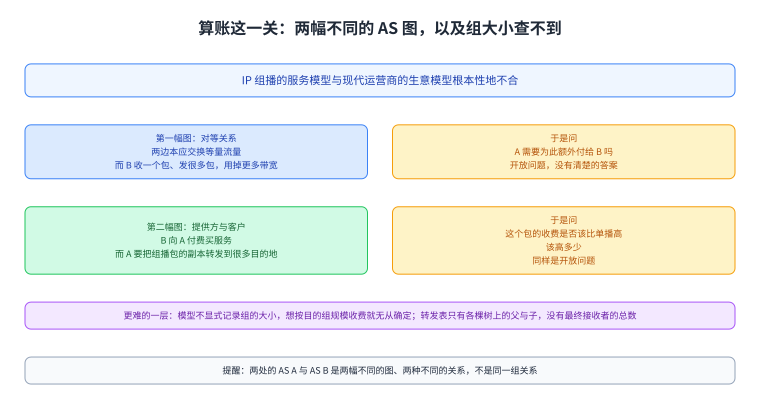
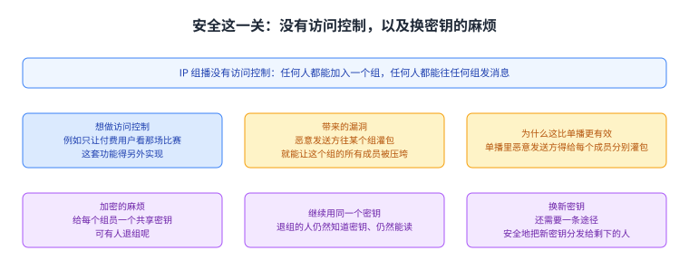

+++
title = "IP 组播的难处：为什么它没铺开"
lecture = 47
slug = "ip-multicast-challenges"
status = "draft"
source_kind = "textbook"
source_url = "https://textbook.cs168.io/beyond-client-server/ip-multicast-challenges.html"
source_title = "IP Multicast Challenges"
output_mode = "explanation"
+++

> 来源课程：UC Berkeley CS168 Computer Networks（教材 CS 168 Textbook）；
> 对应内容：Beyond Client-Server 之 IP Multicast Challenges（<https://textbook.cs168.io/beyond-client-server/ip-multicast-challenges.html>）；
> 上游许可：教材站在站根页声明 CC BY-SA 4.0（第二人复核见 `docs/audit/license-cs168-second-review.md`）；
> 本文由 CourseLingo 原创撰写：**按该节的推进顺序**重新讲解，关键句给出英文原文与中译，**不逐句全译**，配图全部自绘、不转载原图；
> 本文非官方材料，CourseLingo 与 UC Berkeley 及课程教学团队无隶属关系；如与原文有出入，以原文为准。

## 一、跨域这一关

前几讲已经把 IP [[term:multicast]]组播的机制搭起来了，可这套东西在真实世界里一直没有铺开。这一讲要解决的就是这个落差：它不再引入新机制，而是逐条检查这套做法撞上了什么，从跨域、算账，一直查到可靠与安全。源文把前面几讲的[[term:protocol]]协议摆在一起，划出它们的能力边界：

> The protocols we've described so far ([[term:igmp]]IGMP, [[term:dvmrp]]DVMRP, [[term:cbt]]CBT) can be used for intra-domain multicast routing. However, they cannot easily be extended to inter-domain multicast routing.

中译：我们到目前为止讲过的那些协议（IGMP、DVMRP、CBT）可以用在域内（例如 OSPF 管辖的范围）的[[term:routing]]组播路由上，但它们不容易扩展到域间的组播路由。源文给了两个理由。第一个是扩展性：如果在地球规模上跑 DVMRP，那么每当剪枝状态被定期删除时，[[term:packet]]包就会洪泛到整个互联网，这不现实。第二个是自治域的主权与隐私：如果在地球规模上跑 CBT，那台核心[[term:router]]路由器可能落在别人的网络里，这就意味着你得信任别人去控制那台核心路由器。

源文说域间组播路由（现实中这一层是 BGP 那样的协议在管）是个难题，已经有很多工作试图解决它，例如 CBT 的核心选择问题可以通过多个核心（每个网络一个）彼此通信来解；但它紧接着给了一个很实在的结论：实践里域间组播路由几乎没有被采纳。

图里上面是那些协议能做的范围（域内组播路由）与它们不容易扩到的范围（域间），中间两格是源文给的两个理由（扩展性：剪枝定期清空会把包洪泛到整个互联网；主权与隐私：核心路由器可能落在别人的网络里），下面两格是可以尝试的方向（多个核心、每个网络一个，彼此通信）与那句现实结论（几乎没有被采纳）。

## 二、算账这一关

源文说 IP 组播的服务模型与现代运营商用的生意模型根本性地不合。它给了两个例子，而源文特意把这两个例子画成了两幅不同的图。

第一个例子里 AS A 与 AS B 是对等关系。作为对等方，两边本应能交换等量的流量，而组播让「等量」变得很难定义。源文设想的场景是：AS A 给 AS B 发了一个组播包，而 AS B 在组里可能有很多下游；于是 AS B 只收到了一个包，却要发出去很多个包，它用掉的带宽比 AS A 多得多。那么 AS A 需要为此额外付给 AS B 一些钱吗。源文的回答是：这是一个开放问题，没有清楚的答案。

第二个例子里 AS A 是提供方、AS B 是客户，也就是 AS B 向 AS A 付费买服务。源文设想的场景是：如果 AS B 发了一个组播包，而 AS A 得把它的副本转发到很多别的目的地，那么 AS A 对这个包的收费是否应该比一个单播包更高，如果该高，又该高多少。源文给的回答同样是开放问题，没有清楚的答案。

这里有一处需要就地说明的地方：两处用的名字都是 AS A 与 AS B，但它们说的是两幅不同的图、两种不同的关系（第一处是对等，第二处是提供方与客户，源文第二处明确写了 AS A is the provider and AS B is the customer）。本页把两处分开写，不把它们并成同一组关系；也就是说，同一个名字在两处指的不是同一个对象。

除了这两个例子，源文还指出一层更难的地方：IP 组播模型并不显式记录组的大小。如果你打算按目的组的规模来收费，那就没有清楚的办法去确定任何一个目的组有多大；你的转发表告诉你的是各棵交付树上的父与子，而表里没有「总共会有多少台最终主机会收到这个包」这个信息。

图里上面两格是源文那两幅图各自的关系与难题（对等关系下「等量流量」难以定义；提供方与客户关系下「这个包该收多少」难以回答），两处都是开放问题。下面一格是那层更难的地方（模型不记录组的大小，转发表里没有最终接收者总数）。最下面一条是提醒：两处的 AS A 与 AS B 是两幅不同的图，不是同一组关系。

## 三、拥塞控制这一关

源文接着问：一个源沿着交付树把组播包发给很多接收者，它该挑一个什么样的发送速率才不至于压垮网络。

它的两难很清楚：流量会走很多条不同的路径，而每条路径的容量可能不同。源可以只发 1 Mbps 来避免压垮任何一条链路，可这样会让别的路径上的容量白白空着；源也可以发 100 Mbps 来把性能拉满，可这样某些链路就会过载。源文的结论是：源的速率该取多少，没有清楚的答案。

实践里的一个可能解法是按性能把组分开：源文举的例子是定义四个不同的组播组，每组收到的是同一路视频、但画质不同；这样有兴趣的接收者可以试着加入不同的组，看哪一个给它的性能最好。

图里上面是那个两难（1 Mbps 不压垮任何链路但浪费容量；100 Mbps 性能拉满但压垮某些链路），中间一格是结论（没有清楚的答案），下面一格是实践中的可能解法（按性能分成四个组，同一路视频不同画质，接收者自己试）。

## 四、可靠这一关

源文说，跟单播一样，IP 组播也是尽力而为的，这就带来额外的复杂度：你发一个包，它可能到了一部分组员手里，而没有到全部组员手里。

它把几种补救办法逐一摆出来再逐一挑毛病。加确认（ack）：如果组里有几百万成员，单个发送方没法为每个包处理几百万个确认。改用否定确认（nack）：组员收到包就什么都不发，没收到才发一条 nack（例如它的计时器到期）；源文说这同样会让单个发送方被压垮。

源文还指出 nack 这条路里怎么恢复也不清楚：如果有人没收到，我们是把这个包再组播给整个组吗，那会浪费带宽，因为已经收到的人会再收到一份副本；还是只单播给发过 nack 的那些组员，那在很多人没收到时同样浪费，源文举的极端情形是第一条链路就丢了包，于是没有一个组员收到过。它把问题留给读者：哪种重传方式更好并不显然，取决于到底有多少组员收到了。

实践中的做法是绕开这件事：源文说一些现代的 IP 组播应用根本不实现可靠性；或者把可靠性做成在数据流里编码冗余（它提示想一下纠错码），于是丢包与损坏可以靠数据本身纠正，不必求网络帮忙。源文也交代了代价：编码冗余意味着同样的数据要用更多比特，例如你想发 5 个包的数据量，可能会发 10 个包，并编码成任意 5 个包就能重建出原始数据。

图里上面两格是两种补救各自的毛病（几百万成员时单个发送方处理不了几百万个 ack；nack 同样会压垮它），中间两格是恢复方式的两难（再组播给全组会浪费；只单播给发过 nack 的人在很多人没收到时也浪费，极端情形是第一条链路就丢了包）。下面是实践里的做法（不实现可靠性，或把冗余编码进数据流）与那笔代价（5 个包的数据量可能发 10 个包，任意 5 个即可重建）。

## 五、安全这一关

源文说 IP 组播的另一个限制是没有访问控制：任何人都能加入一个组，任何人都能往任何组里发消息。如果你想做访问控制（例如只让付费用户看那场比赛），那得另外实现这套功能。

缺少访问控制会带来安全漏洞。源文设想的是一个恶意发送方：它可以往某个特定的组播组灌包，让这个组的所有成员都被压垮；它特意指出，这比单播那种替代方案更有效，因为在单播里恶意发送方得给每个成员分别灌包。

加密同样不好做。源文说，假设你给每个组员一个共享密钥来加密组播消息，那么如果有人退组呢：如果你继续用同一个密钥，那个用户仍然知道密钥、仍然能读你的消息。一种做法是换一个新密钥，可这样你就需要一条安全地把新密钥分发给剩下组员的途径。

图里上面两格是缺少访问控制这件事本身（任何人都能加入、任何人都能发；要做访问控制只能另外实现）与它带来的漏洞（恶意发送方往一个组灌包就能压垮所有成员，而且比单播里逐个灌包更有效），下面一格是加密的麻烦（用共享密钥时，有人退组就得换密钥，而换完还要安全地把新密钥分发给剩下的人）。

## 六、实践里它落在哪，以及下一步

源文把上面这些难处收成一句结论：因为所有这些难处，今天 IP 组播主要在单个域内使用，而不跨域使用。

可应用那边仍然有跨网络的群通信需求，源文举的例子是多人游戏与视频会议。它的观察是：这些应用并没有依赖那个不支持跨网络的 IP 组播，而是各自实现了自己的群通信方案。源文给了两个例子：如果组足够小，应用可以架一台中央中继服务器，群通信先单播到中继，再由中继单播给其他组员；又或者，如果组足够小，那个最朴素的单播方案（给每个组员各发一个单播包）本来也就够用了。

最后源文把问题指向下一讲：如果 IP 组播跨不了域，而自定义方案又要额外的工作去实现与扩展，那么现代应用到底怎么处理群通信。它给的答案是覆盖组播，也就是 IP 组播的替代方案：把网络功能实现在第七层而不是第三层。

图里上面一格是那句结论（今天 IP 组播主要在单个域内使用，不跨域），中间两格是应用自己的方案（组足够小时架中央中继服务器；或者干脆用最朴素的单播方案），下面一格是把问题指向下一讲（覆盖组播：把网络功能放在第七层而不是第三层）。

## 读完应该能回答

1. 域内那三个协议为什么不容易扩展到域间，源文给的两个理由各是什么？
2. 源文那两幅 AS 图各自的关系与难题是什么，为什么两处的 AS A 与 AS B 不是同一组关系？
3. 一个源沿着交付树发送时，1 Mbps 与 100 Mbps 各自的问题是什么，实践里怎么绕开这件事？
4. 可靠与安全这两关各自的麻烦在哪，源文最后把答案指向哪一种做法？

## 脉络回顾

这一讲是 `/beyond-client-server/` 那一段里给 IP 组播算总账的一讲。前面几讲是把这套机制搭起来：上一段讲组播的问题与两种落点（IP 组播与覆盖组播），接着讲 IP 组播的服务模型，然后是具体协议（先是 DVMRP，把单播的交付树反过来用、再按组剪枝；再是核心树那类做法，把树组织到少数几个核心周围）。这一讲不再加新机制，它逐条检查这套东西在真实世界里会撞上什么：跨域、算账、拥塞控制、可靠、安全。

最要紧的转折是它把「技术上行不行」换成了「生意上行不行」。源文在算账那一节里指出，IP 组播的模型与现代运营商的生意模型根本性地不合：对等方之间要交换等量流量，而组播让一个域「收一个包、发很多包」，于是「等量」没了定义；更麻烦的是模型里根本没有组大小这个量，想按规模收费都无从下手。它给两处难题的答案都是「开放问题，没有清楚的答案」，这不是回避，而是这套机制在部署上停下来的真实原因。

这一讲留下的出口也很清楚：既然域间这条路走不通，那么答案就落到第七层——用覆盖组播把网络功能搬到应用侧去做，这正好是上一段开头摆出的两个选项里的另一个。按仓内清单，这一段接下来就是讲覆盖组播的那一讲。

## 溯源

- **字段核对**：`docs/lecture-manifest.md` 第 47 行为 `ip-multicast-challenges` / `IP Multicast Challenges` / `/beyond-client-server/ip-multicast-challenges.html`（本讲字段由我从 manifest 读出）；抓页时 `<title>` 与 H1 都是 `IP Multicast Challenges`。两处一致；目录 `content/47-ip-multicast-challenges/`、`lecture = 47`。抓页首次 http=000、第二次 200，按惯例把 000 当成网络问题重试，没有当成 404。
- **源文件与范围**：该页 HTML 共 29,602 字节，正文 8,079 字符，正文锚点 `#main-content`，实测 6 个二级小节（Inter-Domain Routing / Charging / Congestion Control / Reliability / Security / IP Multicast in Practice），`TODO` 标记 0 处。本页把 6 节写成本页六节，一一对应。
- **配图：独立 3 张、连播 0 张**（`7-048-multicast-charging-1`、`7-049-multicast-charging-2`、`7-050-multicast-congestion`，都在 `assets/beyond-client-server/` 下；前两张对应「算账」那两个例子，第三张对应拥塞控制）。

- 本次逐张看过 0 张：这一讲我仍把余量优先给正文与六道闸门。按派单方给的格式写清楚：独立 3 张、连播 0 张、看过 0 张、没有使用缩放版本（因为没看）；不写成「逐张看过」。
- **第五类（同一个名字是否指同一个东西）的覆盖面**：本讲重点核了 AS A 与 AS B 这一对名字。

- 源文先用它们画了一幅对等关系的图，再用同样的名字画了一幅提供方与客户关系的图（第二处原文写明 `AS A is the provider and AS B is the customer`）⇒ 同一个名字在两处不是同一个对象，本页把两处分开写并在正文里点明这件事。另外核了 `IGMP, DVMRP, CBT` 这一串名字：三者在更早的页面里都各自出现过，本页按「这三者是域内那套协议」这一处所指使用，没有把其中任何一个换成别的对象。

- - **成对的数与跨讲自查**：其一，源文说「四个不同的组播组」，后面没有再列别的数字，本页按四个写；其二，纠错码那个例子里「5 个包的数据量、发 10 个包、任意 5 个可重建」三个数互相自洽（10 ≥ 5，且任取 5 个足够），本页按同一组的三个数处理；其三，拥塞控制里的 1 Mbps 与 100 Mbps 是同一处对比的两端，不是两个不同场景；

- 其四，源文提到的 IGMP 与组播服务模型那一讲（第 44 讲，另一位作者那一页）是同一个机制，DVMRP 与第 45 讲是同一份协议，CBT 与核心树那一讲（第 46 讲）是同一份协议，本页都按跨讲同一对象处理。

- - **四种子形态的覆盖面（本讲）**：其一 方向词：核了三处——「AS B 收到一个包、却要发出很多包，用掉的带宽比 AS A 多」（扇出方向与结论一致）、「收到就什么都不发、没收到才发一条 nack」（两个分支方向互斥且完整）、「只让付费用户看」那处方向无关；其二 等号两边：本讲没有「必须改写成它自己」这类恒等式，无对象；

- 其三 说 N 项列 M 项：核了两处——「我们到目前为止讲过的协议（IGMP、DVMRP、CBT）」后面正好三项，「四个不同的组播组」与后文没有冲突；其四 例子合不合自家判据：1 Mbps 与 100 Mbps 的两难、5 与 10 个包的编码比例都与源文自己的说法一致，未发现不合判据的例子。
- **术语 grep**：`IGMP`／`DVMRP`／`CBT`／`overlay multicast`／`nack` 逐个在已提交页面 grep 过（`-i`，含键）：前三个更早出现过，其余此前未出现 ⇒ **不新增词条**，一律用纯文本；本页 8 个标记全部加在**正文**里（不落在 front matter，那会让判据不算）。
- **我们补的（源文没有写）**：六节各一句定位；「这一讲不再加新机制，而是逐条检查它在真实世界里撞上什么」这句定位；

- 「它把『技术上行不行』换成了『生意上行不行』」这个读法；以及那处 AS A 与 AS B 的名字对照说明。
- **我没做的事**：3 张配图没看（见上）；没有去读源文提到的那篇关于域间组播的工作，也没有核对现代应用那些自定义方案的实现细节；本页全部内容来自这一页源文。