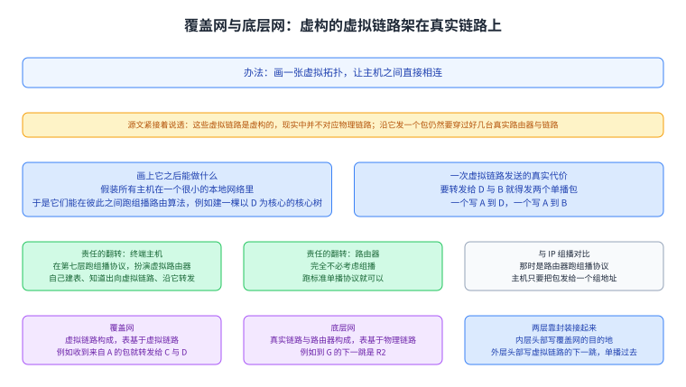
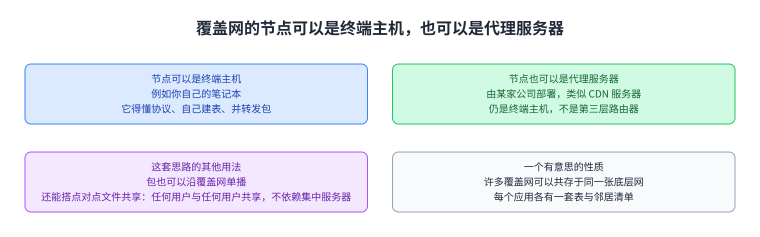
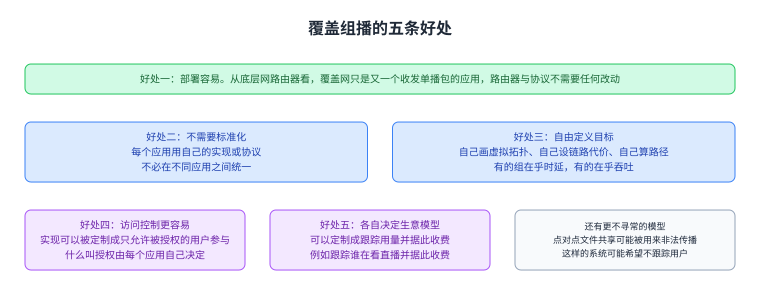
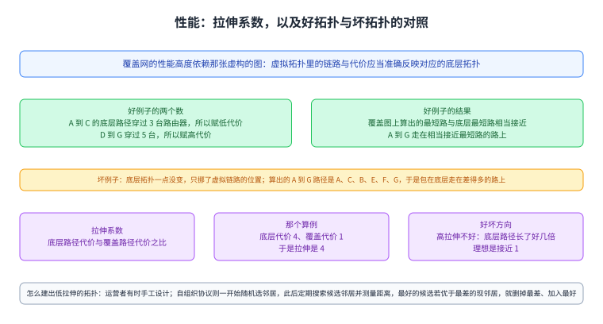
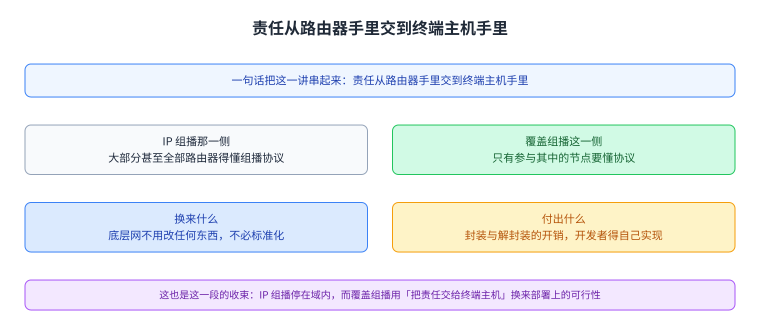

+++
title = "覆盖组播：让终端主机自己去转发"
lecture = 48
slug = "overlay-multicast"
status = "draft"
source_kind = "textbook"
source_url = "https://textbook.cs168.io/beyond-client-server/overlay-multicast.html"
source_title = "Overlay Multicast"
output_mode = "explanation"
+++

> 来源课程：UC Berkeley CS168 Computer Networks（教材 CS 168 Textbook）；
> 对应内容：Beyond Client-Server 之 Overlay Multicast（<https://textbook.cs168.io/beyond-client-server/overlay-multicast.html>）；
> 上游许可：教材站在站根页声明 CC BY-SA 4.0（第二人复核见 `docs/audit/license-cs168-second-review.md`）；
> 本文由 CourseLingo 原创撰写：**按该节的推进顺序**重新讲解，关键句给出英文原文与中译，**不逐句全译**，配图全部自绘、不转载原图；
> 本文非官方材料，CourseLingo 与 UC Berkeley 及课程教学团队无隶属关系；如与原文有出入，以原文为准。

## 一、这一讲要解决什么问题

上一讲把 IP [[term:multicast]]组播在真实世界里撞上的麻烦逐条查了一遍，最后指向这一讲：既然域间那条路走不通，那就把网络功能搬到第七层去做。源文交代了这条路的来历：IP 组播是在 1990 年代到 2000 年代发展起来的，而 2000 年代初它的部署很慢，部分原因正是前面讲过的那些问题；于是冒出了一批创业公司，源文点了四家：FastForward Networks（伯克利）、ProxyNet（伯克利）、Sightpath（MIT）与 Akamai（MIT）。它说这些工作大体上是各自独立的，但方案都用同一个基本思路，也就是基于覆盖网的组播。

这一讲要解决的就是那件难事：跨不同网络实现组播。源文说，如果所有主机都属于同一个组，要让分处不同网络的[[term:router]][[term:routing]]路由器们协调起来、把[[term:packet]]包发给整个组，是很困难的。它的解法是把这件事从路由器手里拿走，交给终端主机去做。

图里上面是 IP 组播部署慢这件事与四家创业公司（两家来自伯克利、两家来自 MIT），中间是那个难事（跨不同网络实现组播），下面一格是这一讲选的路（把这项工作交给终端主机）。

## 二、覆盖组播是什么

办法是画一张虚拟的网络拓扑，让主机之间直接相连。源文紧接着把这层虚构说透：这些虚拟[[term:link]]链路是虚构的，它们在现实中并不对应物理链路；例如 A 想沿那条虚拟链路把包发给 D，包仍然要穿过好几台真实的路由器与链路。

可画上这些虚拟链路之后，我们就可以假装所有主机都连在一个很小的本地网络里，于是这些主机就能在彼此之间跑组播路由算法。源文举的例子是：我们可以用这些虚拟链路建一棵以 D 为核心的核心树，然后大家沿树上的虚拟链路广播包，就实现了组播。它也把「一次虚拟链路发送」的真实代价讲清楚：要把包同时转发给 D 与 B，A 必须发出两个[[term:unicast]]单播包，一个写 A 到 D、一个写 A 到 B，而它们各自都要穿过好几台真实路由器与链路。

从架构上看，这就把责任翻了个面。源文说，终端主机（在第七层）现在负责跑组播[[term:protocol]]协议，它们此时扮演的是虚拟路由器：得自己建组播转发表、知道自己的出向虚拟链路（例如写成静态表项），并沿虚拟链路转发包；而路由器完全不必考虑组播，它们跑标准单播协议就行了。源文把这一点与 IP 组播对比：后者是路由器负责跑组播协议，终端主机不必想协议，只要把包发给一个组地址。

术语在这一节定型：那些虚拟链路构成覆盖网，覆盖网里的终端主机（虚拟路由器）彼此对话来跑组播路由算法，覆盖网的路由表基于虚拟链路（例如 B 的表可能写：如果我收到来自 A 的包，就转发给 C 与 D）；而负责沿虚拟链路把包送过去的真实链路与路由器构成底层网，底层网的路由器彼此对话来跑标准单播路由算法（源文举的例子是距离向量与 BGP，链路状态那类则例如 OSPF），底层网的路由表基于物理链路（例如 R1 的表可能写：到 G 的下一跳是 R2）。

两层之间靠封装接起来。源文说，内层[[term:header]]头部（覆盖网那层）写的是「来自 A、发往 G1」，主机读这个覆盖网包来决定怎么转发；如果主机 A 判定这个包要沿通往 C 的那条虚拟链路走，它就再套一个外层头部写「来自 A、发往 C」，把这个包单播给 C，而底层网只依据外层头部把它从 A 送到 C。

图里上面是「画虚拟链路」这个动作与它的虚构性（虚拟链路不对应物理链路；虚拟链路发送仍要穿过好几台真实路由器与链路），中间两格是责任的翻转（终端主机扮演虚拟路由器、要自己建表与转发；路由器完全不必考虑组播），下面两格是两层的名字与各自的表（覆盖网基于虚拟链路、底层网基于物理链路）与那层封装（内层写覆盖网的目的地，外层写虚拟链路的下一跳）。

## 三、谁来当覆盖网的节点

源文说，最基本的模型里，覆盖网的节点就是终端主机（例如你自己的笔记本）。这意味着终端主机得懂组播路由协议、自己建转发表、并转发包。

它们也可以是代理服务器，由某家公司部署（源文说这类机器类似 CDN 服务器）。源文强调这仍然是运行组播路由协议的终端主机，只是它们不是真正的用户机器，而是专门部署来帮助支撑组播路由的；而且这些代理服务器仍然要把包封装起来、经底层网单播出去，所以它们不是第三层的路由器。

源文还说，覆盖网这套思路并不只用于组播：包也可以沿覆盖网单播，你还可以用它搭一个点对点文件共享服务（源文对点对点的定义是：组里任何用户都能与任何其他用户共享文件，而不依赖一台集中存所有文件的服务器）。最后它指出一个很有意思的性质：许多覆盖网可以同时共存在同一张底层网之上；从终端主机的角度看，它就是在跑两个各自独立的应用，每个应用有自己的一张转发表、自己的邻居链路清单等等，而每个应用可以提供不同的服务。

图里上面两格是节点可以是哪两种（终端主机自己跑协议、自己建表与转发；公司部署的代理服务器，类似 CDN 服务器，但仍是终端主机、不是第三层路由器），中间一格是这套思路的其他用法（沿覆盖网单播、点对点文件共享），下面一格是那个性质（许多覆盖网可以共存于同一张底层网，每个应用各有一套表与邻居清单）。

## 四、这套做法的好处

源文把好处列了很长一串，而第一条是部署容易。它的理由很干净：从底层网路由器的角度看，覆盖网只是又一个收发单播包的应用，底层网的路由器与协议不需要任何改动。源文把这一点与 IP 组播对比：后者要求大部分甚至全部路由器都懂组播协议，而在这里只有参与其中的那些节点（例如组里的用户）需要懂协议，其他终端主机不需要任何改动。

第二条是不需要标准化：每个覆盖组播应用都可以用自己的实现或协议，不同应用（例如不同的组）之间不必统一；对比之下，IP 组播要求所有路由器说同一种协议，它们才能彼此协调。

第三条是自由定义目标：因为每个应用能自己做实现决定，它就能自己决定怎么画虚拟拓扑、怎么设链路代价、怎么算路径；源文说有些组更在乎时延，另一些组更在乎吞吐。

第四条是访问控制更容易：路由协议的实现可以被定制成只允许被授权的用户参与，而「什么叫授权」由每个应用自己决定。

第五条是各自决定生意模型：实现可以被定制成跟踪用量并据此收费，而「什么叫跟踪用量」同样由每个应用自己决定。源文举的例子是一个由 CDN 服务器组成的覆盖网，用来给几百万人直播一场体育比赛，应用自己可以跟踪哪些用户在看、并据此向他们收费。它还补了一类更不寻常的生意模型：一个点对点文件共享系统可能被用来非法传播受版权保护的内容，而这样的系统可能希望不去跟踪用户，以免让用户惹上麻烦。

图里上排三格是前三条（部署容易：底层网只是多了一个收发单播包的应用，不必改任何路由器与协议；不需要标准化：每个应用用自己的实现；自由定义目标：自己画拓扑、自己设代价，有的组在乎时延、有的在乎吞吐），第二排两格是后两条（访问控制更容易，因为实现可以被定制成只允许被授权的用户参与；各自决定生意模型，例如跟踪谁在看直播并据此收费），最后一格是那类不寻常的模型（点对点文件共享可能希望不跟踪用户）。

## 五、性能取决于那张虚构的图

源文说，覆盖网的性能高度依赖你在终端主机之间画出来的那张虚拟拓扑；具体地说，虚拟拓扑里的链路与代价应当准确地反映对应的底层拓扑。

它先用一个好例子说明这件事。虚拟链路 A 到 C 可以被赋一个低代价，因为现实中 A 与 C 离得近（底层路径穿过 3 台路由器）；虚拟链路 D 到 G 该赋一个高代价，因为现实中 D 与 G 离得远（底层路径穿过 5 台路由器）。这样在覆盖拓扑上算出来的最短路，就会与底层拓扑上的最短路相当接近，而底层路径短是我们想要的，因为包最终还是在底层网里被转发的。在这个特定的覆盖拓扑里，A 到 G 的包确实走在一条相当接近最短路的路上。

接着是坏例子：源文说，注意这张图里底层拓扑一点没变，变的只是虚拟链路摆放的位置。在这一版覆盖拓扑里，如果我们算 A 到 G 的最短路，会得到 A 到 C、到 B、到 E、到 F、再到 G 这样一条路径；把包沿它发出去，A 到 G 的包在底层网里就会走在一条差得多的路上。

怎么量这件事，源文给了拉伸系数这个定义：它是底层路径代价与覆盖路径代价之比。在上面的例子里，底层代价是 4、覆盖代价是 1，于是拉伸系数是 4；源文说，为了更好地刻画底层网，把那条虚拟链路的代价设成 4 可能更合理。拉伸值高是不好的，因为它意味着底层路径比对应的覆盖路径长了好几倍；理想是拉伸值更低、更接近 1，也就是底层路径代价与覆盖路径代价大致相同。

最后是怎么建出低拉伸的拓扑。源文说运营者有时是手工设计拓扑的；此外也存在自组织协议来自动发现一张好的覆盖拓扑。它给了一个高层的做法：一开始邻居是随机选的；此后定期搜索新的候选邻居并测量到它们的距离（例如发一个包量往返时间）；如果最好的候选邻居优于你最差的那个现邻居，就放弃那个最差的（删掉这条虚拟链路）、加入那个最好的（加一条新的虚拟链路）。

图里上面是好例子的两个数（A 到 C 的底层路径穿过 3 台路由器所以赋低代价；D 到 G 穿过 5 台所以赋高代价），中间是坏例子（底层拓扑没变、只挪了虚拟链路，算出的 A 到 G 路径会让包在底层走差得多的路），下面两格是拉伸系数的定义与那个算例（底层代价 4、覆盖代价 1，所以拉伸是 4；理想是接近 1），最后一格是两种造拓扑的办法（运营者手工设计；自组织协议定期比较候选邻居与最差现邻居）。

## 六、代价与它今天的地位

源文列了两条代价。一条是额外的开销会影响性能，例如封装与解封装要花额外的时间与算力。另一条是它不是互联网内建的，也就是说应用开发者必须自己实现覆盖组播；它把这一点与 IP 组播对比：后者里开发者只要把包发给组地址就行，不必自己建转发表那一套。

不过源文在最后给了它一个很实在的评价：尽管有这些代价，覆盖组播的性能已经足够好，所以它在今天的互联网上被普遍部署。这也正是这一段的收束：IP 组播停在域内，而覆盖组播用「把责任交给终端主机」换来了部署上的可行性。

图里上面两格是两条代价（封装与解封装要花额外的时间与算力；它不是互联网内建的，开发者得自己实现，而 IP 组播里只要把包发给组地址），下面一格是源文最后的评价（性能已经足够好，因此在今天的互联网上被普遍部署）。

图里四格是那一组对照：IP 组播那一侧与覆盖组播这一侧各自要求谁懂协议，以及这套翻转换来什么、付出什么；下面一格是这一段的收束。

## 读完应该能回答

1. 覆盖组播要解决 IP 组播的哪件难事，它画的那些虚拟链路为什么说是「虚构的」？
2. 覆盖网与底层网各自的节点、表、以及跑的协议有什么不同，两层之间靠什么接起来？
3. 源文列了哪几条好处，其中哪一条是它认为最大的？
4. 拉伸系数是怎么定义的，好拓扑与坏拓扑的差别在哪，自组织协议怎么做邻居替换？

## 脉络回顾

这一讲是 `/beyond-client-server/` 那一段的收束之一。这一段从第 43 讲把「群通信」这个问题立起来开始：先讲组播要什么（每条链路只承载一次），再把实现拆成两个落点（IP 组播与覆盖组播）；接着第 44 讲讲 IP 组播的服务模型，第 45 讲讲 DVMRP 怎么把单播的交付树反过来用并按组剪枝，第 46 讲讲核心树那类做法，第 47 讲则逐条检查 IP 组播在真实世界里撞上的麻烦（跨域、算账、拥塞控制、可靠、安全），并给出结论——它基本停在域内。这一讲就是那个结论的出路：把网络功能从第三层搬到第七层。

最要紧的转折是责任归谁。IP 组播要求大部分甚至全部路由器都懂组播协议，而这一讲把这件事交给终端主机：终端主机扮演虚拟路由器，自己建表、自己沿虚拟链路把包封装后单播出去，路由器则完全不必考虑组播。这个翻转换来的是部署上的可行性（底层网不用改）、不需要标准化、以及访问控制与生意模型上的自由；付出的代价是封装与解封装的开销，以及开发者得自己实现。

而这一讲也给出了这类系统真正的设计难题：那张虚构的图必须准确反映底层拓扑，否则算出来的最短路在底层会走得很难看——源文用拉伸系数把这个误差量出来，并给出好拓扑与坏拓扑的对照。它留下的题目是怎么自动建出低拉伸的拓扑（手工设计之外，自组织协议靠定期比较候选邻居与最差现邻居来替换），而按仓内清单，这一段接下来的几讲转到另一类群通信：集合操作。

## 溯源

- **字段核对**：`docs/lecture-manifest.md` 第 48 行为 `overlay-multicast` / `Overlay Multicast` / `/beyond-client-server/overlay-multicast.html`（本讲字段由我从 manifest 读出）；抓页时 `<title>` 与 H1 都是 `Overlay Multicast`。两处一致；目录 `content/48-overlay-multicast/`、`lecture = 48`。抓页首次 http=000、第二次 200，按惯例当网络问题重试，没有当成 404。
- **源文件与范围**：该页 HTML 共 34,622 字节，正文 11,953 字符，正文锚点 `#main-content`，实测 6 个二级小节（Brief History / Definition / Implementing Overlay Networks / Benefits / Performance / Drawbacks），`TODO` 标记 0 处。本页把 6 节写成本页六节，一一对应。
- **配图：独立 11 张、连播 0 张**（`7-051` 到 `7-061`；其中 `7-055` 到 `7-058` 是四张连续的转发示意图）。本次逐张看过 0 张：余量仍优先给正文与闸门。

- 按格式：独立 11 张、连播 0 张、看过 0 张、没有使用缩放版本（因为没看）；不写成「逐张看过」。
- **成对的数与跨讲自查（含把源文自己的每个「N 项」数一遍）**：其一，源文说「要把包同时转发给 D 与 B，A 必须发出两个单播包」，随后正好列出两个（A 到 D、A 到 B）；其二，源文说 2000 年代初冒出一批创业公司，随后点了四家（FastForward Networks、ProxyNet、Sightpath、Akamai），而它用的说法是 many 与 including，没有声称数字  这不算数目不符 ；

- 其三，拉伸系数那个例子里三个数互相自洽：底层代价 4、覆盖代价 1、拉伸 4（4 除以 1），而源文说「把那条虚拟链路的代价设成 4 可能更合理」也与之一致；其四，源文的 BGP 与更早讲路由那几讲是同一个协议 ；其五，源文的 A 到 C 穿过 3 台、D 到 G 穿过 5 台是两段不同距离的对照，不是同一个对象。
- **第五类（同一个名字是否指同一个东西）的覆盖面**：本讲点名核了三处。

- 第一处是那两幅性能图里的 A 到 G：源文明确写「底层拓扑一点没变，只改了虚拟链路的摆放」 两幅图里的这些字母指的是同一组底层主机，本页按同一对象处理。第二处是 `G` 与 `G1`：前者是那台叫 G 的主机（源文写 R1 的表里「到 G 的下一跳是 R2」），后者是组地址（源文写内层头部「来自 A、发往 G1」） 两个名字长得像但不是同一个对象，本页在正文里分别写清。

- 第三处是 `G1` 与「组地址」：源文在举例时把组地址写成 G1，本页按组地址处理。
- **四种子形态的覆盖面（本讲）**：其一 方向词：核了三处——「最好的候选邻居优于你最差的现邻居，就放弃最差那个、加入最好那个」（前后一致）、拉伸系数定义为「底层代价与覆盖代价之比」并用 4 与 1 得 4（顺序正确，反了会得 0.25）、「高拉伸不好、接近 1 才好」（方向一致）；其二 等号两边：本讲没有「必须改写成它自己」这类恒等式，无对象；

- 其三 说 N 项列 M 项：核了两处（两个单播包、四家创业公司），并按派单方这一轮新增的要求把本溯源里每一处「N 项」也数了一遍：本溯源里我只写了两处数目（两处 N 项检查、写成 6 节），都与正文一致；其四 例子合不合判据：拉伸那组数与源文自己的定义和例子一致，3 与 5 台路由器的对照也与「近的赋低代价、远的赋高代价」一致，未发现不合判据的例子。

- - **术语 grep**：`overlay`／`underlay`／`encapsulation`／`stretch factor`／`peer-to-peer`／`CDN`／`Akamai` 逐个在已提交页面 grep 过（`-i`，含键）：前几个更早出现过，其余此前基本未出现 ⇒ **不新增词条**，一律纯文本；本页 8 个标记全部加在**正文**里（不落在 front matter）。
- **我们补的（源文没有写）**：六节各一句定位；「责任归谁」这个把全讲串起来的读法；

- 「IP 组播停在域内，而覆盖组播用『把责任交给终端主机』换来部署上的可行性」这句收束；以及 `G` 与 `G1` 那处名字区分。
- **我没做的事**：11 张配图没看（见上）；没有去读源文点名的那四家公司的任何材料，也没有核对自组织协议的具体实现；本页全部内容来自这一页源文。