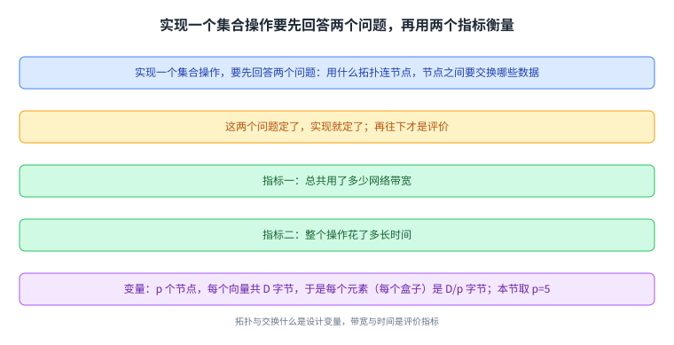
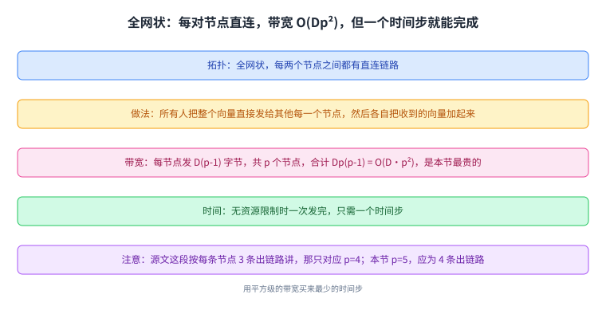
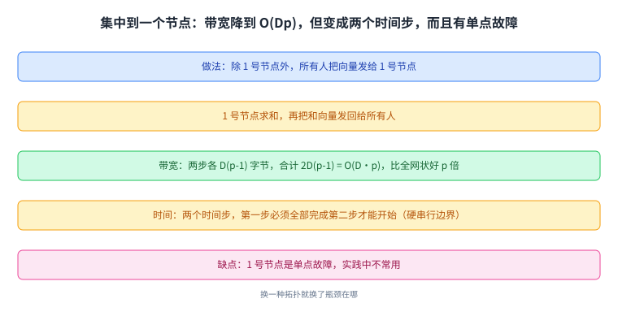
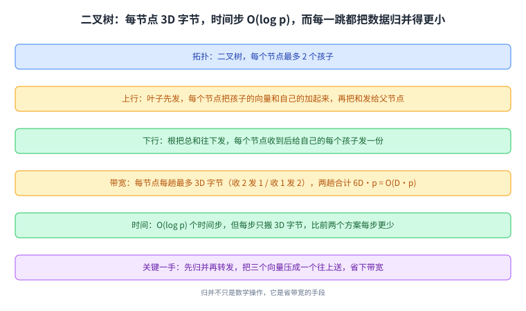
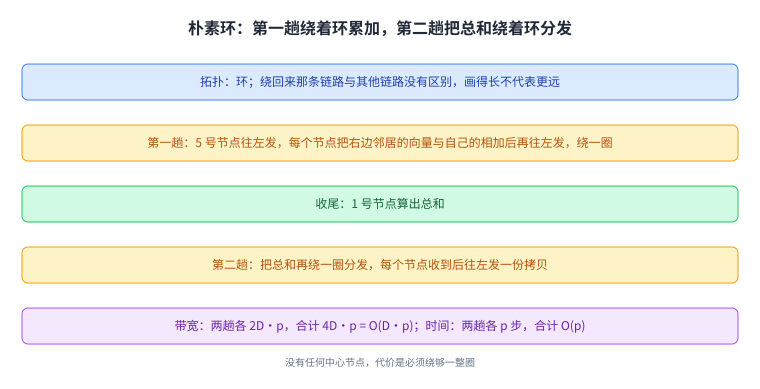
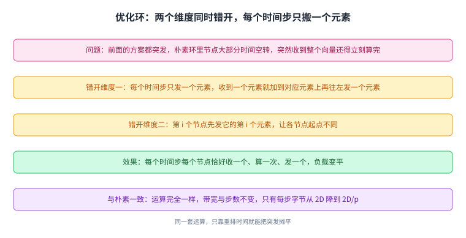
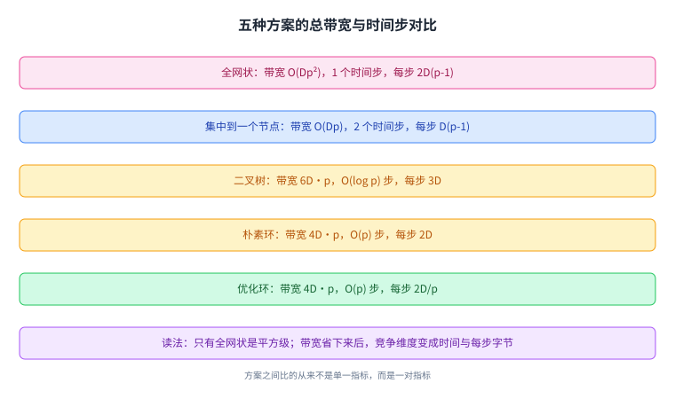
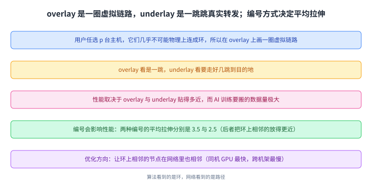
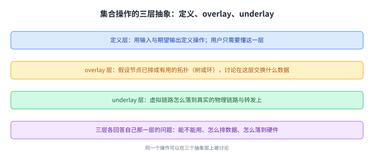

+++
title = "集合操作的实现：五种做法与它们各自的账"
lecture = 50
slug = "collective-implementations"
status = "draft"
source_kind = "textbook"
source_url = "https://textbook.cs168.io/beyond-client-server/collective-implementations.html"
source_title = "Collective Implementations"
output_mode = "explanation"
+++

> 来源课程：UC Berkeley CS168 Computer Networks（教材 CS 168 Textbook）；
> 对应内容：Beyond Client-Server 之 Collective Implementations（<https://textbook.cs168.io/beyond-client-server/collective-implementations.html>）；
> 上游许可：教材站在站根页声明 CC BY-SA 4.0（第二人复核见 `docs/audit/license-cs168-second-review.md`）；
> 本文由 CourseLingo 原创撰写：按该节的推进顺序重新讲解，关键句给出英文原文与中译，不逐句全译，配图全部自绘、不转载原图；
> 本文非官方材料，CourseLingo 与 UC Berkeley 及课程教学团队无隶属关系；如与原文有出入，以原文为准。

## 一、这一讲要解决什么问题：实现前要定哪两件事

上一讲给出了七个集合操作的定义，而定义只说了「输入什么、输出什么」，没说网络里怎么做到。这件事之所以值得单独花一讲，是因为代价差别极大：AI 训练要搬的数据量大得惊人，同一份数据在网络里抄近路还是绕远路，直接决定训练任务是一天跑完还是拖上很久。这与普通的 TCP 或 UDP 通信也很不一样：那边通常只有一个发送方在乎快慢，而这里所有节点都在等彼此，最慢的那一个决定整轮的时长。这一讲接着往下走：

> To implement a collective, there are two questions we need to answer: What topology do we use to connect the nodes; what data has to be exchanged between the nodes in order to efficiently complete the operation

也就是说，拿定拓扑与拿定要交换哪些数据，这两件事定下来，实现就定了。而接下来是评价：

> What was the total amount of network bandwidth we used; how long did it take for the operation to complete Other performance metrics can also be focused, but we'll focus on these two for these notes.

总[[term:bandwidth]]用量与完成时间，这两个指标就是这一讲所有方案之间比较的尺子。而为了让比较可算，源文先立了变量：共有 $p$ 个节点，每个向量总共 $D$ 字节，于是每个向量元素（图里的每一个盒子）是 $D/p$ 字节。这一讲为了让动画更好看，取 $p=5$，也就是每个向量 5 个元素。

源文还专门提醒了一句，免得读者误会 $p$ 变大就代表数据变多：

> Remember that the vector represents arbitrary data, and we divide each vector into \(p\) equally-sized sub-vectors, where \(p\) is the total number of nodes.

同一份数据被切成几块，是可以变的，$p$ 从 4 变成 5 不代表数据变多，只代表切得更细。

而这一讲从头到尾只实现一个操作，也就是 AllReduce，因为它的思路可以搬到别的操作上；源文复述了它的定义：逐元素求和，然后把和向量发给所有节点。

这张图是本讲的坐标系：拓扑与交换什么数据是设计变量，带宽与时间是评价指标。

## 二、方案一：全网状，用平方换一步

第一种拓扑最直白：每两个节点之间都有一条直连[[term:link]]，也就是全网状：机架内用 Ethernet 把机器连起来，再往上由 spine 汇聚。做法是两步：所有人把自己的整个向量直接发给其他每一个节点，然后每个节点把收到的所有向量加起来。

带宽账很好算：每个节点要把 $D$ 字节发给 $p-1$ 个同伴，于是每个节点发出 $D(p-1)$ 字节；总共 $p$ 个节点，所以总发送量是

$$Dp(p-1) = O(D \cdot p^2)$$

这是本讲最贵的一个方案，代价是平方级的。

而它的时间账很漂亮：在没有资源限制的前提下，所有发送可以同时进行，于是一个时间步就完成。源文在这里给了一句值得注意的话：每个节点同时在用它的所有出链路往外发（按 $p=5$ 算，每个节点有 4 条出链路），每个节点每个时间步要发和收 $2D(p-1)$ 字节（发 $D(p-1)$ 加上收 $D(p-1)$，所以要乘 2）。

这里有一处需要登记的细节：源文这段说「using all 3 of its outgoing links」，3 条出链路对应的是 $p=4$，而这一节开头明确把 $p$ 设成了 5，配图里画的也是 5 个节点（每个节点因此有 4 条出链路）。本页按 $p=5$ 的算法写，并在溯源登记这处不一致。

这张图解释了这个方案的取舍：用平方级的带宽买来最少的时间步。

## 三、方案二：集中到一个节点

第二个方案把计算集中起来：除 1 号节点之外，所有人把自己的向量发给 1 号节点；1 号节点算出和，再把和发回给所有人。

带宽账：第一步每个（除 1 号外的）节点发 $D$ 字节，共 $D(p-1)$ 字节；第二步 1 号节点把 $D$ 字节的和向量发给 $p-1$ 个节点，也是 $D(p-1)$ 字节。两步合计

$$2D(p-1) = O(D \cdot p)$$

源文特意点出这个对比：

> Notice that this is a factor of \(p\) better than the \(O(D \cdot p^2)\) bytes sent in the full-mesh approach.

比全网状好了整整 $p$ 倍。

时间账：在无资源限制的前提下，第一步所有人同时发给 1 号节点；然后必须等 1 号节点把和算出来；算完之后 1 号节点再同时发回给所有人。所以是两个时间步，而 1 号节点每个时间步要发或收 $D(p-1)$ 字节。源文强调这一步的真正含义：

> with this approach, all the sending in the first step has to finish before sending in the second step can start. By contrast, in the first approach, all of the data sending could happen at the same time.

两个时间步之间有一条硬串行边界，而全网状没有。最后是一个很现实的评价：

> One downside of this approach is that we have a single point of failure at Node 1. This approach is not commonly used in practice.

1 号节点成了单点故障，所以实践里并不常用。

这张图与上一张成对：同一份数据，换一种拓扑就换了瓶颈在哪。

## 四、方案三：二叉树，先把和算小

第三个方案建一棵二叉树（每个节点最多 2 个孩子）。做法分上行与下行两趟：从叶子开始，每个节点把自己的向量发给父节点；收到所有孩子的向量之后，先和孩子的一起加起来，再把和发给自己的父；一层层往上，根就算出了总和。第二趟是根的下行：根把总和发给自己的孩子，收到父的和之后，再给自己的每一个孩子发一份。

带宽账：上行时每个节点最多收 2 个向量（二叉树）、发 1 个向量，于是上界是每个节点 $3D$ 字节，合计 $3D \cdot p$ 字节；下行时每个节点收 1 个、最多发 2 个，同样是每节点 $3D$ 字节，合计 $3D \cdot p$ 字节。两趟合计 $6D \cdot p = O(D \cdot p)$。

 这里有一处值得登记的措辞：源文说这个量「the same as the reduce-at-one-node approach」。按复杂度它们确实同阶（都是 $O(D \cdot p)$），但数值并不相等：树方案是 $6D \cdot p$，而集中式是 $2D(p-1)$，相差大约 3 倍。本页按「同阶但不等值」写。

时间账：必须先收到孩子的向量才能往上发，所以上行要 $O(\log p)$ 个时间步，下行再要 $O(\log p)$，合计 $O(\log p)$。而每个节点每个时间步只发或收 $3D$ 字节，比前两个方案每步要搬的字节少。所以源文的总结是：这个方案时间步更多，但每一步可能更快。

这个方案里最值得学的一手，是它主动利用了归并：

> Each node sums up its vector and its children's vectors, so that it only has to send up a single sum vector to its parent. In a more naive approach, each node would have sent up 3 vectors to its parent (its own vector, and both of its children's vectors), but we took advantage of the reduction to save bandwidth.

因为知道「上面要的是和」，所以可以把三个向量压成一个再往上送。 源文把这个观察推广成一条原则：三个归并类操作（Reduce、ReduceScatter、AllReduce）都留出了这种优化空间。原文有一句话的口径需要登记（它在讲 Reduce 与 ReduceScatter 时写「收到的数据总量其实少于发出的数据总量」）：按整张网络逐字节统计，发出的每个字节都会被收到，两者相等；而按「根节点最终收到的量」统计，因为沿途一直在做归并，收到的确实少于各个发送方发出的总量。本页按后一种读法理解，并在溯源登记这处口径。

这张图是这一讲第一个「设计者可以利用计算」的例子：**归并不只是数学操作，它是省带宽的手段。**

## 五、方案四：朴素环，绕两圈

最后两个方案建一个环。源文先消掉一个常见的误会：1 号节点到 5 号节点那条「绕回来」的链路，和其他链路没有任何特殊之处，画得长并不代表它更远。

朴素环的做法也是两步。第一趟是累加着往一个方向走：5 号节点先把向量往左发；每个节点收到右边邻居的向量后，把它和自己的加起来，再往左发；这个过程会绕着环走一圈，最后 1 号节点算出总和。第二趟是把总和再绕一圈分发：5 号节点先把总和往左发，每个节点收到右边邻居的总和后，往左发一份拷贝，于是所有人都拿到了总和。

带宽账：第一趟每个节点收 1 个、发 1 个，上界是每节点 $2D$ 字节，合计 $2D \cdot p$；第二趟同样 $2D \cdot p$；两趟合计

$$4D \cdot p = O(D \cdot p)$$

时间账：必须收到才能发出，所以第一趟绕环要 $p$ 个时间步，第二趟再要 $p$ 个，合计 $2p = O(p)$。每个节点每个时间步最多发或收 $2D$ 字节。源文的评价与树方案类似：时间步更多，但每步能更快。

源文还补了两条不影响正确性的自由度：起点不一定选 5 号节点，方向也可以反过来。

这张图给出了环方案的基本形状：没有任何中心节点，代价是必须绕够一整圈。

## 六、方案五：优化环，把突发摊平

前四个方案都会产生突发（bursty）的负载，而源文把朴素环的毛病讲得很具体：

> In the naive ring-based approach, each node spends most of its time idling and doing nothing. At one point, you suddenly receive an entire vector, and you have to immediately add that vector to your own vector, and send the result to your left. Everyone else has to wait for you to finish this operation.

大部分时间在空转，然后突然收到一整个向量、必须立刻算完转发，所有人都在等它。

优化的办法是错开（stagger），而且是在两个维度上同时错开。第一个维度是按元素发：不再一次发整个向量，而是每个时间步只发一个元素；收到一个元素就把它加到自己的对应元素上，再把这一个元素的和往左发。第二个维度是错开起点：

> Instead of the starting point being Node 5 sending all of its elements, we now start by having the \(i\)th node send its \(i\)th element.

第 $i$ 个节点先发它的第 $i$ 个元素，于是每个节点的起点都不一样。两个维度一叠，效果是：

> At every time step, each node receives exactly one element from its right, computes one sum, and sends exactly one element to its left.

每个时间步，每个节点都恰好收一个元素、算一次和、发一个元素，负载变平了。把这件事重复 $p$ 次，每个元素都会绕环整整一圈；而因为此时并不是每个人都掌握了和向量的所有元素，所以还要再绕一圈把结果铺开（这与 AllGather 的第二趟是同一件事）。

源文对优化前后的关系给了最要紧的一句：

> In summary, the optimized ring-based AllReduce does exactly the same operations as the naive ring-based AllReduce. The only difference is we have staggered the sending and receiving of vectors, to reduce the burstiness of the workload at each node.

做的运算完全一样，改的只是收发的时间安排。 所以带宽与时间步数也不变（还是 $4D \cdot p = O(D \cdot p)$、还是 $O(p)$ 个时间步），变的只有每个时间步要搬多少：朴素方案每步要搬 $2D$ 字节，优化方案每步只搬 $2D/p$ 字节。

这里还有一处需要登记的方向问题：源文描述第二趟「把和铺开」时，朴素方案写的是往左发，而优化方案那一段写的是「收到和的一个元素后，往右发一份」。两处方向相反，本页照录并登记（按环的对称性，两个方向都能绕完一整圈，所以这更像是措辞不一致，而不是机制错误）。

这张图是这一讲最实用的一手：**同一套运算，只靠重新排时间就能把突发摊平。**

## 七、五种方案放在一起看

把五个方案的账并排放在一起，这一讲的结构就清楚了。

| 方案 | 拓扑 | 总带宽 | 时间步 | 每个节点每步的字节 |
| --- | --- | --- | --- | --- |
| 一 | 全网状 | $Dp(p-1) = O(Dp^2)$ | 1 | $2D(p-1)$ |
| 二 | 集中到一个节点 | $2D(p-1) = O(Dp)$ | 2 | $D(p-1)$ |
| 三 | 二叉树 | $6D \cdot p = O(Dp)$ | $O(\log p)$ | $3D$ |
| 四 | 朴素环 | $4D \cdot p = O(Dp)$ | $2p = O(p)$ | $2D$ |
| 五 | 优化环 | $4D \cdot p = O(Dp)$ | $O(p)$ | $2D/p$ |

读法是三条。第一，**全网状是唯一平方级的**，其余四个都是 $O(D \cdot p)$，所以真正的分水岭在「要不要每对节点直连」（[[term:throughput]] 与带宽在这里是一对指标）。第二，带宽省下来之后，竞争的维度就变成了时间：集中式只要 2 步但带宽最贵的那一档已经付过了，树是 $O(\log p)$ 步，环是 $O(p)$ 步，而它们的总带宽是同一量级。第三，最后两个方案的账完全相同，区别只在每步搬多少，这也正是「优化」二字在这一讲里的确切含义。

这张图是这一讲的账本：方案之间比的从来不是单一指标，而是一对指标。

## 八、环是画出来的：overlay 与 [[term:underlay]]

到这里有个现实问题：集合操作允许用户任选 $p$ 台主机来跑，而它们几乎不可能恰好物理上连成一个环。源文的解法是覆盖网：在物理网络之上画一圈[[term:overlay]]虚拟链路，把选中的主机逻辑上连成环。

> When Node D sends its vector to Node B, in the overlay perspective, Node D is sending the vector along a single (virtual) link to its direct neighbor. In the underlay perspective, this vector actually has to travel several hops before reaching its destination of Node B.

在 overlay 看来是一跳，在 underlay 看来要走好几跳（中间要经过若干物理[[term:router]]与链路，每一跳都按 IP 转发；这些单播转发表通常由域内协议（例如 OSPF）或自研方案算出）。 而源文提醒这与前面讲过的覆盖网多播是同一件事：overlay 的性能取决于它与 underlay 网络贴得有多近；在 AI 训练里这件事尤其要紧，因为要搬的数据量极大。

接着源文给了一个可以算的例子：4 个节点要跑 AllReduce，怎么编号性能最好。它先说明编号方式不会影响正确性（任何节点都可以当 1 号；源文特意注明这一点对 AllReduce 成立，但对别的集合操作不一定成立），然后给出两种编号：第一种的平均拉伸（average stretch）是 3.5（因为 C 到 D、B 到 A 这两条虚拟链路要在 underlay 里绕很远），第二种是 2.5（把在环上相邻的节点在物理网络里也放得比较近）。配图把这件事画出来时，逐条虚拟链路上标了各自的 stretch 值（我从配图上能读出 5、3、2 这几档，逐个值与平均值的对应关系以正文的 3.5 与 2.5 为准）。

于是优化方向也就清楚了：

> More generally, to optimize the performance of ring-based AllReduce, we would like adjacent nodes (e.g. Node \(i\) and Node \(i+1\)) to be near each other in the network.

让环上相邻的两个节点，在物理网络里也尽量相邻。 而这正好用上第 36 讲那套[[term:data-center]]的层次：同一台机器上的两块 GPU 通信最快，同机柜次之，跨机架最慢。源文最后点出一个结构性优势：AI 训练任务可预测、底层拓扑固定且规整，所以优化空间很大（比如把某个任务专门排在相邻的节点上，让集合操作尽量落在同一个机架内），而怎么排是当前活跃的研究方向。

这张图把这一讲的「拓扑」分成两层来读：**算法看到的是环，网络看到的是路径。**

## 九、三层抽象

源文最后把整讲收成三层：

> Definitions. At the highest layer of abstraction, we defined the operations by specifying the input and the expected output. The user only needs to understand these definitions to use the collectives.

最上层是定义：用户只需要懂输入与输出，不需要知道怎么实现。

> Overlay. Going down one layer of abstraction, we can think about what data gets exchanged in the overlay topology.

中间层是 overlay：可以假设节点已经排成了一个有用的拓扑（树或环），讨论在这张虚拟拓扑上交换什么数据。

> Underlay. At the lowest level of abstraction, we think about how the virtual links (overlay) correspond to actual physical links in the underlay.

最下层是 underlay：虚拟链路怎么落到真实的物理链路与[[term:forwarding]]上。

这三层[[term:layering]]正好对应这一讲的前后顺序：先讲方案（在 overlay 这一层设计数据交换），下午讲编号与拉伸（把 overlay 落到 underlay），而定义早在上一讲就给出了。

这张图是这一讲的收束：同一个操作，可以在三个不同的抽象层上被讨论，而每一层只回答自己那一层的问题。

## 读完应该能回答

- 实现一个集合操作要先定的两件事，以及衡量它的两个指标；
- 五种方案各自的总带宽与时间步，以及全网状为何是唯一平方级的；
- 二叉树方案为什么能把三个向量压成一个往上送，归并类操作留出了什么优化空间；
- 朴素环的突发来自哪里，优化环在两个维度上各错开了什么；
- overlay 与 underlay 的关系，以及编号方式为什么会影响性能；
- 集合操作的三个抽象层各回答什么问题。

## 脉络回顾

往前看，这一讲与上一讲是一对：上一讲给出七个集合操作是什么，这一讲回答怎么在网络上做到，并把代价算清楚。它接住的正是上一讲结尾埋下的那三层抽象，只是把顺序反过来走了一遍，先从 overlay 这一层设计数据交换，再落到 underlay 上讨论编号。

它解决的那一环，是把「一次集体通信」变成可比较的工程方案。前面几讲（第 44 讲到第 48 讲）讨论多播时，路由器是主角，我们要设计的是转发状态；而这一讲里，主角变成了一组地位相同的主机和它们之间的数据交换计划，网络只提供[[term:bandwidth]]与延迟这两个可预期的量。于是设计问题第一次变成了「在一张图上选一棵树或一个环，然后算总带宽与步数」。

最要紧的转折在「计算可以被搬进通信路径里」这一步。二叉树那一节之所以能把三个向量压成一个，是因为发送方知道上面要的是和，于是可以边转发边归并；这在普通[[term:internet]]的转发里是不成立的（中间节点不知道为什么在传）。所以这一讲与前面所有讲的最大差别是：这里的网络是「知道应用在干什么」的，而这正是集合通信能做得这么省的根本原因。第五个方案（优化环）再往前走了一步：连运算都没改，只把收发的时间排开，就把负载摊平了。

后面哪里用到它：这一讲的三层抽象在后面的无线那一段会以另一种形式再出现（链路层做的事与上层看到的事之间的对应）；而「让相邻编号在网络里也相邻」这条优化思路，是数据中心里所有集合通信库的日常工作。

## 溯源

- 字段核对：`docs/lecture-manifest.md` 第 50 行为 `collective-implementations` / `Collective Implementations` / `/beyond-client-server/collective-implementations.html`（本讲字段由我从 manifest 读出）；抓页时 `<title>` 是 `Collective Implementations | CS 168 Textbook`、H1 是 `Collective Implementations`（与 manifest 一致），目录 `content/50-collective-implementations/`、`lecture = 50`。
- 源文件与范围：该页 HTML 共 44,026 字节（首次抓取即 200，未遇到 `000`），正文 17,971 字符，实测 8 个二级小节（Motivation: Implementing AllReduce / Approach 1: Full Mesh / Approach 2: Reduce at One Node / Approach 3: Tree-Based / Approach 4: Ring-Based (Naive) / Approach 5: Ring-Based (Optimized) / Overlay and Underlay Topologies / Layers of Abstraction），`TODO` 标记 0 处。
- 41 张配图：全部下载成功（`7-082-allreduce-reminder` 到 `7-122-ring-overlay-4`），按用途分成七组：AllReduce 回顾 1 张（`7-082`）、全网状 3 张（`7-083` 到 `7-085`）、集中式 3 张（`7-086` 到 `7-088`）、二叉树 7 张（`7-089` 到 `7-095`）、朴素环 10 张（`7-096` 到 `7-105`）、优化环 13 张（`7-106` 到 `7-118`）、overlay 4 张（`7-119` 到 `7-122`）。1 + 3 + 3 + 7 + 10 + 13 + 4 = 41。41 张全部看过：拼成 2 张联系表逐张比对（缩放版，非原始分辨率，如实报备）。从图上读到两处正文没写的信息，都已在正文标明出处：一是各方案的动画帧上写着每一步在做什么（例如树的「Node 0 and 1 send their vectors to their parent」「Node 4 computes the sum of all its descendants (plus itself)」），二是 overlay 那组图把每条虚拟链路的 stretch 值逐条标了出来（我读出 5、3、2 三档）。
- 五处需要登记的源文细节（都不影响主结论，本页照录并说明）：一是出链路条数：源文在 $p=5$ 这一节里写「using all 3 of its outgoing links」，而 3 条出链路对应 $p=4$，配图里画的也是 5 个节点；二是措辞：集中式那段写「let's have a single topology do all the computation work」，从上下文看指的是单个节点；三是「the same as」的分寸：树方案 $6D \cdot p$ 与集中式 $2D(p-1)$ 同阶但相差约 3 倍；四是归并类操作的收发口径：源文写 Reduce 与 ReduceScatter「收到的数据总量少于发出的数据总量」，按整网逐字节统计两者相等，按「根节点最终收到的量」统计才是收到少于发出，本页按后一种读法理解；另有优化环第二趟的方向：朴素方案写往左发，优化方案那一段写往右发。
- 一处编号并存：树的配图注解用 `Node 0`、`Node 2`、`Node 4` 这样的编号，而正文用 1 号到 5 号节点；本页不假设两种编号一一对应。
