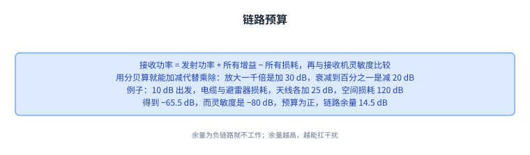

+++
title = "无线链路：**共享介质**带来的四个差异"
lecture = 51
slug = "wireless-links"
status = "draft"
source_kind = "textbook"
source_url = "https://textbook.cs168.io/wireless/wireless-links.html"
source_title = "Wireless Links"
output_mode = "explanation"
+++

> 来源课程：UC Berkeley CS168 Computer Networks（教材 CS 168 Textbook）；
> 对应内容：Wireless 之 Wireless Links（<https://textbook.cs168.io/wireless/wireless-links.html>）；
> 上游许可：教材站在站根页声明 CC BY-SA 4.0（第二人复核见 `docs/audit/license-cs168-second-review.md`）；
> 本文由 CourseLingo 原创撰写：**按该节的推进顺序**重新讲解，关键句给出英文原文与中译，**不逐句全译**，配图全部自绘、不转载原图；
> 本文非官方材料，CourseLingo 与 UC Berkeley 及课程教学团队无隶属关系；如与原文有出入，以原文为准。

## 一、无线比互联网还早

无线通信的历史其实早于[[term:internet]]。1880 年代，Bell 与 Tainter 的光电话尝试用光束无线传数据；1890 年代，Marconi 的无线电报尝试用无线电波传数据；同样是 1890 年代，Bose 做过毫米波实验，而今天毫米波又重新成为活跃的研究方向。

想象无线通信时，人们容易把它想成「看不见的粒子沿着一条假想的链路从 A 飞到 B」，教材说这并不准确，它更像池塘里的涟漪：发出去就向外扩散并在远处变弱；别人也在发时，涟漪之间会相互干涉；涟漪还会被物体反射或折射。

这一讲要解决的是有线和无线之间到底差在哪。教材把它归纳成四个差异，它们主要影响第一层与第二层，只有少数例外留到后面讲，其中一个例外很关键：为了性能，把可靠性实现在第二层，也就是主动破坏端到端原则。

四个差异分别是：无线是共享介质（有线不是）；无线信号随距离衰减（有线不衰减）；无线环境会快速变化（有线不会）；无线的碰撞更难检测。

四个差异里，前三条改变的是「信号怎么传」，第四条改变的是「协议怎么抢信道」。

## 二、差异一：无线天生是共享介质

有线[[term:link]]默认是私有的：一根线连接两台设备；要把它变成一根线挂多台设备的多点总线，需要额外的工作；外部信号也很难**干扰**线上的信号（比如可以给线加屏蔽层）；线上用电压传数据，高电压是 1、低电压是 0（有线链路在第二层通常就是以太网 Ethernet）。

无线链路的性质正好相反：默认就是共享的。发一个信号，它会向各个方向辐射出去；要在两台主机之间做出私有的点对点链路，反而需要额外的工作；也很难把信号屏蔽起来不受外部干扰。承载数据的不再是电压，而是无线电波（今天你手机连的 Wi-Fi 就落在这一层）。

这里要顺手记住「默认」这个词：差异不在于「能不能」，而在于「不做额外工作时会怎样」。

共享这件事一旦成为默认，后面所有协议都要围着「别把别人的信号盖掉」来设计。

## 三、怎么把数据编进电磁波：调制

直接拿 0 与 1 的序列画成波形行不行？教材说不合适：这样得到的波形频率很低，而低频信号又弱又难传。

于是要用**调制（modulation）**。先有一个载波：一个频率固定的波（比如正弦波），它本身不携带信息，但频率高、容易传。然后把要发数据信号（也叫调制信号）叠加到载波上：结果既保持了高频（好传），又带上了我们想发的数据。接收端要做的是反过来，从这个被调制的波形里把 0 与 1 重新提取出来。

具体的调制策略教材讲了两种常见的。幅度调制（AM）改变载波的高度：要发 1 就让正弦波高、要发 0 就让正弦波矮。频率调制（FM）改变载波的频率（也就是胖瘦）：要发 1 就让正弦波瘦（频率更高）、要发 0 就让正弦波胖（频率更低）。此外还有更复杂的策略，比如相位调制，或者幅度与相位的组合。

调制的代价是接收端要多做一步解调，换来的是信号能真的传得出去。

## 四、噪声、干扰，以及两个要会用的公式

既然是共享介质，就必须处理噪声与干扰，它们会让收到的信号变坏。噪声始终存在，哪怕附近没人在发数据（就像身边没人说话时，环境里仍有本底声响），这种本底噪声叫**噪声底**。干扰则是别的发送方有意发出的、会干扰我们的信号。

衡量接收端链路质量的一个指标是 SINR（信号与干扰加噪声之比）：信号功率除以「干扰功率加噪声功率」。它是个无量纲的比值，也可以用分贝（dB）表示，那是对比值取对数的一种写法：0 dB 对应比值 1，SINR 增加 10 dB 对应比值变成 10 倍。

这个公式告诉我们一件很直接的事：噪声越大，就得用更大的功率发。此外还可以用编码增益（也就是纠错码）：即使信号很弱、混在噪声里，只要冗余足够，接收端仍能把信号还原出来。

另一个关键公式是香农容量：给定了信道上的噪声与干扰，它给出「单位时间最多能发多少数据」的理论上限。

> "The equation works not just for wireless links, but also other types of links (e.g. wires)."
> （这个公式不只适用于无线链路，也适用于其他类型的链路，比如导线。）

公式里 B 是信道带宽，SINR 是信号与干扰加噪声之比，C 是每秒能发的比特数上限。注意这里的带宽指的是接收端能理解的最高频率与最低频率之差。它告诉我们两件事：[[term:bandwidth]]越大，单位时间能发越多；SINR 越高（信号更强或噪声更少），单位时间也能发越多。如果我们要的是一条有具体容量目标（比如 1 Mbps）的链路，就可以把链路的物理参数代进去，看它是否达标。

教材拿老式电话系统当例子：带宽 3 kHz（也就是能理解 300 Hz 到 3300 Hz 之间的频率），SINR 约 20 dB，换算成比值是 100；代进公式算出容量约 20 kbps。

这两个公式一个管质量、一个管上限，而它们共用同一个量：SINR。

（就地说明） 原文这个例子里写的是 \(C = 4000 \cdot \log_2(1+100) \approx 20000\)。按它自己给的带宽 3 kHz（3300 − 300 = 3000 Hz）算，应为 \(3000 \times \log_2(101) \approx 19970\)，与它给出的 20000 相符；若真按 4000 算则是约 26630，与 20000 不符。也就是说，原文这一处的 4000 与它自己的「3 kHz」和「约 20000」都不能同时成立。我们照录原写法并在此说明，供平台判据留存。

## 五、差异二：衰减，以及一对根本取舍

无线信号随距离显著变弱；有线信号也会变弱一点，但影响小得多。所以在无线系统里必须把衰减当成设计对象，而在有线系统里衰减通常不是关键问题。

这带来一对根本取舍：我们希望链路准、快、传得远，同时又希望省能源（比如笔记本的电）与少占频谱（频谱很贵）。而教材点明：更好的信号，代价就是更多功率或更多带宽。

想把这件事算清楚，就要有模型。自由空间模型（也叫视距模型）假设收发双方处在一个完全空的环境里：信号向各方向辐射，没有任何障碍物，连地球表面都没有。

在这个模型里，接收功率与距离的平方成反比，这来自平方反比定律：距离翻倍，接收到的信号只有原来的四分之一；距离变成 10 倍，只剩百分之一。直观的解释是信号向外辐射时铺在一个球面上，而半径 r 的球面积是 4πr²，所以在传播过程中，信号被摊开的面积按距离的平方增长。

把天线也算进来，就得到 Friis 方程：接收功率等于发射功率乘以两端天线的增益，再乘以两个因子，一个来自平方反比定律，另一个来自接收天线的有效孔径（可以想成面积，公式是 λ²/4π，教材用「用手电照纸，纸越大接到的光越多」来打比方，并说明公式里的 (4π)² 正是这两个 4π 相乘的结果）。把这个方程两边同除以发射功率，得到的是相对信号强度；两边取对数，就变成用分贝写的版本。教材最后提醒：自由空间模型是个理想模型，现实中有障碍物（哪怕是地球表面），实际达不到这个理想值。

记住 1/d² 的来源：它不是凭空的规定，而是球面积随距离平方增长的结果。

## 六、**链路预算**：把所有增益与损耗加起来

既然信号会变弱，怎么判断一条链路到底能不能用？办法是算链路预算，也就是把链路上的所有增益与损耗都算进来：接收功率等于发射功率，加上所有增益（比如天线增益），减去所有损耗（比如远距离的路径损耗），再与接收机的灵敏度（能提取出有用信息所需的最低信号强度）比较。预算为正，链路可用；预算为负，链路就有麻烦。

用分贝算有一个很实际的好处：加法代替乘法。功率放大 1000 倍相当于加 30 dB，衰减到 1% 相当于减 20 dB。

教材还给了一个完整的例子：发射功率 10 dB，经过电缆、避雷器、又一段电缆，依次损耗 0.44 dB、0.1 dB、2.21 dB；发信天线给出 25 dB 增益；信号在空间里走 10 公里，损耗 120 dB；收信天线再给 25 dB 增益；再经过三段电缆，损耗 0.44 dB、0.1 dB、2.21 dB 后到达接收机。把这些加起来：10 减去三段损耗、加上 25、减去 120、加上 25、再减去三段损耗，得到接收端信号强度 −65.5 dB。接收机灵敏度是 −80 dB，也就是它能拾取任何高于 −80 dB 的信号；而 −65.5 dB 高于 −80 dB，所以这条链路的预算是正的，能用。

接收端信号强度与灵敏度之差叫链路余量。上文例子里余量是 14.5 dB。余量为负链路就不工作；余量越高，说明信号越可靠、越能扛干扰。

链路预算的实用价值在于：把一整条链路上每一段的账，压成一次加减法。

## 七、差异三：环境在变，以及怎么近似路径损耗

无线环境会快速变化：设备会移动；障碍物会移进移出；别的通信会开始干扰。前面的自由空间模型把距离 d 当成常数、也不考虑障碍与干扰，那么在现实中模型会变成什么样？

教材给的做法是把总效果看成三张图相加：第一张是自由空间路径损耗，随距离缓慢而稳定地下降（平方反比）；第二张是阴影，障碍物挡住信号，信号只能绕射或反射过去，于是收端更弱，它的方向不一定单调，走过一栋楼时信号可能先变弱、走过去之后又变强；第三张是多径衰落，信号在障碍物上反射折射后，有几份错开的副本到达收端，相位不同就会互相干涉，它带来非常细粒度的起伏：距离挪一点点，强度就可能变。设备不动时，信号强度是这条曲线上的某个点；设备一动，就在曲线上走；环境一变，曲线本身也会跟着变。

要精确算路径损耗很难。教材先给一个相对简单的模型：两径模型，假设信号只走两条路，一条视距直达，一条在地面反射后到达。当收发距离足够远时，两条路的波会相差 180 度、相互抵消，信号随距离以 1/d⁴ 衰减，比自由空间的 1/d² 掉得快得多，差别就在于自由空间模型假定了连地球表面都没有障碍物。

障碍物更多时，可以用射线追踪模型，把反射、散射、绕射都算上，但它需要环境的具体信息（比如障碍物在哪），通常靠计算机仿真来建；这类模型里，反射来的分量往往盖过未被遮挡的直射分量。从这些模型出发，教材给出一个简化的路径损耗模型：接收功率等于发射功率乘以一个与环境有关的常数 K，再乘以距离的 γ 次方；K 与 γ 都是由环境与模型决定的经验常数（比如障碍物位置很糟糕时 K 会很小）；实践中 γ 落在 2 到 8 之间，最好情况对应 1/d²，最差情况对应 1/d⁸。

三张图各自的时间尺度不同，这正是同一个距离上信号强度看起来忽强忽弱的原因。

（就地说明） 原文把简化模型写成 \(P_r = P_t K d^\gamma\)。同一段紧接着说「信号强度与 1/d² 成正比、最差是 1/d⁸」，也就是距离越长信号越弱；而按字面上的 \(d^\gamma\)（γ 在 2 到 8 之间）算出来却是距离越长信号越强，两者不能同时成立。按前后文的意思，指数上应当带负号，即 \(d^{-\gamma}\)。我们照录原写法并在此说明。

## 八、差异四：碰撞更难检测，以及 CSMA 的两个经典问题

有线里的[[term:collision]]通常容易发现：点对点链路上甚至可能根本不会碰撞；多数情况下只要感知导线就行（传播时延会带来一些麻烦，但线上终究只有一个信号要感知）。无线的碰撞则难得多，因为它有了空间属性：波可能在这个地方撞上，在另一个地方却没撞上。

设计碰撞检测与避免因此更难，但为了让大家共用介质又必须做。教材提到[[term:multiple-access]]有很多思路（固定分配频率、协调谁在什么时间发），哪种最好取决于环境；比如在荒郊野外，让碰撞发生、事后处理也可以。这一讲聚焦 CSMA（载波侦听多路访问）：先听，听到别人在说就先不说。

为了简化，教材做了一组假设：忽略障碍物，于是信号向各方向均匀辐射；信号在一定距离内保持满强度，超过就完全收不到；例子里的设备排成一条线，只需考虑信号向左和向右传播（现实中信号是向三维空间辐射的）。

CSMA 判断「别人在不在说」的办法是检测能量是否超过某个阈值。它在两种情形下工作得很好：两对设备离得足够远时（A 与 B 通信、C 与 D 通信，C 听不到 A，于是也能发）；两对设备互相在范围内时（C 听到 A 在发，就等 A 说完再发）。

但有三种情形会出问题，其中两种是经典问题。第一种是**隐藏终端**：A 与 C 都想发给 B；A 先发，C 因为听不到 A 也开始发，于是在 B 处碰撞，两个发送方互相听不到，就无法察觉对方在发。第二种是**暴露终端**：B 想发给 A、C 想发给 D；B 先发，它的信号向各方向传播、也传到了 C，于是 C 听到后保持沉默。可仔细看，B 与 C 本来是可以同时发的：碰撞只会发生在 B 与 C 之间的空间里，而两个接收方 A 与 D 都察觉不到碰撞。

两个问题合起来说明：在无线里，「我没听到」与「没人发」并不是一回事。

## 九、MACA：让接收方来发话

CSMA 的根本毛病在于侦听的位置：发送方在检测碰撞，而真正出问题的位置是接收方。MACA（多路访问与碰撞避免）的思路就是让接收方发话。它把一次成功的数据传输拆成三步。

第一步，A 发一个 RTS（请求发送）[[term:packet]]，里面带上数据长度，等于说「我想给 B 发 k 比特」。第二步，B 回一个 CTS（允许发送）分组，也带长度：它告诉 A 可以发了，同时确认接收侧没有碰撞；这个 CTS 还警告 B 范围内的所有人「我是 B，我要收 k 比特，这段时间请别说话」。第三步，A 发数据、B 收数据，而 CTS 的警告保证了接收方范围内的其他人在这段时间保持安静。

这就解决了隐藏终端问题：A 若发 RTS，B 会回 CTS，而 CTS 会警告 B 范围内的所有人（包括 C）闭嘴。

规则还可以按「你听到什么」来记：听到 RTS，说明你在发送方范围内，发送方正在等 CTS，所以你要安静一个时隙，别用自己的数据把发端要收的 CTS 冲掉；随后又听到 CTS，说明你也在接收方范围内，那么整个数据传送期间你都得安静；没听到 CTS，说明你不在接收方范围内，可以发自己的数据。

在特定假设下，这套[[term:protocol]]也能解决暴露终端问题：B 发 RTS 时，C 会推迟一个时隙（免得冲掉 B 的 CTS）；接着 C 没听到 CTS，说明它不在接收方（A）的范围内，于是 C 可以安全地发给 D。

但这个假设本身有个漏洞：C 必须能听到 D 的 CTS。问题在于 C 同时在听 B 的数据，于是它可能听不到自己需要的那个 CTS。教材把这个差别点得很清楚：CSMA 里发送方只管发，而 MACA 里发送方必须先收到一个 CTS 才能开始发，而这个 CTS 在暴露终端的情形下可能被冲掉。

如果发了 RTS 却没等到对应的 CTS，说明自己没被放行：接收端发生了碰撞，可能是接收端正在收数据，也可能是它同时收到两个请求。这时就退避重试，采用**二进制指数退避**（做法与 CSMA/CD 类似），等的时间最多翻一倍再发下一个 RTS。

MACA 里每台设备维护一个 CW（竞争窗口），它表示碰撞之后该等多久再重新请求：碰撞后（没等到 CTS）就在 0 到 CW 之间随机取一个数等这么久再请求。CW 最小是 2 个时隙、最大 64 个时隙，其中一个时隙等于发一个 RTS 的时间。RTS/CTS 成功就把 CW 重置回最小值 2；RTS 失败（没 CTS）就把 CW 翻倍，并且封顶不超过 64。

三步里最关键的一步是 CTS：说话的人从发送方换成了接收方，隐藏终端才被解开。

## 十、MACAW 的几项改进，以及它没解决的问题

MACAW（Multiple Access Collision Avoidance for Wireless）在 MACA 上做了几项改进，教材逐条讲了来由。

第一项是加确认（ACK）换可靠性：在 RTS、CTS、数据之后再加一步，由接收方回一个 ack。数据丢了就不会有 ack，发送方只能重新发 RTS；数据发到了但 ack 丢了，发送方也会重发 RTS，而此时接收方可以直接回 ack 而不必回 CTS。为什么要加它？教材说得很坦白：端到端原则要求可靠性由[[term:end-host]]实现，而这里是在网络内部的一条链路上实现可靠性，目的纯粹是性能，链路层不做的话 上层的 TCP 与 IP 仍能保证正确性，但丢一个分组会让 TCP 明显放慢（拥塞窗口减半）；在链路上补上可靠性，恢复得更高效。

第二项是更公平的退避：MACA 在两边冲突时是不公平的，赢家容易一直赢、输家一直输，A 与 B 窗口都是 2、同时抢，A 赢了窗口仍是 2，B 输了窗口翻倍到 4，于是 A 更容易再次抢到，B 越等越久、窗口越翻越大。改法是让所有人共用同一个 CW：[[term:header]]里带上 CW 的值，收到分组就把自己的 CW 设成它，于是重试机制不再偏向任何一方（教材注明这是在「所有设备互相在范围内」的前提下成立的简化）。同时更新规则也变温和了：失败时 CW 乘 1.5（而不是翻倍），成功时 CW 减 1（而不是重置回 2），而在「RTS/CTS 成功但 ACK 失败」时 CW 不变。这套做法叫「乘性增加、线性减少」（MILD）。

第三项和第四项都围绕 DS（数据发送） 分组。先说暴露终端这一边：教材承认 MACAW 在暴露终端情形下其实无法让两次传输同时进行，因为 C 在听 B 的数据，就听不到 D 的 CTS，而它必须先收到 CTS 才能发。于是 MACAW 干脆认输，让这两次传输分开进行，并加一个 DS 分组：发送方在数据之前先喊一声「我要发 k 比特，这段时间请安静」。加上它之后，一次传输变成五步：RTS、CTS、DS、数据、ack。教材还特意说明 RTS 与 DS 并不重复：RTS 是请求，可能没被批准（比如没等到 CTS）；DS 是确认请求已被批准，并强制发送方范围内的所有人安静。

再说同步这一边，DS 还有第二个作用。回头看暴露终端：没有 DS 时，C 听到 RTS 会推迟一个时隙，但它听不到 CTS（被 B 的数据盖住），于是它只能发出没用的 RTS、永远等不到 CTS，而且完全不知道 B 什么时候发完；而 B 恰好知道自己的结束时刻，于是下一轮争抢又是 B 赢。DS 让发送方把「下一轮争抢何时开始」告诉所有人，C 因此既不必白发请求，也知道什么时候轮到自己。

第五项是 RRTS（请求 RTS），解决另一类同步问题：A 发给 B、D 发给 C 时，C 听到 CTS 必须保持安静，于是 D 永远等不到 CTS、也不知道 A 何时发完。这里的 DS 帮不上忙，因为两个发送方 A 与 D 互相不在范围内，D 听不到 A 的 DS。改法是让接收方替发送方去争抢：C 知道下一轮争抢何时开始（它会听到 B 的 ack），于是由 C 发出 RRTS 通知 D「下一轮开始了」，让 D 立刻发 RTS。规则是：听到 RRTS 就在两个时隙内保持安静，好让对方完成 RTS/CTS 交换；更一般地说，如果你听到了 RTS 但被要求保持安静、无法回应，就该发 RRTS。

教材最后留了一个没解决的问题：DS 与 RRTS 改善了同步与公平性，但不能解决所有情形。考虑 A 发给 B、C 发给 D：如果 C 正在发，A 发 RTS 时 B 根本听不到（被 C 的传输盖住），只有等 C 传输之间的短暂空隙才有机会；而此时 A 注定要输，因为它不知道 C 何时结束，而 C 自己知道。RRTS 也救不了：RRTS 只在「听到了 RTS」时才发，而 B 从没听到 A 的 RTS，也就不会替 A 发 RRTS。教材说明，MACAW 的原始论文把这个问题留着没有解决。

五项补充各治一个毛病，而教材最后留着的那个情形，恰好是接收方连请求都听不到。

## 读完应该能回答

1. 有线与无线的四个关键差异各是什么，其中哪一个例外会主动破坏端到端原则。
2. SINR 与香农容量各自衡量什么，分贝这种写法为什么让链路预算变成加减法。
3. 自由空间模型、两径模型与射线追踪模型分别在什么假设下成立，信号随距离衰减的指数怎么变。
4. CSMA 的隐藏终端与暴露终端问题各是什么，MACA 用 RTS/CTS 解决了哪一个、MACAW 又认输认在哪。

## 脉络回顾

这一讲把整门课最后一段（无线）的第一讲立起来，而它的做法是先找出有线与无线的差异，再看每一项差异会逼出什么协议。前面四十多讲几乎都建立在「链路是私有的、信号不衰减、环境不变、碰撞容易发现」这四条默认之上；这一讲逐条把它们撤掉：共享介质逼出噪声、干扰与 SINR；衰减逼出自由空间模型、Friis 方程与链路预算；环境变化逼出阴影与多径衰落、两径模型与射线追踪；碰撞难以检测则逼出 CSMA 以及它的两个经典失败（隐藏终端与暴露终端），再逼出 MACA 的 RTS/CTS 与 MACAW 的五步、共用竞争窗口、DS 与 RRTS。

最要紧的转折有两个。一个是侦听位置：CSMA 的毛病不是「侦听不对」，而是「侦听的人不对」，MACA 把发声权交给接收方，隐藏终端问题就此解开。另一个是为了性能主动破坏[[term:layering]]：教材明确说，链路层加 ack 换可靠性是网络内部实现的可靠性，目的纯粹是性能，TCP 仍然负责正确性。这一条与前面讲端到端原则那一讲正好形成对照，而它是后面无线部分反复出现的主题。教材在结尾保留的那个未解情形也值得记住：协议设计的进步往往是把问题一步步缩小，而不是一次消灭。

## 溯源

- 对应：UC Berkeley CS168 Computer Networks，教材 Wireless 之 Wireless Links（<https://textbook.cs168.io/wireless/wireless-links.html>）
- 教材：CS 168 Textbook（UC Berkeley CS168 课程教材），原文链接同上
- 授权依据：教材站在站根页声明 CC BY-SA 4.0；本文为本仓库原创中文讲解，按该节顺序重讲，关键句给出英文原文与中译，**未逐句全译**，配图自绘
- 结构说明：本讲章节顺序**跟随教材该节的推进顺序**（无线简介 → 共享介质 → 调制 → 噪声与干扰 → 衰减 → 自由空间模型 → 链路预算 → 环境变化 → 路径损耗近似 → 碰撞检测 → CSMA 的问题 → MACA → MACAW 的五项改进）；教材的衰减与自由空间模型分两节，我们并成一节；环境变化与路径损耗近似并成一节；MACAW 的五个特性并成一节。合并后共 10 个内容节、配 10 张图
- 照录并就地说明（两处）：香农容量例子里原文写 `4000 · log2(1+100) ≈ 20000`，按它自己给的 3 kHz 带宽应为 `3000 · log2(101) ≈ 19970`，4000 与后两者不能同时成立；简化路径损耗模型原文写 `P_r = P_t K d^γ`，与同段「与 1/d² 到 1/d⁸ 成正比」的方向相反，指数应带负号
- 我们的归纳（源文没有明说）：把四个差异写成「撤掉四条默认假设」；把 MACA 的要点收成「侦听的人不对」，把 MACAW 的 ack 收成「为性能主动破坏分层」
- 术语说明：`SINR`、`MACA`、`MACAW`、`RTS`、`CTS`、`DS`、`RRTS`、`CW`、`ACK` 在术语表里没有对应键，因此按纯文本书写，不加术语标记